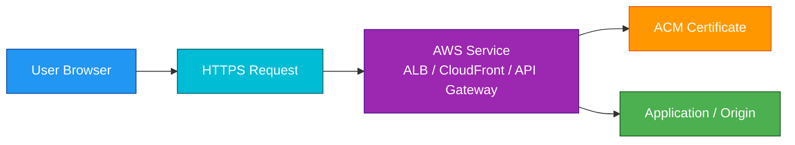
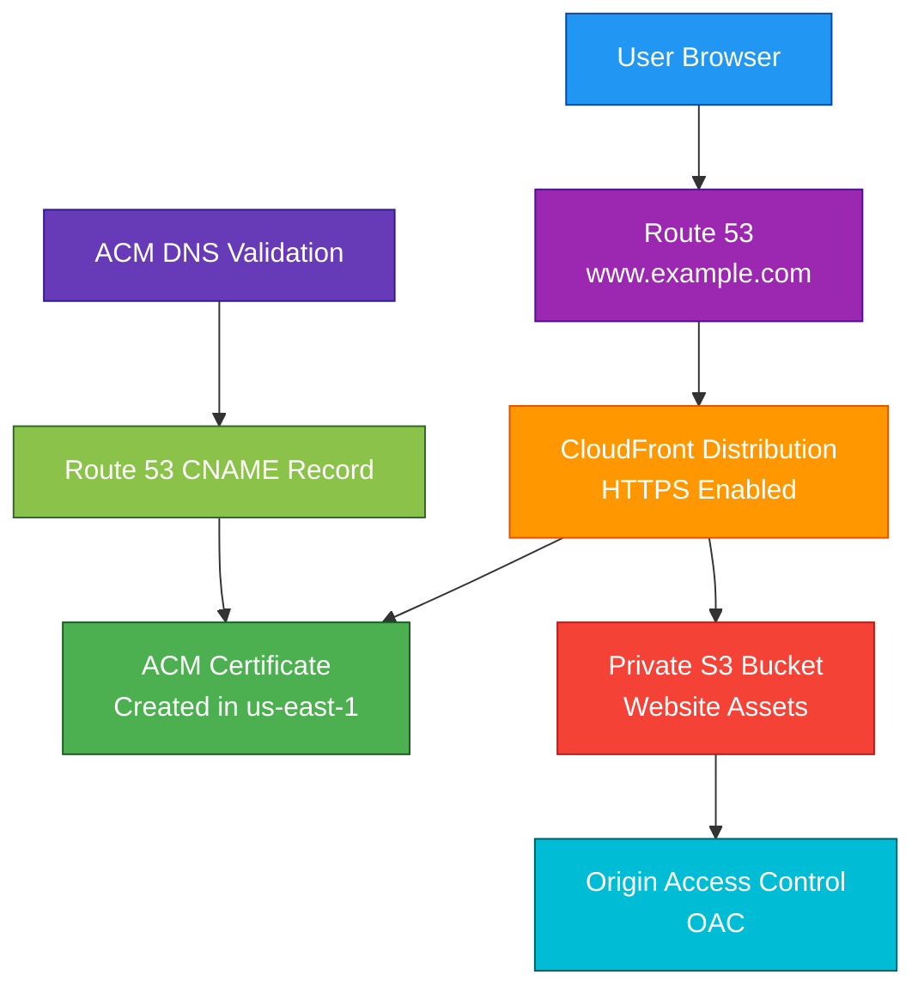

# ACM

## 1. Definition

### Simple Definition

AWS Certificate Manager, or ACM, is a managed service for provisioning, managing, and renewing SSL/TLS certificates.

These certificates are used to secure websites, applications, APIs, and internal services with HTTPS.

### Memory Hook

ACM = AWS Certificate Manager = HTTPS certificates made easier.

### Basic Idea

Instead of manually buying, uploading, tracking, and renewing certificates, ACM helps you request and manage certificates directly in AWS.

### What ACM Manages

ACM helps manage:

- Public SSL/TLS certificates
- Private SSL/TLS certificates
- Certificate validation
- Certificate renewal
- Certificate deployment to supported AWS services

## 2. What Problem Does It Solve?

### Main Problem

ACM solves the problem of managing SSL/TLS certificates manually.

Certificates are required for HTTPS, but manual certificate management can be error-prone.

### Without ACM

You may need to manually handle:

- Buying certificates
- Generating certificate signing requests
- Proving domain ownership
- Uploading certificates
- Tracking expiration dates
- Renewing certificates
- Replacing certificates on services

### With ACM

ACM can request, validate, store, and automatically renew certificates used with supported AWS services.

### Key Benefit

ACM makes HTTPS easier, safer, and more automated for AWS applications.

## 3. Core Use Cases

### Secure Public Websites

Use ACM certificates with services like CloudFront or Elastic Load Balancing to provide HTTPS for public websites.

Example:

`https://www.example.com`

### Secure APIs

Use ACM certificates with API Gateway custom domains.

Example:

`https://api.example.com`

### Secure Load Balancers

Use ACM certificates with Application Load Balancers or Network Load Balancers to terminate TLS.

### CloudFront HTTPS

Use ACM certificates with CloudFront distributions to secure global websites and content delivery.

Important exam point:

CloudFront requires ACM certificates to be created in `us-east-1`.

### Internal Private Certificates

Use ACM Private CA with ACM to issue private certificates for internal applications and services.

Examples:

- Internal APIs
- Private microservices
- Internal load balancers
- Mutual TLS systems

### Certificate Renewal Automation

ACM can automatically renew eligible certificates, reducing the risk of expired certificates causing outages.

## 4. Important Features for SAA

### Public Certificates

ACM can issue public SSL/TLS certificates for public domain names.

Examples:

- `example.com`
- `www.example.com`
- `api.example.com`

Public ACM certificates are commonly used with:

- CloudFront
- Application Load Balancer
- Network Load Balancer
- API Gateway
- Elastic Beanstalk

### Private Certificates

Private certificates are used for internal systems.

They require AWS Private Certificate Authority, also called AWS Private CA.

Use private certificates when the certificate should not be trusted publicly on the internet.

### Supported AWS Services

ACM integrates with many AWS services.

Common SAA services:

| Service | ACM Use |
|---|---|
| CloudFront | HTTPS for global distributions |
| Application Load Balancer | HTTPS listener certificates |
| Network Load Balancer | TLS listener certificates |
| API Gateway | HTTPS for custom domains |
| Elastic Beanstalk | HTTPS for applications |
| AWS Global Accelerator | Secure listener endpoints where supported |

### Domain Validation

Before ACM issues a public certificate, you must prove that you own or control the domain.

Validation methods:

| Method | Description |
|---|---|
| DNS Validation | Add a DNS record to prove domain ownership |
| Email Validation | Approve validation email sent to domain contacts |

### DNS Validation

DNS validation is usually preferred.

It is easier to automate and supports automatic renewal better.

Example:

ACM gives you a CNAME record.

You add it to Route 53 or your DNS provider.

### Email Validation

Email validation sends approval emails to domain-related email addresses.

It is less automation-friendly than DNS validation.

### Automatic Renewal

ACM can automatically renew public certificates that it issued, as long as validation remains in place and the certificate is associated with supported AWS services.

### Imported Certificates

You can import certificates from a third-party certificate authority into ACM.

Important points:

- Useful when you already have a certificate
- ACM does not automatically renew imported certificates
- You must track and replace them yourself before expiration

### Certificate Region

ACM certificates are regional.

A certificate created in one Region is not automatically available in another Region.

Important exception pattern:

CloudFront is global, but it requires the ACM certificate in `us-east-1`.

### CloudFront Certificate Rule

For CloudFront custom domain HTTPS, request or import the ACM certificate in:

`us-east-1`

This is a very common SAA exam trap.

### Wildcard Certificates

ACM supports wildcard certificates.

Example:

`*.example.com`

This can secure:

- `app.example.com`
- `api.example.com`
- `blog.example.com`

Important point:

`*.example.com` does not secure `example.com` itself.

You may need both names on the certificate.

### Subject Alternative Names

Subject Alternative Names, or SANs, let one certificate secure multiple names.

Example certificate names:

- `example.com`
- `www.example.com`
- `api.example.com`

### Certificate Deployment

ACM certificates can be attached to supported AWS services.

You usually do not download the private key for public ACM-issued certificates.

### Private Key Protection

For public certificates issued by ACM, AWS protects the private key and does not allow you to export it.

This improves security.

### ACM Private CA

ACM Private CA lets you create a private certificate authority.

Use it when you need private certificates for internal systems.

Important point:

ACM Private CA has additional cost.

## 5. Security Model

### IAM Permissions

IAM controls who can request, import, delete, and use ACM certificates.

Common permissions:

| Permission | Purpose |
|---|---|
| `acm:RequestCertificate` | Request a new certificate |
| `acm:ImportCertificate` | Import an external certificate |
| `acm:ListCertificates` | List certificates |
| `acm:DescribeCertificate` | View certificate details |
| `acm:DeleteCertificate` | Delete a certificate |
| `acm:AddTagsToCertificate` | Add tags |
| `acm-pca:IssueCertificate` | Issue private CA certificates |

### Domain Ownership Validation

ACM requires domain validation before issuing public certificates.

This prevents someone from requesting a certificate for a domain they do not control.

### Encryption in Transit

ACM certificates enable TLS encryption in transit.

They help protect data moving between:

- Users and CloudFront
- Users and load balancers
- Users and API Gateway
- Internal clients and private services

### Encryption at Rest

ACM protects certificate private keys.

For ACM-issued public certificates, private keys are securely managed by AWS and are not exportable.

### Private Key Security

Important exam point:

You cannot export the private key of a public certificate issued by ACM.

If you need to install a certificate outside supported AWS services, you may need to import your own certificate instead.

### Route 53 Integration

If your domain uses Route 53, ACM DNS validation is easier because ACM can help create the required DNS validation records.

### Least Privilege

Only trusted administrators should be allowed to:

- Request certificates
- Delete certificates
- Import certificates
- Manage private CAs
- Attach certificates to production services

### Private Certificate Security

For private certificates, manage:

- Private CA permissions
- Certificate templates
- Revocation settings
- CA hierarchy
- Internal trust stores
- Certificate lifecycle

### Shared Responsibility

AWS is responsible for:

- ACM service infrastructure
- Protecting ACM-managed private keys
- Managed certificate renewal for eligible certificates
- Physical security
- Service availability

You are responsible for:

- Domain validation
- Choosing the right certificate names
- IAM permissions
- Attaching certificates to services
- Renewing imported certificates
- DNS records
- Private CA governance
- Removing unused certificates

## 6. High Availability / Durability Behavior

### Availability

ACM is a managed AWS service.

AWS manages the certificate management infrastructure.

### Regional Behavior

ACM certificates are regional.

For most regional AWS services, the certificate must exist in the same Region as the service.

Example:

An Application Load Balancer in `us-west-2` needs an ACM certificate in `us-west-2`.

### CloudFront Global Behavior

CloudFront is a global service.

For CloudFront, ACM certificates must be in `us-east-1`.

This is one of the most important exam facts for ACM.

### Multi-AZ Behavior

ACM itself does not require you to configure Multi-AZ.

The AWS service using the certificate, such as ALB or CloudFront, handles its own availability model.

### Multi-Region Behavior

If you deploy the same application in multiple Regions, you usually need ACM certificates in each Region.

Example:

- ALB in `us-east-1` uses certificate in `us-east-1`
- ALB in `eu-west-1` uses certificate in `eu-west-1`

### Certificate Renewal Availability

ACM can renew eligible certificates automatically.

This helps prevent application downtime caused by expired certificates.

### Imported Certificate Risk

Imported certificates are not automatically renewed by ACM.

If you forget to renew and reimport them, HTTPS can break when the certificate expires.

### Durability

ACM stores certificate information as part of a managed AWS service.

For SAA, focus on:

- Automatic renewal
- Regional certificate scope
- Integration with highly available AWS services
- Private key protection

## 7. Cost Optimization Options

### Public ACM Certificates Are Free

Public certificates issued by ACM are free when used with integrated AWS services.

This is a common cost benefit.

### Use ACM Instead of Third-Party Certificates When Possible

For AWS-hosted workloads, ACM public certificates can reduce cost and operational work compared to buying certificates externally.

### Avoid Unnecessary Private CAs

ACM Private CA has additional cost.

Use it only when you need private certificates for internal systems.

### Reuse Certificates Carefully

One certificate can include multiple domain names using SANs.

This can simplify management.

Example:

- `example.com`
- `www.example.com`
- `api.example.com`

### Use Wildcard Certificates Carefully

Wildcard certificates can reduce the number of certificates needed for subdomains.

Example:

`*.example.com`

But avoid overly broad use if separate security boundaries are needed.

### Clean Up Unused Certificates

Delete certificates that are no longer used.

This helps reduce confusion and improves security hygiene.

### Avoid Imported Certificate Renewal Overhead

Imported certificates require manual renewal.

Use ACM-issued certificates when possible to avoid operational effort and outage risk.

### Use DNS Validation

DNS validation is easier to automate and maintain.

It reduces manual renewal effort compared with email validation.

### Watch Private CA Costs

Private CA is powerful but can be expensive for small use cases.

Use it when internal certificate management is truly needed.

## 8. Common Exam Traps

### CloudFront Certificate Must Be in `us-east-1`

This is the biggest ACM exam trap.

If using ACM with CloudFront, create or import the certificate in `us-east-1`.

### Certificates Are Regional

For regional services like ALB and API Gateway regional endpoints, use a certificate in the same Region as the service.

### ACM Public Certificate Private Key Cannot Be Exported

For public ACM-issued certificates, you cannot download the private key.

Use the certificate with supported AWS services.

### Imported Certificates Are Not Auto-Renewed

ACM does not automatically renew imported third-party certificates.

You must renew and reimport them manually.

### DNS Validation Is Usually Preferred

DNS validation is easier for automation and renewal.

Email validation can create operational problems if emails are missed.

### Wildcard Certificate Does Not Cover Root Domain

`*.example.com` covers `app.example.com`.

It does not automatically cover `example.com`.

Include both names if needed.

### ACM Does Not Host Your Website

ACM only manages certificates.

You still need services like:

- CloudFront
- ALB
- API Gateway
- EC2
- S3 static website hosting

### ACM Is Not Route 53

ACM manages certificates.

Route 53 manages DNS.

They often work together for domain validation and routing.

### Certificate Must Match Domain Name

The certificate domain name must match the domain clients use.

Example:

If users visit `api.example.com`, the certificate must include `api.example.com` or a matching wildcard.

### Private Certificates Are Not Publicly Trusted

Certificates from ACM Private CA are for internal trust.

Public browsers will not automatically trust them unless the private CA is trusted by the client environment.

### Expired Certificate Causes HTTPS Failure

If a certificate expires, users may see browser warnings or connection failures.

Automatic renewal is important.

## 9. Compare With Similar Services

### Service Comparison Table

| Service | Main Purpose | Best For | Choose When |
|---|---|---|---|
| ACM | Manage SSL/TLS certificates | HTTPS for AWS services | You need certificates for ALB, CloudFront, API Gateway, or other AWS services |
| ACM Private CA | Private certificate authority | Internal private certificates | You need private PKI for internal systems |
| Route 53 | DNS management | Domain routing and DNS validation | You need DNS records or domain validation |
| IAM Server Certificates | Older certificate storage option | Legacy use cases | Use ACM instead when possible |
| AWS Secrets Manager | Store secrets | API keys, passwords, credentials | You need secret rotation and secure storage |
| CloudFront | CDN and HTTPS edge delivery | Secure global content delivery | You need global caching with TLS |

### ACM vs Route 53

| Feature | ACM | Route 53 |
|---|---|---|
| Main purpose | Certificate management | DNS management |
| Handles HTTPS certificates | Yes | No |
| Handles DNS records | No | Yes |
| Common use together | DNS validation | Create validation CNAME record |
| Example | Certificate for `api.example.com` | DNS record for `api.example.com` |

### ACM vs ACM Private CA

| Feature | ACM Public Certificate | ACM Private CA |
|---|---|---|
| Trust | Publicly trusted | Privately trusted |
| Best for | Public websites and APIs | Internal services |
| Cost | Public ACM certs are free | Private CA has additional cost |
| Common use | CloudFront, ALB, API Gateway | Internal TLS, mTLS, private apps |

### ACM vs Imported Certificate

| Feature | ACM-Issued Certificate | Imported Certificate |
|---|---|---|
| Issued by | ACM | External certificate authority |
| Automatic renewal | Yes, if eligible | No |
| Private key export | No for public ACM certs | You already manage the key |
| Best for | AWS-integrated HTTPS | Existing or externally managed certs |

### ACM vs IAM Server Certificates

| Feature | ACM | IAM Server Certificates |
|---|---|---|
| Modern choice | Yes | Legacy |
| Auto-renewal | Yes for eligible ACM certs | No |
| Integration | Broad AWS service support | Limited legacy use |
| Exam tip | Choose ACM | Avoid unless legacy requirement |

### When to Choose ACM

Choose ACM when:

- You need HTTPS for AWS services
- You need SSL/TLS certificates
- You use CloudFront, ALB, NLB, or API Gateway
- You want managed renewal
- You want DNS-based validation
- You need public certificates for internet-facing apps
- You need private certificates with ACM Private CA

## 10. Mini Architecture Example

### Scenario

A company hosts a public website using CloudFront and an S3 origin.

They want users to access the site securely using:

`https://www.example.com`

### Architecture

Use ACM to request a public certificate for `www.example.com`.

Validate the domain using DNS in Route 53.

Attach the certificate to CloudFront.

Route 53 points the domain to the CloudFront distribution.

### Why This Is Good

- ACM provides the SSL/TLS certificate
- DNS validation proves domain ownership
- CloudFront serves the website globally over HTTPS
- Route 53 routes the custom domain to CloudFront
- S3 can remain private using Origin Access Control
- ACM can automatically renew the certificate

### Exam Answer Pattern

If the question says:

“Secure a custom domain with HTTPS for an AWS service.”

Think:

AWS Certificate Manager.

If the service is CloudFront, remember:

The ACM certificate must be in `us-east-1`.

### Final Memory Hook

ACM manages certificates.

Route 53 manages DNS.

CloudFront delivers content globally.

ALB terminates HTTPS for applications.

API Gateway uses ACM for custom HTTPS domains.

Private CA issues internal certificates.

