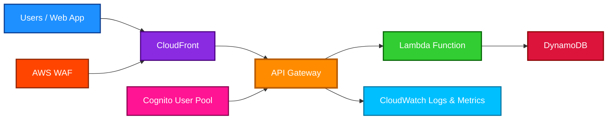

# AWS API Gateway

<details>
<summary>1. Definition</summary>

## 1. Definition

### Simple Definition

AWS API Gateway is a fully managed service for creating, publishing, securing, monitoring, and managing APIs.

Think of it as the **front door** for applications to access backend services like:

- AWS Lambda
- Amazon ECS / EC2
- HTTP services
- AWS services
- Private VPC applications

### Beginner Analogy

API Gateway is like a **reception desk**:

- Users send requests to the desk.
- The desk checks security.
- The desk routes the request to the correct backend.
- The backend responds through the desk.

### API Gateway Supports

| API Type | Best For |
|---|---|
| REST API | Full-featured APIs with advanced controls |
| HTTP API | Lower-cost, simpler REST-style APIs |
| WebSocket API | Real-time two-way communication |

### Memory Hook

> **API Gateway = Secure front door for backend services**

</details>

<details>
<summary>2. What Problem Does It Solve?</summary>

## 2. What Problem Does It Solve?

### Main Problem

Without API Gateway, you would need to build and manage your own API layer, including:

- Request routing
- Authentication
- Authorization
- Rate limiting
- Throttling
- Logging
- Monitoring
- CORS handling
- Custom domains
- API versioning
- Request/response transformation

API Gateway gives you these features as a managed service.

### Why It Matters for Serverless

API Gateway is commonly used with AWS Lambda to build **serverless APIs**.

Example:

```text
Client → API Gateway → Lambda → DynamoDB
```

You do not manage servers for the API layer.

### Key Exam Idea

API Gateway helps expose backend services securely over HTTPS without managing API infrastructure.

</details>

<details>
<summary>3. Core Use Cases</summary>

## 3. Core Use Cases

### Serverless APIs

Use API Gateway in front of Lambda functions.

Common pattern:

```text
Mobile App → API Gateway → Lambda → DynamoDB
```

### Public REST APIs

Expose APIs to external users, partners, or applications.

Examples:

- E-commerce checkout API
- User registration API
- Payment processing API
- Product catalog API

### Internal Private APIs

Use private API Gateway endpoints to expose APIs only inside a VPC.

Good for:

- Internal microservices
- Private enterprise APIs
- Backend-only APIs

### Real-Time Applications

Use WebSocket APIs for two-way communication.

Examples:

- Chat apps
- Live notifications
- Real-time dashboards
- Multiplayer game messaging

### AWS Service Integration

API Gateway can call some AWS services directly without Lambda.

Examples:

- Send message to SQS
- Put item into DynamoDB
- Start Step Functions workflow

### Legacy Application Modernization

Put API Gateway in front of older applications to add:

- HTTPS
- Authentication
- Throttling
- Monitoring
- Standard API access

</details>

<details>
<summary>4. Important Features for SAA</summary>

## 4. Important Features for SAA

### API Types

| API Type | Description | Exam Tip |
|---|---|---|
| REST API | Most feature-rich option | Choose for advanced features |
| HTTP API | Simpler and cheaper REST-style API | Choose for low-cost Lambda/API backends |
| WebSocket API | Persistent two-way communication | Choose for real-time apps |

### REST API vs HTTP API

| Feature | REST API | HTTP API |
|---|---:|---:|
| Lower cost | No | Yes |
| API keys | Yes | Limited / not same as REST |
| Usage plans | Yes | No traditional REST usage plans |
| Request validation | Yes | More limited |
| AWS WAF support | Yes | Commonly associated with REST/regional setups |
| Private API endpoints | Yes | REST API-focused exam answer |
| Best for simple Lambda proxy APIs | Good | Better |

### Endpoint Types for REST APIs

| Endpoint Type | Use Case |
|---|---|
| Edge-optimized | Global clients; uses CloudFront edge locations |
| Regional | Clients in same Region or when using your own CloudFront |
| Private | Only accessible from a VPC using interface VPC endpoints |

### Integration Types

| Integration Type | Meaning |
|---|---|
| Lambda proxy integration | API Gateway sends request directly to Lambda |
| HTTP proxy integration | API Gateway forwards request to HTTP backend |
| AWS service integration | API Gateway calls an AWS service directly |
| Mock integration | API Gateway returns a response without backend |

### Stages

Stages are deployment environments for APIs.

Examples:

- `dev`
- `test`
- `prod`

A stage allows different versions or environments of the same API.

### Stage Variables

Stage variables are key-value settings for a stage.

Example:

```text
dev stage → Lambda function A
prod stage → Lambda function B
```

### Deployment

For REST APIs, after changing API configuration, you usually deploy changes to a stage.

### Caching

API Gateway caching stores responses to reduce backend calls and improve latency.

Good for:

- Frequently requested data
- Read-heavy APIs
- Reducing Lambda or database load

### Throttling

Throttling protects backends from too many requests.

API Gateway supports:

- Account-level throttling
- Stage-level throttling
- Method-level throttling
- Usage plan throttling for REST APIs

### Usage Plans and API Keys

Usage plans control who can access an API and how much they can use it.

They can define:

- Throttle limits
- Quotas
- API key associations

Important exam trap:

> API keys identify clients and support throttling/quotas, but they are **not strong authentication** by themselves.

### Request and Response Transformation

API Gateway can transform requests and responses using mapping templates.

Common use:

- Convert request format
- Rename fields
- Adapt legacy backend responses

### CORS

CORS allows browser-based applications from one domain to call APIs on another domain.

Example:

```text
React app on example.com calls API Gateway endpoint on amazonaws.com
```

API Gateway can be configured to return the correct CORS headers.

### Monitoring

API Gateway integrates with:

- Amazon CloudWatch metrics
- CloudWatch Logs
- AWS X-Ray tracing
- Access logs

Useful metrics include:

- Request count
- Latency
- Integration latency
- 4XX errors
- 5XX errors

### Memory Hook

> **REST = More features**  
> **HTTP = Cheaper and simpler**  
> **WebSocket = Real-time**

</details>

<details>
<summary>5. Security Model</summary>

## 5. Security Model

### IAM Permissions

IAM controls who can manage API Gateway resources.

Examples:

- Create APIs
- Deploy APIs
- Delete APIs
- Update stages
- View logs

IAM can also control who can invoke APIs when IAM authorization is enabled.

### API Authorization Options

| Option | Best For |
|---|---|
| IAM authorization | AWS users, roles, or services calling the API |
| Lambda authorizer | Custom authentication logic |
| Cognito user pools | User sign-in for web/mobile apps |
| Resource policies | Control access based on source, account, VPC, or IP |
| API keys | Usage tracking and quotas, not strong authentication |

### IAM Authorization

Use IAM authorization when callers are AWS principals.

Examples:

- EC2 role calling API Gateway
- Lambda function calling API Gateway
- Cross-account AWS access

Requests must be signed using AWS Signature Version 4.

### Lambda Authorizer

A Lambda authorizer runs custom code before API Gateway allows the request.

Good for:

- Custom tokens
- JWT validation
- Third-party identity providers
- Fine-grained custom authorization

### Amazon Cognito Authorizer

Use Cognito user pools when users sign in to an application.

Good for:

- Web apps
- Mobile apps
- User authentication
- JWT-based access

### Resource Policies

Resource policies are attached to the API itself.

They can allow or deny access based on:

- AWS account
- Source IP
- VPC endpoint
- IAM principal

Common exam use:

> Use a resource policy to restrict API Gateway access to specific IP ranges or VPC endpoints.

### Encryption Options

API Gateway uses HTTPS for client communication.

Common encryption points:

| Area | Encryption |
|---|---|
| Client to API Gateway | HTTPS/TLS |
| Custom domain | ACM certificate |
| API Gateway to backend | HTTPS recommended |
| Logs | CloudWatch Logs encryption options |
| Cached data | Managed by API Gateway cache layer |

### Network and Security Controls

API Gateway can use:

- AWS WAF for web attack protection
- Resource policies for access restrictions
- Private APIs for VPC-only access
- VPC links for private backend integration
- Throttling to reduce abuse
- CloudWatch logs for auditing

### Private APIs

Private APIs are accessible only through interface VPC endpoints powered by AWS PrivateLink.

Good for:

- Internal APIs
- Private microservices
- No public internet exposure

### VPC Link

VPC Link allows API Gateway to connect to private resources in a VPC.

Common backend targets:

- Network Load Balancer
- Application Load Balancer
- Private services

### Shared Responsibility

| AWS Responsibility | Customer Responsibility |
|---|---|
| Manage API Gateway infrastructure | Configure API security correctly |
| Provide managed HTTPS endpoint | Choose proper authorization |
| Scale API Gateway service | Protect backend services |
| Maintain service availability | Configure throttling and logging |
| Integrate with IAM, WAF, CloudWatch | Monitor and respond to abuse |

### Memory Hook

> **Authentication asks: Who are you?**  
> **Authorization asks: What are you allowed to do?**  
> **API keys ask: Which client/app are you?**

</details>

<details>
<summary>6. High Availability / Durability Behavior</summary>

## 6. High Availability / Durability Behavior

### Availability

API Gateway is a managed AWS service designed for high availability within a Region.

You do not manage:

- Servers
- Load balancers
- Patching
- Scaling infrastructure

### Fault Tolerance

API Gateway automatically handles scaling and availability of the API front end.

However, your full application availability also depends on the backend.

Example:

```text
API Gateway may be available, but if Lambda or the database fails, the API can still fail.
```

### Multi-AZ Behavior

API Gateway is managed across AWS infrastructure in a Region.

For the exam, remember:

> API Gateway itself is highly available, but backend design still matters.

### Multi-Region Behavior

API Gateway is Regional unless you design for multiple Regions.

For multi-Region APIs, common patterns include:

- Deploy API Gateway in multiple Regions
- Use Route 53 latency-based routing
- Use Route 53 failover routing
- Use CloudFront in front of Regional APIs

### Edge-Optimized APIs

Edge-optimized REST APIs use CloudFront edge locations to improve access for global clients.

Best when users are globally distributed.

### Regional APIs

Regional APIs are best when:

- Clients are mostly in one Region
- You want to manage your own CloudFront distribution
- You need more control over caching and routing

### Private APIs

Private APIs are for VPC-only access.

They are not public internet APIs.

### Durability

API Gateway is not mainly a data storage service.

Durability usually applies to the backend services, such as:

- DynamoDB
- S3
- SQS
- RDS
- Aurora

API Gateway may cache responses, but it is not used as durable storage.

### Memory Hook

> **API Gateway is highly available, but your backend must also be highly available.**

</details>

<details>
<summary>7. Cost Optimization Options</summary>

## 7. Cost Optimization Options

### Choose HTTP API When Possible

HTTP APIs are generally cheaper than REST APIs.

Choose HTTP API when you need:

- Simple REST-style API
- Lambda integration
- JWT authorization
- Lower cost
- Lower latency

Choose REST API when you need advanced features.

### Use Caching Carefully

Caching can reduce backend cost by lowering calls to Lambda, databases, or external services.

Good for:

- Read-heavy APIs
- Repeated requests
- Public catalog data

Be careful:

- API Gateway cache has its own cost
- Do not cache highly dynamic or sensitive responses without careful design

### Use Throttling

Throttling controls excessive traffic and protects expensive backends.

Benefits:

- Reduces unexpected cost spikes
- Protects Lambda concurrency
- Protects databases
- Prevents abuse

### Use Usage Plans

Usage plans can limit customer usage with quotas and throttling.

Good for:

- Partner APIs
- Developer APIs
- Paid API tiers

### Avoid Unnecessary Lambda

Sometimes API Gateway can integrate directly with AWS services.

Example:

```text
API Gateway → SQS
```

Instead of:

```text
API Gateway → Lambda → SQS
```

This can reduce cost and operational complexity.

### Optimize Logging

Detailed logs are useful but can increase CloudWatch costs.

Cost tips:

- Enable detailed logs where needed
- Avoid excessive logging in high-traffic APIs
- Use access logs wisely
- Set CloudWatch log retention

### Use Regional API with CloudFront When Needed

For global APIs, you can use:

- Edge-optimized API
- Regional API plus your own CloudFront distribution

Using your own CloudFront can provide more control over caching and routing.

### Memory Hook

> **Simple API? Use HTTP API.**  
> **Advanced controls? Use REST API.**

</details>

<details>
<summary>8. Common Exam Traps</summary>

## 8. Common Exam Traps

### Trap 1: API Keys Are Not Strong Authentication

API keys are mainly for:

- Identifying clients
- Usage plans
- Quotas
- Throttling

They are not a replacement for IAM, Cognito, or Lambda authorizers.

### Trap 2: REST API Has More Features Than HTTP API

If the question mentions advanced features, REST API is often the answer.

Examples:

- Usage plans
- API keys
- Request validation
- API Gateway caching
- Private REST API endpoints
- Advanced request transformations

### Trap 3: HTTP API Is Usually Better for Simple Serverless APIs

If the question says:

- Lowest cost
- Simple Lambda backend
- Basic REST-style API
- JWT authorization

Then HTTP API is often best.

### Trap 4: WebSocket API Is for Real-Time Two-Way Communication

Choose WebSocket API for:

- Chat
- Live notifications
- Real-time updates
- Persistent connections

Do not choose REST API for true two-way real-time communication.

### Trap 5: Edge-Optimized Is Not the Same as Regional

| Endpoint Type | Key Point |
|---|---|
| Edge-optimized | Uses CloudFront-managed edge distribution |
| Regional | Deployed to one Region |
| Private | VPC-only access |

### Trap 6: Private API Requires VPC Endpoint

Private API Gateway endpoints are accessed through interface VPC endpoints.

They are not public internet APIs.

### Trap 7: API Gateway Does Not Make Backend Automatically Durable

API Gateway is the API front door.

Durability depends on backend services like DynamoDB, S3, or SQS.

### Trap 8: Throttling Protects the Backend

If the question asks how to prevent too many requests from overwhelming a backend, think:

- Throttling
- Usage plans
- AWS WAF
- Caching

### Trap 9: Caching Helps Read Performance

Caching is useful when the same data is requested repeatedly.

It reduces:

- Backend load
- Latency
- Lambda invocations
- Database reads

### Trap 10: Use VPC Link for Private Backends

If API Gateway must reach a private service inside a VPC, think **VPC Link**.

### Memory Hook

> **API keys track usage. Authorizers secure users. Throttling protects backends.**

</details>

<details>
<summary>9. Compare With Similar Services</summary>

## 9. Compare With Similar Services

### Comparison Table

| Service | What It Does | Choose When |
|---|---|---|
| API Gateway | Managed API front door | You need REST, HTTP, or WebSocket APIs |
| Application Load Balancer | Layer 7 load balancing | You need HTTP routing to EC2/ECS/EKS |
| Network Load Balancer | Layer 4 load balancing | You need ultra-high performance TCP/UDP/TLS |
| CloudFront | CDN and edge caching | You need global content delivery and caching |
| AWS AppSync | Managed GraphQL API | You need GraphQL, real-time subscriptions, or flexible data queries |
| Lambda Function URL | Simple HTTPS endpoint for Lambda | You need a very simple Lambda endpoint without API Gateway features |
| AWS PrivateLink | Private service connectivity | You need private connectivity between VPCs/services |

### API Gateway vs ALB

| Feature | API Gateway | ALB |
|---|---|---|
| Best for APIs | Yes | Sometimes |
| Serverless-friendly | Very strong | Good with Lambda/ECS |
| API keys / usage plans | Yes, REST API | No |
| Request validation | Yes, REST API | No |
| WebSocket support | Yes | Limited use cases |
| Cost model | Per request | Per hour and capacity units |

### API Gateway vs CloudFront

| Service | Main Role |
|---|---|
| API Gateway | Create and manage APIs |
| CloudFront | Cache and deliver content globally |

They can work together:

```text
Client → CloudFront → API Gateway → Backend
```

### API Gateway vs AppSync

| Service | Best For |
|---|---|
| API Gateway | REST, HTTP, WebSocket APIs |
| AppSync | GraphQL APIs |

Choose AppSync when clients need flexible queries and GraphQL.

### API Gateway vs Lambda Function URL

| Feature | API Gateway | Lambda Function URL |
|---|---|---|
| Simple HTTPS Lambda access | Yes | Yes |
| Advanced routing | Yes | No |
| Authorizers | Yes | Limited |
| Usage plans | Yes, REST API | No |
| Request transformation | Yes | No |
| Best for production API platform | Yes | Usually API Gateway |

### Exam Decision Guide

| Requirement | Choose |
|---|---|
| Simple low-cost Lambda API | HTTP API |
| Advanced API management | REST API |
| Real-time two-way messaging | WebSocket API |
| GraphQL | AppSync |
| Load balance containers or EC2 | ALB |
| Global caching | CloudFront |
| Very simple Lambda HTTPS endpoint | Lambda Function URL |

</details>

<details>
<summary>10. Mini Architecture Example</summary>

## 10. Mini Architecture Example

### Scenario

A company wants to build a serverless product API for a web application.

Requirements:

- Public HTTPS API
- User authentication
- Serverless backend
- Store product data
- Monitor API errors
- Protect backend from too many requests

### Architecture

```text
Users → CloudFront → API Gateway → Lambda → DynamoDB
```

### Mermaid Diagram



### Request Flow

1. User sends an HTTPS request.
2. CloudFront improves global performance and can work with AWS WAF.
3. API Gateway receives the API request.
4. Cognito validates the user identity.
5. API Gateway invokes Lambda.
6. Lambda reads or writes data in DynamoDB.
7. API Gateway returns the response.
8. CloudWatch collects logs and metrics.

### Why API Gateway Is Useful Here

API Gateway provides:

- HTTPS endpoint
- Routing
- Authentication integration
- Throttling
- Monitoring
- CORS support
- Serverless API management

### SAA Exam Summary

For the AWS SAA exam, remember:

| Requirement | API Gateway Feature |
|---|---|
| Expose Lambda as HTTPS API | API Gateway integration |
| Protect backend from overload | Throttling |
| Track customer API usage | Usage plans and API keys |
| Authenticate app users | Cognito authorizer |
| Custom authorization logic | Lambda authorizer |
| AWS service-to-service access | IAM authorization |
| Private internal API | Private REST API with VPC endpoint |
| Real-time communication | WebSocket API |
| Lower-cost simple API | HTTP API |
| Advanced API features | REST API |

### Final Memory Hook

> **API Gateway is the managed, secure, scalable front door for APIs on AWS.**
>
> **REST = feature-rich**
>
> **HTTP = simple and cheaper**
>
> **WebSocket = real-time**
>
> **Private API = VPC-only**
>
> **Usage plans = quotas and throttling**
>
> **Authorizers = real security**

</details>