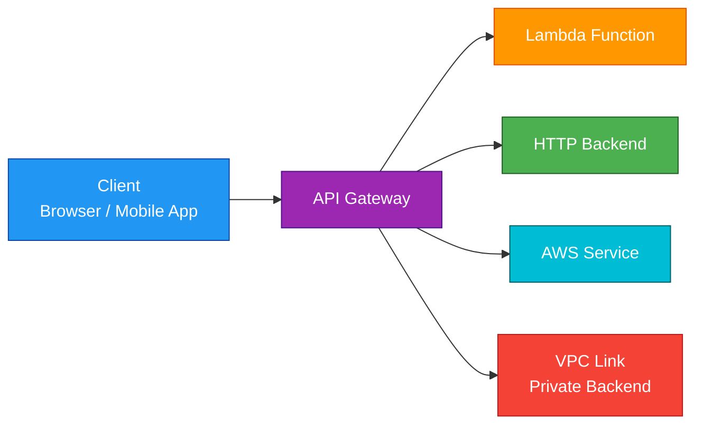
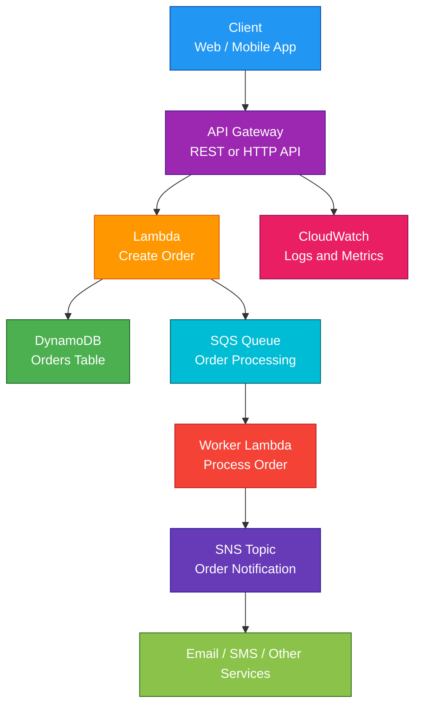

# AWS API Gateway

## 1. Definition

### Simple Definition

AWS API Gateway is a fully managed service for creating, publishing, securing, monitoring, and managing APIs.

It acts as the front door for applications, allowing clients to call backend services through HTTP, REST, or WebSocket APIs.

### Memory Hook

API Gateway = The front door for your backend.

### Basic Idea

Clients do not call your backend services directly.

They call API Gateway, and API Gateway forwards the request to the correct backend.

## 2. What Problem Does It Solve?

### Main Problem

API Gateway solves the problem of exposing backend services securely and consistently to clients.

Instead of every backend service handling authentication, throttling, monitoring, and routing by itself, API Gateway provides these features in one managed service.

### Without API Gateway

Applications may need to build and manage:

- API routing
- Authentication
- Authorization
- Rate limiting
- Request validation
- API versioning
- Monitoring
- WebSocket connection handling
- Public access to private services

### With API Gateway

API Gateway handles the API management layer.

Your backend can focus on business logic.

### Key Benefit

API Gateway helps you build secure, scalable, serverless-friendly APIs without managing API servers.

## 3. Core Use Cases

### Serverless APIs

API Gateway is commonly used with Lambda to build serverless APIs.

Example:

- Client sends request to API Gateway
- API Gateway invokes Lambda
- Lambda returns response

### REST APIs

Use API Gateway to expose RESTful APIs for web and mobile applications.

Examples:

- `GET /products`
- `POST /orders`
- `DELETE /users/{id}`

### HTTP APIs

HTTP APIs are simpler, faster, and usually cheaper than REST APIs.

Use them when you need basic HTTP API functionality with lower cost and lower latency.

### WebSocket APIs

WebSocket APIs support real-time two-way communication.

Examples:

- Chat apps
- Live dashboards
- Multiplayer games
- Real-time notifications

### Private Backend Access

API Gateway can connect to private resources in a VPC using VPC Link.

Examples:

- Private Application Load Balancer
- Private Network Load Balancer
- Internal microservices

### API Front Door

API Gateway can act as the public entry point for multiple backend services.

It can route requests to different integrations based on paths and methods.

## 4. Important Features for SAA

### API Types

API Gateway supports different API types.

| API Type | Best For | Exam Tip |
|---|---|---|
| REST API | Full-featured API management | Choose when advanced API Gateway features are needed |
| HTTP API | Low-cost, low-latency HTTP APIs | Choose for simpler APIs |
| WebSocket API | Real-time two-way communication | Choose for persistent client connections |

### REST API

REST APIs provide the most complete API Gateway feature set.

Important features:

- API keys
- Usage plans
- Request validation
- Request and response mapping
- Caching
- Stage variables
- Canary deployments
- Edge-optimized, Regional, and Private endpoints

### HTTP API

HTTP APIs are designed to be simpler and more cost-efficient.

Important features:

- Lower latency than REST APIs
- Lower cost than REST APIs
- JWT authorizers
- Lambda authorizers
- Private integrations with VPC Link
- Good for simple serverless APIs

### WebSocket API

WebSocket APIs support persistent connections between clients and backend services.

Important routes:

| Route | Purpose |
|---|---|
| `$connect` | Runs when a client connects |
| `$disconnect` | Runs when a client disconnects |
| `$default` | Runs when no specific route matches |

### Integrations

API Gateway can integrate with several backend types.

| Integration Type | Example |
|---|---|
| Lambda | Serverless API backend |
| HTTP endpoint | Public web service |
| AWS service | Direct integration with services like SQS or DynamoDB |
| Mock integration | Return response without backend |
| VPC Link | Private backend in a VPC |

### Lambda Proxy Integration

Lambda proxy integration passes the full request to Lambda.

The Lambda function is responsible for creating the response.

This is common in serverless applications.

### Non-Proxy Integration

Non-proxy integration lets API Gateway transform the request and response.

Use this when you need mapping templates or more control over payload conversion.

### Stages

Stages represent deployed versions or environments of an API.

Examples:

- `dev`
- `test`
- `prod`

### Deployments

For REST APIs, changes must be deployed to a stage before clients can use them.

### Stage Variables

Stage variables are key-value pairs used to customize behavior per stage.

Example:

- `dev` stage points to dev Lambda
- `prod` stage points to prod Lambda

### Canary Deployments

Canary deployments allow a small percentage of traffic to use a new API version.

Use this for safer releases.

### Throttling

Throttling limits how many requests clients can make.

This protects backend services from overload.

Common limits:

- Requests per second
- Burst requests

### Usage Plans

Usage plans control access for API clients using API keys.

They can define:

- Throttling limits
- Quotas
- API stages clients can access

### API Keys

API keys identify clients and work with usage plans.

Important exam point:

API keys are not strong authentication by themselves.

Use IAM, Cognito, or Lambda authorizers for real authentication.

### Caching

API Gateway caching can reduce backend calls and improve performance.

Caching is available for REST APIs.

Use caching when responses are reused often.

### Request Validation

API Gateway can validate request parameters and request body before sending traffic to the backend.

This reduces bad requests reaching your application.

### Mapping Templates

Mapping templates can transform request and response payloads.

They are commonly used with REST APIs.

### Endpoint Types

REST APIs support multiple endpoint types.

| Endpoint Type | Description | Use Case |
|---|---|---|
| Edge-Optimized | Uses CloudFront edge locations | Global public clients |
| Regional | Deployed in one Region | Regional clients or custom CloudFront setup |
| Private | Accessible only from VPC using interface endpoint | Private internal APIs |

### VPC Link

VPC Link lets API Gateway access private resources inside a VPC.

Use it when API Gateway must call internal services that are not publicly exposed.

### Custom Domain Names

API Gateway supports custom domain names.

Example:

`api.example.com`

You commonly use Route 53 to point the custom domain to API Gateway.

## 5. Security Model

### IAM Permissions

IAM controls who can manage API Gateway and who can invoke APIs when IAM authorization is used.

Common permissions:

| Permission | Purpose |
|---|---|
| `apigateway:POST` | Create API Gateway resources |
| `apigateway:GET` | Read API Gateway resources |
| `apigateway:PATCH` | Update API Gateway resources |
| `execute-api:Invoke` | Invoke an API |
| `execute-api:ManageConnections` | Manage WebSocket connections |

### Authentication Options

API Gateway supports multiple authentication methods.

| Method | Best For |
|---|---|
| IAM Authorization | AWS users, roles, and signed requests |
| Cognito User Pools | User authentication for web/mobile apps |
| Lambda Authorizer | Custom authorization logic |
| JWT Authorizer | Token-based authorization for HTTP APIs |
| API Keys | Usage tracking and basic client identification |

### IAM Authorization

IAM authorization uses AWS credentials and signed requests.

It is common for service-to-service access inside AWS.

### Cognito User Pools

Cognito User Pools are commonly used when users sign in to an application.

API Gateway can use Cognito to authorize requests.

### Lambda Authorizer

A Lambda authorizer runs custom authorization logic.

Use it when you need to validate custom tokens or apply custom access rules.

### API Keys

API keys are used with usage plans.

Important exam trap:

API keys are not enough for secure user authentication.

### Resource Policies

API Gateway resource policies can restrict who can invoke an API.

They can allow or deny access based on:

- AWS account
- IAM principal
- Source IP
- VPC endpoint
- Organization

### Private APIs

Private REST APIs are accessible only through VPC interface endpoints.

Use private APIs when the API should not be exposed to the public internet.

### Encryption in Transit

API Gateway supports HTTPS endpoints.

Clients should use HTTPS to securely communicate with APIs.

### Encryption at Rest

API Gateway is a managed service, and AWS handles underlying service infrastructure security.

For API caching, cached data can be encrypted when cache encryption is enabled.

### WAF Integration

AWS WAF can be attached to API Gateway REST APIs.

Use WAF to protect APIs from common web attacks such as:

- SQL injection
- Cross-site scripting
- Bad IP addresses
- Request floods

### Throttling as Protection

Throttling helps protect backend services from sudden traffic spikes or abusive clients.

### Shared Responsibility

AWS is responsible for:

- API Gateway infrastructure
- Service availability
- Scaling
- Physical security
- Managed service patching

You are responsible for:

- API authorization
- Resource policies
- API keys and usage plans
- WAF rules
- Backend security
- Logging and monitoring
- Data validation
- Custom domain certificates

## 6. High Availability / Durability Behavior

### Availability

API Gateway is a fully managed regional service.

AWS manages scaling and availability for the API Gateway infrastructure.

### Fault Tolerance

API Gateway automatically scales to handle traffic.

You do not manage servers, load balancers, or API proxy infrastructure.

### Multi-AZ Behavior

API Gateway is designed to run across multiple Availability Zones within a Region.

You do not configure Multi-AZ manually.

### Multi-Region Behavior

API Gateway APIs are regional unless you design a Multi-Region architecture.

For Multi-Region APIs, deploy APIs in multiple Regions and use services like Route 53 or AWS Global Accelerator for routing.

### Edge-Optimized APIs

Edge-optimized REST APIs use CloudFront edge locations to improve global client access.

This is useful when clients are distributed around the world.

### Regional APIs

Regional APIs are deployed in a specific Region.

Use Regional APIs when:

- Clients are mostly in one Region
- You want to manage CloudFront separately
- You need Regional control

### Private APIs

Private APIs are accessed from inside a VPC through interface endpoints.

They are useful for internal applications and private service access.

### Backend Failure Behavior

API Gateway can be healthy while the backend is unhealthy.

If the backend fails, API Gateway may return errors such as:

- `500 Internal Server Error`
- `502 Bad Gateway`
- `504 Gateway Timeout`

### Timeout Behavior

API Gateway has integration timeout limits.

For long-running workloads, consider asynchronous patterns like:

- API Gateway to SQS
- API Gateway to Step Functions
- API Gateway to Lambda with async processing

### Durability

API Gateway does not store application data as a database.

Durability mainly applies to logs, cached responses, and backend services.

For durable request processing, send requests to services like SQS, Step Functions, or DynamoDB.

## 7. Cost Optimization Options

### Choose HTTP API When Possible

HTTP APIs are usually cheaper and lower latency than REST APIs.

Use HTTP API when you do not need advanced REST API features.

### Use Caching Carefully

Caching can reduce backend calls and improve performance.

However, API Gateway cache has its own cost.

Use caching only when responses are reused often.

### Control Logging Volume

Detailed request logging can generate CloudWatch Logs costs.

Log what you need, but avoid unnecessary verbose logging in high-traffic APIs.

### Use Throttling

Throttling can protect backend services from expensive traffic spikes.

It can also help control abuse and unexpected cost.

### Use Usage Plans

Usage plans help limit client usage with quotas and throttling.

This is useful for public or partner APIs.

### Avoid Overusing REST APIs

REST APIs are powerful but can cost more than HTTP APIs.

For simple APIs, HTTP API is often the better cost choice.

### Use SQS for Async Workloads

For long-running or spiky workloads, put SQS behind API Gateway.

This helps reduce backend overload and allows workers to process requests efficiently.

### Optimize Lambda Backend

If API Gateway invokes Lambda, optimize Lambda cost by tuning:

- Memory
- Timeout
- Cold start behavior
- Code efficiency
- Provisioned concurrency only when needed

## 8. Common Exam Traps

### API Gateway Is Not a Load Balancer

API Gateway manages APIs.

Elastic Load Balancer distributes traffic across targets.

If the question asks for path-based routing to EC2/ECS services, ALB may be better.

If the question asks for API management, throttling, authorization, API keys, or stages, choose API Gateway.

### API Keys Are Not Authentication

API keys identify clients and support usage plans.

They should not be treated as secure authentication.

Use IAM, Cognito, JWT authorizers, or Lambda authorizers for authentication and authorization.

### HTTP API vs REST API

HTTP API is cheaper and simpler.

REST API has more advanced features.

If the exam mentions caching, usage plans, API keys, request validation, or edge-optimized endpoints, REST API is often the answer.

### WebSocket API Is for Real-Time Communication

Use WebSocket API when clients need persistent two-way communication.

Do not choose REST API for real-time chat if WebSocket API is clearly needed.

### Private Integration vs Private API

Private integration means API Gateway calls a private backend using VPC Link.

Private API means clients access the API privately through a VPC endpoint.

These are different concepts.

### API Gateway Does Not Run Inside Your VPC

API Gateway is a managed AWS service.

It can connect to VPC resources using VPC Link, but API Gateway itself is not deployed into your subnets.

### Timeout Trap

API Gateway is not ideal for very long-running synchronous requests.

For long-running work, use asynchronous processing with SQS, Step Functions, or backend workers.

### Throttling Protects Backends

If the question says the backend is overwhelmed by too many API requests, throttling is likely important.

### Use CloudWatch for Logs and Metrics

API Gateway integrates with CloudWatch for:

- Metrics
- Access logs
- Execution logs
- Alarms

### CORS for Browser Calls

If a browser application calls an API from a different domain, CORS must be configured.

## 9. Compare With Similar Services

### Service Comparison Table

| Service | Main Purpose | Best For | Choose When |
|---|---|---|---|
| API Gateway | API management | Public, private, REST, HTTP, and WebSocket APIs | You need auth, throttling, stages, API keys, or serverless APIs |
| Application Load Balancer | Layer 7 load balancing | Routing HTTP/S traffic to targets | You need load balancing for EC2, ECS, or containers |
| Network Load Balancer | Layer 4 load balancing | High-performance TCP/UDP traffic | You need static IPs or very high performance |
| CloudFront | CDN | Global caching and edge delivery | You need low-latency content delivery |
| Route 53 | DNS | Domain name routing | You need DNS records or DNS failover |
| AppSync | Managed GraphQL API | GraphQL and real-time data apps | You need GraphQL APIs with data sources |

### API Gateway vs ALB

| Feature | API Gateway | ALB |
|---|---|---|
| Main purpose | API management | Load balancing |
| Auth features | IAM, Cognito, Lambda authorizer, JWT | OIDC/Cognito authentication support |
| API keys and usage plans | Yes, mainly REST APIs | No |
| WebSocket support | Yes | Limited compared to API Gateway WebSocket APIs |
| Best for Lambda APIs | Very common | Also supports Lambda targets |
| Best for container routing | Possible | Very common |

### API Gateway vs CloudFront

| Feature | API Gateway | CloudFront |
|---|---|---|
| Main purpose | API front door | CDN and edge caching |
| API authorization | Strong API-level options | Usually handled by origin or signed URLs/cookies |
| Caching | API response caching | Edge content caching |
| Common use together | API origin | Global distribution in front of API |

### API Gateway vs AppSync

| Feature | API Gateway | AppSync |
|---|---|---|
| API style | REST, HTTP, WebSocket | GraphQL |
| Best for | General APIs | GraphQL APIs |
| Real-time support | WebSocket APIs | GraphQL subscriptions |
| Data sources | Backends through integrations | DynamoDB, Lambda, HTTP, OpenSearch, etc. |

### REST API vs HTTP API

| Feature | REST API | HTTP API |
|---|---|---|
| Cost | Higher | Lower |
| Latency | Higher | Lower |
| Feature depth | More advanced | Simpler |
| API keys / usage plans | Yes | Limited compared to REST |
| Caching | Yes | No API Gateway cache like REST |
| Best for | Full API management | Simple HTTP APIs |

### When to Choose API Gateway

Choose API Gateway when:

- You need a managed API front door
- You are building a serverless API with Lambda
- You need API authentication and authorization
- You need throttling or usage plans
- You need REST, HTTP, or WebSocket APIs
- You need to expose private backends securely

## 10. Mini Architecture Example

### Scenario

A company wants to build a serverless order API for a shopping application.

The API should allow users to create orders, store order data, and process orders asynchronously.

### Architecture

API Gateway exposes the public API.

Lambda handles request validation and business logic.

DynamoDB stores order data.

SQS is used for background order processing.

### Why This Is Good

- API Gateway provides a managed public API endpoint
- Lambda runs backend code without servers
- DynamoDB stores order data
- SQS decouples order processing
- SNS sends notifications to other systems
- CloudWatch provides logs and metrics

### Exam Answer Pattern

If the question says:

“Create a secure, scalable, serverless API for web and mobile clients.”

Think:

API Gateway plus Lambda, with DynamoDB or other backend services.

### Final Memory Hook

API Gateway is the API front door.

Lambda runs the backend logic.

SQS handles async work.

DynamoDB stores serverless data.

CloudWatch monitors the API.

