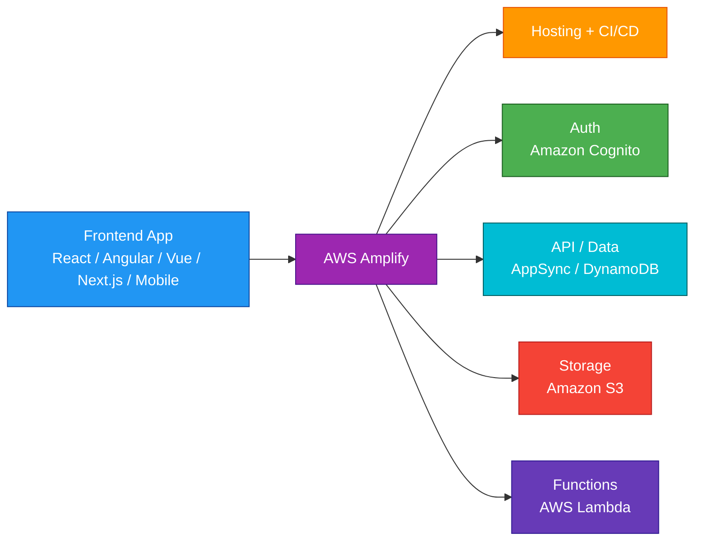
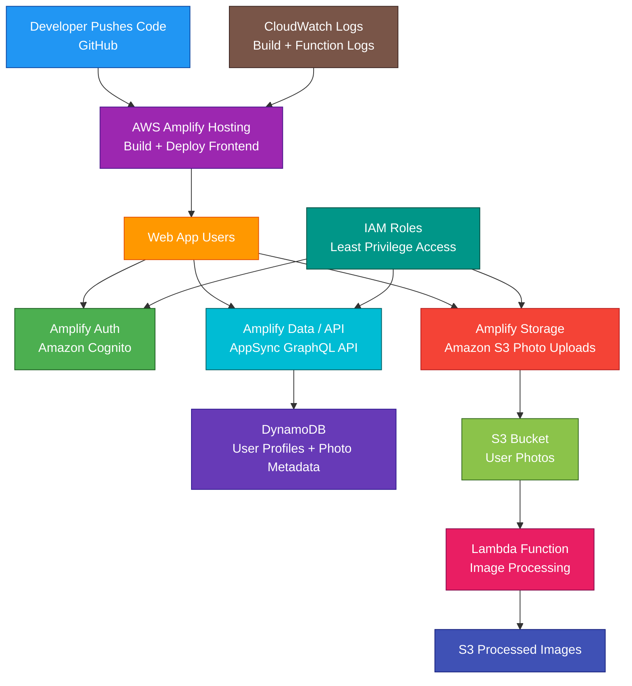

# AWS Amplify

<details>
<summary>

## 1. Definition

</summary>

### Simple Definition

AWS Amplify is a managed development platform for building, deploying, and hosting full-stack web and mobile applications on AWS.

It helps frontend and mobile developers connect apps to AWS services without manually wiring everything from scratch.

### Memory Hook

Amplify = Fast full-stack app development on AWS.

### Basic Idea

You build your frontend app.

Amplify helps you add backend features like authentication, APIs, storage, hosting, and CI/CD.



### Key Point

Amplify is not one single backend service.

It is a developer platform that helps create and connect multiple AWS services for full-stack applications.

</details>

<details>
<summary>

## 2. What Problem Does It Solve?

</summary>

### Main Problem

Amplify solves the problem of quickly building and deploying web or mobile applications with AWS-powered backend features.

Without Amplify, frontend developers may need to manually configure many AWS services.

### Without Amplify

You may need to manually set up:

- Frontend hosting
- CI/CD pipelines
- Authentication
- API Gateway or AppSync
- Lambda functions
- DynamoDB tables
- S3 buckets
- IAM roles
- Custom domains
- Environment variables
- Build settings
- Deployment workflows

### With Amplify

Amplify simplifies app development by providing tools and workflows for:

- Hosting frontend apps
- Deploying from Git repositories
- Adding authentication
- Adding APIs
- Adding data storage
- Adding file storage
- Adding serverless functions
- Managing environments
- Connecting frontend code to backend resources

### Key Benefit

Amplify helps developers move faster by reducing the amount of AWS infrastructure setup needed for common app features.

</details>

<details>
<summary>

## 3. Core Use Cases

</summary>

### Frontend Web App Hosting

Use Amplify Hosting to host frontend applications.

Examples:

- React app
- Angular app
- Vue app
- Next.js app
- Static website
- Single-page application

### Full-Stack Web Applications

Use Amplify to build frontend apps with backend features.

Examples:

- Login system
- GraphQL or REST API
- Database
- File uploads
- Serverless business logic

### Mobile App Backends

Use Amplify libraries to connect iOS, Android, Flutter, or React Native apps to AWS backend services.

Examples:

- User login
- User profile storage
- File uploads
- Push notifications
- API calls

### Authentication

Use Amplify Auth to add sign-up, sign-in, MFA, password reset, and social login.

Underlying AWS service:

Amazon Cognito.

### APIs and Data

Use Amplify to add application data APIs.

Common backend services:

- AWS AppSync
- Amazon DynamoDB
- AWS Lambda
- Amazon API Gateway

### File Storage

Use Amplify Storage to allow users to upload and download files.

Underlying AWS service:

Amazon S3.

### Serverless Functions

Use Amplify Functions to add backend code.

Underlying AWS service:

AWS Lambda.

### CI/CD for Frontend Apps

Use Amplify Hosting to automatically build and deploy your app when you push code to a connected Git branch.

</details>

<details>
<summary>

## 4. Important Features for SAA

</summary>

### Amplify Hosting

Amplify Hosting is used to build, deploy, and host web apps.

It supports:

- Static websites
- Single-page applications
- Server-side rendered web apps
- Branch-based deployments
- Custom domains
- HTTPS
- Build settings
- Automatic deployments from Git

### Git-Based Deployment

Amplify can connect to a source repository.

Common repositories:

- GitHub
- GitLab
- Bitbucket
- AWS CodeCommit

Common flow:

1. Developer pushes code.
2. Amplify detects the change.
3. Amplify builds the app.
4. Amplify deploys the app.
5. Users access the hosted app.

### Branch Deployments

Amplify can create separate deployments for different branches.

Examples:

| Branch | Environment |
|---|---|
| `main` | Production |
| `develop` | Staging |
| `feature/login` | Preview environment |

### Preview Environments

Preview environments let teams test changes before merging to production.

Useful for:

- Pull request testing
- Feature branch testing
- UI reviews
- Staging workflows

### Custom Domains

Amplify can connect apps to custom domains.

Example:

```text
https://www.example.com
```

Amplify can also manage HTTPS certificates for hosted apps.

### Build Settings

Amplify uses build settings to install dependencies, run build commands, and deploy output files.

Example build phases:

- Install dependencies
- Run tests
- Build app
- Publish build output

### Environment Variables

Amplify supports environment variables for app configuration.

Examples:

- API endpoint
- App environment
- Feature flag
- Public configuration value

Do not store sensitive secrets directly in frontend-exposed environment variables.

### Amplify Gen 2

Amplify Gen 2 uses a code-first developer experience for defining backend resources.

Common idea:

Define backend resources in TypeScript and deploy them to AWS.

### Amplify Gen 1

Amplify Gen 1 commonly used the Amplify CLI and category-based backend setup.

Examples:

```text
amplify add auth
amplify add api
amplify add storage
```

### Auth

Amplify Auth helps add authentication to applications.

Underlying AWS service:

Amazon Cognito.

Common features:

- Sign-up
- Sign-in
- Password reset
- MFA
- Social login
- User groups
- User attributes

### Data and API

Amplify can help create APIs and data models.

Common AWS services:

- AWS AppSync for GraphQL APIs
- Amazon DynamoDB for NoSQL data
- AWS Lambda for custom backend logic
- API Gateway for REST APIs in some patterns

### GraphQL API

Amplify commonly uses AppSync for GraphQL APIs.

Best for:

- Real-time apps
- Flexible frontend data queries
- Mobile/web data sync patterns
- DynamoDB-backed app data

### REST API

Amplify can connect apps to REST APIs.

Common backend services:

- API Gateway
- Lambda

### Storage

Amplify Storage helps apps use S3 for file storage.

Examples:

- User profile pictures
- Uploaded documents
- Public images
- Private user files

### Functions

Amplify Functions are serverless backend functions.

Underlying AWS service:

AWS Lambda.

Use functions for:

- Custom business logic
- API resolvers
- Processing uploads
- Event-driven logic
- Integrating with external APIs

### UI Components

Amplify provides UI components that can speed up frontend development.

Examples:

- Authentication UI
- Login forms
- Sign-up forms
- Account recovery flows

### Amplify Libraries

Amplify libraries help frontend and mobile apps interact with AWS services.

Examples:

- Auth library
- Storage library
- API library
- Data library

### Amplify Studio

Amplify Studio was commonly associated with visual app/backend development workflows, especially in Gen 1 patterns.

For SAA, focus more on Amplify as a full-stack app development and hosting platform.

### Underlying AWS Services

Amplify often creates or connects to other AWS services.

| Amplify Feature | Common AWS Service |
|---|---|
| Auth | Amazon Cognito |
| Storage | Amazon S3 |
| Functions | AWS Lambda |
| GraphQL API | AWS AppSync |
| Data | Amazon DynamoDB |
| REST API | API Gateway + Lambda |
| Hosting | Amplify Hosting |
| Monitoring logs | CloudWatch |
| Infrastructure | CloudFormation / CDK-backed resources |

### Important Exam Point

Amplify simplifies building apps, but the underlying services still matter for security, scaling, and cost.

</details>

<details>
<summary>

## 5. Security Model

</summary>

### IAM Permissions

IAM controls who can create, update, delete, and manage Amplify apps and backend resources.

Common permissions:

| Permission | Purpose |
|---|---|
| `amplify:CreateApp` | Create Amplify app |
| `amplify:UpdateApp` | Update app settings |
| `amplify:DeleteApp` | Delete Amplify app |
| `amplify:CreateBranch` | Create branch deployment |
| `amplify:StartJob` | Start build or deployment job |
| `amplify:GetApp` | View app details |

### Service Role

Amplify may use an IAM service role to deploy and manage backend resources.

This role needs permissions to create or update resources such as:

- Cognito user pools
- AppSync APIs
- DynamoDB tables
- Lambda functions
- S3 buckets
- IAM roles
- CloudFormation stacks

### Least Privilege

Use least privilege for Amplify service roles and developer access.

Bad example:

Giving all developers full administrator access.

Better example:

Allow developers to deploy only approved Amplify apps and environments.

### Authentication Security

Amplify Auth uses Amazon Cognito.

Security options can include:

- Password policies
- MFA
- Email or phone verification
- Social identity providers
- User groups
- Token-based authentication
- Account recovery flows

### API Authorization

Amplify APIs can use different authorization methods depending on the backend.

Common examples:

- Cognito User Pools
- IAM authorization
- API keys for limited use cases
- Lambda authorizers
- OIDC providers

### Storage Authorization

Amplify Storage usually uses S3 with access controls.

Common access patterns:

| Access Level | Meaning |
|---|---|
| Public | Anyone with access pattern can read |
| Protected | Other signed-in users may read, owner can write |
| Private | Only the owner can access |

### Encryption at Rest

Underlying services provide encryption at rest.

Examples:

- S3 encryption
- DynamoDB encryption
- Cognito managed storage protection
- Lambda environment encryption
- CloudWatch Logs encryption
- KMS customer managed keys where configured

### Encryption in Transit

Amplify hosted apps use HTTPS.

APIs and AWS service calls should use TLS/HTTPS.

### Secrets Management

Do not expose secrets in frontend code.

Important warning:

Frontend apps are public to users, so anything bundled into frontend code can be viewed.

Use secure backend storage for secrets:

- AWS Secrets Manager
- Systems Manager Parameter Store
- Lambda environment variables with KMS
- IAM roles

### Custom Domain Security

Amplify Hosting can use HTTPS with managed certificates.

Use HTTPS for production apps.

### Access to Private Resources

If backend functions need private resources, configure VPC access carefully.

Examples:

- Lambda connects to RDS in private subnets
- Security groups restrict database access
- Secrets Manager stores credentials

### CloudTrail Auditing

CloudTrail can record Amplify API activity.

Use CloudTrail to audit:

- App creation
- Branch updates
- Deployment actions
- Backend changes
- Permission changes

### CloudWatch Logs

Amplify builds and backend functions can send logs to CloudWatch.

Use logs to troubleshoot:

- Build failures
- Deployment failures
- Lambda errors
- API errors

### Shared Responsibility

AWS is responsible for:

- Amplify managed hosting infrastructure
- Managed deployment platform
- Service availability
- Physical security
- Managed integrations

You are responsible for:

- App code security
- IAM permissions
- Service role permissions
- Backend authorization rules
- Cognito configuration
- S3 access policies
- Secrets handling
- API authorization
- Secure frontend behavior
- Monitoring and logs

</details>

<details>
<summary>

## 6. High Availability / Durability Behavior

</summary>

### Availability

Amplify Hosting is a managed AWS hosting service for web apps.

AWS manages the hosting infrastructure and deployment platform.

### Global Content Delivery

Amplify hosted apps are delivered using AWS-managed edge infrastructure.

This improves performance for users in different locations.

### Regional Backend Resources

Backend resources created by Amplify are usually deployed into an AWS Region.

Examples:

- Cognito user pool
- DynamoDB table
- AppSync API
- Lambda function
- S3 bucket

### Multi-AZ Behavior

Amplify itself abstracts hosting infrastructure.

For backend services, availability depends on the underlying AWS service.

Examples:

| Backend Feature | Availability Behavior |
|---|---|
| Cognito | Managed regional service |
| DynamoDB | Managed multi-AZ regional NoSQL service |
| S3 | Regional object storage with high durability |
| Lambda | Managed regional serverless compute |
| AppSync | Managed regional API service |

### Durability

Amplify is not the main durable data store.

Durability comes from the underlying services.

Examples:

- Files stored in S3
- App data stored in DynamoDB
- User accounts stored in Cognito
- Logs stored in CloudWatch Logs

### Rollbacks

Amplify Hosting supports deployment history and rollback patterns.

Use rollback when a new deployment breaks the frontend app.

### Branch Isolation

Separate branches and environments can reduce deployment risk.

Example:

Test changes in a staging branch before production.

### Multi-Region Behavior

Amplify apps are not automatically fully active-active across Regions.

For Multi-Region architectures, design backend resources separately.

Common options:

- CloudFront and Route 53 patterns
- DynamoDB Global Tables
- S3 replication
- Cognito multi-Region identity strategy
- Regional APIs
- Infrastructure as Code

### Important Exam Point

Amplify helps deploy full-stack apps quickly, but high availability and disaster recovery depend on the architecture of the underlying AWS services.

</details>

<details>
<summary>

## 7. Cost Optimization Options

</summary>

### Use Amplify to Reduce Development Effort

Amplify can reduce engineering time by simplifying common app features.

This can reduce operational and development cost.

### Monitor Hosting Usage

Amplify Hosting cost can depend on:

- Build minutes
- Data served
- Storage
- Requests
- Deployment activity

Monitor usage to avoid surprises.

### Avoid Unnecessary Builds

Frequent builds can increase cost.

Reduce unnecessary builds by:

- Avoiding commits that trigger unneeded deployments
- Using branch controls
- Optimizing build commands
- Caching dependencies where supported

### Delete Unused Branches

Preview and feature branches can create resources.

Delete unused branches and environments.

### Clean Up Unused Backend Environments

Unused backend environments can leave AWS resources running.

Clean up:

- Test APIs
- Old DynamoDB tables
- S3 buckets
- Lambda functions
- Cognito pools
- Preview deployments

### Use the Right Backend Services

Amplify can create powerful AWS services.

Choose services based on need.

Example:

Do not create an expensive custom backend if a simple static site is enough.

### Optimize Frontend Assets

Smaller frontend assets reduce transfer and improve performance.

Best practices:

- Minify JavaScript
- Compress assets
- Use image optimization
- Remove unused dependencies
- Cache static files

### Use S3 Lifecycle Policies

For uploaded files, configure S3 lifecycle policies.

Examples:

- Move old files to cheaper storage classes
- Delete temporary uploads
- Archive old user content where appropriate

### Optimize DynamoDB Usage

If Amplify creates DynamoDB-backed data models, optimize:

- Access patterns
- Indexes
- Capacity mode
- Item size
- Unused tables

### Delete Unused Lambda Functions

Backend functions can create cost through invocations, duration, and logs.

Remove unused functions.

### Control Logs

CloudWatch Logs can grow over time.

Set log retention periods for build logs and function logs.

</details>

<details>
<summary>

## 8. Common Exam Traps

</summary>

### Amplify vs Elastic Beanstalk

Amplify is best for frontend and full-stack web/mobile app development.

Elastic Beanstalk is best for deploying backend web applications with more infrastructure control.

| Requirement | Choose |
|---|---|
| Frontend/full-stack app with auth, APIs, hosting | Amplify |
| Deploy backend app on EC2/ALB/ASG managed platform | Elastic Beanstalk |

### Amplify vs App Runner

App Runner runs web apps and APIs from source or containers.

Amplify is more focused on frontend/full-stack app development with integrated backend features.

| Requirement | Choose |
|---|---|
| Frontend hosting plus backend categories | Amplify |
| Simple managed container/source API service | App Runner |

### Amplify vs CloudFormation

CloudFormation is Infrastructure as Code.

Amplify can generate and manage AWS resources behind the scenes.

If the question asks for general AWS IaC, choose CloudFormation.

### Amplify vs CDK

Amplify Gen 2 uses a code-first backend approach and can use CDK-based infrastructure concepts.

AWS CDK is a general-purpose Infrastructure as Code framework.

### Amplify vs Cognito

Cognito is the identity service.

Amplify Auth is the developer-friendly way to add Cognito-based authentication to an app.

### Amplify vs S3 Static Website Hosting

S3 can host static websites, but Amplify Hosting adds:

- CI/CD
- Branch deployments
- Managed builds
- Custom domains
- HTTPS
- Frontend deployment workflow

### Amplify Is Not Just Hosting

Amplify can do hosting, but it can also help add:

- Auth
- APIs
- Data
- Storage
- Functions
- CI/CD

### Amplify Is Not a Database

Amplify helps create or connect to data services.

Underlying databases may include DynamoDB, RDS through custom backend logic, or other AWS services.

### Frontend Secrets Are Not Secret

Do not put private API keys or database passwords in frontend app code.

Anything shipped to the browser or mobile app can potentially be inspected.

### Backend Still Needs Good Security Design

Amplify simplifies setup, but you still need correct:

- Auth rules
- IAM policies
- S3 access controls
- API authorization
- Cognito configuration
- Data validation

### Not Every App Needs Amplify

For complex enterprise backend platforms, ECS, EKS, App Runner, API Gateway, Lambda, CDK, or CloudFormation may be better.

</details>

<details>
<summary>

## 9. Compare With Similar Services

</summary>

### Service Comparison Table

| Service | Main Purpose | Best For | Choose When |
|---|---|---|---|
| AWS Amplify | Full-stack web/mobile app development and hosting | Frontend apps with AWS backend features | You need fast app development with auth, APIs, storage, and hosting |
| AWS App Runner | Managed web app/API hosting | Simple container or source-based services | You need to run a web API without managing servers |
| Elastic Beanstalk | Managed application platform | Backend apps with more infrastructure control | You want managed EC2/ALB/ASG app environments |
| Amazon S3 Static Hosting | Static website hosting | Simple static websites | You only need static file hosting |
| Amazon CloudFront | CDN and edge delivery | Global content acceleration | You need caching and global delivery |
| Amazon Cognito | User authentication | Sign-up and sign-in | You need identity service directly |
| AWS CloudFormation | Infrastructure as Code | General AWS resource provisioning | You need repeatable infrastructure templates |

### Amplify vs App Runner

| Feature | Amplify | App Runner |
|---|---|---|
| Main purpose | Full-stack frontend/mobile development | Managed web app/API runtime |
| Hosting | Yes | Yes |
| Backend categories | Auth, APIs, storage, functions | App service runtime |
| Container support | Not main focus for frontend hosting | Strong fit |
| Best for | Frontend/full-stack apps | Simple APIs and web services |

### Amplify vs Elastic Beanstalk

| Feature | Amplify | Elastic Beanstalk |
|---|---|---|
| Best for | Frontend and full-stack apps | Backend app platforms |
| Infrastructure control | Lower | Higher |
| Common users | Frontend/mobile developers | Backend/platform developers |
| Backend services | Generated/connected AWS services | EC2/ALB/ASG environments |
| Exam clue | Add auth/API/storage quickly | Deploy app with managed EC2 environment |

### Amplify vs S3 Static Website Hosting

| Feature | Amplify Hosting | S3 Static Website Hosting |
|---|---|---|
| Main purpose | Managed frontend hosting with CI/CD | Static object website hosting |
| Git integration | Yes | No native full CI/CD |
| HTTPS/custom domain | Managed workflow | Usually needs CloudFront/ACM |
| Branch previews | Yes | No native feature |
| Best for | Modern frontend apps | Simple static sites |

### Amplify vs Cognito

| Feature | Amplify Auth | Amazon Cognito |
|---|---|---|
| Main purpose | Developer-friendly auth integration | Identity service |
| User directory | Uses Cognito | Provides Cognito User Pools |
| Temporary AWS credentials | Can integrate | Cognito Identity Pools |
| Best for | Adding auth to app quickly | Direct identity management |

### Amplify vs CloudFormation

| Feature | Amplify | CloudFormation |
|---|---|---|
| Main purpose | App development platform | Infrastructure as Code |
| Abstraction | Higher-level app features | Lower-level AWS resources |
| User focus | Frontend/mobile/full-stack developers | Cloud engineers/platform teams |
| Best for | Fast app feature setup | General infrastructure provisioning |

### When to Choose Amplify

Choose Amplify when:

- You need to host a frontend web app
- You need CI/CD from Git for a frontend app
- You need fast full-stack app development
- You need app authentication with Cognito
- You need APIs connected to frontend/mobile apps
- You need S3 file uploads from users
- You need Lambda functions for backend logic
- You need branch-based deployments
- You need preview environments
- You want frontend developers to build on AWS faster

</details>

<details>
<summary>

## 10. Mini Architecture Example

</summary>

### Scenario

A startup is building a photo-sharing web application.

Users need to sign up, log in, upload photos, view their gallery, and store profile data.

The team wants fast development and automatic deployment from GitHub.

### Architecture

Use Amplify Hosting for the frontend.

Use Amplify Auth for user sign-up and sign-in with Cognito.

Use Amplify Storage for photo uploads to S3.

Use Amplify Data/API with AppSync and DynamoDB for profile and photo metadata.

Use Lambda functions for custom image-processing logic.



### Why This Is Good

- Amplify Hosting deploys the frontend automatically from GitHub
- Cognito handles user sign-up and sign-in
- AppSync provides a managed API for app data
- DynamoDB stores user and photo metadata
- S3 stores uploaded photos durably
- Lambda processes uploaded images
- IAM roles control access to AWS resources
- CloudWatch Logs helps troubleshoot builds and backend functions
- The team avoids manually wiring many AWS services from scratch
- The architecture is serverless and scales with user demand

### Exam Answer Pattern

If the question says:

“Build and host a full-stack web or mobile app with authentication, APIs, storage, and CI/CD.”

Think:

AWS Amplify.

If the question says:

“Add user sign-up and sign-in to an app.”

Think:

Amazon Cognito, often through Amplify Auth.

If the question says:

“Host a frontend app with automatic builds from Git branches.”

Think:

Amplify Hosting.

If the question says:

“Deploy a simple containerized API with minimal infrastructure management.”

Think:

AWS App Runner.

### Final Memory Hook

Amplify = Full-stack app development platform.

Hosting = Frontend CI/CD and web hosting.

Auth = Cognito.

Data/API = AppSync, DynamoDB, Lambda, API Gateway patterns.

Storage = S3.

Functions = Lambda.

Branch deployment = Separate environment per Git branch.

Preview environment = Test feature branches.

Custom domain = Friendly app URL.

Environment variables = App configuration.

Gen 2 = Code-first backend development.

Gen 1 = CLI/category-based workflow.

Frontend secrets = Not secret.

CloudFormation/CDK = Underlying infrastructure patterns.

App Runner = Managed app/API runtime.

Elastic Beanstalk = Managed app platform with more infrastructure control.

Cognito = Identity service.

S3 + CloudFront = Static hosting/CDN pattern.

</details>