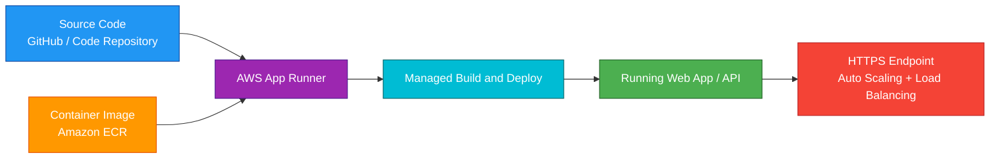
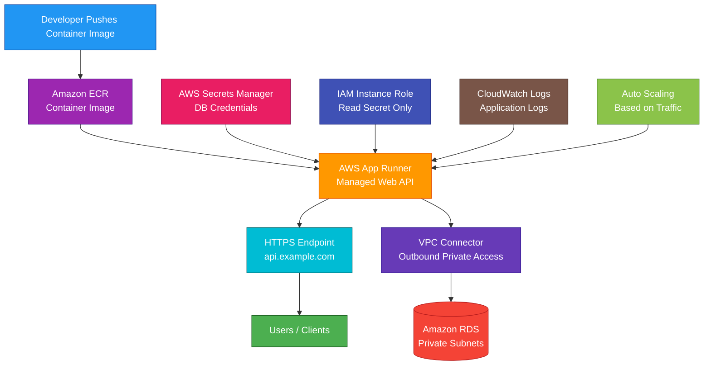

# AWS App Runner

<details>
<summary>

## 1. Definition

</summary>

### Simple Definition

AWS App Runner is a fully managed service for running web applications and APIs.

It can build and deploy your app from source code or run it from a container image without requiring you to manage servers, load balancers, or scaling infrastructure.

### Memory Hook

App Runner = Simple managed deployment for web apps and APIs.

### Basic Idea

You give App Runner your source code or container image.

App Runner builds, deploys, runs, scales, and exposes your application over HTTPS.



### Key Point

App Runner is designed for simple web apps and APIs.

It gives you less infrastructure control than ECS, EKS, or EC2, but it is easier to use.

</details>

<details>
<summary>

## 2. What Problem Does It Solve?

</summary>

### Main Problem

App Runner solves the problem of deploying web applications quickly without managing infrastructure.

### Without App Runner

You may need to manage:

- EC2 instances
- Auto Scaling Groups
- Load balancers
- HTTPS certificates
- Container orchestration
- Build pipelines
- Deployment scripts
- Health checks
- Scaling rules
- Server patching

### With App Runner

AWS manages most of the infrastructure.

You focus on:

- Application code
- Container image
- Runtime configuration
- Environment variables
- Scaling settings
- VPC connectivity if needed

### Key Benefit

App Runner makes it easy to deploy production-ready web apps and APIs with minimal operational work.

</details>

<details>
<summary>

## 3. Core Use Cases

</summary>

### Web Applications

Use App Runner to deploy web applications quickly.

Examples:

- Node.js app
- Python Flask app
- Java Spring Boot app
- .NET web app
- Containerized frontend/backend app

### REST APIs

Use App Runner to run APIs without managing servers or container clusters.

Example:

A small backend API runs from a container image in Amazon ECR.

### Microservices

Use App Runner for simple containerized microservices.

Example:

- User service
- Payment API
- Product API
- Notification API

### Startups and Small Teams

Use App Runner when a team wants to deploy quickly without learning ECS, EKS, or EC2 infrastructure.

### Simple Container Deployments

Use App Runner when you already have a container image and want AWS to run it with HTTPS and scaling.

### Source Code Deployment

Use App Runner when you want AWS to build and deploy directly from source code.

Example:

Push code to GitHub, and App Runner automatically deploys the new version.

### Internal APIs with VPC Access

Use App Runner with VPC connectors when the app needs to access private resources.

Examples:

- RDS database in private subnets
- ElastiCache cluster
- Internal service in a VPC

</details>

<details>
<summary>

## 4. Important Features for SAA

</summary>

### Fully Managed Service

App Runner manages the platform for your web app.

AWS handles:

- Build
- Deployment
- HTTPS endpoint
- Load balancing
- Scaling
- Health checks
- Runtime infrastructure
- Basic monitoring integration

### Source Code Deployment

App Runner can build and deploy from supported source repositories.

Common flow:

1. Connect repository.
2. Choose branch.
3. Configure build command.
4. Configure start command.
5. Deploy app.

### Container Image Deployment

App Runner can deploy from container images.

Common image source:

- Amazon ECR
- Amazon ECR Public

### Build Configuration

For source-based deployment, App Runner needs build settings.

Examples:

- Runtime
- Build command
- Start command
- Port
- Environment variables

### Automatic Deployments

App Runner can automatically redeploy when source code or container image changes.

Use this for simple continuous deployment.

### HTTPS Endpoint

App Runner gives your service an HTTPS endpoint.

This means you do not need to manually configure an Application Load Balancer or TLS certificate for the default endpoint.

### Custom Domain

You can associate a custom domain with an App Runner service.

Example:

```text
https://api.example.com
```

### Auto Scaling

App Runner automatically scales your application based on traffic.

You configure scaling settings such as:

- Minimum size
- Maximum size
- Concurrency per instance

### Concurrency

Concurrency means how many requests an instance can handle at the same time.

App Runner can scale out when request concurrency increases.

### Health Checks

App Runner uses health checks to determine if your application is healthy.

Health checks can be based on:

- TCP checks
- HTTP checks

### Environment Variables

You can configure environment variables for your App Runner service.

Use them for non-sensitive configuration.

Examples:

- App environment
- API URL
- Feature flag
- Log level

### Secrets and Sensitive Values

Do not store secrets directly as plain environment variables when avoidable.

Use secure integrations such as:

- AWS Secrets Manager
- Systems Manager Parameter Store

### Service Role

App Runner may use IAM roles to access resources such as source repositories, ECR images, logs, and other AWS services.

### Instance Role

An App Runner instance role gives your running application permissions to call AWS services.

Example:

Your app needs permission to read from DynamoDB or S3.

### VPC Connector

A VPC connector lets App Runner access private resources in a VPC.

Use it when your App Runner service needs to connect to:

- RDS
- Aurora
- ElastiCache
- Private APIs
- Internal services

### Outbound VPC Traffic

VPC connectors are mainly for outbound traffic from App Runner to resources inside a VPC.

Important point:

App Runner still provides the public service endpoint unless you design access controls around it.

### Public Ingress

App Runner services are commonly internet-accessible through HTTPS.

For private-only application patterns, consider whether ECS, EKS, PrivateLink, or internal load balancers are better fits.

### Observability

App Runner integrates with AWS monitoring services.

Common monitoring tools:

- CloudWatch metrics
- CloudWatch logs
- AWS X-Ray, where configured
- App Runner service events

### Pause and Resume

App Runner services can be paused and resumed.

Use this for non-production services to reduce cost.

### Deployment Rollback

App Runner supports managed deployments and can help reduce risk during updates.

If a deployment fails health checks, the service can avoid moving to an unhealthy version.

</details>

<details>
<summary>

## 5. Security Model

</summary>

### IAM Permissions

IAM controls who can create, modify, delete, and manage App Runner resources.

Common permissions:

| Permission | Purpose |
|---|---|
| `apprunner:CreateService` | Create App Runner service |
| `apprunner:UpdateService` | Update service configuration |
| `apprunner:DeleteService` | Delete service |
| `apprunner:DescribeService` | View service details |
| `apprunner:StartDeployment` | Start deployment |
| `apprunner:PauseService` | Pause service |
| `apprunner:ResumeService` | Resume service |

### Service Access Role

A service access role allows App Runner to access required AWS resources.

Example:

App Runner needs permission to pull a private image from Amazon ECR.

### Instance Role

An instance role gives the running application permission to call AWS services.

Example permissions:

- Read objects from S3
- Write logs
- Query DynamoDB
- Retrieve secrets from Secrets Manager
- Read parameters from Parameter Store

### Least Privilege

Use least privilege for App Runner roles.

Bad example:

Giving the application administrator access.

Good example:

Allow only `s3:GetObject` on one specific bucket prefix.

### Encryption in Transit

App Runner provides HTTPS endpoints.

This protects traffic between users and the App Runner service.

### Encryption at Rest

Data stored by related services should be encrypted separately.

Examples:

- ECR image encryption
- CloudWatch Logs encryption
- S3 encryption
- RDS encryption
- Secrets Manager encryption

### Secrets Management

Do not hardcode secrets in source code or container images.

Use:

- AWS Secrets Manager
- Systems Manager Parameter Store
- KMS-encrypted values
- IAM roles instead of static access keys

### Network Security

For backend access, use VPC connectors to reach private VPC resources.

Also secure private resources with:

- Security groups
- Private subnets
- Least privilege database access
- KMS encryption
- Secrets Manager credentials

### Public Endpoint Security

App Runner apps are commonly public-facing.

Protect public applications using:

- Authentication
- Authorization
- Input validation
- Rate limiting in application or edge services
- AWS WAF through supported front-door patterns where needed
- CloudFront in front of App Runner where appropriate

### CloudTrail Auditing

Use CloudTrail to audit App Runner API activity.

Examples:

- Service creation
- Service update
- Deployment start
- Role configuration changes
- Service deletion

### Shared Responsibility

AWS is responsible for:

- App Runner managed infrastructure
- Load balancing
- HTTPS endpoint management
- Managed scaling platform
- Runtime platform infrastructure
- Physical security

You are responsible for:

- Application code security
- IAM roles and permissions
- Secrets management
- Environment variables
- VPC connector configuration
- Backend resource security
- Authentication and authorization
- Monitoring and logging
- Container image security

</details>

<details>
<summary>

## 6. High Availability / Durability Behavior

</summary>

### Availability

App Runner is a managed service that runs and scales your web application automatically.

AWS manages the service infrastructure.

### Managed Load Balancing

App Runner includes managed request routing and load balancing.

You do not need to create an Application Load Balancer manually for the basic App Runner endpoint.

### Auto Scaling for Availability

App Runner can scale out when request traffic increases.

This helps maintain application responsiveness during traffic growth.

### Health Check Replacement

App Runner monitors application health.

If a deployment or running instance is unhealthy, App Runner can take action based on health checks.

### Regional Service

App Runner services are created in a specific AWS Region.

### Multi-AZ Behavior

App Runner is managed by AWS across regional infrastructure.

You do not manually choose Availability Zones like you do with EC2 subnets for an Auto Scaling Group.

### Multi-Region Behavior

App Runner is not automatically Multi-Region.

For Multi-Region applications, deploy separate App Runner services in multiple Regions and use global routing.

Common services:

- Route 53
- CloudFront
- AWS Global Accelerator

### Durability

App Runner is compute, not durable storage.

Do not store important persistent data inside the running container filesystem.

Use durable storage services such as:

- S3
- RDS
- Aurora
- DynamoDB
- EFS, if your architecture requires file storage through other compute choices

### Stateless Application Design

App Runner works best with stateless applications.

Store state outside the app.

Good external state options:

- DynamoDB for key-value data
- RDS or Aurora for relational data
- S3 for files
- ElastiCache for cache/session patterns
- Secrets Manager for secrets

### Important Exam Point

App Runner simplifies web app deployment and scaling, but durable data must live outside the App Runner container.

</details>

<details>
<summary>

## 7. Cost Optimization Options

</summary>

### Use App Runner for Simplicity

App Runner can reduce operational cost by removing infrastructure management.

It is useful when developer productivity matters more than deep infrastructure control.

### Right-Size CPU and Memory

Choose CPU and memory settings based on actual application needs.

Avoid overprovisioning resources.

### Configure Auto Scaling Limits

Set maximum capacity to control unexpected scaling cost.

Use minimum capacity based on baseline traffic needs.

### Pause Non-Production Services

Pause development or test App Runner services when not in use.

This can reduce cost.

### Use Efficient Container Images

Smaller and efficient images can improve startup time and deployment performance.

Best practices:

- Use minimal base images
- Remove unnecessary packages
- Avoid large unused files
- Use multi-stage builds

### Avoid Unnecessary Automatic Deployments

Automatic deployments are useful, but frequent unnecessary builds can create operational noise.

Use them where they support real CI/CD needs.

### Use VPC Connector Only When Needed

VPC access is useful for private resources, but keep network design simple.

Use VPC connectors only when the app needs private VPC access.

### Offload Static Assets

Do not serve large static files from App Runner if S3 and CloudFront are better.

Better pattern:

- Static files in S3
- Global delivery with CloudFront
- App Runner for dynamic API/backend

### Monitor Usage

Use CloudWatch to monitor:

- Request count
- Latency
- CPU utilization
- Memory utilization
- Active instances
- Error rates

### Consider Alternatives for Large Complex Workloads

For high-scale or complex container platforms, ECS on Fargate or EKS may offer more control and cost tuning options.

</details>

<details>
<summary>

## 8. Common Exam Traps

</summary>

### App Runner vs Elastic Beanstalk

App Runner is simpler and more managed for web apps and APIs.

Elastic Beanstalk gives more environment and infrastructure control.

| Requirement | Choose |
|---|---|
| Simple managed web app from code/container | App Runner |
| More control over EC2, ALB, ASG environment | Elastic Beanstalk |

### App Runner vs ECS Fargate

App Runner is simpler.

ECS Fargate gives more control over container orchestration, networking, tasks, services, and integrations.

| Requirement | Choose |
|---|---|
| Simple web app/API deployment | App Runner |
| Complex container architecture | ECS on Fargate |

### App Runner vs Lambda

Lambda runs functions in response to events.

App Runner runs web applications and APIs as services.

| Requirement | Choose |
|---|---|
| Function-based event processing | Lambda |
| Long-running web app or API container | App Runner |

### App Runner vs EC2

EC2 gives full server control.

App Runner removes server management.

Choose EC2 only when you need OS-level control or custom infrastructure.

### App Runner Is Not a Container Orchestrator

App Runner runs web services.

It does not provide the same orchestration control as ECS or EKS.

### App Runner Is Best for HTTP Services

App Runner is mainly for web apps and APIs.

For workers, scheduled jobs, or complex background processing, ECS Fargate, Lambda, Batch, or Step Functions may fit better.

### Persistent Data Should Not Live in the Container

Containers can be replaced.

Store persistent data externally in S3, RDS, DynamoDB, or another durable service.

### VPC Connector Is for Private Outbound Access

A VPC connector lets App Runner reach private VPC resources.

It does not turn App Runner into a full private internal load-balanced ECS service.

### Public Access Must Be Protected

App Runner gives an HTTPS endpoint, but your application still needs proper authentication and authorization.

### Less Control Than ECS or EKS

If the exam scenario needs custom sidecars, service mesh, special networking, daemon processes, or deep container orchestration, App Runner may not be the best choice.

</details>

<details>
<summary>

## 9. Compare With Similar Services

</summary>

### Service Comparison Table

| Service | Main Purpose | Best For | Choose When |
|---|---|---|---|
| AWS App Runner | Fully managed web app/API hosting | Simple web apps and containerized APIs | You want easy deployment with minimal infrastructure management |
| ECS on Fargate | Serverless container orchestration | Production container services and workers | You need more container control without managing EC2 |
| EKS on Fargate | Kubernetes without worker nodes | Kubernetes pod workloads | You need Kubernetes APIs and ecosystem |
| Elastic Beanstalk | Managed app platform | Apps needing more environment control | You want managed deployment but still need EC2/ALB/ASG control |
| Lambda | Serverless functions | Event-driven code execution | You need short-lived function execution |
| EC2 | Virtual servers | Full OS and infrastructure control | You need maximum control over servers |

### App Runner vs ECS Fargate

| Feature | App Runner | ECS Fargate |
|---|---|---|
| Main purpose | Simple web app/API deployment | Container orchestration |
| Infrastructure control | Lower | Higher |
| Load balancer setup | Managed by App Runner | You configure ALB/NLB |
| Task/service concepts | Hidden/simplified | Explicit ECS concepts |
| Best for | Quick web services | Complex container workloads |

### App Runner vs Elastic Beanstalk

| Feature | App Runner | Elastic Beanstalk |
|---|---|---|
| Abstraction level | Higher | Lower |
| Infrastructure control | Less | More |
| Common compute | Managed App Runner platform | EC2, ALB, ASG managed by Beanstalk |
| Best for | Simple web apps/APIs | Apps needing environment customization |

### App Runner vs Lambda

| Feature | App Runner | Lambda |
|---|---|---|
| Compute style | Long-running web service | Event-driven function |
| Best for | HTTP web apps and APIs | Short tasks and event processing |
| Scaling | Request-based service scaling | Function invocation scaling |
| Runtime model | App listens on a port | Function handler runs per event |

### App Runner vs EC2

| Feature | App Runner | EC2 |
|---|---|---|
| Server management | AWS manages | You manage |
| OS access | No | Yes |
| Scaling | Managed | You configure |
| Best for | Simple managed app hosting | Full control workloads |
| Operational effort | Lower | Higher |

### App Runner vs Amplify Hosting

| Feature | App Runner | Amplify Hosting |
|---|---|---|
| Main purpose | Backend web apps and APIs | Frontend web apps |
| Best for | Containerized or source-based web services | Static sites and frontend frameworks |
| Runtime | Runs application service | Hosts/builds frontend apps |
| Common use together | API backend | Frontend UI |

### When to Choose App Runner

Choose App Runner when:

- You need to run a web application or API
- You want minimal infrastructure management
- You want automatic HTTPS
- You want automatic scaling
- You want deployment from source code or container image
- You do not need deep ECS/EKS control
- You want a simple way to run containers
- Your app is mostly stateless
- Your app may need outbound access to private VPC resources through a VPC connector

</details>

<details>
<summary>

## 10. Mini Architecture Example

</summary>

### Scenario

A small team has a containerized REST API.

The API needs to be deployed quickly, exposed over HTTPS, scaled automatically, and connected to a private RDS database.

The team does not want to manage EC2, ECS clusters, or load balancers.

### Architecture

Store the container image in Amazon ECR.

Create an App Runner service from the image.

Configure environment variables and secrets.

Use a VPC connector so the app can connect to RDS in private subnets.

Use CloudWatch for logs and metrics.



### Why This Is Good

- App Runner runs the API without server management
- ECR stores the container image
- App Runner provides HTTPS endpoint and managed load balancing
- Auto scaling handles traffic changes
- VPC connector allows access to private RDS
- RDS remains private in the VPC
- Secrets Manager stores database credentials securely
- IAM role limits secret access
- CloudWatch provides logs and metrics
- The team avoids managing EC2 instances, ECS clusters, and ALBs

### Exam Answer Pattern

If the question says:

“Deploy a web app or API from source code or container image with minimal infrastructure management.”

Think:

AWS App Runner.

If the question says:

“Run containers with more control over services, tasks, networking, and scaling.”

Think:

Amazon ECS on Fargate.

If the question says:

“Run Kubernetes workloads without managing worker nodes.”

Think:

Amazon EKS on Fargate.

If the question says:

“Deploy an application while still controlling EC2, load balancer, and Auto Scaling settings.”

Think:

Elastic Beanstalk.

### Final Memory Hook

App Runner = Simple managed web app/API hosting.

Source code or container image = Deployment input.

ECR = Common image source.

HTTPS endpoint = Managed by App Runner.

Auto scaling = Built in.

VPC connector = Outbound access to private VPC resources.

Instance role = App permissions to AWS services.

Secrets Manager = Store sensitive config.

CloudWatch = Logs and metrics.

Stateless app = Best fit.

ECS Fargate = More container control.

Elastic Beanstalk = More infrastructure control.

Lambda = Event-driven functions.

EC2 = Full server control.

</details>