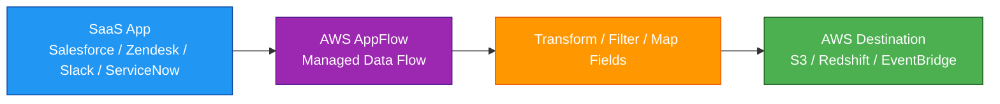
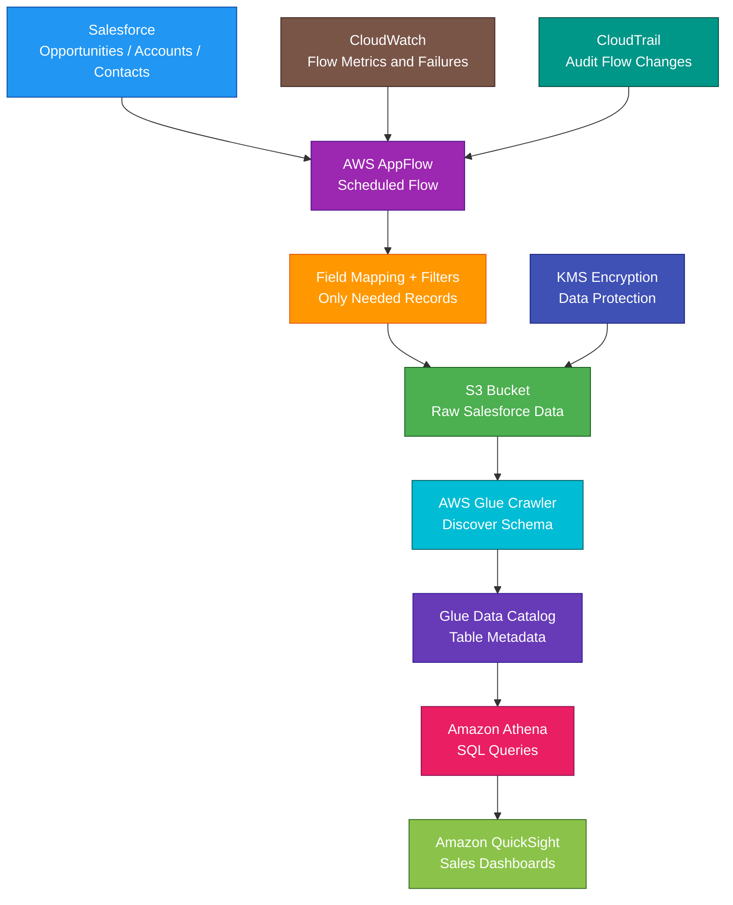

# AWS AppFlow

<details>
<summary>

## 1. Definition

</summary>

### Simple Definition

AWS AppFlow, officially Amazon AppFlow, is a fully managed integration service that transfers data between SaaS applications and AWS services.

It helps you move data without writing custom integration code.

### Memory Hook

AppFlow = No-code data flow between SaaS apps and AWS.

### Basic Idea

You choose a source, choose a destination, map fields, configure filters or transformations, and run the flow.



### Key Point

AppFlow is mainly for integrating SaaS applications with AWS services.

It is not a general ETL platform like AWS Glue and not a database migration tool like AWS DMS.

</details>

<details>
<summary>

## 2. What Problem Does It Solve?

</summary>

### Main Problem

AppFlow solves the problem of securely moving data between SaaS applications and AWS without building custom API integrations.

### Without AppFlow

You may need to build and manage:

- Custom API scripts
- OAuth authentication logic
- SaaS API pagination
- Retry handling
- Field mapping
- Data filtering
- Data transformation
- Scheduling
- Error handling
- Secure data transfer
- Custom monitoring

### With AppFlow

AWS manages the integration flow.

You configure:

- Source application
- Destination service
- Authentication
- Field mappings
- Filters
- Transformations
- Trigger type
- Encryption
- Error handling

### Key Benefit

AppFlow reduces custom integration code and makes SaaS-to-AWS data movement easier, faster, and more secure.

</details>

<details>
<summary>

## 3. Core Use Cases

</summary>

### SaaS Data Ingestion to S3

Use AppFlow to move SaaS data into Amazon S3.

Example:

Salesforce customer records → AppFlow → S3 data lake

### SaaS Data to Redshift

Use AppFlow to move business data into Amazon Redshift for analytics.

Example:

Salesforce opportunities → Redshift → QuickSight dashboards

### SaaS Events to EventBridge

Use AppFlow to send SaaS events to Amazon EventBridge.

Example:

Zendesk ticket update → EventBridge → Lambda workflow

### CRM Analytics

Use AppFlow to extract CRM data for analytics.

Examples:

- Salesforce leads
- Opportunities
- Contacts
- Accounts
- Cases

### Support Data Analytics

Use AppFlow to move support system data into AWS.

Examples:

- Zendesk tickets
- ServiceNow incidents
- Customer support cases

### Marketing Data Integration

Use AppFlow to move marketing data to AWS for reporting.

Examples:

- Campaign performance
- Lead data
- Engagement metrics
- Customer journeys

### Bi-Directional SaaS Sync

Some connectors support using SaaS apps as both source and destination.

Example:

Transfer data from S3 to Salesforce to create or update records.

### No-Code Integration

Use AppFlow when teams need SaaS integration but do not want to build and maintain custom code.

</details>

<details>
<summary>

## 4. Important Features for SAA

</summary>

### Flow

A flow is the main AppFlow resource.

It defines:

- Source
- Destination
- Trigger
- Field mapping
- Filters
- Transformations
- Validation
- Encryption
- Error handling

### Source

The source is where data comes from.

Common source examples:

- Salesforce
- SAP
- Zendesk
- ServiceNow
- Slack
- Google Analytics
- Marketo
- Custom connector sources

### Destination

The destination is where data is sent.

Common destination examples:

- Amazon S3
- Amazon Redshift
- Amazon EventBridge
- Salesforce
- Snowflake
- Other supported SaaS or analytics destinations

### Connector

A connector lets AppFlow connect to a specific application or service.

Example:

The Salesforce connector lets AppFlow transfer data to or from Salesforce.

### Connector Profile

A connector profile stores connection details and authentication configuration for a connector.

Examples:

- OAuth credentials
- API connection settings
- Private connection settings
- KMS encryption settings

### Trigger Types

A trigger controls when the flow runs.

| Trigger Type | Meaning | Best For |
|---|---|---|
| On demand | Run manually | One-time transfer or testing |
| Scheduled | Run on a schedule | Regular sync jobs |
| Event-triggered | Run when source event happens | Near real-time SaaS event flows |

### On-Demand Flow

An on-demand flow runs only when you manually start it.

Use it for:

- Testing
- One-time imports
- Manual data movement
- Ad hoc transfers

### Scheduled Flow

A scheduled flow runs at a recurring time.

Use it for:

- Hourly sync
- Daily reports
- Nightly SaaS export
- Periodic analytics loading

### Event-Triggered Flow

An event-triggered flow runs when a supported source application emits an event.

Use it for:

- Near real-time updates
- SaaS event processing
- Workflow automation

### Field Mapping

Field mapping connects source fields to destination fields.

Example:

| Source Field | Destination Field |
|---|---|
| `AccountName` | `customer_name` |
| `Email` | `email_address` |
| `CreatedDate` | `created_at` |

### Filters

Filters limit which records are transferred.

Example:

Only transfer Salesforce opportunities where:

```text
Stage = Closed Won
```

### Transformations

Transformations modify data before writing it to the destination.

Examples:

- Mask values
- Concatenate fields
- Truncate fields
- Validate field values
- Format values
- Map source fields to destination fields

### Validation

Validation checks can help ensure data meets expected rules before transfer.

Example:

Reject records where required fields are missing.

### Incremental Transfer

For supported sources, AppFlow can transfer only new or changed records.

This helps reduce cost and avoid repeatedly transferring full datasets.

### Full Transfer

A full transfer moves all selected records from source to destination.

Use it for:

- Initial load
- Backfill
- Small datasets
- Rebuilds

### Private Connectivity

AppFlow can use AWS PrivateLink for supported connectors and scenarios.

Use private connectivity when data should avoid the public internet.

### Data Formats

When writing to S3, AppFlow can support common analytics-friendly formats depending on configuration.

Common examples:

- JSON
- CSV
- Parquet

### Partitioning

For S3 destinations, partitioning can organize output data.

Example:

```text
s3://bucket/salesforce/year=2026/month=05/day=04/
```

Partitioning helps downstream tools like Athena scan less data.

### Error Handling

AppFlow can send failed records to an error location, such as S3.

Use error handling to troubleshoot bad records without losing the whole flow.

### CloudWatch Metrics

AppFlow integrates with CloudWatch for monitoring.

Useful metrics include:

- Flow runs
- Records processed
- Flow failures
- Data transferred
- Execution status

### CloudTrail Integration

CloudTrail records AppFlow API activity.

Use it to audit:

- Flow creation
- Flow updates
- Flow runs
- Connector changes
- Permission changes

</details>

<details>
<summary>

## 5. Security Model

</summary>

### IAM Permissions

IAM controls who can create, update, delete, and run AppFlow flows.

Common permissions:

| Permission | Purpose |
|---|---|
| `appflow:CreateFlow` | Create a flow |
| `appflow:UpdateFlow` | Modify a flow |
| `appflow:DeleteFlow` | Delete a flow |
| `appflow:StartFlow` | Start a flow |
| `appflow:StopFlow` | Stop a flow |
| `appflow:DescribeFlow` | View flow details |
| `appflow:CreateConnectorProfile` | Create connector profile |

### Service Role

AppFlow may use IAM roles to access AWS destinations.

Example:

A flow writing to S3 needs permission to put objects into the target bucket.

A flow writing to Redshift may need permissions for S3 staging and Redshift access.

### Source Authentication

AppFlow authenticates to SaaS applications using supported authentication methods.

Common examples:

- OAuth
- API tokens
- Basic credentials, where supported
- JWT-based authentication, where supported

### Secrets Handling

Do not hardcode SaaS credentials in custom code.

AppFlow stores connection credentials securely as part of connector profiles.

### Encryption in Transit

AppFlow encrypts data in transit between source and destination.

This protects data as it moves across the network.

### Encryption at Rest

AppFlow encrypts data at rest.

You can use AWS managed keys or customer managed KMS keys where supported.

### KMS Permissions

If using a customer managed KMS key, make sure AppFlow and required users have permission to use the key.

Missing KMS permissions can cause flow failures.

### S3 Security

When AppFlow writes to S3, secure the destination bucket.

Best practices:

- Block public access
- Enable encryption
- Use least privilege bucket policies
- Restrict access by prefix
- Use lifecycle policies
- Enable access logging where needed

### PrivateLink

For supported connectors, AWS PrivateLink can provide private data transfer between AWS and supported SaaS providers.

Use it when security or compliance requires private connectivity.

### Least Privilege

Give users and flows only the permissions they need.

Examples:

- A flow can write only to one S3 prefix
- An analyst can view flows but not edit connector credentials
- A data engineer can start a flow but not delete it

### CloudTrail Auditing

Use CloudTrail to audit AppFlow management activity.

Examples:

- Who created a flow
- Who changed a connector profile
- Who started or stopped a flow
- Who modified destination settings

### Shared Responsibility

AWS is responsible for:

- AppFlow managed service infrastructure
- Secure managed data transfer service
- Service availability
- Encryption support
- Physical security

You are responsible for:

- IAM permissions
- SaaS authorization
- Connector profile security
- KMS key policies
- Destination bucket security
- Data classification
- Flow configuration
- Monitoring flow failures
- Downstream data access controls

</details>

<details>
<summary>

## 6. High Availability / Durability Behavior

</summary>

### Availability

AppFlow is a managed AWS service.

AWS manages the service infrastructure used to run flows.

### Regional Service

AppFlow flows are created in a specific AWS Region.

Choose the Region close to your AWS destinations and compliant with data requirements.

### Multi-AZ Behavior

AppFlow is managed by AWS across service infrastructure.

You do not configure Multi-AZ manually.

### Data Durability

AppFlow itself is not the final durable storage service.

Durability depends on the destination.

Examples:

| Destination | Durability Behavior |
|---|---|
| S3 | Highly durable object storage |
| Redshift | Managed data warehouse storage and snapshots |
| EventBridge | Event routing, not long-term storage |
| SaaS destination | Depends on SaaS platform |

### Flow Retry Behavior

AppFlow can handle managed transfer execution and errors, but you should still design for failures.

Examples:

- Monitor flow failures
- Configure error handling
- Review failed records
- Retry failed flows where appropriate

### Error Records

For supported destinations, failed records can be written to an error location.

This helps with troubleshooting and reprocessing.

### Multi-Region Behavior

AppFlow does not automatically replicate flows across Regions.

For Multi-Region designs, create flows in each required Region and replicate destination data where needed.

### Source Dependency

Flow availability also depends on the source application.

If the SaaS provider API is unavailable or rate-limited, flow execution can fail or slow down.

### Destination Dependency

Flow success also depends on destination availability and permissions.

Example:

A flow to S3 fails if the bucket policy blocks writes.

### Important Exam Point

AppFlow manages the data movement, but source systems, destination systems, permissions, and quotas still affect reliability.

</details>

<details>
<summary>

## 7. Cost Optimization Options

</summary>

### Transfer Only Needed Data

Use filters to avoid transferring unnecessary records.

Example:

Transfer only closed sales opportunities instead of all opportunities.

### Use Incremental Transfers

For supported sources, use incremental transfer after the first full load.

This reduces repeated data movement.

### Choose Efficient File Format

For S3 analytics destinations, use efficient formats such as Parquet when appropriate.

This can reduce Athena scan cost later.

### Partition S3 Data

Partition S3 output by useful fields.

Examples:

- Date
- Region
- Source object
- Account
- Department

This helps Athena and Glue process less data.

### Schedule Based on Business Need

Do not run flows more often than needed.

Examples:

- Daily sales dashboard may only need daily sync
- Real-time workflow may need event-based flow
- Monthly reports do not need hourly refresh

### Avoid Duplicate Flows

Do not create multiple flows that transfer the same data to the same destination unless required.

### Manage Error Data

Failed records written to S3 can accumulate.

Use S3 lifecycle rules to archive or delete old error records.

### Use S3 Lifecycle Policies

For AppFlow data stored in S3, use lifecycle policies.

Examples:

- Move older data to S3 Standard-IA
- Archive old data to Glacier classes
- Delete temporary staging data

### Monitor Flow Usage

Track:

- Number of flow runs
- Amount of data transferred
- Failed records
- Destination storage growth
- Downstream query cost

### Use AppFlow Instead of Custom Code When Appropriate

AppFlow can reduce engineering and operational cost by replacing custom integration scripts.

</details>

<details>
<summary>

## 8. Common Exam Traps

</summary>

### AppFlow vs Glue

This is a common exam trap.

| Requirement | Choose |
|---|---|
| Move data between SaaS apps and AWS without code | AppFlow |
| Transform, catalog, and run ETL jobs on data | AWS Glue |

### AppFlow vs DMS

DMS migrates and replicates databases.

AppFlow transfers data between SaaS apps and AWS services.

| Requirement | Choose |
|---|---|
| SaaS integration like Salesforce to S3 | AppFlow |
| Database migration with CDC | AWS DMS |

### AppFlow vs DataSync

DataSync moves files and objects between storage systems.

AppFlow moves SaaS application data.

| Requirement | Choose |
|---|---|
| Transfer files from NFS/SMB/EFS/S3 | DataSync |
| Transfer SaaS records to AWS | AppFlow |

### AppFlow vs EventBridge

EventBridge routes events.

AppFlow transfers data records between applications and services.

They can work together.

Example:

AppFlow sends SaaS events to EventBridge.

### AppFlow vs API Gateway

API Gateway exposes APIs.

AppFlow connects SaaS apps and AWS services for managed data transfer.

### AppFlow Is Not a Full ETL Engine

AppFlow supports mapping, filtering, and some transformations.

For complex ETL, use AWS Glue, EMR, or custom processing.

### AppFlow Is Not a Data Warehouse

AppFlow moves data.

Redshift stores and analyzes warehouse data.

### AppFlow Is Not a Data Lake

AppFlow can load data into S3, but S3 is the data lake storage layer.

### Trigger Type Matters

If the question says manual transfer, think on-demand.

If it says recurring transfer, think scheduled.

If it says respond to SaaS changes, think event-triggered flow.

### SaaS API Limits Still Matter

AppFlow uses SaaS APIs.

SaaS rate limits, permissions, and API availability can affect flow success.

### KMS Permissions Can Break Flows

If using customer managed keys, missing KMS permissions can cause failures.

### Destination Permissions Matter

A flow can fail if it lacks permission to write to S3, Redshift, or EventBridge.

</details>

<details>
<summary>

## 9. Compare With Similar Services

</summary>

### Service Comparison Table

| Service | Main Purpose | Best For | Choose When |
|---|---|---|---|
| AWS AppFlow | Managed SaaS data integration | Salesforce/Zendesk/SaaS to AWS data transfer | You need no-code SaaS integration |
| AWS Glue | ETL and Data Catalog | Data transformation and metadata | You need complex ETL or schema cataloging |
| AWS DMS | Database migration and replication | Moving databases with CDC | You need database migration |
| AWS DataSync | Online data transfer | Moving files and objects | You need storage-to-storage transfer |
| Amazon EventBridge | Event bus and routing | Event-driven integration | You need event routing and rules |
| AWS Transfer Family | Managed SFTP/FTPS/FTP/AS2 | Partner file transfer | Users need file transfer protocols |
| Amazon Kinesis Data Firehose | Stream delivery | Deliver streaming data to S3/Redshift/OpenSearch | You need managed streaming delivery |

### AppFlow vs Glue

| Feature | AWS AppFlow | AWS Glue |
|---|---|---|
| Main purpose | SaaS data integration | ETL and cataloging |
| Coding required | No-code/low-code | Often Spark/Python/ETL jobs |
| Best for | Salesforce to S3/Redshift | Transform data in data lake |
| Data Catalog | Not main purpose | Core feature |
| Exam clue | SaaS connector | ETL crawler/job |

### AppFlow vs DMS

| Feature | AWS AppFlow | AWS DMS |
|---|---|---|
| Main purpose | SaaS/app integration | Database migration |
| Source type | SaaS apps and supported services | Databases |
| CDC support | Connector-dependent incremental flows | Strong database CDC focus |
| Best for | SaaS records | Database tables |
| Exam clue | Salesforce/Zendesk | Oracle/MySQL/PostgreSQL migration |

### AppFlow vs DataSync

| Feature | AWS AppFlow | AWS DataSync |
|---|---|---|
| Main purpose | SaaS record transfer | File/object transfer |
| Common source | SaaS apps | NFS, SMB, S3, EFS, FSx |
| Best for | Business app data | Storage migration/sync |
| Exam clue | SaaS connector | File system transfer |

### AppFlow vs EventBridge

| Feature | AWS AppFlow | EventBridge |
|---|---|---|
| Main purpose | Transfer records/data | Route events |
| Flow style | Data movement | Event-driven routing |
| Transformations | Field mapping/filtering | Event filtering/rules |
| Best for | SaaS to AWS data sync | Event bus integration |
| Common use together | Sends SaaS events/data | Routes event to targets |

### AppFlow vs Transfer Family

| Feature | AWS AppFlow | AWS Transfer Family |
|---|---|---|
| Main purpose | SaaS data integration | File transfer protocols |
| Access method | Connectors and APIs | SFTP, FTPS, FTP, AS2 |
| Best for | SaaS records | Partner file exchange |
| Exam clue | Salesforce records | SFTP uploads to S3 |

### When to Choose AppFlow

Choose AppFlow when:

- You need managed SaaS-to-AWS integration
- You need to move Salesforce data to S3 or Redshift
- You need no-code or low-code data flows
- You need scheduled SaaS data sync
- You need event-triggered SaaS data transfer
- You need field mapping and filtering
- You need secure transfer with encryption
- You want to avoid custom API integration scripts
- You need SaaS data for analytics in AWS

</details>

<details>
<summary>

## 10. Mini Architecture Example

</summary>

### Scenario

A company uses Salesforce for sales data.

The analytics team wants daily Salesforce opportunity data in AWS.

They want to store raw data in S3, query it with Athena, and build dashboards in QuickSight.

They do not want to write custom Salesforce API code.

### Architecture

Use AppFlow to transfer Salesforce opportunity records to S3 every day.

Use Glue Data Catalog and Athena to query the S3 data.

Use QuickSight to visualize sales performance.



### Why This Is Good

- AppFlow avoids custom Salesforce API code
- Scheduled flow keeps AWS data updated daily
- Field mapping controls source-to-destination structure
- Filters reduce unnecessary data transfer
- S3 stores raw SaaS data durably
- Glue Data Catalog stores metadata
- Athena queries S3 data using SQL
- QuickSight creates sales dashboards
- KMS protects data at rest
- CloudWatch monitors flow success and failures
- CloudTrail audits flow configuration changes

### Exam Answer Pattern

If the question says:

“Transfer data between Salesforce and AWS services without writing custom code.”

Think:

AWS AppFlow.

If the question says:

“Run ETL transformations and catalog data in a data lake.”

Think:

AWS Glue.

If the question says:

“Migrate relational databases with ongoing replication.”

Think:

AWS DMS.

If the question says:

“Move files between on-premises storage and AWS storage.”

Think:

AWS DataSync.

### Final Memory Hook

AppFlow = Managed SaaS data integration.

Flow = Data transfer definition.

Source = Where data comes from.

Destination = Where data goes.

Connector = Integration with an app/service.

Connector profile = Connection and auth settings.

On demand = Manual run.

Scheduled = Recurring run.

Event-triggered = Run on SaaS event.

Field mapping = Source field to destination field.

Filter = Transfer only matching records.

Transformation = Modify data during flow.

Incremental transfer = Only changed/new records.

S3 = Common destination for data lake.

Redshift = Common analytics destination.

EventBridge = Event routing destination.

Glue = ETL and catalog.

DMS = Database migration.

DataSync = File/object transfer.

Transfer Family = SFTP/FTPS/FTP/AS2.

</details>