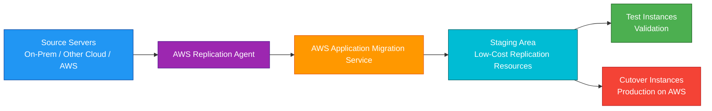
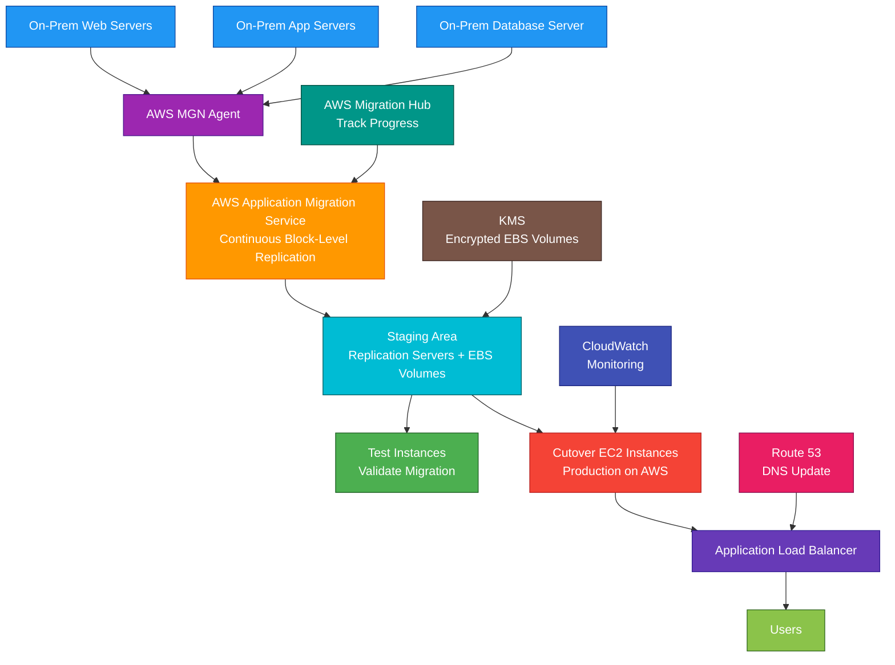

# AWS Application Migration Service

## 1. Definition

### Simple Definition

AWS Application Migration Service, also called AWS MGN, is a managed service for migrating servers to AWS.

It continuously replicates source servers into AWS and lets you launch converted EC2 instances when you are ready to cut over.

### Memory Hook

Application Migration Service = Lift-and-shift servers to AWS.

### Basic Idea

Install an AWS replication agent on source servers.

AWS MGN continuously replicates the servers to AWS.

When ready, launch test or cutover instances in AWS.

### Key Point

AWS Application Migration Service is mainly for migration.

It is not mainly for ongoing disaster recovery.

For ongoing server disaster recovery, use AWS Elastic Disaster Recovery.

## 2. What Problem Does It Solve?

### Main Problem

AWS Application Migration Service solves the problem of moving existing servers to AWS with minimal downtime and minimal application changes.

This is commonly called lift-and-shift migration.

### Without AWS MGN

You may need to manually:

- Rebuild servers in AWS
- Reinstall applications
- Copy large data volumes
- Reconfigure operating systems
- Recreate storage layouts
- Manually test dependencies
- Plan long outage windows
- Manage complex cutover steps

### With AWS MGN

AWS continuously replicates your source servers to AWS.

When ready, you can launch test instances and then cutover instances in AWS.

### Key Benefit

AWS MGN helps migrate servers quickly and reliably while reducing downtime during cutover.

## 3. Core Use Cases

### Lift-and-Shift Migration

Use AWS MGN to move existing applications to AWS without redesigning them first.

Example:

Move a three-tier application from an on-premises data center to EC2.

### Data Center Exit

Use AWS MGN when a company wants to shut down or reduce an on-premises data center.

Example:

Replicate many physical or virtual servers to AWS and cut over in migration waves.

### Cloud-to-AWS Migration

Use AWS MGN to migrate workloads from another cloud provider to AWS.

Example:

Move virtual machines from another cloud into EC2.

### AWS Region-to-Region Migration

Use AWS MGN to migrate servers from one AWS Region to another.

Example:

Move EC2-based workloads from one Region to another for business or compliance reasons.

### Large-Scale Migration Waves

Use AWS MGN to group servers into waves.

Example:

Migrate development servers first, then testing, then production.

### Low-Downtime Server Migration

Use AWS MGN when migration downtime must be minimized.

Continuous replication means only final cutover requires a shorter outage window.

### Migration Testing

Use AWS MGN test launches to validate applications in AWS before production cutover.

## 4. Important Features for SAA

### Source Server

A source server is the original server being migrated.

It can be:

- Physical server
- Virtual machine
- Cloud server
- EC2 instance
- On-premises workload

### Replication Agent

The AWS replication agent is installed on each source server.

It continuously sends changed disk blocks to AWS.

### Continuous Block-Level Replication

AWS MGN replicates data at the block level.

This means it copies disk changes from the source server to AWS continuously.

### Staging Area

The staging area is a low-cost AWS environment used for replication.

It contains resources such as:

- Replication servers
- Staging EBS volumes
- Security groups
- Subnets
- Network interfaces

### Replication Server

A replication server receives replicated data from source servers and writes it to staging EBS volumes.

AWS MGN manages replication servers.

### Staging EBS Volumes

Staging EBS volumes store replicated disk data before test or cutover instances are launched.

They are not the final migrated production servers.

### Test Instance

A test instance is launched in AWS to validate the migrated server before final cutover.

Use test instances to check:

- Application startup
- Network connectivity
- Database access
- Security groups
- Performance
- Dependencies

### Cutover Instance

A cutover instance is the final EC2 instance launched during migration cutover.

After cutover, production traffic moves to the AWS instance.

### Launch Template

AWS MGN uses launch settings to define how migrated EC2 instances are created.

Settings can include:

- EC2 instance type
- Subnet
- Security group
- IAM instance profile
- Private IP behavior
- Tags
- User data
- Volume type
- Licensing options

### Replication Settings

Replication settings control the replication environment.

Examples:

- Staging subnet
- Replication server type
- EBS volume type
- Encryption
- Bandwidth throttling
- Data routing
- Security groups

### Migration Lifecycle

A typical AWS MGN migration includes:

1. Install replication agent.
2. Start continuous replication.
3. Wait for initial sync.
4. Launch test instances.
5. Validate application.
6. Schedule cutover.
7. Launch cutover instances.
8. Redirect traffic.
9. Finalize cutover.
10. Decommission old servers.

### Initial Sync

Initial sync is the first full replication of source server disks to AWS.

After initial sync, AWS MGN continues replicating only changed blocks.

### Cutover

Cutover is the final migration step where production moves from the source server to the AWS instance.

Common cutover tasks:

- Stop source application writes
- Launch cutover instance
- Validate service
- Update DNS
- Redirect traffic
- Monitor application

### Migration Waves

A migration wave is a group of servers migrated together.

Example:

Wave 1: development servers

Wave 2: internal tools

Wave 3: production application servers

### Application Grouping

Group servers that belong to the same application.

This helps migrate dependent servers together.

Example:

- Web server
- App server
- Database server
- Batch server

### Conversion

AWS MGN converts source servers so they can boot and run on EC2.

This helps source workloads become AWS-compatible.

### Post-Launch Actions

Post-launch actions can run automation after test or cutover instances launch.

Examples:

- Install AWS Systems Manager Agent
- Configure monitoring
- Run validation scripts
- Install security tools
- Apply migration-specific changes

### AWS Migration Hub Integration

AWS MGN integrates with AWS Migration Hub for tracking migration progress.

Migration Hub helps centralize migration visibility.

### Supported Migration Type

AWS MGN is best for rehost migrations.

Rehost means moving applications to AWS with minimal changes.

### Rehost Strategy

Rehost is one of the common migration strategies.

Memory hook:

Rehost = Lift and shift.

## 5. Security Model

### IAM Permissions

IAM controls who can configure, manage, test, and cut over migrations.

Common permissions:

| Permission | Purpose |
|---|---|
| `mgn:InitializeService` | Initialize AWS MGN |
| `mgn:DescribeSourceServers` | View source servers |
| `mgn:StartTest` | Launch test instances |
| `mgn:StartCutover` | Launch cutover instances |
| `mgn:FinalizeCutover` | Finalize migration |
| `mgn:UpdateLaunchConfiguration` | Modify launch settings |
| `mgn:UpdateReplicationConfiguration` | Modify replication settings |
| `mgn:DisconnectFromService` | Disconnect source server |

### Least Privilege

Give migration permissions only to users and roles that need them.

Example:

Migration engineers may start test launches, but only migration leads should start production cutover.

### Service-Linked Role

AWS MGN uses service-linked roles to create and manage required AWS resources.

Examples:

- Replication servers
- EBS volumes
- Snapshots
- Network interfaces
- EC2 test instances
- EC2 cutover instances

### Replication Agent Security

The replication agent should be installed and managed securely.

Protect:

- Source server access
- Agent installation credentials
- Network connectivity
- Operating system security
- Migration project permissions

### Encryption in Transit

Replication traffic is encrypted in transit.

This protects data moving from source servers to AWS.

### Encryption at Rest

Replicated data can be encrypted at rest using EBS encryption and AWS KMS.

Use customer managed KMS keys when you need more control.

### KMS Permissions

If using a customer managed KMS key, make sure AWS MGN has permission to use it.

Wrong KMS permissions can break replication, test launch, or cutover launch.

### Network Security

Control network access between source servers and AWS.

Common options:

- Internet with encrypted replication
- Site-to-Site VPN
- AWS Direct Connect
- Private routing where appropriate

### Security Groups

Use security groups to control access to:

- Replication servers
- Test instances
- Cutover instances
- Application ports
- Administrative ports

### Staging Area Security

The staging area should be restricted.

It is used for replication, not normal user traffic.

### Cutover Instance Security

Cutover instances should launch with production-ready security.

Examples:

- Correct security groups
- Private subnet placement where appropriate
- IAM instance profile
- KMS encryption
- Monitoring agent
- Patch baseline
- Endpoint protection where required

### Secrets and Credentials

Do not put secrets in migration scripts or user data in plaintext.

Use:

- AWS Secrets Manager
- Systems Manager Parameter Store
- IAM roles
- KMS encryption

### Logging and Auditing

Use AWS logging services.

Common tools:

- CloudTrail for AWS API activity
- CloudWatch for logs and metrics
- VPC Flow Logs for network traffic visibility
- AWS Config for resource configuration tracking

### Shared Responsibility

AWS is responsible for:

- AWS MGN managed service infrastructure
- Replication orchestration
- Server conversion automation
- AWS infrastructure availability
- Physical security

You are responsible for:

- Installing agents on source servers
- IAM permissions
- Network connectivity
- Security groups
- KMS key policies
- Launch settings
- Application validation
- Cutover planning
- DNS updates
- Decommissioning source servers safely

## 6. High Availability / Durability Behavior

### Availability

AWS MGN helps reduce migration downtime by continuously replicating servers before cutover.

It does not automatically make the migrated application highly available.

### Regional Behavior

AWS MGN replicates servers into a selected AWS Region.

For cross-Region migration, configure the target Region where migrated instances should launch.

### Multi-AZ Behavior

The staging area and launched instances use the subnets and Availability Zones you configure.

For production high availability after migration, design the target architecture with Multi-AZ where needed.

### Replication Durability

Replicated data is stored on EBS volumes and snapshots in AWS.

Durability depends on AWS storage services and your configuration.

### Initial Sync and Ongoing Replication

Initial sync copies source server disks to AWS.

After that, ongoing replication sends changed blocks.

This helps keep cutover data current.

### Low-Downtime Cutover

Continuous replication supports low-downtime migration.

Actual downtime depends on:

- Final sync lag
- Application shutdown time
- Instance launch time
- Validation time
- DNS changes
- Dependency updates

### Test Launch Safety

Test launches do not stop source servers.

This allows migration validation before production cutover.

### Cutover Planning

A successful cutover should include:

- Maintenance window
- Application freeze or write stop
- Final replication check
- Cutover launch
- Application validation
- DNS or routing update
- Rollback plan
- Monitoring

### Multi-Region Behavior

AWS MGN is not a global active-active service.

For Multi-Region architecture after migration, design using AWS-native services such as:

- Route 53
- CloudFront
- Global Accelerator
- Aurora Global Database
- DynamoDB Global Tables
- S3 Cross-Region Replication

### Important Exam Point

AWS MGN helps migrate servers to AWS, but after migration you should improve architecture using AWS high-availability best practices.

## 7. Cost Optimization Options

### Low-Cost Staging Area

AWS MGN uses a low-cost staging area during replication.

This avoids running full-size production instances before cutover.

### Right-Size Replication Servers

Choose replication server types based on replication needs.

Avoid overprovisioning staging resources.

### Choose Appropriate EBS Volume Types

Use cost-effective EBS volume types for staging when high performance is not required.

### Launch Test Instances Only When Needed

Test instances create EC2 and EBS cost.

Run tests when needed, then terminate test instances after validation.

### Clean Up After Cutover

After migration is complete, clean up:

- Staging area resources
- Test instances
- Old snapshots
- Unused EBS volumes
- Temporary security groups
- Unused migration resources

### Right-Size Cutover Instances

Source servers may be oversized.

Use migration as a chance to right-size EC2 instance types.

Use:

- CloudWatch metrics
- AWS Compute Optimizer
- Application performance testing
- Historical utilization data

### Use Savings Plans or Reserved Instances

For steady migrated workloads, consider:

- Compute Savings Plans
- EC2 Instance Savings Plans
- Reserved Instances

### Modernize After Migration

Lift-and-shift is often the first step.

After migration, reduce cost by modernizing:

- Move static files to S3 and CloudFront
- Use managed databases
- Use Auto Scaling
- Use containers
- Use serverless services where appropriate

### Avoid Migrating Unused Servers

Before migration, identify and remove unused servers.

Do not migrate waste.

### Tag Migration Resources

Use tags for cost tracking.

Examples:

- `Application`
- `MigrationWave`
- `Environment`
- `Owner`
- `CostCenter`

### Monitor Migration Costs

Track cost during migration using:

- Cost Explorer
- AWS Budgets
- Tags
- Migration wave reporting

## 8. Common Exam Traps

### AWS MGN vs AWS DRS

This is the biggest exam trap.

| Requirement | Choose |
|---|---|
| One-time migration to AWS | AWS Application Migration Service |
| Ongoing disaster recovery to AWS | AWS Elastic Disaster Recovery |

### AWS MGN Is for Migration

AWS MGN is mainly used to move workloads to AWS.

After cutover is finalized, the migration is complete.

### AWS DRS Is for Disaster Recovery

AWS DRS continuously replicates servers for recovery during disaster.

It is an ongoing DR solution.

### AWS MGN vs AWS Backup

AWS Backup centrally manages backups.

AWS MGN continuously replicates servers for migration cutover.

### AWS MGN vs DMS

AWS MGN migrates entire servers.

AWS Database Migration Service migrates databases.

| Requirement | Choose |
|---|---|
| Migrate full server | AWS MGN |
| Migrate database data | AWS DMS |

### AWS MGN vs DataSync

DataSync moves files and object data.

AWS MGN migrates servers at block level.

### AWS MGN vs Snowball

Snowball moves large datasets offline using physical devices.

AWS MGN replicates servers over the network.

### Agent Is Usually Required

AWS MGN commonly requires installing the replication agent on source servers.

If agent installation is not possible, another migration method may be needed.

### Staging Area Is Not Production

The staging area is only for replication.

Production runs on test or cutover instances after launch.

### Test Launch Is Not Cutover

A test launch validates the migration.

Cutover is the final production switch.

### Continuous Replication Reduces Downtime

It does not eliminate all downtime.

Applications may still need a short cutover window.

### Migration Does Not Automatically Modernize

AWS MGN rehosts servers.

It does not automatically redesign the application into serverless, containers, or managed databases.

### Cutover Needs DNS and Dependency Updates

Launching EC2 instances is only part of migration.

You may still need to update:

- DNS records
- Load balancers
- Firewall rules
- Application configs
- Database endpoints
- Certificates
- Monitoring
- Backup plans

## 9. Compare With Similar Services

### Service Comparison Table

| Service | Main Purpose | Best For | Choose When |
|---|---|---|---|
| AWS Application Migration Service | Server lift-and-shift migration | Moving servers to AWS | You need to migrate full servers with minimal changes |
| AWS Elastic Disaster Recovery | Ongoing server disaster recovery | Low RPO/RTO DR to AWS | You need continuous DR replication and failover |
| AWS Database Migration Service | Database migration | Moving databases with minimal downtime | You need to migrate database engines or data |
| AWS DataSync | Online data transfer | File/object data movement | You need to move NFS, SMB, S3, or object data |
| AWS Snowball | Offline data transfer | Very large data migration with limited bandwidth | Network transfer is too slow or expensive |
| AWS Migration Hub | Migration tracking | Central migration visibility | You need to track migration progress |
| AWS Backup | Backup management | Centralized backup policies | You need backup and restore, not server migration |

### AWS MGN vs AWS DRS

| Feature | AWS MGN | AWS DRS |
|---|---|---|
| Main purpose | Migration | Disaster recovery |
| Usage pattern | Temporary migration project | Ongoing DR protection |
| Final action | Cutover to AWS | Failover during disaster |
| Best for | Moving workloads to AWS | Recovering workloads in AWS |
| Exam clue | Rehost migration | Low RPO/RTO DR |

### AWS MGN vs AWS DMS

| Feature | AWS MGN | AWS DMS |
|---|---|---|
| Main purpose | Server migration | Database migration |
| Replication level | Block-level server disk replication | Database-level replication |
| Migrates OS and apps | Yes | No |
| Best for | Full server lift-and-shift | Database migration or replication |
| Exam clue | Migrate application servers | Migrate database with CDC |

### AWS MGN vs DataSync

| Feature | AWS MGN | DataSync |
|---|---|---|
| Main purpose | Migrate servers | Move data |
| Data type | Full server disks | Files, objects, storage systems |
| Output | EC2 instances | S3, EFS, FSx, storage targets |
| Best for | Rehosting workloads | Data transfer and sync |

### AWS MGN vs Snowball

| Feature | AWS MGN | Snowball |
|---|---|---|
| Transfer method | Network replication | Physical device |
| Best for | Server migration with network connectivity | Huge offline data transfer |
| Output | EC2 migrated servers | Data in AWS storage |
| Exam clue | Replicate running servers | Limited bandwidth, petabyte-scale data transfer |

### AWS MGN vs Migration Hub

| Feature | AWS MGN | Migration Hub |
|---|---|---|
| Main purpose | Perform server migration | Track migration progress |
| Replicates servers | Yes | No |
| Central dashboard | Some visibility | Yes, migration tracking |
| Common use together | Yes | Yes |

### When to Choose AWS Application Migration Service

Choose AWS MGN when:

- You need to migrate servers to AWS
- You need lift-and-shift migration
- You want minimal application changes
- You want continuous block-level replication before cutover
- You need test launches before migration
- You need low-downtime cutover
- You are migrating from on-premises, another cloud, or another AWS Region
- You want to avoid manually rebuilding servers in AWS
- You are doing a rehost migration strategy

## 10. Mini Architecture Example

### Scenario

A company runs a three-tier application in an on-premises data center.

The application includes web servers, application servers, and a database server.

The company wants to migrate the application to AWS with minimal code changes and limited downtime.

### Architecture

Install the AWS MGN replication agent on each source server.

Replicate the servers continuously into the AWS staging area.

Launch test instances to validate the application in AWS.

During cutover, launch cutover instances, update DNS, and route users to the AWS environment.

### Why This Is Good

- AWS MGN supports lift-and-shift migration
- Continuous replication reduces cutover downtime
- Test instances allow validation before production migration
- Cutover instances become the production AWS servers
- Route 53 redirects users to the migrated application
- KMS protects replicated EBS data at rest
- CloudWatch monitors migrated workloads
- Migration Hub tracks migration progress
- Applications can move to AWS with minimal code changes
- After migration, the company can modernize later

### Exam Answer Pattern

If the question says:

“Migrate physical, virtual, or cloud servers to AWS with minimal downtime and minimal changes.”

Think:

AWS Application Migration Service.

If the question says:

“Continuously replicate servers to AWS for disaster recovery and failover.”

Think:

AWS Elastic Disaster Recovery.

If the question says:

“Migrate databases with ongoing replication and change data capture.”

Think:

AWS Database Migration Service.

If the question says:

“Move files or objects between storage systems.”

Think:

AWS DataSync.

### Final Memory Hook

AWS MGN = Application Migration Service.

Purpose = Server migration.

Strategy = Rehost / lift and shift.

Agent = Installed on source servers.

Replication = Continuous block-level replication.

Source server = Original server.

Staging area = Low-cost replication environment.

Replication server = Receives replicated data.

Staging EBS volume = Stores replicated disk blocks.

Test launch = Validate before cutover.

Cutover launch = Final production migration.

Finalize cutover = Complete migration.

Migration Hub = Track migration.

AWS DRS = Disaster recovery.

DMS = Database migration.

DataSync = Data movement.

Snowball = Offline large data transfer.

