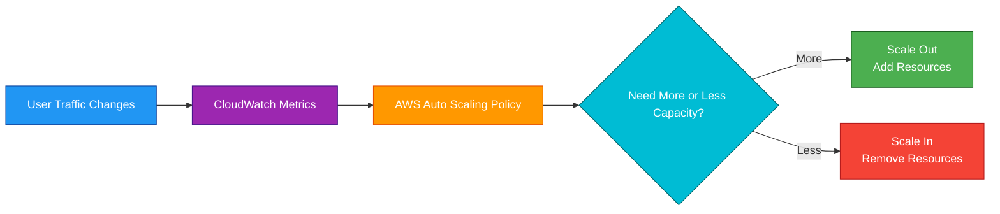
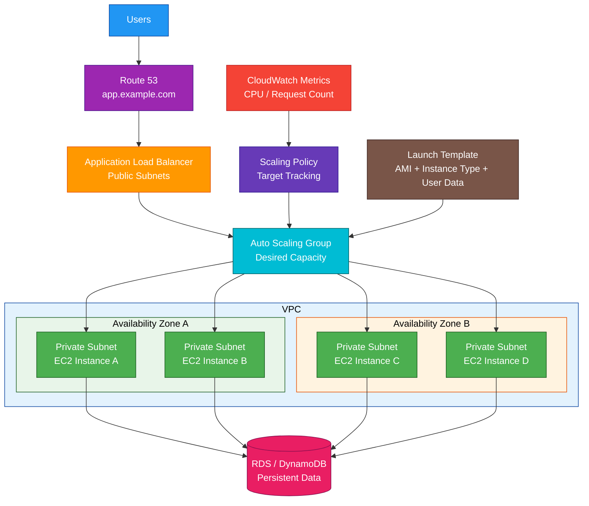

# AWS Auto Scaling

## 1. Definition

### Simple Definition

AWS Auto Scaling helps automatically adjust compute capacity based on demand.

It can add resources when traffic increases and remove resources when traffic decreases.

### Memory Hook

Auto Scaling = Automatically adds or removes capacity.

### Basic Idea

Instead of manually launching more servers during busy times, Auto Scaling watches metrics and adjusts capacity for you.

### Key Point

For the AWS SAA exam, Auto Scaling usually means Amazon EC2 Auto Scaling, but the broader AWS Auto Scaling family can also scale other services.

Common scalable resources include:

- EC2 Auto Scaling Groups
- ECS services
- DynamoDB tables and indexes
- Aurora read replicas
- Spot Fleet
- AppStream 2.0 fleets

## 2. What Problem Does It Solve?

### Main Problem

AWS Auto Scaling solves the problem of matching resource capacity to real application demand.

If demand increases, it adds capacity.

If demand decreases, it removes unnecessary capacity.

### Without Auto Scaling

You may have problems such as:

- Too few servers during traffic spikes
- Too many servers during quiet times
- Manual scaling work
- Higher cost from idle resources
- Poor availability during failures
- Slow response to changing demand

### With Auto Scaling

AWS can automatically maintain the right amount of capacity based on your rules and metrics.

### Key Benefit

Auto Scaling improves availability and cost efficiency by adjusting capacity automatically.

## 3. Core Use Cases

### Scale Web Applications

Use EC2 Auto Scaling with an Application Load Balancer to add or remove EC2 instances based on demand.

Example:

Add more EC2 instances when CPU usage or request count increases.

### Replace Failed Instances

EC2 Auto Scaling can detect unhealthy instances and replace them.

This helps maintain the desired number of healthy instances.

### Handle Traffic Spikes

Use scaling policies to respond to sudden increases in traffic.

Examples:

- Marketing campaign
- Flash sale
- Product launch
- Exam registration deadline

### Reduce Cost During Low Demand

Scale in when traffic decreases.

Example:

Run fewer instances overnight when users are inactive.

### Scheduled Scaling

Use scheduled scaling when demand follows a predictable schedule.

Example:

Scale out every weekday at 8 AM and scale in at 8 PM.

### Container Service Scaling

Use Application Auto Scaling to scale ECS services based on CPU, memory, or custom metrics.

### Database Read Scaling

Use Application Auto Scaling to scale supported read capacity or replicas.

Examples:

- DynamoDB read/write capacity
- Aurora read replicas

## 4. Important Features for SAA

### EC2 Auto Scaling Group

An Auto Scaling Group, or ASG, is a collection of EC2 instances managed together.

It controls:

- Minimum capacity
- Desired capacity
- Maximum capacity
- Launch template
- Availability Zones
- Scaling policies
- Health checks

### Minimum Capacity

Minimum capacity is the smallest number of instances the group should maintain.

Example:

Minimum = 2 means the ASG keeps at least 2 instances running.

### Desired Capacity

Desired capacity is the number of instances Auto Scaling tries to keep running right now.

Example:

Desired = 4 means the ASG tries to keep 4 healthy instances.

### Maximum Capacity

Maximum capacity is the largest number of instances the group can scale to.

Example:

Maximum = 10 means the ASG cannot launch more than 10 instances.

### Launch Template

A launch template defines how EC2 instances are launched.

It can include:

- AMI
- Instance type
- Key pair
- Security groups
- IAM instance profile
- User data
- Storage settings
- Network settings

### Launch Configuration

Launch configurations are older than launch templates.

For new workloads, launch templates are preferred.

### Scale Out

Scale out means adding more capacity.

Example:

Add more EC2 instances when CPU usage is high.

### Scale In

Scale in means removing capacity.

Example:

Terminate extra EC2 instances when traffic decreases.

### Scaling Policy

A scaling policy defines when and how Auto Scaling changes capacity.

Common scaling policies:

| Scaling Policy | Best For |
|---|---|
| Target tracking scaling | Simple automatic scaling to keep a metric near a target |
| Step scaling | Scaling in different steps based on alarm severity |
| Simple scaling | Basic scaling action after an alarm |
| Scheduled scaling | Predictable demand patterns |
| Predictive scaling | Forecast-based scaling for recurring patterns |

### Target Tracking Scaling

Target tracking keeps a metric close to a target value.

Example:

Keep average ASG CPU utilization around 50%.

This is a common SAA answer when the question asks for simple dynamic scaling.

### Step Scaling

Step scaling changes capacity based on how far a metric is beyond a threshold.

Example:

- CPU > 60%: add 1 instance
- CPU > 80%: add 3 instances

### Simple Scaling

Simple scaling performs one scaling action when an alarm triggers.

It is less flexible than target tracking or step scaling.

### Scheduled Scaling

Scheduled scaling changes capacity at specific times.

Use it when traffic patterns are predictable.

Example:

Increase capacity before business hours.

### Predictive Scaling

Predictive scaling uses historical patterns to forecast future demand.

Use it for workloads with repeated patterns.

Example:

Traffic increases every weekday morning.

### CloudWatch Metrics

Auto Scaling often uses CloudWatch metrics.

Common metrics:

- CPU utilization
- Network in/out
- ALB request count per target
- Custom application metrics
- SQS queue depth
- ECS CPU and memory

### CloudWatch Alarms

CloudWatch alarms can trigger scaling policies.

Example:

If average CPU is above 70% for 5 minutes, scale out.

### Health Checks

Auto Scaling uses health checks to decide if instances are healthy.

Common health check types:

| Health Check Type | Purpose |
|---|---|
| EC2 health check | Checks EC2 instance status |
| ELB health check | Checks if load balancer sees target as healthy |
| Custom health check | Application-defined health status |

### ELB Health Checks

When using a load balancer, configure ASG to use ELB health checks.

This allows Auto Scaling to replace instances that fail application health checks.

### Multi-AZ Scaling

An Auto Scaling Group can launch instances across multiple Availability Zones.

This improves availability and fault tolerance.

### Load Balancer Integration

ASGs commonly integrate with Elastic Load Balancing.

Common pattern:

Users → ALB → Auto Scaling Group → EC2 instances

### Auto Scaling and Auto Healing

Auto Scaling is not only for traffic growth.

It also helps replace unhealthy instances to maintain desired capacity.

### Cooldown

Cooldown is a period after a scaling action when Auto Scaling waits before another scaling action.

This helps prevent rapid scaling in and out.

### Warmup

Instance warmup gives new instances time to start and become useful before they affect scaling decisions.

### Lifecycle Hooks

Lifecycle hooks pause instances during launch or termination so custom actions can run.

Examples:

- Install software before serving traffic
- Download configuration
- Drain logs before termination
- Deregister safely from systems

### Termination Policy

Termination policies control which instances are terminated first during scale-in.

Examples:

- Oldest instance
- Newest instance
- Closest to next billing hour
- Default policy

### Capacity Rebalancing

Capacity Rebalancing helps replace Spot Instances that are at elevated risk of interruption.

Use it with mixed instance policies and Spot capacity.

### Mixed Instances Policy

A mixed instances policy allows an ASG to use multiple instance types and purchase options.

Examples:

- On-Demand Instances
- Spot Instances
- Different instance families and sizes

### Application Auto Scaling

Application Auto Scaling scales resources beyond EC2 Auto Scaling Groups.

Examples:

- ECS services
- DynamoDB capacity
- Aurora read replicas
- Spot Fleet
- AppStream fleets

### AWS Auto Scaling Plans

AWS Auto Scaling plans can help manage scaling for multiple resources.

For SAA, focus more on EC2 Auto Scaling Groups and Application Auto Scaling concepts.

## 5. Security Model

### IAM Permissions

IAM controls who can create, modify, and manage Auto Scaling resources.

Common permissions:

| Permission | Purpose |
|---|---|
| `autoscaling:CreateAutoScalingGroup` | Create Auto Scaling Group |
| `autoscaling:UpdateAutoScalingGroup` | Modify Auto Scaling Group |
| `autoscaling:DeleteAutoScalingGroup` | Delete Auto Scaling Group |
| `autoscaling:PutScalingPolicy` | Create scaling policy |
| `autoscaling:SetDesiredCapacity` | Manually change desired capacity |
| `autoscaling:TerminateInstanceInAutoScalingGroup` | Terminate instance in ASG |
| `ec2:RunInstances` | Launch EC2 instances |
| `iam:PassRole` | Pass IAM role to launched instances |

### Service-Linked Role

Auto Scaling uses service-linked roles to manage AWS resources on your behalf.

Example:

It needs permission to launch and terminate EC2 instances in an Auto Scaling Group.

### IAM Instance Profile

EC2 instances launched by an ASG can use an IAM instance profile.

This gives applications on the instances permission to access AWS services.

Example:

An EC2 instance needs permission to read objects from S3.

### Security Groups

Security groups control network access to EC2 instances launched by the ASG.

Common pattern:

- ALB security group allows HTTPS from users
- EC2 security group allows traffic only from ALB security group
- Database security group allows traffic only from EC2 security group

### User Data Security

Launch templates can include user data scripts.

Do not put plaintext secrets in user data.

Use secure services instead:

- AWS Secrets Manager
- Systems Manager Parameter Store
- IAM roles
- KMS encryption

### Least Privilege

Give Auto Scaling administrators only required permissions.

Avoid broad permissions such as full administrator access unless needed.

### Network Placement

For production web apps:

- Load balancer in public subnets
- EC2 instances in private subnets
- Database in private subnets
- NAT Gateway or VPC endpoints for outbound access

### Patch and Image Security

Auto Scaling can launch instances from AMIs.

You are responsible for keeping AMIs patched and secure.

Use:

- Golden AMIs
- EC2 Image Builder
- Systems Manager Patch Manager
- Inspector vulnerability scanning

### Shared Responsibility

AWS is responsible for:

- Auto Scaling service infrastructure
- Scaling orchestration
- Managed service availability
- Integration with CloudWatch and EC2
- Physical security

You are responsible for:

- Scaling policies
- Launch templates
- IAM roles
- Security groups
- AMI patching
- Application health checks
- User data scripts
- Instance hardening
- Monitoring scaling behavior

## 6. High Availability / Durability Behavior

### Availability

Auto Scaling improves availability by keeping the desired number of healthy resources running.

For EC2, it can replace failed instances automatically.

### Multi-AZ Behavior

An Auto Scaling Group can span multiple Availability Zones.

Best practice:

Use at least two Availability Zones for production workloads.

### AZ Failure Handling

If one Availability Zone has problems, Auto Scaling can launch instances in healthy Availability Zones if capacity and configuration allow.

### Load Balancer Health Checks

When integrated with ELB, Auto Scaling can replace instances that fail load balancer health checks.

This helps detect application-level failures, not just EC2 hardware failures.

### Desired Capacity Maintenance

Auto Scaling continuously tries to maintain desired capacity.

Example:

If desired capacity is 4 and one instance fails, Auto Scaling launches a replacement.

### Fault Tolerance

Auto Scaling improves fault tolerance when combined with:

- Multiple Availability Zones
- Load balancers
- Health checks
- Stateless application design
- External durable storage
- Auto Scaling policies

### Stateless Design

Instances in an ASG should usually be stateless.

Store important data outside the instances.

Use durable services such as:

- S3
- EFS
- RDS
- Aurora
- DynamoDB
- ElastiCache for sessions where appropriate

### Multi-Region Behavior

Auto Scaling Groups are regional.

For Multi-Region applications, create Auto Scaling Groups in each Region and use global routing.

Common services:

- Route 53
- CloudFront
- AWS Global Accelerator

### Durability

Auto Scaling is not a storage service.

It launches and removes compute capacity.

Do not store important data only on EC2 instance local disks.

### Important Exam Point

Auto Scaling improves application availability, but it does not replace Multi-AZ design, backups, load balancing, or durable storage.

## 7. Cost Optimization Options

### Scale In During Low Demand

Auto Scaling can remove extra capacity when demand drops.

This helps avoid paying for idle instances.

### Use Target Tracking

Target tracking can automatically keep capacity close to demand.

Example:

Keep CPU around 50% instead of overprovisioning instances.

### Use Scheduled Scaling

Use scheduled scaling for predictable patterns.

Example:

Scale out before business hours and scale in after business hours.

### Use Predictive Scaling

Use predictive scaling for repeated traffic patterns.

This can add capacity before demand arrives.

### Use Spot Instances

Use Spot Instances for fault-tolerant workloads.

Spot can reduce compute cost significantly.

Good examples:

- Batch jobs
- Stateless web workers
- Background processing
- Dev/test environments

### Use Mixed Instance Policies

Mixed instance policies allow multiple instance types and purchase options.

This improves capacity availability and cost optimization.

Example:

Use a mix of On-Demand and Spot Instances across multiple instance families.

### Use Savings Plans or Reserved Instances

For steady baseline capacity, use:

- Compute Savings Plans
- EC2 Instance Savings Plans
- Reserved Instances

Auto Scaling can still scale above the baseline when needed.

### Right-Size Instances

Use CloudWatch metrics to choose instance types that match workload needs.

Avoid running large instances when smaller ones are enough.

### Avoid Overly High Minimum Capacity

Set minimum capacity based on real baseline demand.

Too high a minimum wastes money.

### Use Lifecycle Hooks Carefully

Lifecycle hooks can improve deployment safety, but long hooks may keep instances running longer and increase cost.

### Use Load Balancer Request Count

For web applications, scaling based on ALB request count per target can be more accurate than CPU alone.

### Monitor Scaling Activity

Use CloudWatch and Auto Scaling activity history to identify:

- Over-scaling
- Under-scaling
- Flapping
- Failed launches
- Capacity issues
- Bad metric thresholds

## 8. Common Exam Traps

### Auto Scaling vs Load Balancing

Auto Scaling changes capacity.

Load balancing distributes traffic.

They are commonly used together.

| Service | Main Job |
|---|---|
| Auto Scaling | Add/remove instances |
| Elastic Load Balancing | Send traffic to healthy targets |

### Auto Scaling Does Not Distribute Traffic

Auto Scaling launches and terminates instances.

It does not route user requests.

Use ELB to distribute traffic.

### Load Balancer Does Not Add Instances

ELB sends traffic to targets.

It does not create new EC2 instances.

Use Auto Scaling to add capacity.

### Desired Capacity Is Current Target

Desired capacity is what the ASG tries to maintain right now.

It must stay between minimum and maximum capacity.

### Multi-AZ Requires Subnets in Multiple AZs

An ASG can only launch instances in the subnets and AZs you configure.

If you configure one subnet, you do not get Multi-AZ availability.

### Health Check Type Matters

EC2 health checks detect instance-level problems.

ELB health checks detect whether the application is healthy behind the load balancer.

For web apps, ELB health checks are often better.

### Auto Scaling Is Regional

Auto Scaling Groups operate within one Region.

For Multi-Region designs, create separate ASGs in each Region.

### Auto Scaling Does Not Fix Bad AMIs

If the launch template uses a broken AMI or bad user data, Auto Scaling may keep launching unhealthy instances.

### Auto Scaling Does Not Store Data

Instances can be terminated during scale-in.

Do not store important data only on local instance storage.

### Scaling Policies Need Good Metrics

Bad metrics can cause bad scaling.

Examples:

- CPU is low but request latency is high
- Memory is high but scaling uses only CPU
- Queue depth grows but no scaling policy watches it

### Cooldown and Warmup Prevent Flapping

Without proper cooldown or warmup, Auto Scaling may add and remove capacity too quickly.

### Scheduled Scaling Is for Predictable Demand

If traffic is unpredictable, use dynamic scaling.

If traffic follows a known schedule, scheduled scaling is useful.

### Predictive Scaling Needs Patterns

Predictive scaling works best when traffic has recurring patterns.

It is not magic for random traffic spikes.

## 9. Compare With Similar Services

### Service Comparison Table

| Service | Main Purpose | Best For | Choose When |
|---|---|---|---|
| EC2 Auto Scaling | Scale EC2 instances | Web apps and EC2 fleets | You need to add/remove EC2 instances automatically |
| Application Auto Scaling | Scale supported AWS resources | ECS, DynamoDB, Aurora replicas | You need scaling beyond EC2 ASGs |
| Elastic Load Balancing | Distribute traffic | Multi-instance applications | You need to route traffic to healthy targets |
| CloudWatch | Metrics and alarms | Monitoring and scaling triggers | You need metrics to trigger scaling |
| AWS Elastic Beanstalk | Managed app platform | Easy app deployment | You want AWS to manage ELB, ASG, and EC2 setup |
| ECS Service Auto Scaling | Scale containers | Containerized apps | You need to scale ECS tasks |

### Auto Scaling vs Elastic Load Balancing

| Feature | Auto Scaling | Elastic Load Balancing |
|---|---|---|
| Main purpose | Adjust capacity | Distribute traffic |
| Adds/removes instances | Yes | No |
| Routes user requests | No | Yes |
| Uses health checks | Yes | Yes |
| Common use together | Yes | Yes |

### Target Tracking vs Step Scaling

| Feature | Target Tracking | Step Scaling |
|---|---|---|
| Main idea | Keep metric near a target | Scale based on alarm severity |
| Complexity | Simpler | More configurable |
| Example | Keep CPU at 50% | Add 1, 2, or 4 instances based on CPU level |
| Best for | Most common dynamic scaling | Custom scaling steps |

### Dynamic Scaling vs Scheduled Scaling

| Feature | Dynamic Scaling | Scheduled Scaling |
|---|---|---|
| Trigger | Metrics and alarms | Time schedule |
| Best for | Changing demand | Predictable demand |
| Example | CPU above 70% | Scale out every weekday morning |
| Flexibility | Reactive | Planned |

### Auto Scaling vs Elastic Beanstalk

| Feature | Auto Scaling | Elastic Beanstalk |
|---|---|---|
| Main purpose | Capacity scaling | Application deployment platform |
| Scope | Scaling resource | App environment management |
| Uses ASG | It is the scaling feature | Can create and manage ASG |
| Best for | Custom infrastructure scaling | Easy app deployment |

### EC2 Auto Scaling vs Application Auto Scaling

| Feature | EC2 Auto Scaling | Application Auto Scaling |
|---|---|---|
| Main purpose | Scale EC2 instances | Scale supported AWS resources |
| Common targets | EC2 Auto Scaling Groups | ECS, DynamoDB, Aurora replicas |
| Example | Add EC2 instances | Add ECS tasks |
| Best for | EC2 fleets | Non-EC2 scalable resources |

### When to Choose AWS Auto Scaling

Choose AWS Auto Scaling when:

- You need automatic capacity adjustment
- You need to replace unhealthy EC2 instances
- You need to scale based on CloudWatch metrics
- You need to reduce cost during low demand
- You need to handle traffic spikes
- You need to maintain desired capacity
- You need Multi-AZ EC2 fleet availability
- You need ECS, DynamoDB, or Aurora read replica scaling through Application Auto Scaling

## 10. Mini Architecture Example

### Scenario

A company runs a public web application on EC2.

Traffic changes throughout the day.

The application must remain available during spikes and reduce cost during quiet periods.

### Architecture

Use an Application Load Balancer across public subnets.

Use an Auto Scaling Group across private subnets in multiple Availability Zones.

Scale based on ALB request count per target or CPU utilization.

Store persistent data in RDS or DynamoDB, not on the EC2 instances.

### Why This Is Good

- ALB distributes traffic to healthy EC2 instances
- Auto Scaling adds capacity during high demand
- Auto Scaling removes capacity during low demand
- Multi-AZ design improves availability
- Health checks replace failed instances
- Target tracking simplifies scaling policy design
- Launch template standardizes instance configuration
- Persistent data is stored outside EC2 instances
- CloudWatch metrics drive scaling decisions

### Exam Answer Pattern

If the question says:

“Automatically add or remove EC2 instances based on demand.”

Think:

EC2 Auto Scaling Group.

If the question says:

“Distribute traffic across healthy EC2 instances.”

Think:

Elastic Load Balancing.

If the question says:

“Scale ECS tasks, DynamoDB capacity, or Aurora replicas.”

Think:

Application Auto Scaling.

If the question says:

“Scale before a predictable traffic increase.”

Think:

Scheduled scaling.

### Final Memory Hook

Auto Scaling = Adjust capacity.

ASG = Group of EC2 instances.

Minimum = Lowest capacity.

Desired = Current target capacity.

Maximum = Highest capacity.

Scale out = Add capacity.

Scale in = Remove capacity.

Launch template = Instance blueprint.

Target tracking = Keep metric near target.

Step scaling = Scale by alarm severity.

Scheduled scaling = Scale by time.

Predictive scaling = Scale by forecast.

ELB = Distributes traffic.

CloudWatch = Provides metrics and alarms.

