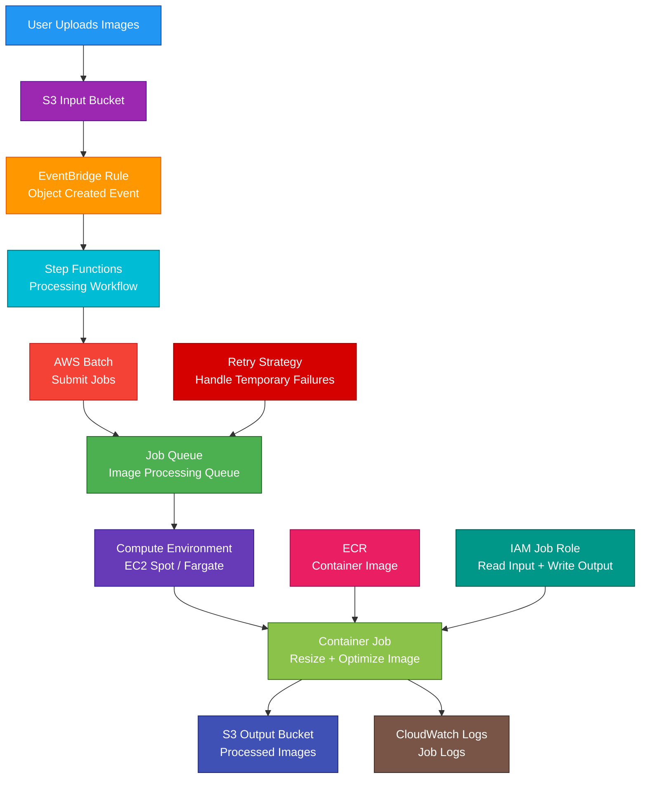

# AWS Batch

## 1. Definition

### Simple Definition

AWS Batch is a managed service for running batch computing jobs on AWS.

It automatically provisions compute resources, schedules jobs, runs containers, and scales capacity based on job demand.

### Memory Hook

AWS Batch = Managed batch job scheduler.

### Basic Idea

You submit jobs to a job queue.

AWS Batch places the jobs onto compute resources and runs them as containers.

### Key Point

AWS Batch is for batch workloads that do not need to run continuously.

It is commonly used for jobs that start, process data, finish, and stop.

## 2. What Problem Does It Solve?

### Main Problem

AWS Batch solves the problem of running large numbers of batch jobs without manually managing servers, queues, schedulers, or cluster capacity.

### Without AWS Batch

You may need to manage:

- Job schedulers
- EC2 fleets
- Container orchestration
- Queue priorities
- Retry logic
- Scaling rules
- Failed job handling
- Spot capacity handling
- Cluster utilization
- Job dependencies
- Worker scripts

### With AWS Batch

AWS Batch handles job scheduling and compute provisioning.

You focus on:

- Container image
- Job definition
- Input data
- Output location
- CPU and memory requirements
- Retry rules
- Job dependencies
- Application logic

### Key Benefit

AWS Batch makes it easier to run scalable, cost-effective batch processing workloads.

## 3. Core Use Cases

### Data Processing Jobs

Use AWS Batch to process large datasets.

Examples:

- Convert files
- Clean data
- Transform logs
- Generate reports
- Process images or videos

### Scientific Computing

Use AWS Batch for scientific or engineering workloads.

Examples:

- Genomics
- Financial risk modeling
- Weather simulations
- Molecular modeling
- Research workloads

### Machine Learning Batch Jobs

Use AWS Batch for ML-related jobs that do not require SageMaker-managed training.

Examples:

- Batch inference
- Feature generation
- Model evaluation
- Data preprocessing
- Hyperparameter experiment workers

### Media Processing

Use AWS Batch to run video, audio, or image processing jobs.

Examples:

- Thumbnail generation
- Video transcoding
- Image resizing
- Metadata extraction

### Scheduled Batch Workloads

Use AWS Batch with EventBridge for scheduled jobs.

Example:

Run a nightly job to process all uploaded files from the day.

### High-Volume Parallel Jobs

Use array jobs to run many similar jobs in parallel.

Example:

Process 10,000 files where each file can be processed independently.

### Multi-Node Parallel Jobs

Use multi-node parallel jobs for tightly coupled workloads that need multiple EC2 instances working together.

Examples:

- High performance computing
- MPI-style workloads
- Distributed simulations

## 4. Important Features for SAA

### Job

A job is a unit of work submitted to AWS Batch.

Examples:

- Run a script
- Process a file
- Run a container command
- Perform one data transformation task

### Job Definition

A job definition is a blueprint for how a job runs.

It can define:

- Container image
- vCPU
- Memory
- Command
- Environment variables
- IAM job role
- Retry strategy
- Timeout
- Mount points
- Logging configuration

### Job Queue

A job queue is where jobs wait before they run.

Jobs are submitted to a queue and stay there until AWS Batch schedules them onto compute resources.

### Compute Environment

A compute environment is the compute capacity AWS Batch uses to run jobs.

Compute environments can use:

- Amazon EC2
- EC2 Spot Instances
- AWS Fargate
- Fargate Spot
- Amazon EKS

### Managed Compute Environment

In a managed compute environment, AWS Batch manages capacity for you.

It can create and scale resources such as:

- EC2 instances
- Auto Scaling Groups
- ECS clusters
- Spot capacity

### Unmanaged Compute Environment

In an unmanaged compute environment, you manage the compute resources yourself.

Use this only when you need more control.

For SAA, managed compute environments are the more common answer.

### EC2 Compute Environment

Use EC2 compute environments when jobs need:

- More control over instance types
- GPUs
- Large memory
- Custom AMIs
- Multi-node parallel jobs
- Long-running batch workloads
- Specialized compute

### Spot Compute Environment

Use EC2 Spot Instances to reduce cost for fault-tolerant jobs.

Good for:

- Retryable jobs
- Flexible workloads
- Non-urgent batch processing
- Large parallel jobs

### Fargate Compute Environment

Use Fargate when you want serverless containers for batch jobs.

Best for:

- Simpler container jobs
- No EC2 management
- Shorter jobs
- Workloads that do not need custom EC2 instances

### Fargate Spot

Use Fargate Spot for lower-cost serverless batch jobs that can tolerate interruption.

### EKS Compute Environment

Use AWS Batch with Amazon EKS when you want AWS Batch scheduling for Kubernetes-based batch jobs.

Best for teams already using Kubernetes.

### Scheduler

The AWS Batch scheduler decides when and where jobs should run.

It considers:

- Queue priority
- Compute environment order
- Available resources
- Job requirements
- Dependencies
- Scheduling policies

### Queue Priority

Job queues can have priority.

Higher-priority queues are evaluated before lower-priority queues when they share compute environments.

### Scheduling Policy

Scheduling policies control how compute resources are shared.

Fair share scheduling can help prevent one user or workload from consuming all resources.

### Job States

Common job states:

| State | Meaning |
|---|---|
| `SUBMITTED` | Job was submitted |
| `PENDING` | Job waits for dependencies |
| `RUNNABLE` | Job is ready to run |
| `STARTING` | Job is starting |
| `RUNNING` | Job is running |
| `SUCCEEDED` | Job completed successfully |
| `FAILED` | Job failed |

### Retry Strategy

A retry strategy tells AWS Batch how many times to retry a failed job.

Use retries for temporary failures.

Examples:

- Network error
- Temporary S3 issue
- Spot interruption
- Dependency service timeout

### Timeout

A timeout stops a job if it runs too long.

Use timeouts to prevent stuck jobs from wasting compute.

### Job Dependencies

Job dependencies control job order.

Example:

Job B should run only after Job A succeeds.

### Array Jobs

Array jobs run many copies of the same job.

Each child job gets an index.

Use array jobs when the same task must run many times on different input data.

Example:

Process 1,000 files in parallel.

### Multi-Node Parallel Jobs

Multi-node parallel jobs run one job across multiple EC2 instances.

Use them for workloads where nodes must communicate with each other.

Important point:

Multi-node parallel jobs are supported with EC2-based compute, not Fargate.

### Container Image

AWS Batch jobs commonly run from container images.

Common image source:

- Amazon ECR
- Docker Hub
- Private container registries

### Amazon ECR Integration

Amazon ECR is commonly used to store job container images.

Pattern:

Build container image → Push to ECR → AWS Batch runs image

### vCPU and Memory

Each job requests vCPU and memory.

AWS Batch uses these requirements to place the job on suitable compute resources.

### GPU Jobs

AWS Batch can run GPU workloads on EC2 GPU instances.

Use this for:

- ML processing
- Rendering
- Scientific workloads
- GPU-accelerated batch jobs

### Job Role

A job role gives the running job permissions to access AWS services.

Example:

A job needs permission to read input data from S3 and write output back to S3.

### Execution Role

For Fargate-style container execution, an execution role can allow AWS services to pull images and write logs.

### CloudWatch Logs

AWS Batch can send job logs to CloudWatch Logs.

Use logs to troubleshoot failed jobs.

### EventBridge Integration

AWS Batch job state changes can be sent to EventBridge.

Use EventBridge to trigger notifications or workflows when jobs complete or fail.

### Step Functions Integration

Step Functions can orchestrate AWS Batch jobs.

Example:

Start Batch job → Wait for completion → Run next workflow step

### Common Workflow Pattern

S3 upload triggers EventBridge or Lambda.

Lambda or Step Functions submits an AWS Batch job.

Batch processes the file and writes output to S3.

## 5. Security Model

### IAM Permissions

IAM controls who can create, submit, manage, and monitor AWS Batch resources.

Common permissions:

| Permission | Purpose |
|---|---|
| `batch:SubmitJob` | Submit a job |
| `batch:CancelJob` | Cancel a job |
| `batch:TerminateJob` | Stop a running job |
| `batch:DescribeJobs` | View job details |
| `batch:RegisterJobDefinition` | Create job definition |
| `batch:CreateJobQueue` | Create job queue |
| `batch:CreateComputeEnvironment` | Create compute environment |

### Service Role

AWS Batch uses service roles to manage AWS resources on your behalf.

Examples:

- Create ECS resources
- Scale compute environments
- Manage EC2 instances
- Use Spot capacity

### Job Role

The job role is assumed by the containerized job.

Use it to give the job access to AWS services.

Example permissions:

- Read from S3
- Write to S3
- Read secrets
- Write to DynamoDB
- Publish to SNS
- Send messages to SQS

### Least Privilege

Give each job only the permissions it needs.

Bad example:

Every job gets administrator access.

Good example:

A data processing job can read only one S3 input prefix and write only one S3 output prefix.

### Container Image Security

Secure container images before running them.

Best practices:

- Store images in ECR
- Scan images for vulnerabilities
- Use minimal base images
- Avoid hardcoded secrets
- Patch dependencies
- Use trusted images

### Secrets Management

Do not hardcode secrets in job definitions or environment variables.

Use:

- AWS Secrets Manager
- Systems Manager Parameter Store
- IAM roles
- KMS encryption

### Encryption at Rest

Data used by AWS Batch should be encrypted in the storage services.

Examples:

- S3 encryption
- EBS encryption
- EFS encryption
- FSx encryption
- CloudWatch Logs encryption
- KMS customer managed keys where needed

### Encryption in Transit

Use encrypted connections for data movement.

Examples:

- HTTPS to S3 APIs
- TLS database connections
- Private VPC endpoints where appropriate

### VPC Networking

AWS Batch jobs can run in your VPC.

Use VPC networking to control access to:

- Databases
- Internal services
- VPC endpoints
- Private subnets
- Security groups

### Security Groups

Security groups control network traffic for jobs running on EC2 or Fargate resources.

Best practice:

Allow only required inbound and outbound traffic.

### Private Subnets

Production jobs often run in private subnets.

Use NAT Gateway or VPC endpoints if jobs need AWS service access.

### VPC Endpoints

Use VPC endpoints to privately access AWS services.

Common endpoints:

- S3 gateway endpoint
- ECR API endpoint
- ECR Docker endpoint
- CloudWatch Logs endpoint
- Secrets Manager endpoint
- Systems Manager endpoint

### CloudTrail Auditing

CloudTrail records AWS Batch API activity.

Use CloudTrail to audit:

- Job submission
- Job termination
- Job definition changes
- Queue changes
- Compute environment changes

### Shared Responsibility

AWS is responsible for:

- AWS Batch managed scheduling service
- Service infrastructure
- Managed scaling orchestration
- AWS control plane availability
- Physical security

You are responsible for:

- IAM roles and permissions
- Container image security
- Job code security
- VPC and security groups
- Data encryption
- Secrets handling
- Job definitions
- Logging and monitoring
- Input and output data protection

## 6. High Availability / Durability Behavior

### Availability

AWS Batch is a managed regional service.

AWS manages the job scheduling service infrastructure.

### Regional Service

AWS Batch resources are regional.

Common regional resources:

- Job queues
- Job definitions
- Compute environments
- Jobs

### Multi-AZ Compute

AWS Batch can use compute resources across multiple Availability Zones if your compute environment uses subnets in multiple AZs.

This improves capacity availability and fault tolerance.

### Managed Scaling

AWS Batch can scale compute environments based on queued jobs.

When there are no jobs, managed compute environments can scale down to reduce unused capacity.

### Job Retry

Retries improve fault tolerance for temporary failures.

Example:

If a job fails because of a temporary service issue, AWS Batch can retry it.

### Spot Interruption Handling

Spot Instances can be interrupted.

Use retry strategies and checkpointing for Spot-based jobs.

Good Spot jobs should be:

- Fault tolerant
- Restartable
- Idempotent
- Able to save progress externally

### Checkpointing

Checkpointing means saving progress during a job.

If the job is interrupted, it can resume from the last saved checkpoint instead of starting over.

### Durable Output Storage

AWS Batch itself is not durable storage.

Store important inputs and outputs in durable services such as:

- S3
- EFS
- FSx
- RDS
- DynamoDB

### Stateless Jobs

Batch jobs should usually be stateless.

Any important state should be stored outside the compute container.

### Job Queue Resilience

Jobs remain in the queue until they are scheduled, cancelled, terminated, or expire based on configuration.

### Dependency Handling

Job dependencies help ensure tasks run in the correct order.

Example:

Data validation must complete before transformation starts.

### Multi-Region Behavior

AWS Batch does not automatically run jobs across Regions.

For Multi-Region batch processing, deploy separate AWS Batch resources in each Region and coordinate routing or workflows separately.

### Important Exam Point

AWS Batch improves job execution reliability with queues, retries, dependencies, and managed compute, but your job data must be stored durably outside the job container.

## 7. Cost Optimization Options

### Use Spot Instances

Spot Instances are one of the biggest AWS Batch cost optimization options.

Use Spot for jobs that can tolerate interruption.

Good examples:

- Data processing
- Rendering
- Simulations
- Batch inference
- Non-urgent workloads

### Use Fargate for Simpler Jobs

Use Fargate when you want serverless containers and do not want to manage EC2 capacity.

Good for:

- Short jobs
- Variable workloads
- Simpler container jobs
- Lower operational overhead

### Use EC2 for Specialized or Steady Workloads

Use EC2 compute environments when you need:

- GPUs
- Large memory
- Custom AMIs
- Multi-node parallel jobs
- Specific instance families
- Better control over cost/performance

### Use Fargate Spot

Use Fargate Spot for lower-cost serverless batch jobs that can handle interruption.

### Right-Size Job Resources

Set vCPU and memory based on actual job needs.

Over-requesting resources can waste money.

Under-requesting resources can cause failures or slow jobs.

### Use Managed Scaling

Managed compute environments can scale based on demand.

This avoids running idle compute all the time.

### Use Allocation Strategies

EC2 compute environments can use allocation strategies to optimize for capacity and cost.

For Spot workloads, use strategies that improve the chance of getting available low-cost capacity.

### Use Graviton Where Supported

AWS Graviton instances can provide good price-performance for compatible workloads.

Use ARM-compatible container images when using Graviton.

### Use Savings Plans for Steady Baseline

For predictable EC2 or Fargate usage, Compute Savings Plans can reduce cost.

Use Spot for flexible burst capacity and Savings Plans for steady baseline usage.

### Avoid Running Idle Resources

If no jobs are running, avoid keeping large compute environments active unnecessarily.

### Use Efficient Container Images

Smaller images can reduce startup time and image pull overhead.

Best practices:

- Use smaller base images
- Remove unused packages
- Use multi-stage builds
- Store images in ECR near the compute Region

### Store Intermediate Data Efficiently

Use S3 lifecycle policies for intermediate and output data.

Move older data to cheaper storage classes when appropriate.

### Monitor Job Failures

Failed jobs can waste compute.

Use CloudWatch Logs and metrics to find:

- Bad input files
- Incorrect permissions
- Memory limits too low
- Timeout issues
- Application bugs

## 8. Common Exam Traps

### AWS Batch vs Lambda

This is a common exam trap.

| Requirement | Choose |
|---|---|
| Short event-driven function | Lambda |
| Long-running or large batch jobs | AWS Batch |

### AWS Batch vs Step Functions

AWS Batch runs batch jobs.

Step Functions orchestrates workflow steps.

They are often used together.

| Requirement | Choose |
|---|---|
| Run compute-heavy batch container jobs | AWS Batch |
| Coordinate multiple steps with branching and retries | Step Functions |

### AWS Batch vs ECS

AWS Batch schedules and manages batch jobs.

ECS runs container services and tasks.

AWS Batch can use ECS behind the scenes.

### AWS Batch vs Fargate

Fargate is serverless container compute.

AWS Batch is the batch scheduler.

AWS Batch can run jobs on Fargate.

### AWS Batch vs Glue

Glue is for ETL and data integration.

AWS Batch is general-purpose batch compute.

| Requirement | Choose |
|---|---|
| Serverless ETL and Data Catalog | AWS Glue |
| Custom containerized batch jobs | AWS Batch |

### AWS Batch vs EMR

EMR is for big data frameworks like Spark, Hadoop, and Hive.

AWS Batch is for general batch jobs and containerized workloads.

### AWS Batch vs SQS Workers

SQS with workers is a custom queue processing architecture.

AWS Batch provides managed job queues, scheduling, dependencies, retries, and compute environments.

### Batch Jobs Are Containerized

AWS Batch jobs run as containers.

If your workload is not containerized, you usually package it into a container image first.

### Fargate Has Limitations

Use EC2 compute environments if jobs need:

- GPUs
- Multi-node parallel jobs
- Custom AMIs
- More control over host environment

### Spot Jobs Must Tolerate Interruption

Do not use Spot for jobs that cannot restart or recover from interruption.

### Job Queue Is Not the Compute

The job queue holds jobs.

The compute environment provides the compute resources.

### Job Definition Is Not a Running Job

The job definition is the blueprint.

The job is the actual submitted unit of work.

### AWS Batch Does Not Store Output Automatically

Your job must write output to S3, EFS, a database, or another storage service.

## 9. Compare With Similar Services

### Service Comparison Table

| Service | Main Purpose | Best For | Choose When |
|---|---|---|---|
| AWS Batch | Managed batch job scheduling | Large-scale batch processing | You need queues, scheduling, retries, and scalable batch compute |
| AWS Lambda | Serverless functions | Short event-driven tasks | You need quick function execution |
| AWS Step Functions | Workflow orchestration | Multi-step workflows | You need state, branching, retries, and coordination |
| Amazon ECS | Container orchestration | Long-running services and tasks | You need to run containerized apps |
| AWS Fargate | Serverless container compute | Containers without EC2 management | You want serverless compute for ECS/EKS/Batch |
| AWS Glue | Serverless ETL | Data transformation and cataloging | You need managed ETL jobs |
| Amazon EMR | Big data processing | Spark/Hadoop workloads | You need big data frameworks |

### AWS Batch vs Lambda

| Feature | AWS Batch | Lambda |
|---|---|---|
| Main purpose | Batch jobs | Event-driven functions |
| Runtime duration | Better for long jobs | Limited function runtime |
| Compute control | More CPU/memory/job control | Less infrastructure control |
| Container support | Core job model | Supported but function-focused |
| Best for | Heavy batch processing | Small event tasks |

### AWS Batch vs Step Functions

| Feature | AWS Batch | Step Functions |
|---|---|---|
| Main purpose | Run jobs | Orchestrate workflows |
| Runs compute | Yes | No, coordinates services |
| Workflow state | Limited job states | Full state machine |
| Branching logic | Not main purpose | Built-in |
| Common use together | Step Functions starts Batch jobs | Batch runs the heavy work |

### AWS Batch vs ECS

| Feature | AWS Batch | ECS |
|---|---|---|
| Main purpose | Batch scheduling | Container orchestration |
| Best for | Jobs that start and finish | Services or tasks |
| Queue | Built-in job queue | No native job queue |
| Scheduler | Batch job scheduler | ECS service/task scheduler |
| Common relationship | Can use ECS compute | Runs containers |

### AWS Batch vs Glue

| Feature | AWS Batch | AWS Glue |
|---|---|---|
| Main purpose | General batch compute | ETL and data integration |
| Workload | Custom container jobs | Spark/ETL jobs and crawlers |
| Data Catalog | No | Yes |
| Best for | Custom processing | Managed data transformation |

### AWS Batch vs EMR

| Feature | AWS Batch | EMR |
|---|---|---|
| Main purpose | Batch job scheduling | Big data frameworks |
| Common workloads | Containers, scripts, parallel jobs | Spark, Hadoop, Hive |
| Cluster model | Batch-managed compute environments | EMR clusters or serverless |
| Best for | General batch jobs | Big data ecosystem workloads |

### When to Choose AWS Batch

Choose AWS Batch when:

- You need to run batch jobs at scale
- Jobs can be containerized
- Jobs start, process, and finish
- You need job queues and scheduling
- You need retries and dependencies
- You need array jobs
- You need Spot-based cost savings
- You need EC2, Fargate, or EKS compute for batch jobs
- You need to process many files or tasks in parallel
- You do not want to build your own batch scheduler

## 10. Mini Architecture Example

### Scenario

A company receives thousands of image files in S3 every day.

Each image must be resized, optimized, and stored in an output S3 bucket.

The workload is not continuous, and the company wants to reduce cost by scaling compute only when jobs exist.

### Architecture

S3 upload events trigger EventBridge.

EventBridge starts a Step Functions workflow.

Step Functions submits AWS Batch jobs.

AWS Batch runs containerized image processing jobs using Spot or Fargate compute.

Processed images are written back to S3.

### Why This Is Good

- S3 stores input and output files durably
- EventBridge starts the workflow when files arrive
- Step Functions coordinates the process
- AWS Batch schedules and runs image processing jobs
- ECR stores the container image
- Spot Instances reduce cost for retryable jobs
- Fargate can be used when serverless containers are preferred
- Job role gives least-privilege S3 access
- Retry strategy handles temporary failures
- CloudWatch Logs helps troubleshoot job failures
- Compute scales based on job demand instead of running all the time

### Exam Answer Pattern

If the question says:

“Run large-scale batch jobs using containers with queues, retries, and managed compute scaling.”

Think:

AWS Batch.

If the question says:

“Coordinate multiple workflow steps before and after the batch job.”

Think:

Step Functions with AWS Batch.

If the question says:

“Run a short event-driven function.”

Think:

AWS Lambda.

If the question says:

“Run serverless ETL with crawlers and Data Catalog.”

Think:

AWS Glue.

### Final Memory Hook

AWS Batch = Managed batch job scheduler.

Job = Unit of work.

Job definition = Blueprint.

Job queue = Waiting area.

Compute environment = Where jobs run.

Managed compute environment = AWS manages capacity.

EC2 = More control and special hardware.

Spot = Lower cost, interruption possible.

Fargate = Serverless containers.

Fargate Spot = Lower-cost serverless batch.

EKS = Kubernetes-based batch jobs.

Array job = Many similar parallel jobs.

Multi-node job = One job across multiple EC2 instances.

Retry strategy = Try failed jobs again.

Timeout = Stop stuck jobs.

Dependency = Run jobs in order.

ECR = Container images.

CloudWatch Logs = Job logs.

EventBridge = Trigger jobs or react to job changes.

Step Functions = Orchestrate Batch workflows.

S3 = Durable input and output storage.

