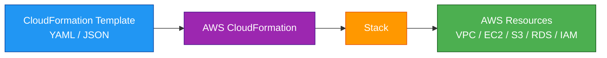
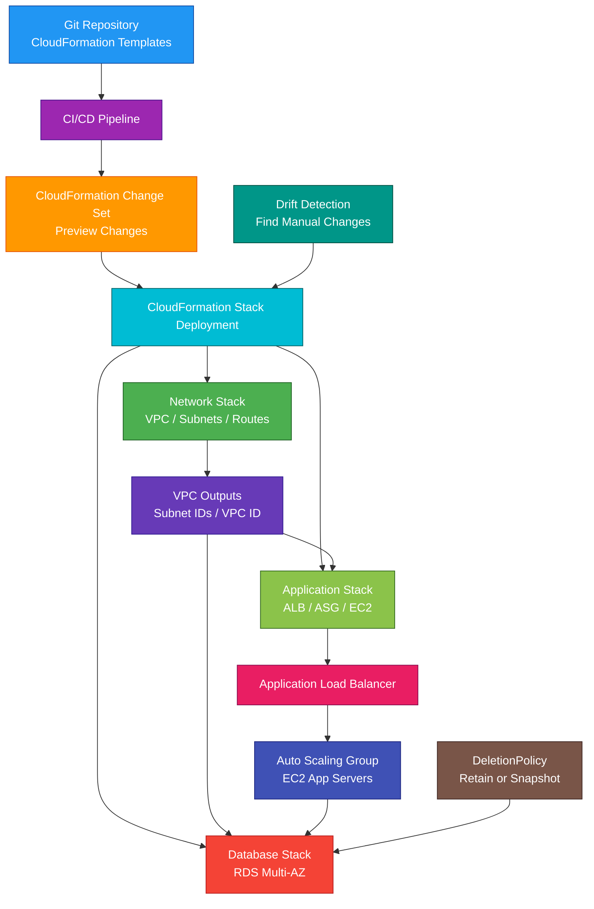

# AWS CloudFormation

<details>
<summary>

## 1. Definition

</summary>

### Simple Definition

AWS CloudFormation is an Infrastructure as Code service.

It lets you define AWS resources in a template file and then automatically create, update, or delete those resources as a group.

### Memory Hook

CloudFormation = AWS infrastructure written as code.

### Basic Idea

Instead of manually creating resources in the AWS Console, you write a template.

CloudFormation reads the template and creates the resources for you.



### Key Point

CloudFormation helps you create repeatable, consistent, version-controlled infrastructure.

</details>

<details>
<summary>

## 2. What Problem Does It Solve?

</summary>

### Main Problem

CloudFormation solves the problem of manually creating and managing AWS infrastructure.

Manual setup is slow, error-prone, and hard to repeat consistently.

### Without CloudFormation

You may have problems such as:

- Manual resource creation
- Inconsistent environments
- Hard-to-repeat deployments
- No version control for infrastructure
- Difficult rollback
- Hard-to-track changes
- Configuration drift
- More human error

### With CloudFormation

You define infrastructure in templates and deploy it consistently.

### Key Benefit

CloudFormation makes infrastructure predictable, repeatable, auditable, and easier to manage.

</details>

<details>
<summary>

## 3. Core Use Cases

</summary>

### Create Repeatable Environments

Use CloudFormation to create the same environment multiple times.

Examples:

- Development
- Testing
- Staging
- Production

### Deploy Full Applications

Use CloudFormation to deploy all infrastructure for an application.

Examples:

- VPC
- Subnets
- Security groups
- Load balancer
- Auto Scaling Group
- EC2 instances
- RDS database
- S3 buckets
- IAM roles

### Infrastructure Version Control

Store CloudFormation templates in Git.

This allows teams to review, track, and roll back infrastructure changes.

### Multi-Account Deployment

Use StackSets to deploy stacks across multiple AWS accounts.

Example:

Deploy a standard IAM role or CloudTrail setup to every account in AWS Organizations.

### Multi-Region Deployment

Use StackSets to deploy resources across multiple Regions.

Example:

Deploy security baseline resources in all active Regions.

### Safe Infrastructure Updates

Use change sets to preview what CloudFormation will change before applying updates.

### Detect Manual Changes

Use drift detection to identify resources that were changed outside CloudFormation.

### Standardize Infrastructure

Use templates, nested stacks, modules, and StackSets to create repeatable patterns for teams.

</details>

<details>
<summary>

## 4. Important Features for SAA

</summary>

### Template

A template is a JSON or YAML file that defines AWS resources.

For humans, YAML is usually easier to read.

Example structure:

```yaml
AWSTemplateFormatVersion: '2010-09-09'
Description: Simple S3 bucket example

Resources:
  MyBucket:
    Type: AWS::S3::Bucket
```

### Stack

A stack is a collection of AWS resources created from a CloudFormation template.

Important point:

CloudFormation manages resources as one unit called a stack.

### Stack Lifecycle

A stack can be:

- Created
- Updated
- Deleted
- Rolled back
- Drift checked

### Resources Section

The `Resources` section is the only required section in most templates.

It defines the AWS resources to create.

Example:

```yaml
Resources:
  MyInstance:
    Type: AWS::EC2::Instance
    Properties:
      InstanceType: t3.micro
      ImageId: ami-1234567890abcdef0
```

### Parameters

Parameters let you pass values into a template.

Use parameters to make templates reusable.

Example:

```yaml
Parameters:
  InstanceType:
    Type: String
    Default: t3.micro
```

### Mappings

Mappings define fixed lookup values.

Example:

Choose different AMI IDs based on Region.

```yaml
Mappings:
  RegionMap:
    us-east-1:
      AMI: ami-aaa
    us-west-2:
      AMI: ami-bbb
```

### Conditions

Conditions control whether resources are created based on logic.

Example:

Create a larger instance only in production.

```yaml
Conditions:
  IsProd: !Equals [!Ref Environment, prod]
```

### Outputs

Outputs return useful values from a stack.

Examples:

- Load balancer DNS name
- VPC ID
- S3 bucket name
- API endpoint

```yaml
Outputs:
  BucketName:
    Value: !Ref MyBucket
```

### Intrinsic Functions

Intrinsic functions help templates reference and calculate values.

Common intrinsic functions:

| Function | Purpose |
|---|---|
| `Ref` | Reference a parameter or resource |
| `Fn::GetAtt` | Get resource attribute |
| `Fn::Join` | Join strings |
| `Fn::Sub` | Substitute variables in strings |
| `Fn::If` | Conditional value |
| `Fn::FindInMap` | Lookup value in mapping |
| `Fn::ImportValue` | Import output from another stack |
| `Fn::Base64` | Encode user data |

### Ref

`Ref` returns a value from a resource or parameter.

Example:

```yaml
BucketName: !Ref MyBucket
```

### GetAtt

`Fn::GetAtt` gets an attribute from a resource.

Example:

Get an ALB DNS name.

```yaml
Value: !GetAtt MyLoadBalancer.DNSName
```

### Sub

`Fn::Sub` substitutes variables into a string.

Example:

```yaml
BucketName: !Sub "${AWS::StackName}-logs"
```

### Pseudo Parameters

Pseudo parameters are built-in values provided by AWS.

Common examples:

| Pseudo Parameter | Meaning |
|---|---|
| `AWS::AccountId` | Current AWS account ID |
| `AWS::Region` | Current AWS Region |
| `AWS::StackName` | Current stack name |
| `AWS::Partition` | AWS partition, such as `aws` |
| `AWS::NoValue` | Removes a property conditionally |

### Dependencies

CloudFormation usually figures out resource order automatically.

Example:

If an EC2 instance references a security group, CloudFormation creates the security group first.

### DependsOn

Use `DependsOn` when you need to explicitly control resource creation order.

Example:

Create an internet gateway attachment before creating a route.

```yaml
DependsOn: AttachGateway
```

### Change Set

A change set previews stack changes before execution.

It can show whether resources will be:

- Added
- Modified
- Deleted
- Replaced

Important exam point:

Use change sets when you want to preview infrastructure impact before updating.

### Stack Update

Updating a stack changes existing resources based on a modified template or parameters.

Some updates happen in place.

Some updates require resource replacement.

### Resource Replacement

Replacement means CloudFormation creates a new resource and deletes the old one.

This can cause downtime or data loss if not planned.

Examples that may require replacement:

- Changing certain subnet properties
- Changing some database settings
- Changing immutable resource names

### Rollback

If stack creation or update fails, CloudFormation can roll back to the previous stable state.

This helps avoid partially deployed broken infrastructure.

### Rollback Protection

For important resources, use deletion policies and careful update planning.

Rollback can still affect resources depending on the template and failure scenario.

### DeletionPolicy

`DeletionPolicy` controls what happens to a resource when the stack is deleted.

Common options:

| DeletionPolicy | Meaning |
|---|---|
| `Delete` | Delete the resource |
| `Retain` | Keep the resource |
| `Snapshot` | Create snapshot before deletion, if supported |

### Retain

Use `Retain` for resources you do not want deleted with the stack.

Examples:

- Important S3 bucket
- Production database
- Critical EBS volume

### Snapshot

Use `Snapshot` for supported stateful resources.

Examples:

- RDS DB instance
- EBS volume
- Redshift cluster

### UpdateReplacePolicy

`UpdateReplacePolicy` controls what happens to the old resource when an update requires replacement.

Use it to avoid accidental data loss during replacements.

### Stack Policy

A stack policy protects stack resources from accidental updates.

Example:

Prevent accidental replacement of a production database.

### Drift Detection

Drift detection checks whether actual resources differ from the CloudFormation template.

Drift usually happens when someone manually changes a resource outside CloudFormation.

### StackSets

StackSets deploy CloudFormation stacks across multiple accounts and Regions.

Use StackSets for organization-wide deployments.

Examples:

- Security baseline
- IAM roles
- CloudTrail setup
- AWS Config rules
- GuardDuty enablement support resources

### Stack Instance

A stack instance is a stack deployed by a StackSet into a specific account and Region.

### Nested Stacks

Nested stacks allow one CloudFormation stack to create other stacks.

Use nested stacks to break large templates into smaller reusable pieces.

### Cross-Stack References

Cross-stack references let one stack use outputs from another stack.

Example:

A network stack exports a VPC ID.

An application stack imports the VPC ID.

### Exports and Imports

Use `Export` and `Fn::ImportValue` for cross-stack references.

Example:

```yaml
Outputs:
  VpcId:
    Value: !Ref MyVpc
    Export:
      Name: SharedVpcId
```

### Custom Resources

Custom resources let CloudFormation call custom logic during stack operations.

Common implementation:

CloudFormation → Lambda function → custom action

Use custom resources when CloudFormation does not directly support a needed action.

### Macros

Macros transform templates before CloudFormation deploys them.

They are useful for advanced template processing.

### Transform

The `Transform` section applies macros or AWS-provided transforms.

Common example:

```yaml
Transform: AWS::Serverless-2016-10-31
```

This is used by AWS SAM templates.

### CloudFormation Registry

The registry lets you manage resource types and modules.

It can include:

- AWS resource types
- Third-party resource types
- Custom resource types
- Modules

### Modules

Modules package reusable CloudFormation resource patterns.

Use them to standardize common infrastructure blocks.

### CloudFormation Hooks

CloudFormation Hooks can inspect resources before provisioning.

Use them to enforce security, operational, or cost rules before stacks create or update resources.

Example:

Block creation of an S3 bucket that does not have encryption enabled.

### CloudFormation Guard

CloudFormation Guard is a policy-as-code tool used to validate templates against rules.

Use it to check templates before deployment.

### CloudFormation Designer

CloudFormation Designer is a visual tool for viewing and editing templates.

For SAA, focus more on templates, stacks, change sets, drift detection, and StackSets.

### CloudFormation vs CDK

AWS CDK lets you define infrastructure using programming languages.

CDK generates CloudFormation templates behind the scenes.

Important point:

CDK is a higher-level framework, but CloudFormation is still the deployment engine.

### CloudFormation vs SAM

AWS SAM is focused on serverless applications.

SAM templates transform into CloudFormation templates.

Important point:

SAM builds on CloudFormation.

</details>

<details>
<summary>

## 5. Security Model

</summary>

### IAM Permissions

IAM controls who can create, update, delete, and manage CloudFormation stacks.

Common permissions:

| Permission | Purpose |
|---|---|
| `cloudformation:CreateStack` | Create stack |
| `cloudformation:UpdateStack` | Update stack |
| `cloudformation:DeleteStack` | Delete stack |
| `cloudformation:CreateChangeSet` | Create change set |
| `cloudformation:ExecuteChangeSet` | Execute change set |
| `cloudformation:DetectStackDrift` | Detect stack drift |
| `cloudformation:CreateStackSet` | Create StackSet |
| `cloudformation:UpdateStackSet` | Update StackSet |

### Resource Permissions

CloudFormation needs permissions to create the resources in the template.

Example:

If a template creates an S3 bucket and IAM role, CloudFormation needs permissions for S3 and IAM actions.

### Service Role

A CloudFormation service role is an IAM role that CloudFormation assumes to create, update, or delete stack resources.

Use a service role to control what CloudFormation can do.

### User Permissions vs Service Role

There are two permission layers.

| Permission Layer | Purpose |
|---|---|
| User permissions | Controls who can call CloudFormation |
| Service role permissions | Controls what CloudFormation can create or change |

### Least Privilege

Use least privilege for both users and service roles.

Bad pattern:

Give everyone administrator access to deploy stacks.

Better pattern:

Allow users to deploy approved templates using a limited CloudFormation service role.

### IAM Resource Creation

If a template creates or modifies IAM resources, CloudFormation requires capabilities acknowledgement.

Common capabilities:

| Capability | Meaning |
|---|---|
| `CAPABILITY_IAM` | Template may create or modify IAM resources |
| `CAPABILITY_NAMED_IAM` | Template may create named IAM resources |
| `CAPABILITY_AUTO_EXPAND` | Template uses macros or transforms that may expand template content |

### CAPABILITY_NAMED_IAM

Use `CAPABILITY_NAMED_IAM` when a template creates IAM resources with custom names.

This is important because named IAM resources can affect security across the account.

### NoEcho

`NoEcho` hides parameter values in some CloudFormation outputs and events.

Important warning:

`NoEcho` does not automatically protect secrets everywhere.

Do not rely on `NoEcho` as your only secret protection.

### Dynamic References

Dynamic references let templates securely reference values from services such as:

- AWS Secrets Manager
- Systems Manager Parameter Store

Example pattern:

```yaml
Password: '{{resolve:secretsmanager:MySecret:SecretString:password}}'
```

### Secrets Management

Do not hardcode passwords, API keys, or private keys in templates.

Use:

- AWS Secrets Manager
- Systems Manager Parameter Store
- KMS encryption
- Dynamic references
- IAM roles

### Template Security

Treat templates as sensitive code.

Templates can contain:

- Resource names
- Network settings
- IAM policies
- Security group rules
- Application configuration

Store templates securely in source control.

### Security Groups in Templates

Be careful with security group rules.

Bad example:

Allow SSH from `0.0.0.0/0`.

Better example:

Restrict access to a trusted CIDR or use Systems Manager Session Manager.

### Stack Policies

Use stack policies to protect critical resources from accidental updates.

Example:

Protect a production RDS database from replacement.

### StackSets Security

StackSets can deploy across many accounts and Regions.

Use careful permissions because a bad StackSet can affect many accounts.

### Service-Managed StackSets

Service-managed StackSets integrate with AWS Organizations.

They can deploy stacks to accounts in organizational units.

### Self-Managed StackSets

Self-managed StackSets require you to configure IAM roles in target accounts manually.

### CloudTrail Auditing

CloudTrail records CloudFormation API activity.

Use CloudTrail to audit:

- Stack creation
- Stack updates
- Stack deletion
- Change set execution
- StackSet operations
- Template changes

### Shared Responsibility

AWS is responsible for:

- CloudFormation managed service infrastructure
- Stack orchestration engine
- Service availability
- Physical security

You are responsible for:

- Template security
- IAM permissions
- Service role permissions
- Secrets handling
- Stack policies
- Resource configurations
- Change review
- Drift remediation
- Protecting stateful resources

</details>

<details>
<summary>

## 6. High Availability / Durability Behavior

</summary>

### Availability

CloudFormation is a managed AWS service.

AWS manages the CloudFormation control plane.

### Regional Service

CloudFormation stacks are regional.

A stack created in one Region manages resources in that Region, except for global resources such as IAM.

### Multi-Region Deployment

CloudFormation does not automatically deploy one stack to every Region.

Use StackSets or separate stacks for Multi-Region deployment.

### StackSets for Multi-Region

StackSets are the main CloudFormation feature for deploying across multiple accounts and Regions.

Example:

Deploy a standard security configuration to all accounts in `us-east-1` and `us-west-2`.

### Multi-AZ Behavior

CloudFormation itself does not make applications Multi-AZ.

It can create Multi-AZ architectures if your template defines them.

Example:

A template can create:

- Two public subnets in different AZs
- Two private subnets in different AZs
- Multi-AZ RDS database
- Load balancer across AZs
- Auto Scaling Group across AZs

### Durability

CloudFormation is not a data storage service.

The durability of your application data depends on the resources you create.

Examples:

- S3 durability
- RDS backups
- EBS snapshots
- DynamoDB backups
- AWS Backup policies

### Rollback and Reliability

Rollback helps recover from failed stack operations.

If stack creation fails, CloudFormation can delete created resources or roll back to a previous state.

### Stateful Resource Protection

Use `DeletionPolicy` and `UpdateReplacePolicy` to protect stateful resources.

Examples:

- RDS databases
- S3 buckets
- EBS volumes
- DynamoDB tables

### Drift Detection for Reliability

Drift detection helps identify manual changes that may cause future deployment problems.

Example:

Someone manually changes a security group outside CloudFormation.

Drift detection can show that the resource no longer matches the template.

### Change Sets for Safer Updates

Change sets improve reliability by letting you preview updates before applying them.

This reduces accidental replacement or deletion risk.

### Important Exam Point

CloudFormation is an automation and management service.

It can create highly available infrastructure, but only if the template defines a highly available architecture.

</details>

<details>
<summary>

## 7. Cost Optimization Options

</summary>

### CloudFormation Service Cost

CloudFormation itself generally does not add extra cost for managing AWS resources.

You pay for the AWS resources that CloudFormation creates.

Important point:

If a template creates expensive resources, you pay for those resources.

### Delete Unused Stacks

Deleting unused stacks can remove unnecessary resources.

Be careful with stateful resources before deletion.

### Use DeletionPolicy for Important Data

Use `Retain` or `Snapshot` for important stateful resources.

This protects data but can also leave resources that continue to cost money.

Track retained resources carefully.

### Review Change Sets

Use change sets to preview cost-impacting changes.

Examples:

- Larger EC2 instance type
- More NAT Gateways
- More RDS instances
- Higher storage size
- Additional load balancers

### Use Parameters for Right-Sizing

Use parameters to choose different sizes per environment.

Example:

| Environment | Instance Size |
|---|---|
| Dev | `t3.micro` |
| Test | `t3.small` |
| Prod | `m7i.large` |

### Avoid Overbuilding Dev/Test

Use conditions to avoid creating expensive resources in non-production.

Example:

Only create Multi-AZ RDS in production.

### Use Stack Outputs for Reuse

Use shared infrastructure stacks to avoid duplicating resources.

Example:

One network stack exports VPC and subnet IDs.

Multiple application stacks import those values.

### Use StackSets Carefully

StackSets can deploy resources across many accounts and Regions.

A small mistake can multiply cost quickly.

Always test StackSets in a limited target first.

### Automate Cleanup

Use CloudFormation to delete temporary environments.

Examples:

- Feature branch environments
- Training environments
- Test labs
- Short-lived demos

### Watch Custom Resource Costs

Custom resources often use Lambda or other services.

Those supporting services may create cost.

### Store Templates in Version Control

Version control reduces accidental resource changes and helps teams review cost-impacting infrastructure changes before deployment.

</details>

<details>
<summary>

## 8. Common Exam Traps

</summary>

### CloudFormation vs Elastic Beanstalk

CloudFormation provisions infrastructure.

Elastic Beanstalk deploys and manages application environments.

| Requirement | Choose |
|---|---|
| Define and provision infrastructure as code | CloudFormation |
| Deploy application with managed platform environment | Elastic Beanstalk |

### CloudFormation vs Terraform

CloudFormation is AWS-native IaC.

Terraform is a third-party multi-cloud IaC tool.

For SAA, if the question asks for AWS-native infrastructure as code, choose CloudFormation.

### CloudFormation vs CDK

CDK lets you define infrastructure using programming languages.

CDK generates CloudFormation templates.

CloudFormation is the deployment engine.

### CloudFormation vs SAM

SAM is for serverless applications.

SAM templates transform into CloudFormation.

If the question is specifically serverless app deployment, SAM may be the better answer.

### CloudFormation vs Systems Manager

CloudFormation creates and manages infrastructure stacks.

Systems Manager manages and operates instances and resources after creation.

### CloudFormation Is Declarative

You define the desired end state.

CloudFormation figures out the operations needed to reach that state.

### Stack Is a Unit of Management

Resources created together are managed as a stack.

Deleting the stack can delete the resources unless protected.

### Deleting a Stack Can Delete Resources

This is a major exam trap.

If you delete a stack, CloudFormation deletes stack resources by default.

Use `DeletionPolicy: Retain` or `Snapshot` for important stateful resources.

### Change Sets Do Not Apply Automatically

A change set only previews changes.

You must execute the change set to apply the changes.

### Drift Detection Does Not Fix Drift Automatically

Drift detection identifies unmanaged changes.

You must decide how to fix the drift.

### CloudFormation Does Not Manage Manual Changes Well

Manual changes can cause drift and future update problems.

Best practice:

Make infrastructure changes through CloudFormation, not manually.

### Parameters Are Not Secret Managers

Do not store plaintext secrets in template parameters.

Use Secrets Manager or Parameter Store dynamic references.

### NoEcho Is Not Full Secret Protection

`NoEcho` hides values in some places but not all.

Do not treat it as complete secret security.

### StackSets Can Affect Many Accounts

Use StackSets carefully.

Bad templates or permissions can impact many accounts or Regions.

### Resource Replacement Can Cause Downtime

Some updates require replacement.

Use change sets and careful planning for production resources.

</details>

<details>
<summary>

## 9. Compare With Similar Services

</summary>

### Service Comparison Table

| Service | Main Purpose | Best For | Choose When |
|---|---|---|---|
| AWS CloudFormation | AWS-native Infrastructure as Code | Provisioning AWS resources from templates | You need repeatable AWS infrastructure deployment |
| AWS CDK | Code-based IaC framework | Defining infrastructure with programming languages | You want higher-level code that synthesizes CloudFormation |
| AWS SAM | Serverless app framework | Lambda/API Gateway/serverless deployments | You need serverless-specific templates and local testing |
| Terraform | Multi-cloud IaC | Multi-cloud or provider-neutral IaC | You need IaC across AWS and other platforms |
| Elastic Beanstalk | Managed app deployment platform | Simple app deployment with managed infrastructure | You want AWS to manage app environment resources |
| Systems Manager | Operations management | Managing instances and operational tasks | You need patching, automation, run commands, inventory |
| Service Catalog | Governed self-service products | Approved infrastructure products for teams | You need controlled self-service provisioning |

### CloudFormation vs CDK

| Feature | CloudFormation | AWS CDK |
|---|---|---|
| Format | YAML or JSON templates | Programming languages |
| Abstraction | Lower-level IaC | Higher-level constructs |
| Deployment engine | Native | Synthesizes to CloudFormation |
| Best for | Direct template-based IaC | Code-based infrastructure design |

### CloudFormation vs SAM

| Feature | CloudFormation | AWS SAM |
|---|---|---|
| Main purpose | General AWS IaC | Serverless application IaC |
| Scope | Many AWS resources | Lambda, API Gateway, serverless patterns |
| Transform | Not required | Uses SAM transform |
| Best for | General infrastructure | Serverless apps |

### CloudFormation vs Elastic Beanstalk

| Feature | CloudFormation | Elastic Beanstalk |
|---|---|---|
| Main purpose | Infrastructure provisioning | Application platform deployment |
| Control | More infrastructure control | More managed application environment |
| App deployment | Not main focus | Main focus |
| Best for | Define AWS resources | Deploy web apps quickly |

### CloudFormation vs Systems Manager

| Feature | CloudFormation | Systems Manager |
|---|---|---|
| Main purpose | Create/manage infrastructure | Operate/manage resources |
| Example | Create EC2 instance | Patch EC2 instance |
| Lifecycle phase | Provisioning | Operations |
| Common use together | Yes | Yes |

### CloudFormation vs Service Catalog

| Feature | CloudFormation | Service Catalog |
|---|---|---|
| Main purpose | IaC deployment | Governed self-service provisioning |
| User experience | Deploy stack from template | Launch approved product |
| Governance | IAM, stack policies, hooks | Portfolios, products, constraints |
| Common use together | Templates become products | Uses CloudFormation templates |

### When to Choose CloudFormation

Choose CloudFormation when:

- You need AWS-native Infrastructure as Code
- You need repeatable infrastructure deployments
- You need consistent dev/test/prod environments
- You need version-controlled infrastructure
- You need change sets before updates
- You need drift detection
- You need StackSets for multi-account or Multi-Region deployment
- You need rollback on failed stack operations
- You need to automate AWS resource provisioning

</details>

<details>
<summary>

## 10. Mini Architecture Example

</summary>

### Scenario

A company wants to deploy a standard three-tier web application.

The team needs the same architecture in dev, test, and production.

They want infrastructure to be version-controlled and repeatable.

### Architecture

Use CloudFormation templates to define the full application infrastructure.

Create separate stacks for networking, application, and database layers.

Use parameters for environment-specific values.

Use change sets before production updates.

Use deletion policies to protect the database.



### Why This Is Good

- Infrastructure is defined as code
- Templates are stored in Git
- Same architecture can be deployed repeatedly
- Parameters support different environments
- Change sets preview production changes
- Stacks separate network, app, and database layers
- Outputs allow stacks to share values
- Deletion policies protect stateful resources
- Drift detection identifies manual changes
- Rollback helps recover from failed deployments

### Exam Answer Pattern

If the question says:

“Provision AWS infrastructure using templates and version-controlled code.”

Think:

AWS CloudFormation.

If the question says:

“Preview infrastructure changes before applying them.”

Think:

CloudFormation change sets.

If the question says:

“Detect resources changed manually outside the template.”

Think:

CloudFormation drift detection.

If the question says:

“Deploy stacks across multiple AWS accounts and Regions.”

Think:

CloudFormation StackSets.

### Final Memory Hook

CloudFormation = Infrastructure as Code.

Template = YAML or JSON infrastructure definition.

Stack = Resources managed as one unit.

Change set = Preview changes.

Drift detection = Find manual changes.

StackSet = Multi-account and Multi-Region stacks.

Nested stack = Stack inside stack.

Parameter = Input value.

Output = Returned value.

Mapping = Lookup table.

Condition = Create resources conditionally.

Intrinsic function = Built-in template function.

Ref = Reference value.

GetAtt = Get resource attribute.

DeletionPolicy = Protect resource on stack deletion.

UpdateReplacePolicy = Protect old resource during replacement.

Stack policy = Protect resources from updates.

Custom resource = Lambda-backed custom action.

Macro = Template transformation.

Hook = Pre-deployment compliance check.

CDK = Code that creates CloudFormation.

SAM = Serverless framework built on CloudFormation.

</details>