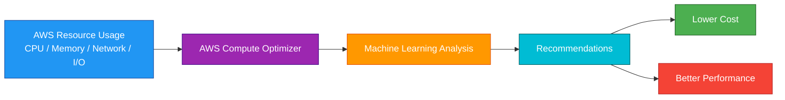
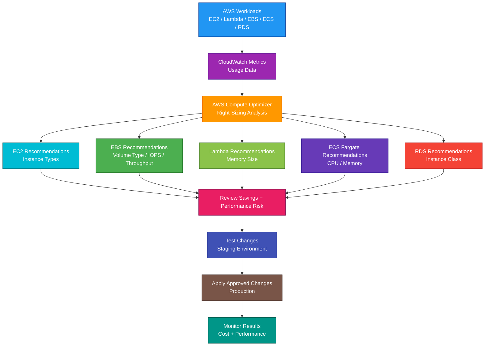

# AWS Compute Optimizer

## 1. Definition

### Simple Definition

AWS Compute Optimizer is a service that gives recommendations to help you right-size AWS compute resources.

It analyzes usage metrics and recommends better resource choices to improve cost and performance.

### Memory Hook

Compute Optimizer = Right-sizing recommendations for compute resources.

### Basic Idea

Compute Optimizer looks at historical usage data.

Then it tells you whether a resource is:

- Overprovisioned
- Underprovisioned
- Optimized
- Not enough data

### Key Point

Compute Optimizer does not automatically change your resources.

It gives recommendations.

You review them and decide whether to apply them.

## 2. What Problem Does It Solve?

### Main Problem

Compute Optimizer solves the problem of choosing the right resource size for your workload.

Many AWS resources are either too large, wasting money, or too small, hurting performance.

### Without Compute Optimizer

You may have problems such as:

- Overprovisioned EC2 instances
- Underprovisioned workloads
- High CPU or memory pressure
- Oversized EBS volumes
- Underperforming EBS volumes
- Lambda functions with inefficient memory settings
- ECS tasks with poor CPU or memory sizing
- RDS instances that are too large or too small
- Higher cost from unused capacity

### With Compute Optimizer

AWS analyzes usage patterns and recommends better resource configurations.

### Key Benefit

Compute Optimizer helps balance cost savings and performance.

## 3. Core Use Cases

### EC2 Right-Sizing

Use Compute Optimizer to find EC2 instances that are too large or too small.

Example:

An `m5.4xlarge` instance may be recommended to change to `m5.2xlarge` if utilization is low.

### Auto Scaling Group Optimization

Use Compute Optimizer to review EC2 Auto Scaling Groups.

It can recommend better instance types for workloads running in Auto Scaling Groups.

### EBS Volume Optimization

Use Compute Optimizer to review EBS volumes.

It can recommend changes to improve cost or performance.

Examples:

- Different volume type
- Different size
- Different IOPS
- Different throughput

### Lambda Optimization

Use Compute Optimizer to review Lambda memory configuration.

Example:

A Lambda function may be using too much memory and could run cheaper with a lower memory setting.

### ECS on Fargate Optimization

Use Compute Optimizer to review ECS services running on Fargate.

It can recommend better CPU and memory settings.

### RDS Optimization

Use Compute Optimizer to review supported RDS resources.

It can help identify database instances that may be overprovisioned or underprovisioned.

### Cost Reduction

Use Compute Optimizer to identify cost-saving opportunities from oversized resources.

### Performance Improvement

Use Compute Optimizer to identify resources that need more capacity to avoid performance problems.

## 4. Important Features for SAA

### Right-Sizing

Right-sizing means matching resource capacity to actual workload needs.

Goal:

Use enough resources for performance, but not so much that money is wasted.

### Supported Resource Types

Compute Optimizer can provide recommendations for several AWS resources.

Common SAA examples:

| Resource Type | Recommendation Example |
|---|---|
| EC2 instances | Change instance type |
| Auto Scaling Groups | Change instance type in group |
| EBS volumes | Change volume type, size, IOPS, or throughput |
| Lambda functions | Change memory size |
| ECS services on Fargate | Change CPU and memory |
| RDS DB instances | Change database instance class |
| Commercial software licenses | Optimize license usage where supported |

### Finding Categories

Compute Optimizer classifies resources based on usage.

| Finding | Meaning |
|---|---|
| Optimized | Resource is correctly sized |
| Overprovisioned | Resource is larger than needed |
| Underprovisioned | Resource may not have enough capacity |
| Not optimized | Resource can be improved |
| Insufficient data | Not enough metrics to make a recommendation |

### Overprovisioned

Overprovisioned means the resource is larger than needed.

This usually means cost can be reduced.

Example:

An EC2 instance uses only 5% CPU most of the time.

### Underprovisioned

Underprovisioned means the resource may be too small.

This can hurt performance.

Example:

An EC2 instance frequently runs at very high CPU and network utilization.

### Optimized

Optimized means the resource appears to be sized correctly based on available data.

### Insufficient Data

Insufficient data means Compute Optimizer does not have enough usage history to make a recommendation.

### Metrics Used

Compute Optimizer uses metrics such as:

- CPU utilization
- Memory utilization, when available
- Network in/out
- Disk read/write operations
- EBS IOPS
- EBS throughput
- Lambda duration
- Lambda memory usage
- ECS CPU and memory utilization
- RDS CPU, memory, storage, and I/O metrics

### CloudWatch Metrics

Compute Optimizer relies heavily on CloudWatch metrics.

If metrics are missing, recommendations may be limited.

### Memory Metrics

Memory metrics are not always collected by default for EC2.

To improve EC2 recommendations, install and configure the CloudWatch agent to collect memory metrics.

### Enhanced Infrastructure Metrics

Enhanced infrastructure metrics can improve recommendation quality by using a longer lookback period.

This helps workloads with monthly or less frequent patterns.

### Recommendation Options

Compute Optimizer can show multiple recommendation options.

Example:

For an EC2 instance, it may recommend several possible instance types with different cost and performance tradeoffs.

### Projected Utilization

Projected utilization estimates how the workload may perform on the recommended resource.

Example:

A recommended smaller EC2 instance may show projected CPU utilization after rightsizing.

### Savings Opportunity

Compute Optimizer can estimate potential savings from applying recommendations.

This helps prioritize cost optimization work.

### Performance Risk

Performance risk estimates whether the recommended resource may not meet workload needs.

Lower risk is safer.

Higher risk may require testing before applying.

### Migration Effort

Some recommendations may show the effort needed to apply the change.

Example:

Changing to a different instance family may require more testing than changing within the same family.

### Export Recommendations

Recommendations can be exported to Amazon S3.

Use this for:

- Reporting
- Analysis
- Governance
- Sharing with teams
- Tracking optimization work

### Organization-Wide Recommendations

Compute Optimizer can be used with AWS Organizations.

A management or delegated administrator account can view recommendations across member accounts.

### Opt-In Requirement

Compute Optimizer must be enabled before it can analyze resources.

For organization-wide use, enable it across accounts where recommendations are needed.

### Recommendation Refresh

Compute Optimizer refreshes recommendations periodically based on recent metrics.

Recommendations can change as workload patterns change.

## 5. Security Model

### IAM Permissions

IAM controls who can view and manage Compute Optimizer recommendations.

Common permissions:

| Permission | Purpose |
|---|---|
| `compute-optimizer:GetEnrollmentStatus` | Check if account is enrolled |
| `compute-optimizer:UpdateEnrollmentStatus` | Enable or disable Compute Optimizer |
| `compute-optimizer:GetEC2InstanceRecommendations` | View EC2 recommendations |
| `compute-optimizer:GetAutoScalingGroupRecommendations` | View ASG recommendations |
| `compute-optimizer:GetEBSVolumeRecommendations` | View EBS recommendations |
| `compute-optimizer:GetLambdaFunctionRecommendations` | View Lambda recommendations |
| `compute-optimizer:GetECSServiceRecommendations` | View ECS service recommendations |
| `compute-optimizer:ExportEC2InstanceRecommendations` | Export recommendations |

### Least Privilege

Give users only the access they need.

Examples:

- Finance team can view cost-saving recommendations
- Cloud engineers can view and export recommendations
- Administrators can enable or disable Compute Optimizer

### Read-Only Access

Many users only need read access to recommendations.

Use read-only permissions where possible.

### Organization Access

For multi-account environments, use AWS Organizations integration carefully.

Only trusted cloud governance teams should view recommendations across many accounts.

### Data Visibility

Compute Optimizer recommendations can reveal information about your environment.

Examples:

- Resource IDs
- Instance types
- Utilization patterns
- Cost-saving opportunities
- Performance risks
- Workload behavior

Protect access to this information.

### Encryption

Compute Optimizer is not an encryption service.

If exporting recommendations to S3, secure the S3 bucket.

Use:

- S3 Block Public Access
- S3 bucket policies
- SSE-S3 or SSE-KMS encryption
- Least privilege IAM access
- S3 lifecycle policies

### CloudTrail Auditing

Use CloudTrail to audit Compute Optimizer API activity.

Examples:

- Enrollment changes
- Recommendation exports
- API access
- Organization-level access

### Shared Responsibility

AWS is responsible for:

- Compute Optimizer managed service infrastructure
- Recommendation generation
- Machine learning analysis
- Service availability
- Physical security

You are responsible for:

- Enabling the service
- IAM permissions
- Reviewing recommendations
- Testing changes before applying
- Applying rightsizing changes
- Export destination security
- CloudWatch metric collection
- Organization-wide access control

## 6. High Availability / Durability Behavior

### Availability

Compute Optimizer is a managed AWS service.

AWS manages the recommendation service infrastructure.

### Regional Behavior

Compute Optimizer recommendations are based on resources in supported AWS Regions.

When reviewing recommendations, check the Region where the resources exist.

### Multi-Account Behavior

Compute Optimizer can work with AWS Organizations to show recommendations across multiple accounts.

This helps central teams improve cost and performance organization-wide.

### No Multi-AZ Configuration

You do not configure Multi-AZ for Compute Optimizer.

AWS manages the service.

### Not a Runtime Dependency

Compute Optimizer is not in the request path of your application.

If Compute Optimizer is unavailable, your workloads continue running.

### Recommendation Durability

Recommendations are generated and refreshed based on available metrics.

For long-term reporting, export recommendations to S3 or track them in a governance system.

### Workload Availability Impact

Compute Optimizer does not directly improve availability.

It can identify underprovisioned resources that may create performance or availability risk.

### Testing Recommendations

Before changing production resources, test the recommendation.

This is especially important for:

- Critical EC2 instances
- Databases
- Memory-sensitive workloads
- High-throughput EBS volumes
- Production Lambda functions
- ECS services with strict latency requirements

### Important Exam Point

Compute Optimizer recommends changes, but you must safely implement and validate them.

It does not automatically resize production resources.

## 7. Cost Optimization Options

### Identify Overprovisioned Resources

The main cost use case is finding resources that are too large.

Examples:

- EC2 instance too large
- Lambda memory too high
- EBS volume overprovisioned
- ECS task CPU/memory too high
- RDS instance class too large

### Prioritize High Savings

Use savings opportunity estimates to prioritize work.

Start with recommendations that offer the highest savings and lowest performance risk.

### Use Rightsizing Before Commitment Purchases

Before buying Savings Plans or Reserved Instances, right-size workloads first.

This prevents committing to oversized resources.

### Combine With Savings Plans

Compute Optimizer helps choose better resource sizes.

Savings Plans help reduce cost for steady usage.

Good order:

1. Right-size resources.
2. Then commit to Savings Plans where usage is stable.

### Reduce Lambda Cost

For Lambda, memory affects CPU power and price.

Compute Optimizer can recommend better memory settings to reduce cost or improve performance.

### Optimize EBS Volumes

EBS recommendations can reduce cost by changing:

- Volume type
- Volume size
- IOPS
- Throughput

Example:

A provisioned IOPS volume may be oversized and could be changed to a cheaper option.

### Optimize ECS on Fargate

For ECS services on Fargate, adjust CPU and memory based on recommendations.

This helps avoid paying for unused container capacity.

### Review RDS Recommendations Carefully

Database recommendations can save money, but databases are performance-sensitive.

Test changes before applying them.

### Use Enhanced Metrics When Needed

Better metrics can lead to better recommendations.

For EC2, memory metrics from the CloudWatch agent can improve sizing accuracy.

### Avoid Blind Changes

A low-utilization resource may be intentionally oversized for:

- Disaster recovery
- Peak seasonal traffic
- Compliance
- Batch jobs
- Rare but critical spikes

Always validate before changing.

### Track Savings

After applying changes, monitor:

- Cost reduction
- Performance impact
- Error rates
- Latency
- User experience
- Resource utilization

## 8. Common Exam Traps

### Compute Optimizer vs Trusted Advisor

This is a common exam trap.

| Requirement | Choose |
|---|---|
| Detailed right-sizing recommendations | Compute Optimizer |
| Broad account best-practice checks | Trusted Advisor |

### Compute Optimizer Does Not Auto-Resize

Compute Optimizer only recommends changes.

It does not automatically resize EC2, Lambda, EBS, ECS, or RDS resources.

### Compute Optimizer Is Not Auto Scaling

Auto Scaling adjusts capacity automatically based on demand.

Compute Optimizer recommends better resource sizes.

| Requirement | Choose |
|---|---|
| Automatically add/remove capacity | Auto Scaling |
| Recommend better resource size | Compute Optimizer |

### Compute Optimizer Needs Metrics

If there is not enough metric data, recommendations may show insufficient data.

### EC2 Memory Metrics Need CloudWatch Agent

EC2 memory usage is not available by default.

Install the CloudWatch agent to collect memory metrics and improve recommendations.

### Recommendations Are Not Always Safe to Apply Immediately

A recommendation may reduce cost but still require testing.

Especially test:

- Databases
- Production workloads
- Latency-sensitive apps
- Memory-heavy applications
- Stateful systems

### Compute Optimizer Is Not Cost Explorer

Cost Explorer shows cost trends and spend analysis.

Compute Optimizer recommends resource changes.

### Compute Optimizer Is Not Budgets

Budgets alerts you when cost or usage crosses thresholds.

Compute Optimizer helps identify rightsizing opportunities.

### Compute Optimizer Is Not CloudWatch

CloudWatch collects metrics, logs, alarms, and dashboards.

Compute Optimizer analyzes metrics and gives recommendations.

### Underprovisioned Means Performance Risk

Do not only look for cost savings.

Underprovisioned findings can indicate that performance may be suffering.

### Savings Estimate Is Not Guaranteed

Savings estimates depend on assumptions and usage patterns.

Validate actual cost impact after changes.

### Not Every Service Is Covered

Compute Optimizer covers specific resource types.

It does not optimize every AWS service.

## 9. Compare With Similar Services

### Service Comparison Table

| Service | Main Purpose | Best For | Choose When |
|---|---|---|---|
| AWS Compute Optimizer | Resource right-sizing recommendations | EC2, ASG, EBS, Lambda, ECS, RDS optimization | You need better resource size recommendations |
| AWS Trusted Advisor | Broad best-practice recommendations | Cost, security, performance, fault tolerance, quotas | You need account health checks |
| AWS Cost Explorer | Cost analysis | Spend trends and cost breakdowns | You need to understand where money is going |
| AWS Budgets | Cost and usage alerts | Budget thresholds and notifications | You need alerts when spending crosses limits |
| Amazon CloudWatch | Monitoring and metrics | Metrics, logs, alarms, dashboards | You need operational monitoring |
| AWS Auto Scaling | Automatic capacity adjustment | Scaling resources based on demand | You need dynamic scaling |
| AWS Well-Architected Tool | Architecture review | Workload best-practice review | You need structured architecture review |

### Compute Optimizer vs Trusted Advisor

| Feature | Compute Optimizer | Trusted Advisor |
|---|---|---|
| Main purpose | Right-size resources | Account best-practice checks |
| Scope | Resource optimization | Cost, security, performance, fault tolerance, quotas |
| Example | Change EC2 from `m5.4xlarge` to `m5.2xlarge` | Root MFA not enabled, idle resources |
| Best for | Detailed sizing recommendations | Broad account health recommendations |

### Compute Optimizer vs Cost Explorer

| Feature | Compute Optimizer | Cost Explorer |
|---|---|---|
| Main purpose | Recommend resource changes | Analyze spending |
| Shows cost trends | Limited | Yes |
| Gives rightsizing recommendations | Yes | Some cost recommendations, but not main focus |
| Best for | What to resize | Where cost comes from |

### Compute Optimizer vs Auto Scaling

| Feature | Compute Optimizer | Auto Scaling |
|---|---|---|
| Main purpose | Recommend better sizes | Automatically adjust capacity |
| Makes changes automatically | No | Yes, based on policies |
| Example | Recommend smaller instance type | Add more EC2 instances under load |
| Best for | Optimization analysis | Dynamic scaling |

### Compute Optimizer vs CloudWatch

| Feature | Compute Optimizer | CloudWatch |
|---|---|---|
| Main purpose | Analyze metrics for recommendations | Collect and monitor metrics/logs |
| Alarms | No | Yes |
| Dashboards | Limited | Yes |
| Best for | Rightsizing advice | Monitoring and alerting |
| Common use together | Uses metrics | Provides metrics |

### Compute Optimizer vs AWS Budgets

| Feature | Compute Optimizer | AWS Budgets |
|---|---|---|
| Main purpose | Optimization recommendations | Cost and usage alerts |
| Alerts on budget threshold | No | Yes |
| Recommends resource sizes | Yes | No |
| Best for | Reducing waste | Controlling spend against budget |

### When to Choose Compute Optimizer

Choose Compute Optimizer when:

- You need rightsizing recommendations
- You want to reduce cost from oversized resources
- You want to find underprovisioned resources
- You need EC2 instance type recommendations
- You need Auto Scaling Group recommendations
- You need EBS volume recommendations
- You need Lambda memory recommendations
- You need ECS on Fargate CPU and memory recommendations
- You need RDS sizing recommendations
- You want organization-wide optimization visibility

## 10. Mini Architecture Example

### Scenario

A company runs a production application on EC2, Lambda, EBS, ECS Fargate, and RDS.

The monthly AWS bill is increasing.

The cloud team wants to reduce cost without hurting performance.

### Architecture

Enable AWS Compute Optimizer.

Compute Optimizer analyzes CloudWatch metrics.

The team reviews recommendations, prioritizes high-savings low-risk changes, tests them in staging, and then applies changes in production.

### Why This Is Good

- Compute Optimizer identifies oversized resources
- It also identifies underprovisioned resources
- CloudWatch metrics provide usage data
- EC2 recommendations help right-size instance types
- EBS recommendations help optimize storage cost and performance
- Lambda recommendations help tune memory
- ECS Fargate recommendations help tune task CPU and memory
- RDS recommendations help evaluate database sizing
- Testing reduces production risk
- Monitoring confirms actual cost and performance impact

### Exam Answer Pattern

If the question says:

“Get recommendations to right-size EC2, Lambda, EBS, ECS, or RDS resources.”

Think:

AWS Compute Optimizer.

If the question says:

“Get broad AWS account recommendations for cost, security, fault tolerance, performance, and quotas.”

Think:

AWS Trusted Advisor.

If the question says:

“Analyze AWS spending trends and cost by service or tag.”

Think:

AWS Cost Explorer.

If the question says:

“Automatically add or remove capacity based on metrics.”

Think:

AWS Auto Scaling.

### Final Memory Hook

Compute Optimizer = Right-sizing recommendations.

Overprovisioned = Too large, possible cost savings.

Underprovisioned = Too small, possible performance risk.

Optimized = Correctly sized.

Insufficient data = Not enough metrics.

CloudWatch metrics = Input data.

Memory metrics = Better EC2 recommendations.

Savings opportunity = Potential cost savings.

Performance risk = Risk of recommendation.

Trusted Advisor = Broad account checks.

Cost Explorer = Cost analysis.

Budgets = Cost alerts.

Auto Scaling = Dynamic capacity changes.

CloudWatch = Metrics and alarms.

Well-Architected Tool = Architecture review.

