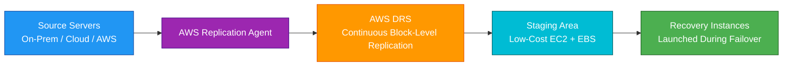
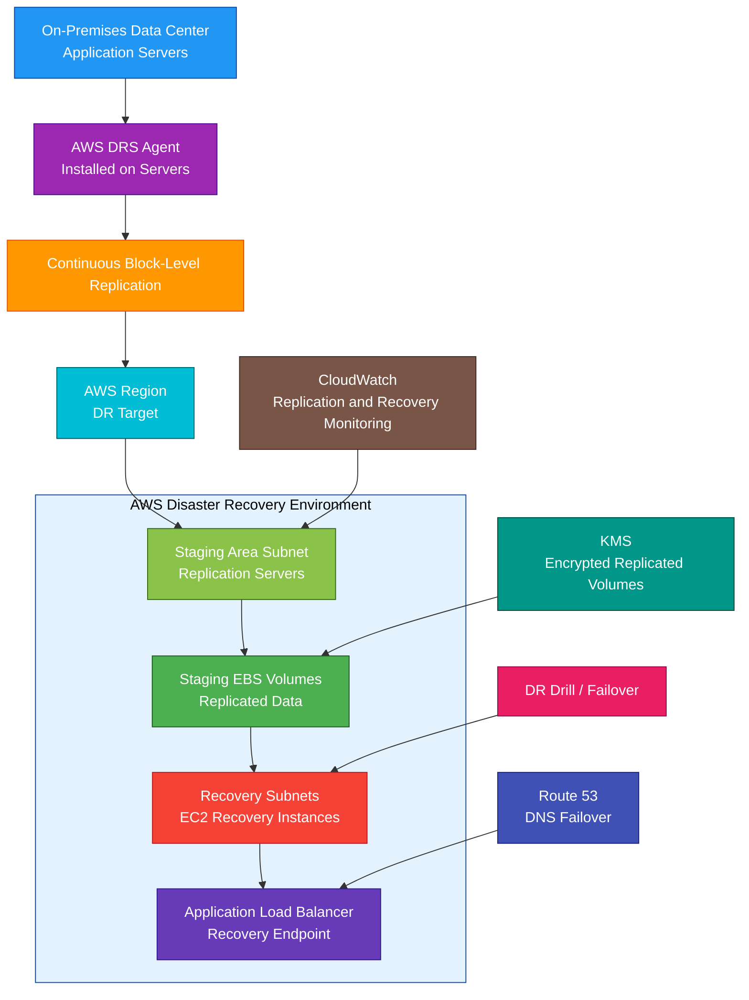

# AWS Elastic Disaster Recovery

## 1. Definition

### Simple Definition

AWS Elastic Disaster Recovery, also called AWS DRS, is a managed disaster recovery service.

It continuously replicates servers from on-premises, another cloud, or AWS into a low-cost staging area in AWS so you can quickly launch recovery servers during a disaster.

### Memory Hook

Elastic Disaster Recovery = Continuously replicate servers to AWS for fast recovery.

### Basic Idea

Install an AWS replication agent on source servers.

AWS DRS continuously copies block-level data to AWS.

During a disaster, you launch recovery instances in AWS.

### Key Point

AWS Elastic Disaster Recovery is for disaster recovery of servers.

It helps reduce downtime and data loss by keeping continuously replicated copies ready in AWS.

## 2. What Problem Does It Solve?

### Main Problem

AWS Elastic Disaster Recovery solves the problem of recovering servers quickly after a disaster without maintaining a full duplicate production environment all the time.

### Without AWS DRS

You may have problems such as:

- Long recovery times
- Manual server rebuilds
- Large data loss after failure
- Expensive standby infrastructure
- Complex DR testing
- Hard-to-maintain recovery runbooks
- Inconsistent recovery process
- Difficult on-premises to AWS failover

### With AWS DRS

Source servers are continuously replicated to AWS.

When disaster happens, AWS can launch recovery EC2 instances using the replicated data.

### Key Benefit

AWS DRS provides low RPO and low RTO disaster recovery with lower standby cost than a full active-active environment.

## 3. Core Use Cases

### On-Premises Disaster Recovery to AWS

Use AWS DRS to replicate physical or virtual on-premises servers to AWS.

Example:

A company wants AWS as the recovery site for its data center.

### Cloud-to-AWS Disaster Recovery

Use AWS DRS to replicate workloads from another cloud provider into AWS.

Example:

A workload running outside AWS needs AWS as the DR target.

### AWS Region-to-Region Disaster Recovery

Use AWS DRS to replicate servers from one AWS Region to another AWS Region.

Example:

Production runs in `us-east-1`, and recovery is prepared in `us-west-2`.

### Server-Level Disaster Recovery

Use AWS DRS when you need to recover entire servers, including:

- Operating system
- Applications
- Attached volumes
- Configuration
- Data

### Lift-and-Shift DR

Use AWS DRS when you want disaster recovery without rearchitecting the application immediately.

### DR Testing

Use AWS DRS to run non-disruptive recovery drills.

Example:

Launch test recovery instances in AWS without stopping production replication.

### Ransomware or Data Corruption Recovery

Use point-in-time recovery options to recover to a previous consistent state before corruption or attack.

## 4. Important Features for SAA

### Continuous Block-Level Replication

AWS DRS replicates data at the block level.

This means it copies changed disk blocks from the source server to AWS continuously.

### Replication Agent

The replication agent is installed on source servers.

It sends changed disk blocks to the AWS staging area.

### Source Server

A source server is the original machine being protected.

It can be:

- Physical server
- Virtual machine
- Cloud server
- EC2 instance in another Region

### Staging Area

The staging area is a low-cost AWS environment used for ongoing replication.

It usually contains:

- Lightweight replication servers
- Staging EBS volumes
- Networking configuration
- Security groups
- Subnets

### Replication Server

A replication server receives replicated data from source servers and writes it to staging EBS volumes.

AWS DRS manages these replication servers.

### Staging EBS Volumes

Staging EBS volumes store the continuously replicated data.

They are not the final production recovery instances.

### Recovery Instance

A recovery instance is an EC2 instance launched during a drill or failover.

It is created from the replicated source server data.

### Launch Settings

Launch settings define how recovery instances should be launched.

Examples:

- EC2 instance type
- Subnet
- Security group
- IAM instance profile
- Private IP behavior
- Tags
- User data
- Licensing options

### Replication Settings

Replication settings control how data is replicated.

Examples:

- Staging subnet
- Replication server instance type
- EBS volume type
- Encryption
- Bandwidth throttling
- Data routing
- Security groups

### Recovery Point Objective

Recovery Point Objective, or RPO, means how much data you can afford to lose.

AWS DRS supports low RPO because it continuously replicates data.

### Recovery Time Objective

Recovery Time Objective, or RTO, means how quickly the workload must recover.

AWS DRS supports low RTO because recovery instances can be launched quickly in AWS.

### Point-in-Time Recovery

AWS DRS keeps recovery points.

You can choose a recovery point when launching recovery instances.

This helps recover from:

- Accidental deletion
- Corruption
- Ransomware
- Bad application changes

### Drill

A drill is a test recovery.

Use drills to confirm that recovery works without affecting production servers.

### Failover

Failover means launching recovery instances in AWS because the source environment is unavailable or intentionally being switched over.

### Failback

Failback means moving the workload back from AWS to the original environment or another target after the disaster is resolved.

### Recovery Plan

A recovery plan helps coordinate the recovery of multiple source servers.

Use it when an application depends on several servers that must recover together.

### Tags

Use tags to organize DRS resources.

Examples:

- Application
- Environment
- Owner
- Cost center
- Recovery tier

### Automation

AWS DRS can be combined with automation tools.

Examples:

- EventBridge
- Lambda
- Systems Manager
- CloudFormation
- Step Functions

### Former CloudEndure Note

AWS Elastic Disaster Recovery is the AWS-native successor to CloudEndure Disaster Recovery.

For the SAA exam, focus on AWS Elastic Disaster Recovery.

## 5. Security Model

### IAM Permissions

IAM controls who can configure, manage, test, and launch disaster recovery operations.

Common permissions:

| Permission | Purpose |
|---|---|
| `drs:InitializeService` | Initialize AWS DRS |
| `drs:CreateReplicationConfigurationTemplate` | Create replication settings |
| `drs:DescribeSourceServers` | View protected source servers |
| `drs:StartRecovery` | Launch recovery instances |
| `drs:StartFailbackLaunch` | Start failback process |
| `drs:UpdateLaunchConfiguration` | Modify recovery launch settings |
| `drs:DisconnectSourceServer` | Disconnect source server |

### Least Privilege

Give disaster recovery permissions only to trusted administrators.

Example:

A normal developer should not be able to start production failover unless required.

### Service-Linked Role

AWS DRS uses service-linked roles to manage AWS resources required for replication and recovery.

Examples:

- Replication servers
- EBS volumes
- Recovery instances
- Snapshots
- Network interfaces

### Replication Agent Security

The source server agent must be installed securely.

Protect:

- Installation credentials
- Agent configuration
- Network access
- Source server operating system

### Encryption in Transit

Replication traffic is encrypted in transit.

This protects data moving from source servers to AWS.

### Encryption at Rest

Replicated data can be encrypted at rest using EBS encryption and AWS KMS.

Use customer managed KMS keys when more control is required.

### KMS Permissions

If using customer managed KMS keys, make sure AWS DRS has permission to use the key.

Incorrect KMS permissions can break replication or recovery launches.

### Network Security

Use secure network paths between source servers and AWS.

Common options:

- Internet with secure encryption
- VPN
- AWS Direct Connect
- Private connectivity patterns where appropriate

### Security Groups

Security groups control access to replication servers and recovery instances.

Best practice:

Allow only required ports and sources.

### Staging Area Isolation

The staging area should be isolated and locked down.

It is used for replication, not direct user access.

### Recovery Instance Security

Recovery instances should launch with secure settings.

Examples:

- Correct security groups
- Correct IAM instance profile
- Encryption enabled
- Private subnet placement where appropriate
- Hardened operating system configuration

### Secrets and Credentials

Do not store secrets in recovery runbooks or scripts.

Use:

- AWS Secrets Manager
- Systems Manager Parameter Store
- IAM roles
- KMS encryption

### Logging and Auditing

Use AWS logging services.

Common tools:

- CloudTrail for AWS API activity
- CloudWatch for metrics and logs
- VPC Flow Logs for network visibility
- AWS Config for configuration tracking

### Shared Responsibility

AWS is responsible for:

- AWS DRS managed service infrastructure
- Replication orchestration
- Managed recovery operations
- AWS infrastructure availability
- Physical security

You are responsible for:

- Installing and managing source server agents
- IAM permissions
- Network connectivity
- Security groups
- KMS key policies
- Launch settings
- DR testing
- Recovery runbooks
- Application-level validation
- Failover and failback decisions

## 6. High Availability / Durability Behavior

### Availability

AWS DRS improves availability by preparing recovery copies of servers in AWS.

If the source environment fails, you can launch recovery instances in AWS.

### Regional Behavior

AWS DRS replicates servers into a selected AWS Region.

For Region-to-Region DR, configure replication from the source Region to the recovery Region.

### Multi-AZ Behavior

The staging area and recovery instances are deployed into selected subnets and Availability Zones.

For production recovery, choose subnets and architecture that support Multi-AZ recovery where needed.

### Durability

Replicated data is stored on EBS volumes and snapshots in AWS.

Durability depends on AWS storage services and your recovery configuration.

### RPO Behavior

Because replication is continuous, AWS DRS can support low RPO.

Actual RPO depends on:

- Network bandwidth
- Replication lag
- Source server change rate
- Staging area performance
- Configuration

### RTO Behavior

AWS DRS can support low RTO by launching recovery instances quickly.

Actual RTO depends on:

- Number of servers
- Boot time
- Application startup time
- DNS changes
- Database recovery
- Dependency order
- Manual validation steps

### Recovery Points

Recovery points let you choose the data state used for recovery.

Use recent points for normal disaster recovery.

Use older points for corruption or ransomware recovery.

### Failover Testing

Regular drills improve confidence and reduce real recovery risk.

A DR plan that is not tested may fail during a real disaster.

### Multi-Region DR

AWS DRS can support DR into another AWS Region.

For full Multi-Region application recovery, also plan:

- DNS failover
- Database dependencies
- Secrets and parameters
- IAM roles
- Networking
- Certificates
- Load balancers
- Application dependencies

### Important Exam Point

AWS DRS helps recover servers, but application-level recovery still requires planning, testing, and dependency management.

## 7. Cost Optimization Options

### Low-Cost Staging Area

AWS DRS uses a low-cost staging area instead of running full-size duplicate production servers all the time.

This helps reduce DR standby cost.

### Right-Size Replication Servers

Choose replication server instance types based on workload replication needs.

Avoid overprovisioning staging resources.

### Use Appropriate EBS Volume Types

Choose staging EBS volume types based on cost and performance needs.

For many workloads, cost-effective volume types are enough for staging replication.

### Launch Recovery Instances Only During Drills or Failover

Recovery instances usually do not need to run all the time.

They are launched during:

- DR drills
- Actual failover
- Recovery validation

### Clean Up Test Recovery Instances

After a drill, terminate test recovery instances when no longer needed.

This avoids unnecessary EC2 and EBS cost.

### Monitor Replication Lag

High replication lag may require better network bandwidth or staging performance.

Fixing lag early can avoid expensive emergency changes later.

### Use Tags for Cost Tracking

Tag DRS-related resources.

Examples:

- `Application`
- `Environment`
- `DR-Tier`
- `Owner`
- `CostCenter`

### Avoid Protecting Unnecessary Servers

Not every server needs the same DR tier.

Classify workloads by business criticality.

Example:

| Workload Type | DR Strategy |
|---|---|
| Mission-critical | AWS DRS or warm standby |
| Important but less urgent | Backup and restore |
| Non-critical dev/test | Rebuild from IaC |

### Use Lifecycle Policies Where Applicable

Manage old snapshots and temporary recovery resources carefully.

Do not keep unnecessary recovery artifacts forever.

### Match DR Strategy to Business Need

AWS DRS is powerful, but not every workload needs low RPO and low RTO.

Use cheaper strategies for less critical systems.

## 8. Common Exam Traps

### AWS DRS vs AWS Backup

This is a common exam trap.

| Requirement | Choose |
|---|---|
| Continuous server replication and fast failover | AWS Elastic Disaster Recovery |
| Centralized backup management | AWS Backup |

### AWS DRS vs Application Migration Service

AWS Elastic Disaster Recovery is for disaster recovery.

AWS Application Migration Service is for migration.

| Requirement | Choose |
|---|---|
| Ongoing DR replication and failover | AWS DRS |
| One-time lift-and-shift migration to AWS | AWS Application Migration Service |

### AWS DRS Is Not Backup Only

Backups are usually point-in-time copies.

AWS DRS continuously replicates server disks for fast recovery.

### AWS DRS Is Not Active-Active

AWS DRS typically keeps a low-cost staging area and launches recovery instances during failover.

It is not the same as running full production in two active Regions.

### Staging Area Is Not Production

The staging area is used for replication.

Production traffic should go to recovery instances launched during drill or failover.

### Agent Is Required

AWS DRS commonly requires installing a replication agent on source servers.

If agents cannot be installed, another DR method may be needed.

### Low RPO Depends on Replication Health

Continuous replication supports low RPO, but network issues or high change rates can increase lag.

Monitor replication status.

### Low RTO Still Needs Runbooks

AWS DRS can launch servers quickly, but full application recovery also requires:

- DNS changes
- Dependency startup order
- Validation
- User traffic routing
- Security checks

### Failover Testing Is Critical

Do not assume DR works without testing.

Use drills to validate recovery.

### DRS Does Not Automatically Fix Application Bugs

If corrupted data is replicated, you may need to recover from an earlier recovery point.

### DRS Does Not Replace Multi-AZ

For high availability inside one Region, use Multi-AZ architectures.

For disaster recovery from environment or Region failure, use DRS or other DR strategies.

### DRS Is Server-Centric

AWS DRS is best for server replication.

Cloud-native applications may use service-native DR patterns instead.

Examples:

- S3 Cross-Region Replication
- DynamoDB Global Tables
- Aurora Global Database
- Route 53 failover

## 9. Compare With Similar Services

### Service Comparison Table

| Service | Main Purpose | Best For | Choose When |
|---|---|---|---|
| AWS Elastic Disaster Recovery | Server-level DR replication and failover | Fast recovery of servers into AWS | You need low RPO/RTO disaster recovery |
| AWS Backup | Centralized backup management | Backup and restore across AWS services | You need backup policies and restore points |
| AWS Application Migration Service | Lift-and-shift migration | Moving servers to AWS | You need one-time migration, not ongoing DR |
| CloudFormation | Infrastructure as Code | Recreate infrastructure | You can rebuild resources from templates |
| Route 53 | DNS routing and failover | Redirect users during DR | You need DNS failover to recovery site |
| Elastic Load Balancing | Traffic distribution | Multi-AZ application access | You need to route traffic to healthy targets |
| AWS Resilience Hub | Resilience assessment | Evaluate app resilience posture | You need resilience recommendations and assessment |

### AWS DRS vs AWS Backup

| Feature | AWS DRS | AWS Backup |
|---|---|---|
| Main purpose | Disaster recovery replication | Backup management |
| Recovery style | Launch recovery servers | Restore from backups |
| RPO | Low, continuous replication | Depends on backup frequency |
| RTO | Low, launch recovery instances | Usually longer |
| Best for | Critical server workloads | Backup compliance and restore |

### AWS DRS vs Application Migration Service

| Feature | AWS DRS | AWS Application Migration Service |
|---|---|---|
| Main purpose | Disaster recovery | Migration |
| Usage | Ongoing replication for DR | Move workloads to AWS |
| Failover drills | Yes | Migration testing/cutover |
| Best for | Recover during disaster | Lift-and-shift migration |

### AWS DRS vs Multi-AZ

| Feature | AWS DRS | Multi-AZ Architecture |
|---|---|---|
| Main purpose | Disaster recovery | High availability |
| Scope | Recover to AWS/Region | Survive AZ failure |
| Recovery action | Launch recovery instances | Automatic or active failover |
| Best for | Larger disaster scenarios | Local infrastructure resilience |

### AWS DRS vs Active-Active Multi-Region

| Feature | AWS DRS | Active-Active Multi-Region |
|---|---|---|
| Cost | Usually lower standby cost | Higher cost |
| Complexity | Lower than active-active | Higher |
| RTO/RPO | Low, but failover needed | Very low if designed well |
| Best for | Server DR with lower cost | Mission-critical global apps |

### AWS DRS vs CloudFormation

| Feature | AWS DRS | CloudFormation |
|---|---|---|
| Main purpose | Replicate and recover servers | Provision infrastructure |
| Data replication | Yes | No |
| Rebuild infrastructure | Not main purpose | Yes |
| Common use together | Yes | Yes |

### When to Choose AWS Elastic Disaster Recovery

Choose AWS DRS when:

- You need disaster recovery for servers
- You need low RPO and low RTO
- You need continuous block-level replication
- You need DR from on-premises to AWS
- You need DR from another cloud to AWS
- You need AWS Region-to-Region DR for EC2-like workloads
- You want non-disruptive recovery drills
- You want lower-cost standby than full duplicate production
- You need point-in-time recovery for replicated servers

## 10. Mini Architecture Example

### Scenario

A company runs a critical application in an on-premises data center.

The company wants AWS to be the disaster recovery site.

The application must recover quickly if the data center fails.

### Architecture

Install the AWS DRS replication agent on on-premises servers.

Replicate data continuously into an AWS staging area.

Configure launch settings for recovery EC2 instances.

During a DR drill or real disaster, launch recovery instances in AWS.

Use Route 53 to redirect users to the recovery environment.

### Why This Is Good

- Source servers continuously replicate to AWS
- Low-cost staging area reduces standby cost
- Recovery instances are launched only during drills or failover
- Block-level replication supports low RPO
- Automated launch settings support faster RTO
- Route 53 can redirect users to recovery environment
- KMS protects replicated volumes at rest
- CloudWatch helps monitor replication health
- DR drills validate recovery before real disasters
- AWS becomes the disaster recovery site without running full production all the time

### Exam Answer Pattern

If the question says:

“Continuously replicate on-premises servers to AWS for low RPO and low RTO disaster recovery.”

Think:

AWS Elastic Disaster Recovery.

If the question says:

“Centrally manage backups across AWS services.”

Think:

AWS Backup.

If the question says:

“Migrate servers to AWS using lift-and-shift.”

Think:

AWS Application Migration Service.

If the question says:

“Route users to a recovery Region during outage.”

Think:

Route 53 failover routing.

### Final Memory Hook

AWS DRS = Elastic Disaster Recovery.

Purpose = Server-level disaster recovery.

Replication = Continuous block-level replication.

Agent = Installed on source servers.

Source server = Server being protected.

Staging area = Low-cost replication environment.

Replication server = Receives replicated data.

Staging EBS volume = Stores replicated blocks.

Recovery instance = EC2 instance launched during drill/failover.

RPO = How much data loss is acceptable.

RTO = How fast recovery must happen.

Drill = Test recovery.

Failover = Recover to AWS.

Failback = Move back after disaster.

AWS Backup = Backup and restore.

Application Migration Service = Migration.

Route 53 = DNS failover.

