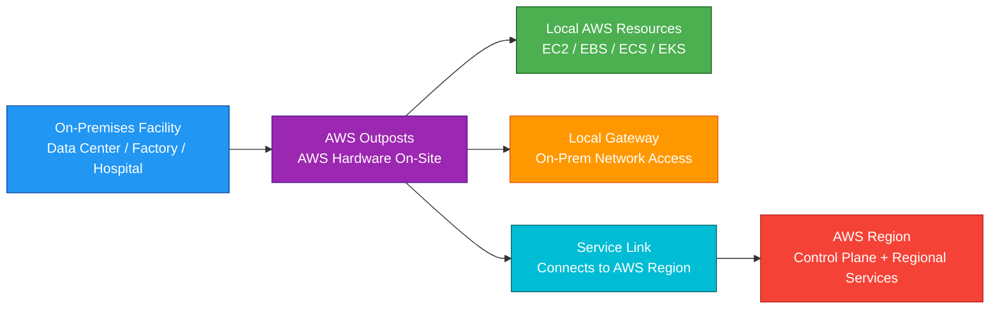
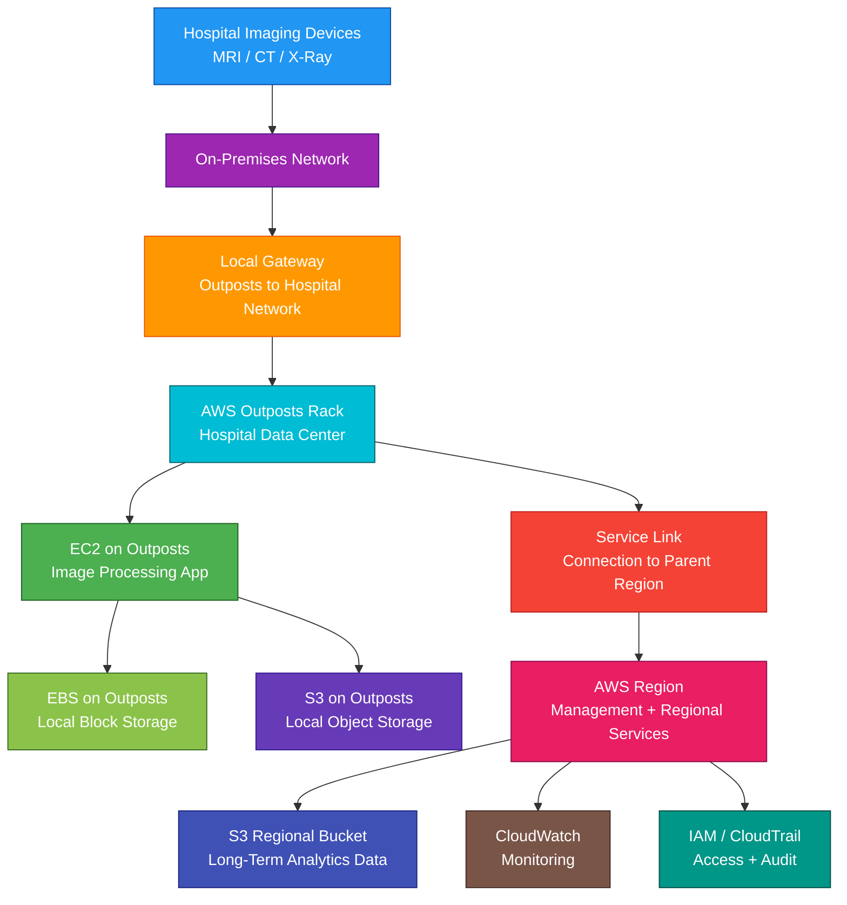

# AWS Outposts

## 1. Definition

### Simple Definition

AWS Outposts is a fully managed hybrid cloud service that brings AWS infrastructure, services, APIs, and tools into your on-premises location.

It lets you run AWS compute and storage locally while still using the AWS control plane from an AWS Region.

### Memory Hook

Outposts = AWS hardware in your data center.

### Basic Idea

AWS installs and manages AWS hardware at your site.

You launch supported AWS resources on that local hardware, but manage them using familiar AWS tools.

### Key Point

Outposts is for workloads that must run on-premises but still need AWS-style operations.

It is not a replacement for all AWS Regions.

## 2. What Problem Does It Solve?

### Main Problem

AWS Outposts solves the problem of running AWS workloads close to on-premises systems, users, equipment, or data when using a normal AWS Region is not enough.

### Without Outposts

You may struggle with:

- High latency to AWS Regions
- Applications that must stay close to local systems
- Local data processing requirements
- Data residency or regulatory constraints
- Hybrid applications split between cloud and on-premises
- Different tools for cloud and on-premises environments
- Complex local infrastructure management

### With Outposts

You can run supported AWS services locally while using the same AWS APIs, tools, and management experience.

### Key Benefit

Outposts gives you a consistent AWS experience on-premises for low-latency and local processing workloads.

## 3. Core Use Cases

### Low-Latency Applications

Use Outposts when applications need very low latency to local users, systems, or equipment.

Examples:

- Factory automation
- Medical imaging
- Real-time analytics
- Trading systems
- Local gaming services
- Media processing

### Local Data Processing

Use Outposts when data must be processed locally before being sent to AWS.

Examples:

- Manufacturing sensor data
- Healthcare imaging files
- Video processing
- Retail store data
- Industrial control systems

### Data Residency

Use Outposts when certain workloads or data must remain on-premises due to regulatory, compliance, or business requirements.

### Hybrid Applications

Use Outposts for applications that need to connect tightly to on-premises systems.

Example:

An application server runs on Outposts and connects to an on-premises database with very low latency.

### Migration Bridge

Use Outposts when gradually modernizing applications that cannot fully move to AWS immediately.

### Edge Processing

Use Outposts at locations where local compute is needed.

Examples:

- Retail stores
- Hospitals
- Factories
- Telecom sites
- Remote facilities

### Consistent AWS Operations On-Premises

Use Outposts when teams want to use AWS APIs, IAM, CloudWatch, CloudFormation, and other AWS tools for local workloads.

## 4. Important Features for SAA

### Fully Managed AWS Hardware

AWS provides, installs, monitors, maintains, and supports the Outposts hardware.

You provide the physical site, power, cooling, networking, and facility access.

### Outposts Rack

An Outposts rack is a full rack of AWS-managed hardware installed in your facility.

It supports more AWS services and larger workloads than Outposts servers.

Best for:

- Data centers
- Large on-premises environments
- Production hybrid workloads
- Higher capacity needs

### Outposts Server

An Outposts server is a smaller physical AWS-managed server installed at your location.

Best for:

- Smaller sites
- Retail locations
- Branch offices
- Factories
- Healthcare sites
- Edge locations with limited space

### Rack vs Server

| Feature | Outposts Rack | Outposts Server |
|---|---|---|
| Size | Full rack deployment | Smaller 1U/2U-style server options |
| Capacity | Larger | Smaller |
| Supported services | More AWS services | Fewer AWS services |
| Best for | Data center or larger site | Small edge or branch site |
| Example | Enterprise data center | Retail store or factory floor |

### Supported Services

Supported services depend on the Outposts form factor and Region.

Common Outposts service examples include:

- Amazon EC2
- Amazon EBS
- Amazon ECS
- Amazon EKS on racks
- Amazon RDS on racks, where supported
- Amazon ElastiCache on racks, where supported
- Amazon EMR on racks, where supported
- Amazon S3 on Outposts, where supported

### Important Exam Point

Not every AWS service runs on Outposts.

Outposts supports a subset of AWS services locally and connects back to an AWS Region for management and other regional services.

### AWS Region Anchor

Every Outpost is connected to a parent AWS Region.

The parent Region provides:

- Control plane
- Management APIs
- Monitoring
- Regional service access
- Identity and permissions
- Service coordination

### Service Link

The service link is the network connection between the Outpost and its parent AWS Region.

It is required for management, monitoring, and control plane communication.

### Local Gateway

A local gateway, or LGW, connects Outposts resources to your on-premises network.

It allows local workloads on Outposts to communicate with local systems.

### Outpost Subnet

An Outpost subnet is a subnet associated with the Outpost.

When you launch supported resources into that subnet, they run on Outposts hardware.

### VPC Extension

Outposts extends your Amazon VPC to your on-premises location.

This means workloads on Outposts can use familiar VPC concepts.

Examples:

- Subnets
- Route tables
- Security groups
- Network ACLs
- Elastic network interfaces

### EC2 on Outposts

You can run supported EC2 instances locally on Outposts.

Use this when applications need compute close to on-premises systems.

### EBS on Outposts

EBS volumes can be attached to supported EC2 instances running on Outposts.

Use EBS for block storage for local EC2 workloads.

### S3 on Outposts

S3 on Outposts stores object data locally on the Outpost.

Use it when applications need S3-compatible object storage on-premises.

### ECS on Outposts

Amazon ECS can run container workloads on Outposts.

Use this when you need container orchestration close to on-premises systems.

### EKS on Outposts

Amazon EKS can run Kubernetes workloads on Outposts racks.

Use this when you need Kubernetes on-premises with AWS-managed infrastructure.

### RDS on Outposts

Amazon RDS on Outposts can run supported relational database engines locally.

Use this when a database needs low latency to on-premises applications or data.

### Capacity Management

Outposts has fixed physical capacity based on the hardware installed.

Important point:

Unlike AWS Regions, Outposts cannot instantly provide unlimited capacity.

You must plan capacity.

### Ordering and Installation

Outposts requires planning, site validation, delivery, installation, and activation.

It is not an instant software-only service.

### Local Workload Placement

To run workloads on Outposts, choose the Outpost subnet or supported placement target.

### AWS Console and APIs

You manage Outposts resources using normal AWS tools.

Examples:

- AWS Console
- AWS CLI
- AWS SDKs
- CloudFormation
- CloudWatch
- IAM

### Hybrid Connectivity

Outposts commonly integrates with:

- Local network
- AWS Direct Connect
- Site-to-Site VPN
- Transit Gateway
- VPC routing
- Local gateway routing

## 5. Security Model

### IAM Permissions

IAM controls who can manage Outposts and launch resources on Outposts.

Common permissions:

| Permission | Purpose |
|---|---|
| `outposts:GetOutpost` | View Outpost details |
| `outposts:ListOutposts` | List Outposts |
| `outposts:ListSites` | List Outposts sites |
| `ec2:RunInstances` | Launch EC2 instances |
| `ec2:CreateSubnet` | Create subnet |
| `ec2:CreateRoute` | Create route |
| `s3-outposts:*` | Manage S3 on Outposts resources |

### AWS Control Plane Security

Outposts uses AWS Region control plane services.

IAM, CloudTrail, CloudWatch, and AWS APIs remain important for managing access and auditing.

### Shared Responsibility

AWS is responsible for:

- Outposts hardware infrastructure
- Hardware maintenance
- Managed service components
- Physical hardware replacement
- AWS service software
- Service link management components
- Monitoring AWS-managed infrastructure

You are responsible for:

- Physical site security
- Power
- Cooling
- Network connectivity
- Local network configuration
- Local gateway routing
- Security groups
- IAM permissions
- Application security
- Data classification
- Backup and disaster recovery planning

### Physical Security

Because Outposts hardware is located at your site, you are responsible for protecting the facility.

This includes:

- Restricted physical access
- Secure rack location
- Facility controls
- Power protection
- Environmental controls
- Operational procedures

### Network Security

Use standard network security controls.

Examples:

- Security groups
- Network ACLs
- Route tables
- Firewall rules
- Local gateway route controls
- VPN or Direct Connect security
- VPC Flow Logs where appropriate

### Security Groups

Security groups control inbound and outbound traffic for EC2 instances on Outposts.

Best practice:

Allow only required traffic from trusted sources.

### Local Gateway Security

The local gateway connects Outposts to the on-premises network.

Use route controls and firewall policies to prevent unwanted access.

### Encryption at Rest

Use encryption for storage services where supported.

Examples:

- EBS encryption
- S3 on Outposts encryption
- RDS encryption
- KMS keys where supported

### Encryption in Transit

Use TLS or other encryption protocols for application traffic.

Examples:

- HTTPS
- TLS database connections
- Encrypted service communication
- VPN or private connectivity where appropriate

### KMS Considerations

Some encrypted services depend on AWS KMS in the parent Region.

Plan for how encryption behaves during service link interruptions.

### CloudTrail Auditing

CloudTrail records AWS API activity.

Use it to audit:

- Outposts management actions
- EC2 launch actions
- Network changes
- IAM changes
- S3 on Outposts API activity

### Monitoring

Use CloudWatch and other monitoring tools to observe:

- Instance metrics
- Application metrics
- Capacity
- Network health
- Service link status
- Hardware health events

### Secrets Management

Do not store secrets directly on instances or in user data.

Use:

- AWS Secrets Manager
- Systems Manager Parameter Store
- IAM roles
- KMS encryption

## 6. High Availability / Durability Behavior

### Availability

Outposts availability depends on:

- Local hardware capacity
- Local power
- Local cooling
- Local network
- Service link health
- Application architecture
- Parent Region connectivity

### Local Hardware Dependency

Outposts runs inside your facility.

If your facility loses power, cooling, or network connectivity, workloads can be affected.

### Service Link Dependency

The service link connects Outposts to the parent AWS Region.

If the service link is interrupted, some local workloads may continue running, but management operations and regional service interactions may be limited.

### Control Plane Dependency

Many AWS control plane actions require connectivity to the parent Region.

Examples:

- Launching new resources
- API management actions
- Some monitoring and identity operations
- Service coordination

### Multi-AZ Behavior

Outposts is not the same as an AWS Availability Zone.

A single Outpost is located in one physical customer location.

For higher availability, design with:

- Multiple Outposts
- AWS Region resources
- Multi-AZ resources in the Region
- Backups and replication
- Disaster recovery plans

### Capacity Limit

Outposts has finite installed capacity.

If local capacity is full, you cannot launch more local resources until capacity is freed or expanded.

### Durability

Durability depends on the storage service and architecture.

Examples:

- EBS on Outposts is local block storage
- S3 on Outposts stores object data locally
- Backups to the parent Region can improve resilience
- Regional S3 provides higher regional durability than local-only storage

### Backup Strategy

Use backup and replication patterns for critical data.

Examples:

- EBS snapshots to Region
- RDS backups to Region
- S3 replication from Outposts to Region
- AWS Backup where supported
- Application-level replication

### Disaster Recovery

Outposts does not automatically protect against a full site failure.

For site-level disaster recovery, plan:

- Replication to AWS Region
- Replication to another Outpost
- Backups
- Route 53 failover
- Elastic Disaster Recovery where applicable
- Application recovery runbooks

### High Availability Pattern

For production workloads, combine Outposts with:

- Regional AWS services
- Load balancing
- Backup and restore
- Monitoring
- Multiple local power/network paths
- Application-level failover

### Important Exam Point

Outposts brings AWS infrastructure on-premises, but local site failures are still your responsibility to plan for.

## 7. Cost Optimization Options

### Plan Capacity Carefully

Outposts uses physical capacity installed at your site.

Over-ordering capacity can waste money.

Under-ordering capacity can limit workload growth.

### Choose Rack or Server Correctly

Use Outposts servers for smaller edge locations.

Use Outposts racks for larger workloads and broader service support.

### Run Only Local-Required Workloads

Do not run everything on Outposts.

Use Outposts only when workloads need:

- Local latency
- Local data processing
- Local system integration
- Data residency on-premises

Run normal cloud workloads in AWS Regions when possible.

### Use Regional Services Where Possible

If a workload does not need to run locally, use the AWS Region.

Regional services often provide more elasticity and service options.

### Right-Size EC2 Instances

Choose EC2 instance types based on workload needs.

Avoid consuming limited Outposts capacity with oversized instances.

### Monitor Capacity Usage

Track:

- EC2 capacity
- EBS usage
- S3 on Outposts usage
- Network usage
- Service link usage
- Instance utilization

### Use Auto Scaling Carefully

Auto Scaling can help, but Outposts capacity is finite.

Scaling policies must consider local hardware limits.

### Clean Up Unused Local Resources

Delete unused:

- EC2 instances
- EBS volumes
- Snapshots
- S3 objects
- Test environments
- Unused containers

### Archive Data to Region

For long-term storage, consider moving or replicating data to regional S3 storage classes when business rules allow.

### Avoid Duplicate Infrastructure

Use Outposts only for the part of the application that requires local processing.

Keep other parts in the AWS Region.

Example:

Run latency-sensitive processing on Outposts and analytics in the Region.

### Tag Resources

Use tags for cost visibility.

Examples:

- Application
- Environment
- Owner
- Cost center
- Location
- Outpost ID

## 8. Common Exam Traps

### Outposts vs Local Zones

This is a major exam trap.

| Requirement | Choose |
|---|---|
| AWS infrastructure inside your own facility | Outposts |
| AWS infrastructure in an AWS-managed metro location near users | Local Zones |

### Outposts vs Wavelength

Wavelength is for ultra-low latency 5G/mobile edge workloads inside telecom networks.

Outposts is AWS hardware installed at your site.

| Requirement | Choose |
|---|---|
| On-premises AWS infrastructure | Outposts |
| 5G/mobile edge application | Wavelength |

### Outposts vs Snowball Edge

Snowball Edge is for rugged edge computing and data transfer, often disconnected or intermittently connected.

Outposts is managed AWS infrastructure installed on-premises and connected to a parent Region.

### Outposts vs Direct Connect

Direct Connect provides private network connectivity to AWS.

Outposts provides local AWS infrastructure.

They can be used together.

### Outposts vs Hybrid Connectivity

Outposts is not just a network connection.

It includes AWS hardware running locally.

For only connecting your data center to AWS, use VPN or Direct Connect.

### Outposts Is Not Fully Disconnected AWS

Outposts requires a service link to the parent Region for management and control plane operations.

If the service link is down, some local workloads may continue, but management and regional service access may be limited.

### Outposts Has Finite Capacity

Unlike an AWS Region, Outposts capacity is limited by installed hardware.

Capacity planning is important.

### Not Every AWS Service Runs Locally

Outposts supports a subset of AWS services.

If the question requires a service not supported locally, use the parent Region or another architecture.

### Outposts Does Not Remove On-Prem Responsibilities

You still manage the facility, power, cooling, physical security, and local network.

### Outposts Is Not Automatically Multi-Region or Multi-AZ

A single Outpost is one local deployment.

Design disaster recovery separately.

### Local Gateway Is Important

If the question mentions communication between Outposts resources and local on-premises systems, think local gateway.

### Parent Region Is Important

If the question asks about control plane or management, remember Outposts is connected to a parent AWS Region.

## 9. Compare With Similar Services

### Service Comparison Table

| Service | Main Purpose | Best For | Choose When |
|---|---|---|---|
| AWS Outposts | AWS infrastructure on-premises | Low latency and local processing at customer site | You need AWS services in your data center or facility |
| AWS Local Zones | AWS infrastructure near metro areas | Low latency to users in a city/region | You need AWS resources closer to users, not inside your facility |
| AWS Wavelength | AWS infrastructure at 5G edge | Mobile and telecom low-latency apps | You need ultra-low latency for 5G devices |
| AWS Snowball Edge | Edge compute and data transfer | Remote/disconnected sites and bulk data migration | You need portable edge device or offline transfer |
| AWS Direct Connect | Private network connectivity | Dedicated connection to AWS | You need private network link to AWS |
| Site-to-Site VPN | Encrypted network tunnel | Quick hybrid connectivity | You need encrypted connectivity over the internet |
| VMware Cloud on AWS | VMware environment on AWS | VMware-based migration/hybrid workloads | You need VMware stack compatibility on AWS |

### Outposts vs Local Zones

| Feature | Outposts | Local Zones |
|---|---|---|
| Location | Your facility | AWS-managed metro location |
| Ownership model | AWS-managed hardware at customer site | AWS-managed AWS site |
| Best for | Local systems/data residency | Low latency to city users |
| Facility responsibility | Customer provides site, power, cooling | AWS manages facility |
| Exam clue | On-premises AWS infrastructure | Metro-area low latency |

### Outposts vs Wavelength

| Feature | Outposts | Wavelength |
|---|---|---|
| Location | Customer premises | Telecom provider edge |
| Best for | On-prem workloads | 5G/mobile edge workloads |
| User proximity | Local facility | Mobile network users |
| Exam clue | Factory, hospital, data center | 5G, telecom, mobile devices |

### Outposts vs Snowball Edge

| Feature | Outposts | Snowball Edge |
|---|---|---|
| Main purpose | Local AWS infrastructure | Edge compute and data transfer |
| Connectivity | Requires service link for management | Can work in disconnected locations |
| Deployment | Installed managed hardware | Portable rugged device |
| Best for | Long-term hybrid AWS operations | Temporary/remote/offline edge use |

### Outposts vs Direct Connect

| Feature | Outposts | Direct Connect |
|---|---|---|
| Main purpose | Run AWS services on-premises | Private connectivity to AWS |
| Provides compute/storage locally | Yes | No |
| Network service | Uses network connectivity | Is network connectivity |
| Common use together | Yes | Yes |

### Outposts vs AWS Region

| Feature | Outposts | AWS Region |
|---|---|---|
| Location | Customer site | AWS data centers |
| Capacity | Fixed installed capacity | Large regional capacity |
| Services | Supported subset | Broad AWS service portfolio |
| Best for | Local latency/data needs | General cloud workloads |
| Facility operations | Customer site requirements | AWS-managed data centers |

### When to Choose AWS Outposts

Choose Outposts when:

- You need AWS infrastructure on-premises
- You need very low latency to local systems
- You need local data processing
- You have data residency requirements
- You need consistent AWS APIs and tools on-premises
- You need hybrid applications close to local databases or equipment
- You want AWS-managed hardware in your facility
- You can provide site, power, cooling, and network requirements
- Local Zones or Wavelength do not meet the location requirement

## 10. Mini Architecture Example

### Scenario

A hospital needs to process large medical imaging files locally because doctors need fast access and some data must stay on-premises.

The hospital also wants to use AWS tools for operations and send selected processed results to the AWS Region for long-term analytics.

### Architecture

Deploy AWS Outposts rack in the hospital data center.

Run EC2 application servers and EBS storage locally.

Use a local gateway to connect to hospital systems.

Use the service link to connect to the parent AWS Region.

Store long-term analytics data in regional S3 when allowed.

### Why This Is Good

- Medical imaging processing runs close to hospital systems
- Doctors get low-latency local access
- Sensitive data can remain on-premises where required
- EC2 on Outposts runs the application locally
- EBS on Outposts provides local block storage
- S3 on Outposts can provide local object storage
- Local gateway connects Outposts workloads to hospital systems
- Service link connects Outposts to the parent AWS Region
- CloudWatch and CloudTrail support monitoring and auditing
- Selected data can be sent to regional S3 for analytics when allowed

### Exam Answer Pattern

If the question says:

“Run AWS services on-premises for low-latency access to local systems.”

Think:

AWS Outposts.

If the question says:

“Run AWS resources closer to users in a metro area, but not inside the customer data center.”

Think:

AWS Local Zones.

If the question says:

“Run applications at the 5G edge for mobile users.”

Think:

AWS Wavelength.

If the question says:

“Use a portable rugged device for edge computing or offline data transfer.”

Think:

AWS Snowball Edge.

### Final Memory Hook

Outposts = AWS hardware on-premises.

Rack = Larger deployment, more services.

Server = Smaller edge deployment.

Parent Region = Control plane and regional services.

Service link = Outposts connection to AWS Region.

Local gateway = Outposts connection to local network.

Outpost subnet = Subnet where local resources run.

EC2 on Outposts = Local compute.

EBS on Outposts = Local block storage.

S3 on Outposts = Local object storage.

ECS/EKS on Outposts = Local containers.

Capacity = Fixed installed hardware.

Local Zones = AWS near metro users.

Wavelength = AWS at 5G edge.

Snowball Edge = Portable edge/offline device.

Direct Connect = Private network to AWS.

Outposts is best for local latency, local data processing, and hybrid AWS operations.

