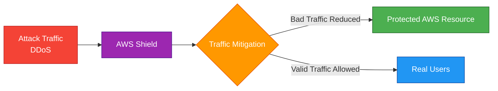
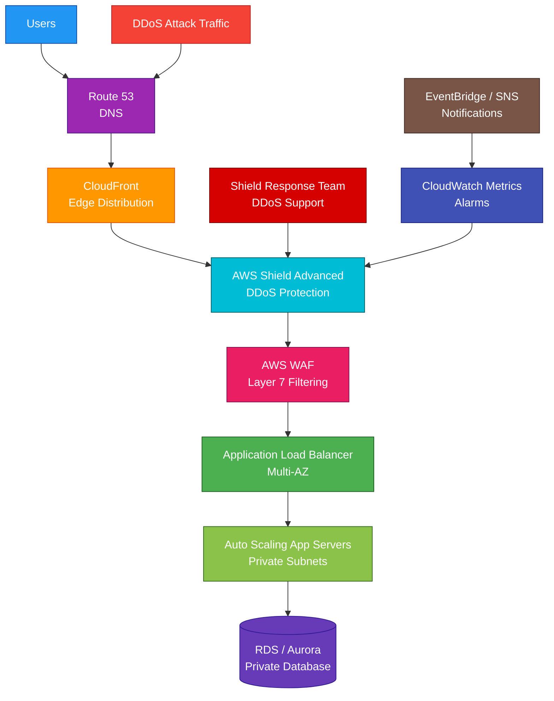

# AWS Shield

## 1. Definition

### Simple Definition

AWS Shield is a managed DDoS protection service.

DDoS means Distributed Denial of Service, where attackers try to overwhelm an application with too much traffic.

### Memory Hook

Shield = Protects AWS apps from DDoS attacks.

### Basic Idea

AWS Shield helps protect internet-facing AWS resources from large traffic attacks.

### Shield Versions

AWS Shield has two main levels.

| Version | Description |
|---|---|
| AWS Shield Standard | Free automatic DDoS protection for all AWS customers |
| AWS Shield Advanced | Paid advanced DDoS protection with extra visibility, support, and cost protection |

## 2. What Problem Does It Solve?

### Main Problem

AWS Shield solves the problem of protecting public applications from DDoS attacks.

A DDoS attack tries to make an application unavailable by flooding it with traffic.

### Without AWS Shield

Applications may suffer from:

- Traffic floods
- Network saturation
- Application downtime
- Increased infrastructure cost
- Slow response times
- Overloaded load balancers
- Overloaded application servers

### With AWS Shield

AWS detects and mitigates many DDoS attacks before they impact your application.

### Key Benefit

AWS Shield helps keep applications available during DDoS attacks.

## 3. Core Use Cases

### Protect Public Websites

Use AWS Shield to protect websites running behind CloudFront or Application Load Balancer.

### Protect APIs

Use Shield with services such as:

- Amazon CloudFront
- Application Load Balancer
- API Gateway, usually through CloudFront/WAF design
- Global Accelerator

### Protect DNS

Use Shield Advanced to protect Amazon Route 53 hosted zones from DDoS attacks.

### Protect Load Balancers

Shield can protect Elastic Load Balancing resources.

Common protected resources:

- Application Load Balancer
- Network Load Balancer
- Classic Load Balancer

### Protect Global Applications

Use Shield with CloudFront and Global Accelerator for global edge-based DDoS protection.

### Protect EC2 Elastic IPs

Shield Advanced can protect Elastic IP addresses attached to EC2 instances.

### DDoS Response Support

Use Shield Advanced when you need access to the AWS Shield Response Team for help during DDoS events.

## 4. Important Features for SAA

### DDoS Attack

A Distributed Denial of Service attack uses many sources to overwhelm a target.

Common attack layers:

| Layer | Example |
|---|---|
| Layer 3 | Network flood |
| Layer 4 | TCP/UDP flood |
| Layer 7 | HTTP request flood |

### AWS Shield Standard

Shield Standard is automatically included for all AWS customers.

Important points:

- No extra cost
- Always-on protection
- Protects against common network and transport layer DDoS attacks
- Good baseline protection
- Works automatically with AWS services

### AWS Shield Advanced

Shield Advanced is a paid service for stronger DDoS protection.

Important features:

- Advanced DDoS detection
- Additional mitigation
- Near real-time visibility
- AWS Shield Response Team access
- Cost protection for scaling charges caused by DDoS
- Integration with AWS WAF
- Centralized protection using Firewall Manager
- Protection for specific AWS resources

### Protected Resource Types

Shield Advanced can protect resources such as:

- Amazon CloudFront distributions
- Amazon Route 53 hosted zones
- AWS Global Accelerator accelerators
- Elastic Load Balancers
- Elastic IP addresses

### Shield Response Team

The AWS Shield Response Team, or SRT, can help during DDoS events.

Use Shield Advanced when expert DDoS response support is required.

### Cost Protection

Shield Advanced can help protect against certain extra scaling charges caused by DDoS attacks.

Example:

A DDoS attack causes traffic spikes that increase CloudFront, load balancer, or data transfer usage.

### Health-Based Detection

Shield Advanced can use application health signals to improve detection and response.

Example:

A Route 53 health check shows the application is unhealthy during an attack.

### Proactive Engagement

With Shield Advanced, AWS can proactively contact you during significant DDoS events when proactive engagement is configured.

### AWS WAF Integration

Shield and WAF are commonly used together.

| Service | Role |
|---|---|
| AWS Shield | DDoS protection |
| AWS WAF | Web request filtering |

### Layer 7 Protection

For Layer 7 HTTP/HTTPS attacks, use AWS WAF with Shield.

Examples:

- HTTP floods
- Bad bots
- Suspicious request patterns
- SQL injection
- Cross-site scripting

### Firewall Manager Integration

AWS Firewall Manager can centrally manage Shield Advanced protections across multiple accounts in AWS Organizations.

Use it for multi-account security governance.

### Metrics and Visibility

Shield Advanced provides additional attack visibility and metrics.

Use these to understand:

- Attack type
- Attack volume
- Impacted resources
- Mitigation status

### CloudWatch Metrics

Shield publishes DDoS-related metrics to CloudWatch.

These metrics can support alarms, dashboards, and response automation.

## 5. Security Model

### IAM Permissions

IAM controls who can manage AWS Shield resources.

Common permissions:

| Permission | Purpose |
|---|---|
| `shield:CreateProtection` | Add Shield Advanced protection to a resource |
| `shield:DeleteProtection` | Remove Shield protection |
| `shield:DescribeAttack` | View attack details |
| `shield:ListAttacks` | List detected attacks |
| `shield:CreateSubscription` | Subscribe to Shield Advanced |
| `shield:DescribeSubscription` | View Shield Advanced subscription |

### Shield Standard Security

Shield Standard is automatically enabled.

You do not need to create rules or attach it manually.

### Shield Advanced Security

Shield Advanced requires you to subscribe and protect selected resources.

Important point:

You must choose which resources to protect with Shield Advanced.

### Network Protection

Shield helps protect against network and transport layer attacks.

Examples:

- SYN floods
- UDP floods
- Reflection attacks
- Volumetric attacks

### Application Protection

For application-layer attacks, combine Shield Advanced with AWS WAF.

Examples:

- HTTP request floods
- Malicious user agents
- Bad IPs
- Layer 7 request filtering

### Resource Security Still Matters

Shield does not replace normal security controls.

Still use:

- Security groups
- Network ACLs
- AWS WAF
- AWS Network Firewall
- IAM
- CloudFront
- Rate limiting
- Application authentication

### Encryption

Shield is not an encryption service.

Use other services for encryption:

- ACM for TLS certificates
- KMS for encryption keys
- HTTPS/TLS for data in transit
- S3/EBS/RDS encryption for data at rest

### Logging and Monitoring

Use monitoring services with Shield.

Common tools:

- CloudWatch
- CloudTrail
- AWS WAF logs
- VPC Flow Logs
- GuardDuty
- Security Hub

### Shared Responsibility

AWS is responsible for:

- Shield service infrastructure
- DDoS detection and mitigation systems
- AWS edge network protection
- Managed service availability
- Physical security

You are responsible for:

- Enabling Shield Advanced if needed
- Choosing protected resources
- Configuring WAF rules
- Setting up alarms
- Designing resilient architecture
- Securing application endpoints
- Responding to findings and attacks
- Configuring proactive engagement contacts

## 6. High Availability / Durability Behavior

### Availability

AWS Shield is designed to help keep applications available during DDoS attacks.

It works best when used with highly available AWS architectures.

### Edge-Based Protection

Shield works especially well with global edge services.

Examples:

- CloudFront
- Route 53
- Global Accelerator

These services can absorb and filter large volumes of attack traffic closer to the edge.

### Regional Protection

Shield Advanced can protect regional resources such as:

- Elastic Load Balancers
- Elastic IP addresses

### Multi-AZ Behavior

Shield does not replace Multi-AZ design.

Your application should still use:

- Multiple Availability Zones
- Load balancers
- Auto Scaling
- Healthy target groups
- Managed databases with HA

### Multi-Region Behavior

For stronger resilience, combine Shield with Multi-Region architecture.

Common services:

- Route 53 failover routing
- CloudFront
- Global Accelerator
- Multi-Region application deployments

### Fault Tolerance

Shield reduces DDoS impact, but application fault tolerance still depends on architecture.

Good design includes:

- CloudFront in front of origins
- WAF rules
- Auto Scaling
- Load balancing
- Health checks
- Regional or Multi-Region failover

### Durability

Shield is not a storage service.

Durability applies to backend services such as:

- S3
- DynamoDB
- RDS
- Aurora
- EBS
- EFS

### Important Exam Point

Shield protects availability during DDoS attacks, but it does not automatically make a poorly designed application highly available.

## 7. Cost Optimization Options

### Use Shield Standard by Default

Shield Standard is free and automatically included.

For many basic workloads, it provides baseline DDoS protection at no extra cost.

### Use Shield Advanced for High-Risk Workloads

Shield Advanced has additional cost.

Use it for important public-facing applications that need:

- Better DDoS visibility
- Expert response support
- Cost protection
- Advanced mitigation
- Centralized protection

### Protect Only Important Resources

With Shield Advanced, focus protection on critical public resources.

Examples:

- Main CloudFront distribution
- Production ALB
- Route 53 hosted zone
- Global Accelerator
- Critical Elastic IP

### Use CloudFront

CloudFront can absorb traffic at the AWS edge.

This can reduce load on origins and help protect backend resources.

### Use AWS WAF Rate-Based Rules

WAF rate-based rules can reduce Layer 7 request floods.

This helps lower backend compute and database cost during abusive traffic spikes.

### Use Auto Scaling Carefully

Auto Scaling can help availability, but DDoS traffic can also increase scaling cost.

Shield Advanced cost protection can help for eligible DDoS-related scaling charges.

### Use Caching

Caching reduces origin load.

Useful services:

- CloudFront caching
- API Gateway caching
- ElastiCache
- Application-level caching

### Monitor Traffic Patterns

Use CloudWatch, Shield metrics, and WAF logs to identify abnormal traffic early.

Early detection can reduce operational and infrastructure cost.

### Centralize with Firewall Manager

For many accounts, Firewall Manager can reduce manual effort by centrally managing Shield Advanced protections.

### Avoid Overengineering Small Apps

For low-risk applications, Shield Standard plus good architecture may be enough.

Use Shield Advanced when business impact justifies the cost.

## 8. Common Exam Traps

### Shield vs WAF

This is the biggest exam trap.

| Requirement | Choose |
|---|---|
| DDoS protection | AWS Shield |
| Block SQL injection or XSS | AWS WAF |
| Filter HTTP requests by header, IP, or path | AWS WAF |
| Expert DDoS response support | Shield Advanced |

### Shield Standard Is Automatic

All AWS customers get Shield Standard automatically.

You do not need to enable it manually.

### Shield Advanced Is Paid

Shield Advanced is a paid subscription with extra features.

Choose it when the question mentions advanced DDoS protection, cost protection, or response team support.

### Shield Does Not Replace WAF

Shield protects against DDoS.

WAF filters web requests.

For Layer 7 attacks, use both Shield Advanced and WAF.

### Shield Does Not Replace Security Groups

Security groups control network access to AWS resources.

Shield mitigates DDoS attacks.

They solve different problems.

### Shield Does Not Replace GuardDuty

GuardDuty detects suspicious activity and compromised resources.

Shield protects against DDoS attacks.

### Shield Is Not a Firewall Rule Engine

If the question asks to block requests based on country, header, URI path, or SQL injection pattern, choose WAF.

### Cost Protection Is Shield Advanced

If the exam mentions protection from unexpected scaling costs caused by DDoS, think Shield Advanced.

### Route 53 Protection

Shield Advanced can protect Route 53 hosted zones.

This is important for DNS availability during DDoS attacks.

### CloudFront Is Common with Shield

For public web apps, CloudFront plus Shield plus WAF is a strong edge protection pattern.

### Shield Does Not Store Application Data

Shield is not a storage, backup, or encryption service.

### High Availability Still Required

Shield helps defend against attacks, but you still need Multi-AZ or Multi-Region architecture for high availability.

## 9. Compare With Similar Services

### Service Comparison Table

| Service | Main Purpose | Best For | Choose When |
|---|---|---|---|
| AWS Shield Standard | Basic DDoS protection | All AWS workloads | You need automatic baseline DDoS protection |
| AWS Shield Advanced | Advanced DDoS protection | Critical public apps | You need SRT support, cost protection, and advanced visibility |
| AWS WAF | Web application firewall | HTTP/HTTPS request filtering | You need to block SQL injection, XSS, bots, or bad requests |
| AWS Network Firewall | VPC network firewall | Stateful network traffic inspection | You need managed VPC-level firewall rules |
| Security Groups | Resource firewall | EC2, ALB, RDS, ENI access control | You need stateful allow rules |
| Network ACLs | Subnet firewall | Stateless subnet traffic filtering | You need subnet-level allow/deny rules |
| GuardDuty | Threat detection | Suspicious activity detection | You need managed threat detection |

### Shield Standard vs Shield Advanced

| Feature | Shield Standard | Shield Advanced |
|---|---|---|
| Cost | Included at no extra charge | Paid |
| Protection | Common DDoS attacks | Advanced DDoS protection |
| Visibility | Basic | Enhanced attack visibility |
| Response team | No direct SRT access | SRT access |
| Cost protection | No | Yes, for eligible DDoS-related scaling charges |
| Best for | Baseline protection | Critical public workloads |

### Shield vs WAF

| Feature | AWS Shield | AWS WAF |
|---|---|---|
| Main purpose | DDoS protection | Web request filtering |
| Attack type | Network, transport, and DDoS patterns | Layer 7 web attacks |
| Example | SYN flood, UDP flood, HTTP flood support | SQL injection, XSS, bad bots |
| Common use together | Yes | Yes |

### Shield vs GuardDuty

| Feature | AWS Shield | GuardDuty |
|---|---|---|
| Main purpose | DDoS protection | Threat detection |
| Action type | Mitigation/protection | Detection/finding |
| Example | Protect app from traffic flood | Detect compromised IAM keys |
| Best for | Availability during attack | Security monitoring |

### Shield vs Network Firewall

| Feature | AWS Shield | AWS Network Firewall |
|---|---|---|
| Main purpose | DDoS protection | VPC traffic filtering |
| Managed rules | DDoS mitigation systems | Stateful/stateless firewall rules |
| Placement | AWS edge and protected resources | VPC route path |
| Best for | Volumetric attacks | Network inspection and filtering |

### Shield vs Security Groups

| Feature | AWS Shield | Security Groups |
|---|---|---|
| Main purpose | DDoS protection | Resource-level access control |
| Rule type | Managed DDoS mitigation | Allow protocol/port/source |
| Scope | Public-facing protection | ENI/resource network access |
| Best for | Attack traffic mitigation | Normal access control |

### When to Choose AWS Shield

Choose AWS Shield when:

- You need DDoS protection
- You need to protect public AWS resources
- You need automatic baseline DDoS defense
- You need advanced DDoS visibility
- You need access to AWS Shield Response Team
- You need DDoS cost protection
- You need to protect CloudFront, Route 53, Global Accelerator, ELB, or Elastic IPs
- You need a DDoS-focused service instead of a web firewall

## 10. Mini Architecture Example

### Scenario

A company runs a public e-commerce website.

The website must stay available during DDoS attacks.

The company also wants protection from malicious HTTP requests.

### Architecture

Use CloudFront in front of the application.

Enable Shield Advanced for CloudFront and the public load balancer.

Attach AWS WAF to CloudFront.

Use an Application Load Balancer across multiple Availability Zones.

Run application servers in private subnets with Auto Scaling.

### Why This Is Good

- Shield Advanced provides stronger DDoS protection
- CloudFront absorbs and filters traffic at the edge
- WAF blocks malicious Layer 7 web requests
- ALB distributes traffic across multiple AZs
- Auto Scaling helps handle valid traffic spikes
- App servers stay in private subnets
- RDS or Aurora stores data privately
- CloudWatch and SNS help alert teams during attacks
- Shield Response Team can assist during DDoS events

### Exam Answer Pattern

If the question says:

“Protect a public application from DDoS attacks.”

Think:

AWS Shield.

If the question says:

“Need advanced DDoS protection, response team access, and cost protection.”

Think:

AWS Shield Advanced.

If the question says:

“Block SQL injection, XSS, or malicious HTTP requests.”

Think:

AWS WAF.

If the question says:

“Filter traffic inside a VPC using stateful firewall rules.”

Think:

AWS Network Firewall.

### Final Memory Hook

Shield = DDoS protection.

Shield Standard = Free automatic baseline protection.

Shield Advanced = Paid advanced DDoS protection.

WAF = Layer 7 web request filtering.

CloudFront = Edge caching and protection.

Route 53 = DNS protection target.

Global Accelerator = Global static IP acceleration.

Security Groups = Resource access control.

Network Firewall = VPC traffic inspection.

GuardDuty = Threat detection.

SRT = Shield Response Team.

