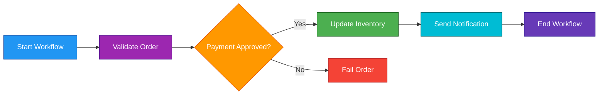
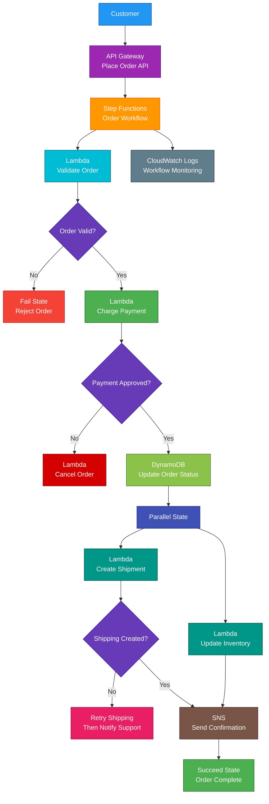

# AWS Step Functions

<details>
<summary>

## 1. Definition

</summary>

### Simple Definition

AWS Step Functions is a serverless workflow orchestration service.

It helps you coordinate multiple AWS services and application steps into a reliable workflow.

### Memory Hook

Step Functions = Serverless workflow coordinator.

### Basic Idea

A workflow is broken into steps.

Step Functions runs each step in order, handles decisions, retries failures, and tracks the workflow state.



### Key Point

Step Functions is used to orchestrate workflows.

It does not replace compute services like Lambda, ECS, Batch, or Glue.

It coordinates them.

</details>

<details>
<summary>

## 2. What Problem Does It Solve?

</summary>

### Main Problem

Step Functions solves the problem of coordinating multi-step processes reliably.

Instead of writing complex workflow logic inside one big Lambda function or application, you define each step clearly in a state machine.

### Without Step Functions

You may have problems such as:

- Complex nested code
- Hard-to-track workflow progress
- Manual retry logic
- Difficult error handling
- Hard-to-debug failures
- Long-running process limitations
- Poor visibility into each step
- Complex service coordination

### With Step Functions

AWS manages workflow state, step order, retries, branching, and execution history.

### Key Benefit

Step Functions makes complex workflows easier to build, monitor, retry, and troubleshoot.

</details>

<details>
<summary>

## 3. Core Use Cases

</summary>

### Order Processing

Use Step Functions to coordinate order workflows.

Example steps:

- Validate order
- Charge payment
- Update inventory
- Create shipment
- Send confirmation email

### Data Processing Pipelines

Use Step Functions to coordinate ETL or analytics workflows.

Example:

- Start Glue job
- Wait for job completion
- Run validation Lambda
- Store results in S3
- Notify data team

### Microservice Orchestration

Use Step Functions to coordinate multiple services in a microservices architecture.

Example:

One workflow calls payment service, inventory service, shipping service, and notification service.

### Human Approval Workflows

Use callback patterns for approval processes.

Example:

A workflow waits until a manager approves or rejects a request.

### Machine Learning Pipelines

Use Step Functions to coordinate ML workflows.

Example:

- Prepare data
- Train model
- Evaluate model
- Deploy model
- Notify team

### Serverless Application Workflows

Use Step Functions with Lambda, DynamoDB, SQS, SNS, EventBridge, and API Gateway.

Example:

API Gateway starts a Step Functions workflow that coordinates multiple Lambda functions.

### Batch Job Orchestration

Use Step Functions to coordinate AWS Batch, ECS tasks, Glue jobs, or long-running jobs.

</details>

<details>
<summary>

## 4. Important Features for SAA

</summary>

### State Machine

A state machine is the workflow definition.

It describes:

- Steps
- Order of execution
- Branching logic
- Retry behavior
- Error handling
- Inputs and outputs

### State

A state is one step in the workflow.

Each state performs one job or controls workflow flow.

### Amazon States Language

Amazon States Language, or ASL, is the JSON-based language used to define Step Functions workflows.

Example idea:

```json
{
  "StartAt": "ValidateOrder",
  "States": {
    "ValidateOrder": {
      "Type": "Task",
      "Resource": "arn:aws:lambda:region:account:function:ValidateOrder",
      "Next": "ChargePayment"
    }
  }
}
```

### Workflow Studio

Workflow Studio is a visual designer for building Step Functions workflows.

It helps create workflows using a drag-and-drop interface.

### Task State

A Task state performs work.

It can call services such as:

- Lambda
- ECS
- AWS Batch
- Glue
- SageMaker
- DynamoDB
- SNS
- SQS
- EventBridge
- API Gateway
- AWS SDK integrations

### Choice State

A Choice state adds branching logic.

Example:

If payment is approved, continue to shipping.

If payment fails, cancel the order.

### Parallel State

A Parallel state runs multiple branches at the same time.

Example:

After an order is placed, run fraud check and inventory check in parallel.

### Map State

A Map state runs the same steps for multiple items.

Example:

Process each image in a list of uploaded images.

### Distributed Map

Distributed Map is used for large-scale parallel processing.

It can process large datasets, often from S3, with high concurrency.

Use it for:

- Large file processing
- Batch item processing
- Data transformation
- Parallel workloads at scale

### Wait State

A Wait state pauses the workflow.

Use it when a process needs to wait before continuing.

Example:

Wait 10 minutes before checking job status again.

### Pass State

A Pass state passes input to output without doing work.

Use it for testing, shaping data, or adding placeholder steps.

### Succeed State

A Succeed state ends the workflow successfully.

### Fail State

A Fail state ends the workflow with failure.

### Standard Workflows

Standard Workflows are best for long-running, durable, auditable workflows.

Important points:

- Can run for up to 1 year
- Detailed execution history
- Exactly-once workflow execution model
- Good for business-critical workflows
- Billed by state transitions

### Express Workflows

Express Workflows are best for high-volume, short-duration workflows.

Important points:

- Designed for very high event rates
- Lower cost for high-volume short workflows
- Shorter maximum duration than Standard
- Execution history is sent to CloudWatch Logs
- Billed by number of requests, duration, and memory used

### Standard vs Express

| Feature | Standard Workflow | Express Workflow |
|---|---|---|
| Best for | Long-running critical workflows | High-volume short workflows |
| Max duration | Up to 1 year | Up to 5 minutes |
| Execution history | Built-in detailed history | CloudWatch Logs |
| Pricing | State transitions | Requests, duration, memory |
| Common use | Order processing, approvals | IoT ingestion, high-volume events |

### Service Integrations

Step Functions can call many AWS services directly.

This can reduce the need for Lambda glue code.

Examples:

- Put item in DynamoDB
- Send message to SQS
- Publish message to SNS
- Start ECS task
- Start Glue job
- Start SageMaker job

### Optimized Integrations

Optimized integrations are special Step Functions integrations built for common AWS service patterns.

They often provide simpler workflow integration than generic SDK calls.

### AWS SDK Integrations

AWS SDK integrations let Step Functions call many AWS service API actions directly.

This reduces custom code.

### Request Response Pattern

The workflow calls a service and immediately moves to the next step after receiving a response.

Example:

Call Lambda and continue after it returns.

### Run a Job Pattern

The workflow starts a job and waits for it to complete.

Common examples:

- AWS Batch job
- ECS task
- Glue job
- SageMaker training job

### Callback Pattern

The workflow pauses and waits for an external process to call back with a task token.

Use it for:

- Human approval
- External system processing
- Long-running third-party workflows

### Task Token

A task token is used in callback workflows.

The external system sends the token back to Step Functions to continue the workflow.

### Retry

Retry handles temporary failures.

Example:

If a Lambda function fails because of throttling, Step Functions can retry it with backoff.

### Catch

Catch handles errors and redirects workflow execution to another state.

Example:

If payment fails, go to a compensation step that cancels the order.

### Error Handling

Step Functions has built-in error handling.

Common tools:

- Retry
- Catch
- Fail state
- Choice state
- Timeout settings

### Input and Output Processing

Step Functions can control data passed between states.

Important fields:

| Field | Purpose |
|---|---|
| `InputPath` | Selects part of the input |
| `Parameters` | Shapes input sent to a task |
| `ResultPath` | Controls where task result is placed |
| `OutputPath` | Selects final output from a state |

### Execution

An execution is one run of a state machine.

Example:

Each customer order can start one workflow execution.

### Execution History

Standard Workflows store detailed execution history.

This helps with:

- Debugging
- Auditing
- Troubleshooting
- Understanding workflow progress

### Logging

Step Functions can log execution events to CloudWatch Logs.

This is especially important for Express Workflows.

### X-Ray Tracing

Step Functions can integrate with AWS X-Ray.

Use it to trace requests through distributed applications.

### EventBridge Integration

Step Functions can be started by EventBridge events.

Step Functions can also emit execution status changes to EventBridge.

### API Gateway Integration

API Gateway can start Step Functions workflows.

This is useful for synchronous or asynchronous API-driven workflows.

</details>

<details>
<summary>

## 5. Security Model

</summary>

### IAM Permissions

IAM controls who can create, update, delete, start, and manage Step Functions state machines.

Common permissions:

| Permission | Purpose |
|---|---|
| `states:CreateStateMachine` | Create state machine |
| `states:UpdateStateMachine` | Update state machine |
| `states:DeleteStateMachine` | Delete state machine |
| `states:StartExecution` | Start workflow execution |
| `states:StopExecution` | Stop workflow execution |
| `states:DescribeExecution` | View execution details |
| `states:GetExecutionHistory` | View execution history |

### Execution Role

A Step Functions state machine uses an IAM execution role.

This role gives Step Functions permission to call other AWS services.

Example:

If the workflow invokes Lambda and writes to DynamoDB, the execution role needs permissions for those actions.

### Least Privilege

Give the Step Functions execution role only the permissions it needs.

Bad example:

Giving the workflow `AdministratorAccess`.

Good example:

Allow only specific actions on specific resources.

### Service Permissions

Step Functions needs permission to call target services.

Examples:

| Target Service | Example Permission |
|---|---|
| Lambda | `lambda:InvokeFunction` |
| DynamoDB | `dynamodb:PutItem` |
| SQS | `sqs:SendMessage` |
| SNS | `sns:Publish` |
| ECS | `ecs:RunTask` |
| Glue | `glue:StartJobRun` |

### Resource Policies

Some target services also need resource-based permissions.

Example:

A Lambda function resource policy may need to allow Step Functions to invoke it in some cross-account patterns.

### Encryption at Rest

Step Functions encrypts workflow data at rest.

For stronger control, use customer managed KMS keys where supported.

### Encryption in Transit

Step Functions API calls use HTTPS.

Use TLS/HTTPS for service integrations and application communication.

### Sensitive Data

Be careful with sensitive data in workflow inputs and outputs.

Execution history and logs may contain workflow data.

Best practices:

- Do not pass secrets through workflow state
- Store secrets in Secrets Manager
- Pass references instead of sensitive values
- Limit access to execution history
- Protect CloudWatch Logs

### CloudWatch Logs Security

If logging workflow data, secure CloudWatch Logs.

Use:

- IAM least privilege
- Log retention policies
- KMS encryption where needed
- Avoid logging secrets

### VPC Access

Step Functions itself does not run inside your VPC like an EC2 instance.

To access private VPC resources, Step Functions usually calls services such as:

- Lambda in a VPC
- ECS tasks in private subnets
- Private APIs through supported patterns

### Cross-Account Access

Step Functions can support cross-account workflows using IAM roles and resource policies.

Use least privilege and trust policies carefully.

### Shared Responsibility

AWS is responsible for:

- Step Functions managed infrastructure
- Workflow orchestration service availability
- Managed scaling
- State transition service
- Physical security

You are responsible for:

- IAM execution role permissions
- State machine definition
- Input and output data handling
- Logging settings
- KMS key policies
- Error handling design
- Target service security
- Sensitive data protection
- Monitoring and alarms

</details>

<details>
<summary>

## 6. High Availability / Durability Behavior

</summary>

### Availability

Step Functions is a managed serverless service.

AWS manages workflow orchestration infrastructure, scaling, and availability.

### Regional Service

Step Functions state machines are regional.

A state machine is created in a specific AWS Region.

### Multi-AZ Behavior

Step Functions is managed by AWS across regional infrastructure.

You do not configure Multi-AZ manually.

### Durable Workflow State

Step Functions stores workflow state so it can continue after failures.

This is one major benefit over writing all workflow logic inside a single application process.

### Standard Workflow Durability

Standard Workflows are designed for durable, long-running workflows.

They keep detailed execution history and can run for up to 1 year.

### Express Workflow Durability

Express Workflows are designed for high-volume, short-duration processing.

They are better for fast event processing than long-running business workflows.

### Retry for Fault Tolerance

Use Retry to handle temporary failures.

Examples:

- Lambda throttling
- Temporary service error
- Network issue
- Rate limit exceeded

### Catch for Controlled Failure

Use Catch to route errors to recovery or cleanup steps.

Example:

If payment succeeds but shipping fails, run a compensation step.

### Timeout

Timeouts prevent tasks from waiting forever.

Use timeouts for:

- External services
- Callback tasks
- Long-running jobs
- Human approvals

### Heartbeat

Heartbeats help Step Functions know that a long-running task is still alive.

If a heartbeat is missed, Step Functions can fail the task and trigger error handling.

### Multi-Region Behavior

Step Functions does not automatically run one workflow across multiple Regions.

For Multi-Region applications, deploy state machines in multiple Regions and use services such as:

- Route 53
- EventBridge
- DynamoDB Global Tables
- S3 replication
- Application-level failover

### Important Exam Point

Step Functions improves workflow reliability by managing state, retries, errors, and execution tracking, but you still need to design target services for high availability.

</details>

<details>
<summary>

## 7. Cost Optimization Options

</summary>

### Choose Standard or Express Correctly

Pick the workflow type based on workload pattern.

| Workload Pattern | Better Choice |
|---|---|
| Long-running business workflow | Standard |
| High-volume short workflow | Express |
| Need detailed execution history | Standard |
| Millions of short events | Express |

### Reduce Unnecessary State Transitions

Standard Workflows are billed by state transitions.

Fewer unnecessary states can reduce cost.

### Use Direct Service Integrations

Use direct AWS service integrations instead of Lambda when no custom code is needed.

Example:

Use Step Functions to write directly to DynamoDB instead of invoking Lambda just to call DynamoDB.

### Avoid Long Idle Waits in Express

Express Workflows are billed partly by duration.

For long waits, Standard Workflows may be better.

### Use Map Carefully

Map and Distributed Map can process many items.

This is powerful but can create cost if used on huge datasets without filtering.

### Filter Data Before Processing

Process only required items.

Use:

- Input filtering
- S3 prefixes
- EventBridge filtering
- Choice states
- Map item selectors

### Avoid Passing Large Payloads

Large workflow payloads can increase complexity and cost.

Better pattern:

Store large data in S3 and pass the S3 object reference through the workflow.

### Set Log Level Carefully

CloudWatch Logs can add cost.

Log only what is needed.

Avoid logging full input and output if they contain large or sensitive data.

### Use Express for High-Volume Events

For high-volume short event processing, Express can be more cost-effective than Standard.

### Monitor Workflow Metrics

Use CloudWatch to monitor:

- Executions started
- Executions failed
- Execution duration
- State transitions
- Throttling
- Lambda errors
- Service integration failures

</details>

<details>
<summary>

## 8. Common Exam Traps

</summary>

### Step Functions vs Lambda

Step Functions coordinates workflows.

Lambda runs code.

Use Step Functions when you need multiple steps, retries, branching, or state tracking.

### Do Not Put Long Workflows in One Lambda

Lambda has a maximum runtime limit.

For long-running or multi-step processes, use Step Functions to coordinate smaller tasks.

### Standard vs Express

This is a major exam trap.

| Requirement | Choose |
|---|---|
| Long-running workflow up to 1 year | Standard |
| Detailed execution history | Standard |
| High-volume short-duration events | Express |
| Millions of quick workflow executions | Express |

### Step Functions Is Not a Queue

Step Functions orchestrates workflows.

If you need message buffering between producers and consumers, use SQS.

### Step Functions Is Not EventBridge

EventBridge routes events.

Step Functions coordinates multi-step workflows.

They are often used together.

### Step Functions Is Not SNS

SNS fans out messages to subscribers.

Step Functions coordinates ordered workflow steps.

### Step Functions Is Not a Database

Step Functions stores workflow state, not business data.

Store durable application data in services like:

- DynamoDB
- RDS
- Aurora
- S3

### Use Retry and Catch

If the exam mentions error handling, retries, fallback paths, or compensation logic, Step Functions is often the answer.

### Callback Pattern for Human Approval

If a workflow must wait for an external approval or third-party callback, use callback with task token.

### Run a Job Pattern for Long Jobs

If Step Functions starts a Batch, ECS, Glue, or SageMaker job and waits for completion, use the run-a-job integration pattern.

### Large Payload Trap

Do not pass huge files or large datasets directly through Step Functions.

Store large data in S3 and pass a reference.

### Step Functions Does Not Automatically Fix Target Failures

Step Functions can retry and catch errors, but the target services must still be designed correctly.

### Express Has Shorter Execution Duration

Do not choose Express for workflows that may run for hours or days.

Use Standard.

</details>

<details>
<summary>

## 9. Compare With Similar Services

</summary>

### Service Comparison Table

| Service | Main Purpose | Best For | Choose When |
|---|---|---|---|
| Step Functions | Workflow orchestration | Multi-step processes with state, retries, and branching | You need to coordinate services reliably |
| Lambda | Serverless compute | Running code in response to events | You need short code execution |
| EventBridge | Event routing | Connecting event sources to targets | You need event bus routing and filtering |
| SQS | Message queue | Decoupling producers and consumers | You need reliable buffering |
| SNS | Pub/sub messaging | Fanout notifications | One message should notify many subscribers |
| SWF | Older workflow service | Legacy custom workflow coordination | You need legacy workflow patterns |
| Managed Workflows for Apache Airflow | Data workflow orchestration | Apache Airflow DAGs | You need Airflow-based pipelines |

### Step Functions vs Lambda

| Feature | Step Functions | Lambda |
|---|---|---|
| Main purpose | Coordinate workflow steps | Run code |
| State tracking | Yes | No built-in workflow state |
| Branching | Built-in | Must code manually |
| Retries | Built-in | Basic retries depending on invocation type |
| Long workflows | Yes, Standard up to 1 year | No, max runtime limit |
| Best for | Orchestration | Compute task |

### Step Functions vs EventBridge

| Feature | Step Functions | EventBridge |
|---|---|---|
| Main purpose | Workflow orchestration | Event routing |
| State management | Yes | No |
| Branching workflow logic | Yes | Rule-based routing |
| Best for | Multi-step process | Event-driven integration |
| Common use together | EventBridge starts workflow | Step Functions runs process |

### Step Functions vs SQS

| Feature | Step Functions | SQS |
|---|---|---|
| Main purpose | Orchestrate steps | Queue messages |
| Processing order | Defined workflow order | Consumer-driven queue processing |
| State tracking | Yes | No workflow state |
| Best for | Business process workflow | Decoupled async processing |
| Common use together | Step sends/receives messages | SQS buffers work |

### Step Functions vs SNS

| Feature | Step Functions | SNS |
|---|---|---|
| Main purpose | Workflow coordination | Pub/sub fanout |
| Multiple subscribers | Not the main purpose | Yes |
| State and retries | Workflow-level | Delivery-level |
| Best for | Multi-step workflows | Notifications and fanout |

### Step Functions vs AWS Batch

| Feature | Step Functions | AWS Batch |
|---|---|---|
| Main purpose | Orchestrate workflows | Run batch compute jobs |
| Runs compute directly | No | Yes |
| Best for | Coordinate steps and services | Execute batch workloads |
| Common use together | Starts and waits for Batch jobs | Runs the job |

### Step Functions vs MWAA

| Feature | Step Functions | Managed Workflows for Apache Airflow |
|---|---|---|
| Main purpose | Serverless AWS-native workflows | Managed Apache Airflow |
| Best for | AWS service orchestration | Airflow DAG-based data pipelines |
| Infrastructure | Serverless | Managed Airflow environment |
| Exam clue | AWS service workflow with states | Existing Airflow workflows |

### When to Choose Step Functions

Choose Step Functions when:

- You need multi-step workflow orchestration
- You need retries and error handling
- You need branching decisions
- You need parallel processing
- You need long-running workflows
- You need human approval or callback workflows
- You need to coordinate Lambda, ECS, Batch, Glue, DynamoDB, SNS, SQS, or other AWS services
- You need visual workflow tracking and execution history

</details>

<details>
<summary>

## 10. Mini Architecture Example

</summary>

### Scenario

A company has an online order system.

When a customer places an order, the system must validate the order, charge payment, update inventory, arrange shipping, and send a confirmation email.

If payment fails, the order should be cancelled.

If shipping fails, the system should retry and then notify support.

### Architecture

Use API Gateway to receive order requests.

API Gateway starts a Step Functions Standard Workflow.

Step Functions coordinates Lambda functions, DynamoDB, payment processing, shipping, and SNS notifications.



### Why This Is Good

- Step Functions coordinates the full order workflow
- Each step is visible and trackable
- Choice states handle business decisions
- Parallel state runs inventory and shipping work together
- Retry handles temporary shipping failures
- Catch/failure paths can handle errors cleanly
- DynamoDB stores durable order state
- SNS sends notifications
- CloudWatch provides logs and monitoring
- Standard Workflow is good for auditable business workflows

### Exam Answer Pattern

If the question says:

“Coordinate a multi-step serverless workflow with retries, branching, and error handling.”

Think:

AWS Step Functions.

If the question says:

“Run code for one event or task.”

Think:

AWS Lambda.

If the question says:

“Route events from applications or SaaS services to targets.”

Think:

Amazon EventBridge.

If the question says:

“Buffer messages between producers and consumers.”

Think:

Amazon SQS.

### Final Memory Hook

Step Functions = Workflow orchestration.

State machine = Workflow definition.

State = One workflow step.

Task = Does work.

Choice = Branching logic.

Parallel = Run branches at same time.

Map = Repeat for each item.

Wait = Pause workflow.

Retry = Try again after failure.

Catch = Handle failure path.

Standard = Long-running and auditable.

Express = High-volume and short-running.

Task token = Callback pattern.

EventBridge = Event routing.

Lambda = Runs code.

SQS = Queue.

SNS = Fanout.

</details>