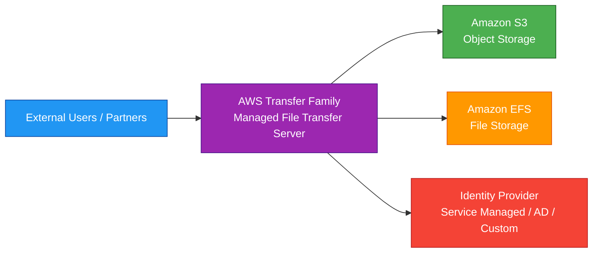
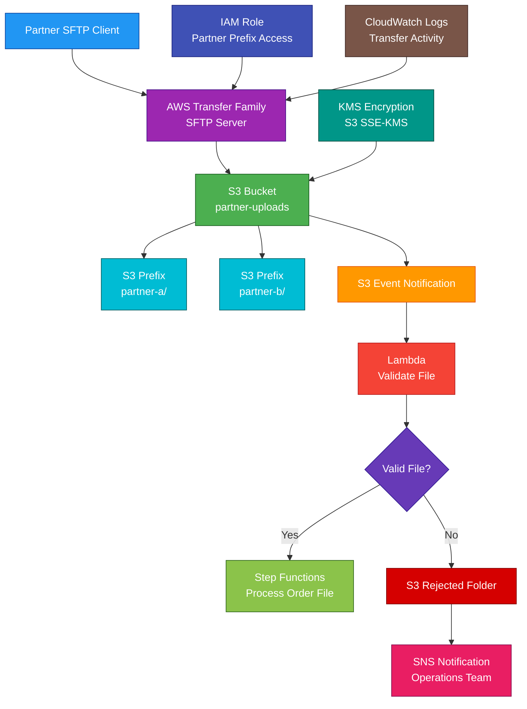

# AWS Transfer Family

<details>
<summary>

## 1. Definition

</summary>

### Simple Definition

AWS Transfer Family is a managed file transfer service.

It lets users and applications transfer files into and out of AWS storage using common file transfer protocols.

### Memory Hook

Transfer Family = Managed SFTP, FTPS, FTP, and AS2 access to AWS storage.

### Basic Idea

Instead of running your own file transfer servers, AWS manages the server for you.

Users connect using familiar protocols, and files are stored in AWS services like S3 or EFS.



### Supported Protocols

AWS Transfer Family supports managed file transfer using:

| Protocol | Common Use |
|---|---|
| SFTP | Secure file transfer over SSH |
| FTPS | FTP over TLS |
| FTP | Legacy file transfer |
| AS2 | Business-to-business document exchange |

</details>

<details>
<summary>

## 2. What Problem Does It Solve?

</summary>

### Main Problem

AWS Transfer Family solves the problem of moving files securely into and out of AWS without managing file transfer servers yourself.

### Without AWS Transfer Family

You may need to manage:

- SFTP servers
- FTP servers
- FTPS certificates
- Server patching
- Scaling
- High availability
- Storage integration
- User authentication
- Logging
- Network security
- Partner file exchange workflows

### With AWS Transfer Family

AWS manages the file transfer server infrastructure.

You manage:

- Users
- Storage location
- IAM permissions
- Authentication method
- Network access
- Logging
- Security policies

### Key Benefit

AWS Transfer Family lets existing file transfer clients and partner workflows use AWS storage with minimal application changes.

</details>

<details>
<summary>

## 3. Core Use Cases

</summary>

### SFTP Access to S3

Use Transfer Family when external users need to upload or download files from S3 using SFTP.

Example:

A partner uploads daily sales reports through SFTP, and the files land in an S3 bucket.

### Partner File Exchange

Use Transfer Family for business-to-business file exchange.

Examples:

- Vendor reports
- Payment files
- Insurance documents
- Healthcare documents
- Supply chain files

### Legacy Application Migration

Use Transfer Family when legacy systems already use SFTP, FTPS, FTP, or AS2.

This allows migration to AWS storage without rewriting the file transfer client.

### Secure File Uploads

Use SFTP or FTPS for secure file transfers from customers, vendors, or internal systems.

### Managed File Transfer to EFS

Use Transfer Family with EFS when applications need file-system-style storage instead of S3 object storage.

Example:

Uploaded files need to be accessed by EC2 or containers through an NFS-mounted EFS file system.

### AS2 Business Document Exchange

Use AS2 for secure and reliable business document exchange with trading partners.

Common examples:

- EDI files
- Purchase orders
- Invoices
- Shipping notices

### Automated Processing Pipeline

Use S3 event notifications, EventBridge, Lambda, SQS, or Step Functions after files arrive.

Example:

File uploaded through SFTP → S3 event → Lambda validates file → Step Functions starts workflow.

</details>

<details>
<summary>

## 4. Important Features for SAA

</summary>

### Managed File Transfer Server

A Transfer Family server is the managed endpoint users connect to.

You choose:

- Protocols
- Identity provider
- Storage backend
- Endpoint type
- Logging
- Security policy
- Host keys or certificates

### Storage Backends

Transfer Family can store files in:

| Storage Backend | Best For |
|---|---|
| Amazon S3 | Object storage, data lakes, partner uploads, event-driven workflows |
| Amazon EFS | Shared Linux file system access, POSIX permissions, file-based apps |

### SFTP

SFTP means SSH File Transfer Protocol.

Important points:

- Uses SSH
- Secure by default
- Common for partner and legacy transfers
- Usually uses port `22`
- Supports SSH keys and password-based authentication depending on identity provider

### FTPS

FTPS means FTP over TLS.

Important points:

- Uses TLS encryption
- Requires certificates
- Common for legacy secure FTP workflows
- Different from SFTP

### FTP

FTP is a legacy protocol.

Important point:

FTP is not encrypted by default.

Use FTP only when required by legacy systems and when network controls make it acceptable.

### AS2

AS2 means Applicability Statement 2.

It is commonly used for secure business-to-business document exchange.

Important features:

- Signed messages
- Encrypted messages
- Message Disposition Notifications
- Common in EDI workflows

### Endpoint Types

Transfer Family endpoints can be configured based on access needs.

Common endpoint options include:

| Endpoint Type | Best For |
|---|---|
| Public endpoint | Internet-facing partner access |
| VPC endpoint | Private access inside a VPC |
| VPC internet-facing endpoint | VPC-hosted endpoint with internet access using Elastic IPs |

### Custom Hostname

You can use a custom domain name for the Transfer Family server.

Example:

`sftp.example.com`

Common DNS service:

- Amazon Route 53

### Identity Providers

Transfer Family supports different identity provider options.

| Identity Provider | Best For |
|---|---|
| Service managed users | Simple SFTP user management |
| AWS Directory Service | Active Directory-based users |
| Custom identity provider | External auth through API Gateway and Lambda |
| IAM Identity Center, where supported | Centralized workforce identity integration |

### Service Managed Users

Service managed users are created directly in Transfer Family.

This is simple and common for SFTP-only use cases.

### Custom Identity Provider

A custom identity provider lets you authenticate users using your own system.

Common pattern:

Transfer Family → API Gateway → Lambda → external identity store

Use it when users are stored in:

- Corporate identity system
- Database
- Partner portal
- Custom user directory

### Logical Directories

Logical directories let you control what users see when they log in.

Example:

A user sees `/reports`, but it maps to `s3://company-bucket/partners/vendor-a/reports/`.

### Home Directory

A home directory defines the starting location for a user after login.

Example:

User `partner-a` starts in:

```text
s3://company-transfer-bucket/partner-a/
```

### IAM Role for User Access

Transfer Family uses IAM roles to access S3 or EFS on behalf of users.

Important point:

IAM permissions define what files users can read, write, list, or delete.

### Session Policy

Session policies can further restrict access for a user session.

Use them to limit each user to their own folder or prefix.

### S3 Prefix Isolation

For S3-backed servers, users are commonly isolated by prefixes.

Example:

```text
s3://transfer-bucket/vendor-a/
s3://transfer-bucket/vendor-b/
```

Vendor A should not access Vendor B’s prefix.

### EFS POSIX Permissions

For EFS-backed servers, file access depends on POSIX user, group, and permissions.

Use EFS when applications need file-system semantics.

### Logging

Transfer Family can log activity to CloudWatch Logs.

Logs help with:

- Authentication troubleshooting
- Upload/download tracking
- Security monitoring
- Operational auditing

### Workflows

Transfer Family managed workflows can run file processing steps after file upload.

Examples:

- Copy file
- Tag file
- Delete file
- Run Lambda
- Custom processing

### Post-Upload Processing

Common post-upload pattern:

1. Partner uploads file.
2. File lands in S3.
3. Event triggers validation.
4. Lambda or Step Functions processes file.
5. File is moved to processed or rejected folder.

</details>

<details>
<summary>

## 5. Security Model

</summary>

### IAM Permissions

IAM controls who can create and manage Transfer Family resources.

Common permissions:

| Permission | Purpose |
|---|---|
| `transfer:CreateServer` | Create Transfer Family server |
| `transfer:CreateUser` | Create service-managed user |
| `transfer:UpdateServer` | Modify server configuration |
| `transfer:StartServer` | Start server |
| `transfer:StopServer` | Stop server |
| `transfer:DeleteServer` | Delete server |
| `transfer:DescribeServer` | View server details |

### User Access Permissions

Users access files through IAM roles assigned to them.

For S3, permissions may include:

| Permission | Purpose |
|---|---|
| `s3:ListBucket` | List bucket or prefix |
| `s3:GetObject` | Download files |
| `s3:PutObject` | Upload files |
| `s3:DeleteObject` | Delete files |

### Least Privilege

Give each user access only to the required bucket, prefix, or EFS path.

Example:

Vendor A should access only:

```text
s3://transfer-bucket/vendor-a/*
```

### Authentication

Authentication depends on identity provider type.

Common options:

- SSH keys for SFTP
- Passwords through identity provider
- Active Directory authentication
- Custom authentication through Lambda/API Gateway
- Certificates for FTPS and AS2 use cases

### Encryption in Transit

Transfer Family supports secure protocols.

| Protocol | Encryption |
|---|---|
| SFTP | Encrypted using SSH |
| FTPS | Encrypted using TLS |
| FTP | Not encrypted by default |
| AS2 | Supports message encryption and signing |

### Encryption at Rest

Files are stored in S3 or EFS, so encryption depends on the backend.

Common options:

- S3 SSE-S3
- S3 SSE-KMS
- EFS encryption at rest
- KMS customer managed keys

### KMS Permissions

If using SSE-KMS for S3 or KMS-encrypted EFS, make sure the Transfer Family access role has correct KMS permissions.

Missing KMS permissions can cause upload or download failures.

### Network Security

Endpoint type controls network exposure.

For stronger security, use:

- VPC endpoints
- Security groups
- IP allow lists where appropriate
- Private connectivity through VPN or Direct Connect
- Public endpoint only when external access is required

### FTPS Certificates

FTPS requires a TLS certificate.

Use AWS Certificate Manager where supported for certificate management.

### Host Keys

SFTP servers use host keys so clients can verify server identity.

Protect and manage host keys carefully to avoid trust problems with clients.

### Logging and Auditing

Use CloudWatch Logs and CloudTrail.

| Service | Purpose |
|---|---|
| CloudWatch Logs | User connection and file transfer activity |
| CloudTrail | API activity for server/user configuration changes |

### Shared Responsibility

AWS is responsible for:

- Managed file transfer server infrastructure
- Service availability
- Protocol endpoint infrastructure
- Managed scaling
- Physical security

You are responsible for:

- User authentication setup
- IAM roles and policies
- S3 or EFS permissions
- KMS key policies
- Endpoint exposure
- Logging configuration
- Protocol choice
- File processing logic
- Partner access governance

</details>

<details>
<summary>

## 6. High Availability / Durability Behavior

</summary>

### Availability

AWS Transfer Family is a managed service.

AWS manages the file transfer server infrastructure for availability.

### Regional Service

Transfer Family servers are created in a specific AWS Region.

The storage backend is also regional.

### Multi-AZ Behavior

AWS manages availability for the Transfer Family endpoint.

You do not manage file transfer servers or configure server clustering manually.

### Storage Durability

Durability depends on the storage backend.

| Backend | Durability Behavior |
|---|---|
| S3 | Highly durable regional object storage |
| EFS Regional | Multi-AZ shared file storage |
| EFS One Zone | Single-AZ file storage with lower resilience |

### S3 Backend

When files are stored in S3, they benefit from S3 durability.

For SAA, remember:

S3 is designed for 11 9s of durability.

### EFS Backend

When files are stored in EFS, durability depends on the EFS deployment type.

Regional EFS is more resilient than One Zone EFS.

### Multi-Region Behavior

Transfer Family is not automatically Multi-Region.

For Multi-Region designs, use:

- Separate Transfer Family servers in multiple Regions
- S3 Cross-Region Replication
- EFS replication where appropriate
- Route 53 DNS failover
- Partner-side failover configuration

### Failure Handling

For reliable file processing, combine Transfer Family with event-driven services.

Examples:

- S3 Event Notifications
- EventBridge
- Lambda
- Step Functions
- SQS dead-letter queues

### Important Exam Point

Transfer Family handles managed file transfer availability, but file durability comes from S3 or EFS.

</details>

<details>
<summary>

## 7. Cost Optimization Options

</summary>

### Choose the Right Storage Backend

Use the backend that matches the workload.

| Need | Better Choice |
|---|---|
| Object storage and event-driven processing | S3 |
| Shared file system access | EFS |
| Lowest-cost long-term storage | S3 with lifecycle policies |

### Use S3 Lifecycle Policies

For S3-backed transfers, use lifecycle rules to move old files to cheaper storage classes.

Examples:

- S3 Standard-IA
- S3 Glacier Instant Retrieval
- S3 Glacier Flexible Retrieval
- S3 Glacier Deep Archive

### Stop Unused Servers

Transfer Family servers can create hourly charges.

Stop or delete unused development, test, or retired servers.

### Avoid Unnecessary Protocols

Enable only the protocols you need.

This reduces complexity and lowers security risk.

### Use Workflows Carefully

Managed workflows and Lambda processing can add cost.

Use them when automated processing is valuable.

### Clean Up Old Files

Delete or archive old transfer files.

This reduces storage cost in S3 or EFS.

### Use EFS Lifecycle Management

For EFS-backed servers, use EFS lifecycle policies to move infrequently accessed files to lower-cost storage classes.

### Use CloudWatch Log Retention

Transfer logs can grow over time.

Set CloudWatch Logs retention periods.

### Use S3 Instead of EFS When Object Storage Fits

S3 is often more cost-effective for partner file drops, archives, and event-driven processing.

Use EFS only when file system semantics are required.

### Use Custom Identity Provider Only When Needed

A custom identity provider can add API Gateway and Lambda cost.

Use service-managed users or directory integration when they meet requirements.

</details>

<details>
<summary>

## 8. Common Exam Traps

</summary>

### Transfer Family vs DataSync

Transfer Family provides managed file transfer endpoints for users and partners.

DataSync moves data between storage systems.

| Requirement | Choose |
|---|---|
| Users connect with SFTP/FTPS/FTP/AS2 | Transfer Family |
| Move or sync large datasets between locations | DataSync |

### Transfer Family vs Storage Gateway

Storage Gateway provides ongoing hybrid storage access for on-premises applications.

Transfer Family provides managed file transfer endpoints.

### Transfer Family vs S3 Direct Upload

If applications can use S3 APIs directly, they may not need Transfer Family.

Use Transfer Family when clients require protocols like SFTP, FTPS, FTP, or AS2.

### SFTP Is Not FTP

SFTP uses SSH.

FTPS uses FTP over TLS.

FTP is legacy and not encrypted by default.

### FTP Is Not Secure by Default

If secure transfer is required, choose SFTP, FTPS, or AS2 rather than plain FTP.

### Storage Backend Matters

Transfer Family itself is not the final data store.

Files are stored in S3 or EFS.

### IAM Role Controls Storage Access

For S3-backed transfers, IAM policies control what the user can access.

Bad IAM policy design can expose too much data.

### EFS Uses POSIX Permissions

For EFS-backed transfers, POSIX permissions matter.

IAM alone may not be enough to explain access behavior.

### KMS Permissions Can Break Transfers

If storage uses customer managed KMS keys, the Transfer Family role needs KMS permissions.

### Public Endpoint Is Not Always Best

If file transfers are private between networks, use VPC endpoint options, VPN, or Direct Connect where appropriate.

### Transfer Family Is Not a CDN

Transfer Family is for file transfer protocols.

For global content delivery, use CloudFront.

### AS2 Is for B2B Document Exchange

If the question mentions EDI, trading partners, signed/encrypted business documents, or MDNs, think AS2.

</details>

<details>
<summary>

## 9. Compare With Similar Services

</summary>

### Service Comparison Table

| Service | Main Purpose | Best For | Choose When |
|---|---|---|---|
| AWS Transfer Family | Managed file transfer endpoint | SFTP, FTPS, FTP, AS2 access to AWS storage | Partners or legacy apps need file transfer protocols |
| AWS DataSync | Data movement and sync | Migrations and scheduled transfers | You need to move data between storage systems |
| AWS Storage Gateway | Hybrid storage access | On-premises apps using AWS-backed storage | You need ongoing hybrid NFS/SMB/iSCSI/tape access |
| Amazon S3 | Object storage | Files, backups, logs, data lakes | Applications can use S3 APIs directly |
| Amazon EFS | Shared file storage | Linux NFS shared file systems | Multiple compute resources need shared file access |
| AWS Direct Connect | Private network connection | Hybrid connectivity | You need predictable private network connectivity |

### Transfer Family vs DataSync

| Feature | Transfer Family | DataSync |
|---|---|---|
| Main purpose | File transfer endpoint | Data transfer automation |
| User access | Users/partners connect directly | Agent/service moves data |
| Protocols | SFTP, FTPS, FTP, AS2 | NFS, SMB, HDFS, S3, object/file stores |
| Best for | Partner uploads/downloads | Migration and scheduled sync |
| Exam clue | SFTP server replacement | Move large datasets to AWS |

### Transfer Family vs Storage Gateway

| Feature | Transfer Family | Storage Gateway |
|---|---|---|
| Main purpose | Managed transfer server | Hybrid storage gateway |
| Access style | File transfer clients | On-prem apps mount/use gateway |
| Common protocols | SFTP, FTPS, FTP, AS2 | NFS, SMB, iSCSI, tape |
| Best for | Partner file exchange | Ongoing hybrid storage access |

### Transfer Family vs S3

| Feature | Transfer Family | S3 |
|---|---|---|
| Main purpose | Protocol-based file transfer | Object storage |
| Access method | SFTP/FTPS/FTP/AS2 | S3 API, SDK, CLI |
| Storage | Uses S3 or EFS backend | Stores objects directly |
| Best for | Legacy or partner protocol access | Native cloud object storage |

### Transfer Family vs EFS

| Feature | Transfer Family | EFS |
|---|---|---|
| Main purpose | File transfer service | Shared file system |
| Protocols | SFTP, FTPS, FTP, AS2 | NFS |
| Storage role | Front-end transfer endpoint | Backend file storage |
| Common use together | Transfer files into EFS | EC2/ECS/EKS access same files |

### Transfer Family vs Direct Connect

| Feature | Transfer Family | Direct Connect |
|---|---|---|
| Main purpose | File transfer endpoint | Private network connection |
| Solves | Protocol-based file exchange | Hybrid network connectivity |
| Common use together | Transfers over private path | Provides private network path |
| Exam clue | Need SFTP/AS2 to AWS storage | Need dedicated private connection |

### When to Choose AWS Transfer Family

Choose AWS Transfer Family when:

- Users need SFTP, FTPS, FTP, or AS2 access
- You want managed file transfer servers
- Partners need to upload files to S3
- Legacy systems cannot use S3 APIs directly
- You need B2B document exchange with AS2
- You need file transfers backed by S3 or EFS
- You want to avoid managing SFTP/FTP server infrastructure
- You need custom authentication or directory-based authentication

</details>

<details>
<summary>

## 10. Mini Architecture Example

</summary>

### Scenario

A company receives daily order files from external partners.

Partners currently use SFTP and cannot change their client software.

The company wants files stored in S3 and automatically processed after upload.

### Architecture

Create an AWS Transfer Family SFTP server backed by Amazon S3.

Each partner is mapped to a separate S3 prefix.

After upload, S3 events trigger a Lambda function to validate the file.

Valid files start a Step Functions workflow for processing.

Invalid files are moved to a rejected folder and notify the operations team.



### Why This Is Good

- Partners keep using familiar SFTP clients
- AWS manages the SFTP server infrastructure
- S3 stores uploaded files durably
- Each partner is isolated to its own S3 prefix
- IAM roles and policies control storage access
- KMS protects files at rest
- CloudWatch Logs tracks transfer activity
- Lambda validates uploaded files
- Step Functions coordinates processing
- SNS notifies operations when files fail validation

### Exam Answer Pattern

If the question says:

“Provide managed SFTP access for partners to upload files into S3.”

Think:

AWS Transfer Family.

If the question says:

“Move large datasets from on-premises storage to AWS on a schedule.”

Think:

AWS DataSync.

If the question says:

“On-premises applications need ongoing NFS or SMB access to AWS-backed storage.”

Think:

AWS Storage Gateway.

If the question says:

“Applications can upload files directly using AWS SDKs.”

Think:

Amazon S3 direct upload.

### Final Memory Hook

Transfer Family = Managed file transfer.

SFTP = Secure SSH file transfer.

FTPS = FTP over TLS.

FTP = Legacy, not encrypted by default.

AS2 = B2B document exchange.

S3 backend = Object storage.

EFS backend = File storage.

IAM role = Controls storage access.

Logical directory = Controls user view.

CloudWatch Logs = Transfer activity.

DataSync = Data movement.

Storage Gateway = Hybrid storage access.

</details>