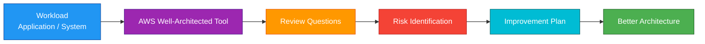
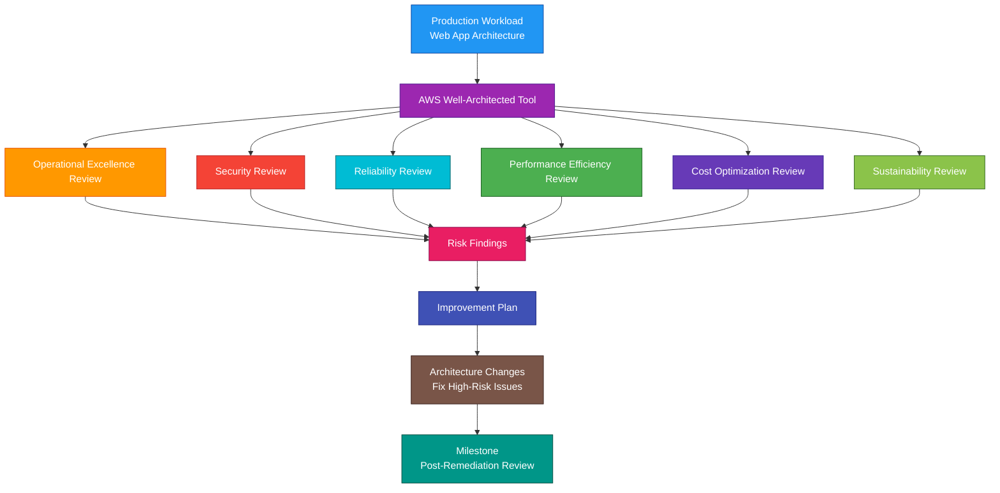

# AWS Well-Architected Tool

## 1. Definition

### Simple Definition

AWS Well-Architected Tool is a free AWS service that helps you review workloads against AWS best practices.

It guides you through questions based on the AWS Well-Architected Framework and gives recommendations for improvement.

### Memory Hook

Well-Architected Tool = AWS architecture review checklist.

### Basic Idea

You define a workload, answer review questions, and AWS gives you an improvement plan.

### Key Point

The Well-Architected Tool does not automatically fix your architecture.

It helps you identify risks and gives best-practice recommendations.

## 2. What Problem Does It Solve?

### Main Problem

The Well-Architected Tool solves the problem of reviewing cloud architectures consistently.

It helps teams find weaknesses before they become outages, security issues, performance problems, or cost problems.

### Without the Well-Architected Tool

Teams may miss important questions such as:

- Is the workload secure?
- Is the workload reliable?
- Is the workload cost-optimized?
- Can the workload recover from failure?
- Are operations automated?
- Are resources right-sized?
- Are sustainability practices considered?

### With the Well-Architected Tool

You get a structured review process based on AWS best practices.

### Key Benefit

It helps improve cloud architecture quality using an AWS-guided review process.

## 3. Core Use Cases

### Architecture Reviews

Use the Well-Architected Tool to review an application or system architecture.

Example:

Review a production e-commerce application before a major launch.

### Identify High-Risk Issues

The tool identifies risks in your workload.

Examples:

- No backups
- Single-AZ deployment
- Overly permissive IAM policies
- No monitoring
- No disaster recovery plan
- Unoptimized compute cost

### Create Improvement Plans

The tool creates an improvement plan based on review answers.

This helps teams prioritize remediation work.

### Track Architecture Changes

Use milestones to track workload reviews over time.

Example:

Take a milestone before and after fixing high-risk issues.

### Compare Against Best Practices

Use the tool to compare your workload against AWS Well-Architected Framework pillars.

### Team Review Sessions

Use it during architecture review meetings.

Common participants:

- Cloud architects
- Developers
- Security engineers
- Operations teams
- Product owners
- Business stakeholders

### Prepare for Production

Use the tool before moving a workload to production.

It helps identify risks before real users are affected.

## 4. Important Features for SAA

### Workload

A workload is the application, system, or service you want to review.

Examples:

- Web application
- Data processing pipeline
- Mobile backend
- E-commerce platform
- API service
- Analytics platform

### Well-Architected Framework

The AWS Well-Architected Framework is a set of best practices for designing and operating workloads in AWS.

The tool uses this framework to guide reviews.

### Six Pillars

The framework has six main pillars.

| Pillar | Focus |
|---|---|
| Operational Excellence | Run and improve systems effectively |
| Security | Protect data, systems, and assets |
| Reliability | Recover from failures and meet availability needs |
| Performance Efficiency | Use resources efficiently |
| Cost Optimization | Avoid unnecessary cost |
| Sustainability | Reduce environmental impact |

### Operational Excellence Pillar

Focuses on running workloads effectively.

Important ideas:

- Use infrastructure as code
- Automate operations
- Monitor workload health
- Learn from failures
- Make frequent small improvements
- Document operational procedures

### Security Pillar

Focuses on protecting workloads and data.

Important ideas:

- Use least privilege
- Enable logging and monitoring
- Encrypt data at rest and in transit
- Protect credentials
- Use identity federation
- Automate security checks
- Respond to security events

### Reliability Pillar

Focuses on workload recovery and availability.

Important ideas:

- Use Multi-AZ architecture
- Design for failure
- Use backups
- Test disaster recovery
- Use health checks
- Automatically recover from failure
- Manage service quotas

### Performance Efficiency Pillar

Focuses on choosing and using resources efficiently.

Important ideas:

- Choose the right compute, storage, and database services
- Use serverless where appropriate
- Monitor performance
- Scale based on demand
- Use caching and CDN services
- Review resource choices regularly

### Cost Optimization Pillar

Focuses on reducing waste and improving cost efficiency.

Important ideas:

- Right-size resources
- Use Savings Plans or Reserved Instances where appropriate
- Use Auto Scaling
- Delete unused resources
- Use storage lifecycle policies
- Monitor costs with Cost Explorer and Budgets

### Sustainability Pillar

Focuses on reducing environmental impact.

Important ideas:

- Avoid overprovisioning
- Use managed services where appropriate
- Scale down unused resources
- Optimize storage and compute usage
- Choose efficient architectures
- Reduce unnecessary data movement

### Lenses

A lens adds specialized questions for a specific workload type or industry.

Examples:

- Serverless applications
- SaaS workloads
- Machine learning workloads
- Data analytics workloads
- Financial services workloads

### Custom Lenses

Custom lenses allow organizations to create their own review questions and best practices.

Use them for internal standards or industry-specific requirements.

### Review Questions

The tool asks questions about your workload.

Your answers determine whether risks exist.

Example:

“Do you test your recovery procedures?”

### Risks

The tool identifies risks based on answers.

Common risk levels:

| Risk Level | Meaning |
|---|---|
| High Risk Issue | Important problem that should be prioritized |
| Medium Risk Issue | Improvement needed |
| No Risk | Best practice appears satisfied |
| Not Applicable | Question does not apply to workload |

### High-Risk Issue

A high-risk issue, or HRI, is a serious architecture concern.

Example:

A production database has no backups.

### Improvement Plan

The improvement plan lists recommended actions to reduce risk.

It helps prioritize architecture fixes.

### Milestone

A milestone captures the state of a workload review at a point in time.

Use milestones to track progress over time.

Example:

- Initial review
- Post-remediation review
- Pre-production review
- Quarterly review

### Workload Sharing

You can share workload reviews with other AWS accounts, users, or teams.

This supports collaboration across teams.

### Reports

The tool can generate reports showing review results and improvement recommendations.

These reports are useful for governance and architecture review documentation.

### Trusted Advisor Integration

Trusted Advisor checks can support architecture review by identifying account-level recommendations.

For exam purposes:

Trusted Advisor gives recommendations; Well-Architected Tool guides workload architecture review.

## 5. Security Model

### IAM Permissions

IAM controls who can create, view, update, share, and delete Well-Architected Tool workloads.

Common permissions:

| Permission | Purpose |
|---|---|
| `wellarchitected:CreateWorkload` | Create workload |
| `wellarchitected:GetWorkload` | View workload details |
| `wellarchitected:UpdateWorkload` | Modify workload |
| `wellarchitected:DeleteWorkload` | Delete workload |
| `wellarchitected:ListWorkloads` | List workloads |
| `wellarchitected:CreateMilestone` | Create milestone |
| `wellarchitected:CreateWorkloadShare` | Share workload |
| `wellarchitected:GetLensReview` | View lens review results |

### Least Privilege

Give users only the access they need.

Examples:

- Architects can create and update reviews
- Developers can view assigned workload reviews
- Security teams can review security-related answers
- Executives may only need reports

### Workload Sharing Security

Be careful when sharing workload reviews.

Workload reviews may contain sensitive architecture details such as:

- Application names
- Business criticality
- Architecture risks
- Operational weaknesses
- Security gaps
- Recovery weaknesses

### Sensitive Information

Avoid entering secrets or highly sensitive details into review notes.

Do not include:

- Passwords
- Access keys
- Private keys
- Sensitive customer data
- Internal secrets
- Confidential incident details

### Encryption

The Well-Architected Tool is a managed AWS service.

For related documentation or reports stored elsewhere, use encryption.

Examples:

- S3 encryption for exported reports
- KMS encryption for internal documents
- Access controls for shared files

### CloudTrail Auditing

AWS CloudTrail can record Well-Architected Tool API activity.

Use CloudTrail to audit:

- Workload creation
- Workload updates
- Workload sharing
- Milestone creation
- Review changes

### Shared Responsibility

AWS is responsible for:

- Well-Architected Tool managed service infrastructure
- Service availability
- Physical security
- Managed review platform

You are responsible for:

- IAM access controls
- Accurate review answers
- Protecting sensitive architecture details
- Sharing reviews safely
- Acting on recommendations
- Creating remediation plans
- Tracking improvement progress

## 6. High Availability / Durability Behavior

### Availability

The Well-Architected Tool is a managed AWS service.

AWS manages the service infrastructure.

### Regional Behavior

Workloads and reviews are created in AWS Regions.

For organization-wide review processes, make sure teams know where workload reviews are stored.

### Multi-AZ Behavior

You do not configure Multi-AZ for the Well-Architected Tool.

AWS manages the service availability.

### Durability of Reviews

The tool stores workload review data as part of the managed service.

For important governance processes, export or document review results when needed.

### Milestones for History

Milestones help preserve the state of a workload review at a point in time.

Use them to track architecture improvement over time.

### Not a Runtime Service

The Well-Architected Tool does not directly affect workload runtime availability.

It helps identify architecture risks that could affect availability.

### Reliability Review

The Reliability pillar helps evaluate whether your workload can recover from failures.

Important topics include:

- Multi-AZ design
- Backup strategy
- Disaster recovery
- Health checks
- Auto recovery
- Service quotas
- Change management

### Important Exam Point

The Well-Architected Tool improves architecture review quality, but it does not automatically make your workload highly available or durable.

You must implement the recommended changes.

## 7. Cost Optimization Options

### Free Tool

The AWS Well-Architected Tool itself is available at no additional charge.

The cost comes from implementing or operating AWS resources in your architecture.

### Use Cost Pillar Recommendations

The Cost Optimization pillar helps identify ways to reduce waste.

Common recommendations:

- Right-size resources
- Use Auto Scaling
- Use Savings Plans or Reserved Instances
- Delete unused resources
- Use lifecycle policies
- Monitor costs regularly
- Match storage class to access pattern

### Prioritize High-Impact Fixes

Do not try to fix every recommendation at once.

Prioritize:

- High-risk issues
- High-cost waste
- Security gaps
- Reliability risks
- Quick wins

### Combine With Cost Tools

Use the Well-Architected Tool with other AWS cost services.

| Service | Purpose |
|---|---|
| Cost Explorer | Analyze spending trends |
| AWS Budgets | Alert on cost thresholds |
| Trusted Advisor | Find cost-saving opportunities |
| Compute Optimizer | Right-size compute resources |
| Cost and Usage Reports | Detailed cost data |

### Avoid Over-Engineering

The tool helps identify best practices, but solutions should match business requirements.

Example:

Not every workload needs active-active Multi-Region architecture.

### Review Regularly

Run reviews regularly to catch cost drift.

Good review times:

- Before production launch
- After major architecture changes
- Quarterly for important workloads
- After incidents
- Before large expected traffic changes

### Track Improvements

Use milestones and improvement plans to track completed work.

This helps avoid repeated reviews finding the same unresolved cost issues.

### Use Sustainability Practices

Sustainability recommendations often overlap with cost optimization.

Examples:

- Reduce idle capacity
- Use managed services
- Scale down unused resources
- Optimize storage and compute

## 8. Common Exam Traps

### Well-Architected Tool vs Trusted Advisor

This is a common exam trap.

| Requirement | Choose |
|---|---|
| Review workload architecture against best practices | Well-Architected Tool |
| Get account-level AWS recommendations | Trusted Advisor |

### Well-Architected Tool Does Not Auto-Remediate

The tool gives recommendations and improvement plans.

You still need to fix the architecture.

### It Is Not Monitoring

If the question asks for metrics, logs, alarms, or dashboards, think CloudWatch.

The Well-Architected Tool is for architecture reviews.

### It Is Not Compliance Tracking

If the question asks to continuously evaluate resource configuration compliance, think AWS Config.

The Well-Architected Tool is a guided review service.

### It Is Not Threat Detection

If the question asks to detect suspicious activity, choose GuardDuty.

The Well-Architected Tool asks security best-practice questions but does not detect active threats.

### It Is Not Vulnerability Scanning

If the question asks to find CVEs in EC2, ECR, or Lambda, choose Inspector.

The Well-Architected Tool may recommend security practices but does not scan software packages.

### It Is Not Cost Explorer

If the question asks to analyze detailed AWS spending trends, choose Cost Explorer.

The Well-Architected Tool reviews cost architecture practices.

### It Uses Pillars

Remember the six pillars:

- Operational Excellence
- Security
- Reliability
- Performance Efficiency
- Cost Optimization
- Sustainability

### High-Risk Issues Need Priority

If a review finds high-risk issues, prioritize them before lower-risk improvements.

### Reviews Must Be Honest

Bad or inaccurate answers lead to bad recommendations.

The tool is only useful if teams answer honestly.

### Not Every Best Practice Applies

Some recommendations may not apply to every workload.

Use `Not Applicable` where justified.

## 9. Compare With Similar Services

### Service Comparison Table

| Service | Main Purpose | Best For | Choose When |
|---|---|---|---|
| AWS Well-Architected Tool | Workload architecture review | Reviewing workloads against AWS best practices | You need guided architecture review and improvement plans |
| AWS Trusted Advisor | Account-level recommendations | Cost, security, performance, fault tolerance, and quota checks | You need AWS account health recommendations |
| AWS Config | Configuration compliance | Resource history and compliance rules | You need continuous config tracking |
| Amazon CloudWatch | Monitoring and observability | Metrics, logs, alarms, dashboards | You need operational monitoring |
| AWS Security Hub | Security findings aggregation | Central security posture | You need security findings from multiple services |
| AWS Cost Explorer | Cost analysis | Spend trends and cost breakdowns | You need to analyze AWS costs |
| AWS Compute Optimizer | Right-sizing recommendations | Compute optimization | You need EC2, EBS, Lambda, or ECS sizing recommendations |

### Well-Architected Tool vs Trusted Advisor

| Feature | Well-Architected Tool | Trusted Advisor |
|---|---|---|
| Main purpose | Workload architecture review | Account best-practice checks |
| Input | Team answers review questions | AWS checks account/resource data |
| Output | Risks and improvement plan | Recommendations and check status |
| Best for | Architecture review meetings | Account health recommendations |
| Exam clue | Six pillars and workload review | Cost/security/performance/quota checks |

### Well-Architected Tool vs AWS Config

| Feature | Well-Architected Tool | AWS Config |
|---|---|---|
| Main purpose | Architecture review | Configuration tracking and compliance |
| Continuous evaluation | No, review-based | Yes |
| Resource history | No detailed timeline | Yes |
| Custom compliance rules | Not main purpose | Yes |
| Best for | Design review | Governance and compliance |

### Well-Architected Tool vs CloudWatch

| Feature | Well-Architected Tool | CloudWatch |
|---|---|---|
| Main purpose | Architecture best-practice review | Monitoring and observability |
| Metrics and alarms | No | Yes |
| Logs | No | Yes |
| Best for | Review architecture risks | Monitor running workloads |

### Well-Architected Tool vs Security Hub

| Feature | Well-Architected Tool | Security Hub |
|---|---|---|
| Main purpose | Architecture review | Security findings aggregation |
| Security findings | No active detection | Yes |
| Framework | Well-Architected Framework | Security standards and findings |
| Best for | Reviewing security design | Centralizing security posture |

### Well-Architected Tool vs Cost Explorer

| Feature | Well-Architected Tool | Cost Explorer |
|---|---|---|
| Main purpose | Cost architecture review | Cost analysis |
| Shows spend trends | No detailed spend analysis | Yes |
| Improvement plan | Yes | No, mainly analysis |
| Best for | Cost design practices | Understanding AWS spending |

### When to Choose AWS Well-Architected Tool

Choose the Well-Architected Tool when:

- You need to review a workload architecture
- You need AWS best-practice guidance
- You need to identify architecture risks
- You need an improvement plan
- You need to review against the six pillars
- You need to track review milestones
- You need architecture governance
- You need a structured review before production launch
- You need to collaborate across teams on architecture quality

## 10. Mini Architecture Example

### Scenario

A company is preparing to launch a new production web application.

The application uses CloudFront, API Gateway, Lambda, DynamoDB, S3, and Cognito.

Before launch, the team wants to review the architecture for security, reliability, performance, cost, operations, and sustainability.

### Architecture Review Flow

Use the AWS Well-Architected Tool to create a workload.

Answer review questions across the six pillars.

Identify high-risk and medium-risk issues.

Create milestones and follow the improvement plan.

### Why This Is Good

- The workload is reviewed using AWS best practices
- The six pillars give a complete architecture review structure
- High-risk issues are identified before production launch
- The improvement plan helps prioritize remediation
- Milestones track progress over time
- Security, reliability, cost, and operations are reviewed together
- The review supports better architecture decisions
- Teams can collaborate using a shared review process

### Exam Answer Pattern

If the question says:

“Review an AWS workload against best practices and get an improvement plan.”

Think:

AWS Well-Architected Tool.

If the question says:

“Get account-level recommendations for cost, security, performance, fault tolerance, and service quotas.”

Think:

AWS Trusted Advisor.

If the question says:

“Track resource configuration changes and compliance over time.”

Think:

AWS Config.

If the question says:

“Monitor metrics, logs, alarms, and dashboards.”

Think:

Amazon CloudWatch.

### Final Memory Hook

Well-Architected Tool = Architecture review.

Workload = Application or system being reviewed.

Framework = AWS best-practice guidance.

Six pillars = Review categories.

Operational Excellence = Run and improve.

Security = Protect.

Reliability = Recover.

Performance Efficiency = Use resources well.

Cost Optimization = Avoid waste.

Sustainability = Reduce environmental impact.

Lens = Specialized review questions.

Risk = Architecture concern.

High-risk issue = Fix first.

Improvement plan = Recommended actions.

Milestone = Review snapshot.

Trusted Advisor = Account recommendations.

Config = Compliance history.

CloudWatch = Monitoring.

