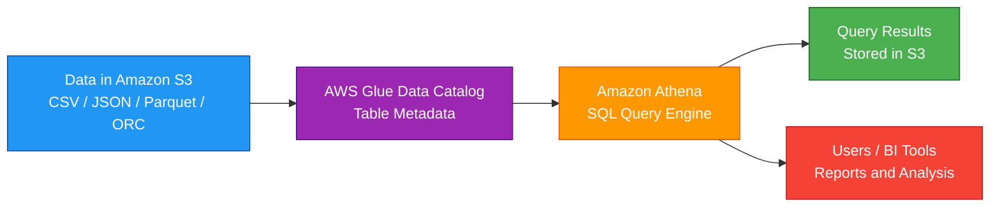
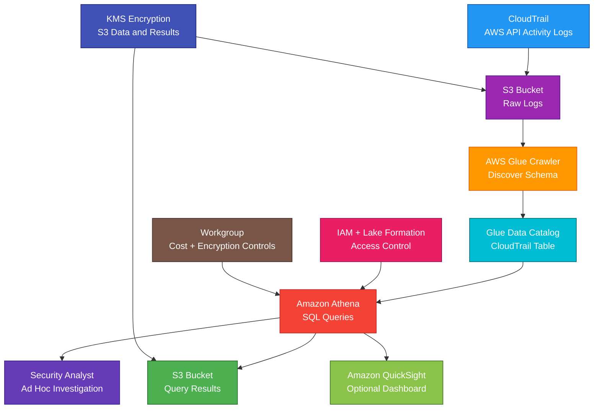

# Amazon Athena

<details>
<summary>

## 1. Definition

</summary>

### Simple Definition

Amazon Athena is a serverless query service that lets you analyze data in Amazon S3 using SQL.

You do not need to manage servers, databases, or clusters.

### Memory Hook

Athena = SQL directly on S3.

### Basic Idea

Store data in S3.

Create table metadata using AWS Glue Data Catalog.

Run SQL queries with Athena.

Athena reads the data directly from S3 and returns results.



### Key Point

Athena does not store your main data.

Your data stays in S3.

Athena queries it in place.

</details>

<details>
<summary>

## 2. What Problem Does It Solve?

</summary>

### Main Problem

Athena solves the problem of querying large data files in S3 without loading them into a database or data warehouse first.

### Without Athena

You may need to:

- Load data into a database
- Manage query servers
- Manage data warehouse clusters
- Build custom query tools
- Move data before analyzing it
- Pay for always-running infrastructure

### With Athena

You can query S3 data directly using SQL.

### Key Benefit

Athena is simple, serverless, and cost-effective for ad hoc analytics on S3 data.

</details>

<details>
<summary>

## 3. Core Use Cases

</summary>

### Query Data Lakes

Use Athena to query data stored in an S3 data lake.

Examples:

- Logs
- Clickstream data
- Application events
- IoT data
- Security records
- Business exports

### Ad Hoc Analysis

Use Athena when users need quick SQL analysis without setting up a database.

Example:

A data analyst runs SQL queries directly on CSV or Parquet files in S3.

### Log Analysis

Athena is commonly used to analyze logs stored in S3.

Examples:

- CloudTrail logs
- VPC Flow Logs
- ALB access logs
- CloudFront logs
- S3 access logs

### Security Investigation

Use Athena to search and filter security logs.

Example:

Find CloudTrail events where an IAM user deleted resources.

### Cost and Usage Analysis

Use Athena to query AWS Cost and Usage Reports stored in S3.

Example:

Analyze monthly cost by service, account, or tag.

### BI Reporting

Athena can connect to BI tools.

Examples:

- Amazon QuickSight
- JDBC/ODBC clients
- SQL workbenches

### Data Validation

Use Athena to inspect data after ETL jobs.

Example:

Check row counts after AWS Glue transforms raw data into Parquet.

</details>

<details>
<summary>

## 4. Important Features for SAA

</summary>

### Serverless Query Service

Athena is serverless.

You do not manage:

- Servers
- Clusters
- Nodes
- Patching
- Scaling infrastructure

### SQL Query Engine

Athena lets you use standard SQL to query data.

Example:

```sql
SELECT status_code, count(*)
FROM alb_logs
WHERE request_date = DATE '2026-05-04'
GROUP BY status_code;
```

### Data Stays in S3

Athena queries data directly where it lives in S3.

This is called query-in-place.

### Glue Data Catalog

Athena commonly uses AWS Glue Data Catalog to store table metadata.

The Data Catalog stores:

- Database names
- Table names
- Column names
- Data types
- S3 locations
- Partitions
- File formats

### Table Metadata

Athena tables are metadata definitions.

They point to data in S3.

Important point:

Dropping an Athena table does not delete the S3 data unless configured through special table formats or tools.

### External Tables

Most Athena tables are external tables.

This means the table points to data stored outside Athena, usually in S3.

### Supported File Formats

Athena can query many common formats.

| Format | Notes |
|---|---|
| CSV | Simple but often less efficient |
| JSON | Flexible but can be expensive to scan |
| Parquet | Columnar and efficient |
| ORC | Columnar and efficient |
| Avro | Common in data pipelines |

### Columnar Formats

Parquet and ORC are columnar formats.

They are better for analytics because Athena can read only the columns needed by the query.

### Compression

Compressed data reduces storage and query scan size.

Common compression formats:

- GZIP
- Snappy
- ZSTD
- BZIP2

### Partitioning

Partitioning organizes data by folder-like keys in S3.

Example:

```text
s3://my-bucket/logs/year=2026/month=05/day=04/
```

Partitioning helps Athena scan less data.

### Partition Pruning

Partition pruning means Athena skips partitions that are not needed.

Example:

If a query filters `day = '04'`, Athena does not scan other days.

### Common Partition Keys

Useful partition keys include:

- Date
- Region
- Account ID
- Application
- Environment
- Event type

### Partition Projection

Partition projection lets Athena calculate partition values instead of loading all partitions into the Glue Data Catalog.

Use it when there are many partitions.

### CTAS

CTAS means Create Table As Select.

It creates a new table from query results.

Use CTAS to:

- Convert CSV to Parquet
- Create optimized datasets
- Create filtered datasets
- Create partitioned datasets

Example:

```sql
CREATE TABLE curated_logs
WITH (
  format = 'PARQUET',
  external_location = 's3://my-bucket/curated/logs/'
) AS
SELECT *
FROM raw_logs
WHERE status_code >= 400;
```

### Query Results Location

Athena stores query results in S3.

You must configure a query results bucket or workgroup output location.

### Workgroups

Workgroups help organize and control Athena query usage.

Use workgroups to:

- Separate teams
- Set query result locations
- Enforce encryption
- Track costs
- Set query limits
- Control settings

### Query Scan Limit

Athena charges based on data scanned for many query types.

Workgroups can help set limits to control query cost.

### Federated Query

Athena Federated Query can query data outside S3 using connectors.

Examples:

- DynamoDB
- RDS
- Redshift
- CloudWatch Logs
- JDBC sources

For SAA, remember the main use case:

Athena primarily queries S3, but can query other sources using connectors.

### Athena for Apache Spark

Athena can also support serverless Apache Spark workloads.

For SAA, focus mainly on SQL queries over S3.

### ACID Table Formats

Athena supports modern table formats such as Apache Iceberg.

Use these when data lake tables need features like:

- Updates
- Deletes
- Time travel
- Schema evolution

For SAA, the main concept is still SQL analytics on S3.

### Integration with QuickSight

QuickSight can use Athena as a data source.

Pattern:

S3 data lake → Athena SQL → QuickSight dashboard

### Integration with CloudTrail Logs

CloudTrail can store logs in S3.

Athena can query those logs for auditing and investigation.

</details>

<details>
<summary>

## 5. Security Model

</summary>

### IAM Permissions

IAM controls who can use Athena and access related resources.

Common permissions:

| Permission | Purpose |
|---|---|
| `athena:StartQueryExecution` | Run a query |
| `athena:GetQueryExecution` | Get query status |
| `athena:GetQueryResults` | Get query results |
| `athena:StopQueryExecution` | Stop a query |
| `athena:GetWorkGroup` | View workgroup |
| `glue:GetTable` | Read table metadata |
| `s3:GetObject` | Read source data from S3 |
| `s3:PutObject` | Write query results to S3 |

### S3 Permissions

Athena needs permission to read source data in S3.

It also needs permission to write query results to the configured S3 results location.

### Glue Data Catalog Permissions

If using Glue Data Catalog, users need permissions to read metadata.

Examples:

- `glue:GetDatabase`
- `glue:GetTable`
- `glue:GetPartitions`

### Least Privilege

Give users access only to the data they need.

Example:

A finance analyst can query only finance data, not all S3 buckets.

### Encryption at Rest

Athena query results can be encrypted in S3.

Common options:

- SSE-S3
- SSE-KMS
- CSE-KMS, for client-side encryption patterns

Source data in S3 should also be encrypted when required.

### Encryption in Transit

Athena API calls use HTTPS.

Connections from clients should use TLS.

### KMS Permissions

If data or query results use SSE-KMS, users need KMS permissions.

Important exam point:

A user may have Athena and S3 permissions but still fail if KMS denies decrypt access.

### Workgroup Security Controls

Workgroups can enforce:

- Query result location
- Query result encryption
- Query limits
- Engine version settings

### Lake Formation

AWS Lake Formation can provide fine-grained access control for data lake tables.

Use it when you need stronger governance over:

- Databases
- Tables
- Columns
- Rows
- Cross-account data sharing

### S3 Bucket Policies

Use S3 bucket policies to restrict access to source data and query results.

Best practices:

- Block public access
- Restrict access to trusted principals
- Require encryption
- Require TLS
- Limit access by prefix where possible

### Query Result Security

Athena query results may contain sensitive data.

Protect the query results bucket carefully.

Use:

- Encryption
- Bucket policies
- Lifecycle rules
- Least privilege
- S3 Block Public Access

### CloudTrail Auditing

CloudTrail can log Athena API activity.

Use it to audit:

- Who ran queries
- When queries were started
- Workgroup activity
- Administrative changes

### Shared Responsibility

AWS is responsible for:

- Athena managed service infrastructure
- Query engine infrastructure
- Service availability
- Physical security

You are responsible for:

- IAM permissions
- S3 bucket security
- Glue Data Catalog permissions
- KMS key policies
- Workgroup configuration
- Query result protection
- Data classification
- Lake Formation permissions
- Cost controls

</details>

<details>
<summary>

## 6. High Availability / Durability Behavior

</summary>

### Availability

Athena is a managed serverless service.

AWS manages query infrastructure availability and scaling.

### Regional Service

Athena is regional.

Queries run in the Region where Athena is used and where the catalog/data configuration exists.

### Multi-AZ Behavior

Athena is managed by AWS across regional infrastructure.

You do not configure Multi-AZ manually.

### Data Durability

Athena does not store your primary data.

Data durability depends mainly on Amazon S3.

For SAA, remember:

S3 is designed for 11 9s of durability.

### Query Results Durability

Query results are stored in S3.

Their durability depends on the S3 bucket and lifecycle settings.

### Fault Tolerance

Athena removes the need to manage query servers.

However, queries can still fail because of:

- Bad SQL
- Missing permissions
- Bad data format
- Missing partitions
- KMS access denial
- S3 object issues
- Query timeout or resource limits

### Multi-Region Behavior

Athena does not automatically query across all Regions.

For Multi-Region analytics, design data and catalog strategy.

Common options:

- Replicate S3 data across Regions
- Create Glue Data Catalog resources in each Region
- Use separate Athena workgroups per Region
- Use centralized data lake architecture

### Disaster Recovery

For Athena-based analytics, protect:

- S3 source data
- Glue Data Catalog definitions
- Athena workgroup settings
- Query result buckets
- Infrastructure as Code templates

### Important Exam Point

Athena is highly managed and serverless, but S3 is the durable data storage layer.

</details>

<details>
<summary>

## 7. Cost Optimization Options

</summary>

### Understand Athena Pricing

Athena commonly charges based on the amount of data scanned by queries.

Main cost rule:

Less data scanned = lower cost.

### Use Columnar Formats

Use Parquet or ORC instead of CSV or JSON when possible.

Columnar formats reduce the amount of data scanned.

### Compress Data

Compression reduces data size.

Smaller files usually mean less scanned data and lower cost.

### Partition Data

Partition data by common filters.

Examples:

- Date
- Region
- Account ID
- Environment
- Application

This helps Athena skip unnecessary data.

### Avoid SELECT Star

Avoid this pattern:

```sql
SELECT *
FROM logs;
```

Better:

```sql
SELECT timestamp, status_code, request_uri
FROM logs
WHERE year = '2026'
AND month = '05';
```

### Query Only Needed Columns

Athena with columnar formats can scan only selected columns.

This reduces cost.

### Use Workgroup Query Limits

Workgroups can set limits to prevent expensive queries.

Example:

Cancel queries that scan too much data.

### Use CTAS to Optimize Data

Use CTAS to convert inefficient raw data into optimized formats.

Example:

Convert JSON logs to partitioned Parquet.

### Use Partition Projection

If you have many partitions, partition projection can reduce catalog overhead and improve query planning.

### Avoid Too Many Small Files

Too many small files can hurt performance.

Use compaction jobs to create fewer larger files.

Common tools:

- AWS Glue
- EMR
- Athena CTAS
- Spark jobs

### Store Results Efficiently

Athena query results are stored in S3.

Use S3 lifecycle policies to expire old query results.

### Use Federated Queries Carefully

Federated queries can add complexity and cost.

Use them when needed, but avoid unnecessary broad scans across external sources.

### Use QuickSight SPICE Where Useful

For repeated dashboard queries, QuickSight SPICE can cache data and reduce repeated Athena query scans.

</details>

<details>
<summary>

## 8. Common Exam Traps

</summary>

### Athena vs Redshift

This is a major exam trap.

| Requirement | Choose |
|---|---|
| Serverless SQL directly on S3 | Athena |
| Managed data warehouse for high-performance BI | Redshift |

### Athena Does Not Store Data

Athena queries data in S3.

It does not replace S3 as the storage layer.

### Athena Is Not OLTP

Do not choose Athena for application transactions.

Use RDS, Aurora, or DynamoDB for application databases.

### Athena Is Not a Data Warehouse Cluster

Athena is serverless query-in-place.

Redshift is a data warehouse.

### Glue Data Catalog Is Metadata

Glue Data Catalog stores table definitions, not the actual data.

The actual data usually stays in S3.

### File Format Matters

CSV and JSON are easy but can be expensive.

Parquet and ORC are better for analytics.

### Partitioning Matters

Poor partitioning can make Athena scan too much data.

Good partitioning reduces cost and improves performance.

### Query Results Need S3 Location

Athena needs an S3 location for query results.

If missing or inaccessible, queries fail.

### KMS Can Block Queries

If source data or query results use SSE-KMS, KMS permissions must allow access.

### Dropping a Table Usually Does Not Delete S3 Data

Most Athena tables are external tables.

Deleting table metadata usually does not delete the underlying S3 objects.

### Athena Charges by Data Scanned

If a query scans the whole dataset, it can be expensive.

Use partitions, compression, and columnar formats.

### Athena Is Regional

Athena resources and Glue Catalog metadata are Region-specific.

Do not assume one Athena setup automatically works globally.

### Workgroups Help Governance

If the exam mentions separating teams, enforcing query result encryption, or controlling query cost, think Athena workgroups.

</details>

<details>
<summary>

## 9. Compare With Similar Services

</summary>

### Service Comparison Table

| Service | Main Purpose | Best For | Choose When |
|---|---|---|---|
| Amazon Athena | Serverless SQL queries on S3 | Ad hoc analytics and data lake queries | You need SQL directly on S3 without managing servers |
| Amazon Redshift | Managed data warehouse | High-performance BI and OLAP analytics | You need a data warehouse |
| AWS Glue | ETL and Data Catalog | Transforming and cataloging data | You need to prepare or catalog data |
| Amazon EMR | Big data cluster platform | Spark, Hadoop, Hive, Presto workloads | You need custom big data processing |
| Amazon OpenSearch Service | Search and log analytics | Full-text search and log exploration | You need search/indexing |
| Amazon RDS | Relational database | OLTP application workloads | You need SQL transactions |
| Amazon QuickSight | BI visualization | Dashboards and reports | You need visual analytics |

### Athena vs Redshift

| Feature | Athena | Redshift |
|---|---|---|
| Main purpose | Query data in S3 | Data warehouse |
| Infrastructure | Serverless | Cluster or serverless warehouse |
| Data storage | S3 | Redshift storage and external S3 tables |
| Best for | Ad hoc data lake queries | Repeated high-performance BI |
| Cost model | Data scanned | Provisioned/serverless warehouse usage |

### Athena vs Glue

| Feature | Athena | AWS Glue |
|---|---|---|
| Main purpose | Query data | Catalog and transform data |
| Runs SQL queries | Yes | Not mainly for interactive SQL |
| Data Catalog | Uses Glue Catalog | Provides Glue Catalog |
| ETL jobs | No | Yes |
| Common use together | Query tables | Create metadata and transform data |

### Athena vs EMR

| Feature | Athena | EMR |
|---|---|---|
| Management | Serverless | Managed cluster platform |
| Best for | Simple SQL on S3 | Custom Spark/Hadoop workloads |
| Control | Less | More |
| Operations | Lower | Higher |
| Exam clue | SQL query without servers | Big data cluster control |

### Athena vs OpenSearch

| Feature | Athena | OpenSearch |
|---|---|---|
| Main purpose | SQL analytics on S3 | Search and log analytics |
| Best for | Structured/semi-structured S3 data | Full-text search and indexed queries |
| Query style | SQL | Search queries and dashboards |
| Example | Query CloudTrail logs in S3 | Search application logs by keyword |

### Athena vs RDS

| Feature | Athena | RDS |
|---|---|---|
| Workload | Analytics on files | Application transactions |
| Storage | S3 files | Database engine storage |
| Query pattern | Large scans and filters | Many small reads/writes |
| Best for | Data lake analytics | OLTP apps |

### When to Choose Athena

Choose Athena when:

- You need SQL queries directly on S3
- You want serverless analytics
- You need ad hoc querying
- You need to analyze logs in S3
- You need to query a data lake
- You want to avoid loading data into Redshift
- You need pay-per-query analytics
- You use Glue Data Catalog metadata
- You need quick analysis of structured or semi-structured files

</details>

<details>
<summary>

## 10. Mini Architecture Example

</summary>

### Scenario

A company stores CloudTrail logs in Amazon S3.

The security team wants to query the logs using SQL to investigate suspicious API activity.

They do not want to load logs into a database or manage servers.

### Architecture

Store CloudTrail logs in S3.

Use AWS Glue Crawler or table definitions to create metadata in Glue Data Catalog.

Use Athena to run SQL queries against the logs.

Store Athena query results in a secured S3 bucket.

Use QuickSight if dashboards are needed.



### Why This Is Good

- CloudTrail stores API logs in S3
- S3 provides durable log storage
- Glue Data Catalog stores table metadata
- Athena queries logs directly in S3
- No database or cluster management is required
- Query results are stored in S3
- KMS protects data and query results at rest
- IAM and Lake Formation control access
- Workgroups help control cost and enforce settings
- QuickSight can create dashboards from Athena queries

### Exam Answer Pattern

If the question says:

“Run SQL queries directly on data stored in S3 without managing servers.”

Think:

Amazon Athena.

If the question says:

“Create metadata tables for S3 data.”

Think:

AWS Glue Data Catalog or Glue Crawler.

If the question says:

“Run large-scale BI analytics in a managed data warehouse.”

Think:

Amazon Redshift.

If the question says:

“Visualize query results in dashboards.”

Think:

Amazon QuickSight.

### Final Memory Hook

Athena = Serverless SQL on S3.

S3 = Stores the data.

Glue Data Catalog = Stores metadata.

Crawler = Discovers schema.

External table = Points to S3 data.

Parquet/ORC = Efficient query formats.

Partitioning = Scans less data.

Compression = Lower scan size.

CTAS = Create optimized table from query.

Workgroup = Cost and settings control.

Query results = Stored in S3.

Lake Formation = Fine-grained data lake permissions.

Redshift = Data warehouse.

Glue = ETL and catalog.

QuickSight = Dashboards.

</details>