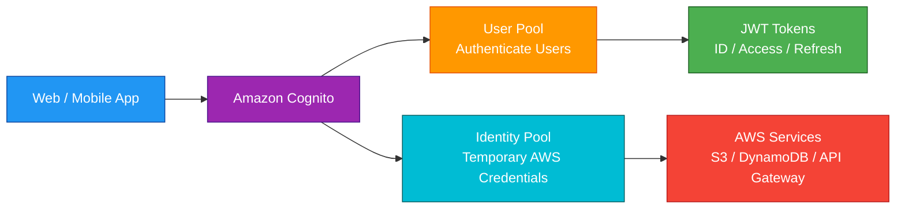
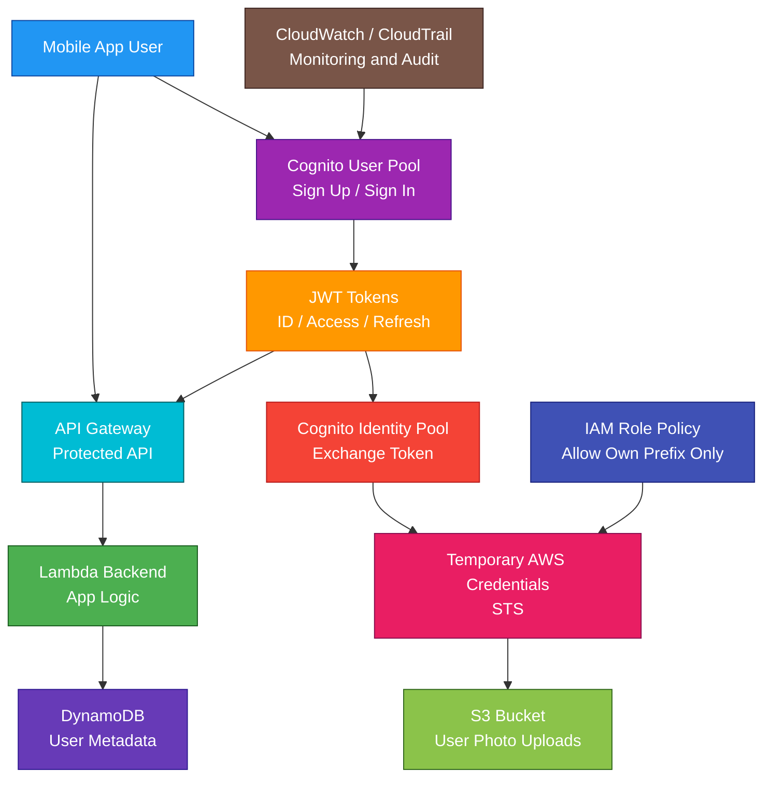

# Amazon Cognito

<details>
<summary>

## 1. Definition

</summary>

### Simple Definition

Amazon Cognito is a managed identity service for adding user sign-up, sign-in, authentication, and authorization to web and mobile applications.

It helps you manage application users without building your own login system from scratch.

### Memory Hook

Cognito = Customer login and app user identity.

### Basic Idea

Users sign up or sign in through Cognito.

After authentication, Cognito gives the app tokens.

The app can use those tokens to access APIs or exchange them for temporary AWS credentials.



### Main Components

| Component | Main Job |
|---|---|
| User Pool | Authenticates application users |
| Identity Pool | Grants temporary AWS credentials |
| App Client | Represents an application using a user pool |
| Managed Login | Hosted login UI from Cognito |
| Federation | Sign in with external identity providers |

</details>

<details>
<summary>

## 2. What Problem Does It Solve?

</summary>

### Main Problem

Amazon Cognito solves the problem of managing user authentication for applications.

Instead of building and securing your own login, password reset, MFA, token generation, and social login system, Cognito provides these features as a managed service.

### Without Cognito

You may need to build and manage:

- User registration
- User login
- Password reset
- Email and phone verification
- Multi-factor authentication
- Social login
- SAML or OIDC federation
- JWT token generation
- Secure user storage
- Temporary AWS credentials for users
- Account recovery
- User lifecycle management

### With Cognito

AWS manages much of the identity infrastructure.

You configure:

- Sign-up and sign-in options
- Password policy
- MFA
- App clients
- Identity providers
- User attributes
- IAM role mapping
- Lambda triggers
- Token behavior
- Security settings

### Key Benefit

Cognito makes it easier to add secure user authentication and authorization to web and mobile apps.

</details>

<details>
<summary>

## 3. Core Use Cases

</summary>

### Web and Mobile App Login

Use Cognito User Pools when customers need to sign up and sign in to your application.

Examples:

- E-commerce app users
- SaaS product users
- Mobile app users
- Student portal users
- Customer dashboard users

### Social Login

Use Cognito federation to allow sign-in with external identity providers.

Examples:

- Google
- Facebook
- Apple
- Amazon
- OIDC providers
- SAML providers

### API Authentication

Use Cognito User Pools with API Gateway to secure APIs.

Example:

A user signs in through Cognito.

The app receives a JWT token.

API Gateway validates the token before allowing API access.

### Temporary AWS Credentials for App Users

Use Cognito Identity Pools when application users need temporary access to AWS services.

Examples:

- Upload profile images to S3
- Read user-specific data from DynamoDB
- Access AppSync APIs
- Use limited AWS service permissions

### Guest Access

Identity Pools can support unauthenticated guest users.

Example:

A mobile app lets guests browse public S3 content before signing in.

### Multi-Tenant Applications

Use user pool groups, custom attributes, or token claims to help separate users by tenant, role, or organization.

### Custom Authentication Flows

Use Lambda triggers to customize authentication.

Examples:

- Custom challenge
- Pre sign-up validation
- Post confirmation logic
- Custom message formatting
- Token customization

</details>

<details>
<summary>

## 4. Important Features for SAA

</summary>

### User Pool

A User Pool is a user directory for your application.

It handles:

- User sign-up
- User sign-in
- Password reset
- MFA
- Email and phone verification
- User profiles
- JWT token issuance
- Federation with external identity providers

### Identity Pool

An Identity Pool gives users temporary AWS credentials.

Important point:

Identity Pools are for authorization to AWS services.

They can work with:

- Cognito User Pools
- Social identity providers
- SAML providers
- OIDC providers
- Unauthenticated guest users

### User Pool vs Identity Pool

| Feature | User Pool | Identity Pool |
|---|---|---|
| Main purpose | Authenticate users | Grant temporary AWS credentials |
| Output | JWT tokens | Temporary AWS credentials |
| User directory | Yes | No, mainly identity federation |
| Common use | Login to app | Access S3, DynamoDB, AWS services |
| Exam clue | Sign-up/sign-in | Temporary AWS credentials |

### JWT Tokens

After successful sign-in, a User Pool issues JSON Web Tokens.

Common tokens:

| Token | Purpose |
|---|---|
| ID token | Contains user identity claims |
| Access token | Authorizes access to protected resources |
| Refresh token | Gets new tokens without signing in again |

### ID Token

The ID token contains information about the authenticated user.

Examples:

- Username
- Email
- Phone number
- Custom attributes
- Group membership

### Access Token

The access token is used to authorize access.

Examples:

- Call Cognito user APIs
- Access protected APIs
- Validate scopes

### Refresh Token

The refresh token is used to get new ID and access tokens after they expire.

This lets users stay signed in without re-entering credentials every time.

### App Client

An app client represents an application that uses a Cognito User Pool.

Examples:

- Web frontend
- Mobile app
- Backend application

App clients define settings such as:

- OAuth flows
- Callback URLs
- Sign-out URLs
- Token validity
- Identity provider options
- Client secret settings

### Managed Login

Managed Login is Cognito’s hosted sign-in and sign-up experience.

Use it when you want AWS to provide the authentication UI.

It can support:

- Sign-in
- Sign-up
- Password reset
- MFA flows
- Social provider login
- OIDC or SAML provider login

### OAuth 2.0 and OIDC

Cognito User Pools can act as an OIDC identity provider.

Common OAuth 2.0 flows include:

| Flow | Best For |
|---|---|
| Authorization code grant | Secure web/mobile sign-in |
| Client credentials | Machine-to-machine access |
| Implicit grant | Older browser-based apps, generally less preferred |

### Authorization Code Grant

Authorization code grant is commonly preferred for secure modern applications.

The app receives an authorization code and exchanges it for tokens.

### Hosted Domain

A Cognito User Pool can have a domain for managed login.

Example:

```text
https://your-domain.auth.region.amazoncognito.com
```

### Callback URL

A callback URL is where Cognito redirects users after successful sign-in.

Example:

```text
https://app.example.com/callback
```

### Sign-Out URL

A sign-out URL is where Cognito redirects users after logout.

### Federation

Federation allows users to sign in with an external identity provider.

Common identity providers:

- Google
- Facebook
- Apple
- Amazon
- SAML 2.0
- OIDC

### SAML Federation

Use SAML federation when integrating with enterprise identity providers.

Examples:

- Microsoft Entra ID
- Okta
- Ping Identity
- Corporate identity systems

### OIDC Federation

Use OIDC federation for modern identity providers that support OpenID Connect.

### User Pool Groups

Groups organize users and can influence authorization.

Examples:

- Admins
- Editors
- Customers
- PremiumUsers

Group membership can appear in tokens.

### Custom Attributes

Custom attributes store application-specific user data.

Examples:

- `tenantId`
- `planType`
- `department`
- `customerTier`

### Lambda Triggers

Lambda triggers customize Cognito behavior.

Common triggers:

| Trigger | Example Use |
|---|---|
| Pre sign-up | Validate email domain before allowing sign-up |
| Post confirmation | Create user profile after confirmation |
| Pre authentication | Block sign-in based on custom logic |
| Post authentication | Log successful sign-in |
| Custom message | Customize email/SMS messages |
| Pre token generation | Add or modify token claims |
| Custom auth challenge | Build passwordless or custom challenge flow |

### MFA

Cognito supports multi-factor authentication.

Common second factors:

- SMS code
- Time-based one-time password apps

### Password Policy

User Pools can enforce password rules.

Examples:

- Minimum length
- Uppercase letters
- Lowercase letters
- Numbers
- Symbols
- Temporary password expiration

### Account Recovery

Cognito can support account recovery through verified email or phone number.

### User Verification

Cognito can verify:

- Email address
- Phone number

Verification helps confirm that the user owns the contact method.

### Advanced Security Features

Cognito can provide advanced security features such as risk-based adaptive authentication and compromised credential protection.

Use these for stronger protection against suspicious sign-ins.

### API Gateway Authorizer

API Gateway can use a Cognito User Pool authorizer.

Pattern:

1. User signs in with Cognito.
2. App receives JWT.
3. App calls API Gateway with token.
4. API Gateway validates token.
5. Valid request reaches backend.

### Identity Pool IAM Role Mapping

Identity Pools map users to IAM roles.

Examples:

- Authenticated users get one IAM role
- Guest users get another IAM role
- Admin users get a more privileged role
- Groups map to different roles

### Temporary Credentials

Identity Pools issue temporary credentials through AWS STS.

This is safer than embedding long-term AWS access keys in apps.

### Sync Note

Older Cognito Sync features are less commonly tested.

For modern app data sync, AWS AppSync, Amplify DataStore, DynamoDB, or custom APIs are more common.

</details>

<details>
<summary>

## 5. Security Model

</summary>

### IAM Permissions

IAM controls who can manage Cognito resources.

Common permissions:

| Permission | Purpose |
|---|---|
| `cognito-idp:CreateUserPool` | Create user pool |
| `cognito-idp:CreateUserPoolClient` | Create app client |
| `cognito-idp:AdminCreateUser` | Create user as admin |
| `cognito-idp:AdminDeleteUser` | Delete user as admin |
| `cognito-idp:AdminAddUserToGroup` | Add user to group |
| `cognito-identity:CreateIdentityPool` | Create identity pool |
| `cognito-identity:GetCredentialsForIdentity` | Get temporary credentials |

### User Authentication

Cognito User Pools authenticate users.

Authentication options include:

- Username and password
- Email or phone sign-in
- MFA
- Social login
- SAML federation
- OIDC federation
- Custom authentication flows

### Authorization

Authorization depends on what the user is trying to access.

Common authorization methods:

| Access Target | Common Authorization Method |
|---|---|
| API Gateway API | Cognito User Pool authorizer |
| AWS services | Identity Pool with IAM roles |
| App backend | Validate JWT and claims |
| Multi-tenant app | Groups, scopes, custom claims, app logic |

### JWT Validation

Applications and APIs should validate Cognito JWTs.

Validate:

- Token signature
- Issuer
- Audience or client ID
- Expiration time
- Token type
- Scopes or claims

### IAM Roles for Identity Pools

Identity Pools use IAM roles to control AWS service access.

Best practice:

Use least privilege.

Example:

A user can upload only to their own S3 prefix, not the whole bucket.

### Authenticated vs Unauthenticated Roles

Identity Pools can assign different IAM roles.

| User Type | Example Access |
|---|---|
| Authenticated user | Upload to personal S3 folder |
| Guest user | Read public app assets only |

### Encryption in Transit

Cognito endpoints use HTTPS.

Applications should always use HTTPS when communicating with Cognito and backend APIs.

### Encryption at Rest

Cognito is a managed service and protects stored user data.

For connected services, configure encryption separately.

Examples:

- S3 encryption
- DynamoDB encryption
- CloudWatch Logs encryption
- Secrets Manager encryption

### MFA Security

Enable MFA for sensitive applications.

Use adaptive authentication when you want risk-based MFA challenges.

### App Client Secret

Some app clients can have a client secret.

Important point:

Do not use a client secret in public apps such as browser apps or mobile apps, because users can extract it.

Use client secrets only in trusted server-side applications.

### Token Storage

Store tokens securely.

For browser apps, avoid unsafe local storage when possible.

For mobile apps, use secure device storage.

### Secret Handling

Do not hardcode sensitive values in frontend apps.

Use backend services, Secrets Manager, and secure configuration practices.

### CloudTrail Auditing

Cognito management API activity can be logged in CloudTrail.

Use CloudTrail to audit:

- User pool changes
- App client changes
- Identity pool changes
- Admin user actions
- Configuration changes

### CloudWatch Logs

Some Cognito-related flows can integrate with logging through Lambda triggers and application logs.

Do not log sensitive tokens or passwords.

### Shared Responsibility

AWS is responsible for:

- Cognito managed service infrastructure
- Token issuance infrastructure
- User directory infrastructure
- Service availability
- Physical security

You are responsible for:

- User pool configuration
- App client configuration
- Token validation
- MFA settings
- Password policy
- Identity provider trust configuration
- IAM role permissions
- Secure token storage
- Secure application logic
- Protecting backend APIs

</details>

<details>
<summary>

## 6. High Availability / Durability Behavior

</summary>

### Availability

Amazon Cognito is a managed AWS service.

AWS manages the identity service infrastructure, scaling, and availability.

### Regional Service

Cognito resources are regional.

User pools and identity pools are created in a specific AWS Region.

### Multi-AZ Behavior

Cognito is managed by AWS across regional infrastructure.

You do not configure Multi-AZ manually.

### User Directory Durability

Cognito stores user pool data as a managed service.

For SAA, focus on:

- Managed user directory
- Managed token issuance
- Regional resource behavior
- Secure configuration
- Backup/export planning where needed

### Multi-Region Behavior

Cognito User Pools are not automatically global across all Regions.

For Multi-Region applications, you must design identity strategy carefully.

Common options:

- Use one primary Cognito Region
- Deploy separate user pools in multiple Regions
- Use external identity provider federation
- Use Route 53, CloudFront, and multi-Region backend design
- Plan user migration or synchronization carefully

### Identity Pool Resilience

Identity Pools issue temporary AWS credentials based on trusted identity providers.

Applications should handle token expiration and credential refresh.

### Token Expiration

Tokens expire based on app client settings.

Applications should handle:

- Access token expiration
- ID token expiration
- Refresh token usage
- User sign-out
- Session renewal

### Application Resilience

Apps should handle:

- Failed login attempts
- Token refresh failures
- Expired sessions
- MFA challenge flows
- Network errors
- External IdP downtime

### External IdP Dependency

If users sign in through an external identity provider, login availability also depends on that provider.

Example:

If your app uses Google login, Google sign-in availability matters.

### Important Exam Point

Cognito is managed and scalable, but application authentication design must handle tokens, sessions, external IdPs, and Regional architecture correctly.

</details>

<details>
<summary>

## 7. Cost Optimization Options

</summary>

### Use Cognito Instead of Building Auth Yourself

Cognito can reduce development and operational cost by avoiding a custom user management system.

### Choose Features Based on Need

Advanced security features, SMS messages, and high-volume usage can affect cost.

Enable features based on application risk and requirements.

### Control SMS Usage

SMS-based MFA and phone verification can add cost.

Use SMS carefully.

Options to reduce cost:

- Use email verification when acceptable
- Use authenticator app MFA where appropriate
- Monitor SMS usage
- Avoid unnecessary resend flows

### Use Managed Login

Managed Login can reduce frontend development effort.

It may reduce cost compared with building and maintaining a custom authentication UI.

### Avoid Unused App Clients and User Pools

Clean up unused:

- Test user pools
- Old app clients
- Identity pools
- Unused Lambda triggers
- Unused domains

### Use Groups and Claims Efficiently

Use groups and claims to avoid building unnecessary authorization systems from scratch.

However, keep token size reasonable.

### Cache JWKS Keys

APIs that validate Cognito JWTs should cache Cognito public keys.

This reduces repeated network calls and improves performance.

### Use Identity Pools Only When Needed

Do not use Identity Pools if users only need to access your backend API.

Use Identity Pools when users need temporary AWS credentials for direct AWS service access.

### Use API Gateway Authorizers

Using Cognito authorizers with API Gateway can reduce custom authorization code.

### Monitor Usage

Monitor:

- Monthly active users
- Sign-up and sign-in volume
- SMS usage
- Lambda trigger invocations
- Advanced security feature usage
- Failed authentication attempts

</details>

<details>
<summary>

## 8. Common Exam Traps

</summary>

### User Pool vs Identity Pool

This is the biggest Cognito exam trap.

| Requirement | Choose |
|---|---|
| Sign up and sign in users | User Pool |
| Issue JWT tokens | User Pool |
| Give users temporary AWS credentials | Identity Pool |
| Let app users access S3 directly | Identity Pool |
| Federate social users for app login | User Pool or Identity Pool depending on goal |

### Cognito Is for App Users

Cognito is for customer or application users.

For employee access to AWS accounts, use IAM Identity Center.

### Cognito vs IAM Identity Center

| Requirement | Choose |
|---|---|
| Customers log in to your app | Cognito |
| Employees access AWS accounts | IAM Identity Center |

### Cognito vs IAM

IAM is for AWS identities, roles, and permissions.

Cognito is for application user authentication and app identity.

They can work together through Identity Pools.

### User Pool Does Not Directly Grant AWS Credentials

User Pools authenticate users and issue tokens.

Identity Pools exchange identities for temporary AWS credentials.

### Identity Pool Does Not Store User Passwords

Identity Pools are not the main user directory.

User Pools store and authenticate users.

### API Gateway Can Validate Cognito Tokens

If the question says secure an API with app user login, think API Gateway Cognito User Pool authorizer.

### Do Not Put AWS Access Keys in Mobile Apps

Use Cognito Identity Pools to give temporary limited AWS credentials.

Never hardcode long-term AWS credentials in mobile or browser apps.

### App Client Secret Is Not for Public Apps

Do not use a client secret in browser-based or mobile apps.

Public clients cannot keep secrets safe.

### Token Claims Are Not Enough by Themselves

Backend APIs must validate token signature, issuer, audience, and expiration.

Do not blindly trust token content.

### Cognito Does Not Replace Application Authorization

Cognito authenticates users and provides tokens.

Your application may still need business authorization logic.

Example:

A user can only view their own orders.

### Cognito Is Regional

User pools are regional.

Do not assume one user pool automatically works globally with full multi-Region failover.

### External IdP Login Depends on External IdP

If using Google, Facebook, SAML, or OIDC, sign-in depends partly on that provider.

</details>

<details>
<summary>

## 9. Compare With Similar Services

</summary>

### Service Comparison Table

| Service | Main Purpose | Best For | Choose When |
|---|---|---|---|
| Amazon Cognito | App user authentication and identity | Customer sign-up/sign-in for web and mobile apps | You need users to log in to your application |
| IAM Identity Center | Workforce SSO | Employee access to AWS accounts and business apps | Employees need centralized AWS account access |
| IAM | AWS access control | Roles, policies, users, service permissions | You need AWS API permission control |
| AWS STS | Temporary credentials | Role assumption and federation | You need temporary AWS credentials |
| AWS Directory Service | Microsoft AD integration | AD-based enterprise environments | You need managed or connected Active Directory |
| API Gateway Authorizer | API access control | Securing APIs | You need API Gateway to validate tokens |
| Secrets Manager | Secret storage | Passwords and API keys | You need to store and rotate secrets |

### Cognito vs IAM Identity Center

| Feature | Cognito | IAM Identity Center |
|---|---|---|
| Main users | App customers/users | Workforce users/employees |
| Main purpose | App authentication | AWS account and app SSO |
| Example | Customer logs in to shopping app | Developer logs in to AWS account |
| Best for | Web/mobile app identity | Multi-account workforce access |

### User Pool vs Identity Pool

| Feature | User Pool | Identity Pool |
|---|---|---|
| Main purpose | Authentication | AWS authorization |
| Stores users | Yes | No, mainly identity federation |
| Issues JWTs | Yes | No, issues AWS credentials |
| Temporary AWS credentials | No | Yes |
| Common use | Login page | Direct access to S3/DynamoDB |

### Cognito vs IAM

| Feature | Cognito | IAM |
|---|---|---|
| Main purpose | Application user identity | AWS identity and access management |
| User type | App users/customers | AWS users, roles, services |
| Authentication | App sign-up/sign-in | AWS access authentication |
| Common connection | Identity Pool maps users to IAM roles | IAM roles define permissions |

### Cognito vs STS

| Feature | Cognito | AWS STS |
|---|---|---|
| Main purpose | App identity service | Temporary credential service |
| User directory | User Pools can store users | No |
| Temporary credentials | Identity Pools use STS | STS issues credentials |
| Best for | App auth and identity federation | Role assumption and temporary access |

### Cognito vs API Gateway Authorizer

| Feature | Cognito | API Gateway Authorizer |
|---|---|---|
| Main purpose | Authenticate users and issue tokens | Validate requests to APIs |
| Tokens | Issues JWTs | Validates JWTs |
| Best for | Login system | API access control |
| Common use together | Yes | Yes |

### When to Choose Cognito

Choose Cognito when:

- You need app user sign-up and sign-in
- You need customer authentication
- You need social login
- You need SAML or OIDC federation for app users
- You need JWT tokens for APIs
- You need API Gateway integration
- You need temporary AWS credentials for app users
- You need guest access to AWS resources
- You need MFA, password policies, and account recovery
- You want managed authentication instead of building your own

</details>

<details>
<summary>

## 10. Mini Architecture Example

</summary>

### Scenario

A company is building a mobile photo-sharing app.

Users must sign up and sign in.

Authenticated users can upload photos to their own folder in S3.

The backend API must only allow authenticated users.

### Architecture

Use a Cognito User Pool for sign-up and sign-in.

Use API Gateway with a Cognito User Pool authorizer to protect backend APIs.

Use a Cognito Identity Pool to give authenticated users temporary AWS credentials for uploading photos to S3.

Use IAM policies to restrict each user to their own S3 prefix.



### Why This Is Good

- User Pool handles sign-up and sign-in
- Cognito issues JWT tokens after authentication
- API Gateway validates tokens before calling Lambda
- Lambda handles backend application logic
- DynamoDB stores user metadata
- Identity Pool exchanges user identity for temporary AWS credentials
- S3 uploads do not require hardcoded AWS keys in the mobile app
- IAM role restricts each user to their own S3 prefix
- CloudWatch and CloudTrail support monitoring and auditing
- The app avoids building custom authentication infrastructure

### Exam Answer Pattern

If the question says:

“Add sign-up and sign-in to a web or mobile app.”

Think:

Cognito User Pool.

If the question says:

“Allow authenticated app users to access S3 directly using temporary AWS credentials.”

Think:

Cognito Identity Pool.

If the question says:

“Secure API Gateway with customer login tokens.”

Think:

Cognito User Pool authorizer.

If the question says:

“Give employees single sign-on access to AWS accounts.”

Think:

IAM Identity Center.

### Final Memory Hook

Cognito = App user identity.

User Pool = Authenticate users.

Identity Pool = Temporary AWS credentials.

App Client = App configuration.

Managed Login = Hosted login UI.

JWT = Token from User Pool.

ID token = User identity.

Access token = API authorization.

Refresh token = Get new tokens.

Federation = Login with external IdP.

MFA = Stronger sign-in security.

Groups = User role/category claims.

Lambda triggers = Customize auth flow.

API Gateway authorizer = Validates Cognito tokens.

IAM Identity Center = Workforce AWS access.

IAM = AWS permissions.

STS = Temporary credentials.

</details>