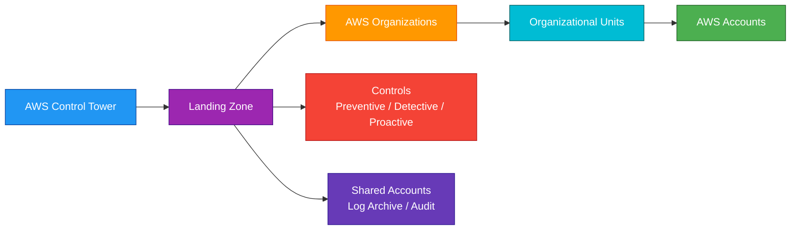
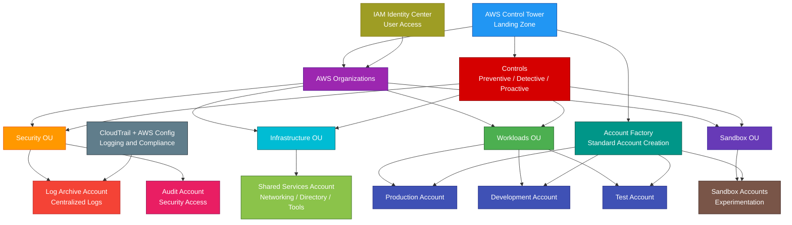

# AWS Control Tower

## 1. Definition

### Simple Definition

AWS Control Tower is an AWS service that helps you set up and govern a secure multi-account AWS environment.

It creates a managed landing zone using AWS best practices.

### Memory Hook

Control Tower = Multi-account AWS setup and governance.

### Basic Idea

AWS Control Tower uses AWS Organizations and other AWS services to create accounts, organize them into OUs, apply controls, and centralize logging and security.

### Key Point

AWS Control Tower is not a replacement for AWS Organizations.

It uses AWS Organizations and adds a managed governance layer on top.

## 2. What Problem Does It Solve?

### Main Problem

AWS Control Tower solves the problem of setting up and governing many AWS accounts consistently.

Large companies usually do not run everything in one AWS account.

They use multiple accounts for separation, security, billing, and governance.

### Without AWS Control Tower

You may need to manually configure:

- AWS Organizations
- Organizational units
- Account creation
- Service control policies
- Centralized logging
- Security audit accounts
- AWS Config rules
- CloudTrail trails
- IAM Identity Center access
- Account baselines
- Governance controls
- Multi-account guardrails

### With AWS Control Tower

AWS provides a guided way to create and govern a multi-account environment.

### Key Benefit

Control Tower helps create a secure, standardized AWS environment faster than building everything manually.

## 3. Core Use Cases

### Multi-Account AWS Environment

Use Control Tower when a company needs multiple AWS accounts.

Examples:

- Development account
- Testing account
- Production account
- Security account
- Shared services account
- Logging account

### Landing Zone Setup

Use Control Tower to create a landing zone.

A landing zone is a preconfigured AWS environment with accounts, networking options, logging, security, and governance.

### Account Vending

Use Account Factory to create new AWS accounts with standardized settings.

Example:

A team requests a new development account, and Control Tower provisions it with baseline controls.

### Centralized Governance

Use Control Tower to apply controls across accounts and organizational units.

Examples:

- Prevent public S3 buckets
- Detect unrestricted security groups
- Require encrypted storage
- Restrict Regions
- Enforce account baselines

### Security Baseline

Use Control Tower to set up core security and logging accounts.

Examples:

- Audit account
- Log archive account
- Central CloudTrail logs
- AWS Config tracking

### Enterprise Cloud Foundation

Use Control Tower as the foundation for an enterprise AWS environment.

Common teams involved:

- Cloud platform team
- Security team
- Networking team
- Application teams
- Compliance team

### Regulated Workloads

Use Control Tower when governance and account separation are important for compliance.

Examples:

- Finance
- Healthcare
- Government
- Enterprise SaaS
- Large organizations

## 4. Important Features for SAA

### Landing Zone

A landing zone is a well-architected multi-account AWS environment.

Control Tower landing zone includes:

- AWS Organizations setup
- Core organizational units
- Shared accounts
- Centralized logging
- Security auditing
- Controls
- Account provisioning

### AWS Organizations

AWS Organizations is the underlying service for managing multiple AWS accounts.

Control Tower uses AWS Organizations to:

- Create accounts
- Organize accounts into OUs
- Apply service control policies
- Manage multi-account governance

### Management Account

The management account is the main AWS Organizations account.

Important point:

Use the management account carefully.

Do not run normal application workloads in it.

### Shared Accounts

Control Tower creates or uses shared accounts for core functions.

Common shared accounts:

| Account | Purpose |
|---|---|
| Management account | Manages the organization and landing zone |
| Log archive account | Stores centralized logs |
| Audit account | Used by security and compliance teams |

### Log Archive Account

The log archive account stores centralized logs.

Examples:

- CloudTrail logs
- AWS Config logs
- Other security/audit logs depending on setup

### Audit Account

The audit account gives security and compliance teams access to review the environment.

It helps separate security oversight from application accounts.

### Organizational Unit

An organizational unit, or OU, is a group of AWS accounts.

Examples:

- Security OU
- Sandbox OU
- Infrastructure OU
- Workloads OU
- Production OU
- Development OU

### Account Factory

Account Factory is the Control Tower feature for provisioning new AWS accounts.

It creates accounts with approved baselines and governance settings.

### Account Factory for Terraform

Account Factory for Terraform allows account provisioning using Terraform workflows.

Use it when an organization standardizes on Terraform but still wants Control Tower governance.

### Account Enrollment

Account enrollment brings existing AWS accounts under Control Tower governance.

Use it when accounts already exist and need to be governed by Control Tower.

### Registered OU

A registered OU is an organizational unit managed by Control Tower.

Controls can be applied to registered OUs.

### Enrolled Account

An enrolled account is an AWS account governed by Control Tower.

It receives the Control Tower baseline and applicable controls.

### Controls

Controls are governance rules applied by Control Tower.

They help prevent, detect, or block risky configurations.

Control Tower controls are also commonly called guardrails.

### Preventive Controls

Preventive controls stop disallowed actions before they happen.

They are usually implemented using service control policies, or SCPs.

Example:

Deny creating resources in unapproved AWS Regions.

### Detective Controls

Detective controls identify noncompliant resources after they exist.

They are usually implemented using AWS Config rules.

Example:

Detect whether an S3 bucket allows public read access.

### Proactive Controls

Proactive controls check resources before they are provisioned.

They can help block noncompliant infrastructure before deployment.

Example:

Block a CloudFormation deployment that creates an unencrypted S3 bucket.

### Mandatory Controls

Mandatory controls are required by Control Tower and are enabled as part of the landing zone baseline.

They help protect the core environment.

### Strongly Recommended Controls

Strongly recommended controls are AWS best-practice controls that you should consider enabling.

### Elective Controls

Elective controls are optional controls that can be enabled based on business or compliance needs.

### Region Deny Control

Region deny control restricts access to AWS Regions that are not approved.

This is useful for governance, compliance, and cost control.

### Guardrail / Control Examples

Common control goals:

- Disallow public S3 buckets
- Require encryption
- Restrict Regions
- Detect unrestricted SSH
- Protect log archive resources
- Prevent disabling CloudTrail
- Prevent changes to AWS Config
- Require strong account baselines

### Drift

Drift happens when resources or configurations move away from the expected Control Tower baseline.

Example:

A required AWS Config recorder is changed manually.

### Drift Detection

Control Tower can detect some forms of drift in the landing zone, accounts, OUs, and controls.

Important point:

Drift should be fixed to keep governance working properly.

### Landing Zone Updates

AWS Control Tower landing zones have versions.

You may need to update the landing zone to use newer features and controls.

### Lifecycle Events

Control Tower can emit lifecycle events.

Use these events for automation.

Example:

When a new account is created, trigger a Lambda function to apply extra configuration.

### Customizations for AWS Control Tower

Customizations for AWS Control Tower, or CfCT, helps deploy additional custom resources and policies across accounts.

Use it for organization-specific baselines.

Examples:

- Standard IAM roles
- Network baselines
- Security tooling
- Custom SCPs
- Custom Config rules

### Integration with IAM Identity Center

Control Tower commonly integrates with IAM Identity Center for centralized user access to AWS accounts.

Use it to manage workforce access across accounts.

### Integration with CloudTrail

Control Tower configures centralized logging using AWS CloudTrail.

CloudTrail records AWS API activity across accounts.

### Integration with AWS Config

Control Tower uses AWS Config for detective controls and configuration tracking.

AWS Config helps detect noncompliant resources.

### Integration with Service Catalog

Account Factory historically uses AWS Service Catalog-style account provisioning patterns.

For SAA, remember the main idea:

Account Factory creates standardized AWS accounts.

## 5. Security Model

### IAM Permissions

IAM controls who can manage AWS Control Tower and related resources.

Common permissions:

| Permission | Purpose |
|---|---|
| `controltower:CreateLandingZone` | Create landing zone |
| `controltower:UpdateLandingZone` | Update landing zone |
| `controltower:EnableControl` | Enable a control |
| `controltower:DisableControl` | Disable a control |
| `controltower:GetControlOperation` | Check control operation status |
| `organizations:*` | Manage AWS Organizations resources |
| `sso:*` / IAM Identity Center permissions | Manage centralized access |
| `config:*` | Manage AWS Config resources |
| `cloudtrail:*` | Manage CloudTrail resources |

### Least Privilege

Only trusted platform administrators should manage Control Tower.

Control Tower affects many accounts, so incorrect permissions can create organization-wide risk.

### Management Account Security

Protect the management account carefully.

Best practices:

- Do not run workloads in the management account
- Enable MFA for privileged users
- Limit administrator access
- Use IAM Identity Center for workforce access
- Monitor CloudTrail activity
- Avoid long-term access keys

### Audit Account Security

The audit account should be controlled by security and compliance teams.

It should not be used for normal application workloads.

### Log Archive Account Security

The log archive account should be highly protected.

Best practices:

- Restrict write/delete permissions
- Protect log buckets
- Enable encryption
- Use bucket policies
- Monitor access
- Avoid workload deployment in the log archive account

### Service Control Policies

SCPs are used by AWS Organizations to restrict what accounts can do.

Important point:

SCPs set permission boundaries for accounts.

They do not grant permissions by themselves.

### Preventive Control Security

Preventive controls use SCPs to stop risky actions.

Example:

Deny users from disabling CloudTrail.

### Detective Control Security

Detective controls use AWS Config rules to detect noncompliance.

Example:

Detect public S3 buckets or unrestricted security groups.

### Proactive Control Security

Proactive controls validate resource configurations before provisioning.

Example:

Reject infrastructure that violates required security settings.

### IAM Identity Center

IAM Identity Center provides centralized workforce access to accounts.

Use permission sets to control what users can do in each account.

### Centralized Logging

Control Tower sets up centralized logging patterns.

Important logs:

- CloudTrail logs
- AWS Config logs
- Account activity logs

### Encryption

Use encryption for logs and security data.

Common services:

- S3 encryption
- KMS keys
- CloudTrail log file validation
- Encrypted Config delivery buckets

### Network Security

Control Tower can help set governance rules, but VPC and network security are still your responsibility.

You still need to design:

- VPCs
- Subnets
- Security groups
- NACLs
- Transit Gateway
- Network Firewall
- VPC endpoints

### Shared Responsibility

AWS is responsible for:

- Control Tower managed service infrastructure
- Landing zone orchestration service
- Service availability
- Integration with AWS governance services
- Physical security

You are responsible for:

- Organization design
- OU structure
- Account strategy
- IAM and permission sets
- Control selection
- SCP design
- Data protection
- Log review
- Drift remediation
- Application account security
- Compliance operations

## 6. High Availability / Durability Behavior

### Availability

AWS Control Tower is a managed AWS service.

AWS manages the Control Tower service infrastructure.

### Regional Behavior

Control Tower is configured in a home Region.

Some governance capabilities can apply to multiple governed Regions.

### Governed Regions

Governed Regions are AWS Regions managed by the Control Tower landing zone.

Controls and baselines can apply across selected governed Regions.

### Multi-Account Resilience

Control Tower helps create a resilient account structure by separating responsibilities.

Examples:

- Logs in log archive account
- Security oversight in audit account
- Workloads in separate application accounts
- Development separated from production

### Logging Durability

Centralized logs are commonly stored in S3.

S3 provides durable storage for log archive data.

### Control Tower Is Not Application HA

Control Tower does not automatically make your applications highly available.

It provides governance for accounts and controls.

Your workloads still need HA design using services such as:

- Multi-AZ deployments
- Load balancers
- Auto Scaling
- Backups
- Route 53
- Disaster recovery strategies

### Landing Zone Drift

If the landing zone drifts, governance may not work as expected.

Monitor and fix drift.

### Account Baseline Durability

Enrolled accounts receive baseline configurations.

If users manually change baseline resources, controls and drift detection help identify problems.

### Multi-Region Behavior

Control Tower can govern multiple Regions, but it is not the same as deploying active-active application infrastructure.

Use application-specific Multi-Region services separately.

Examples:

- DynamoDB Global Tables
- S3 Cross-Region Replication
- Aurora Global Database
- Route 53 failover
- AWS Backup cross-Region copy

### Important Exam Point

Control Tower improves governance and account structure, but workload availability depends on the architecture deployed inside the accounts.

## 7. Cost Optimization Options

### Control Tower Service Cost

AWS Control Tower itself does not usually add a direct service charge.

However, the AWS services it configures can create cost.

Examples:

- AWS Config
- CloudTrail
- S3 log storage
- CloudWatch logs
- Guardrails/controls using supporting services
- Additional accounts and resources

### Watch AWS Config Cost

Detective controls often use AWS Config.

AWS Config can create cost based on:

- Configuration items recorded
- Rule evaluations
- Number of accounts
- Number of Regions

### Limit Governed Regions

Govern only the Regions your organization needs.

This can reduce unnecessary AWS Config, CloudTrail, and governance-related costs.

### Use Region Deny

Region deny control can help prevent teams from deploying resources in unapproved Regions.

This reduces cost sprawl and compliance risk.

### Centralize Logs with Lifecycle Policies

Centralized logs can grow quickly.

Use S3 lifecycle policies to:

- Move older logs to cheaper storage classes
- Archive compliance logs
- Delete logs after retention period if allowed

### Avoid Account Sprawl

Multiple accounts are useful, but too many unmanaged or unused accounts create operational overhead.

Use clear account lifecycle management.

### Use Account Factory Standards

Standardized account creation reduces expensive misconfigurations.

Examples:

- Standard tagging
- Standard budgets
- Standard security baselines
- Standard Region restrictions

### Apply Budgets in New Accounts

Use automation to create AWS Budgets or cost alerts in new accounts.

This helps teams detect unexpected spend early.

### Use Tagging Standards

Apply tagging standards across accounts.

Common tags:

- Application
- Owner
- Environment
- Cost center
- Data classification
- Business unit

### Clean Up Unused Accounts

Close or suspend unused sandbox and test accounts when they are no longer needed.

### Combine With Cost Tools

Use Control Tower with:

- AWS Budgets
- Cost Explorer
- Cost and Usage Reports
- Trusted Advisor
- Compute Optimizer

### Important Cost Point

Control Tower helps govern cost, but it is not a cost analysis tool.

Use Cost Explorer and Budgets for detailed cost tracking.

## 8. Common Exam Traps

### Control Tower vs AWS Organizations

This is the biggest exam trap.

| Requirement | Choose |
|---|---|
| Basic multi-account management and SCPs | AWS Organizations |
| Managed landing zone with governance controls | AWS Control Tower |

### Control Tower Uses AWS Organizations

Control Tower does not replace Organizations.

It builds on top of Organizations.

### Control Tower vs IAM Identity Center

IAM Identity Center manages workforce access.

Control Tower manages landing zone governance.

They commonly work together.

### Control Tower vs AWS Config

AWS Config records resource configuration and evaluates rules.

Control Tower uses AWS Config for detective controls.

### Control Tower vs CloudFormation

CloudFormation provisions infrastructure from templates.

Control Tower sets up and governs a multi-account environment.

### Control Tower vs Service Catalog

Service Catalog provides governed self-service products.

Control Tower Account Factory helps create governed accounts.

### Control Tower Does Not Automatically Fix All Problems

Controls can prevent or detect many issues, but teams still need remediation processes.

### SCPs Do Not Grant Permissions

Preventive controls often use SCPs.

SCPs only limit maximum permissions.

Users still need IAM permissions to perform actions.

### Detective Controls Detect After Creation

Detective controls usually identify noncompliance after a resource exists.

They do not always block creation.

### Proactive Controls Block Earlier

Proactive controls can validate resources before provisioning.

Use proactive controls when the requirement is to prevent noncompliant resources before deployment.

### Management Account Should Not Run Workloads

Do not deploy normal applications in the management account.

Use separate workload accounts.

### Log Archive Account Must Be Protected

Do not allow normal teams to modify or delete centralized logs.

### Control Tower Is Not A Monitoring Dashboard for Apps

For application metrics and logs, use CloudWatch.

Control Tower is for account governance.

### Control Tower Is Not A Security Detection Service

For threat detection, use GuardDuty.

For centralized security findings, use Security Hub.

Control Tower helps set governance baselines.

### Existing Accounts Need Enrollment

Existing AWS accounts are not automatically fully governed unless enrolled or registered correctly.

## 9. Compare With Similar Services

### Service Comparison Table

| Service | Main Purpose | Best For | Choose When |
|---|---|---|---|
| AWS Control Tower | Managed landing zone and governance | Multi-account AWS environments | You need governed account setup with controls |
| AWS Organizations | Multi-account management | Account grouping, consolidated billing, SCPs | You need basic organization management |
| IAM Identity Center | Workforce SSO | User access to AWS accounts and apps | Employees need centralized access |
| AWS Config | Configuration tracking and compliance | Resource history and compliance rules | You need continuous config evaluation |
| AWS CloudTrail | API activity logging | Audit trail of AWS API actions | You need to know who did what |
| AWS Service Catalog | Governed self-service products | Approved infrastructure products | Teams need controlled self-service provisioning |
| AWS Security Hub | Security findings aggregation | Central security posture | You need security findings across accounts |

### Control Tower vs AWS Organizations

| Feature | AWS Control Tower | AWS Organizations |
|---|---|---|
| Main purpose | Managed landing zone governance | Multi-account management |
| Uses Organizations | Yes | Core service |
| Account vending | Account Factory | Create account API/basic account creation |
| Controls | Built-in governance controls | SCPs manually configured |
| Best for | Standardized AWS environment | Foundational account structure |

### Control Tower vs IAM Identity Center

| Feature | AWS Control Tower | IAM Identity Center |
|---|---|---|
| Main purpose | Account governance | Workforce access |
| Manages OUs/accounts | Yes, through Organizations | No |
| Manages user access | Integrates with it | Yes |
| Best for | Landing zone and controls | SSO and permission sets |

### Control Tower vs AWS Config

| Feature | AWS Control Tower | AWS Config |
|---|---|---|
| Main purpose | Multi-account governance | Resource config tracking |
| Controls | Provides and manages controls | Implements detective rules |
| Resource history | Not main purpose | Yes |
| Best for | Landing zone governance | Compliance and config history |

### Control Tower vs CloudFormation

| Feature | AWS Control Tower | CloudFormation |
|---|---|---|
| Main purpose | Govern AWS environment | Provision infrastructure |
| Scope | Multi-account landing zone | Resource stacks |
| Example | Create governed account | Create VPC and EC2 resources |
| Common use together | Yes | Yes |

### Control Tower vs Service Catalog

| Feature | AWS Control Tower | Service Catalog |
|---|---|---|
| Main purpose | Landing zone and account governance | Approved self-service products |
| Account creation | Account Factory | Can launch approved products |
| Best for | Multi-account baseline | Controlled product provisioning |
| Common use together | Yes | Yes |

### When to Choose AWS Control Tower

Choose AWS Control Tower when:

- You need a managed landing zone
- You need multi-account AWS governance
- You need standardized account creation
- You need centralized logging and audit accounts
- You need preventive, detective, or proactive controls
- You need to manage accounts through OUs
- You need to enroll existing accounts into governance
- You need a secure enterprise AWS foundation
- You want AWS best-practice multi-account setup

## 10. Mini Architecture Example

### Scenario

A company is starting a cloud program.

It needs separate AWS accounts for production, development, security, logging, and shared services.

The security team wants centralized logs, audit access, and controls that prevent risky actions.

### Architecture

Use AWS Control Tower to create a landing zone.

Use AWS Organizations for account structure.

Create OUs for security, infrastructure, sandbox, and workloads.

Use Account Factory to provision new accounts.

Apply controls to OUs.

Use the log archive account for centralized logs and the audit account for security review.

### Why This Is Good

- Control Tower creates a managed landing zone
- AWS Organizations manages accounts and OUs
- Account Factory creates standardized accounts
- Production, development, test, and sandbox workloads are separated
- Log archive account stores centralized logs
- Audit account supports security review
- IAM Identity Center centralizes workforce access
- Controls enforce or detect governance requirements
- CloudTrail records AWS API activity
- AWS Config supports detective controls
- Separate accounts reduce blast radius
- OUs make it easier to apply policies consistently

### Exam Answer Pattern

If the question says:

“Set up and govern a secure multi-account AWS environment using AWS best practices.”

Think:

AWS Control Tower.

If the question says:

“Centrally manage multiple AWS accounts and apply SCPs.”

Think:

AWS Organizations.

If the question says:

“Give employees single sign-on access to AWS accounts.”

Think:

IAM Identity Center.

If the question says:

“Track resource configuration and evaluate compliance rules.”

Think:

AWS Config.

### Final Memory Hook

Control Tower = Multi-account landing zone governance.

Landing zone = Secure AWS foundation.

AWS Organizations = Account structure.

OU = Group of accounts.

Account Factory = Standardized account creation.

Management account = Organization administration.

Log archive account = Central logs.

Audit account = Security review.

Controls = Governance rules.

Guardrails = Older/common name for controls.

Preventive control = Blocks action using SCP.

Detective control = Detects issue using AWS Config.

Proactive control = Checks before provisioning.

SCP = Permission boundary for accounts.

AWS Config = Resource compliance tracking.

CloudTrail = API activity logs.

IAM Identity Center = Workforce SSO.

Registered OU = OU governed by Control Tower.

Enrolled account = Account governed by Control Tower.

Drift = Baseline changed outside expected state.

Region deny = Restrict unapproved Regions.

Organizations alone = Basic multi-account management.

Control Tower = Managed best-practice governance on top.

