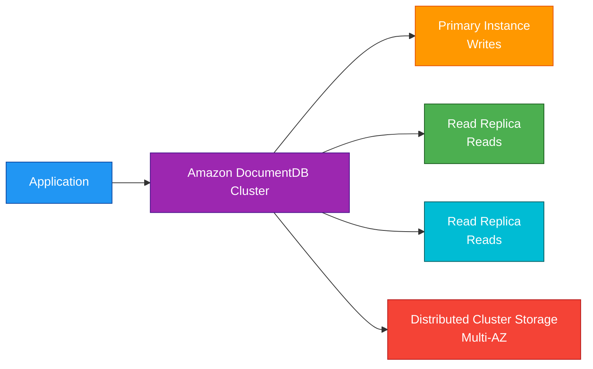
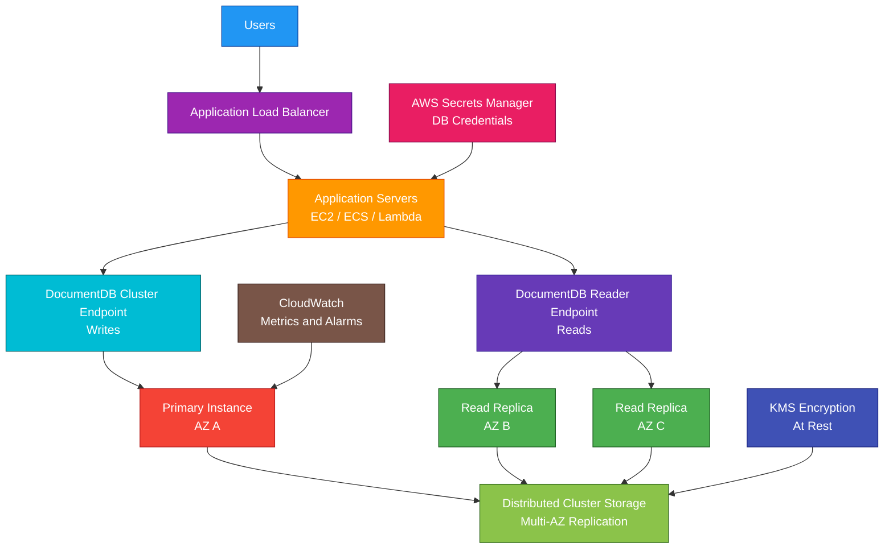

# Amazon DocumentDB

<details>
<summary>

## 1. Definition

</summary>

### Simple Definition

Amazon DocumentDB is AWS’s managed document database service.

It is designed to store, query, and manage JSON-like document data and is compatible with MongoDB-style workloads.

### Memory Hook

DocumentDB = Managed MongoDB-compatible document database.

### Basic Idea

Applications store flexible JSON-like documents in Amazon DocumentDB.

AWS manages database infrastructure tasks such as replication, backups, patching, and failover.



### Key Point

Amazon DocumentDB is for document data.

It is not a relational SQL database like RDS or Aurora.

</details>

<details>
<summary>

## 2. What Problem Does It Solve?

</summary>

### Main Problem

Amazon DocumentDB solves the problem of running a scalable, highly available document database without managing database servers yourself.

### Without Amazon DocumentDB

You may need to manage:

- MongoDB-compatible database servers
- Replication
- Backups
- Patching
- Failover
- Scaling
- Monitoring
- Storage growth
- Hardware maintenance
- High availability setup

### With Amazon DocumentDB

AWS manages much of the database infrastructure.

You focus on:

- Data model
- Indexes
- Queries
- Application logic
- Security configuration
- Scaling decisions
- Performance tuning

### Key Benefit

Amazon DocumentDB gives you a managed document database for applications that need flexible JSON-like data storage.

</details>

<details>
<summary>

## 3. Core Use Cases

</summary>

### Content Management

Use DocumentDB when content has flexible structure.

Examples:

- Articles
- Pages
- Comments
- Media metadata
- User-generated content

### Product Catalogs

Use DocumentDB for product catalogs where different products have different attributes.

Example:

A laptop has CPU and RAM fields.

A shoe has size and color fields.

Document databases handle this flexible structure well.

### User Profiles

Use DocumentDB for user profile data that can vary between users.

Examples:

- Preferences
- Settings
- Addresses
- Activity metadata
- App-specific profile fields

### Mobile and Web Applications

Use DocumentDB as a backend database for applications that store JSON-like data.

Examples:

- Mobile app user state
- App settings
- Customer preferences
- Session-related metadata

### Metadata Storage

Use DocumentDB to store metadata with flexible fields.

Examples:

- File metadata
- IoT device metadata
- Asset metadata
- Document properties

### MongoDB-Compatible Application Migration

Use DocumentDB when migrating MongoDB-style applications to a managed AWS database service.

### Flexible Schema Applications

Use DocumentDB when the application data model changes frequently and does not fit a rigid relational schema well.

</details>

<details>
<summary>

## 4. Important Features for SAA

</summary>

### Document Database

A document database stores data as documents instead of rows and tables.

Documents are usually JSON-like structures.

Example:

```json
{
  "userId": "123",
  "name": "Amina",
  "preferences": {
    "language": "en",
    "theme": "dark"
  },
  "orders": [
    {
      "orderId": "A100",
      "amount": 49.99
    }
  ]
}
```

### Flexible Schema

DocumentDB supports flexible document structures.

This means not every document in a collection must have the exact same fields.

### Collection

A collection is a group of documents.

It is similar to a table in a relational database, but it stores documents.

Example collections:

- `users`
- `products`
- `orders`
- `sessions`

### Document

A document is one record in a collection.

It stores data as fields and values.

### MongoDB Compatibility

Amazon DocumentDB is compatible with many MongoDB APIs, drivers, and tools.

Important exam point:

DocumentDB is MongoDB-compatible, but it is not the same as self-managed MongoDB.

Always check feature compatibility for real migrations.

### Cluster

A DocumentDB cluster contains:

- One primary instance
- Optional read replicas
- Distributed shared cluster storage

### Primary Instance

The primary instance handles write operations.

Applications send writes to the cluster endpoint, which points to the primary.

### Read Replicas

Read replicas handle read traffic.

They can improve read scalability and availability.

### Cluster Storage

DocumentDB separates compute from storage.

The storage layer is distributed and replicated across multiple Availability Zones.

### Storage Auto Scaling

DocumentDB storage automatically grows as your data increases.

You do not need to provision a fixed storage size upfront.

### Cluster Endpoint

The cluster endpoint connects to the current primary instance.

Use this endpoint for write operations.

### Reader Endpoint

The reader endpoint load balances read traffic across available read replicas.

Use this endpoint for read-heavy workloads.

### Instance Endpoint

Each instance also has its own endpoint.

Use instance endpoints only when you need to connect to a specific instance.

### Replication

DocumentDB replicates data to support high availability and read scaling.

Read replicas can be promoted during failover.

### Automatic Failover

If the primary instance fails, DocumentDB can automatically fail over to a replica.

This helps improve availability.

### Backup and Restore

DocumentDB supports automated backups and point-in-time recovery.

Use backups to recover from:

- Accidental deletes
- Bad application changes
- Corruption
- Operational mistakes

### Backup Retention

Automated backups are retained based on the configured retention period.

For SAA, remember:

Backups support point-in-time recovery within the retention window.

### Snapshots

Manual snapshots are point-in-time backups.

Important points:

- Created manually
- Kept until deleted
- Can be copied
- Useful before major changes

### Point-in-Time Recovery

Point-in-time recovery lets you restore the cluster to a specific time within the backup retention period.

### Indexes

Indexes improve query performance.

Without proper indexes, queries may scan many documents and become slow.

### Change Streams

Change streams allow applications to receive change events from the database.

Use them for event-driven patterns such as:

- Audit processing
- Cache updates
- Search index updates
- Downstream data sync

### Global Clusters

Amazon DocumentDB supports global cluster patterns for cross-Region disaster recovery and global reads.

Use this when applications need data replicated to another Region.

### Performance Monitoring

Use CloudWatch and database metrics to monitor:

- CPU utilization
- Memory usage
- Database connections
- Read/write latency
- Replica lag
- I/O activity
- Storage usage

</details>

<details>
<summary>

## 5. Security Model

</summary>

### IAM Permissions

IAM controls who can create, modify, delete, and manage DocumentDB resources.

Common permissions:

| Permission | Purpose |
|---|---|
| `docdb:CreateDBCluster` | Create DocumentDB cluster |
| `docdb:CreateDBInstance` | Create database instance |
| `docdb:ModifyDBCluster` | Modify cluster settings |
| `docdb:DeleteDBCluster` | Delete cluster |
| `docdb:CreateDBClusterSnapshot` | Create manual snapshot |
| `docdb:RestoreDBClusterFromSnapshot` | Restore from snapshot |
| `docdb:DescribeDBClusters` | View cluster details |

### Database Authentication

Applications authenticate to DocumentDB using database credentials.

Store credentials securely using:

- AWS Secrets Manager
- Systems Manager Parameter Store
- KMS-encrypted configuration

### Secrets Manager Integration

Use Secrets Manager to store DocumentDB credentials.

This avoids hardcoding passwords in application code.

### Security Groups

DocumentDB uses VPC security groups to control network access.

Best practice:

Allow database access only from application security groups.

Example:

Application security group can connect to DocumentDB on the database port.

### VPC Placement

DocumentDB runs inside a VPC.

Production clusters should usually be placed in private subnets.

### Public Access

DocumentDB should not be exposed directly to the public internet.

Use private networking and controlled application access.

### Encryption at Rest

DocumentDB supports encryption at rest using AWS KMS.

Encryption protects:

- Cluster storage
- Backups
- Snapshots
- Replicas

### Encryption in Transit

Use TLS to encrypt traffic between applications and DocumentDB.

This protects data moving over the network.

### KMS Key Permissions

If using a customer managed KMS key, make sure the correct users and services can use the key.

Wrong KMS permissions can break snapshot restore, backup operations, or access to encrypted resources.

### Least Privilege

Use least privilege for both AWS access and database access.

Examples:

- Application role should not manage clusters
- Developers should not have production admin access unless required
- Database users should have only needed privileges

### Audit and Monitoring

Use AWS monitoring and logging tools to track activity.

Common services:

- CloudTrail for AWS API activity
- CloudWatch for metrics and alarms
- Database audit logs where configured

### Shared Responsibility

AWS is responsible for:

- DocumentDB managed infrastructure
- Distributed storage layer
- Hardware maintenance
- Managed backups
- Managed patching options
- Physical security
- Service availability

You are responsible for:

- Database users and passwords
- Security groups
- VPC design
- Encryption settings
- KMS key policies
- Secrets handling
- Index design
- Query security
- Backup retention settings
- Application-level access control

</details>

<details>
<summary>

## 6. High Availability / Durability Behavior

</summary>

### Availability

DocumentDB is designed for high availability when deployed with replicas across multiple Availability Zones.

### Multi-AZ Storage

DocumentDB cluster storage is distributed across multiple Availability Zones.

This improves durability and availability of stored data.

### Replicas Across AZs

For production, place read replicas in different Availability Zones.

This helps with failover if the primary instance or an AZ has issues.

### Automatic Failover

If the primary instance fails, DocumentDB can promote a replica to become the new primary.

Applications should connect using the cluster endpoint so they can follow failover.

### Reader Endpoint Availability

The reader endpoint can distribute read traffic across replicas.

If a replica fails, traffic can be routed to healthy replicas.

### Durability

DocumentDB stores data in a distributed replicated storage layer.

This protects data better than storing it on one database instance.

### Backups

Automated backups support recovery within the backup retention period.

Manual snapshots can be kept longer.

### Multi-Region Behavior

DocumentDB is regional by default.

For Multi-Region disaster recovery, use features such as:

- Snapshot copy
- Global clusters
- Backup and restore
- Application-level replication patterns

### Replica Lag

Read replicas can have replication lag.

Applications that need strongly current data should read from the primary when necessary.

### Important Exam Point

DocumentDB high availability uses distributed storage, replicas, and automatic failover.

Read replicas help with read scaling and failover support.

</details>

<details>
<summary>

## 7. Cost Optimization Options

</summary>

### Right-Size Instances

Choose instance classes based on workload needs.

Avoid overprovisioning CPU and memory.

### Use Read Replicas Only When Needed

Read replicas improve read scalability and availability but add cost.

Use them when read traffic or HA requirements justify it.

### Stop Non-Production Clusters When Possible

For development and testing environments, stop clusters when not in use if supported by the workload and environment.

### Delete Unused Clusters

Unused clusters continue to create cost.

Delete old test, staging, or migration clusters.

### Manage Snapshots

Manual snapshots stay until deleted.

Delete old snapshots that are no longer needed.

### Optimize Indexes

Good indexes improve query performance.

Poor indexing can increase CPU, memory, and I/O usage.

### Avoid Over-Indexing

Too many indexes can slow writes and increase storage usage.

Create indexes based on real query patterns.

### Use Reader Endpoint for Read Scaling

Send read-heavy traffic to replicas using the reader endpoint.

This can reduce pressure on the primary instance.

### Choose Backup Retention Carefully

Longer backup retention can increase backup storage cost.

Set retention based on recovery and compliance needs.

### Monitor Query Performance

Use metrics and logs to find expensive queries.

Improving query design can be cheaper than scaling up.

### Use Appropriate Data Model

Store related data in documents when it fits access patterns.

Avoid document designs that cause unnecessary large reads or frequent full-collection scans.

</details>

<details>
<summary>

## 8. Common Exam Traps

</summary>

### DocumentDB vs DynamoDB

This is a common exam trap.

| Requirement | Choose |
|---|---|
| MongoDB-compatible document database | Amazon DocumentDB |
| Serverless key-value/document database at massive scale | DynamoDB |

### DocumentDB Is Not DynamoDB

DocumentDB is a managed document database with MongoDB compatibility.

DynamoDB is AWS’s serverless NoSQL key-value and document database.

### DocumentDB Is Not RDS

RDS is for relational SQL databases.

DocumentDB is for document data.

If the question requires SQL joins and relational constraints, think RDS or Aurora.

### DocumentDB Is Not Self-Managed MongoDB

DocumentDB is MongoDB-compatible but not identical to MongoDB.

Some MongoDB features or behaviors may differ.

### Primary Handles Writes

Writes go to the primary instance.

Read replicas are mainly for reads and failover.

### Reader Endpoint Is for Reads

Use the reader endpoint to distribute read traffic across replicas.

Use the cluster endpoint for writes.

### Storage Auto Scaling Does Not Mean Compute Auto Scaling

Storage can grow automatically, but database instances still need to be sized or scaled based on workload.

### Indexes Matter

DocumentDB can become slow if queries are not supported by proper indexes.

### Read Replicas Can Lag

Read replicas may not always have the newest data immediately.

For strongly current reads, read from the primary.

### DocumentDB Is Not Best for Analytics

For data warehousing and large analytics, choose Redshift or Athena.

### DocumentDB Should Be Private

Do not expose DocumentDB directly to the public internet.

Use private subnets and security groups.

### Backups Restore to a New Cluster

Restoring from backup or snapshot typically creates a new cluster.

It does not overwrite the existing cluster directly.

</details>

<details>
<summary>

## 9. Compare With Similar Services

</summary>

### Service Comparison Table

| Service | Main Purpose | Best For | Choose When |
|---|---|---|---|
| Amazon DocumentDB | Managed document database | MongoDB-compatible JSON-like workloads | You need a managed document database |
| DynamoDB | Serverless NoSQL database | Key-value and document access at massive scale | You need serverless low-latency NoSQL |
| Amazon RDS | Managed relational database | SQL transactions and joins | You need relational database engines |
| Amazon Aurora | High-performance relational database | Cloud-native MySQL/PostgreSQL-compatible workloads | You need scalable relational SQL |
| OpenSearch Service | Search and analytics | Full-text search and log analytics | You need search, indexing, and dashboards |
| Redshift | Data warehouse | Large-scale analytics and BI | You need OLAP reporting |

### DocumentDB vs DynamoDB

| Feature | DocumentDB | DynamoDB |
|---|---|---|
| Database type | Document database | Key-value/document NoSQL |
| Compatibility | MongoDB-compatible | AWS-native API |
| Scaling model | Cluster and instances | Serverless/provisioned table scaling |
| Query style | MongoDB-style queries | Key-based access patterns |
| Best for | MongoDB-style apps | Massive-scale serverless NoSQL |

### DocumentDB vs RDS

| Feature | DocumentDB | RDS |
|---|---|---|
| Data model | Documents | Relational tables |
| Query style | MongoDB-compatible API | SQL |
| Schema | Flexible | Structured schema |
| Best for | JSON-like flexible data | Transactions, joins, constraints |
| Example | Product catalog with variable attributes | Order processing database |

### DocumentDB vs Aurora

| Feature | DocumentDB | Aurora |
|---|---|---|
| Database type | Document | Relational |
| Compatibility | MongoDB-style | MySQL/PostgreSQL-compatible |
| Best for | Flexible JSON-like documents | High-performance SQL applications |
| Query language | MongoDB-style API | SQL |

### DocumentDB vs OpenSearch

| Feature | DocumentDB | OpenSearch |
|---|---|---|
| Main purpose | Store document data | Search and analytics |
| Best for | Application document database | Full-text search, logs, dashboards |
| Query style | Document database queries | Search/index queries |
| Common use together | Source data | Search index |

### DocumentDB vs Redshift

| Feature | DocumentDB | Redshift |
|---|---|---|
| Main purpose | Operational document database | Data warehouse |
| Workload | Application reads/writes | Analytics and reporting |
| Best for | JSON-like app data | OLAP queries |
| Example | User profiles | Business intelligence dashboards |

### When to Choose Amazon DocumentDB

Choose DocumentDB when:

- You need a managed document database
- Your application uses MongoDB-compatible APIs or drivers
- Your data is JSON-like and flexible
- Your schema changes frequently
- You need managed backups and failover
- You need read replicas for read scaling
- You want AWS to manage database infrastructure
- You do not need relational SQL joins as the main access pattern

</details>

<details>
<summary>

## 10. Mini Architecture Example

</summary>

### Scenario

A company is building a product catalog application.

Products have different attributes depending on category.

The application needs a flexible data model, high availability, and read scaling.

### Architecture

Use Amazon DocumentDB as the managed document database.

Application servers connect to the cluster endpoint for writes and the reader endpoint for reads.

DocumentDB stores product documents with flexible attributes.

The cluster uses replicas across multiple Availability Zones.



### Why This Is Good

- DocumentDB supports flexible product documents
- Different product categories can have different attributes
- Cluster endpoint handles writes to the primary
- Reader endpoint distributes reads across replicas
- Replicas improve read scalability and failover support
- Multi-AZ storage improves durability
- Secrets Manager keeps credentials out of application code
- KMS encrypts data at rest
- CloudWatch monitors performance and health
- Application does not manage database servers

### Exam Answer Pattern

If the question says:

“Run a managed MongoDB-compatible document database.”

Think:

Amazon DocumentDB.

If the question says:

“Run a serverless key-value database with single-digit millisecond latency.”

Think:

DynamoDB.

If the question says:

“Run relational SQL workloads with joins and transactions.”

Think:

RDS or Aurora.

If the question says:

“Run full-text search or log analytics.”

Think:

Amazon OpenSearch Service.

### Final Memory Hook

DocumentDB = Managed document database.

MongoDB-compatible = Works with many MongoDB-style apps and drivers.

Document = JSON-like record.

Collection = Group of documents.

Flexible schema = Documents can have different fields.

Primary = Handles writes.

Read replica = Handles reads and failover.

Cluster endpoint = Writes.

Reader endpoint = Read scaling.

Storage auto grows = Less storage planning.

Backups = Point-in-time recovery.

DynamoDB = Serverless NoSQL.

RDS/Aurora = Relational SQL.

OpenSearch = Search and analytics.

</details>