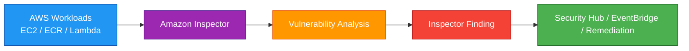
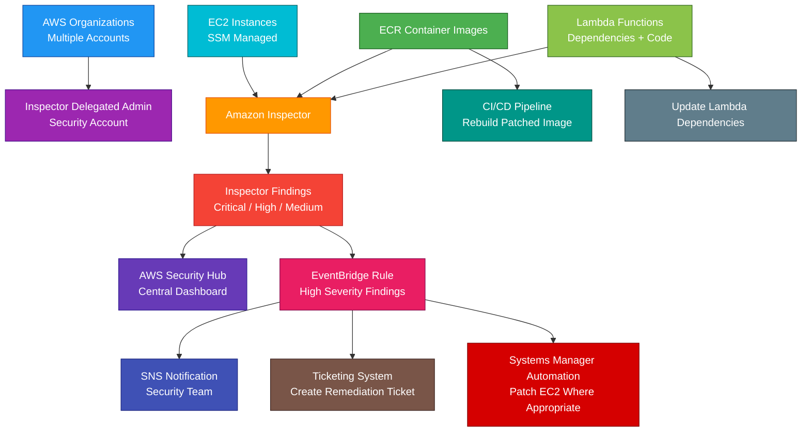

# Amazon Inspector

## 1. Definition

### Simple Definition

Amazon Inspector is a managed vulnerability management service.

It automatically scans AWS workloads for software vulnerabilities, package vulnerabilities, and unintended network exposure.

### Memory Hook

Inspector = Vulnerability scanner for AWS workloads.

### Basic Idea

Amazon Inspector continuously scans supported resources.

When it finds a vulnerability or exposure, it creates a finding with severity and remediation guidance.

### Key Point

Amazon Inspector is a detective security service.

It finds vulnerabilities and exposure risks.

It does not automatically patch everything for you unless you build remediation workflows with other services.

## 2. What Problem Does It Solve?

### Main Problem

Amazon Inspector solves the problem of finding vulnerabilities in AWS workloads without manually scanning each server, container image, or function yourself.

### Without Amazon Inspector

You may struggle with:

- Unpatched EC2 packages
- Vulnerable container images
- Vulnerable Lambda dependencies
- Unknown CVEs
- Manual vulnerability scans
- Poor security visibility across accounts
- Hard-to-prioritize vulnerabilities
- Missed exposure from open network paths

### With Amazon Inspector

AWS continuously scans supported resources and creates findings with severity, affected resource, vulnerability details, and remediation guidance.

### Key Benefit

Amazon Inspector helps you identify and prioritize vulnerabilities before attackers can exploit them.

## 3. Core Use Cases

### EC2 Vulnerability Scanning

Use Inspector to scan EC2 instances for vulnerable software packages.

Examples:

- Outdated OpenSSL package
- Vulnerable Linux library
- Known CVE in installed software
- Missing security update

### ECR Container Image Scanning

Use Inspector to scan container images stored in Amazon ECR.

Examples:

- Vulnerable base image
- Vulnerable package inside container image
- Critical CVE in application dependency

### Lambda Vulnerability Scanning

Use Inspector to scan Lambda functions for vulnerable dependencies.

Examples:

- Vulnerable Python package
- Vulnerable Node.js dependency
- Vulnerable Java library

### Lambda Code Scanning

Inspector can also analyze supported Lambda code for certain code security issues.

Examples:

- Hardcoded secrets
- Insecure coding patterns
- Potential security weaknesses in function code

### Network Reachability Analysis

Use Inspector to identify unintended network exposure.

Example:

An EC2 instance is reachable from the internet on a risky port.

### Multi-Account Vulnerability Management

Use Amazon Inspector with AWS Organizations to centrally manage scanning across multiple accounts.

### Security Finding Aggregation

Send Inspector findings to AWS Security Hub for centralized security visibility.

### Automated Remediation Workflows

Use EventBridge to respond to Inspector findings.

Examples:

- Create a ticket
- Notify security team
- Trigger patch workflow
- Start Systems Manager Automation
- Block vulnerable image deployment

## 4. Important Features for SAA

### Continuous Scanning

Amazon Inspector continuously scans supported resources.

Important point:

You do not need to manually run one-time scans for every resource.

Inspector updates findings when resources, packages, or vulnerability data changes.

### Supported Resource Types

Amazon Inspector commonly scans:

| Resource Type | What Inspector Checks |
|---|---|
| EC2 instances | Operating system and package vulnerabilities |
| ECR container images | Container image package vulnerabilities |
| Lambda functions | Function dependency vulnerabilities |
| Lambda code | Certain code security issues |
| Network exposure | Unintended network reachability |

### Finding

A finding is a security issue discovered by Inspector.

A finding includes:

- Affected resource
- Vulnerability ID
- Severity
- Package or dependency affected
- Remediation guidance
- Exploitability context
- Network reachability context where applicable

### CVE

CVE means Common Vulnerabilities and Exposures.

It is a public identifier for known security vulnerabilities.

Example:

`CVE-2024-12345`

### CVSS

CVSS means Common Vulnerability Scoring System.

It helps rate vulnerability severity.

Higher scores usually mean more serious vulnerabilities.

### Inspector Risk Score

Amazon Inspector can prioritize findings using context such as:

- CVSS score
- Network reachability
- Exploit availability
- Affected resource
- Package details

### Severity Levels

Inspector findings use severity levels.

| Severity | Meaning |
|---|---|
| Informational | Useful security information |
| Low | Lower-risk issue |
| Medium | Needs attention |
| High | Serious issue |
| Critical | Urgent issue |

### EC2 Scanning Requirements

For EC2 scanning, Inspector relies on AWS Systems Manager inventory and instance information.

Important exam point:

EC2 instances generally need to be managed by Systems Manager for Inspector to scan installed packages effectively.

### Systems Manager Agent

The SSM Agent helps AWS Systems Manager collect inventory from EC2 instances.

For EC2 scanning, make sure:

- SSM Agent is installed and running
- Instance has correct IAM role
- Instance can reach Systems Manager endpoints
- Inventory collection is enabled where required

### ECR Image Scanning

Inspector integrates with Amazon ECR for enhanced container image scanning.

Important points:

- Scans images in ECR repositories
- Detects package vulnerabilities
- Can scan new images after push
- Can rescan images when new CVEs are published

### Basic vs Enhanced ECR Scanning

| ECR Scanning Type | Description |
|---|---|
| Basic scanning | Simpler ECR image vulnerability scanning |
| Enhanced scanning | Uses Amazon Inspector for continuous and deeper scanning |

### Lambda Standard Scanning

Lambda standard scanning checks function dependencies for known vulnerabilities.

Use it to detect vulnerable packages used by Lambda functions.

### Lambda Code Scanning

Lambda code scanning looks for certain code security issues.

Example:

A secret accidentally hardcoded into Lambda source code.

### Network Reachability

Network reachability findings show if EC2 instances are reachable from external networks on certain ports.

This helps find exposure risks.

Examples:

- SSH open to the internet
- RDP open to the internet
- Database port exposed publicly
- Risky service reachable externally

### Delegated Administrator

With AWS Organizations, you can configure a delegated administrator account for Amazon Inspector.

This allows centralized Inspector management across accounts.

### Auto-Enable for New Accounts

In an organization, Inspector can be configured to automatically enable scanning for new member accounts.

This helps maintain security coverage as accounts are added.

### Security Hub Integration

Inspector findings can be sent to AWS Security Hub.

Security Hub provides a centralized security findings dashboard.

### EventBridge Integration

Inspector sends events to Amazon EventBridge.

Use EventBridge rules to trigger automated response workflows.

### Suppression Rules

Suppression rules can hide or archive findings that match specific criteria.

Use them carefully for known acceptable risks.

### Software Bill of Materials

Inspector can help support software inventory and vulnerability visibility for workloads.

For SAA, focus mainly on vulnerability findings and supported resource scanning.

## 5. Security Model

### IAM Permissions

IAM controls who can enable, manage, and view Amazon Inspector.

Common permissions:

| Permission | Purpose |
|---|---|
| `inspector2:Enable` | Enable Inspector scanning |
| `inspector2:Disable` | Disable Inspector scanning |
| `inspector2:ListFindings` | List findings |
| `inspector2:BatchGetFindings` | View finding details |
| `inspector2:CreateFilter` | Create filters |
| `inspector2:CreateFindingsReport` | Export findings report |
| `inspector2:EnableDelegatedAdminAccount` | Enable delegated admin |

### Service-Linked Role

Amazon Inspector uses service-linked roles to access required AWS resources and perform scans.

Important point:

Do not delete Inspector service-linked roles unless Inspector is disabled and you understand the impact.

### EC2 Access Requirements

For EC2 scanning, instances need Systems Manager access.

Common requirements:

- SSM Agent installed
- IAM instance profile with Systems Manager permissions
- Network access to Systems Manager endpoints
- Inventory collection support

### ECR Access

Inspector integrates with ECR to scan container images.

Make sure repository scanning settings are configured correctly.

### Lambda Access

Inspector analyzes supported Lambda functions and dependencies.

Make sure Inspector is enabled for Lambda scanning where needed.

### Encryption at Rest

Inspector findings and service data are managed by AWS.

If exporting findings to S3, configure encryption for the destination bucket.

### Encryption in Transit

Inspector API calls use HTTPS.

Findings sent to services such as EventBridge or Security Hub use AWS service integrations.

### Least Privilege

Security teams may need read and management access to Inspector.

Application teams may only need access to findings for their resources.

### Finding Export Security

If exporting findings, protect the destination.

Use:

- S3 encryption
- Bucket policies
- S3 Block Public Access
- KMS key policies
- Least privilege IAM access

### Shared Responsibility

AWS is responsible for:

- Inspector managed service infrastructure
- Vulnerability intelligence integration
- Finding generation
- Managed scanning service availability
- Physical security

You are responsible for:

- Enabling Inspector in needed accounts and Regions
- Enabling required scan types
- Fixing vulnerabilities
- Patching EC2 instances
- Updating container images
- Updating Lambda dependencies
- Configuring Systems Manager for EC2 scanning
- Reviewing and responding to findings
- Securing exported reports

## 6. High Availability / Durability Behavior

### Availability

Amazon Inspector is a managed regional service.

AWS manages the scanning service infrastructure.

### Regional Behavior

Amazon Inspector is enabled per Region.

Important exam point:

If Inspector is enabled in one Region, it does not automatically scan resources in every other Region.

### Multi-Account Behavior

With AWS Organizations, Inspector can be centrally managed across multiple accounts.

This improves visibility and helps enforce consistent vulnerability scanning.

### Multi-AZ Behavior

Inspector is managed by AWS.

You do not configure Multi-AZ for the Inspector service itself.

### Finding Availability

Findings are available in the Inspector console and can be integrated with:

- Security Hub
- EventBridge
- S3 reports
- Ticketing or SIEM systems through automation

### Finding Durability

Inspector is not designed as long-term archival storage for all security history.

For long-term retention, export findings to S3 or forward them to a security platform.

### Scan Continuity

Inspector continuously updates findings when:

- New vulnerabilities are published
- Packages change
- New container images are pushed
- Lambda functions change
- Resources are created or deleted

### Multi-Region Strategy

For Multi-Region environments, enable Inspector in each active Region.

Use AWS Organizations and centralized reporting for easier management.

### Important Exam Point

Inspector helps find vulnerabilities, but it does not make applications highly available or durable.

It improves security visibility.

## 7. Cost Optimization Options

### Enable Needed Scan Types

Inspector cost depends on the resources and scan types used.

Enable scan types based on actual workload needs.

Examples:

- EC2 scanning
- ECR scanning
- Lambda scanning
- Lambda code scanning

### Use AWS Organizations for Visibility

Centralized management helps identify unnecessary scanning, unused accounts, or inactive Regions.

### Disable Unused Regions

If your organization does not use certain Regions, restrict or disable unused Regions with governance controls.

This reduces unnecessary resource creation and scanning scope.

### Clean Up Unused Resources

Inspector scans supported resources.

Delete unused:

- EC2 instances
- Old ECR images
- Unused Lambda functions
- Test resources
- Old accounts or environments

### Reduce Old ECR Image Sprawl

Container registries can accumulate many old images.

Use lifecycle policies in ECR to expire old images.

This reduces scanning scope and storage cost.

### Prioritize Critical Findings

Focus remediation effort on:

- Critical findings
- High findings
- Internet-exposed resources
- Exploitable vulnerabilities
- Production workloads

### Use Suppression Rules Carefully

Suppress findings only when they are known and accepted.

Do not suppress findings only to reduce noise without risk review.

### Automate Remediation

Automation can reduce operational cost.

Examples:

- Create patch tickets
- Notify owners
- Trigger Systems Manager patch workflows
- Block vulnerable images in CI/CD

### Monitor Usage

Use AWS billing tools and Inspector usage reports to monitor cost.

Helpful tools:

- AWS Cost Explorer
- AWS Budgets
- Inspector usage views
- Tags for ownership and cost allocation

### Patch Regularly

Regular patching reduces the number of findings and lowers remediation backlog over time.

## 8. Common Exam Traps

### Inspector vs GuardDuty

This is the biggest exam trap.

| Requirement | Choose |
|---|---|
| Find vulnerabilities and exposure | Amazon Inspector |
| Detect suspicious or malicious activity | GuardDuty |

### Inspector Is Vulnerability Management

Inspector finds known vulnerabilities and exposure.

It does not detect active attackers the same way GuardDuty does.

### Inspector Does Not Replace Patch Manager

Inspector finds vulnerabilities.

Systems Manager Patch Manager can help patch EC2 instances.

They are commonly used together.

### Inspector Does Not Automatically Patch Everything

Inspector gives findings and remediation guidance.

You still need to update packages, rebuild images, patch instances, or update dependencies.

### Inspector vs Security Hub

Inspector creates vulnerability findings.

Security Hub aggregates findings from Inspector, GuardDuty, Macie, and other services.

### Inspector vs Macie

Inspector finds software vulnerabilities.

Macie discovers sensitive data in S3.

### Inspector vs WAF

Inspector scans for vulnerabilities.

WAF blocks malicious HTTP/HTTPS requests.

### Inspector vs Shield

Inspector finds vulnerabilities.

Shield protects against DDoS attacks.

### Inspector Is Regional

Enable Inspector in each Region where scanning is needed.

### EC2 Scanning Needs Systems Manager Support

If EC2 instances are not managed by Systems Manager, Inspector may not be able to collect package inventory properly.

### Container Image Findings Need Image Updates

To fix ECR image vulnerabilities, usually rebuild the image with patched packages and redeploy it.

### Lambda Findings Need Dependency Updates

To fix Lambda dependency vulnerabilities, update the function package or layer dependencies.

### Network Reachability Is Exposure, Not Proof of Attack

A network reachability finding means something may be reachable.

It does not always mean an attacker has exploited it.

### Suppression Does Not Fix Vulnerabilities

Suppression hides or archives findings.

It does not remediate the issue.

## 9. Compare With Similar Services

### Service Comparison Table

| Service | Main Purpose | Best For | Choose When |
|---|---|---|---|
| Amazon Inspector | Vulnerability management | EC2, ECR, Lambda vulnerability scanning | You need to find CVEs and exposure risks |
| Amazon GuardDuty | Threat detection | Suspicious or malicious activity detection | You need to detect compromised resources or credentials |
| AWS Security Hub | Findings aggregation | Central security posture dashboard | You need one place for security findings |
| Amazon Detective | Security investigation | Root-cause analysis of findings | You need to investigate suspicious activity |
| Amazon Macie | Sensitive data discovery | Finding PII or sensitive data in S3 | You need data classification |
| AWS Systems Manager Patch Manager | Patch management | Patching EC2 instances | You need to apply OS/software patches |
| AWS WAF | Web application firewall | Blocking web attacks | You need to block SQL injection, XSS, or bad bots |

### Inspector vs GuardDuty

| Feature | Amazon Inspector | Amazon GuardDuty |
|---|---|---|
| Main purpose | Vulnerability scanning | Threat detection |
| Looks for | CVEs, exposed ports, vulnerable packages | Suspicious behavior and attacks |
| Example | EC2 has vulnerable OpenSSL | EC2 talks to malicious IP |
| Action type | Detective vulnerability management | Detective threat detection |
| Best for | Finding what needs fixing | Detecting possible compromise |

### Inspector vs Security Hub

| Feature | Amazon Inspector | AWS Security Hub |
|---|---|---|
| Main purpose | Generate vulnerability findings | Aggregate security findings |
| Creates findings | Yes | Mostly aggregates and normalizes |
| Best for | Scanning workloads | Central security dashboard |
| Common use together | Sends findings to Security Hub | Displays Inspector findings |

### Inspector vs Systems Manager Patch Manager

| Feature | Amazon Inspector | Patch Manager |
|---|---|---|
| Main purpose | Find vulnerabilities | Apply patches |
| Output | Findings | Patch compliance and patch actions |
| Best for | Knowing what is vulnerable | Fixing EC2 patch gaps |
| Common use together | Inspector identifies issue | Patch Manager remediates EC2 |

### Inspector vs Macie

| Feature | Amazon Inspector | Amazon Macie |
|---|---|---|
| Main purpose | Vulnerability management | Sensitive data discovery |
| Focus | Workload software and exposure | S3 data classification |
| Example | Container image has CVE | S3 object contains PII |
| Best for | Patch and dependency risk | Data privacy risk |

### Inspector vs WAF

| Feature | Amazon Inspector | AWS WAF |
|---|---|---|
| Main purpose | Find vulnerabilities | Block web requests |
| Action type | Detective | Preventive/protective |
| Example | Lambda has vulnerable dependency | Block SQL injection request |
| Best for | Vulnerability visibility | Application-layer protection |

### When to Choose Amazon Inspector

Choose Amazon Inspector when:

- You need vulnerability scanning
- You need EC2 package vulnerability detection
- You need ECR image scanning
- You need Lambda dependency scanning
- You need Lambda code security scanning
- You need network exposure findings
- You need CVE-based findings
- You need multi-account vulnerability visibility
- You need findings sent to Security Hub or EventBridge

## 10. Mini Architecture Example

### Scenario

A company runs applications on EC2, stores container images in ECR, and uses Lambda functions.

The security team wants continuous vulnerability scanning and centralized findings.

### Architecture

Enable Amazon Inspector across the organization.

Inspector scans EC2 instances, ECR images, and Lambda functions.

Findings are sent to Security Hub for central visibility.

High-severity findings trigger EventBridge workflows for notifications and remediation tickets.

### Why This Is Good

- Inspector continuously scans supported workloads
- EC2 instances are checked for vulnerable packages
- ECR images are checked for vulnerable container packages
- Lambda functions are checked for vulnerable dependencies and supported code issues
- Security Hub centralizes findings
- EventBridge enables automated response
- SNS notifies the security team
- Tickets help track remediation
- Systems Manager can help patch EC2 instances
- CI/CD can rebuild vulnerable container images
- Lambda dependencies can be updated and redeployed

### Exam Answer Pattern

If the question says:

“Scan EC2 instances, ECR container images, or Lambda functions for software vulnerabilities.”

Think:

Amazon Inspector.

If the question says:

“Detect suspicious activity or compromised credentials.”

Think:

Amazon GuardDuty.

If the question says:

“Aggregate findings from multiple AWS security services.”

Think:

AWS Security Hub.

If the question says:

“Patch EC2 instances automatically.”

Think:

AWS Systems Manager Patch Manager.

### Final Memory Hook

Inspector = Vulnerability scanner.

GuardDuty = Threat detector.

Security Hub = Findings dashboard.

Detective = Investigation tool.

Macie = Sensitive data discovery.

WAF = Blocks web attacks.

Shield = DDoS protection.

Patch Manager = Applies patches.

CVE = Known vulnerability.

CVSS = Vulnerability severity score.

Finding = Inspector security issue.

EC2 scanning needs Systems Manager support.

ECR fix = Rebuild image.

Lambda fix = Update dependencies.

