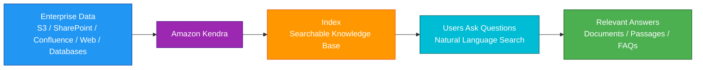
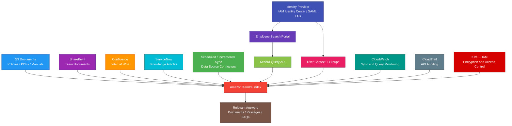

# Amazon Kendra

<details>
<summary>

## 1. Definition

</summary>

### Simple Definition

Amazon Kendra is AWS’s managed intelligent search service for enterprise documents and knowledge bases.

It helps users search across company data using natural language questions instead of only keyword matching.

### Memory Hook

Kendra = Intelligent enterprise search.

### Basic Idea

You connect Kendra to your data sources.

Kendra indexes the content.

Users search with natural language, and Kendra returns relevant answers and documents.



### Key Point

Amazon Kendra is for intelligent enterprise search.

It is not mainly for log analytics, transactional data, business intelligence dashboards, or simple object storage.

</details>

<details>
<summary>

## 2. What Problem Does It Solve?

</summary>

### Main Problem

Amazon Kendra solves the problem of finding accurate information across many company documents and systems.

Many organizations have useful information spread across PDFs, websites, SharePoint, Confluence, S3, databases, and internal knowledge bases.

### Without Kendra

Users may struggle with:

- Searching many systems separately
- Poor keyword search results
- Hard-to-find internal documents
- Duplicate or outdated information
- No natural language search
- No unified enterprise search experience
- Manual knowledge base maintenance
- Poor relevance ranking

### With Kendra

Users can search across connected data sources from one intelligent search experience.

### Key Benefit

Kendra helps users find the right answer faster across enterprise content.

</details>

<details>
<summary>

## 3. Core Use Cases

</summary>

### Enterprise Search

Use Kendra to let employees search across company documents.

Examples:

- HR policies
- Engineering docs
- Legal documents
- Product documentation
- Internal wikis
- Training materials

### Knowledge Base Search

Use Kendra for intelligent knowledge base search.

Example:

A support agent searches for troubleshooting steps across internal runbooks and support articles.

### Customer Support Search

Use Kendra to help support teams find answers faster.

Examples:

- Support articles
- Case resolutions
- FAQ documents
- Product manuals
- Troubleshooting guides

### Website Search

Use Kendra to power search over public or private websites.

Example:

A company documentation site lets users ask natural language questions.

### Document Search

Use Kendra to search through unstructured documents.

Examples:

- PDFs
- Word documents
- HTML pages
- Text files
- Presentations
- Manuals

### Natural Language Question Answering

Use Kendra when users want to ask questions like:

```text
How do I reset my VPN password?
```

Instead of searching only for exact keywords.

### Secure Internal Search

Use Kendra when search results must respect user access permissions.

Example:

A user should only see documents they are authorized to view.

### Generative AI Retrieval Support

Use Kendra as a retrieval source for applications that need trusted enterprise knowledge.

Example:

An AI assistant searches Kendra first, then uses the retrieved documents to answer questions.

</details>

<details>
<summary>

## 4. Important Features for SAA

</summary>

### Index

An index is the main Kendra search resource.

It stores searchable representations of your documents.

Think of it as the search engine for your enterprise content.

### Document

A document is one searchable content item.

Examples:

- PDF file
- Web page
- Wiki page
- FAQ entry
- Word document
- Internal article

### Data Source

A data source is where Kendra reads content from.

Common data source examples:

| Data Source | Example Use |
|---|---|
| Amazon S3 | Search documents stored in buckets |
| SharePoint | Search company SharePoint content |
| Confluence | Search wiki and team docs |
| Salesforce | Search CRM records and knowledge articles |
| ServiceNow | Search service tickets and knowledge articles |
| Web crawler | Search public or internal websites |
| Database connector | Search structured or semi-structured data |

### Data Source Connector

A connector lets Kendra ingest content from a specific system.

Example:

A SharePoint connector lets Kendra crawl and index SharePoint pages and files.

### Synchronization

Synchronization updates the Kendra index with new, changed, or deleted content from a data source.

Sync can be:

- Manual
- Scheduled
- Incremental, depending on source support

### Incremental Sync

Incremental sync updates only changed content.

This can reduce indexing time and cost.

### Full Sync

Full sync crawls and reindexes the source content.

Use it when:

- First setting up a data source
- Major source changes occur
- Incremental sync is not enough
- Index content needs to be rebuilt

### Natural Language Search

Kendra understands natural language questions better than simple keyword search.

Example:

User asks:

```text
What is the reimbursement policy for travel meals?
```

Kendra can return the most relevant policy document or answer passage.

### Semantic Search

Semantic search focuses on meaning, not only exact word matching.

Example:

A search for `vacation policy` may find documents about `paid time off`.

### Relevance Ranking

Kendra ranks results based on relevance.

More useful results appear higher.

Relevance can be improved with:

- Metadata
- Tuning
- Synonyms
- Featured results
- High-quality content
- User feedback

### Extractive Answers

Kendra can return specific answer passages from documents.

Example:

Instead of only returning a 50-page PDF, Kendra can highlight the section that answers the question.

### FAQ Matching

Kendra supports FAQ-style content.

Use FAQs when you have common questions and direct answers.

Example:

| Question | Answer |
|---|---|
| How do I reset my password? | Use the password reset portal. |

### Metadata

Metadata adds extra information to documents.

Examples:

- Department
- Author
- Created date
- Document type
- Region
- Product
- Security classification

### Metadata Filtering

Users or applications can filter search results using metadata.

Examples:

- Show only HR documents
- Show only documents from 2026
- Show only engineering runbooks
- Show only public documents

### Faceted Search

Faceted search lets users narrow results by categories.

Examples:

- Document type
- Department
- Author
- Date
- Product
- Region

### Synonyms

Synonyms help Kendra understand related terms.

Example:

```text
PTO = paid time off = vacation
```

This improves search results when users use different wording.

### Featured Results

Featured results let administrators promote specific documents for certain search queries.

Example:

When users search `VPN setup`, show the official VPN guide first.

### Relevance Tuning

Relevance tuning changes how Kendra ranks documents.

Example:

Boost newer documents or official policy documents higher than older draft content.

### Access Control

Kendra can enforce document-level access control.

Important point:

Users should only see search results they are allowed to access.

### ACL

ACL means Access Control List.

It defines which users or groups can access a document.

Kendra can use ACL information from connected data sources where supported.

### User Context Filtering

User context filtering helps Kendra return only documents the user is authorized to see.

Example:

Finance users see finance documents; engineering users see engineering-only documents.

### Identity Sources

Kendra can work with identity information to enforce secure search.

Examples:

- IAM Identity Center
- Active Directory
- External identity providers
- User and group mappings

### Query API

Applications can call Kendra APIs to search an index.

Example:

A web app sends a user question to Kendra and displays ranked results.

### Query Suggestions

Query suggestions help users by recommending likely search terms.

Example:

User types `expense`, and the search box suggests `expense reimbursement policy`.

### Spell Correction

Kendra can help handle spelling mistakes in search queries.

Example:

A user searches `benifits`, and Kendra understands `benefits`.

### Capacity Editions

Kendra has different index editions and capacity options.

For SAA, focus on the concept:

Choose the edition and capacity based on document count, query volume, and workload needs.

### GenAI Index Note

Kendra can be useful in generative AI architectures because it retrieves trusted enterprise documents that can be used as context for answers.

For SAA, remember Kendra primarily as intelligent enterprise search.

</details>

<details>
<summary>

## 5. Security Model

</summary>

### IAM Permissions

IAM controls who can create, manage, and query Kendra resources.

Common permissions:

| Permission | Purpose |
|---|---|
| `kendra:CreateIndex` | Create Kendra index |
| `kendra:DeleteIndex` | Delete Kendra index |
| `kendra:DescribeIndex` | View index details |
| `kendra:CreateDataSource` | Create data source |
| `kendra:StartDataSourceSyncJob` | Start data source sync |
| `kendra:Query` | Query an index |
| `kendra:BatchPutDocument` | Add documents to an index |
| `kendra:BatchDeleteDocument` | Delete documents from an index |

### Service Role

Kendra uses IAM service roles to access data sources and AWS resources.

Example:

A Kendra index needs permission to read documents from an S3 bucket.

### Least Privilege

Give Kendra only the permissions it needs.

Bad example:

Allow Kendra to read all S3 buckets.

Good example:

Allow Kendra to read only the specific bucket and prefix that contain searchable documents.

### S3 Source Security

If indexing S3 data, configure:

- S3 bucket policies
- IAM role permissions
- S3 Block Public Access
- Encryption
- Prefix-level restrictions

### Data Source Credentials

Some connectors require credentials to access external systems.

Examples:

- SharePoint credentials
- Salesforce credentials
- Database credentials
- Confluence credentials

Store credentials securely.

Use:

- AWS Secrets Manager
- KMS encryption
- Least privilege source accounts
- Credential rotation where possible

### Encryption at Rest

Kendra encrypts index data at rest.

You can use AWS KMS keys for encryption control where supported.

### Encryption in Transit

Use HTTPS/TLS for API calls and connector communication.

This protects data while moving between sources, Kendra, and applications.

### KMS Permissions

If using a customer managed KMS key, make sure Kendra and required principals can use the key.

Missing KMS permissions can cause indexing or query failures.

### Access Control Lists

Kendra can use ACLs to enforce document-level access control.

This helps prevent unauthorized users from seeing restricted documents.

### User Context

When an application queries Kendra, it can pass user context.

Kendra uses that context to filter results based on permissions.

### Private Data Sources

For private data sources, configure secure connectivity.

Examples:

- VPC access
- Private subnets
- Security groups
- VPN
- Direct Connect
- PrivateLink where applicable

### Sensitive Data

Kendra may index sensitive enterprise content.

Protect:

- Index access
- Query permissions
- Search application access
- Logs
- Data source credentials
- Indexed metadata

### CloudTrail Auditing

CloudTrail can record Kendra API activity.

Use it to audit:

- Index creation
- Index deletion
- Data source changes
- Sync job starts
- Query access
- Permission changes

### Monitoring

Use CloudWatch to monitor Kendra operational metrics.

Examples:

- Query count
- Query latency
- Data source sync status
- Indexing errors
- Throttling
- Failed sync jobs

### Shared Responsibility

AWS is responsible for:

- Kendra managed service infrastructure
- Search service availability
- Managed indexing platform
- Physical security
- Service-side encryption support

You are responsible for:

- IAM permissions
- Data source permissions
- Connector credentials
- KMS key policies
- Document ACLs
- User access filtering
- Data classification
- Search application authorization
- Monitoring sync errors
- Protecting sensitive indexed content

</details>

<details>
<summary>

## 6. High Availability / Durability Behavior

</summary>

### Availability

Amazon Kendra is a managed AWS service.

AWS manages the search service infrastructure.

### Regional Service

Kendra indexes are created in a specific AWS Region.

Applications should query the Kendra index in the Region where it is deployed.

### Multi-AZ Behavior

Kendra is managed by AWS across service infrastructure.

You do not manually configure Availability Zones for the Kendra service.

### Data Durability

Kendra is not usually the primary durable data store.

Your original documents should remain in source systems such as:

- S3
- SharePoint
- Confluence
- Salesforce
- Databases
- Internal document repositories

### Index Rebuild

If needed, the Kendra index can be rebuilt from the original data sources.

This is why source data durability matters.

### Source Dependency

Search freshness depends on data source synchronization.

If the source system is unavailable, sync jobs may fail or be delayed.

### Sync Failure Handling

If a sync job fails, the index may not include the latest content.

Monitor sync status and fix connector or permission issues.

### Query Availability

Applications should handle:

- Query errors
- Throttling
- Timeouts
- Regional service issues
- Authentication failures

### Multi-Region Behavior

Kendra does not automatically replicate indexes across Regions.

For Multi-Region search, design separately.

Options include:

- Create indexes in multiple Regions
- Replicate source data where needed
- Configure connectors in each Region
- Route users with Route 53 or application logic
- Keep metadata and access controls consistent

### Disaster Recovery

For Kendra search applications, protect:

- Source documents
- Index configuration
- Data source connector settings
- Synonym lists
- Featured results
- FAQ files
- IAM roles
- KMS keys
- Application configuration

### Important Exam Point

Kendra provides managed search, but the source repositories remain the system of record.

</details>

<details>
<summary>

## 7. Cost Optimization Options

</summary>

### Choose the Right Index Capacity

Select Kendra capacity based on:

- Number of documents
- Query volume
- Sync frequency
- Data source count
- Performance requirements

Avoid overprovisioning search capacity for small workloads.

### Index Only Needed Content

Do not index everything by default.

Index only content that users actually need to search.

Examples:

- Official docs
- Active knowledge base articles
- Current policies
- Important support articles

### Exclude Low-Value Content

Exclude content that is not useful.

Examples:

- Drafts
- Temporary files
- Old versions
- Duplicates
- Large archives
- System-generated files
- Irrelevant folders

### Use Metadata Filters

Use metadata to keep search focused.

Example:

Search only active documents or approved policies.

### Schedule Syncs Appropriately

Do not sync more often than business needs.

Examples:

- HR policies may sync daily
- Support articles may sync hourly
- Historical documents may sync weekly

### Use Incremental Sync

Use incremental sync where supported to avoid repeatedly reprocessing unchanged content.

### Clean Up Unused Indexes

Delete old test or proof-of-concept indexes that are no longer used.

### Manage Data Sources

Disable or remove unused data source connectors.

Unused connectors can create unnecessary sync activity and operational overhead.

### Improve Content Quality

Good content reduces unnecessary searches and user frustration.

Improve:

- Document titles
- Metadata
- FAQs
- Duplicates
- Outdated pages
- Official answer pages

### Monitor Query Usage

Track query patterns to identify:

- Unused indexes
- Common unanswered questions
- Poorly performing results
- Documents that should be promoted
- Opportunities to add FAQs

### Use Kendra When Intelligence Matters

If you only need simple keyword search, another solution may be cheaper.

Use Kendra when enterprise relevance, natural language search, and connector support matter.

</details>

<details>
<summary>

## 8. Common Exam Traps

</summary>

### Kendra vs OpenSearch

This is the biggest exam trap.

| Requirement | Choose |
|---|---|
| Intelligent enterprise document search | Amazon Kendra |
| Full-text search, log analytics, custom search engine | OpenSearch |

### Kendra Is Not Log Analytics

If the question says search logs, analyze application errors, or build observability dashboards, choose OpenSearch or CloudWatch Logs.

### Kendra Is Not Athena

Athena runs SQL queries on S3 data.

Kendra searches enterprise documents using natural language.

### Kendra Is Not Redshift

Redshift is a data warehouse for BI analytics.

Kendra is an enterprise search service.

### Kendra Is Not S3 Search

S3 stores objects.

Kendra indexes and searches document content.

Common pattern:

S3 stores documents; Kendra searches them.

### Kendra Is Not a Database

Do not use Kendra as the source of truth for application data.

It is a search index.

### Kendra Respects Permissions Only If Configured

If secure search is required, configure ACLs and user context correctly.

Otherwise, users may see results they should not access.

### Index Freshness Depends on Sync

Kendra does not automatically know every source change instantly unless sync is configured and running.

### Source Permissions Matter

If Kendra cannot access the data source, indexing fails.

Check IAM roles, connector credentials, network access, and KMS permissions.

### KMS Permissions Can Block Indexing

If documents are encrypted with a customer managed KMS key, Kendra needs permission to decrypt where applicable.

### Kendra Is Best for Enterprise Knowledge

If the requirement is customer-facing product search with custom ranking and huge e-commerce catalog control, OpenSearch may be more appropriate.

### Kendra Connectors Are a Key Clue

If the exam mentions SharePoint, Confluence, Salesforce knowledge articles, ServiceNow, or enterprise repositories, Kendra is likely.

</details>

<details>
<summary>

## 9. Compare With Similar Services

</summary>

### Service Comparison Table

| Service | Main Purpose | Best For | Choose When |
|---|---|---|---|
| Amazon Kendra | Intelligent enterprise search | Searching documents and knowledge bases | You need natural language enterprise search |
| Amazon OpenSearch Service | Search and analytics engine | Logs, custom search, observability | You need indexed search and log analytics |
| Amazon Athena | Serverless SQL on S3 | Ad hoc data lake queries | You need SQL directly on S3 |
| Amazon Redshift | Data warehouse | BI and OLAP analytics | You need warehouse reporting |
| Amazon S3 | Object storage | Durable document and data storage | You need to store files or objects |
| Amazon Bedrock | Generative AI foundation models | Building GenAI applications | You need LLM-powered applications |
| Amazon Lex | Conversational chatbots | Voice/text bots | You need chatbot conversations |

### Kendra vs OpenSearch

| Feature | Amazon Kendra | OpenSearch |
|---|---|---|
| Main purpose | Intelligent enterprise search | Search engine and analytics |
| Best for | Documents, FAQs, knowledge bases | Logs, product search, custom search |
| Natural language answers | Strong focus | Requires more custom design |
| Connectors | Enterprise content connectors | Ingestion pipelines/custom connectors |
| Tuning effort | More managed relevance | More search-engine control |
| Exam clue | Search SharePoint/Confluence/docs | Search logs/errors/indexed JSON |

### Kendra vs Athena

| Feature | Amazon Kendra | Athena |
|---|---|---|
| Main purpose | Search documents | Query S3 with SQL |
| Query style | Natural language search | SQL |
| Data type | Unstructured/semi-structured documents | Structured/semi-structured files |
| Output | Ranked answers and documents | Query result rows |
| Example | Find HR policy answer | Count logs by status code |

### Kendra vs Redshift

| Feature | Amazon Kendra | Redshift |
|---|---|---|
| Main purpose | Enterprise search | Data warehouse |
| Data type | Documents and knowledge content | Structured analytics data |
| Query style | Natural language/search | SQL analytics |
| Best for | Finding answers | BI reporting and aggregations |

### Kendra vs S3

| Feature | Amazon Kendra | Amazon S3 |
|---|---|---|
| Main purpose | Search indexed content | Store objects |
| Stores original files | No, source remains elsewhere | Yes |
| Searches document meaning | Yes | No native intelligent search |
| Common use together | Searches S3 documents | Stores documents |

### Kendra vs Bedrock

| Feature | Amazon Kendra | Amazon Bedrock |
|---|---|---|
| Main purpose | Enterprise search/retrieval | Foundation model and GenAI apps |
| Output | Search results and answer passages | Generated text, images, embeddings, etc. |
| Best for | Finding trusted documents | Building GenAI applications |
| Common use together | Retrieves enterprise context | Generates answer using context |

### Kendra vs Lex

| Feature | Amazon Kendra | Amazon Lex |
|---|---|---|
| Main purpose | Search knowledge | Build chatbots |
| Interaction style | Search query | Conversational intent handling |
| Best for | Find answers in documents | Voice/text bot workflows |
| Common use together | Provides knowledge answers | Bot interface for users |

### When to Choose Kendra

Choose Kendra when:

- You need intelligent enterprise search
- You need natural language document search
- You need search across many content repositories
- You need to search S3 documents
- You need SharePoint, Confluence, Salesforce, or ServiceNow search
- You need answer extraction from documents
- You need FAQ matching
- You need document-level access control
- You need search results that respect user permissions
- You want managed relevance ranking instead of building a custom search engine

</details>

<details>
<summary>

## 10. Mini Architecture Example

</summary>

### Scenario

A company has internal knowledge spread across S3 documents, SharePoint, Confluence, and ServiceNow.

Employees waste time searching multiple systems.

The company wants one secure search portal where users can ask natural language questions and see only documents they are allowed to access.

### Architecture

Use Amazon Kendra as the enterprise search index.

Connect Kendra to S3, SharePoint, Confluence, and ServiceNow.

Use IAM Identity Center or an identity provider for user identity.

Use ACLs and user context filtering to enforce document-level permissions.

Build a search web app that calls the Kendra Query API.



### Why This Is Good

- Kendra provides one intelligent search experience
- Multiple enterprise repositories are searchable from one place
- Users can ask natural language questions
- Kendra returns relevant documents and answer passages
- Connectors reduce custom ingestion code
- Sync keeps the index updated
- User context filtering helps enforce document permissions
- IAM and KMS protect access and encryption
- CloudWatch monitors sync and query behavior
- CloudTrail audits Kendra API activity
- Source systems remain the system of record

### Exam Answer Pattern

If the question says:

“Create an intelligent enterprise search experience across internal documents and knowledge bases.”

Think:

Amazon Kendra.

If the question says:

“Search and analyze logs with dashboards.”

Think:

Amazon OpenSearch Service.

If the question says:

“Run SQL queries directly on data stored in S3.”

Think:

Amazon Athena.

If the question says:

“Build a chatbot interface.”

Think:

Amazon Lex, possibly integrated with Kendra for knowledge search.

### Final Memory Hook

Kendra = Intelligent enterprise search.

Index = Searchable knowledge base.

Document = Searchable content item.

Data source = Where documents come from.

Connector = Connects Kendra to source system.

Sync = Updates the index.

Natural language search = Ask questions normally.

Semantic search = Understand meaning.

Extractive answer = Relevant passage from document.

FAQ = Question and answer pairs.

Metadata = Extra document information.

Facet = Filter category.

Synonyms = Related search terms.

Featured result = Promoted result.

Relevance tuning = Improve result ranking.

ACL = Document access permissions.

User context = Who is searching.

S3 = Document storage.

OpenSearch = Search engine/log analytics.

Athena = SQL on S3.

Redshift = Data warehouse.

Bedrock = Generative AI apps.

Lex = Chatbot interface.

</details>