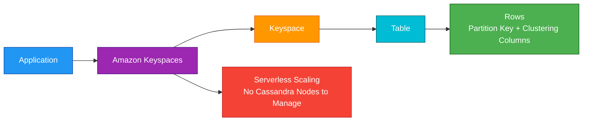
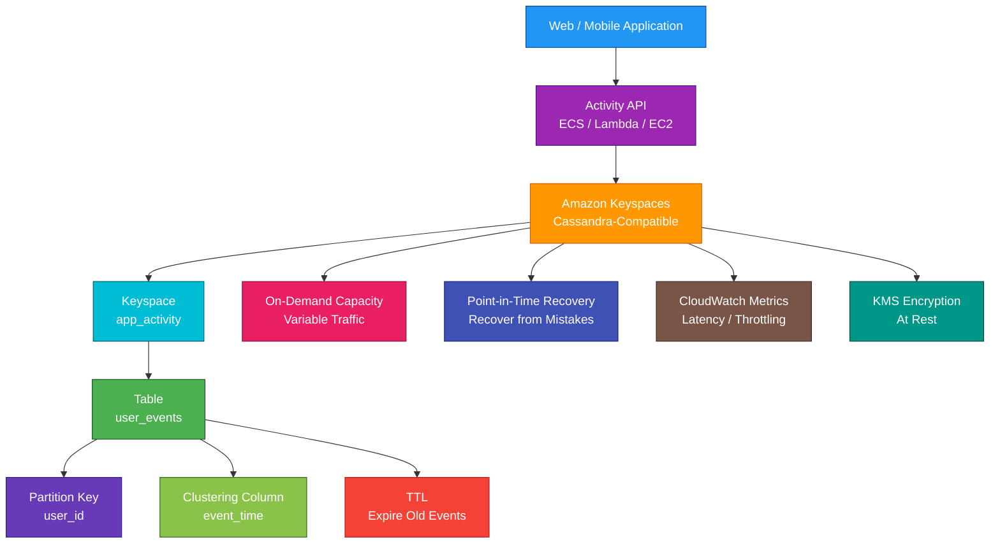

# Amazon Keyspaces

<details>
<summary>

## 1. Definition

</summary>

### Simple Definition

Amazon Keyspaces is AWS’s managed Apache Cassandra-compatible database service.

It lets you run Cassandra-style workloads without managing Cassandra servers, clusters, nodes, patching, replication, or scaling infrastructure.

### Memory Hook

Keyspaces = Managed serverless Cassandra-compatible database.

### Basic Idea

Applications use Cassandra Query Language, or CQL, to read and write data.

AWS manages the backend infrastructure automatically.



### Key Point

Amazon Keyspaces is for Cassandra-compatible NoSQL workloads.

It is not a relational database, document database, graph database, or data warehouse.

</details>

<details>
<summary>

## 2. What Problem Does It Solve?

</summary>

### Main Problem

Amazon Keyspaces solves the problem of running Cassandra-compatible applications without managing Cassandra infrastructure.

### Without Amazon Keyspaces

You may need to manage:

- Cassandra clusters
- Nodes
- Replication
- Scaling
- Backups
- Patching
- Compaction
- Repair operations
- Hardware failures
- Cluster monitoring
- Capacity planning

### With Amazon Keyspaces

AWS manages the infrastructure.

You focus on:

- Data model
- Partition keys
- Table design
- CQL queries
- Capacity mode
- Security
- Application access patterns

### Key Benefit

Amazon Keyspaces gives you Cassandra compatibility with managed, serverless AWS operations.

</details>

<details>
<summary>

## 3. Core Use Cases

</summary>

### Cassandra Application Migration

Use Amazon Keyspaces when migrating Cassandra workloads to AWS without wanting to manage Cassandra clusters.

Example:

Move an application using Cassandra Query Language to a managed AWS service.

### High-Scale NoSQL Applications

Use Keyspaces for applications that need scalable NoSQL access patterns.

Examples:

- User activity tracking
- Messaging metadata
- Game state
- Device events
- Application state

### Time-Series Style Data

Use Keyspaces for Cassandra-style time-series tables.

Examples:

- Events by device and timestamp
- Metrics by customer and time
- Logs by application and day
- Activity feeds by user and time

### IoT Metadata and Events

Use Keyspaces to store device-related data when Cassandra-style access patterns are required.

Examples:

- Device readings
- Device status history
- Sensor metadata
- Event streams by device ID

### Large-Scale User Activity

Use Keyspaces for high-volume activity data.

Examples:

- Click events
- Login history
- User notifications
- Timeline events

### Low-Latency NoSQL Access

Use Keyspaces when applications need predictable low-latency access using known partition-key-based queries.

### Managed Cassandra-Compatible Backend

Use Keyspaces when teams want Cassandra API compatibility but do not want to operate Cassandra themselves.

</details>

<details>
<summary>

## 4. Important Features for SAA

</summary>

### Cassandra Compatibility

Amazon Keyspaces is compatible with Apache Cassandra APIs and CQL.

Important exam point:

Keyspaces is Cassandra-compatible, but it is not self-managed Cassandra.

Some Cassandra features may behave differently or may not be supported exactly the same way.

### CQL

CQL means Cassandra Query Language.

It looks similar to SQL but is designed for Cassandra-style NoSQL data models.

Example:

```sql
SELECT * FROM user_events
WHERE user_id = 'u123'
AND event_date = '2026-05-04';
```

### Keyspace

A keyspace is a logical container for tables.

It is similar to a database namespace.

Example:

`app_activity`

### Table

A table stores data in rows and columns.

In Keyspaces, table design should match your application access patterns.

### Primary Key

A primary key uniquely identifies rows.

It includes:

- Partition key
- Optional clustering columns

### Partition Key

The partition key determines how data is distributed and accessed.

This is one of the most important Keyspaces design concepts.

Good partition keys spread data evenly.

Bad partition keys can create hot partitions.

### Clustering Columns

Clustering columns define the order of rows within the same partition.

Example:

A table may use:

- `user_id` as partition key
- `event_time` as clustering column

This supports querying events for a user ordered by time.

### Access Pattern Design

In Cassandra-style databases, you design tables around queries.

Important point:

Do not model Keyspaces like a relational database.

Design around how the application reads and writes data.

### No Joins

Keyspaces does not support relational joins like RDS.

If the application needs complex joins, use RDS or Aurora.

### Denormalization

Cassandra-style data models often duplicate data across tables to support different query patterns.

This is normal in Keyspaces.

Example:

Store order data by `customer_id` in one table and by `order_id` in another table.

### Capacity Modes

Amazon Keyspaces supports two main capacity modes.

| Capacity Mode | Best For |
|---|---|
| On-demand | Unknown, variable, or unpredictable traffic |
| Provisioned | Predictable traffic and cost control |

### On-Demand Capacity

On-demand mode automatically handles read and write traffic without capacity planning.

Use it when:

- Traffic is unpredictable
- Workload is new
- Usage spikes are expected
- You want simpler operations

### Provisioned Capacity

Provisioned mode lets you specify read and write capacity.

Use it when:

- Traffic is predictable
- You want more cost control
- You can estimate workload needs

### Auto Scaling

For provisioned mode, auto scaling can adjust read and write capacity based on utilization.

This helps match capacity to demand.

### Consistency

Cassandra-style systems use configurable consistency concepts.

For SAA, remember:

Keyspaces is designed for scalable distributed NoSQL access, and query design should account for consistency and access patterns.

### TTL

Time to Live, or TTL, automatically expires data after a defined time.

Use TTL for:

- Temporary events
- Session-like data
- Expiring logs
- Short-lived activity records

### Point-in-Time Recovery

Point-in-time recovery, or PITR, helps restore tables to a previous point in time.

Use it to recover from:

- Accidental deletes
- Bad application writes
- Data corruption
- Operational mistakes

### Backup and Restore

Amazon Keyspaces supports backup and restore features such as point-in-time recovery.

For long-term protection, configure recovery settings based on business needs.

### Multi-Region Replication

Amazon Keyspaces supports multi-Region replication.

Use it for:

- Global applications
- Lower-latency regional reads and writes
- Disaster recovery
- Regional resilience

### Serverless Operations

You do not manage:

- Cassandra nodes
- Server instances
- Cluster repair
- Replication setup
- Patching
- Hardware replacement

### CloudWatch Metrics

Amazon Keyspaces publishes metrics to CloudWatch.

Common metrics include:

- Consumed read capacity
- Consumed write capacity
- Throttled requests
- Successful requests
- Latency
- System errors
- User errors

### PartiQL vs CQL Note

DynamoDB supports PartiQL.

Keyspaces uses CQL.

This is a common exam distinction.

</details>

<details>
<summary>

## 5. Security Model

</summary>

### IAM Permissions

IAM controls who can manage and access Amazon Keyspaces resources.

Common permissions:

| Permission | Purpose |
|---|---|
| `cassandra:Create` | Create keyspaces or tables |
| `cassandra:Select` | Read data |
| `cassandra:Modify` | Insert, update, or delete data |
| `cassandra:Alter` | Change table settings |
| `cassandra:Drop` | Delete keyspaces or tables |
| `cassandra:TagResource` | Add tags |
| `cassandra:Restore` | Restore tables |

### IAM-Based Access

Amazon Keyspaces integrates with IAM.

Use IAM policies to control access to:

- Keyspaces
- Tables
- Read operations
- Write operations
- Administrative actions

### Service-Specific Credentials

Applications can use service-specific credentials for Cassandra-compatible access.

This helps Cassandra clients authenticate to Amazon Keyspaces.

### Least Privilege

Give applications only the access they need.

Example:

A read-only analytics app should have `Select` access but not `Modify` or `Drop`.

### Encryption at Rest

Amazon Keyspaces encrypts data at rest.

You can use AWS KMS for encryption key control.

### Encryption in Transit

Amazon Keyspaces supports encryption in transit using TLS.

Applications should connect securely.

### KMS Key Permissions

If using a customer managed KMS key, make sure the correct IAM principals and AWS services can use the key.

Wrong KMS permissions can block access to encrypted data.

### Network Security

Use private connectivity where possible.

Amazon Keyspaces can be accessed through AWS service endpoints, and VPC endpoint patterns can help keep traffic private where supported.

### CloudTrail Auditing

AWS CloudTrail can record Amazon Keyspaces API activity.

Use CloudTrail to audit:

- Table creation
- Table deletion
- Permission changes
- Data access activity where supported
- Administrative operations

### Tag-Based Access Control

Use tags to organize and control resources.

Examples:

- Environment
- Application
- Owner
- Data classification
- Cost center

### Shared Responsibility

AWS is responsible for:

- Managed database infrastructure
- Serverless scaling infrastructure
- Replication infrastructure
- Hardware maintenance
- Physical security
- Service availability

You are responsible for:

- IAM permissions
- Table design
- Partition key design
- KMS key policies
- Application authentication
- Query patterns
- Backup and recovery settings
- Data classification
- Monitoring and alerting

</details>

<details>
<summary>

## 6. High Availability / Durability Behavior

</summary>

### Availability

Amazon Keyspaces is a managed serverless database service.

AWS manages availability and infrastructure behind the service.

### Regional Service

Amazon Keyspaces tables are created in an AWS Region unless multi-Region replication is configured.

### Multi-AZ Behavior

Amazon Keyspaces stores data redundantly across multiple Availability Zones within a Region.

You do not configure Cassandra replication or AZ placement manually.

### Fault Tolerance

AWS handles backend infrastructure failures.

You do not replace nodes or repair Cassandra clusters yourself.

### Durability

Amazon Keyspaces is designed to store data durably across AWS-managed infrastructure.

Use backup and point-in-time recovery features to protect against application-level mistakes.

### Point-in-Time Recovery

PITR helps recover a table to an earlier point in time.

This is useful for accidental writes or deletes.

### Multi-Region Behavior

Multi-Region replication can replicate data across Regions.

Use it for:

- Disaster recovery
- Global apps
- Lower-latency regional access
- Regional failover planning

### Application Resilience

Applications should still handle:

- Retries
- Throttling
- Timeout errors
- Idempotent writes
- Regional failure planning
- Backoff behavior

### Hot Partition Risk

Even though Keyspaces is managed, poor partition key design can still hurt performance.

Good data distribution is important for availability and performance.

### Important Exam Point

Keyspaces removes Cassandra cluster operations, but it does not remove the need for good NoSQL data modeling.

</details>

<details>
<summary>

## 7. Cost Optimization Options

</summary>

### Choose the Right Capacity Mode

| Workload Pattern | Better Choice |
|---|---|
| Unknown or unpredictable traffic | On-demand |
| Predictable steady traffic | Provisioned |
| New application | On-demand |
| Mature workload with known usage | Provisioned |

### Use Auto Scaling with Provisioned Mode

Auto scaling helps avoid overprovisioning while still handling changing demand.

### Design Good Partition Keys

Good partition keys distribute traffic evenly.

This avoids hot partitions and inefficient capacity usage.

### Avoid Full Table Scans

Cassandra-style databases are not designed for frequent full table scans.

Query by partition key whenever possible.

### Use TTL for Temporary Data

TTL automatically deletes old data.

This reduces storage cost for short-lived records.

Examples:

- Expire session records after 24 hours
- Expire logs after 30 days
- Expire temporary notifications after 7 days

### Avoid Overwriting Large Rows Frequently

Large partitions and frequent updates can be expensive and inefficient.

Design tables around expected access patterns.

### Use Efficient Queries

Query only the columns and partitions you need.

Avoid broad queries that read unnecessary data.

### Use Multi-Region Only When Needed

Multi-Region replication improves resilience and latency but adds cost.

Use it when business requirements justify it.

### Monitor Throttling

Throttling may mean capacity is too low or partition design is poor.

Use CloudWatch metrics to decide whether to scale capacity or redesign the table.

### Delete Unused Tables

Unused tables still create storage and possible backup cost.

Clean up old development, test, and migration tables.

### Manage PITR and Backups

Point-in-time recovery and backups improve protection but can add cost.

Enable them based on recovery requirements.

</details>

<details>
<summary>

## 8. Common Exam Traps

</summary>

### Keyspaces vs DynamoDB

This is a major exam trap.

| Requirement | Choose |
|---|---|
| Cassandra-compatible database using CQL | Amazon Keyspaces |
| AWS-native serverless key-value/document database | DynamoDB |

### Keyspaces Is Not DynamoDB

Both are managed NoSQL services, but they use different APIs and data models.

Keyspaces uses Cassandra-compatible CQL.

DynamoDB uses AWS-native APIs and optional PartiQL.

### Keyspaces Is Not RDS

Keyspaces is NoSQL.

If the question requires SQL joins, relational constraints, or traditional transactions, choose RDS or Aurora.

### Keyspaces Is Not DocumentDB

DocumentDB is MongoDB-compatible document storage.

Keyspaces is Cassandra-compatible wide-column storage.

### Keyspaces Is Not Self-Managed Cassandra

Amazon Keyspaces is Cassandra-compatible but managed and serverless.

You do not manage nodes, clusters, compaction, repairs, or replication settings like self-managed Cassandra.

### No Cassandra Server Management

If the question asks to avoid managing Cassandra clusters while keeping Cassandra compatibility, choose Keyspaces.

### Data Modeling Still Matters

Managed service does not fix poor table design.

Bad partition keys can cause hot partitions and poor performance.

### Query by Access Pattern

Do not design Keyspaces tables like relational tables.

Design tables around queries.

### No Complex Joins

If the workload needs complex relational joins, Keyspaces is not the best fit.

Use RDS, Aurora, or Redshift depending on workload.

### TTL Deletes Data Automatically

TTL can remove data after expiration.

Be careful not to set TTL on data that must be kept permanently.

### Multi-Region Is Optional

Keyspaces does not automatically replicate every table globally unless configured.

### On-Demand Does Not Mean Free Scaling Without Cost

On-demand reduces capacity planning, but high traffic still costs money.

### Provisioned Mode Can Throttle

If provisioned capacity is too low, requests may be throttled.

Use auto scaling or increase capacity.

</details>

<details>
<summary>

## 9. Compare With Similar Services

</summary>

### Service Comparison Table

| Service | Main Purpose | Best For | Choose When |
|---|---|---|---|
| Amazon Keyspaces | Managed Cassandra-compatible database | Cassandra workloads using CQL | You need Cassandra compatibility without managing clusters |
| DynamoDB | AWS-native serverless NoSQL database | Key-value and document workloads | You need AWS-native low-latency NoSQL |
| DocumentDB | Managed document database | MongoDB-compatible workloads | You need JSON-like document storage |
| RDS / Aurora | Managed relational database | SQL transactions and joins | You need relational OLTP workloads |
| Neptune | Managed graph database | Relationship-heavy data | You need graph traversal |
| Timestream | Time-series database | Metrics and telemetry | You need timestamped time-series analytics |
| Self-managed Cassandra on EC2 | Full Cassandra control | Custom Cassandra operations | You need full control over Cassandra internals |

### Keyspaces vs DynamoDB

| Feature | Amazon Keyspaces | DynamoDB |
|---|---|---|
| API compatibility | Cassandra-compatible CQL | AWS-native API |
| Data model | Wide-column Cassandra-style | Key-value/document |
| Serverless | Yes | Yes |
| Best for | Cassandra migration and CQL apps | AWS-native NoSQL apps |
| Exam clue | Existing Cassandra application | Single-digit millisecond key-value access |

### Keyspaces vs Self-Managed Cassandra

| Feature | Amazon Keyspaces | Cassandra on EC2 |
|---|---|---|
| Infrastructure | AWS managed | You manage |
| Nodes/clusters | No node management | You manage nodes |
| Patching | Managed by AWS | You patch |
| Scaling | Serverless/provisioned capacity | You scale cluster |
| Control | Less low-level control | Full control |
| Best for | Reduced operations | Custom Cassandra tuning/control |

### Keyspaces vs DocumentDB

| Feature | Amazon Keyspaces | DocumentDB |
|---|---|---|
| Compatibility | Cassandra-compatible | MongoDB-compatible |
| Query language | CQL | MongoDB-style API |
| Data model | Wide-column | Document |
| Best for | Cassandra apps | JSON-like document apps |

### Keyspaces vs RDS

| Feature | Amazon Keyspaces | RDS |
|---|---|---|
| Database type | NoSQL wide-column | Relational SQL |
| Query style | CQL by partition key | SQL |
| Joins | No relational joins | Yes |
| Best for | Cassandra-style scale | Transactions and relationships |
| Example | Event data by user ID | Order management database |

### Keyspaces vs Timestream

| Feature | Amazon Keyspaces | Timestream |
|---|---|---|
| Main purpose | Cassandra-compatible NoSQL | Time-series database |
| Query style | CQL | SQL-like time-series queries |
| Best for | Cassandra apps and wide-column access | Metrics and telemetry over time |
| Exam clue | Existing Cassandra workload | Timestamped metrics analytics |

### When to Choose Amazon Keyspaces

Choose Amazon Keyspaces when:

- You need Cassandra compatibility
- Your app already uses CQL
- You want to avoid managing Cassandra clusters
- You need serverless Cassandra-style NoSQL
- You need scalable wide-column data access
- You need on-demand or provisioned capacity
- You need TTL for expiring data
- You need managed backups or point-in-time recovery
- You need multi-Region Cassandra-compatible tables
- Your queries are well-defined by partition key access patterns

</details>

<details>
<summary>

## 10. Mini Architecture Example

</summary>

### Scenario

A company has an existing Cassandra-based application that stores user activity events.

The team wants to move to AWS and stop managing Cassandra clusters.

The application needs scalable writes, time-based queries per user, and automatic expiration of old events.

### Architecture

Use Amazon Keyspaces as the Cassandra-compatible database.

The application writes user activity events using CQL.

The table uses `user_id` as the partition key and `event_time` as a clustering column.

TTL automatically removes old activity records.

CloudWatch monitors request latency and throttling.



### Why This Is Good

- Existing Cassandra-style application can keep using CQL
- AWS manages database infrastructure
- No Cassandra nodes or clusters to operate
- Partition key supports efficient user-based queries
- Clustering column supports time-ordered events
- TTL automatically removes old activity data
- On-demand capacity handles variable traffic
- PITR helps recover from accidental changes
- KMS protects data at rest
- CloudWatch monitors performance and throttling

### Exam Answer Pattern

If the question says:

“Run a managed Cassandra-compatible database without managing Cassandra clusters.”

Think:

Amazon Keyspaces.

If the question says:

“Run AWS-native serverless key-value NoSQL with single-digit millisecond latency.”

Think:

DynamoDB.

If the question says:

“Run MongoDB-compatible document workloads.”

Think:

Amazon DocumentDB.

If the question says:

“Run relational SQL workloads with joins and transactions.”

Think:

RDS or Aurora.

### Final Memory Hook

Keyspaces = Managed Cassandra-compatible database.

CQL = Cassandra Query Language.

Keyspace = Namespace.

Table = Stores rows.

Partition key = Distributes and queries data.

Clustering column = Orders data within partition.

On-demand = No capacity planning.

Provisioned = Predictable capacity and cost control.

Auto scaling = Adjusts provisioned capacity.

TTL = Automatically expires data.

PITR = Restore to previous point in time.

DynamoDB = AWS-native NoSQL.

DocumentDB = MongoDB-compatible.

RDS/Aurora = Relational SQL.

Neptune = Graph.

Timestream = Time-series.

</details>