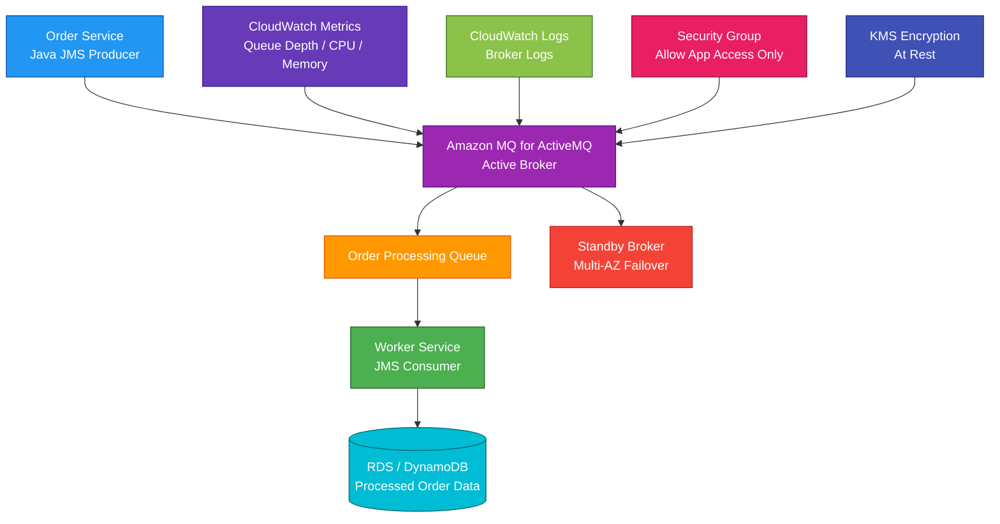

# Amazon MQ

## 1. Definition

### Simple Definition

Amazon MQ is a managed message broker service for Apache ActiveMQ Classic and RabbitMQ.

It helps applications send messages to each other using traditional open-source messaging protocols without you managing broker servers yourself.

### Memory Hook

Amazon MQ = Managed ActiveMQ and RabbitMQ.

### Basic Idea

Applications send messages to a broker.

The broker stores and routes messages to other applications.

### Supported Broker Engines

| Engine | Best For |
|---|---|
| Apache ActiveMQ Classic | JMS, OpenWire, STOMP, MQTT, AMQP, legacy enterprise messaging |
| RabbitMQ | AMQP-based messaging, exchanges, queues, routing patterns |

### Key Point

Amazon MQ is best when you need compatibility with existing ActiveMQ or RabbitMQ applications.

If you are building a new cloud-native application, SQS, SNS, or EventBridge may be simpler.

## 2. What Problem Does It Solve?

### Main Problem

Amazon MQ solves the problem of running traditional message brokers without managing broker infrastructure.

It is useful when existing applications already use ActiveMQ or RabbitMQ protocols and cannot easily be rewritten to use AWS-native messaging services.

### Without Amazon MQ

You may need to manage:

- Broker installation
- Broker patching
- Broker upgrades
- Failover setup
- Storage configuration
- Replication
- Monitoring
- Security configuration
- Hardware failures
- Broker scaling
- Backup and recovery

### With Amazon MQ

AWS manages much of the broker infrastructure.

You focus on:

- Choosing broker engine
- Configuring users
- Setting network access
- Creating queues, topics, or exchanges
- Setting broker configuration
- Monitoring performance
- Application message design

### Key Benefit

Amazon MQ makes migration easier for applications that already use standard message broker APIs and protocols.

## 3. Core Use Cases

### Migrate Existing Message Broker Workloads

Use Amazon MQ when migrating applications from self-managed ActiveMQ or RabbitMQ to AWS.

Example:

A company runs ActiveMQ on-premises and wants a managed broker in AWS without rewriting JMS application code.

### Decouple Applications

Use Amazon MQ to let applications communicate asynchronously.

Example:

An order service sends a message to a queue, and a fulfillment service processes it later.

### Legacy Enterprise Messaging

Use Amazon MQ when applications rely on enterprise messaging standards.

Examples:

- JMS
- AMQP
- MQTT
- STOMP
- OpenWire

### Queue-Based Processing

Use queues when messages should be processed by one consumer.

Example:

A billing queue receives invoice jobs, and workers process them one by one.

### Pub/Sub Messaging

Use topics or exchanges when one message should be sent to multiple consumers.

Example:

An `OrderCreated` event is sent to inventory, payment, and notification systems.

### Hybrid Application Migration

Use Amazon MQ when on-premises systems and AWS systems must continue using the same messaging protocol during migration.

### Lambda Integration

AWS Lambda can poll Amazon MQ brokers and process messages.

Use this when you want serverless processing for messages from ActiveMQ or RabbitMQ.

## 4. Important Features for SAA

### Message Broker

A message broker receives, stores, routes, and delivers messages between applications.

It helps decouple producers from consumers.

### Producer

A producer sends messages to the broker.

Example:

An order service sends a message after a customer places an order.

### Consumer

A consumer receives and processes messages from the broker.

Example:

A shipping service receives an order message and creates a shipment.

### Queue

A queue stores messages until they are consumed.

Usually, each message is processed by one consumer.

Best for:

- Work queues
- Background jobs
- Order processing
- Task distribution

### Topic

A topic is used for publish/subscribe messaging.

One message can be delivered to multiple subscribers.

Best for:

- Fanout
- Notifications
- Event distribution
- Multiple systems reacting to the same event

### Exchange

RabbitMQ uses exchanges to route messages to queues.

Common RabbitMQ exchange types include:

| Exchange Type | Meaning |
|---|---|
| Direct | Route by exact routing key |
| Topic | Route by pattern matching |
| Fanout | Broadcast to bound queues |
| Headers | Route based on message headers |

### ActiveMQ Classic

ActiveMQ Classic is commonly used for enterprise Java messaging.

It supports JMS and multiple wire protocols.

Common protocols include:

- OpenWire
- AMQP
- STOMP
- MQTT
- WebSocket

### RabbitMQ

RabbitMQ is a popular open-source message broker commonly used with AMQP.

It is known for:

- Exchanges
- Queues
- Routing keys
- Flexible routing
- Broad language support

### JMS

JMS means Java Message Service.

If the exam mentions JMS compatibility, ActiveMQ is usually the stronger clue.

### AMQP

AMQP means Advanced Message Queuing Protocol.

RabbitMQ is commonly associated with AMQP.

ActiveMQ can also support AMQP depending on configuration.

### Broker

A broker is the Amazon MQ server resource.

You choose:

- Engine type
- Broker instance type
- Deployment mode
- Storage type
- Authentication settings
- Network access
- Maintenance window
- Encryption options

### Single-Instance Broker

A single-instance broker runs one broker instance.

Best for:

- Development
- Testing
- Low-cost non-critical workloads

Not best for production high availability.

### Active/Standby Broker

Active/standby deployment uses a standby broker for failover.

Best for production ActiveMQ workloads that need higher availability.

### RabbitMQ Cluster Broker

RabbitMQ on Amazon MQ can use a cluster deployment for high availability.

It runs broker nodes across multiple Availability Zones.

### Storage Options

Storage depends on broker engine and configuration.

| Engine | Storage Notes |
|---|---|
| ActiveMQ | Can use durability-optimized storage with EFS or throughput-optimized storage with EBS |
| RabbitMQ | Uses EBS-backed storage |

### Broker Configuration

Amazon MQ lets you configure broker settings.

Examples:

- ActiveMQ XML configuration
- RabbitMQ policies and parameters
- Broker users
- Engine versions
- Logs and monitoring

### Maintenance Window

Amazon MQ uses maintenance windows for broker maintenance and updates.

Choose a low-traffic time.

### Minor Version Upgrades

Amazon MQ can manage engine version upgrades.

For production, test upgrades before applying them.

### CloudWatch Metrics

Amazon MQ publishes metrics to CloudWatch.

Common metrics:

- CPU utilization
- Memory usage
- Queue depth
- Message count
- Consumer count
- Connection count
- Storage usage
- Broker health

### CloudWatch Logs

Amazon MQ can publish broker logs to CloudWatch Logs.

Logs help troubleshoot:

- Connection issues
- Authentication failures
- Broker errors
- Message routing problems

### Dead-Letter Queue

A dead-letter queue stores messages that cannot be processed successfully.

Use DLQs for:

- Poison messages
- Failed processing
- Retry exhaustion
- Troubleshooting

### Message Durability

Durable messages survive broker restarts or failures depending on broker configuration and storage.

Use durable queues and persistent messages when message loss is unacceptable.

### Message Acknowledgment

Consumers usually acknowledge messages after processing.

If a consumer fails before acknowledgment, the message can be redelivered.

### Lambda Event Source Mapping

Lambda can consume messages from Amazon MQ.

Common pattern:

Amazon MQ queue → Lambda function → downstream processing

### Migration Compatibility

Amazon MQ is commonly chosen when applications already use ActiveMQ or RabbitMQ clients.

This can reduce migration effort compared with rewriting for SQS or SNS.

## 5. Security Model

### IAM Permissions

IAM controls who can create, modify, delete, and manage Amazon MQ resources.

Common permissions:

| Permission | Purpose |
|---|---|
| `mq:CreateBroker` | Create broker |
| `mq:UpdateBroker` | Modify broker |
| `mq:DeleteBroker` | Delete broker |
| `mq:DescribeBroker` | View broker details |
| `mq:CreateConfiguration` | Create broker configuration |
| `mq:UpdateConfiguration` | Modify broker configuration |
| `mq:ListBrokers` | List brokers |

### Broker Authentication

Applications authenticate to the broker using broker-level credentials.

Examples:

- Username and password
- LDAP integration for supported ActiveMQ configurations
- RabbitMQ user credentials

### IAM vs Broker Users

IAM controls AWS management access.

Broker users control application connection access.

| Access Type | Controlled By |
|---|---|
| Create or delete broker | IAM |
| Connect to broker and send messages | Broker users / broker authentication |
| Encrypt storage | KMS |
| Network access | Security groups and VPC settings |

### Network Security

Amazon MQ brokers run in a VPC.

Control access using:

- Security groups
- Private subnets
- Public accessibility setting
- Route tables
- NACLs
- VPN or Direct Connect for hybrid access

### Public Accessibility

Amazon MQ brokers can be private or publicly accessible depending on configuration.

Best practice:

Production brokers should usually be private unless public access is required and tightly controlled.

### Security Groups

Security groups control which clients can connect to the broker ports.

Example:

Allow only application servers to connect to the broker.

### Encryption at Rest

Amazon MQ supports encryption at rest using AWS KMS.

Encryption protects broker storage.

### Encryption in Transit

Use TLS-enabled broker endpoints to encrypt client connections.

This protects messages and credentials moving over the network.

### KMS Key Options

Amazon MQ can use KMS-based encryption.

Common key options include:

- AWS owned key
- AWS managed key
- Customer managed KMS key

### KMS Permissions

If using a customer managed KMS key, make sure Amazon MQ and required administrators have correct KMS permissions.

Wrong KMS permissions can break broker operations.

### Secrets Management

Do not hardcode broker usernames and passwords in application code.

Use:

- AWS Secrets Manager
- Systems Manager Parameter Store
- KMS-encrypted application configuration

### Logging and Auditing

Use:

- CloudTrail for Amazon MQ management API activity
- CloudWatch Logs for broker logs
- CloudWatch metrics for broker health and performance

### Shared Responsibility

AWS is responsible for:

- Amazon MQ managed infrastructure
- Broker provisioning
- Hardware maintenance
- Managed service availability
- Failure detection and recovery
- Physical security

You are responsible for:

- Broker users and passwords
- IAM permissions
- Security groups
- Network exposure
- Message encryption settings
- KMS key policies
- Broker configuration
- Application message handling
- Monitoring queues and consumers
- Patching or upgrade choices where applicable

## 6. High Availability / Durability Behavior

### Availability

Amazon MQ availability depends on broker engine and deployment mode.

For production workloads, choose a high-availability deployment.

### ActiveMQ High Availability

For ActiveMQ, use active/standby deployment for higher availability.

If the active broker fails, the standby broker can take over.

### RabbitMQ High Availability

For RabbitMQ, use cluster deployment for higher availability.

RabbitMQ clusters can run across multiple Availability Zones.

### Multi-AZ Behavior

Amazon MQ supports Multi-AZ deployment patterns depending on engine and broker type.

Use Multi-AZ for production workloads that need better resilience.

### Single-Instance Limitation

Single-instance brokers are cheaper but less available.

If the broker fails, the workload may be unavailable until recovery.

### Message Durability

Message durability depends on:

- Broker engine
- Storage type
- Queue durability
- Message persistence
- Acknowledgment behavior
- Deployment mode

### Persistent Messages

Persistent messages are stored durably by the broker.

Use persistent messages when message loss is unacceptable.

### Non-Persistent Messages

Non-persistent messages can be faster but may be lost during broker failure or restart.

Use them only when loss is acceptable.

### Consumer Acknowledgments

Acknowledgments help prevent message loss during consumer failure.

If a consumer does not acknowledge a message, the broker can redeliver it.

### Backups

Amazon MQ supports broker backup and recovery features depending on engine and configuration.

For exam purposes, remember:

Amazon MQ is managed, but your message durability still depends on correct broker and message configuration.

### Multi-Region Behavior

Amazon MQ brokers are regional.

For Multi-Region disaster recovery, design separately.

Possible approaches:

- ActiveMQ network of brokers
- Cross-Region replication where supported
- Application-level replication
- Separate brokers in multiple Regions
- Route 53 failover patterns

### Important Exam Point

Amazon MQ can provide high availability, but it is not automatically global.

Choose the right deployment mode and design for failure based on workload requirements.

## 7. Cost Optimization Options

### Choose the Right Broker Engine

Use Amazon MQ only when protocol compatibility is required.

If building a new cloud-native app, SQS, SNS, or EventBridge may be cheaper and simpler.

### Use Single-Instance for Dev/Test

Single-instance brokers cost less than high-availability deployments.

Use them for:

- Development
- Testing
- Training
- Non-critical workloads

### Use Multi-AZ Only When Needed

High-availability deployments improve resilience but cost more.

Use them for production or critical workloads.

### Right-Size Broker Instances

Choose broker instance sizes based on real workload needs.

Monitor:

- CPU
- Memory
- Connections
- Message rate
- Queue depth
- Storage usage

### Delete Unused Brokers

Stopped or unused broker resources can create cost.

Delete old development, test, or migration brokers when no longer needed.

### Monitor Queue Depth

Large unprocessed queues can increase storage usage and indicate consumer problems.

Fix slow consumers instead of only scaling broker capacity.

### Use Durable Messages Only When Needed

Durable persistent messages improve reliability but can reduce throughput and increase storage usage.

Use them when message loss is unacceptable.

### Tune Message Retention

Do not keep unnecessary messages forever.

Clean up old queues, expired messages, and unused topics.

### Use CloudWatch Alarms

Create alarms for:

- High CPU
- High memory
- High queue depth
- Low consumer count
- Storage usage
- Connection spikes

Early detection can prevent over-scaling and outages.

### Prefer AWS-Native Messaging for New Apps

For new applications, consider:

- SQS for queues
- SNS for pub/sub
- EventBridge for event routing

These are often more serverless and operationally simpler than running a broker.

## 8. Common Exam Traps

### Amazon MQ vs SQS

This is the biggest exam trap.

| Requirement | Choose |
|---|---|
| Existing ActiveMQ or RabbitMQ app compatibility | Amazon MQ |
| Simple fully managed AWS-native queue | SQS |

### Amazon MQ vs SNS

SNS is for AWS-native pub/sub fanout.

Amazon MQ is for traditional broker protocols and broker compatibility.

### Amazon MQ vs EventBridge

EventBridge is an event bus for routing events between AWS services, apps, and SaaS tools.

Amazon MQ is a managed ActiveMQ/RabbitMQ broker.

### Amazon MQ Is Not Serverless Like SQS

Amazon MQ still uses broker instances.

You choose broker size and deployment mode.

SQS is fully serverless.

### Choose Amazon MQ for Migration

If the question says existing applications use JMS, AMQP, MQTT, STOMP, ActiveMQ, or RabbitMQ, Amazon MQ is likely.

### Choose SQS for New Simple Queues

If the application only needs a simple managed queue and does not require broker protocol compatibility, SQS is usually better.

### ActiveMQ vs RabbitMQ

| Clue | Likely Engine |
|---|---|
| JMS or OpenWire | ActiveMQ |
| AMQP exchanges and routing keys | RabbitMQ |
| Existing RabbitMQ workload | RabbitMQ |
| Existing ActiveMQ workload | ActiveMQ |

### Broker Users Are Not IAM Users

IAM controls AWS resource management.

Broker authentication controls application connections.

### Single-Instance Is Not Highly Available

Do not choose single-instance broker for production HA requirements.

### Persistent Messages Must Be Configured

Amazon MQ being managed does not automatically make every message durable.

Use durable queues and persistent messages when needed.

### Public Broker Exposure Is Risky

Do not expose brokers publicly unless required and secured.

Private VPC access is usually preferred.

### Amazon MQ Does Not Replace Step Functions

Amazon MQ passes messages.

Step Functions orchestrates workflows with steps, retries, and branching.

### Amazon MQ Does Not Replace Kinesis

Kinesis Data Streams is for high-throughput streaming and replay.

Amazon MQ is for broker-based messaging compatibility.

## 9. Compare With Similar Services

### Service Comparison Table

| Service | Main Purpose | Best For | Choose When |
|---|---|---|---|
| Amazon MQ | Managed ActiveMQ/RabbitMQ broker | Existing broker-based apps | You need JMS, AMQP, MQTT, STOMP, OpenWire, or RabbitMQ compatibility |
| Amazon SQS | Serverless queue | Decoupled message processing | You need simple AWS-native queues |
| Amazon SNS | Pub/sub notifications | Fanout to many subscribers | One message should notify many systems |
| Amazon EventBridge | Event bus and routing | Event-driven apps and SaaS integration | You need rules, filtering, schedules, or event routing |
| Kinesis Data Streams | Real-time streaming | High-throughput ordered stream processing | You need custom consumers and replay |
| Step Functions | Workflow orchestration | Multi-step business workflows | You need state, retries, branching, and coordination |

### Amazon MQ vs SQS

| Feature | Amazon MQ | SQS |
|---|---|---|
| Type | Managed message broker | Serverless queue |
| Protocols | ActiveMQ/RabbitMQ protocols | AWS API |
| Serverless | No, broker instances | Yes |
| Best for | Migration and protocol compatibility | Cloud-native queueing |
| Operations | More broker configuration | Less operational management |
| Exam clue | Existing broker app | Simple decoupled queue |

### Amazon MQ vs SNS

| Feature | Amazon MQ | SNS |
|---|---|---|
| Main purpose | Broker-based messaging | Pub/sub fanout |
| Protocol compatibility | ActiveMQ/RabbitMQ | AWS-native subscriptions |
| Message storage | Broker queues/topics | Push delivery, no queue unless paired with SQS |
| Best for | Legacy messaging apps | Notifications and fanout |

### Amazon MQ vs EventBridge

| Feature | Amazon MQ | EventBridge |
|---|---|---|
| Main purpose | Message broker | Event routing |
| Routing model | Broker queues/topics/exchanges | Event bus rules and patterns |
| SaaS integration | Not main focus | Strong feature |
| Scheduling | Not main feature | Strong feature |
| Best for | Existing broker protocols | Event-driven AWS integrations |

### Amazon MQ vs Kinesis Data Streams

| Feature | Amazon MQ | Kinesis Data Streams |
|---|---|---|
| Main purpose | Message broker | Streaming data service |
| Consumers | Broker consumers | Stream consumers |
| Ordering | Depends on broker and queue design | Per shard |
| Replay | Broker-dependent | Retention-based replay |
| Best for | Traditional messaging | High-throughput event streams |

### Amazon MQ vs Step Functions

| Feature | Amazon MQ | Step Functions |
|---|---|---|
| Main purpose | Message passing | Workflow orchestration |
| State management | Broker message state | Workflow state |
| Branching/retry workflow | Application/broker logic | Built-in |
| Best for | Decoupling apps with messages | Coordinating multi-step processes |

### When to Choose Amazon MQ

Choose Amazon MQ when:

- You need managed ActiveMQ or RabbitMQ
- You are migrating existing broker-based applications
- You need JMS compatibility
- You need AMQP, MQTT, STOMP, or OpenWire support
- You need RabbitMQ exchanges and queues
- You do not want to rewrite apps for SQS or SNS
- You need a traditional message broker in AWS
- You want AWS to manage broker infrastructure tasks

## 10. Mini Architecture Example

### Scenario

A company has an on-premises Java application that uses JMS with ActiveMQ.

The company is migrating to AWS but wants to avoid rewriting the messaging code.

The application needs reliable message processing and high availability.

### Architecture

Use Amazon MQ for ActiveMQ with an active/standby deployment.

Application services connect to the broker using JMS.

Messages are sent to queues.

Consumer services process messages asynchronously.

CloudWatch monitors broker health and queue depth.

### Why This Is Good

- Existing JMS application can migrate with minimal code changes
- Amazon MQ manages broker infrastructure
- Active/standby improves broker availability
- Queues decouple producers and consumers
- Durable messages can protect important work items
- Consumers process messages asynchronously
- CloudWatch monitors broker health and queue depth
- Security groups restrict broker access
- KMS protects broker storage at rest
- Application data is stored in a durable backend database

### Exam Answer Pattern

If the question says:

“Move existing ActiveMQ or RabbitMQ applications to AWS without rewriting messaging code.”

Think:

Amazon MQ.

If the question says:

“Use a simple serverless queue for new AWS-native applications.”

Think:

Amazon SQS.

If the question says:

“Fan out one message to many subscribers.”

Think:

Amazon SNS.

If the question says:

“Route events based on rules and integrate SaaS apps.”

Think:

Amazon EventBridge.

### Final Memory Hook

Amazon MQ = Managed ActiveMQ and RabbitMQ.

ActiveMQ = JMS, OpenWire, STOMP, MQTT, AMQP.

RabbitMQ = AMQP, exchanges, queues, routing keys.

Queue = One message processed by one consumer.

Topic / fanout = One message to many consumers.

Broker = Message routing server.

Single-instance = Lower cost, less HA.

Active/standby = Better HA for ActiveMQ.

RabbitMQ cluster = HA RabbitMQ deployment.

Persistent message = More durable.

Acknowledgment = Confirms processing.

SQS = Serverless queue.

SNS = Pub/sub fanout.

EventBridge = Event routing.

Step Functions = Workflow orchestration.

