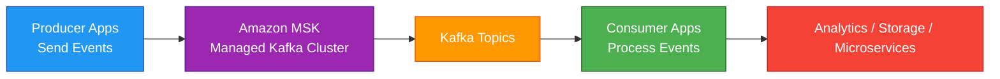
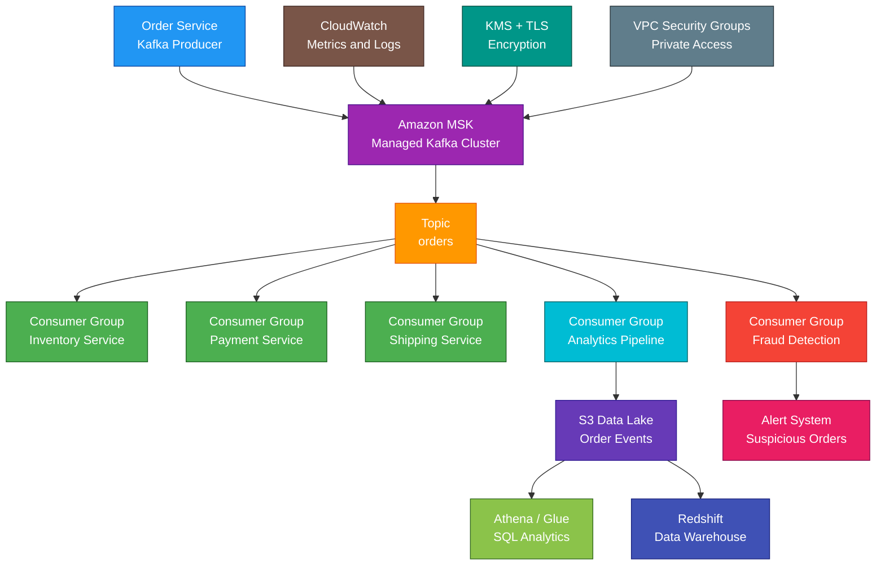

# Amazon MSK

## 1. Definition

### Simple Definition

Amazon MSK, or Amazon Managed Streaming for Apache Kafka, is AWS’s managed Apache Kafka service.

It lets you run Kafka-compatible streaming applications without managing Kafka brokers, ZooKeeper, KRaft controllers, patching, replication setup, and much of the cluster operations yourself.

### Memory Hook

MSK = Managed Kafka on AWS.

### Basic Idea

Applications produce streaming data to Kafka topics.

Other applications consume the data from those topics.

Amazon MSK manages the Kafka cluster infrastructure.

### Key Point

Amazon MSK is best when you need Apache Kafka compatibility.

If you only need a simpler AWS-native streaming service, Amazon Kinesis Data Streams may be easier.

## 2. What Problem Does It Solve?

### Main Problem

Amazon MSK solves the problem of running Apache Kafka without managing the heavy operational work of Kafka clusters.

Kafka is powerful, but self-managing it can be difficult.

### Without Amazon MSK

You may need to manage:

- Kafka broker installation
- Broker patching
- Cluster scaling
- Broker replacement
- Storage management
- Replication configuration
- Monitoring
- Security setup
- Multi-AZ deployment
- ZooKeeper or controller management
- Version upgrades

### With Amazon MSK

AWS manages much of the Kafka infrastructure.

You focus on:

- Topics
- Producers
- Consumers
- Partitions
- Retention
- Security configuration
- Application processing logic
- Monitoring consumer lag

### Key Benefit

Amazon MSK gives you Kafka compatibility with reduced operational overhead.

## 3. Core Use Cases

### Real-Time Event Streaming

Use MSK to stream events between applications in near real time.

Examples:

- User clicks
- Orders
- Payments
- Login events
- Application events

### Kafka Migration to AWS

Use MSK when existing applications already use Apache Kafka clients and APIs.

Example:

A company moves self-managed Kafka from on-premises to AWS without rewriting producer and consumer applications.

### Microservices Event Bus

Use MSK to decouple microservices with event streaming.

Example:

An order service publishes `OrderCreated`.

Inventory, payment, shipping, and analytics services consume the event.

### Log and Metrics Streaming

Use MSK to collect and process logs or metrics from many systems.

Examples:

- Application logs
- Container logs
- Security events
- Infrastructure metrics

### Stream Processing

Use MSK with stream processing tools.

Examples:

- Apache Flink
- Kafka Streams
- Spark Streaming
- AWS Lambda event source mapping
- Amazon Managed Service for Apache Flink

### Data Lake Ingestion

Use MSK to stream data into S3 for analytics.

Common pattern:

MSK → Kafka connector or Firehose/custom consumer → S3 → Athena/Glue/Redshift

### Change Data Capture

Use MSK with CDC tools to stream database changes.

Example:

Database changes → Debezium/Kafka Connect → MSK → consumers

## 4. Important Features for SAA

### Apache Kafka

Apache Kafka is a distributed event streaming platform.

It is used for high-throughput, durable, ordered event streams.

### Kafka Cluster

A Kafka cluster is made of brokers that store and serve topic data.

In Amazon MSK, AWS manages the broker infrastructure.

### Broker

A broker is a Kafka server.

It stores topic partitions and serves producer and consumer requests.

### Topic

A topic is a named stream of events.

Examples:

- `orders`
- `payments`
- `clickstream`
- `application-logs`

### Producer

A producer writes records to Kafka topics.

Example:

An e-commerce app writes new order events to the `orders` topic.

### Consumer

A consumer reads records from Kafka topics.

Example:

A shipping service reads order events and creates shipments.

### Consumer Group

A consumer group is a group of consumers that share work.

Kafka distributes topic partitions across consumers in the same group.

Important point:

Each partition is consumed by only one consumer within the same consumer group at a time.

### Partition

A partition is a split of a Kafka topic.

Partitions provide:

- Parallelism
- Scalability
- Ordering within a partition

### Ordering

Kafka preserves message order within a partition.

Important exam point:

Kafka does not guarantee global ordering across all partitions.

### Replication Factor

Replication factor defines how many copies of each partition exist across brokers.

Example:

Replication factor 3 means there are 3 copies of each partition.

### Leader and Followers

Each partition has one leader and one or more follower replicas.

Producers and consumers usually interact with the leader.

Followers replicate data from the leader.

### Durability

Kafka durability depends on:

- Replication factor
- Acknowledgment settings
- Minimum in-sync replicas
- Broker health
- Storage configuration
- Retention settings

### Retention

Kafka stores messages for a configured retention period or size.

Consumers can replay old events as long as the events are still retained.

Example:

Keep events for 7 days.

### Replay

Replay means a consumer can read old messages again.

This is useful for:

- Reprocessing data
- Recovering from bugs
- Building new consumers
- Backfilling analytics

### Consumer Lag

Consumer lag means consumers are behind the latest messages.

High lag can mean consumers cannot process data fast enough.

### Provisioned MSK

Provisioned MSK lets you create and configure Kafka broker clusters.

You choose:

- Broker instance type
- Number of brokers
- Storage
- Kafka version
- Networking
- Authentication
- Encryption
- Monitoring level

### MSK Serverless

MSK Serverless lets you run Kafka-compatible workloads without managing broker capacity.

Use it when:

- Traffic is variable
- You want less capacity planning
- You want Kafka APIs with simpler operations
- You do not want to choose broker instance types

### MSK Connect

MSK Connect is a managed Kafka Connect service.

It runs connectors that move data between Kafka and other systems.

Examples:

- S3 sink connector
- JDBC source connector
- OpenSearch sink connector
- Debezium source connector

### Kafka Connect

Kafka Connect is a framework for moving data into and out of Kafka.

Common patterns:

| Connector Type | Purpose |
|---|---|
| Source connector | Sends data from external system to Kafka |
| Sink connector | Sends data from Kafka to external system |

### MSK Replicator

MSK Replicator can replicate data between MSK clusters.

Use it for:

- Cross-Region replication
- Migration
- Disaster recovery
- Multi-cluster architectures

### Storage

MSK brokers use storage for topic data.

For provisioned clusters, storage planning matters because retained messages consume disk.

### Tiered Storage

Tiered storage lets older Kafka data move to lower-cost storage while keeping recent data on brokers.

Use it to reduce broker storage pressure for long retention workloads.

### Monitoring

Amazon MSK integrates with monitoring services.

Common monitoring tools:

- CloudWatch metrics
- Prometheus
- Open monitoring
- Broker logs
- Consumer lag monitoring

### CloudWatch Metrics

Important MSK metrics include:

- CPU usage
- Disk usage
- Network throughput
- Under-replicated partitions
- Active controller count
- Offline partitions
- Consumer lag
- Bytes in/out

### Broker Logs

Broker logs help troubleshoot Kafka cluster issues.

Logs can be sent to:

- CloudWatch Logs
- S3
- Kinesis Data Firehose

### Lambda Integration

AWS Lambda can consume messages from Amazon MSK.

Pattern:

MSK topic → Lambda event source mapping → Lambda function

Use it for serverless event processing.

### Private VPC Service

Amazon MSK clusters run in a VPC.

Clients usually connect from inside the same VPC, peered VPC, VPN, Direct Connect, or configured private connectivity.

## 5. Security Model

### IAM Permissions

IAM controls who can create, modify, delete, and manage MSK resources.

Common permissions:

| Permission | Purpose |
|---|---|
| `kafka:CreateCluster` | Create MSK cluster |
| `kafka:DescribeCluster` | View cluster details |
| `kafka:UpdateClusterConfiguration` | Update cluster configuration |
| `kafka:DeleteCluster` | Delete cluster |
| `kafka:GetBootstrapBrokers` | Get broker connection endpoints |
| `kafka-cluster:Connect` | Connect to Kafka cluster using IAM auth |
| `kafka-cluster:ReadData` | Read topic data using IAM auth |
| `kafka-cluster:WriteData` | Write topic data using IAM auth |

### Kafka Authentication

Amazon MSK supports multiple authentication options.

Common options:

| Authentication Type | Use Case |
|---|---|
| IAM access control | AWS-native authentication and authorization |
| SASL/SCRAM | Username/password-style Kafka authentication |
| TLS mutual authentication | Certificate-based authentication |
| Unauthenticated access | Avoid for production workloads |

### IAM Access Control

IAM access control lets Kafka clients authenticate and authorize using AWS IAM.

Use it when you want AWS-native identity and policy management.

### SASL/SCRAM

SASL/SCRAM uses username and password credentials.

Credentials are commonly stored in AWS Secrets Manager.

### TLS Mutual Authentication

TLS mutual authentication uses client certificates.

Use it when certificate-based client authentication is required.

### Encryption in Transit

MSK supports encryption in transit between clients and brokers and between brokers.

Use TLS for secure Kafka communication.

### Encryption at Rest

MSK encrypts data at rest.

AWS KMS can be used for encryption key control.

### KMS Permissions

If using a customer managed KMS key, make sure MSK has permission to use the key.

Incorrect KMS permissions can break cluster operations.

### Network Security

MSK clusters are deployed in a VPC.

Use:

- Private subnets
- Security groups
- NACLs
- VPC routing
- Private connectivity
- VPN or Direct Connect for hybrid clients

### Security Groups

Security groups control which clients can connect to MSK brokers.

Best practice:

Allow only trusted producer and consumer applications.

### Public Access

MSK is commonly private by default in a VPC.

If public access is configured where supported, secure it carefully with authentication, encryption, and strict access control.

### Secrets Management

Do not hardcode Kafka credentials.

Use:

- AWS Secrets Manager
- Systems Manager Parameter Store
- IAM roles
- KMS encryption

### Authorization

Kafka authorization controls what clients can do.

Examples:

- Create topic
- Write to topic
- Read from topic
- Join consumer group
- Describe cluster

### Least Privilege

Give producers permission to write only to needed topics.

Give consumers permission to read only from needed topics and consumer groups.

### Logging and Auditing

Use:

- CloudTrail for MSK API activity
- CloudWatch metrics for cluster health
- Broker logs for Kafka-level troubleshooting
- VPC Flow Logs for network visibility

### Shared Responsibility

AWS is responsible for:

- MSK managed infrastructure
- Broker provisioning
- Hardware maintenance
- Managed patching options
- Service availability
- Physical security

You are responsible for:

- Kafka topic design
- Authentication configuration
- Authorization policies
- Security groups
- VPC connectivity
- KMS key policies
- Client configuration
- Producer and consumer logic
- Monitoring consumer lag
- Data retention settings

## 6. High Availability / Durability Behavior

### Availability

Amazon MSK can be deployed across multiple Availability Zones.

For production, use a Multi-AZ cluster.

### Multi-AZ Broker Placement

MSK can distribute brokers across Availability Zones.

This improves resilience if one Availability Zone has problems.

### Replication Factor

Use replication factor greater than 1 to protect topic data.

Common production setting:

Replication factor 3.

### In-Sync Replicas

In-sync replicas are replicas that are caught up with the leader.

Kafka can require a minimum number of in-sync replicas before acknowledging writes.

### Under-Replicated Partitions

Under-replicated partitions mean some replicas are not fully caught up.

This is an important health signal.

### Broker Failure

If a broker fails, Kafka can continue serving data from other brokers if partitions have healthy replicas.

Leadership can move to another replica.

### Availability Depends on Topic Configuration

MSK can provide durable infrastructure, but Kafka durability also depends on topic settings.

Important settings:

- Replication factor
- Minimum in-sync replicas
- Producer acknowledgments
- Retention
- Partition count

### Consumer Fault Tolerance

Consumers in a consumer group can rebalance.

If one consumer fails, another consumer in the group can take over its partitions.

### Replay for Recovery

Kafka retention allows consumers to replay events.

This helps recover from application bugs or downstream failures.

### Multi-Region Behavior

MSK clusters are regional.

For Multi-Region replication, use designs such as:

- MSK Replicator
- Kafka MirrorMaker
- Application-level dual writes
- Separate clusters in multiple Regions

### Disaster Recovery

For DR, plan:

- Cross-Region topic replication
- DNS or client failover
- Consumer offset strategy
- Schema compatibility
- IAM and networking in recovery Region
- Monitoring and runbooks

### Important Exam Point

MSK provides managed Kafka infrastructure, but Kafka availability and durability still require correct topic, replication, and client settings.

## 7. Cost Optimization Options

### Choose the Right MSK Mode

| Workload Pattern | Better Option |
|---|---|
| Predictable steady Kafka workload | Provisioned MSK |
| Variable or unpredictable workload | MSK Serverless |
| Existing Kafka apps needing control | Provisioned MSK |
| Simpler capacity management | MSK Serverless |

### Right-Size Brokers

For provisioned MSK, choose broker instance types based on:

- Throughput
- CPU
- Memory
- Network
- Partition count
- Consumer count
- Retention needs

### Monitor Storage Usage

Kafka retention can consume large storage.

Monitor disk usage and adjust:

- Retention time
- Retention size
- Topic cleanup policies
- Tiered storage where appropriate

### Use Tiered Storage for Long Retention

Tiered storage can reduce cost for workloads that need long retention.

Keep recent hot data on brokers and older data in lower-cost storage.

### Avoid Excessive Partitions

Too many partitions increase broker overhead.

Use enough partitions for throughput and parallelism, but avoid unnecessary partition sprawl.

### Use Compression

Producer compression can reduce network and storage cost.

Common compression options include:

- gzip
- snappy
- lz4
- zstd

### Delete Unused Topics

Unused topics can consume storage and metadata overhead.

Clean up old test topics and migration topics.

### Tune Retention

Do not retain data longer than needed.

Example:

- 24 hours for transient processing
- 7 days for replay
- 30+ days only if business needs require it

### Use Serverless for Spiky Workloads

MSK Serverless can reduce capacity planning and may be cost-effective for variable traffic.

### Use Reserved Capacity Where Applicable

For steady provisioned MSK workloads, reserved pricing options may reduce cost.

### Avoid Over-Replicating Noncritical Data

Replication improves durability but increases storage and network usage.

Use appropriate replication factor based on business need.

### Monitor Consumer Lag

High lag can increase retention needs and cause operational issues.

Fix slow consumers before increasing retention blindly.

## 8. Common Exam Traps

### MSK vs Kinesis Data Streams

This is the biggest exam trap.

| Requirement | Choose |
|---|---|
| Apache Kafka compatibility | Amazon MSK |
| AWS-native managed stream service | Kinesis Data Streams |

### MSK Is Managed Kafka

If the question mentions Kafka APIs, Kafka clients, Kafka Connect, Kafka Streams, or Kafka migration, choose MSK.

### Kinesis Is AWS-Native

If the question asks for a simpler AWS-native streaming service and does not require Kafka compatibility, choose Kinesis Data Streams.

### MSK vs SQS

MSK is for event streaming.

SQS is for message queueing.

| Requirement | Choose |
|---|---|
| Replayable event stream | MSK |
| Simple queue between producer and consumer | SQS |

### MSK vs SNS

SNS is pub/sub fanout notification.

MSK is durable event streaming with topics, partitions, and replay.

### MSK vs EventBridge

EventBridge is an event bus with routing rules and SaaS integration.

MSK is Kafka-compatible event streaming.

### MSK vs Amazon MQ

Amazon MQ is managed ActiveMQ or RabbitMQ.

MSK is managed Apache Kafka.

| Existing Technology | Choose |
|---|---|
| Kafka | MSK |
| ActiveMQ or RabbitMQ | Amazon MQ |

### Partitions Control Parallelism

More partitions can increase parallelism, but too many partitions create overhead.

### Ordering Is Per Partition

Kafka ordering is guaranteed only within a partition.

Do not assume ordering across the whole topic.

### Retention Is Not the Same as Queue Deletion

Kafka stores messages for a retention period, even after consumers read them.

SQS messages are usually deleted after successful processing.

### Consumers Track Their Own Offset

Kafka consumers track offsets to know what they have read.

This supports replay and independent consumer groups.

### MSK Does Not Automatically Fix Bad Kafka Design

You still need good topic, partition, retention, and consumer group design.

### Broker Count and AZ Placement Matter

For production, use multiple brokers across Availability Zones.

### Consumer Lag Is Critical

High consumer lag means processing is behind.

For exams, lag is a key operational metric.

## 9. Compare With Similar Services

### Service Comparison Table

| Service | Main Purpose | Best For | Choose When |
|---|---|---|---|
| Amazon MSK | Managed Apache Kafka | Kafka-compatible event streaming | You need Kafka APIs, clients, or ecosystem |
| Kinesis Data Streams | AWS-native streaming | Real-time streaming apps on AWS | You want managed AWS-native streams |
| Amazon MQ | Managed ActiveMQ/RabbitMQ | Traditional message broker compatibility | You need JMS, AMQP, MQTT, STOMP, RabbitMQ |
| Amazon SQS | Managed queue | Decoupling producers and consumers | You need simple queue-based processing |
| Amazon SNS | Pub/sub fanout | Notifications to many subscribers | One message should fan out to many targets |
| EventBridge | Event bus and routing | Event-driven integration and SaaS events | You need routing rules and event bus patterns |
| Kinesis Data Firehose | Stream delivery | Load streaming data into S3, Redshift, OpenSearch | You need managed delivery, not custom consumers |

### MSK vs Kinesis Data Streams

| Feature | Amazon MSK | Kinesis Data Streams |
|---|---|---|
| Main purpose | Managed Kafka | AWS-native stream |
| API | Kafka API | AWS Kinesis API |
| Ecosystem | Kafka tools and clients | AWS-native integrations |
| Partition unit | Kafka partition | Kinesis shard |
| Best for | Kafka compatibility | Simpler AWS-native streaming |
| Exam clue | Existing Kafka workloads | AWS-native real-time stream |

### MSK vs Amazon MQ

| Feature | Amazon MSK | Amazon MQ |
|---|---|---|
| Engine | Apache Kafka | ActiveMQ or RabbitMQ |
| Main pattern | Event streaming | Message broker queues/topics |
| Replay | Strong Kafka feature | Broker-dependent |
| Best for | Streaming event pipelines | Legacy broker migration |
| Exam clue | Kafka clients | JMS/RabbitMQ/ActiveMQ |

### MSK vs SQS

| Feature | Amazon MSK | Amazon SQS |
|---|---|---|
| Main purpose | Event streaming | Queueing |
| Message retention after read | Retained by time/size | Deleted after processing |
| Replay | Yes, within retention | Not typical after deletion |
| Ordering | Per partition | FIFO queue supports ordering |
| Best for | Streaming pipelines | Simple decoupling |

### MSK vs SNS

| Feature | Amazon MSK | Amazon SNS |
|---|---|---|
| Main purpose | Durable event stream | Pub/sub fanout |
| Consumers | Pull from topics | Push to subscribers |
| Replay | Yes, within retention | No built-in replay |
| Best for | Event processing pipelines | Notifications and fanout |

### MSK vs EventBridge

| Feature | Amazon MSK | EventBridge |
|---|---|---|
| Main purpose | Kafka-compatible streaming | Event routing |
| Routing | Consumer logic and topics | Rules and event patterns |
| SaaS integration | Not main focus | Strong |
| Replay | Kafka retention | Archive/replay features where configured |
| Best for | High-throughput Kafka apps | Event-driven app integration |

### When to Choose Amazon MSK

Choose Amazon MSK when:

- You need Apache Kafka compatibility
- Existing apps already use Kafka clients
- You need Kafka topics, partitions, and consumer groups
- You need replayable event streams
- You need Kafka Connect or Kafka Streams ecosystem
- You want managed Kafka operations
- You need high-throughput event streaming
- You need stream processing with Kafka tools
- You are migrating self-managed Kafka to AWS

## 10. Mini Architecture Example

### Scenario

A company runs an e-commerce platform.

The company wants to stream order events in real time to multiple systems.

Inventory, payment, shipping, analytics, and fraud detection systems all need to consume order events independently.

The company already uses Apache Kafka clients.

### Architecture

Use Amazon MSK as the managed Kafka cluster.

The order service writes events to an `orders` topic.

Multiple consumer groups read the topic independently.

Analytics data is delivered to S3 for Athena and Redshift analysis.

Fraud detection processes events in near real time.

### Why This Is Good

- MSK provides managed Apache Kafka
- Existing Kafka clients can continue using Kafka APIs
- Order events are stored in a Kafka topic
- Multiple consumer groups can process the same events independently
- Kafka retention allows replay within the retention window
- Partitions allow parallel processing
- S3 stores events for long-term analytics
- Athena and Glue support data lake queries
- Redshift supports warehouse analytics
- Fraud detection can process events in near real time
- TLS, KMS, IAM/SASL/TLS authentication, and security groups protect the stream
- CloudWatch helps monitor broker health and consumer lag

### Exam Answer Pattern

If the question says:

“Run Apache Kafka on AWS without managing Kafka infrastructure.”

Think:

Amazon MSK.

If the question says:

“Existing applications use Kafka clients and must migrate to AWS with minimal changes.”

Think:

Amazon MSK.

If the question says:

“Use an AWS-native streaming service without Kafka compatibility requirements.”

Think:

Kinesis Data Streams.

If the question says:

“Deliver streaming data directly to S3, Redshift, or OpenSearch without managing consumers.”

Think:

Kinesis Data Firehose.

### Final Memory Hook

MSK = Managed Kafka.

Kafka = Event streaming platform.

Producer = Writes events.

Consumer = Reads events.

Topic = Named event stream.

Partition = Parallelism and ordering unit.

Ordering = Guaranteed within a partition.

Consumer group = Shared processing group.

Offset = Consumer read position.

Retention = How long Kafka stores data.

Replay = Read old events again.

Broker = Kafka server.

Replication factor = Number of data copies.

Leader = Active partition replica.

Follower = Replicated copy.

Consumer lag = How far consumers are behind.

MSK Serverless = Kafka without broker capacity planning.

MSK Connect = Managed Kafka connectors.

MSK Replicator = Cluster-to-cluster replication.

Kinesis Data Streams = AWS-native stream.

Amazon MQ = ActiveMQ/RabbitMQ.

SQS = Queue.

SNS = Fanout.

EventBridge = Event routing.

