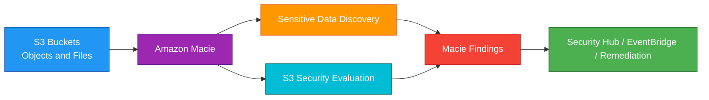
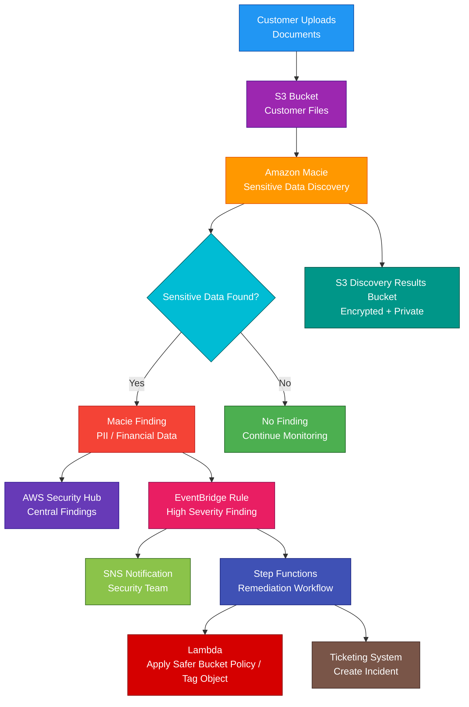

# Amazon Macie

## 1. Definition

### Simple Definition

Amazon Macie is a managed data security and data privacy service.

It helps discover, classify, and protect sensitive data stored in Amazon S3.

### Memory Hook

Macie = Finds sensitive data in S3.

### Basic Idea

Macie scans S3 buckets and objects.

It looks for sensitive data such as personal information, credentials, and financial data.

### Key Point

Macie is mainly focused on Amazon S3 data security.

For the AWS SAA exam, remember:

Macie finds sensitive data in S3.

## 2. What Problem Does It Solve?

### Main Problem

Macie solves the problem of discovering sensitive data stored in S3 and identifying risky S3 bucket configurations.

### Without Macie

You may not know:

- Which S3 buckets contain sensitive data
- Whether buckets contain personally identifiable information
- Whether sensitive objects are exposed
- Whether buckets are public
- Whether buckets are shared with other accounts
- Whether encryption is missing
- Which objects need stronger protection

### With Macie

Macie can automatically analyze S3 data and generate findings when it detects sensitive data or risky access settings.

### Key Benefit

Macie helps identify sensitive data and reduce the risk of accidental data exposure.

## 3. Core Use Cases

### Discover Sensitive Data in S3

Use Macie to find sensitive data stored in S3 buckets.

Examples:

- Names
- Addresses
- Email addresses
- Phone numbers
- Credit card numbers
- Bank account numbers
- National ID numbers
- Credentials
- Access keys

### Data Privacy and Compliance

Use Macie to support privacy and compliance programs.

Examples:

- Find personal data
- Identify regulated data
- Locate sensitive customer records
- Review where sensitive data is stored

### S3 Bucket Security Monitoring

Macie can evaluate S3 bucket security and access settings.

It can identify risks such as:

- Public buckets
- Unencrypted buckets
- Buckets shared outside the account
- Buckets shared with external AWS accounts

### Sensitive Data Classification Jobs

Create classification jobs to scan selected S3 buckets or objects.

Jobs can be:

- One-time
- Scheduled
- Scoped to specific buckets
- Scoped using object criteria

### Multi-Account Data Visibility

Use Macie with AWS Organizations to centrally monitor S3 data security across multiple accounts.

### Automated Security Response

Send Macie findings to EventBridge or Security Hub.

Then trigger automated actions such as:

- Notify security team
- Create ticket
- Apply bucket policy
- Disable public access
- Start investigation workflow

## 4. Important Features for SAA

### Sensitive Data Discovery

Sensitive data discovery is Macie’s main feature.

Macie analyzes S3 objects and detects sensitive data using:

- Managed data identifiers
- Custom data identifiers
- Allow lists
- Machine learning and pattern matching

### Managed Data Identifiers

Managed data identifiers are built-in detection patterns provided by AWS.

They can detect common sensitive data types.

Examples:

- Credit card numbers
- AWS secret access keys
- Passport numbers
- Driver’s license numbers
- Email addresses
- Phone numbers
- Bank account numbers

### Custom Data Identifiers

Custom data identifiers let you define your own sensitive data patterns.

Use them when your organization has special data formats.

Examples:

- Employee ID format
- Customer account number format
- Internal project code
- Custom patient ID pattern

### Allow Lists

Allow lists help Macie ignore known safe text patterns.

Use allow lists to reduce false positives.

Example:

Ignore sample test credit card numbers used in training files.

### Classification Job

A classification job scans S3 objects for sensitive data.

A job can be:

| Job Type | Description |
|---|---|
| One-time job | Runs once |
| Scheduled job | Runs repeatedly on a schedule |

### Automated Sensitive Data Discovery

Macie can automatically evaluate S3 buckets and sample objects to discover sensitive data across your S3 estate.

This helps provide ongoing visibility without manually creating many jobs.

### S3 Bucket Inventory

Macie builds an inventory of S3 buckets in your account.

It can show information such as:

- Bucket name
- Region
- Public access status
- Encryption status
- Shared access
- Object count
- Storage size
- Sensitive data discovery status

### Findings

A finding is a security or sensitive data issue detected by Macie.

Macie findings can include:

- Finding type
- Severity
- Affected S3 bucket
- Affected object
- Sensitive data category
- Number of occurrences
- Account ID
- Region
- Recommended investigation details

### Sensitive Data Findings

Sensitive data findings are created when Macie detects sensitive data in S3 objects.

Examples:

- Object contains credit card data
- Object contains personal information
- Object contains credentials

### Policy Findings

Policy findings are related to S3 bucket security or access settings.

Examples:

- Bucket is publicly accessible
- Bucket allows external account access
- Bucket encryption is disabled
- Bucket permissions changed in a risky way

### Finding Severity

Macie assigns severity to findings.

Higher severity usually means higher risk.

Example:

A public S3 bucket containing sensitive data is more serious than a private bucket containing non-sensitive test data.

### Discovery Results

Macie can store detailed sensitive data discovery results in an S3 bucket.

These results are useful for:

- Auditing
- Investigation
- Reporting
- Long-term retention

### Security Hub Integration

Macie can send findings to AWS Security Hub.

Security Hub provides a central view of security findings from multiple AWS services.

### EventBridge Integration

Macie sends findings to Amazon EventBridge.

Use EventBridge to automate responses.

Examples:

- Send SNS notification
- Trigger Lambda remediation
- Start Step Functions workflow
- Create ticket in an incident system

### AWS Organizations Integration

Macie supports multi-account management through AWS Organizations.

Use a delegated administrator account to manage Macie across member accounts.

### Suppression Rules

Suppression rules automatically archive findings that match specific criteria.

Use them carefully to reduce known false positives.

### S3-Only Focus

For SAA, remember:

Macie is mainly for discovering sensitive data in Amazon S3.

It does not scan EC2 packages, container images, or Lambda dependencies.

## 5. Security Model

### IAM Permissions

IAM controls who can enable, manage, and view Macie.

Common permissions:

| Permission | Purpose |
|---|---|
| `macie2:EnableMacie` | Enable Macie |
| `macie2:DisableMacie` | Disable Macie |
| `macie2:CreateClassificationJob` | Create sensitive data discovery job |
| `macie2:ListFindings` | List findings |
| `macie2:GetFindings` | View finding details |
| `macie2:CreateCustomDataIdentifier` | Create custom data identifier |
| `macie2:CreateFindingsFilter` | Create finding filter or suppression rule |

### Service-Linked Role

Macie uses a service-linked role to access S3 metadata and analyze objects.

Important point:

Do not delete the Macie service-linked role unless Macie is disabled and you understand the impact.

### S3 Permissions

Macie needs permission to inspect S3 buckets and objects.

It analyzes:

- Bucket metadata
- Bucket policies
- Access settings
- Object data selected for discovery

### KMS Permissions

If S3 objects are encrypted with customer managed KMS keys, Macie needs permission to use the KMS key for analysis.

Important exam point:

If Macie cannot decrypt an encrypted object, it cannot inspect the object contents.

### Encryption at Rest

Macie stores findings and discovery results securely.

If you store discovery results in S3, configure S3 encryption.

Common options:

- SSE-S3
- SSE-KMS

### Encryption in Transit

Macie API calls use HTTPS.

Communication between AWS services uses AWS-managed secure service integrations.

### Sensitive Discovery Results

Macie findings and discovery results may reveal where sensitive data exists.

Protect them carefully.

Use:

- Least privilege IAM
- S3 bucket encryption
- S3 Block Public Access
- Bucket policies
- KMS key policies
- CloudTrail auditing

### Least Privilege

Only security, compliance, and data governance teams should have broad access to Macie findings.

Application teams may only need findings related to their own buckets.

### Multi-Account Access

Use AWS Organizations delegated administrator for centralized Macie management.

This avoids giving every security user direct access to every member account.

### Shared Responsibility

AWS is responsible for:

- Macie managed service infrastructure
- Sensitive data detection engine
- Managed service availability
- Physical security
- Service-side security controls

You are responsible for:

- Enabling Macie in needed accounts and Regions
- Creating classification jobs
- Reviewing findings
- Securing S3 buckets
- Securing discovery result buckets
- KMS key permissions
- Remediating exposed data
- Managing suppression rules
- Responding to findings

## 6. High Availability / Durability Behavior

### Availability

Macie is a managed regional service.

AWS manages the service infrastructure and availability.

### Regional Behavior

Macie is enabled per AWS Region.

Important exam point:

If Macie is enabled in one Region, it does not automatically analyze S3 buckets in every other Region.

### Multi-Region Coverage

For broad S3 visibility, enable Macie in each Region where S3 buckets exist.

Use AWS Organizations for centralized multi-account management.

### Multi-AZ Behavior

Macie is managed by AWS across regional infrastructure.

You do not configure Multi-AZ manually.

### Finding Availability

Macie findings can be viewed in the Macie console and sent to:

- AWS Security Hub
- Amazon EventBridge
- S3 discovery result buckets
- SIEM or ticketing tools through automation

### Durability of Discovery Results

If you configure Macie to publish discovery results to S3, durability depends on S3.

For SAA, remember:

S3 is designed for 11 9s of durability.

### Long-Term Retention

Macie findings are not the same as long-term archive storage.

For long-term retention and audit, store discovery results and exported findings in S3.

### Multi-Account Behavior

A delegated Macie administrator can manage Macie across member accounts.

This improves visibility and governance across an AWS Organization.

### Important Exam Point

Macie helps identify sensitive data and risky S3 access, but it does not automatically make S3 data private or compliant.

You must act on findings.

## 7. Cost Optimization Options

### Scope Classification Jobs Carefully

Macie charges can depend on the amount of S3 data analyzed.

Scan the data that matters most.

Examples:

- Production buckets
- Buckets with customer data
- Buckets with uploads
- Buckets with unknown data classification

### Use Automated Discovery for Visibility

Automated sensitive data discovery can help identify where sensitive data may exist without manually scanning everything in every bucket.

Use it to guide deeper classification jobs.

### Use Sampling Where Appropriate

For large datasets, use scoped jobs or sampling strategies where full scanning is not required.

This can reduce cost while still giving useful visibility.

### Avoid Repeated Full Scans

Do not repeatedly scan the same large dataset unless required.

Use scheduled jobs carefully and align them with compliance needs.

### Use Object Criteria

Limit classification jobs using criteria such as:

- Bucket name
- Object prefix
- Object tags
- Last modified date
- File extension
- Object size

### Use Custom Data Identifiers Wisely

Custom identifiers help focus detection on data types that matter to your organization.

This can improve signal quality and reduce investigation time.

### Use Allow Lists

Allow lists reduce false positives.

Fewer false positives means less time spent investigating harmless findings.

### Store Results Cost-Effectively

If storing discovery results in S3, use lifecycle policies.

Example:

- Keep recent findings in S3 Standard
- Move older results to S3 Standard-IA
- Archive long-term results to Glacier

### Disable Macie in Unused Regions

If your organization does not use certain Regions, governance controls can reduce unnecessary resources and monitoring scope.

### Monitor Usage

Use AWS cost tools to monitor Macie usage.

Helpful tools:

- AWS Cost Explorer
- AWS Budgets
- Macie usage data
- Tags for ownership and cost allocation

## 8. Common Exam Traps

### Macie vs Inspector

Macie finds sensitive data in S3.

Inspector finds software vulnerabilities in EC2, ECR, and Lambda.

### Macie vs GuardDuty

Macie discovers sensitive data and S3 data security risks.

GuardDuty detects suspicious or malicious activity.

### Macie vs Security Hub

Macie creates sensitive data and S3 policy findings.

Security Hub aggregates findings from Macie and other security services.

### Macie Does Not Patch Vulnerabilities

If the question asks to find vulnerable packages or CVEs, choose Amazon Inspector.

### Macie Does Not Detect Active Attackers

If the question asks to detect compromised IAM credentials or suspicious EC2 activity, choose GuardDuty.

### Macie Is Mainly for S3

For SAA, the biggest clue is sensitive data in S3.

If the data is in S3 and you need to discover PII, think Macie.

### Macie Does Not Automatically Block Public Access

Macie can detect risky access, but you must remediate it.

To block public S3 access, use:

- S3 Block Public Access
- Bucket policies
- IAM policies
- SCPs
- Automated remediation

### Macie Needs KMS Access for Encrypted Objects

If S3 objects are encrypted with customer managed KMS keys, Macie needs decrypt permissions to inspect contents.

### Findings Are Not the Same as Remediation

Macie findings tell you what is risky.

You still need to fix bucket permissions, encryption, or data handling.

### Suppression Rules Can Hide Real Risk

Use suppression rules carefully.

A bad suppression rule can hide important sensitive data findings.

### Public Bucket with Sensitive Data Is High Risk

If a bucket is public and contains sensitive data, that is a major security concern.

Macie helps identify this situation.

## 9. Compare With Similar Services

### Service Comparison Table

| Service | Main Purpose | Best For | Choose When |
|---|---|---|---|
| Amazon Macie | Sensitive data discovery | Finding PII and sensitive data in S3 | You need to identify sensitive data in S3 |
| Amazon Inspector | Vulnerability management | EC2, ECR, Lambda vulnerability scanning | You need to find CVEs and exposed workloads |
| Amazon GuardDuty | Threat detection | Suspicious activity and compromise detection | You need managed threat detection |
| AWS Security Hub | Findings aggregation | Central security posture dashboard | You need one place for security findings |
| Amazon Detective | Investigation | Root-cause analysis of security findings | You need to investigate suspicious behavior |
| AWS Config | Resource compliance tracking | Configuration rules and compliance history | You need to evaluate AWS resource configuration |
| S3 Block Public Access | S3 public access prevention | Blocking public bucket/object exposure | You need to prevent public S3 access |

### Macie vs Inspector

| Feature | Amazon Macie | Amazon Inspector |
|---|---|---|
| Main purpose | Sensitive data discovery | Vulnerability scanning |
| Focus | S3 objects and bucket security | EC2, ECR, Lambda vulnerabilities |
| Example | S3 object contains credit card numbers | EC2 has vulnerable OpenSSL package |
| Best for | Data privacy | Vulnerability management |

### Macie vs GuardDuty

| Feature | Amazon Macie | Amazon GuardDuty |
|---|---|---|
| Main purpose | Discover sensitive data | Detect threats |
| Focus | S3 data classification | Suspicious AWS activity |
| Example | Bucket contains PII | IAM key used from malicious IP |
| Best for | Data security and privacy | Threat detection |

### Macie vs Security Hub

| Feature | Amazon Macie | AWS Security Hub |
|---|---|---|
| Main purpose | Create sensitive data findings | Aggregate security findings |
| Finds sensitive data | Yes | No, not directly |
| Central dashboard | Limited to Macie findings | Broad security findings |
| Common use together | Sends findings | Receives Macie findings |

### Macie vs AWS Config

| Feature | Amazon Macie | AWS Config |
|---|---|---|
| Main purpose | Sensitive data discovery | Resource configuration compliance |
| Focus | S3 sensitive data | AWS resource configuration |
| Example | Object contains PII | Bucket encryption disabled |
| Best for | Data classification | Compliance rule evaluation |

### Macie vs S3 Block Public Access

| Feature | Amazon Macie | S3 Block Public Access |
|---|---|---|
| Main purpose | Detect sensitive data and risky S3 access | Prevent public S3 access |
| Action type | Detective | Preventive |
| Finds PII | Yes | No |
| Blocks public access | No | Yes |
| Best together | Yes | Yes |

### When to Choose Amazon Macie

Choose Macie when:

- You need to discover sensitive data in S3
- You need to find PII or financial data in S3 objects
- You need to classify S3 data
- You need S3 bucket security findings
- You need compliance visibility for data privacy
- You need automated sensitive data discovery
- You need custom data identifiers
- You need multi-account S3 data security monitoring
- You need sensitive data findings sent to Security Hub or EventBridge

## 10. Mini Architecture Example

### Scenario

A company stores customer-uploaded documents in Amazon S3.

The security team needs to detect whether any uploaded files contain sensitive data such as credit card numbers or personal information.

If sensitive data is found in a public or shared bucket, the team wants to be notified.

### Architecture

Enable Amazon Macie.

Create a sensitive data discovery job for the customer upload bucket.

Send findings to Security Hub and EventBridge.

Use EventBridge to notify the security team and trigger a remediation workflow.

### Why This Is Good

- Macie discovers sensitive data in S3
- Managed data identifiers detect common sensitive data types
- Custom data identifiers can detect company-specific patterns
- Security Hub centralizes findings
- EventBridge enables automated response
- SNS notifies the security team
- Step Functions can coordinate remediation
- Lambda can tag objects or adjust access controls
- Discovery results are stored securely in encrypted S3
- S3 remains the durable storage layer

### Exam Answer Pattern

If the question says:

“Discover sensitive data, PII, or financial data stored in S3.”

Think:

Amazon Macie.

If the question says:

“Find software vulnerabilities or CVEs in EC2, ECR, or Lambda.”

Think:

Amazon Inspector.

If the question says:

“Detect suspicious activity or compromised credentials.”

Think:

Amazon GuardDuty.

If the question says:

“Prevent S3 buckets from becoming public.”

Think:

S3 Block Public Access.

### Final Memory Hook

Macie = Sensitive data discovery.

Main target = Amazon S3.

PII = Personally identifiable information.

Managed data identifiers = Built-in sensitive data detectors.

Custom data identifiers = Your own patterns.

Allow lists = Reduce false positives.

Classification job = Scans S3 data.

Policy finding = S3 access/security issue.

Sensitive data finding = Sensitive data detected.

Security Hub = Central findings.

EventBridge = Automated response.

Inspector = Vulnerabilities.

GuardDuty = Threats.

Config = Resource compliance.

S3 Block Public Access = Prevent public exposure.

