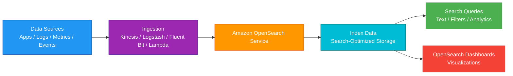
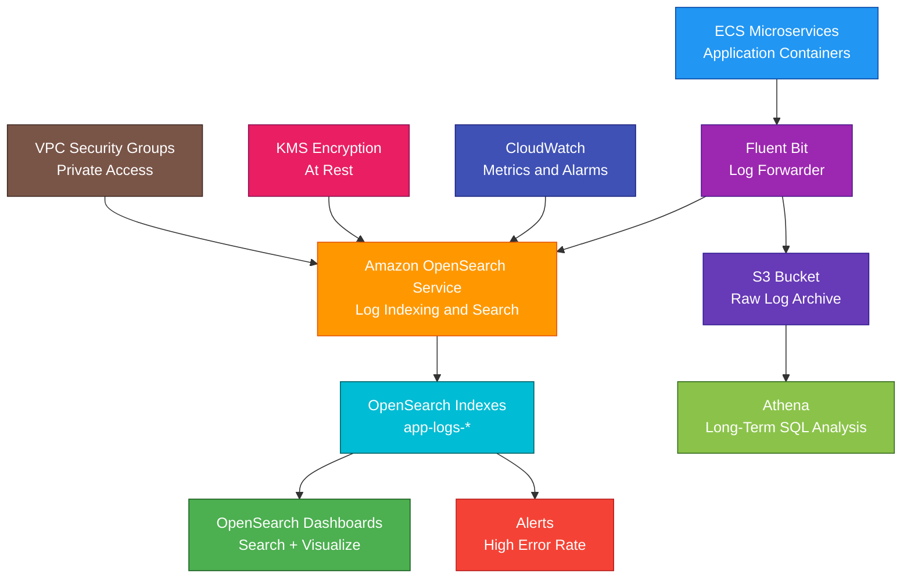

# Amazon OpenSearch Service

<details>
<summary>

## 1. Definition

</summary>

### Simple Definition

Amazon OpenSearch Service is a managed search and analytics service.

It helps you search, analyze, and visualize large amounts of data such as logs, metrics, events, and documents.

### Memory Hook

OpenSearch = Search engine + log analytics.

### Basic Idea

Applications, logs, or data pipelines send data into OpenSearch.

OpenSearch indexes the data so users can search it quickly and build dashboards.



### Key Point

Amazon OpenSearch Service is best for search, log analytics, observability, and near real-time analytics.

It is not a relational database, data warehouse, or long-term low-cost storage service.

</details>

<details>
<summary>

## 2. What Problem Does It Solve?

</summary>

### Main Problem

OpenSearch solves the problem of searching and analyzing large volumes of data quickly.

Traditional databases are not always good for full-text search, log exploration, or fast filtering across huge event datasets.

### Without OpenSearch

You may struggle with:

- Slow keyword searches
- Hard-to-query application logs
- No centralized log analytics
- Poor observability dashboards
- Expensive custom search systems
- Difficulty finding errors across services
- Slow filtering across large event data
- No full-text search for application data

### With OpenSearch

Data is indexed for fast search and analytics.

Users can quickly search, filter, aggregate, and visualize data.

### Key Benefit

OpenSearch makes it easier to search and analyze operational, application, and document data in near real time.

</details>

<details>
<summary>

## 3. Core Use Cases

</summary>

### Log Analytics

Use OpenSearch to search and analyze logs.

Examples:

- Application logs
- Web server logs
- API Gateway logs
- VPC Flow Logs
- CloudTrail logs
- Container logs
- Lambda logs

### Full-Text Search

Use OpenSearch when users need keyword search.

Examples:

- Product search
- Website search
- Document search
- Knowledge base search
- Support article search

### Observability

Use OpenSearch to monitor application and infrastructure health.

Examples:

- Error trends
- Latency dashboards
- Request volume
- Service health
- Distributed trace search

### Security Analytics

Use OpenSearch to investigate security events.

Examples:

- Search login events
- Analyze suspicious IP activity
- Explore firewall logs
- Investigate CloudTrail activity
- Build security dashboards

### Metrics Analytics

Use OpenSearch to analyze metrics and events.

Examples:

- Service latency over time
- Error count by application
- Request count by endpoint
- Infrastructure event trends

### E-Commerce Search

Use OpenSearch to power product search.

Examples:

- Search by product name
- Filter by price
- Filter by category
- Sort by relevance
- Support typo tolerance and ranking

### Centralized Search Platform

Use OpenSearch as a centralized search layer for multiple applications.

Example:

Several microservices publish searchable documents into one OpenSearch domain.

</details>

<details>
<summary>

## 4. Important Features for SAA

</summary>

### Domain

An OpenSearch domain is the main managed cluster resource.

It contains:

- OpenSearch nodes
- Indexes
- Storage
- Security settings
- Network settings
- Dashboards endpoint

### Cluster

A cluster is a group of OpenSearch nodes working together.

Amazon OpenSearch Service manages much of the cluster infrastructure.

### Node

A node is a server that participates in the OpenSearch cluster.

Common node types:

| Node Type | Purpose |
|---|---|
| Data node | Stores and searches indexed data |
| Dedicated master node | Manages cluster state |
| UltraWarm node | Stores older read-only data at lower cost |
| Coordinator role behavior | Coordinates query requests, depending on design |

### Dedicated Master Nodes

Dedicated master nodes manage cluster state.

They help improve cluster stability.

Best practice:

Use dedicated master nodes for production domains.

### Data Nodes

Data nodes store indexes and handle search/indexing workloads.

Choose data node size and count based on:

- Data volume
- Query load
- Indexing rate
- Storage needs
- Availability needs

### Index

An index is a collection of documents.

It is similar to a searchable table, but designed for search and analytics.

Examples:

- `app-logs-2026-05-04`
- `products`
- `orders`
- `security-events`

### Document

A document is a JSON record stored in an index.

Example:

```json
{
  "productId": "p123",
  "name": "Wireless Keyboard",
  "category": "electronics",
  "price": 49.99
}
```

### Inverted Index

OpenSearch uses an inverted index to make text search fast.

Simple idea:

Instead of scanning every document, OpenSearch maps words to the documents that contain them.

### Shard

A shard is a piece of an index.

Shards allow OpenSearch to distribute data across nodes.

### Primary Shard

A primary shard stores the original copy of part of an index.

### Replica Shard

A replica shard is a copy of a primary shard.

Replica shards help with:

- High availability
- Fault tolerance
- Search performance

### Shard Planning

Shard count affects performance and cost.

Too many shards can waste resources.

Too few shards can limit scaling.

### OpenSearch Dashboards

OpenSearch Dashboards is a visualization and dashboard tool.

Use it for:

- Log exploration
- Charts
- Dashboards
- Search UI
- Operational analytics
- Security analytics

### Near Real-Time Search

OpenSearch is near real-time.

Data usually becomes searchable shortly after indexing.

Important point:

It is not always instantly searchable at the exact moment it is written.

### Full-Text Search

OpenSearch supports full-text search.

Examples:

- Match keywords
- Search phrases
- Relevance scoring
- Fuzzy matching
- Filtering and sorting

### Aggregations

Aggregations summarize data.

Examples:

- Count errors by service
- Average latency by endpoint
- Top IP addresses
- Request count per minute

### Index Lifecycle Management

Index State Management, or ISM, helps manage indexes over time.

Use it to:

- Move old indexes to cheaper storage
- Delete old indexes
- Rollover indexes
- Manage hot/warm/cold data lifecycle

### Hot Storage

Hot storage is for recent, frequently searched data.

It uses regular data nodes and is best for fast reads and writes.

### UltraWarm Storage

UltraWarm stores older, less frequently accessed data at lower cost.

Use it for log analytics where old data is still queried sometimes.

### Cold Storage

Cold storage is for rarely accessed data.

Use it when you need long retention but only occasional queries.

### Snapshots

Snapshots back up OpenSearch indexes.

Amazon OpenSearch Service can take automated snapshots.

Manual snapshots can be stored in S3.

### Fine-Grained Access Control

Fine-grained access control provides detailed permissions inside OpenSearch.

It can control access to:

- Indexes
- Documents
- Fields
- Dashboards
- Cluster actions

### VPC Access

OpenSearch domains can be deployed inside a VPC.

This keeps the domain private and accessible only from allowed network paths.

### Public Endpoint

A public endpoint is internet-accessible.

If used, it must be secured carefully with access policies, authentication, and encryption.

### Ingestion Options

Common ways to send data to OpenSearch:

| Ingestion Tool | Common Use |
|---|---|
| Kinesis Data Firehose | Stream logs/events into OpenSearch |
| Logstash | Log ingestion and transformation |
| Fluent Bit / Fluentd | Container and application log shipping |
| Lambda | Custom ingestion or transformation |
| OpenSearch Ingestion | Managed ingestion pipelines |
| Beats agents | Log and metric forwarding |

### Integration with CloudWatch Logs

CloudWatch Logs can be streamed or exported to OpenSearch through supported pipelines.

Common pattern:

CloudWatch Logs → Lambda or Firehose → OpenSearch

### Serverless Option

Amazon OpenSearch Serverless provides search and analytics without managing clusters.

Use it when you want less capacity planning and simpler scaling.

For SAA, understand both:

- OpenSearch Service domains = managed clusters
- OpenSearch Serverless = serverless collections

</details>

<details>
<summary>

## 5. Security Model

</summary>

### IAM Permissions

IAM controls who can create, modify, delete, and manage OpenSearch resources.

Common permissions:

| Permission | Purpose |
|---|---|
| `es:CreateDomain` | Create OpenSearch domain |
| `es:UpdateDomainConfig` | Modify domain settings |
| `es:DeleteDomain` | Delete domain |
| `es:DescribeDomain` | View domain details |
| `es:ESHttpGet` | Send HTTP GET requests |
| `es:ESHttpPost` | Send HTTP POST requests |
| `es:ESHttpPut` | Send HTTP PUT requests |
| `es:ESHttpDelete` | Send HTTP DELETE requests |

### Domain Access Policy

A domain access policy controls who can access the OpenSearch domain endpoint.

It is a resource-based policy.

Use it to allow or deny access based on:

- IAM principal
- Source IP
- AWS account
- VPC endpoint or network conditions

### Fine-Grained Access Control

Fine-grained access control controls permissions inside OpenSearch.

Examples:

- User A can read only `logs-prod-*`
- User B can manage dashboards
- User C can access only specific fields
- Admins can manage indexes

### Authentication Options

Authentication can include:

- IAM-based access
- Internal user database
- SAML federation
- Amazon Cognito integration for Dashboards
- OpenSearch fine-grained access users and roles

### Encryption at Rest

OpenSearch supports encryption at rest using AWS KMS.

This protects:

- Index data
- Logs
- Swap files
- Automated snapshots where applicable

### Encryption in Transit

Use node-to-node encryption and HTTPS.

Encryption in transit protects:

- Client-to-domain traffic
- Node-to-node cluster communication

### Node-to-Node Encryption

Node-to-node encryption protects traffic between OpenSearch nodes.

Use it for production and sensitive workloads.

### VPC Security

For private domains, deploy OpenSearch in a VPC.

Use:

- Private subnets
- Security groups
- Network ACLs
- VPC endpoints where appropriate
- VPN or Direct Connect for hybrid access

### Security Groups

Security groups control which clients can connect to OpenSearch.

Best practice:

Allow access only from trusted applications, bastion hosts, or ingestion services.

### Public Endpoint Security

If using a public endpoint, protect it carefully.

Use:

- Strong access policy
- Fine-grained access control
- HTTPS
- Cognito or SAML authentication for Dashboards
- IP restrictions where appropriate

### Secrets Management

Do not hardcode OpenSearch credentials in applications.

Use:

- AWS Secrets Manager
- Systems Manager Parameter Store
- IAM roles
- KMS-encrypted configuration

### Audit Logs

OpenSearch can provide audit logs for security-related events.

Use audit logs to track:

- Login attempts
- Access denied events
- Index access
- Configuration changes
- User activity

### CloudTrail Auditing

CloudTrail records OpenSearch management API activity.

Examples:

- Domain creation
- Domain update
- Domain deletion
- Access policy changes

### Shared Responsibility

AWS is responsible for:

- OpenSearch managed infrastructure
- Hardware maintenance
- Managed service availability
- Physical security
- Service platform operations

You are responsible for:

- Domain access policies
- Fine-grained access control
- VPC and security groups
- Encryption settings
- KMS key policies
- Index permissions
- User authentication
- Data retention
- Snapshot strategy
- Monitoring and alerting

</details>

<details>
<summary>

## 6. High Availability / Durability Behavior

</summary>

### Availability

OpenSearch can be configured for high availability by using multiple Availability Zones and replicas.

### Multi-AZ Deployment

Production OpenSearch domains should use multiple Availability Zones.

This helps protect against AZ-level failures.

### Zone Awareness

Zone awareness distributes nodes across Availability Zones.

Use it to improve availability.

### Multi-AZ with Standby

Multi-AZ with Standby provides a more resilient deployment option for production workloads.

It keeps standby capacity available for faster recovery during failures.

### Replica Shards

Replica shards improve availability and search performance.

If a node with a primary shard fails, a replica can be promoted.

### Dedicated Master Nodes

Dedicated master nodes improve cluster stability.

For production, use at least three dedicated master nodes across Availability Zones.

### Snapshots for Recovery

Snapshots are used for backup and restore.

Use snapshots to recover from:

- Accidental deletion
- Bad index changes
- Cluster failure
- Data corruption
- Migration needs

### Automated Snapshots

Amazon OpenSearch Service can take automated snapshots.

These help restore the domain if needed.

### Manual Snapshots

Manual snapshots can be stored in S3.

Use manual snapshots for:

- Long-term backup
- Migration
- Before major changes
- Disaster recovery planning

### Multi-Region Behavior

OpenSearch domains are regional.

For Multi-Region search, you need to design replication separately.

Options include:

- Cross-cluster replication where supported
- Dual ingestion to multiple Regions
- Snapshot and restore
- Application-level replication
- Multi-Region ingestion pipeline

### Durability

OpenSearch stores indexed data on cluster storage.

For long-term durable storage and replay, keep original data in S3.

Important exam point:

S3 is often the source of truth; OpenSearch is the searchable index.

### Failure Handling

A good OpenSearch design includes:

- Multiple AZs
- Replica shards
- Dedicated master nodes
- Snapshots
- Monitoring
- Index lifecycle policies
- S3 backup/source data

### Important Exam Point

OpenSearch can be highly available, but it must be configured correctly with Multi-AZ, replicas, and snapshots.

</details>

<details>
<summary>

## 7. Cost Optimization Options

</summary>

### Choose the Right Deployment Option

| Workload Pattern | Better Option |
|---|---|
| Predictable search workload | OpenSearch managed domain |
| Variable or unknown workload | OpenSearch Serverless |
| Large historical logs | UltraWarm or cold storage |
| Rarely queried raw logs | S3 with Athena |

### Right-Size Instances

Choose instance types based on:

- Storage needs
- Indexing rate
- Query load
- Memory usage
- CPU usage
- Shard count

### Use UltraWarm for Older Data

Move older, less frequently accessed indexes to UltraWarm.

This reduces cost compared with keeping all data on hot nodes.

### Use Cold Storage for Rare Access

Use cold storage for data that must be retained but is rarely queried.

### Use Index Lifecycle Policies

Use ISM policies to:

- Rollover indexes
- Move indexes to warm storage
- Move indexes to cold storage
- Delete expired indexes

### Delete Old Indexes

Do not keep logs forever in hot storage.

Set retention based on business, compliance, and investigation needs.

### Store Raw Data in S3

Use S3 as the long-term durable store for raw logs or events.

Use OpenSearch for fast search over recent or important data.

### Avoid Too Many Small Shards

Too many shards increase overhead.

Design shard count carefully.

### Avoid Oversized Shards

Very large shards can hurt recovery and performance.

Balance shard size based on workload.

### Use Compression

Compression can reduce storage cost.

OpenSearch supports compression features depending on index settings.

### Monitor Query and Indexing Load

Use CloudWatch and OpenSearch metrics to avoid overprovisioning.

Watch:

- CPU
- JVM memory pressure
- Disk usage
- Search latency
- Indexing latency
- Queue rejections

### Use Reserved Instances Where Appropriate

For steady OpenSearch domain workloads, Reserved Instances can reduce cost.

### Use Serverless for Variable Workloads

OpenSearch Serverless can reduce capacity planning for unpredictable workloads.

### Keep Dashboards Efficient

Poor dashboard queries can create heavy cluster load.

Optimize dashboards by:

- Filtering time ranges
- Avoiding broad queries
- Using proper indexes
- Limiting high-cardinality visualizations

</details>

<details>
<summary>

## 8. Common Exam Traps

</summary>

### OpenSearch vs Athena

This is a common exam trap.

| Requirement | Choose |
|---|---|
| Full-text search and log exploration | OpenSearch |
| Serverless SQL directly on S3 | Athena |

### OpenSearch vs CloudWatch Logs

CloudWatch Logs collects and monitors logs.

OpenSearch provides advanced search, analytics, and dashboards over indexed logs.

### OpenSearch vs Redshift

Redshift is a data warehouse for BI and OLAP SQL analytics.

OpenSearch is for search, logs, and near real-time analytics.

### OpenSearch vs RDS

RDS is for relational application databases.

OpenSearch is not an OLTP database.

Do not use OpenSearch as the main transactional database.

### OpenSearch vs DynamoDB

DynamoDB is for low-latency key-value access.

OpenSearch is for search and analytics.

Common pattern:

DynamoDB stores application data; OpenSearch indexes it for search.

### OpenSearch Is Not the Source of Truth

For logs and events, keep raw data in S3 when long-term durability and replay are important.

Use OpenSearch as the searchable index.

### Too Many Shards Can Hurt Performance

More shards does not always mean better performance.

Too many shards create overhead.

### Replica Shards Improve HA

If the exam asks for better availability and search performance, replica shards are important.

### Dedicated Master Nodes Improve Stability

For production clusters, dedicated master nodes are recommended.

### VPC Domain Is More Private

If the question asks for private access, choose VPC-based OpenSearch domain.

### KMS Permissions Matter

If encryption uses a customer managed KMS key, KMS permissions must allow required access.

### OpenSearch Is Near Real-Time

Do not assume data is instantly searchable the exact moment it is indexed.

### Dashboards Need Authentication

OpenSearch Dashboards should not be exposed publicly without authentication and access control.

</details>

<details>
<summary>

## 9. Compare With Similar Services

</summary>

### Service Comparison Table

| Service | Main Purpose | Best For | Choose When |
|---|---|---|---|
| Amazon OpenSearch Service | Search and analytics | Full-text search, logs, observability | You need fast search and indexed analytics |
| Amazon Athena | Serverless SQL on S3 | Ad hoc S3 data lake queries | You need SQL directly on S3 |
| Amazon CloudWatch Logs | Log collection and monitoring | AWS logs, metrics, alarms | You need operational monitoring and alarms |
| Amazon Redshift | Data warehouse | BI and OLAP analytics | You need high-performance SQL analytics |
| DynamoDB | NoSQL database | Key-value/document app data | You need low-latency application data access |
| Amazon RDS | Relational database | SQL transactions | You need OLTP relational workloads |
| Amazon Kendra | Enterprise search | Search across enterprise documents | You need intelligent enterprise document search |

### OpenSearch vs Athena

| Feature | OpenSearch | Athena |
|---|---|---|
| Main purpose | Search and indexed analytics | SQL query on S3 |
| Data storage | Indexed in OpenSearch | Data stays in S3 |
| Best for | Full-text search and log exploration | Ad hoc data lake queries |
| Query style | Search DSL, Dashboards, APIs | SQL |
| Cost model | Cluster/serverless capacity and storage | Data scanned |

### OpenSearch vs CloudWatch Logs

| Feature | OpenSearch | CloudWatch Logs |
|---|---|---|
| Main purpose | Advanced search and analytics | Log collection and monitoring |
| Dashboards | OpenSearch Dashboards | CloudWatch Dashboards / Logs Insights |
| Best for | Rich log exploration and search | AWS-native monitoring and alarms |
| Common use together | Receives logs | Source of logs |

### OpenSearch vs Redshift

| Feature | OpenSearch | Redshift |
|---|---|---|
| Main purpose | Search and log analytics | Data warehouse |
| Query style | Search/filter/aggregations | SQL analytics |
| Best for | Text search and operational analytics | BI reporting and OLAP |
| Example | Search logs by error message | Sales dashboard by quarter |

### OpenSearch vs DynamoDB

| Feature | OpenSearch | DynamoDB |
|---|---|---|
| Main purpose | Search and analytics | NoSQL application database |
| Access pattern | Text search, filters, aggregations | Key-value lookups |
| Source of truth | Usually not | Often yes |
| Common use together | Search index | Primary app data store |

### OpenSearch vs Kendra

| Feature | OpenSearch | Amazon Kendra |
|---|---|---|
| Main purpose | Search engine and analytics | Intelligent enterprise search |
| Best for | Custom search/log analytics | Search across enterprise documents |
| Search type | Configurable indexing/search | ML-powered relevance and connectors |
| Example | Product search or log search | Search company documents and policies |

### When to Choose OpenSearch

Choose OpenSearch when:

- You need full-text search
- You need fast log analytics
- You need near real-time search
- You need OpenSearch Dashboards
- You need text relevance scoring
- You need indexed filtering and aggregations
- You need observability dashboards
- You need security event search
- You need application search like product or document search
- Athena SQL on S3 is not fast or interactive enough for search use cases

</details>

<details>
<summary>

## 10. Mini Architecture Example

</summary>

### Scenario

A company runs a microservices application on ECS.

The operations team wants to search application logs, detect errors, and build dashboards showing latency, error counts, and request volume.

### Architecture

Containers send logs using Fluent Bit.

Logs are delivered to Amazon OpenSearch Service.

OpenSearch indexes the logs.

Teams use OpenSearch Dashboards to search logs and create visualizations.

Raw logs are also stored in S3 for long-term retention.



### Why This Is Good

- ECS services send logs to OpenSearch
- OpenSearch indexes logs for fast search
- Dashboards help teams visualize errors and latency
- Alerts can notify teams about operational problems
- S3 stores raw logs durably for long-term retention
- Athena can query archived logs in S3
- KMS protects indexed data at rest
- VPC and security groups restrict access
- CloudWatch monitors domain health and metrics
- The architecture separates searchable recent logs from durable long-term archive

### Exam Answer Pattern

If the question says:

“Search and analyze logs in near real time with dashboards.”

Think:

Amazon OpenSearch Service.

If the question says:

“Run SQL queries directly on logs stored in S3.”

Think:

Amazon Athena.

If the question says:

“Collect metrics, logs, alarms, and dashboards for AWS resources.”

Think:

Amazon CloudWatch.

If the question says:

“Run BI analytics in a managed data warehouse.”

Think:

Amazon Redshift.

### Final Memory Hook

OpenSearch = Search and analytics.

Best use cases = Logs, search, observability.

Index = Searchable collection of documents.

Document = JSON record.

Shard = Piece of an index.

Replica shard = HA and search scaling.

Dedicated master = Cluster stability.

Dashboards = Visualize and explore data.

VPC domain = Private access.

Fine-grained access control = Index/user permissions.

Hot storage = Recent fast data.

UltraWarm = Older lower-cost searchable data.

Cold storage = Rarely accessed retention.

Snapshots = Backup and restore.

S3 = Long-term source of truth.

Athena = SQL on S3.

Redshift = Data warehouse.

CloudWatch = Monitoring and logs.

DynamoDB/RDS = Application databases.

</details>