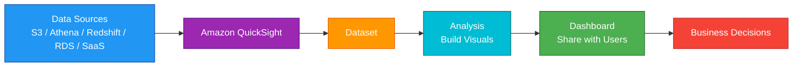
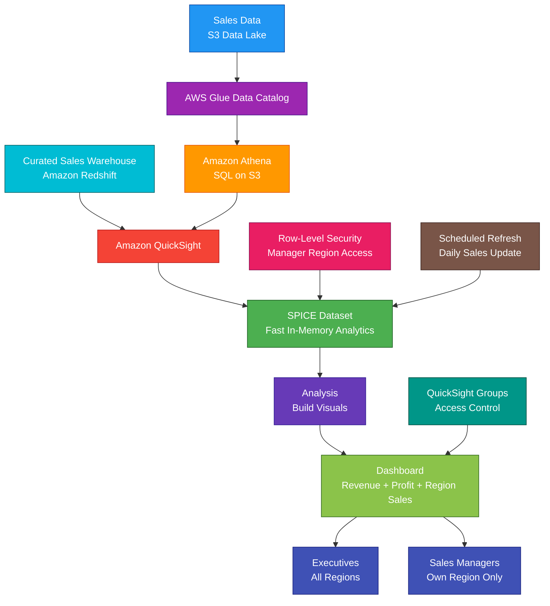

# Amazon QuickSight

<details>
<summary>

## 1. Definition

</summary>

### Simple Definition

Amazon QuickSight is AWS’s managed business intelligence, reporting, and data visualization service.

It helps users create dashboards, reports, charts, and analytics from different data sources.

### Naming Note

Amazon QuickSight has been rebranded under the broader Amazon Quick analytics and AI platform, but QuickSight functionality continues as Amazon Quick Sight. Existing QuickSight APIs, SDKs, and integrations continue to work. :contentReference[oaicite:0]{index=0}

### Memory Hook

QuickSight = AWS BI dashboards and reports.

### Basic Idea

QuickSight connects to data sources, prepares datasets, creates visualizations, and shares dashboards with users.



### Key Point

QuickSight is for business intelligence and visualization.

It is not a database, data warehouse, ETL service, or data lake storage service.

</details>

<details>
<summary>

## 2. What Problem Does It Solve?

</summary>

### Main Problem

QuickSight solves the problem of turning raw data into useful dashboards, reports, and visual insights.

Instead of manually building reporting servers or exporting spreadsheets, teams can use QuickSight to analyze and share data securely.

### Without QuickSight

You may need to manage:

- BI servers
- Dashboard infrastructure
- Report generation tools
- User access systems
- Scaling for many dashboard viewers
- Data source connections
- Manual spreadsheet exports
- Embedded analytics infrastructure

### With QuickSight

AWS provides a managed BI platform.

You focus on:

- Connecting data sources
- Building datasets
- Creating dashboards
- Sharing reports
- Securing data access
- Managing users and groups

### Key Benefit

QuickSight helps business users understand data without needing to manage BI infrastructure.

</details>

<details>
<summary>

## 3. Core Use Cases

</summary>

### Business Dashboards

Use QuickSight to build dashboards for business teams.

Examples:

- Sales dashboard
- Finance dashboard
- Marketing dashboard
- Executive KPI dashboard
- Customer success dashboard

### Operational Reporting

Use QuickSight to monitor business and operational metrics.

Examples:

- Daily revenue
- Orders by region
- Support ticket volume
- Application usage
- Inventory levels

### Data Visualization

Use QuickSight to create charts and visuals.

Examples:

- Bar charts
- Line charts
- Pie charts
- Tables
- Heat maps
- KPI cards
- Geospatial maps

### BI on Data Lakes

Use QuickSight with Athena and S3 to visualize data lake analytics.

Common pattern:

S3 data lake → Glue Data Catalog → Athena → QuickSight dashboard

### BI on Data Warehouses

Use QuickSight with Redshift for high-performance analytics dashboards.

Common pattern:

Data sources → Redshift → QuickSight

### Embedded Analytics

Use QuickSight embedded analytics to place dashboards, visuals, or analytics experiences inside your own applications. QuickSight supports embedding dashboards, visuals, the QuickSight console, and Q search experiences depending on user and edition requirements. :contentReference[oaicite:1]{index=1}

### Paginated Reports

Use QuickSight Pixel Perfect Reports for highly formatted multipage reports such as PDFs and scheduled exports. :contentReference[oaicite:2]{index=2}

### Natural Language Analytics

Use QuickSight Q so users can ask questions about data in natural language and receive visual answers.

Example:

“Show sales by region for last quarter.”

</details>

<details>
<summary>

## 4. Important Features for SAA

</summary>

### Data Source

A data source is where QuickSight gets data from.

Common data sources:

| Data Source | Example Use |
|---|---|
| Amazon S3 | Data lake files |
| Amazon Athena | SQL queries on S3 |
| Amazon Redshift | Data warehouse analytics |
| Amazon RDS | Relational database reporting |
| Amazon Aurora | Application database reporting |
| AWS Glue Data Catalog | Metadata for data lake tables |
| SaaS apps | Business application data |
| Uploaded files | CSV or Excel-style analysis |

### Dataset

A dataset is the prepared data that QuickSight uses for analysis.

A dataset can include:

- Selected columns
- Calculated fields
- Joins
- Filters
- Data type changes
- Row-level security rules

### Analysis

An analysis is the workspace where authors build charts, visuals, filters, and layouts.

Think of it as the editable dashboard design area.

### Dashboard

A dashboard is the published version of an analysis.

Users can view and interact with dashboards based on permissions.

### Visual

A visual is one chart, table, KPI, or graph inside an analysis or dashboard.

Examples:

- Revenue by month
- Sales by region
- Top 10 products
- Error rate trend

### SPICE

SPICE means Super-fast, Parallel, In-memory Calculation Engine.

It is QuickSight’s fast in-memory engine for imported datasets.

QuickSight datasets can use SPICE or direct query mode. :contentReference[oaicite:3]{index=3}

### SPICE Mode

In SPICE mode, data is imported into QuickSight’s in-memory engine.

Best for:

- Faster dashboards
- Reducing load on source systems
- Repeated dashboard queries
- Stable reporting datasets

### Direct Query Mode

In direct query mode, QuickSight queries the source data directly.

Best for:

- Fresh data requirements
- Large datasets not imported into SPICE
- Data that changes frequently
- Using source system compute

### SPICE vs Direct Query

| Feature | SPICE | Direct Query |
|---|---|---|
| Data location | Imported into QuickSight | Stays in source |
| Performance | Usually faster | Depends on source |
| Data freshness | Needs refresh | More current |
| Source load | Lower | Higher |
| Best for | Fast dashboards | Fresh live queries |

### Refresh

SPICE datasets must be refreshed to get updated data.

Refresh can be:

- Manual
- Scheduled
- Incremental, where supported

### Calculated Fields

Calculated fields create new fields from existing data.

Examples:

```text
profit = revenue - cost
profit_margin = profit / revenue
```

### Filters

Filters limit what data appears in visuals.

Examples:

- Region = East
- Year = 2026
- Product category = Electronics

### Parameters

Parameters allow dashboard users to change values dynamically.

Example:

A dashboard parameter lets users select a region or date range.

### Controls

Controls are UI elements that let dashboard users interact with filters and parameters.

Examples:

- Drop-down list
- Date picker
- Search box
- Slider

### QuickSight Q

QuickSight Q lets users ask natural language questions about data.

Example:

“Which product had the highest revenue last month?”

### Topics

A topic helps QuickSight Q understand a business area.

Example:

A sales topic may include fields such as revenue, region, product, and sales date.

### Row-Level Security

Row-level security, or RLS, restricts which rows each user can see.

Example:

A sales manager for the East region can only see East region sales.

QuickSight supports row-level security for restricting dataset access in Enterprise edition. :contentReference[oaicite:4]{index=4}

### Column-Level Security

Column-level security restricts access to specific columns.

Example:

A user can see sales totals but not customer email addresses.

### Embedded Dashboards

Embedded dashboards let you show QuickSight dashboards inside your own web app.

Use this for customer-facing or internal analytics portals.

### Anonymous Embedding

Anonymous embedding allows dashboards to be embedded for users who are not directly registered as QuickSight users.

This is useful for customer-facing apps with many end users.

### Registered User Embedding

Registered user embedding is for users who exist as QuickSight users.

Use this for authenticated internal analytics experiences.

### Pixel Perfect Reports

Pixel Perfect Reports are formatted reports that can be scheduled and shared.

Use them for:

- Invoices
- Statements
- Regulatory reports
- Printable reports
- Multipage PDF reports

### QuickSight Roles

Common QuickSight roles:

| Role | Purpose |
|---|---|
| Admin | Manage QuickSight account settings |
| Author | Create datasets, analyses, and dashboards |
| Reader | View dashboards and reports |

### Editions

QuickSight has different edition and feature levels.

For SAA, remember:

Advanced features such as row-level security, embedded analytics, and some enterprise identity features are commonly associated with Enterprise edition.

</details>

<details>
<summary>

## 5. Security Model

</summary>

### IAM Permissions

IAM controls who can manage QuickSight resources at the AWS level.

Common permissions:

| Permission | Purpose |
|---|---|
| `quicksight:CreateDataSource` | Create data source |
| `quicksight:CreateDataSet` | Create dataset |
| `quicksight:CreateAnalysis` | Create analysis |
| `quicksight:CreateDashboard` | Create dashboard |
| `quicksight:DescribeDashboard` | View dashboard details |
| `quicksight:UpdateDashboardPermissions` | Manage dashboard permissions |
| `quicksight:RegisterUser` | Register QuickSight user |

### QuickSight Users and Groups

QuickSight has its own user and group access model.

Use groups to manage dashboard sharing more easily.

Examples:

- Finance group
- Sales group
- Executives group
- Operations group

### Data Source Permissions

QuickSight needs permission to connect to data sources.

Examples:

- Athena query permissions
- S3 bucket access
- Redshift credentials or IAM access
- RDS network and credential access

### S3 Permissions

When QuickSight reads S3 data through Athena or directly, permissions must allow access to the needed buckets and prefixes.

### VPC Connections

QuickSight can connect to private data sources in a VPC using VPC connectivity.

Use this when dashboards need data from private resources such as:

- RDS in private subnets
- Redshift in private subnets
- Private databases
- Internal data services

### Row-Level Security

RLS restricts rows based on user or group.

Example:

| User | Allowed Region |
|---|---|
| Alice | East |
| Bob | West |
| Manager | All regions |

### Column-Level Security

Column-level security hides sensitive columns from certain users.

Example:

Hide salary, email, or customer ID columns from users who do not need them.

### Encryption at Rest

QuickSight protects stored assets and SPICE data using encryption.

For related source data, configure encryption in the source service.

Examples:

- S3 SSE-KMS
- Redshift encryption
- RDS encryption
- Athena result encryption

### Encryption in Transit

QuickSight uses secure connections for service communication.

Use TLS/SSL for database connections where supported.

### KMS Permissions

If source data is encrypted with customer managed KMS keys, QuickSight must have the needed KMS permissions.

Missing KMS permissions can cause data access or refresh failures.

### Identity Federation

QuickSight can integrate with identity providers for enterprise access.

Common patterns:

- IAM Identity Center
- SAML federation
- Active Directory-based access
- IAM-based federation

### Dashboard Sharing Security

Dashboards should only be shared with users or groups that need access.

Avoid broad sharing of dashboards that contain sensitive business data.

### Embedded Analytics Security

For embedded dashboards, the application must authenticate and authorize users correctly.

Use session controls, RLS, and scoped permissions to avoid exposing data to the wrong users.

### CloudTrail Auditing

Use CloudTrail to audit QuickSight API activity.

Examples:

- Dashboard creation
- Permission changes
- User registration
- Data source changes
- Asset updates

### Shared Responsibility

AWS is responsible for:

- QuickSight managed BI infrastructure
- Service availability
- Managed scaling
- Physical security
- Platform security

You are responsible for:

- User and group permissions
- Dashboard sharing
- Data source permissions
- RLS and column security
- VPC connectivity
- KMS key policies
- Source data protection
- Embedded application authorization
- Monitoring and audit review

</details>

<details>
<summary>

## 6. High Availability / Durability Behavior

</summary>

### Availability

QuickSight is a managed serverless BI service.

AWS manages the infrastructure for dashboard rendering, scaling, and availability.

### Serverless Scaling

QuickSight can scale dashboard access without requiring you to manage BI servers.

This is useful when many readers access dashboards.

### Regional Service

QuickSight resources are created in supported AWS Regions.

Examples:

- Users
- Datasets
- Analyses
- Dashboards
- SPICE capacity
- Data sources

### Multi-AZ Behavior

QuickSight is managed by AWS across service infrastructure.

You do not configure Multi-AZ manually.

### Data Durability

QuickSight is not usually the primary durable storage layer.

Data durability depends on source systems such as:

- S3
- Redshift
- RDS
- Aurora
- Athena data lake
- SaaS systems

### SPICE Data

SPICE stores imported data for dashboard performance.

Important point:

SPICE is not a replacement for your source data store.

### Refresh Failure Handling

If a SPICE refresh fails, dashboards may continue showing the previously imported data depending on dataset behavior.

Always monitor refresh status for important dashboards.

### Multi-Region Behavior

QuickSight does not automatically replicate every dashboard globally.

For Multi-Region BI, plan:

- Data replication
- Dashboard deployment strategy
- User access strategy
- Regional data source access
- Infrastructure as Code or asset promotion

### Disaster Recovery

For BI disaster recovery, protect:

- Source data
- Dashboard definitions
- Dataset definitions
- Data source configuration
- Permissions
- Infrastructure templates
- Exported assets where used

### Important Exam Point

QuickSight provides managed BI availability, but the data must still be available in the connected data sources.

</details>

<details>
<summary>

## 7. Cost Optimization Options

</summary>

### Choose the Right User Roles

QuickSight pricing can depend on users and capacity.

Use the right role for each user.

Examples:

- Authors create dashboards
- Readers view dashboards
- Admins manage the environment

Do not assign Author access to users who only need to view dashboards.

### Use SPICE Wisely

SPICE can improve performance and reduce repeated queries to source systems.

Use it for dashboards that are viewed often.

### Use Direct Query When Freshness Matters

Direct query avoids importing data into SPICE but may increase load and cost on the source system.

Use it when up-to-date data matters more than dashboard speed.

### Reduce Unused Dashboards

Remove dashboards, analyses, and datasets that are no longer used.

This reduces clutter and can reduce operational cost.

### Optimize Data Before Import

Import only needed columns and rows into datasets.

Avoid loading unnecessary historical or unused fields.

### Use Aggregated Data

For dashboards that only need summaries, use pre-aggregated data.

Example:

Use daily sales totals instead of every transaction row.

### Schedule Refreshes Carefully

Do not refresh SPICE datasets more often than business needs.

Example:

A monthly finance report does not need refresh every 15 minutes.

### Use Athena and S3 Optimization

When QuickSight uses Athena, optimize Athena cost by:

- Using Parquet or ORC
- Partitioning data
- Compressing data
- Avoiding unnecessary columns
- Using workgroups and query limits

### Monitor Usage

Track dashboard and user activity.

Identify:

- Unused dashboards
- Inactive users
- Expensive datasets
- High-refresh datasets
- Heavy direct queries

### Embedded Analytics Pricing

For embedded analytics, understand registered user versus anonymous/session-based access patterns.

Choose the model that fits your user volume and usage pattern.

</details>

<details>
<summary>

## 8. Common Exam Traps

</summary>

### QuickSight vs Athena

QuickSight visualizes data.

Athena queries data in S3 using SQL.

| Requirement | Choose |
|---|---|
| Build dashboards and BI visuals | QuickSight |
| Run SQL directly on S3 | Athena |

### QuickSight vs Redshift

Redshift is a data warehouse.

QuickSight is a BI visualization tool.

Common pattern:

Redshift stores analytics data; QuickSight visualizes it.

### QuickSight vs Glue

Glue prepares and catalogs data.

QuickSight visualizes data.

If the question says ETL, schema discovery, or Data Catalog, think Glue.

### QuickSight vs CloudWatch Dashboards

CloudWatch dashboards are for operational AWS metrics and logs.

QuickSight dashboards are for BI and business analytics.

### QuickSight Is Not a Database

QuickSight does not replace S3, RDS, Redshift, DynamoDB, or Athena.

It connects to data sources and visualizes data.

### SPICE Is Not Permanent Source Storage

SPICE improves dashboard performance but should not be treated as the system of record.

### Direct Query Depends on Source Performance

If a direct query dashboard is slow, the source database or query engine may be the bottleneck.

### Row-Level Security Is Important for Multi-Tenant Dashboards

If different users should see different rows in the same dashboard, use RLS.

### Column-Level Security Protects Sensitive Fields

If users should not see certain columns, use column-level security.

### QuickSight Is Regional

QuickSight assets and users are Region-based.

Do not assume dashboards automatically replicate across Regions.

### Embedded Analytics Requires Careful Auth

Embedding a dashboard does not remove the need for secure application-level authentication and authorization.

### BI Tool, Not ETL Tool

QuickSight can prepare some dataset logic, but complex transformations should usually happen in services like Glue, EMR, Redshift, or SQL pipelines.

</details>

<details>
<summary>

## 9. Compare With Similar Services

</summary>

### Service Comparison Table

| Service | Main Purpose | Best For | Choose When |
|---|---|---|---|
| Amazon QuickSight | BI dashboards and reports | Data visualization and business reporting | You need dashboards, reports, or embedded analytics |
| Amazon Athena | Serverless SQL on S3 | Ad hoc data lake queries | You need SQL directly on S3 |
| Amazon Redshift | Data warehouse | Large-scale BI and analytics backend | You need fast OLAP analytics storage |
| AWS Glue | ETL and Data Catalog | Data preparation and metadata | You need to transform or catalog data |
| Amazon CloudWatch Dashboards | Operational monitoring | AWS metrics and alarms | You need infrastructure and app monitoring dashboards |
| Amazon OpenSearch Service | Search and log analytics | Full-text search and log exploration | You need indexed search dashboards |
| Amazon SageMaker | Machine learning platform | Build, train, and deploy ML models | You need ML lifecycle tooling |

### QuickSight vs Athena

| Feature | QuickSight | Athena |
|---|---|---|
| Main purpose | Visualize and share data | Query S3 data with SQL |
| User type | Business users and analysts | Analysts and engineers |
| Output | Dashboards and reports | Query results |
| Common use together | Visualizes Athena results | Queries data lake |

### QuickSight vs Redshift

| Feature | QuickSight | Redshift |
|---|---|---|
| Main purpose | BI visualization | Data warehouse |
| Stores warehouse data | No | Yes |
| Creates dashboards | Yes | No, not main purpose |
| Query engine | Uses sources/SPICE | SQL warehouse engine |
| Common use together | Dashboard layer | Analytics data source |

### QuickSight vs Glue

| Feature | QuickSight | AWS Glue |
|---|---|---|
| Main purpose | Dashboards and reports | ETL and cataloging |
| Data transformation | Light dataset prep | Strong ETL processing |
| Data Catalog | Uses metadata | Provides metadata |
| Best for | Visual analytics | Preparing data |

### QuickSight vs CloudWatch Dashboards

| Feature | QuickSight | CloudWatch Dashboards |
|---|---|---|
| Main purpose | Business intelligence | Operations monitoring |
| Data focus | Business and analytics data | AWS metrics and logs |
| Users | Business users, analysts | Engineers, operators |
| Example | Revenue dashboard | EC2 CPU dashboard |

### QuickSight vs OpenSearch Dashboards

| Feature | QuickSight | OpenSearch Dashboards |
|---|---|---|
| Main purpose | BI and reporting | Search/log analytics visualization |
| Best for | Business metrics | Log search and operational analytics |
| Data backend | Many data sources | OpenSearch indexes |
| Example | Sales dashboard | Error log dashboard |

### When to Choose QuickSight

Choose QuickSight when:

- You need BI dashboards
- You need business reports
- You need data visualizations
- You need embedded analytics in an application
- You need dashboards on Athena, Redshift, RDS, S3, or other sources
- You need row-level or column-level security for dashboards
- You need SPICE for fast in-memory dashboard performance
- You need paginated reports
- You want managed BI without managing reporting servers

</details>

<details>
<summary>

## 10. Mini Architecture Example

</summary>

### Scenario

A company stores sales data in S3 and Redshift.

Executives want a dashboard showing revenue, profit, sales by region, and top products.

Sales managers should only see data for their own region.

### Architecture

Use AWS Glue to catalog S3 data.

Use Athena to query S3 data.

Use Redshift for curated warehouse data.

Use QuickSight to create dashboards.

Use SPICE for fast dashboard performance.

Use row-level security so each manager sees only their region.



### Why This Is Good

- S3 stores raw sales data durably
- Glue Data Catalog stores metadata for data lake tables
- Athena queries S3 data using SQL
- Redshift stores curated warehouse data
- QuickSight creates executive dashboards
- SPICE improves dashboard speed
- Scheduled refresh keeps dashboards updated
- Row-level security restricts manager access by region
- QuickSight groups simplify dashboard sharing
- Business users get insights without managing BI servers

### Exam Answer Pattern

If the question says:

“Create business intelligence dashboards and visual reports from AWS data sources.”

Think:

Amazon QuickSight.

If the question says:

“Run SQL queries directly on data stored in S3.”

Think:

Amazon Athena.

If the question says:

“Store and query large-scale analytics data in a data warehouse.”

Think:

Amazon Redshift.

If the question says:

“Prepare, transform, and catalog data for analytics.”

Think:

AWS Glue.

### Final Memory Hook

QuickSight = AWS BI dashboards.

Dashboard = Published visual report.

Analysis = Editable dashboard workspace.

Dataset = Prepared data for visuals.

Data source = Where data comes from.

SPICE = Fast in-memory analytics.

Direct query = Query source directly.

Refresh = Update SPICE data.

RLS = Row-level security.

Column security = Hide sensitive columns.

Q = Natural language questions.

Embedded analytics = Dashboards inside apps.

Paginated reports = Formatted multipage reports.

Athena = SQL on S3.

Redshift = Data warehouse.

Glue = ETL and catalog.

CloudWatch = Operational dashboards.

OpenSearch = Search/log dashboards.

</details>