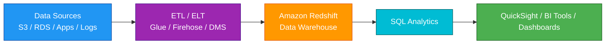
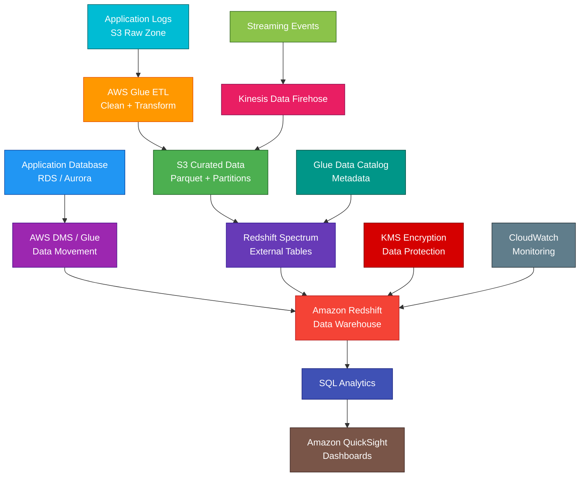

# Amazon Redshift

<details>
<summary>

## 1. Definition

</summary>

### Simple Definition

Amazon Redshift is AWS’s managed data warehouse service.

It is designed for running fast SQL analytics on large amounts of structured and semi-structured data.

### Memory Hook

Redshift = Relational analytics warehouse.

### Basic Idea

Applications and data pipelines load large datasets into Redshift.

Analysts and BI tools query the data using SQL.



### Key Point

Redshift is for OLAP analytics, not normal transactional application workloads.

Use it when you need to analyze large datasets, not when your app needs many small real-time transactions.

</details>

<details>
<summary>

## 2. What Problem Does It Solve?

</summary>

### Main Problem

Redshift solves the problem of analyzing large amounts of business data quickly using SQL.

Traditional databases can become slow and expensive when used for large reporting and analytics workloads.

### Without Redshift

You may have problems such as:

- Slow reports on production databases
- Heavy analytics queries hurting application performance
- Difficulty analyzing terabytes or petabytes of data
- Complex self-managed data warehouse infrastructure
- Expensive scaling for analytics workloads
- Hard-to-manage query performance

### With Redshift

You load data into a managed analytics warehouse and run SQL queries at scale.

### Key Benefit

Redshift separates analytics workloads from production application databases and improves reporting performance.

</details>

<details>
<summary>

## 3. Core Use Cases

</summary>

### Business Intelligence

Use Redshift for dashboards and reporting.

Examples:

- Sales dashboards
- Finance reports
- Customer analytics
- Marketing performance
- Executive dashboards

### Data Warehousing

Use Redshift as a central data warehouse for cleaned and structured business data.

Example:

Combine sales, customer, product, and marketing data into one analytics platform.

### OLAP Analytics

Redshift is designed for Online Analytical Processing, or OLAP.

OLAP workloads usually involve:

- Large scans
- Aggregations
- Joins
- Historical analysis
- Reporting queries

### Log and Event Analytics

Use Redshift to analyze large volumes of logs or event data.

Examples:

- Clickstream analytics
- Application events
- Security events
- User activity history

### Data Lake Analytics with Redshift Spectrum

Use Redshift Spectrum to query data directly in S3 without loading all data into Redshift tables.

Example:

Query archived logs stored in S3 from Redshift SQL.

### ETL and ELT Pipelines

Use Redshift as the destination for transformed data.

Common pipeline:

S3 → Glue → Redshift → QuickSight

### Near Real-Time Analytics

Use streaming ingestion or Firehose delivery patterns to load fresh data into Redshift for near real-time analytics.

</details>

<details>
<summary>

## 4. Important Features for SAA

</summary>

### Data Warehouse

A data warehouse stores data optimized for analytics and reporting.

It is different from an application database.

| Workload Type | Best Service |
|---|---|
| Application transactions | RDS or Aurora |
| Large-scale analytics | Redshift |
| NoSQL key-value access | DynamoDB |
| SQL queries directly on S3 | Athena |

### OLAP vs OLTP

| Type | Meaning | Best For |
|---|---|---|
| OLTP | Online Transaction Processing | Many small application transactions |
| OLAP | Online Analytical Processing | Large analytical queries |

### Redshift Is OLAP

Redshift is optimized for OLAP workloads.

Examples:

- Scan millions or billions of rows
- Aggregate historical sales
- Join large tables
- Generate reports

### Cluster

A Redshift provisioned cluster contains one or more nodes.

The cluster stores data and runs SQL queries.

### Node

A node is a compute resource in a Redshift cluster.

Nodes provide CPU, memory, and storage resources for query processing.

### Leader Node

The leader node manages communication with clients and coordinates query execution.

It:

- Receives SQL queries
- Creates query plans
- Coordinates compute nodes
- Returns results to clients

### Compute Nodes

Compute nodes execute query work in parallel.

They store data and process query operations.

### Massively Parallel Processing

Redshift uses Massively Parallel Processing, or MPP.

MPP means Redshift splits query work across multiple compute nodes to process large datasets faster.

### Columnar Storage

Redshift stores data in columns instead of rows.

This is useful for analytics because queries often read only a few columns from very large tables.

### Compression

Redshift compresses columnar data to reduce storage and improve query performance.

### Provisioned Redshift

Provisioned Redshift uses clusters that you configure and run.

You choose:

- Node type
- Number of nodes
- Networking
- Maintenance window
- Backup settings
- Scaling options

### Redshift Serverless

Redshift Serverless lets you run analytics without managing clusters.

AWS automatically manages capacity.

Use it when:

- Workload is unpredictable
- You want less infrastructure management
- You want to pay based on usage
- Teams need easy analytics access

### RA3 Nodes

RA3 nodes separate compute from managed storage.

Important points:

- Good for large data warehouses
- Scale compute and storage more independently
- Use Redshift Managed Storage
- Recommended for many modern provisioned workloads

### Redshift Managed Storage

Redshift Managed Storage automatically stores data using scalable storage managed by AWS.

This is commonly associated with RA3 nodes.

### Dense Compute and Dense Storage

Older Redshift node families include dense compute and dense storage options.

For SAA, focus more on the general concept:

Choose node types based on performance, storage, and cost needs.

### Distribution Style

Distribution style controls how table data is distributed across compute nodes.

Common types:

| Distribution Style | Best For |
|---|---|
| AUTO | Let Redshift choose |
| EVEN | Spread rows evenly |
| KEY | Distribute based on a column |
| ALL | Copy small table to all nodes |

### Distribution Key

A distribution key is a column used to place related rows on the same node.

Good distribution keys can reduce data movement during joins.

### Sort Key

A sort key defines how data is physically sorted.

Good sort keys can improve query performance by skipping unnecessary data blocks.

### Automatic Table Optimization

Redshift can automatically optimize table design choices such as sort keys and distribution styles.

For SAA, remember:

Redshift has automation features that reduce manual tuning.

### Workload Management

Workload Management, or WLM, controls how queries use cluster resources.

Use WLM to manage:

- Query queues
- Memory allocation
- Concurrency
- Priorities

### Concurrency Scaling

Concurrency Scaling adds temporary query processing capacity when many users or queries run at the same time.

Use it to handle spikes in concurrent analytics queries.

### Spectrum

Redshift Spectrum lets Redshift query data directly in S3.

Important points:

- Data stays in S3
- Uses external tables
- Often uses Glue Data Catalog metadata
- Useful for data lake queries
- Avoids loading all data into Redshift

### Federated Query

Federated Query lets Redshift query live data in supported external databases.

Examples:

- Amazon RDS
- Amazon Aurora

Use it when Redshift needs to combine warehouse data with operational database data.

### COPY Command

The `COPY` command loads data into Redshift efficiently.

Common source:

- Amazon S3

Example pattern:

```sql
COPY sales
FROM 's3://my-bucket/sales/'
IAM_ROLE 'arn:aws:iam::123456789012:role/RedshiftLoadRole'
FORMAT AS PARQUET;
```

### UNLOAD Command

The `UNLOAD` command exports query results from Redshift to S3.

Use it to:

- Export reports
- Share analytics results
- Store query outputs in a data lake

### Materialized Views

Materialized views store precomputed query results.

Use them to speed up repeated expensive queries.

### Result Caching

Redshift can cache query results.

Repeated identical queries can return faster when cached results are valid.

### AQUA

AQUA, or Advanced Query Accelerator, can improve query performance for supported Redshift workloads.

For SAA, remember it as a Redshift performance acceleration feature.

### Data Sharing

Redshift data sharing lets you share live data across Redshift clusters, workgroups, accounts, or teams without copying data.

Use it when multiple analytics groups need access to the same data.

### Snapshot

A snapshot is a point-in-time backup of a Redshift cluster.

Snapshots can be:

- Automated
- Manual
- Copied to another Region

### Maintenance Window

The maintenance window defines when AWS can apply maintenance updates.

Choose a low-traffic time.

### Query Editor

Redshift Query Editor lets users run SQL queries from the AWS console.

For SAA, focus more on Redshift architecture and analytics use cases.

</details>

<details>
<summary>

## 5. Security Model

</summary>

### IAM Permissions

IAM controls who can manage Redshift resources and access AWS services used with Redshift.

Common permissions:

| Permission | Purpose |
|---|---|
| `redshift:CreateCluster` | Create Redshift cluster |
| `redshift:ModifyCluster` | Modify cluster settings |
| `redshift:DeleteCluster` | Delete cluster |
| `redshift:DescribeClusters` | View cluster details |
| `redshift:GetClusterCredentials` | Get temporary database credentials |
| `redshift-serverless:*` | Manage Redshift Serverless resources |

### Database Permissions

Redshift also has database-level users, roles, schemas, and permissions.

IAM controls AWS-level access.

Database permissions control what users can do inside Redshift.

Examples:

- Select from tables
- Insert data
- Create schemas
- Run queries
- Create views

### IAM Roles for Redshift

Redshift commonly uses IAM roles to access other AWS services.

Example:

A Redshift cluster uses an IAM role to read data from S3 using the `COPY` command.

### Encryption at Rest

Redshift supports encryption at rest.

Common options:

- AWS KMS keys
- Hardware security module integrations in some designs
- Encryption for snapshots

### Encryption in Transit

Use SSL/TLS to encrypt connections between clients and Redshift.

This protects query traffic and credentials moving over the network.

### VPC Placement

Redshift runs inside a VPC.

Use subnet groups and security groups to control network access.

### Security Groups

Security groups control which clients can connect to Redshift.

Best practice:

Allow access only from trusted sources, such as:

- BI tool security group
- Application security group
- Corporate network through VPN or Direct Connect
- Bastion or private analytics environment

### Public Accessibility

Redshift clusters can be public or private.

Best practice:

Production clusters should usually be private unless public access is specifically required and secured.

### Enhanced VPC Routing

Enhanced VPC Routing forces Redshift COPY and UNLOAD traffic between Redshift and S3 through your VPC.

Use it when you need more control over network routing, monitoring, and security.

### VPC Endpoints

Use VPC endpoints for private access to AWS services such as S3 where appropriate.

This can help keep data transfer off the public internet.

### Secrets Management

Do not hardcode Redshift credentials.

Use:

- AWS Secrets Manager
- IAM-based temporary credentials
- Federated access
- Identity provider integration where supported

### Audit Logging

Redshift supports logging for security and auditing.

Logs can include:

- Connection logs
- User logs
- User activity logs

Store logs securely, often in S3.

### Fine-Grained Access Control

Redshift supports database-level access controls.

Use:

- Schemas
- Roles
- Grants
- Views
- Row-level security where appropriate
- Column-level controls where appropriate

### Data Sharing Security

When using data sharing, control which consumers can access shared data.

Use least privilege for shared datasets.

### Shared Responsibility

AWS is responsible for:

- Redshift managed infrastructure
- Managed service availability
- Hardware maintenance
- Physical security
- Managed storage infrastructure
- Service patching options

You are responsible for:

- IAM permissions
- Database users and roles
- Security groups
- VPC design
- Encryption settings
- KMS key policies
- Audit logging
- Query access controls
- Data classification
- Backup and snapshot settings

</details>

<details>
<summary>

## 6. High Availability / Durability Behavior

</summary>

### Availability

Redshift is a managed service, but high availability depends on the chosen deployment model and configuration.

### Provisioned Cluster Availability

For provisioned clusters, Redshift manages node replacement and cluster operations.

If a node fails, Redshift can automatically replace it.

### Multi-AZ Deployments

Redshift supports Multi-AZ deployment options for higher availability in supported configurations.

Use Multi-AZ when analytics availability requirements are stronger.

### Redshift Serverless Availability

Redshift Serverless is managed by AWS and reduces infrastructure management.

AWS manages capacity and availability for the serverless workgroup.

### Snapshots

Snapshots protect data by creating backups of Redshift clusters.

Use snapshots for:

- Recovery
- Migration
- Disaster recovery
- Long-term backup

### Automated Snapshots

Redshift can automatically take snapshots based on retention settings.

### Manual Snapshots

Manual snapshots are created by users and kept until deleted.

Use manual snapshots before major changes.

### Cross-Region Snapshot Copy

Redshift snapshots can be copied to another Region.

Use this for disaster recovery.

### Redshift Managed Storage Durability

RA3 nodes use managed storage that separates compute from storage.

This improves storage scalability and resilience.

### Multi-Region Behavior

Redshift is regional.

For Multi-Region disaster recovery, use:

- Cross-Region snapshot copy
- Data replication pipelines
- S3 data lake replication
- Separate Redshift clusters or serverless workgroups in another Region

### Durability of Source Data

Many Redshift pipelines keep source data in S3.

This is useful because S3 can act as a durable source or replay layer.

### Important Exam Point

Redshift is for analytics, and disaster recovery usually involves snapshots, S3 source data, and cross-Region copy or replication.

</details>

<details>
<summary>

## 7. Cost Optimization Options

</summary>

### Choose the Right Deployment Model

| Workload Pattern | Better Option |
|---|---|
| Predictable steady analytics | Provisioned Redshift |
| Unpredictable or intermittent analytics | Redshift Serverless |
| Very large warehouse with separated storage/compute needs | RA3 nodes |

### Use RA3 for Large Storage Needs

RA3 nodes help separate compute from storage.

This can reduce overprovisioning when storage needs are large but compute needs vary.

### Use Redshift Serverless for Variable Workloads

Serverless can be cost-effective when analytics usage is intermittent or unpredictable.

You avoid running an always-on cluster when not needed.

### Pause and Resume Clusters

For provisioned clusters used in dev or test, pause clusters when not needed.

This can reduce compute cost.

### Use Reserved Nodes

For steady production workloads, Reserved Nodes can reduce cost.

Use them when usage is predictable.

### Use Spectrum for Infrequently Queried Data

Keep cold or rarely queried data in S3 and query it with Redshift Spectrum.

This avoids loading all data into Redshift storage.

### Compress Data

Columnar compression reduces storage and improves query performance.

### Use Columnar File Formats in S3

For Spectrum and data lake queries, use efficient formats such as:

- Parquet
- ORC

These reduce data scanned and improve performance.

### Partition S3 Data

For Spectrum queries, partition S3 data by common filters.

Examples:

- Date
- Region
- Customer
- Event type

Partitioning can reduce scanned data and lower cost.

### Optimize Queries

Bad queries can waste compute.

Improve cost by:

- Filtering early
- Avoiding unnecessary SELECT *
- Using sort keys wisely
- Using materialized views
- Avoiding unnecessary joins
- Reviewing query plans

### Use Concurrency Scaling Wisely

Concurrency Scaling helps with query spikes but may add cost if used heavily.

Monitor usage.

### Delete Old Snapshots

Manual snapshots stay until deleted and can add storage cost.

Use retention policies and clean up old snapshots.

### Monitor with CloudWatch

Monitor:

- CPU utilization
- Query duration
- Disk usage
- Concurrency
- WLM queues
- Spectrum scan usage
- Serverless usage
- Snapshot storage

</details>

<details>
<summary>

## 8. Common Exam Traps

</summary>

### Redshift vs RDS

This is one of the biggest exam traps.

| Requirement | Choose |
|---|---|
| Application transactions | RDS or Aurora |
| Large analytics and reporting | Redshift |

### Redshift Is Not OLTP

Do not choose Redshift for high-volume transactional application workloads.

Use RDS, Aurora, or DynamoDB depending on the data model.

### Redshift Is OLAP

Choose Redshift when the question mentions:

- Data warehouse
- Analytics
- Reporting
- BI dashboards
- Historical analysis
- Large aggregations

### Redshift vs Athena

Redshift is a managed data warehouse.

Athena queries data directly in S3 without loading it into a warehouse.

| Requirement | Choose |
|---|---|
| Powerful managed warehouse with optimized performance | Redshift |
| Serverless ad hoc SQL directly on S3 | Athena |

### Redshift Spectrum Does Not Load Data

Spectrum queries data directly in S3 using external tables.

It does not require loading all data into Redshift.

### COPY Is for Loading Data

Use `COPY` to efficiently load data into Redshift from S3.

Do not use many single-row inserts for large loads.

### UNLOAD Is for Exporting Data

Use `UNLOAD` to export query results from Redshift to S3.

### Redshift Is Regional

Redshift clusters and serverless workgroups are regional.

For Multi-Region DR, use snapshots, replication, or separate deployments.

### Distribution and Sort Keys Affect Performance

Poor table design can cause slow queries.

Good distribution and sort choices can improve analytics performance.

### Concurrency Scaling Is for Query Spikes

Concurrency Scaling helps when many queries run at once.

It does not replace good table design or query optimization.

### Redshift Serverless Is Still Redshift

Serverless removes cluster management, but it is still used for analytics and data warehousing.

### Redshift Is Not a Data Lake by Itself

S3 is commonly the data lake storage layer.

Redshift can query, load, and analyze data from the data lake.

### Public Cluster Is Usually Not Best Practice

Production Redshift should usually be private and accessed through secure network paths.

</details>

<details>
<summary>

## 9. Compare With Similar Services

</summary>

### Service Comparison Table

| Service | Main Purpose | Best For | Choose When |
|---|---|---|---|
| Amazon Redshift | Managed data warehouse | Large-scale SQL analytics and BI | You need fast analytics on structured data |
| Amazon Athena | Serverless SQL on S3 | Ad hoc querying of S3 data | You want SQL directly on S3 without a warehouse |
| Amazon RDS | Managed relational database | OLTP applications | You need transactions, joins, and app database |
| Amazon Aurora | High-performance managed relational DB | Cloud-native OLTP SQL apps | You need scalable relational app database |
| AWS Glue | ETL and Data Catalog | Preparing and cataloging data | You need to transform or catalog data |
| Amazon EMR | Big data processing | Spark/Hadoop workloads | You need custom big data cluster processing |
| QuickSight | BI visualization | Dashboards and reports | You need visual analytics and BI dashboards |

### Redshift vs RDS

| Feature | Redshift | RDS |
|---|---|---|
| Workload | OLAP | OLTP |
| Best for | Analytics and reporting | Application transactions |
| Query type | Large scans and aggregations | Many small reads/writes |
| Storage style | Columnar | Row-based for most engines |
| Example | Sales dashboard | Order processing app |

### Redshift vs Athena

| Feature | Redshift | Athena |
|---|---|---|
| Main purpose | Data warehouse | Serverless SQL query service |
| Data location | Redshift tables and external S3 tables | S3 |
| Performance | Optimized warehouse | Depends on S3 data layout |
| Management | Cluster or serverless workgroup | Serverless |
| Best for | Repeated BI and warehouse workloads | Ad hoc S3 queries |

### Redshift vs Glue

| Feature | Redshift | AWS Glue |
|---|---|---|
| Main purpose | Analyze data | Prepare and catalog data |
| Runs SQL queries | Yes | ETL jobs, not main BI query engine |
| Data Catalog | Can use Glue Catalog for Spectrum | Main metadata catalog |
| Best for | Data warehouse queries | ETL and metadata discovery |

### Redshift vs EMR

| Feature | Redshift | EMR |
|---|---|---|
| Main purpose | SQL data warehouse | Big data processing platform |
| Management | Managed warehouse | Managed cluster platform |
| Best for | BI and SQL analytics | Spark, Hadoop, Hive, custom big data jobs |
| Complexity | Lower for SQL warehouse | Higher but more flexible |

### Redshift vs QuickSight

| Feature | Redshift | QuickSight |
|---|---|---|
| Main purpose | Data warehouse | BI visualization |
| Stores/query data | Yes | Visualizes data from sources |
| Best for | Analytics backend | Dashboards and reports |
| Common use together | Redshift stores analytics data | QuickSight visualizes Redshift data |

### When to Choose Redshift

Choose Redshift when:

- You need a managed data warehouse
- You need fast SQL analytics at scale
- You need BI reporting over large datasets
- You need OLAP queries
- You need to combine data from many sources
- You need Redshift Spectrum to query S3 data
- You need columnar storage and MPP query processing
- You want to separate analytics from production OLTP databases

</details>

<details>
<summary>

## 10. Mini Architecture Example

</summary>

### Scenario

A company wants to analyze sales, customer, and website activity data.

Data comes from application databases, logs in S3, and streaming events.

The company wants dashboards for business users.

### Architecture

Use AWS Glue to transform raw data in S3.

Load curated data into Amazon Redshift.

Use Redshift Spectrum for older data that remains in S3.

Use QuickSight for dashboards.

Use Kinesis Data Firehose for streaming event delivery.



### Why This Is Good

- Redshift provides fast SQL analytics
- Glue prepares and transforms raw data
- S3 stores durable raw and curated data
- Firehose delivers streaming events to S3
- Redshift Spectrum queries S3 data without loading everything
- Glue Data Catalog provides metadata for external tables
- QuickSight creates dashboards for business users
- KMS protects data at rest
- CloudWatch monitors performance and health
- Analytics workloads are separated from production databases

### Exam Answer Pattern

If the question says:

“Run large-scale SQL analytics and BI reports on structured data.”

Think:

Amazon Redshift.

If the question says:

“Run SQL directly on data stored in S3 without managing a warehouse.”

Think:

Amazon Athena.

If the question says:

“Prepare, transform, and catalog data for analytics.”

Think:

AWS Glue.

If the question says:

“Run transactional application database workloads.”

Think:

RDS or Aurora.

### Final Memory Hook

Redshift = Data warehouse.

OLAP = Analytics.

OLTP = Transactions.

MPP = Parallel query processing.

Columnar storage = Fast analytics.

RA3 = Separate compute and managed storage.

Serverless = Analytics without cluster management.

Spectrum = Query S3 from Redshift.

COPY = Load data into Redshift.

UNLOAD = Export data to S3.

Glue = ETL and catalog.

Athena = SQL directly on S3.

QuickSight = Dashboards.

RDS/Aurora = Application database.

</details>