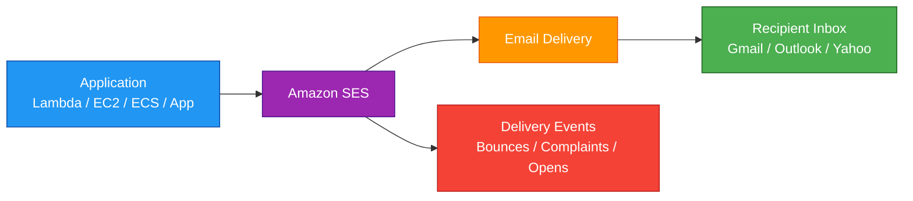
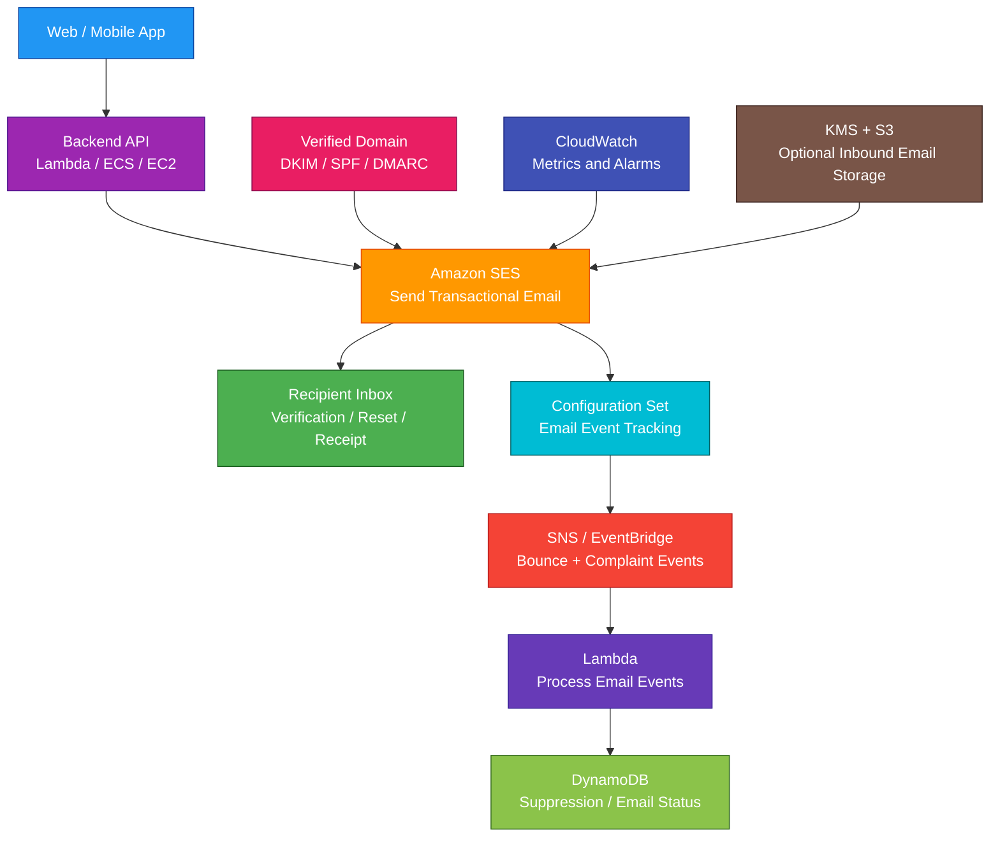

# Amazon SES

## 1. Definition

### Simple Definition

Amazon SES, or Amazon Simple Email Service, is AWS’s managed email sending and receiving service.

It helps applications send emails such as account verification, password reset, order confirmations, alerts, and marketing messages.

### Memory Hook

SES = Send Email Service.

### Basic Idea

Your application sends an email request to SES.

SES delivers the email to the recipient’s email provider.

### Key Point

SES is for sending and receiving email.

It is not a queue, notification fanout service, chat service, or marketing campaign platform by itself.

## 2. What Problem Does It Solve?

### Main Problem

SES solves the problem of sending reliable, scalable email from applications without running your own email servers.

### Without SES

You may need to manage:

- SMTP servers
- Email sending infrastructure
- IP reputation
- Bounce handling
- Complaint handling
- Domain authentication
- DKIM/SPF/DMARC setup
- Scaling email sending
- Deliverability monitoring
- Inbound email processing

### With SES

AWS provides managed email infrastructure.

You configure:

- Verified identities
- Sending permissions
- Domain authentication
- Sending limits
- Event tracking
- Bounce and complaint handling
- SMTP or API sending
- Optional inbound email rules

### Key Benefit

SES makes it easier and cheaper to send application emails at scale.

## 3. Core Use Cases

### Transactional Emails

Use SES for application-triggered emails.

Examples:

- Password reset
- Account verification
- Order confirmation
- Shipping update
- Payment receipt
- Security alert

### Notification Emails

Use SES to send email alerts from applications.

Examples:

- System alert
- Billing alert
- Workflow approval request
- Support ticket update

### Marketing Emails

Use SES for bulk or marketing email if you manage consent, unsubscribe behavior, and deliverability correctly.

Examples:

- Product updates
- Newsletters
- Promotional campaigns
- Customer engagement emails

### Email Receiving

SES can receive inbound emails for your domain and process them.

Examples:

- Store incoming email in S3
- Trigger Lambda from inbound email
- Route support emails
- Process email attachments

### Application Email Backend

Use SES as the email provider for web and mobile applications.

Example:

A SaaS app uses SES to send customer onboarding emails.

### Serverless Email Processing

Use SES with S3, Lambda, and SNS to process incoming or outgoing email events.

Example:

Inbound email → SES receipt rule → S3 → Lambda processing.

### Bounce and Complaint Tracking

Use SES events to track delivery problems.

Examples:

- Bounce
- Complaint
- Delivery
- Reject
- Open
- Click

## 4. Important Features for SAA

### Verified Identity

Before sending email, you must verify an identity.

An identity can be:

- Email address
- Domain

### Email Address Verification

Email address verification proves you own a specific email address.

Example:

Verify `admin@example.com`.

Good for testing or small use cases.

### Domain Verification

Domain verification proves you own a whole domain.

Example:

Verify `example.com`.

This allows sending from addresses such as:

- `support@example.com`
- `no-reply@example.com`
- `billing@example.com`

### DNS Records

Domain verification usually requires DNS records.

Common email DNS records:

| Record | Purpose |
|---|---|
| DKIM | Proves email was authorized by your domain |
| SPF | Identifies allowed sending servers |
| DMARC | Defines policy for failed authentication |
| MX | Routes inbound email for a domain |

### DKIM

DKIM means DomainKeys Identified Mail.

It helps receiving email providers verify that SES is allowed to send email for your domain.

### SPF

SPF means Sender Policy Framework.

It helps define which mail servers are allowed to send email for your domain.

### DMARC

DMARC helps receiving email providers decide what to do when SPF or DKIM checks fail.

DMARC can improve domain protection and deliverability.

### Sandbox Mode

New SES accounts usually start in the SES sandbox.

In sandbox mode:

- You can send only to verified email addresses or domains
- Sending volume is limited
- Production sending is restricted

### Production Access

To send to unverified recipients, request production access.

For real applications, production access is usually required.

### Sending Limits

SES has sending limits.

Common limits include:

- Maximum emails per 24 hours
- Maximum send rate per second

Important exam point:

High-scale sending may require a quota increase.

### Sending Methods

SES supports multiple ways to send email.

| Method | Best For |
|---|---|
| SES API | Application integration |
| SMTP interface | Existing SMTP-compatible apps |
| AWS SDK | Programmatic sending |
| Console | Testing and manual operations |

### SMTP Interface

SES provides SMTP endpoints.

Use this when an existing application already supports SMTP sending.

### SES API

Use the SES API for modern application integration.

Examples:

- Lambda sends email through SDK
- Backend service sends transactional email
- Application sends templated email

### Templates

SES supports email templates.

Use templates for reusable email structure.

Examples:

- Welcome email
- Password reset email
- Order confirmation email

### Configuration Set

A configuration set is a group of rules applied to sent emails.

Use it for:

- Tracking email events
- Publishing metrics
- Custom headers
- Deliverability tracking
- Event destinations

### Event Publishing

SES can publish email events to other AWS services.

Common event types:

- Send
- Reject
- Bounce
- Complaint
- Delivery
- Open
- Click
- Rendering failure

Common event destinations:

- Amazon CloudWatch
- Amazon SNS
- Amazon Kinesis Data Firehose
- Amazon EventBridge

### Bounce

A bounce means the email could not be delivered.

Examples:

- Invalid email address
- Mailbox does not exist
- Recipient mail server rejected the email

### Complaint

A complaint means the recipient marked the email as spam or unwanted.

High complaint rates can hurt sender reputation.

### Suppression List

A suppression list prevents sending to email addresses that should not receive email.

Use it to avoid repeatedly sending to bounced or complaining addresses.

### Account-Level Suppression List

SES can maintain an account-level suppression list.

This helps protect sender reputation.

### Dedicated IP Address

Dedicated IPs are IP addresses used only by your SES account.

Use dedicated IPs when you need more control over sender reputation.

### Shared IP Address

By default, SES can use shared IP pools.

Shared IPs are simpler and usually good for many workloads.

### Dedicated IP Pools

Dedicated IP pools let you group dedicated IP addresses for specific sending workloads.

Example:

Use one pool for transactional email and another for marketing email.

### Deliverability

Deliverability means the ability for your email to reach inboxes instead of spam folders.

Improve deliverability with:

- Verified domain
- DKIM
- SPF
- DMARC
- Low bounce rate
- Low complaint rate
- Clean mailing lists
- Good email content
- Proper unsubscribe handling

### Virtual Deliverability Manager

Virtual Deliverability Manager helps monitor and improve email deliverability.

Use it to inspect sending health and deliverability signals.

### Reputation Dashboard

SES provides reputation-related information.

Monitor:

- Bounce rate
- Complaint rate
- Delivery issues
- Sending health

### Inbound Email

SES can receive emails for verified domains.

You configure receipt rules to decide what happens to incoming emails.

### Receipt Rule

A receipt rule defines how SES handles inbound email.

Actions can include:

- Store email in S3
- Invoke Lambda
- Publish to SNS
- Stop rule processing
- Add headers
- Bounce the message

### Receipt Rule Set

A receipt rule set is a collection of receipt rules.

Only one receipt rule set is active at a time.

### Mail Manager

SES Mail Manager provides advanced email routing and management features.

For SAA, focus mainly on the core SES idea:

Send and receive email with managed AWS infrastructure.

## 5. Security Model

### IAM Permissions

IAM controls who can manage SES and who can send email through SES.

Common permissions:

| Permission | Purpose |
|---|---|
| `ses:SendEmail` | Send formatted email |
| `ses:SendRawEmail` | Send raw MIME email |
| `ses:CreateEmailIdentity` | Create verified identity |
| `ses:GetIdentityVerificationAttributes` | Check verification status |
| `ses:CreateConfigurationSet` | Create configuration set |
| `ses:PutAccountSendingAttributes` | Manage account sending settings |

### Least Privilege

Give applications only the SES permissions they need.

Example:

A password reset Lambda may need `ses:SendEmail` but should not need permission to delete identities.

### Sending Authorization

Sending authorization allows one AWS account or IAM principal to send email using an identity owned by another account.

Use it for cross-account email sending.

### Identity Policies

SES identity policies control who can send email from a verified identity.

Example:

Allow a production application account to send email from `example.com`.

### Domain Authentication

Use domain authentication to prove ownership and improve trust.

Important controls:

- DKIM
- SPF
- DMARC

### Encryption in Transit

SES APIs use HTTPS.

SMTP connections should use TLS.

This protects email submission traffic to SES.

### Encryption at Rest

If SES stores inbound email in S3, configure S3 encryption.

Common options:

- SSE-S3
- SSE-KMS

### KMS Permissions

If using KMS-encrypted S3 buckets for inbound email, make sure SES and required users have KMS permissions.

Incorrect KMS permissions can break email storage or processing.

### Secrets Management

Do not hardcode SMTP credentials in application code.

Use:

- AWS Secrets Manager
- Systems Manager Parameter Store
- IAM roles when using SDK/API
- KMS-encrypted configuration

### SMTP Credentials

SMTP credentials are different from normal AWS access keys.

Use them only for SMTP-based applications.

Protect them carefully.

### Network Security

Applications can call SES endpoints over HTTPS or SMTP.

For workloads inside a VPC, use secure routing and restrict outbound traffic where needed.

### Inbound Email Security

Inbound email can contain risky content.

If processing inbound email, consider:

- Malware scanning
- Attachment validation
- Content filtering
- Size limits
- Sender validation
- Safe parsing

### CloudTrail Auditing

CloudTrail can record SES API activity.

Use it to audit:

- Identity creation
- Configuration changes
- Sending policy changes
- Suppression list changes
- Account-level SES changes

### CloudWatch Monitoring

Use CloudWatch to monitor SES metrics.

Examples:

- Sends
- Deliveries
- Bounces
- Complaints
- Rejects
- Rendering failures

### Shared Responsibility

AWS is responsible for:

- SES managed email infrastructure
- SES service availability
- Email delivery platform
- Physical security
- Managed service operations

You are responsible for:

- IAM permissions
- Verified identities
- Domain DNS records
- Email content
- Recipient consent
- Bounce handling
- Complaint handling
- Suppression lists
- KMS key policies
- Inbound email processing security
- Compliance with email laws and policies

## 6. High Availability / Durability Behavior

### Availability

SES is a managed AWS service.

AWS manages the email sending infrastructure.

### Regional Service

SES is regional.

You configure verified identities, sending, and receiving features in specific AWS Regions.

### Multi-AZ Behavior

SES is managed by AWS across service infrastructure.

You do not configure Multi-AZ manually.

### Sending Availability

Applications can use SES regional endpoints to send email.

For higher resilience, design applications to handle:

- SES API errors
- Throttling
- Temporary delivery failures
- Retry behavior
- Regional failover if required

### Delivery Is Not Guaranteed

SES accepts and attempts to deliver emails, but final inbox delivery depends on recipient mail systems.

An email may be:

- Delivered
- Bounced
- Rejected
- Marked as spam
- Delayed by recipient provider

### Bounce Handling

Handle bounces to protect sender reputation.

If an address repeatedly bounces, stop sending to it.

### Complaint Handling

Handle complaints carefully.

If users mark email as spam, remove them from marketing lists or suppress future sends.

### Inbound Email Durability

If receiving email, store messages in durable storage such as S3.

SES itself should not be treated as long-term email storage.

### Event Durability

For important email events, publish SES events to durable or reliable downstream services.

Examples:

- SNS for notifications
- Firehose to S3 for analytics
- EventBridge for event routing
- CloudWatch for metrics

### Multi-Region Behavior

SES identities and sending settings are regional.

For Multi-Region sending, configure SES in multiple Regions.

Plan:

- Domain verification in each Region
- DKIM records
- Sending quotas
- Configuration sets
- Application failover logic

### Important Exam Point

SES is managed and scalable, but email deliverability depends on domain setup, sender reputation, and recipient mail providers.

## 7. Cost Optimization Options

### Pay for What You Send

SES pricing is generally based on email sending and related features.

Common cost factors:

- Number of emails sent
- Data transfer
- Attachments
- Dedicated IPs
- Deliverability features
- Inbound email processing
- Downstream services such as S3, Lambda, SNS, or Firehose

### Use SES for Cost-Effective Email

SES is often cheaper than operating your own email servers or using some third-party email providers at scale.

### Avoid Sending Bad Email

Bad email increases cost and hurts reputation.

Avoid sending to:

- Invalid addresses
- Old lists
- Purchased lists
- Users who unsubscribed
- Addresses with repeated bounces
- Users who complained

### Use Suppression Lists

Suppression lists reduce wasted sends and protect reputation.

Do not keep sending to addresses that bounce or complain.

### Separate Email Workloads

Separate transactional and marketing emails.

Options:

- Different configuration sets
- Different identities
- Dedicated IP pools
- Different sending domains or subdomains

This helps protect important transactional emails from marketing reputation issues.

### Use Shared IPs When Appropriate

Shared IPs are simpler and avoid dedicated IP cost.

Use shared IPs when you do not need dedicated reputation control.

### Use Dedicated IPs Only When Needed

Dedicated IPs can add cost and require reputation management.

Use them when:

- You send high volume
- You need reputation isolation
- You need stronger deliverability control

### Monitor Bounce and Complaint Rates

High bounce or complaint rates hurt deliverability and may cause account issues.

Monitoring helps avoid wasted spend and sending restrictions.

### Optimize Attachments

Large attachments can increase data transfer cost and deliverability risk.

Better pattern:

Store files in S3 and send secure links when appropriate.

### Use Templates

Templates reduce duplicated email content management and simplify application logic.

### Manage Event Publishing Cost

Publishing all events to multiple destinations can increase downstream cost.

Send only needed events to each destination.

### Use S3 Lifecycle for Email Storage

If inbound email is stored in S3, use lifecycle policies to control storage cost.

Examples:

- Move old emails to cheaper storage classes
- Delete temporary emails after retention period
- Archive compliance emails

## 8. Common Exam Traps

### SES vs SNS

This is a common exam trap.

| Requirement | Choose |
|---|---|
| Send email messages to recipients | SES |
| Pub/sub notification fanout | SNS |

### SES vs SQS

SES sends and receives email.

SQS queues messages between applications.

Use SQS if you need buffering or decoupling before sending emails.

### SES vs Pinpoint

Amazon Pinpoint is for customer engagement campaigns across channels.

SES is focused on email sending and receiving.

| Requirement | Choose |
|---|---|
| Application email sending | SES |
| Multi-channel customer engagement campaigns | Pinpoint |

### SES vs WorkMail

Amazon WorkMail is managed business email and calendar for users.

SES is application email infrastructure.

| Requirement | Choose |
|---|---|
| App sends transactional email | SES |
| Employees need mailbox and calendar | WorkMail |

### SES vs Simple Notification Service Email Subscription

SNS can send basic email notifications to subscribed addresses.

SES is better for full application email sending with domain verification, templates, bounce handling, and deliverability controls.

### SES Sandbox

New SES accounts may be in sandbox.

If the question says emails can only be sent to verified recipients, think SES sandbox.

### Domain Verification Is Required

To send from a domain, verify the domain identity.

For production, domain verification is preferred over individual email verification.

### DKIM/SPF/DMARC Matter

If the question asks about improving deliverability and proving domain ownership, think DKIM, SPF, and DMARC.

### SES Does Not Guarantee Inbox Placement

SES can successfully send email, but the recipient provider may still place it in spam.

Deliverability depends on reputation and content.

### Bounces and Complaints Must Be Handled

Ignoring bounces and complaints can damage sender reputation.

### Dedicated IPs Are Not Always Better

Dedicated IPs give more control but require warm-up and reputation management.

Shared IPs are often simpler.

### SES Is Regional

SES identities, quotas, and configurations are regional.

Do not assume one SES setup automatically works in every Region.

### SMTP Credentials Are Different

SES SMTP credentials are not the same as normal IAM access keys.

Use the correct credentials for SMTP integrations.

### Inbound Email Needs MX Records

To receive email with SES, configure MX records to route mail to SES.

## 9. Compare With Similar Services

### Service Comparison Table

| Service | Main Purpose | Best For | Choose When |
|---|---|---|---|
| Amazon SES | Managed email sending and receiving | Transactional and application email | You need to send or receive email from apps |
| Amazon SNS | Pub/sub notifications | Fanout to many subscribers | One event should notify many targets |
| Amazon SQS | Message queue | Decoupling and buffering | You need reliable async queueing |
| Amazon Pinpoint | Customer engagement | Campaigns across email, SMS, push, and more | You need marketing/customer journeys |
| Amazon WorkMail | Business email and calendar | Employee mailbox service | Users need email inboxes and calendars |
| EventBridge | Event bus and routing | Event-driven application integration | You need event routing rules |
| AWS Lambda | Serverless compute | Email processing logic | You need custom logic after SES events |

### SES vs SNS

| Feature | Amazon SES | Amazon SNS |
|---|---|---|
| Main purpose | Send/receive email | Pub/sub fanout |
| Email control | High | Basic email notifications |
| Domain verification | Yes | Not same focus |
| Bounce/complaint handling | Yes | Not main feature |
| Best for | Application email | Event notifications |

### SES vs SQS

| Feature | Amazon SES | Amazon SQS |
|---|---|---|
| Main purpose | Email service | Message queue |
| Sends email | Yes | No |
| Buffers work | Not main purpose | Yes |
| Common use together | Sends emails | Queue email jobs before sending |

### SES vs Pinpoint

| Feature | Amazon SES | Amazon Pinpoint |
|---|---|---|
| Main purpose | Email infrastructure | Customer engagement platform |
| Channels | Email-focused | Email, SMS, push, voice, in-app, depending on setup |
| Best for | Transactional/app email | Campaigns and user journeys |
| Developer control | High email control | Campaign and segmentation tools |

### SES vs WorkMail

| Feature | Amazon SES | Amazon WorkMail |
|---|---|---|
| Main purpose | Application email sending/receiving | Managed user mailbox and calendar |
| Users get inboxes | No | Yes |
| Best for | Apps sending emails | Employees using email |
| Example | Password reset email | Company email account |

### SES vs EventBridge

| Feature | Amazon SES | EventBridge |
|---|---|---|
| Main purpose | Email sending/receiving | Event routing |
| Sends email | Yes | No |
| Routes events | Limited via event publishing | Yes |
| Common use together | Emits email events | Routes SES events to targets |

### When to Choose SES

Choose SES when:

- You need to send transactional emails
- You need password reset or verification emails
- You need order confirmations or receipts
- You need application-generated email
- You need inbound email processing
- You need bounce and complaint handling
- You need domain-authenticated email sending
- You need scalable low-cost email infrastructure
- You need SMTP or API-based email sending
- You need email event tracking

## 10. Mini Architecture Example

### Scenario

A SaaS application needs to send account verification emails, password reset emails, and billing receipts.

The company wants to track bounces and complaints and stop sending to bad email addresses.

### Architecture

Use Cognito or the application backend to request email sending.

Use SES to send transactional emails from a verified domain.

Use configuration sets to publish delivery events.

Use SNS or EventBridge to process bounces and complaints.

Use DynamoDB to store suppression or user email status.

### Why This Is Good

- SES sends transactional application emails
- Verified domain improves trust and deliverability
- DKIM, SPF, and DMARC help authenticate the domain
- Configuration sets track email events
- SNS or EventBridge routes bounce and complaint events
- Lambda processes delivery problems
- DynamoDB stores email status and suppression data
- CloudWatch monitors sending metrics
- The app avoids managing SMTP servers
- Bad addresses can be suppressed to protect sender reputation

### Exam Answer Pattern

If the question says:

“Send transactional emails such as password resets or order confirmations from an application.”

Think:

Amazon SES.

If the question says:

“Send one notification to many subscribers.”

Think:

Amazon SNS.

If the question says:

“Buffer email sending jobs before processing.”

Think:

Amazon SQS plus workers plus SES.

If the question says:

“Run customer engagement campaigns across multiple channels.”

Think:

Amazon Pinpoint.

### Final Memory Hook

SES = Simple Email Service.

Main job = Send and receive email.

Verified identity = Email address or domain.

Domain verification = Best for production sending.

DKIM = Proves authorized sending.

SPF = Allowed senders.

DMARC = Policy for failed auth.

Sandbox = Limited sending to verified recipients.

Production access = Send to real recipients.

Sending quota = Daily/send-rate limits.

SMTP = Existing email apps.

API = Modern app integration.

Configuration set = Track and route email events.

Bounce = Delivery failed.

Complaint = Marked as spam.

Suppression list = Do not send to bad addresses.

Dedicated IP = More reputation control.

Shared IP = Simpler default sending.

Receipt rule = Inbound email processing.

S3 = Store inbound email.

Lambda = Process email events or inbound messages.

SNS/EventBridge = Route SES events.

Pinpoint = Customer engagement campaigns.

WorkMail = User mailboxes and calendar.

