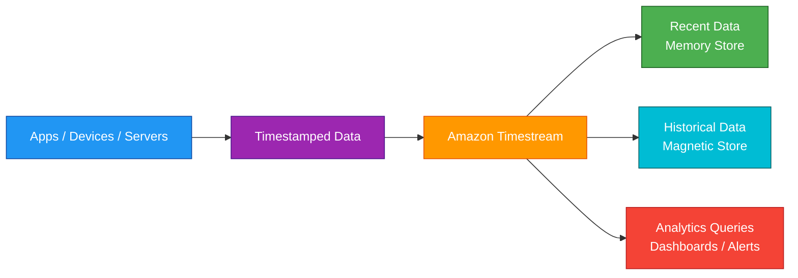
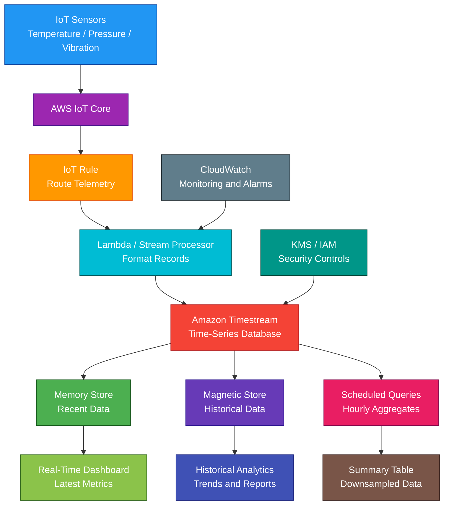

# Amazon Timestream

<details>
<summary>

## 1. Definition

</summary>

### Simple Definition

Amazon Timestream is AWS’s managed time-series database service.

It is designed to store and analyze data that changes over time, such as metrics, logs, sensor readings, and application events.

### Memory Hook

Timestream = Time-based data database.

### Basic Idea

Applications and devices continuously write timestamped records.

Timestream stores the data and lets you query it using SQL-like queries.



### Key Point

Timestream is purpose-built for time-series data.

It is not a general-purpose relational database, document database, or data warehouse.

</details>

<details>
<summary>

## 2. What Problem Does It Solve?

</summary>

### Main Problem

Timestream solves the problem of storing and querying huge amounts of timestamped data efficiently.

Time-series data grows very quickly, and traditional databases can become expensive or slow for this type of workload.

### Without Timestream

You may struggle with:

- Huge volumes of metrics
- Fast data ingestion
- Expensive historical storage
- Slow time-based queries
- Manual data lifecycle management
- Managing database servers
- Scaling write and query capacity
- Aggregating data over time windows

### With Timestream

AWS manages the time-series database infrastructure.

Timestream automatically separates recent and historical data using storage tiers.

### Key Benefit

Timestream makes it easier to collect, store, and analyze time-series data at scale.

</details>

<details>
<summary>

## 3. Core Use Cases

</summary>

### Application Monitoring

Use Timestream to store application metrics.

Examples:

- Request latency
- Error rate
- API calls
- Service health
- User activity events

### Infrastructure Monitoring

Use Timestream for server, container, and infrastructure metrics.

Examples:

- CPU usage
- Memory usage
- Disk I/O
- Network traffic
- Container metrics

### IoT Telemetry

Use Timestream for sensor and device data.

Examples:

- Temperature readings
- Pressure readings
- GPS coordinates
- Machine status
- Energy usage
- Vehicle telemetry

### DevOps Metrics

Use Timestream to analyze operational data over time.

Examples:

- Deployment frequency
- System uptime
- Alert counts
- Resource utilization
- Performance trends

### Industrial Monitoring

Use Timestream for industrial equipment and manufacturing data.

Examples:

- Factory machine metrics
- Predictive maintenance data
- Equipment vibration
- Production line measurements

### Real-Time Dashboards

Use Timestream with visualization tools to build dashboards.

Examples:

- System performance dashboard
- IoT fleet dashboard
- Business activity dashboard
- Operational health dashboard

### Historical Trend Analysis

Use Timestream to analyze patterns over time.

Examples:

- Average CPU over 7 days
- Device temperature trends
- Monthly usage growth
- Long-term performance history

</details>

<details>
<summary>

## 4. Important Features for SAA

</summary>

### Time-Series Data

Time-series data is data recorded with a timestamp.

Each record usually answers:

- What happened?
- When did it happen?
- Which device, server, app, or user did it happen for?
- What was the measured value?

### Example Time-Series Record

```json
{
  "time": "2026-05-04T10:15:00Z",
  "deviceId": "sensor-001",
  "region": "us-east-1",
  "measureName": "temperature",
  "measureValue": 72.5
}
```

### Database

A Timestream database is a logical container for tables.

Example:

`iot_monitoring`

### Table

A Timestream table stores time-series records.

Example tables:

- `server_metrics`
- `device_telemetry`
- `application_events`
- `business_metrics`

### Record

A record is one timestamped data point or group of measurements.

A record includes:

- Time
- Dimensions
- Measure name
- Measure value
- Version, where applicable

### Time

Time is the timestamp for the record.

This is the most important part of time-series data.

### Dimensions

Dimensions describe the source or context of the record.

Examples:

- Device ID
- Server ID
- Region
- Availability Zone
- Application name
- Instance type
- Customer ID

### Measure

A measure is the actual metric or value being recorded.

Examples:

- CPU utilization
- Temperature
- Latency
- Error count
- Battery level
- Request count

### Single-Measure Records

A single-measure record stores one metric value per record.

Example:

`temperature = 72.5`

### Multi-Measure Records

A multi-measure record can store multiple related measures in one record.

Example:

```json
{
  "cpu": 63,
  "memory": 78,
  "disk": 41
}
```

This can reduce storage and improve query efficiency for related metrics.

### Memory Store

The memory store holds recent data.

It is optimized for fast writes and fast queries on recent data.

Use it for:

- Real-time dashboards
- Recent monitoring data
- Fresh operational metrics

### Magnetic Store

The magnetic store holds older historical data.

It is optimized for lower-cost long-term storage.

Use it for:

- Historical analysis
- Trend reporting
- Long-term metrics retention
- Compliance or audit trends

### Automatic Data Tiering

Timestream automatically moves data from memory store to magnetic store based on retention settings.

This reduces manual lifecycle management.

### Retention Policy

Retention policies define how long data stays in each storage tier.

Example:

- Keep recent data in memory store for 24 hours
- Keep historical data in magnetic store for 1 year

### SQL-Like Query Language

Timestream supports SQL-like queries.

Common query patterns:

- Filter by time range
- Aggregate over time windows
- Group by dimensions
- Calculate averages, maximums, and minimums
- Find trends

### Time-Based Queries

Timestream is optimized for time-based queries.

Example:

```sql
SELECT avg(cpu_utilization)
FROM server_metrics
WHERE time > ago(1h)
GROUP BY bin(time, 5m)
```

### Built-In Time Functions

Timestream includes time-series functions.

Examples:

- Time filtering
- Interpolation
- Aggregation
- Binning by time interval
- Rate calculations

### Scheduled Queries

Scheduled queries run automatically on a schedule.

Use them to:

- Precompute aggregates
- Downsample raw data
- Create summary tables
- Improve dashboard performance
- Reduce repeated query cost

### Downsampling

Downsampling means reducing high-resolution data into lower-resolution summaries.

Example:

Convert 1-second raw metrics into 5-minute averages.

### Data Ingestion

Applications can write data to Timestream using AWS SDKs and APIs.

Common sources:

- IoT devices
- Applications
- Servers
- Containers
- Monitoring agents
- Stream processing applications

### Serverless Scaling

Timestream is serverless.

You do not provision database instances, storage disks, or database clusters for the main managed service.

### Timestream for LiveAnalytics

Timestream for LiveAnalytics is the AWS-managed time-series database option optimized for serverless time-series analytics.

For SAA, this is the main Timestream concept to understand.

### Timestream for InfluxDB

Timestream for InfluxDB provides managed InfluxDB-compatible time-series databases.

Use it when applications require InfluxDB APIs, tools, or compatibility.

### Common SAA Focus

For the AWS SAA exam, focus mainly on:

- Time-series use cases
- Serverless time-series database
- Memory store and magnetic store
- Retention policies
- IoT and monitoring workloads
- SQL-like time-based analytics

</details>

<details>
<summary>

## 5. Security Model

</summary>

### IAM Permissions

IAM controls who can create, manage, write to, and query Timestream resources.

Common permissions:

| Permission | Purpose |
|---|---|
| `timestream:CreateDatabase` | Create a database |
| `timestream:CreateTable` | Create a table |
| `timestream:WriteRecords` | Write records to a table |
| `timestream:Select` | Query data |
| `timestream:DescribeTable` | View table details |
| `timestream:UpdateTable` | Update table settings |
| `timestream:DeleteTable` | Delete a table |

### Least Privilege

Give applications only the permissions they need.

Example:

A metrics collector may need `WriteRecords` but should not need `DeleteTable`.

A dashboard user may need `Select` but should not need write access.

### Encryption at Rest

Timestream encrypts data at rest.

Use AWS KMS integration where customer-managed key control is required.

### Encryption in Transit

Timestream API calls use HTTPS.

This protects data moving between applications and Timestream.

### VPC Endpoints

Use VPC endpoints where supported to access Timestream privately from a VPC.

This helps avoid sending traffic over the public internet.

### KMS Key Permissions

If using customer managed KMS keys, make sure users and services have the required KMS permissions.

Wrong KMS permissions can block reads, writes, or administrative operations.

### Data Access Control

Use IAM policies to control:

- Who can write metrics
- Who can query data
- Which databases and tables can be accessed
- Which administrative actions are allowed

### Application Security

Do not hardcode AWS credentials in metric collectors or applications.

Use:

- IAM roles for EC2
- IAM roles for ECS tasks
- IAM roles for Lambda
- IAM Roles for Service Accounts on EKS
- Secure CI/CD credential handling

### Logging and Auditing

Use CloudTrail to audit Timestream API activity.

Use CloudWatch to monitor application and query behavior.

### Shared Responsibility

AWS is responsible for:

- Timestream managed infrastructure
- Managed scaling
- Service availability
- Data encryption infrastructure
- Physical security

You are responsible for:

- IAM permissions
- KMS key policies
- Data retention settings
- Table design
- Query access
- Application credentials
- Monitoring and alerting
- Protecting sensitive data in records

</details>

<details>
<summary>

## 6. High Availability / Durability Behavior

</summary>

### Availability

Timestream is a managed serverless service.

AWS manages the infrastructure for availability, scaling, and operations.

### Regional Service

Timestream resources are created in a specific AWS Region.

Applications should write and query data in the Region where the database exists.

### Multi-AZ Behavior

Timestream is managed by AWS across regional infrastructure.

You do not configure database instances or Multi-AZ replicas manually.

### Durability

Timestream stores data in managed storage.

Durability depends on AWS-managed storage and your configured retention policies.

### Retention-Based Data Lifecycle

Data is retained according to table retention settings.

If data expires based on retention policy, it is removed.

Important exam point:

Retention policies can delete old data automatically.

### Memory Store and Magnetic Store Availability

The memory store supports fast recent data access.

The magnetic store supports lower-cost historical data access.

AWS manages movement between the tiers.

### Multi-Region Behavior

Timestream is regional.

For Multi-Region architectures, design replication or data ingestion into multiple Regions.

Common patterns:

- Write metrics to regional Timestream databases
- Use stream processing to duplicate data
- Store raw data in S3 with cross-Region replication
- Use application-level replication

### Fault Tolerance

Timestream reduces operational burden because you do not manage database servers.

However, applications should still handle:

- Write retries
- Query retries
- Throttling
- Regional failure planning
- Duplicate record handling where needed

### Important Exam Point

Timestream is highly managed and serverless, but it is not automatically a global multi-Region database.

Design Multi-Region ingestion separately if required.

</details>

<details>
<summary>

## 7. Cost Optimization Options

</summary>

### Use Retention Policies

Retention policies are one of the most important cost controls.

Keep recent high-performance data only as long as needed.

Move older data to magnetic store or expire it when no longer needed.

### Choose Proper Memory Store Retention

Memory store is optimized for recent fast access.

Do not keep data in memory store longer than necessary.

Example:

If dashboards only need the last 24 hours of raw metrics, do not keep 30 days in memory store.

### Use Magnetic Store for Historical Data

Magnetic store is better for lower-cost long-term historical data.

Use it for older metrics and trend analysis.

### Downsample Old Data

Store detailed raw data for a short time, then store summaries for long-term analysis.

Example:

- Keep 1-second data for 7 days
- Store 1-minute averages for 1 year

### Use Scheduled Queries

Scheduled queries can precompute common aggregates.

This reduces repeated expensive queries.

### Query Narrow Time Ranges

Time-series queries should filter by time range.

Bad pattern:

Querying all historical data for every dashboard load.

Good pattern:

Query only the last 1 hour, 24 hours, or needed time window.

### Use Good Dimensions

Choose dimensions that support common query filters.

Examples:

- Device ID
- Region
- Application
- Instance ID

Good dimensions help queries find relevant data efficiently.

### Avoid Excessive High-Cardinality Dimensions

High-cardinality dimensions can increase complexity and cost.

Example:

Using a unique request ID as a dimension may be inefficient.

Use high-cardinality values carefully.

### Batch Writes

Batching writes can improve ingestion efficiency.

Use the write APIs efficiently instead of sending tiny individual writes when batching is possible.

### Store Large Raw Payloads Elsewhere

Timestream is for time-series measurements.

For large logs, files, or raw payloads, store them in S3 and store only metrics or references in Timestream.

### Monitor Query Cost and Usage

Track usage patterns.

Optimize:

- Expensive dashboards
- Broad historical queries
- Repeated queries
- Poorly filtered queries
- Overly long retention settings

</details>

<details>
<summary>

## 8. Common Exam Traps

</summary>

### Timestream vs DynamoDB

Timestream is for time-series data.

DynamoDB is for key-value and document access at massive scale.

| Requirement | Choose |
|---|---|
| Metrics over time | Timestream |
| Serverless key-value lookup | DynamoDB |

### Timestream vs CloudWatch

CloudWatch collects and monitors AWS metrics, logs, and alarms.

Timestream is a time-series database for custom time-series analytics.

Use CloudWatch for AWS monitoring and alerting.

Use Timestream for custom time-series applications and analytics.

### Timestream vs RDS

RDS is for relational SQL databases.

Timestream is for timestamped measurements and time-based analytics.

### Timestream vs Redshift

Redshift is for data warehousing and BI analytics.

Timestream is for time-series data such as metrics and telemetry.

### Timestream vs OpenSearch

OpenSearch is for search, logs, and full-text analytics.

Timestream is for structured timestamped metrics and time-series queries.

### Timestream Is Not a General-Purpose Database

Do not choose Timestream for:

- Relational transactions
- Complex joins
- Full-text search
- Document storage
- Key-value application lookups

### Retention Policy Can Delete Data

If data must be kept long-term, configure retention properly or archive raw data elsewhere.

### Memory Store Is for Recent Data

Do not confuse memory store with permanent storage.

It is for recent high-performance data.

### Magnetic Store Is for Older Data

Magnetic store is for lower-cost historical time-series data.

### Time Filtering Is Important

Time-series queries should usually include time filters.

Queries without time filters can be inefficient and expensive.

### Timestream Is Regional

Timestream databases do not automatically exist globally.

For Multi-Region needs, design replication or multi-Region ingestion.

### IoT Does Not Always Mean Timestream

If the question asks to ingest IoT messages, AWS IoT Core may be involved.

If the question asks to store and analyze IoT telemetry over time, Timestream is likely.

</details>

<details>
<summary>

## 9. Compare With Similar Services

</summary>

### Service Comparison Table

| Service | Main Purpose | Best For | Choose When |
|---|---|---|---|
| Amazon Timestream | Time-series database | Metrics, telemetry, time-based analytics | You need to store and query timestamped data |
| Amazon CloudWatch | Monitoring and observability | AWS metrics, logs, alarms, dashboards | You need AWS monitoring and alerting |
| DynamoDB | NoSQL key-value/document DB | Low-latency key-value access | You need serverless application data lookup |
| RDS / Aurora | Relational database | SQL transactions and joins | You need OLTP relational workloads |
| Redshift | Data warehouse | BI and large-scale analytics | You need OLAP reporting |
| OpenSearch Service | Search and log analytics | Full-text search and log exploration | You need indexing, search, and dashboards |
| S3 | Object storage | Raw data lake storage | You need durable low-cost storage for files or logs |

### Timestream vs CloudWatch

| Feature | Timestream | CloudWatch |
|---|---|---|
| Main purpose | Time-series database | Monitoring and observability |
| Best for | Custom time-series applications | AWS metrics, logs, alarms |
| Query style | SQL-like time-series queries | Metrics, Logs Insights, dashboards |
| Common use | IoT telemetry analytics | Operational monitoring |
| Exam clue | Store/query custom timestamped data | Monitor AWS resources and alarm |

### Timestream vs DynamoDB

| Feature | Timestream | DynamoDB |
|---|---|---|
| Data model | Time-series records | Key-value/document items |
| Best for | Metrics over time | Fast application lookups |
| Query pattern | Time ranges and aggregates | Partition key and sort key access |
| Storage tiers | Memory and magnetic store | Table storage classes and capacity modes |
| Exam clue | Sensor readings over time | User profile lookup by ID |

### Timestream vs RDS

| Feature | Timestream | RDS |
|---|---|---|
| Database type | Time-series | Relational |
| Best for | Metrics and telemetry | Transactions and joins |
| Query focus | Time windows and aggregates | SQL business transactions |
| Example | CPU average per minute | Customer order database |

### Timestream vs Redshift

| Feature | Timestream | Redshift |
|---|---|---|
| Main purpose | Time-series analytics | Data warehouse |
| Workload | Metrics and telemetry | BI and OLAP reporting |
| Storage model | Time-series optimized | Columnar warehouse |
| Best for | Recent and historical time-based metrics | Large business reporting datasets |

### Timestream vs OpenSearch

| Feature | Timestream | OpenSearch |
|---|---|---|
| Main purpose | Time-series database | Search and analytics engine |
| Best for | Structured time-based measurements | Full-text search and log analytics |
| Query pattern | Time-series SQL-like queries | Search/index queries |
| Example | Average temperature per hour | Search logs by keyword |

### When to Choose Timestream

Choose Timestream when:

- You need a managed time-series database
- Data is timestamped
- You need to store metrics or telemetry
- You need time-window queries
- You need recent and historical data tiers
- You need IoT sensor data analytics
- You need application or infrastructure metrics analytics
- You want serverless scaling for time-series workloads
- You want retention policies for time-based data lifecycle

</details>

<details>
<summary>

## 10. Mini Architecture Example

</summary>

### Scenario

A company has thousands of IoT sensors in factories.

Each sensor sends temperature, pressure, and vibration readings every few seconds.

The company wants real-time dashboards and long-term trend analysis.

### Architecture

IoT devices send telemetry to AWS IoT Core.

A Lambda function or stream processor writes records to Amazon Timestream.

Recent data is stored in memory store for fast dashboards.

Older data moves to magnetic store for historical analysis.

QuickSight or a custom dashboard queries Timestream.



### Why This Is Good

- IoT Core ingests device telemetry
- Lambda or stream processing formats records
- Timestream stores timestamped sensor readings
- Memory store supports fast recent-data dashboards
- Magnetic store supports lower-cost historical analysis
- Scheduled queries create summaries for faster reporting
- Downsampling reduces long-term query and storage cost
- IAM controls access to write and query data
- KMS protects data at rest where configured
- CloudWatch monitors ingestion and processing health

### Exam Answer Pattern

If the question says:

“Store and analyze timestamped metrics, telemetry, or sensor readings.”

Think:

Amazon Timestream.

If the question says:

“Monitor AWS services, create alarms, and view operational metrics.”

Think:

Amazon CloudWatch.

If the question says:

“Store key-value application data with single-digit millisecond latency.”

Think:

DynamoDB.

If the question says:

“Run SQL analytics for a data warehouse.”

Think:

Amazon Redshift.

### Final Memory Hook

Timestream = Time-series database.

Time-series data = Timestamped measurements.

Memory store = Recent fast data.

Magnetic store = Older historical data.

Retention policy = Controls data lifecycle.

Measure = Metric value.

Dimension = Metadata about source.

Scheduled query = Precomputed aggregate.

Downsampling = Raw data to summary data.

IoT telemetry = Strong Timestream clue.

CloudWatch = Monitoring and alarms.

DynamoDB = Key-value NoSQL.

Redshift = Data warehouse.

OpenSearch = Search and logs.

</details>