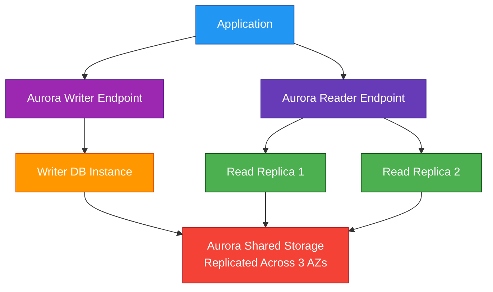
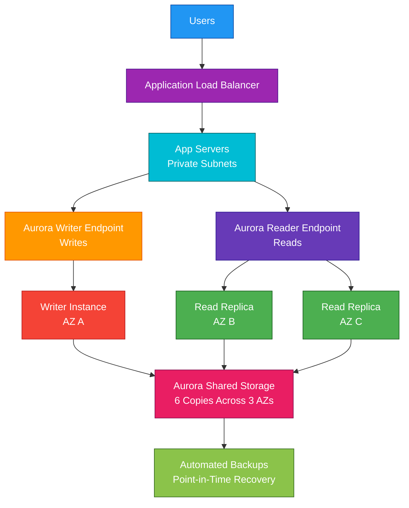

# Amazon Aurora

## 1. Definition

### Simple Definition

Amazon Aurora is a fully managed relational database engine built for the cloud.

It is compatible with MySQL and PostgreSQL, but designed to provide better performance, availability, and scalability than traditional self-managed databases.

### Memory Hook

Aurora = AWS-optimized MySQL/PostgreSQL.

### Basic Idea

Aurora separates database compute from storage.

Your database instances handle queries, while the shared Aurora storage layer automatically replicates data across multiple Availability Zones.

## 2. What Problem Does It Solve?

### Main Problem

Aurora solves the problem of running a highly available, scalable, relational database without managing the complex database infrastructure yourself.

### Without Aurora

You may need to manage:

- Database installation
- Replication setup
- Backups
- Failover
- Storage growth
- Patching
- Read scaling
- Multi-AZ durability
- Performance tuning infrastructure

### With Aurora

AWS manages much of the database infrastructure for you.

Aurora gives you:

- Managed relational database
- Automatic storage scaling
- Multi-AZ replicated storage
- Fast failover
- Read replicas
- Automated backups
- MySQL/PostgreSQL compatibility

### Key Benefit

Aurora gives you the familiar relational database model with cloud-native availability, scalability, and durability.

## 3. Core Use Cases

### High-Performance Relational Applications

Use Aurora for applications that need a relational database with strong performance.

Examples:

- E-commerce platforms
- SaaS applications
- Financial systems
- Order management systems

### MySQL or PostgreSQL Workloads

Aurora is a good choice when you want MySQL or PostgreSQL compatibility but need better managed scalability and availability.

### Read-Heavy Applications

Aurora supports multiple read replicas.

Use it when many users or services need to read data at the same time.

### Highly Available Databases

Aurora is designed for production workloads that require high availability across multiple Availability Zones.

### Serverless Database Workloads

Aurora Serverless can automatically scale database capacity based on demand.

Useful for:

- Variable workloads
- Development and test environments
- Intermittent applications
- Applications with unpredictable traffic

### Global Applications

Aurora Global Database supports low-latency global reads and disaster recovery across Regions.

### Migration from Self-Managed Databases

Aurora is often used when migrating from self-managed MySQL or PostgreSQL to AWS.

## 4. Important Features for SAA

### Database Compatibility

Aurora has two main compatibility options:

| Aurora Engine | Compatible With |
|---|---|
| Aurora MySQL | MySQL |
| Aurora PostgreSQL | PostgreSQL |

### Cluster Architecture

Aurora uses a cluster model.

A typical Aurora cluster includes:

- One primary writer instance
- Zero or more read replica instances
- A shared distributed storage volume

### Writer Instance

The writer instance handles write operations.

Examples:

- `INSERT`
- `UPDATE`
- `DELETE`

There is usually one writer in a standard Aurora cluster.

### Reader Instances

Reader instances handle read traffic.

Examples:

- `SELECT` queries
- Reporting queries
- Read-heavy application traffic

### Aurora Replicas

Aurora can have up to 15 read replicas in a cluster.

These replicas share the same storage layer and can be used for read scaling and failover.

### Cluster Endpoint

The cluster endpoint points to the current writer instance.

Applications use this endpoint for read/write traffic.

### Reader Endpoint

The reader endpoint load balances read traffic across available Aurora replicas.

Applications use this endpoint for read-only queries.

### Custom Endpoint

Custom endpoints allow you to create a group of specific Aurora instances.

Use them when certain workloads should use specific replicas.

Example:

- Reporting queries use larger replicas
- Normal application reads use smaller replicas

### Aurora Storage

Aurora uses a shared distributed storage system.

Important points:

- Storage automatically grows as needed
- Data is replicated across multiple Availability Zones
- You do not manually provision storage in the same way as traditional RDS
- Storage is separate from compute

### Storage Auto Scaling

Aurora storage automatically scales as your data grows.

This reduces the need for manual capacity planning.

### Read Scaling

Use Aurora Replicas to scale read traffic.

Applications can send reads to the reader endpoint and writes to the cluster endpoint.

### Failover

If the writer instance fails, Aurora can promote a read replica to become the new writer.

Failover is faster when the cluster already has Aurora Replicas.

### Backups

Aurora supports automated backups and point-in-time recovery.

You can restore your database to a specific time within the backup retention period.

### Snapshots

Aurora supports manual snapshots.

Snapshots are retained until you delete them.

They are useful before major changes or for long-term backup needs.

### Aurora Serverless

Aurora Serverless automatically scales database capacity based on workload demand.

Important exam point:

Aurora Serverless is useful when database traffic is unpredictable, variable, or intermittent.

### Aurora Global Database

Aurora Global Database allows one primary Region and secondary read-only Regions.

Use it for:

- Global low-latency reads
- Cross-Region disaster recovery
- Multi-Region application architectures

### Backtrack

Aurora MySQL supports Backtrack.

Backtrack lets you quickly rewind a database to a previous point in time without restoring from a backup.

Exam tip:

Backtrack is useful for quickly undoing accidental changes.

### Database Cloning

Aurora cloning creates a fast, space-efficient copy of a database cluster.

Use it for:

- Testing
- Development
- Analytics
- Safe experimentation

### RDS Proxy

RDS Proxy can be used with Aurora to manage database connections efficiently.

It is especially useful with Lambda because Lambda can create many short-lived connections.

### Monitoring

Aurora integrates with:

- CloudWatch metrics
- Enhanced Monitoring
- Performance Insights
- RDS events
- CloudTrail

## 5. Security Model

### IAM Permissions

IAM controls who can manage Aurora resources.

Common permissions:

| Permission | Purpose |
|---|---|
| `rds:CreateDBCluster` | Create an Aurora cluster |
| `rds:CreateDBInstance` | Create DB instances |
| `rds:ModifyDBCluster` | Modify cluster settings |
| `rds:CreateDBClusterSnapshot` | Create cluster snapshots |
| `rds:RestoreDBClusterFromSnapshot` | Restore from snapshot |
| `rds:DeleteDBCluster` | Delete a cluster |

### Database Authentication

Aurora supports traditional database users and passwords.

It can also support IAM database authentication for supported engines.

### Secrets Management

Do not hardcode database passwords in application code.

Use:

- AWS Secrets Manager
- Systems Manager Parameter Store
- KMS encryption

### Network Security

Aurora runs inside a VPC.

Best practice:

- Place Aurora in private subnets
- Do not make it publicly accessible unless absolutely required
- Use security groups to control access

### Security Groups

Security groups control inbound and outbound database traffic.

Example:

Allow the application security group to connect to Aurora on the database port.

Common ports:

| Engine | Default Port |
|---|---:|
| MySQL / Aurora MySQL | 3306 |
| PostgreSQL / Aurora PostgreSQL | 5432 |

### Encryption at Rest

Aurora supports encryption at rest using AWS KMS.

Encryption protects:

- Database storage
- Automated backups
- Snapshots
- Replicas

Important exam point:

Encryption is usually enabled when the cluster is created.

### Encryption in Transit

Aurora supports encryption in transit using SSL/TLS.

Use TLS when applications connect to the database.

### IAM Database Authentication

IAM database authentication allows applications to authenticate using IAM tokens instead of static passwords.

This is useful for stronger access control and temporary credentials.

### Audit and Activity Tracking

Aurora can integrate with logging and monitoring tools.

Useful options include:

- CloudWatch Logs
- Database audit logs
- CloudTrail for API activity
- Performance Insights

### Shared Responsibility

AWS is responsible for:

- Aurora infrastructure
- Storage replication
- Managed database service availability
- Physical security
- Managed backups infrastructure
- Underlying hardware maintenance

You are responsible for:

- Database schema design
- User permissions inside the database
- IAM permissions
- Security group rules
- Encryption settings
- Backup retention configuration
- Patch scheduling choices
- Query and application design

## 6. High Availability / Durability Behavior

### Availability

Aurora is designed for high availability within an AWS Region.

It uses a distributed storage system across multiple Availability Zones.

### Multi-AZ Storage

Aurora automatically replicates storage across three Availability Zones.

This provides high durability and helps protect against AZ-level failures.

### Storage Durability

Aurora stores multiple copies of data across Availability Zones.

This is one of the biggest exam differences between Aurora and traditional single-instance databases.

### Compute vs Storage Separation

Aurora separates compute from storage.

If a DB instance fails, the storage layer remains available.

A new or existing replica can be used to continue service.

### Automatic Failover

If the writer instance fails, Aurora can automatically fail over to a replica.

Failover is usually faster when replicas already exist.

### Aurora Replicas for HA

Aurora Replicas provide both:

- Read scaling
- Failover targets

For production, use replicas in different Availability Zones.

### Multi-Region Behavior

Aurora clusters are regional by default.

For Multi-Region architecture, use Aurora Global Database.

### Aurora Global Database

Aurora Global Database has:

- One primary Region for writes
- One or more secondary Regions for reads
- Cross-Region replication
- Disaster recovery support

### Backup Durability

Aurora automated backups are continuous and support point-in-time recovery.

Manual snapshots persist until deleted.

### Failure Scenarios

| Failure | Aurora Behavior |
|---|---|
| Reader instance fails | Reader endpoint uses other replicas |
| Writer instance fails | Replica can be promoted |
| AZ issue | Storage is replicated across AZs |
| Region issue | Use Aurora Global Database for cross-Region DR |

## 7. Cost Optimization Options

### Choose the Right Instance Size

Use the smallest DB instance class that meets performance needs.

Scale up only when metrics show a real need.

### Use Aurora Serverless for Variable Workloads

Aurora Serverless can reduce cost for workloads with unpredictable or intermittent traffic.

Use it when the database does not need fixed capacity all the time.

### Stop Non-Production Databases

For development and test environments, stop databases when not in use if the configuration supports it.

This can reduce compute cost.

### Right-Size Read Replicas

Read replicas add cost.

Use only the number and size of replicas needed for read performance and failover.

### Monitor Storage Growth

Aurora storage auto scales, but storage still costs money.

Clean up unnecessary data and archive old records when appropriate.

### Use Backups and Snapshots Carefully

Manual snapshots are retained until deleted.

Delete old snapshots that are no longer required.

### Use Reserved Instances

For steady production workloads, Reserved Instances can reduce database compute cost.

### Avoid Unnecessary Cross-Region Replication

Aurora Global Database is powerful but adds cost.

Use it when you truly need global reads or cross-Region disaster recovery.

### Use RDS Proxy Efficiently

RDS Proxy can reduce connection overhead and improve efficiency, especially with Lambda-based workloads.

### Optimize Queries

Poor queries can force larger instances and more replicas.

Use indexes, query tuning, and Performance Insights to reduce unnecessary database load.

## 8. Common Exam Traps

### Aurora Is Not the Same as Standard RDS MySQL/PostgreSQL

Aurora is managed by RDS, but it uses a cloud-native storage architecture.

It is compatible with MySQL/PostgreSQL, but not identical to standard RDS MySQL/PostgreSQL.

### Aurora Storage Is Shared

Aurora replicas share the same distributed storage layer.

They are not the same as traditional replicas that each maintain a fully separate storage copy.

### Use Reader Endpoint for Reads

Do not send all traffic to the writer endpoint if the application has heavy read traffic.

Use the reader endpoint to distribute read queries across replicas.

### Writer Endpoint for Writes

Writes should go to the cluster/writer endpoint.

Reader endpoints are for read-only traffic.

### Aurora Replicas Help Failover

If the cluster has no replicas, failover can take longer because Aurora may need to create a new writer instance.

### Aurora Serverless Is for Variable Workloads

If the exam describes unpredictable, intermittent, or spiky database usage, Aurora Serverless may be the best answer.

### Global Database Is for Cross-Region

Multi-AZ protects within a Region.

Aurora Global Database helps with cross-Region reads and disaster recovery.

### Read Replica Is Not Multi-Writer

Aurora read replicas are for reads and failover.

They do not usually allow writes in a standard single-writer Aurora cluster.

### Backtrack Is Not a Backup Restore

Backtrack quickly rewinds an Aurora MySQL database.

It is different from restoring a snapshot or point-in-time recovery.

### Encryption Must Be Planned

For many database services, encryption at rest is easiest to enable at creation time.

Plan encryption before creating production clusters.

### Lambda Connection Trap

Lambda can create many database connections quickly.

Use RDS Proxy to manage connection pooling and reduce database overload.

### Aurora Is Relational

Aurora is for relational workloads.

If the exam asks for key-value access at massive scale with single-digit millisecond latency, DynamoDB may be better.

## 9. Compare With Similar Services

### Service Comparison Table

| Service | Main Purpose | Best For | Choose When |
|---|---|---|---|
| Aurora | Cloud-native relational database | High-performance MySQL/PostgreSQL-compatible workloads | You need managed relational DB with high availability and scaling |
| RDS MySQL/PostgreSQL | Managed traditional relational DB | Standard relational workloads | You need managed MySQL/PostgreSQL with familiar architecture |
| DynamoDB | NoSQL key-value/document DB | Massive scale and low-latency access | You do not need relational joins or SQL-style design |
| Redshift | Data warehouse | Analytics and reporting | You need OLAP, BI, and large-scale analytical queries |
| ElastiCache | In-memory cache | Low-latency caching | You need Redis or Memcached caching |
| DocumentDB | Document database | MongoDB-compatible document workloads | You need JSON document storage with MongoDB compatibility |

### Aurora vs RDS MySQL/PostgreSQL

| Feature | Aurora | Standard RDS MySQL/PostgreSQL |
|---|---|---|
| Architecture | Cloud-native shared storage | Traditional database architecture |
| Storage scaling | Automatic | More manual/provisioned |
| Replicas | Up to 15 Aurora Replicas | Fewer and more traditional replicas |
| Failover | Fast with replicas | Multi-AZ failover supported |
| Performance | AWS-optimized | Standard engine performance |
| Cost | Often higher | Often cheaper for smaller/simple workloads |

### Aurora vs DynamoDB

| Feature | Aurora | DynamoDB |
|---|---|---|
| Database type | Relational | NoSQL |
| Query language | SQL | API-based queries |
| Relationships/joins | Yes | No traditional joins |
| Scaling style | DB instances and Aurora storage | Serverless-style table scaling |
| Best for | Relational apps | Key-value and document workloads |
| Exam clue | SQL, transactions, MySQL/PostgreSQL | Massive scale, NoSQL, single-digit ms latency |

### Aurora vs Redshift

| Feature | Aurora | Redshift |
|---|---|---|
| Workload type | OLTP | OLAP |
| Best for | Application database | Analytics and data warehousing |
| Query pattern | Many small transactions | Large analytical queries |
| Example | Order processing app | Business intelligence dashboard |

### Aurora vs ElastiCache

| Feature | Aurora | ElastiCache |
|---|---|---|
| Main purpose | Persistent relational database | In-memory cache |
| Durability | Durable database storage | Cache-focused |
| Query style | SQL | Key-value cache operations |
| Best for | Source of truth data | Speeding up frequent reads |

### When to Choose Aurora

Choose Aurora when:

- You need a managed relational database
- You need MySQL or PostgreSQL compatibility
- You need high availability across AZs
- You need read scaling with replicas
- You need faster failover than traditional setups
- You need Aurora Serverless for variable workloads
- You need Aurora Global Database for cross-Region reads or DR

## 10. Mini Architecture Example

### Scenario

A company runs an e-commerce application that needs a highly available relational database.

The application has many read requests for products and orders, but only some write requests when customers place orders.

### Architecture

Use Aurora with one writer instance and multiple read replicas across Availability Zones.

The application sends writes to the writer endpoint and reads to the reader endpoint.

### Why This Is Good

- Aurora provides a managed relational database
- Storage is replicated across multiple Availability Zones
- Writer endpoint handles writes
- Reader endpoint distributes read traffic
- Read replicas improve read performance
- Replicas can be promoted during failover
- Automated backups support point-in-time recovery

### Exam Answer Pattern

If the question says:

“Use a highly available MySQL/PostgreSQL-compatible relational database with read scaling and automatic storage replication.”

Think:

Amazon Aurora.

### Final Memory Hook

Aurora is for high-performance relational databases.

DynamoDB is for NoSQL at massive scale.

Redshift is for analytics.

ElastiCache is for caching.

RDS Proxy helps manage database connections.

