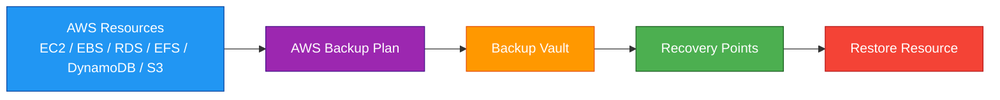
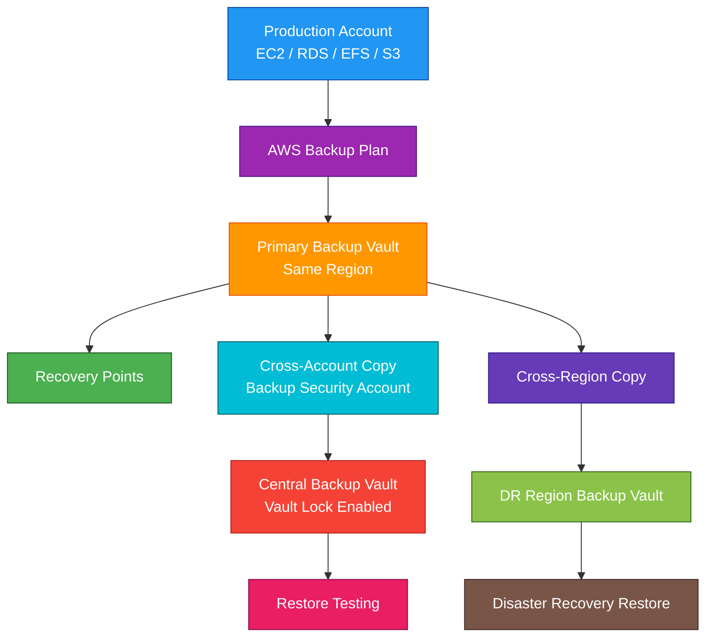

# AWS Backup

## 1. Definition

### Simple Definition

AWS Backup is a fully managed service for centralizing and automating backups across AWS services and supported hybrid workloads.

It helps you create backup schedules, retention rules, backup vaults, and restore points from one place.

### Memory Hook

AWS Backup = One place to protect many AWS services.

### Basic Idea

Instead of configuring backups separately for every AWS service, you can use AWS Backup to manage backup policies centrally.

## 2. What Problem Does It Solve?

### Main Problem

AWS Backup solves the problem of managing backups across many AWS services separately.

Without AWS Backup, each service may need its own backup configuration, retention settings, permissions, and monitoring.

### Without AWS Backup

You may need to manage backups manually for:

- EBS volumes
- EC2 instances
- RDS databases
- Aurora clusters
- DynamoDB tables
- EFS file systems
- S3 buckets
- FSx file systems

This can become difficult to monitor and audit.

### With AWS Backup

You can define backup policies in one place and apply them to many supported resources.

### Key Benefit

AWS Backup provides centralized backup management, automation, compliance controls, and restore operations.

## 3. Core Use Cases

### Centralized Backup Management

Use AWS Backup to manage backup plans across multiple AWS services from one console.

### Scheduled Backups

Create automatic backup schedules.

Examples:

- Daily backups
- Weekly backups
- Monthly backups
- Long-term retention backups

### Compliance and Retention

Use AWS Backup to enforce backup retention policies.

Example:

Keep daily backups for 35 days and monthly backups for 1 year.

### Cross-Region Backup Copies

Copy backups to another AWS Region for disaster recovery.

This helps protect against Regional failures.

### Cross-Account Backup Copies

Copy backups to another AWS account for security isolation.

This helps protect backups from accidental or malicious deletion in the source account.

### Restore Operations

Use AWS Backup to restore resources from recovery points.

Examples:

- Restore an EBS volume
- Restore an RDS database
- Restore an EFS file system
- Restore an S3 backup

### Organization-Wide Backup Policies

With AWS Organizations, you can apply backup policies across multiple AWS accounts.

This is useful for large companies with many accounts.

### Audit and Compliance Reporting

AWS Backup Audit Manager helps check whether backup policies meet compliance requirements.

## 4. Important Features for SAA

### Backup Plan

A backup plan defines when and how backups are created.

A backup plan can include:

- Backup schedule
- Backup window
- Lifecycle rules
- Retention period
- Copy rules
- Target backup vault

### Backup Rule

A backup rule is part of a backup plan.

It defines details such as:

- How often backups run
- When backups start
- How long backups are retained
- Whether backups are copied to another Region or account

### Backup Vault

A backup vault is a container that stores recovery points.

You can think of it as a secure backup storage location.

### Recovery Point

A recovery point is a backup copy of a resource at a specific point in time.

You restore resources from recovery points.

### Resource Assignment

Resource assignment tells AWS Backup which resources to protect.

You can assign resources by:

- Resource ID
- Resource type
- Tags

### Tag-Based Backup

Tag-based backup is useful for automation.

Example:

Any resource with this tag is backed up:

| Tag Key | Tag Value |
|---|---|
| `Backup` | `Daily` |

### Lifecycle Rules

Lifecycle rules control how long backups stay in each storage tier.

They can:

- Move backups to cold storage when supported
- Delete backups after the retention period

### Cold Storage

Cold storage is used for long-term backups that are rarely restored.

Important points:

- Lower storage cost
- Higher retrieval considerations
- Not supported for every resource type
- Useful for compliance and archival backups

### Cross-Region Copy

Cross-Region copy stores a backup copy in another AWS Region.

Use it for:

- Disaster recovery
- Compliance
- Protection from Regional failures

### Cross-Account Copy

Cross-account copy stores backups in another AWS account.

Use it for:

- Backup isolation
- Security separation
- Protection from compromised source account

### Continuous Backup

Some services support continuous backup and point-in-time recovery.

This allows restoration to a specific point in time within the retention window.

### Point-in-Time Recovery

Point-in-time recovery, or PITR, lets you restore a resource to a specific time.

This is useful when recovering from accidental deletion, corruption, or bad application changes.

### AWS Backup Vault Lock

AWS Backup Vault Lock helps protect backups from deletion or modification.

It can enforce write-once-read-many, or WORM, protection.

### Governance Mode vs Compliance Mode

| Mode | Meaning |
|---|---|
| Governance Mode | Authorized users may be able to change lock settings |
| Compliance Mode | Lock settings cannot be changed after the cooling-off period |

### Logically Air-Gapped Vault

A logically air-gapped vault is a special AWS Backup vault designed for stronger backup isolation and recovery.

It can help protect backups from ransomware-style events and account compromise scenarios.

### Restore Testing

AWS Backup can help validate that backups can be restored successfully.

This is useful because a backup is only valuable if it can actually be restored.

### AWS Backup Audit Manager

AWS Backup Audit Manager helps evaluate backup compliance.

It can check controls such as:

- Backups are enabled
- Backup frequency is correct
- Retention periods are met
- Backup resources are protected

### Supported Resources

AWS Backup supports many AWS services, but not every feature works with every resource type.

Exam tip:

Always assume feature support depends on the resource type and Region.

## 5. Security Model

### IAM Permissions

IAM controls who can create, manage, delete, and restore backups.

Common permissions:

| Permission | Purpose |
|---|---|
| `backup:CreateBackupPlan` | Create backup plans |
| `backup:StartBackupJob` | Start an on-demand backup |
| `backup:StartRestoreJob` | Restore from a recovery point |
| `backup:DeleteRecoveryPoint` | Delete a recovery point |
| `backup:CopyIntoBackupVault` | Copy backups into a vault |
| `backup:PutBackupVaultAccessPolicy` | Add a vault access policy |

### Service Role

AWS Backup uses IAM service roles to access and back up AWS resources.

The service role must have permissions to:

- Read the source resource
- Create backups
- Copy backups
- Restore resources when needed

### Backup Vault Access Policies

Backup vaults can have resource-based access policies.

These policies control who can access or copy backups in the vault.

### Encryption at Rest

AWS Backup supports encrypted backups.

Encryption behavior depends on the resource type and vault configuration.

AWS Backup can use AWS KMS keys for encryption.

### KMS Key Permissions

If backups are encrypted with KMS, the correct principals must have KMS permissions.

This matters for:

- Backup jobs
- Copy jobs
- Restore jobs
- Cross-account backup access

### Encryption in Transit

AWS API calls use encrypted communication over HTTPS.

For restored resources, use the encryption options of the destination service.

### Cross-Account Security

Cross-account backups improve isolation.

A common security pattern is:

- Production account creates backups
- Security or backup account stores copies
- Source account cannot easily delete isolated backup copies

### Vault Lock Protection

Vault Lock helps prevent backups from being deleted early.

Use it when compliance requires immutable backups.

### Network Security

AWS Backup is a managed AWS service, not a resource you place inside a VPC.

Network security mainly applies to the resources being backed up and restored.

### Shared Responsibility

AWS is responsible for:

- AWS Backup managed service infrastructure
- Backup service availability
- Underlying service security
- Physical security

You are responsible for:

- Backup plan configuration
- IAM permissions
- KMS key policies
- Vault policies
- Vault Lock settings
- Retention periods
- Restore testing
- Monitoring backup job status

## 6. High Availability / Durability Behavior

### Availability

AWS Backup is a managed regional service.

It helps protect supported resources by creating backup recovery points.

### Durability

Backup durability depends on the protected service and backup storage used.

For SAA, remember that AWS Backup is designed to provide durable backup storage for supported resources.

### Regional Behavior

Backup vaults are regional.

A backup stored in one Region is not automatically available in another Region unless you configure cross-Region copy.

### Cross-Region Resilience

Use cross-Region backup copies to improve disaster recovery.

Example:

- Primary workload runs in `us-east-1`
- Backup copy is stored in `us-west-2`

### Cross-Account Resilience

Use cross-account copy to protect backups from account-level issues.

This helps if the production account is compromised or accidentally misconfigured.

### Multi-AZ Behavior

AWS Backup itself is managed by AWS.

For workloads, Multi-AZ protection depends on the service being backed up.

Example:

- RDS Multi-AZ improves database availability
- AWS Backup provides recoverability from backups

### Recovery Point Behavior

A recovery point is kept until:

- Its retention period expires
- It is deleted manually
- Vault Lock prevents deletion before retention ends

### Restore Behavior

Restoring from backup usually creates or restores a resource based on the selected recovery point.

Restore speed depends on:

- Resource type
- Backup size
- Region
- Storage class
- Service restore process

### Backup Is Not the Same as High Availability

Backups help with recovery.

They do not replace highly available architecture.

For high availability, use services and designs such as:

- Multi-AZ
- Auto Scaling
- Load balancing
- Replication
- Multi-Region failover

## 7. Cost Optimization Options

### Set Proper Retention Periods

Do not keep backups longer than needed.

Match retention to business and compliance requirements.

### Use Lifecycle Rules

Move eligible backups to cold storage for long-term retention.

This can reduce storage cost for rarely accessed backups.

### Avoid Duplicate Backup Systems

Avoid creating unnecessary backups outside AWS Backup if AWS Backup already meets the requirement.

Duplicate backups can increase cost and complexity.

### Use Tag-Based Selection Carefully

Tag-based backup is powerful, but wrong tags can back up too many resources or miss important resources.

Use consistent tagging.

### Delete Old Manual Backups

Manual backups or snapshots may stay until deleted.

Review and delete backups that are no longer needed.

### Use Cross-Region Copies Only When Needed

Cross-Region copies improve disaster recovery but add storage and transfer costs.

Use them for critical workloads.

### Use Cross-Account Copies for Critical Data

Cross-account copies add protection but can increase cost.

Use them for workloads that require stronger isolation.

### Monitor Backup Storage Growth

Backup storage can grow over time.

Monitor:

- Vault size
- Recovery point count
- Retention settings
- Copy rules
- Old snapshots

### Test Restore Without Overdoing It

Restore testing is important, but frequent restore tests may create temporary resources and extra cost.

Clean up test restore resources after validation.

## 8. Common Exam Traps

### AWS Backup Is Centralized Management

AWS Backup centralizes backup management.

It does not automatically protect every resource unless you configure backup plans and resource assignments.

### AWS Backup Does Not Manage All Backups Automatically

Backups created outside AWS Backup may not be governed by AWS Backup policies.

Exam clue:

If the question needs centralized backup policy enforcement, choose AWS Backup.

### Backup Is Not Disaster Recovery by Itself

A backup helps you recover data.

A full DR plan also needs:

- Restore process
- Target infrastructure
- Recovery time planning
- Recovery point planning
- Testing

### Backup Is Not Replication

Backups are point-in-time recovery copies.

Replication keeps another copy updated more continuously.

Choose based on RPO and RTO requirements.

### Cross-Region Copy Is Not Automatic

You must configure copy rules to store backups in another Region.

### Cross-Account Copy Is for Isolation

If the exam says backups must be protected from accidental or malicious deletion in the production account, think cross-account backup copy and Vault Lock.

### Vault Lock Is for Immutability

Vault Lock helps enforce retention and prevent deletion.

Use it for compliance and ransomware protection scenarios.

### Cold Storage Is Not for Every Resource

Not every AWS Backup-supported resource supports transition to cold storage.

Check feature support in real-world designs.

### Retention Period Matters

If retention is too short, backups may be deleted before they are needed.

If retention is too long, costs increase.

### Restore Testing Matters

A backup strategy is incomplete if restores are never tested.

Exam questions may mention compliance validation or restore readiness.

### KMS Can Block Restore

If KMS permissions are wrong, backup copy or restore jobs can fail.

For encrypted backups, check KMS key access.

### AWS Backup Is Not a File Sync Tool

AWS Backup is for backups and recovery.

It is not used for live file synchronization or application-level replication.

## 9. Compare With Similar Services

### Service Comparison Table

| Service | Main Purpose | Best For | Choose When |
|---|---|---|---|
| AWS Backup | Centralized backup management | Backing up supported AWS resources | You need automated backup policies, retention, and restore |
| EBS Snapshots | EBS volume backups | Volume-level EC2 storage backup | You need direct EBS snapshot control |
| RDS Automated Backups | Database backup | RDS point-in-time restore | You need native RDS backup and PITR |
| S3 Versioning | Object version protection | Recovering overwritten/deleted objects | You need object-level version history |
| S3 Replication | Object replication | Copying S3 objects across buckets/Regions | You need near-real-time replicated S3 copies |
| CloudEndure / AWS Elastic Disaster Recovery | Disaster recovery | Server replication and failover | You need low RTO/RPO disaster recovery for servers |

### AWS Backup vs EBS Snapshots

| Feature | AWS Backup | EBS Snapshots |
|---|---|---|
| Scope | Centralized across services | EBS-focused |
| Policies | Central backup plans | Snapshot lifecycle policies or manual snapshots |
| Cross-account copy | Supported for backup workflows | Possible, but less centralized |
| Best for | Organization-wide backup strategy | Direct EBS snapshot management |

### AWS Backup vs RDS Automated Backups

| Feature | AWS Backup | RDS Automated Backups |
|---|---|---|
| Scope | Centralized backup management | RDS-specific |
| Policy management | Cross-service plans | Database-level settings |
| Best for | Central compliance and governance | Native database PITR |
| Common use | Multi-service protection | Database-specific recovery |

### AWS Backup vs S3 Versioning

| Feature | AWS Backup | S3 Versioning |
|---|---|---|
| Purpose | Backup and restore management | Keeps object versions |
| Protection style | Backup recovery points | Object-level version history |
| Best for | Centralized backup policy | Recovering overwritten/deleted objects |
| Common together | Backup S3 data centrally | Version important buckets |

### AWS Backup vs S3 Replication

| Feature | AWS Backup | S3 Replication |
|---|---|---|
| Main purpose | Backup recovery | Copy objects to another bucket |
| Timing | Scheduled or continuous depending on resource | Near-real-time replication |
| Best for | Recovery points and retention | Keeping another bucket updated |
| Exam clue | Backup policy and restore | Replicate S3 objects across Regions/accounts |

### AWS Backup vs AWS Elastic Disaster Recovery

| Feature | AWS Backup | AWS Elastic Disaster Recovery |
|---|---|---|
| Main purpose | Backup and restore | Disaster recovery failover |
| Recovery speed | Depends on restore process | Designed for low RTO recovery |
| Workload type | Supported AWS resources | Servers and applications |
| Best for | Data protection and compliance | Business continuity with fast failover |

### When to Choose AWS Backup

Choose AWS Backup when:

- You need centralized backup management
- You need automated backup schedules
- You need retention policies
- You need cross-Region backup copies
- You need cross-account backup isolation
- You need backup compliance auditing
- You need restore operations from recovery points
- You need immutable backup protection with Vault Lock

## 10. Mini Architecture Example

### Scenario

A company runs production workloads across multiple AWS accounts.

They need centralized backup management, cross-account backup isolation, and cross-Region disaster recovery.

### Architecture

AWS Backup runs backup plans in production accounts.

Backups are stored in a local vault and copied to a central backup account.

Critical backups are also copied to another Region.

Vault Lock protects backups from early deletion.

### Why This Is Good

- Backup plans automate protection
- Backup vaults organize recovery points
- Cross-account copies improve security isolation
- Cross-Region copies improve disaster recovery
- Vault Lock helps protect backups from deletion
- Restore testing validates recovery readiness

### Exam Answer Pattern

If the question says:

“Centrally manage backup schedules, retention, cross-account copies, and compliance across AWS services.”

Think:

AWS Backup.

### Final Memory Hook

AWS Backup centralizes backups.

Vaults store recovery points.

Vault Lock protects backups.

Cross-Region copy helps disaster recovery.

Cross-account copy helps security isolation.

Restore testing proves backups work.

