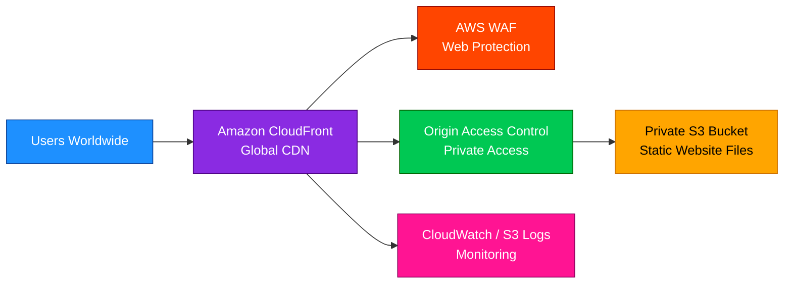

# CloudFront

<details>
<summary><h2>1. Definition</h2></summary>

### Simple Definition

Amazon CloudFront is AWS’s **Content Delivery Network (CDN)** service.

It delivers websites, images, videos, APIs, and other content to users from **edge locations** close to them instead of always going back to the original server.

### Beginner Analogy

Think of CloudFront like placing copies of your website files in many global mini-warehouses.

When a user visits your site, CloudFront serves the content from the closest warehouse, making the website faster.

### Key Exam Idea

CloudFront is mainly used for:

- Lower latency
- Faster content delivery
- Caching static and dynamic content
- Protecting origins from direct public access
- Adding security at the edge

### Memory Hook

**CloudFront = Front door cache for global users**

</details>

<details>
<summary><h2>2. What Problem Does It Solve?</h2></summary>

### Main Problem

Without CloudFront, users around the world may have to connect directly to an origin server in one AWS Region.

That can cause:

- Higher latency
- Slower downloads
- More load on the origin
- Higher origin data transfer
- More exposure to internet attacks

### How CloudFront Helps

CloudFront stores cached copies of content at AWS edge locations.

When users request content:

1. User sends request to CloudFront.
2. CloudFront checks the nearest edge cache.
3. If content is cached, CloudFront returns it quickly.
4. If not cached, CloudFront fetches it from the origin and caches it for future requests.

### Key Exam Idea

CloudFront improves performance by serving content from **edge locations**, not by moving your whole application to multiple Regions.

</details>

<details>
<summary><h2>3. Core Use Cases</h2></summary>

### Static Website Acceleration

Common with:

- Amazon S3 static websites
- Images
- CSS
- JavaScript
- HTML files

### Dynamic Website Acceleration

CloudFront can also deliver dynamic content such as:

- API responses
- Personalized web pages
- Application traffic behind ALB or EC2

### Video Streaming

Used for:

- On-demand videos
- Live streaming
- Media delivery at scale

### Secure Private Content

CloudFront can restrict access using:

- Signed URLs
- Signed cookies
- Origin Access Control for private S3 buckets

### Global API Acceleration

CloudFront can sit in front of:

- API Gateway
- Application Load Balancer
- EC2-based web applications

### DDoS Protection Layer

CloudFront integrates with:

- AWS Shield Standard
- AWS WAF
- AWS Firewall Manager

</details>

<details>
<summary><h2>4. Important Features for SAA</h2></summary>

### Distribution

A CloudFront distribution is the main configuration object.

It defines:

- Origins
- Cache behaviors
- Domain names
- TLS certificates
- Security settings
- Logging settings

### Origin

An origin is the original source of the content.

Common origins:

| Origin Type | Example |
|---|---|
| S3 bucket | Static files, images, videos |
| ALB | Web applications |
| EC2 | Custom web servers |
| API Gateway | APIs |
| Media services | Video streaming |
| Custom HTTP server | External origin |

### Edge Location

An edge location is where CloudFront caches and serves content close to users.

### Regional Edge Cache

Regional edge caches sit between edge locations and origins.

They help reduce repeated requests to the origin.

### Cache Behavior

Cache behaviors control how CloudFront handles different URL paths.

Example:

| Path Pattern | Behavior |
|---|---|
| `/images/*` | Cache for a long time |
| `/api/*` | Forward headers/query strings, short TTL |
| `/private/*` | Require signed URLs |

### Cache Policy

A cache policy controls what values are included in the cache key.

The cache key can include:

- Headers
- Cookies
- Query strings

### Origin Request Policy

An origin request policy controls what CloudFront forwards to the origin.

Important exam distinction:

| Policy | Purpose |
|---|---|
| Cache policy | Controls what makes cached objects unique |
| Origin request policy | Controls what is sent to the origin |

### TTL

TTL means **Time To Live**.

It controls how long CloudFront keeps an object in cache.

Common TTL settings:

| TTL Type | Meaning |
|---|---|
| Minimum TTL | Shortest time object stays cached |
| Default TTL | Normal cache duration |
| Maximum TTL | Longest cache duration |

### Invalidation

Invalidation removes cached objects from CloudFront before TTL expires.

Example:

```text
/index.html
/images/logo.png
/*
```

Important exam point:

- Invalidation works, but can cost money.
- Versioned file names are often better for frequent updates.

Example:

```text
app-v1.js
app-v2.js
```

### Origin Access Control

Origin Access Control, or OAC, is the modern way to allow CloudFront to securely access a private S3 bucket.

Use OAC instead of making the S3 bucket public.

### Signed URLs

Signed URLs are used when you want to give access to a specific private file for a limited time.

Good for:

- Paid downloads
- Private videos
- Temporary access to one object

### Signed Cookies

Signed cookies are used when you want to give access to multiple private files.

Good for:

- Premium video libraries
- Member-only content sections
- Multiple restricted files under a path

### Geo Restriction

Geo restriction allows or blocks users based on country.

Options:

| Option | Meaning |
|---|---|
| Allowlist | Only listed countries can access |
| Blocklist | Listed countries are blocked |

### Field-Level Encryption

Field-level encryption protects sensitive form fields before they reach the origin.

Example:

- Credit card number
- National ID
- Personal data

### CloudFront Functions

CloudFront Functions run lightweight JavaScript at edge locations.

Good for:

- URL rewrites
- Header manipulation
- Simple redirects
- Request normalization

### Lambda@Edge

Lambda@Edge is more powerful than CloudFront Functions.

Good for:

- Complex request logic
- Authentication checks
- Dynamic origin selection
- More advanced edge processing

### CloudFront Functions vs Lambda@Edge

| Feature | CloudFront Functions | Lambda@Edge |
|---|---|---|
| Best for | Lightweight logic | Advanced logic |
| Runtime | JavaScript only | Node.js / Python support depends on Lambda@Edge runtime support |
| Runs at | Edge locations | Regional edge caches |
| Use case | Redirects, headers, URL rewrites | Auth, origin selection, complex processing |
| Cost/performance | Cheaper and faster | More powerful but heavier |

### Custom Domain and TLS

CloudFront supports custom domain names using Alternate Domain Names, also called CNAMEs.

Important exam point:

- ACM certificates for CloudFront must be created in **us-east-1**.
- This is true even if the origin is in another Region.

</details>

<details>
<summary><h2>5. Security Model</h2></summary>

### IAM Permissions

IAM controls who can manage CloudFront.

Examples:

- Create distributions
- Update distributions
- Create invalidations
- Manage key groups
- Configure logging

IAM does not usually control end-user access to cached content directly.

End-user access is controlled with:

- Signed URLs
- Signed cookies
- Geo restriction
- AWS WAF
- Viewer protocol policies

### Encryption Options

CloudFront supports encryption:

| Path | Encryption Option |
|---|---|
| Viewer to CloudFront | HTTPS |
| CloudFront to origin | HTTPS |
| Sensitive fields | Field-level encryption |
| S3 origin access | Origin Access Control with signed requests |

### Viewer Protocol Policy

Controls how users connect to CloudFront.

Options:

| Option | Meaning |
|---|---|
| HTTP and HTTPS | Allow both |
| Redirect HTTP to HTTPS | Redirect insecure requests |
| HTTPS only | Reject HTTP |

### Origin Protocol Policy

Controls how CloudFront connects to the origin.

Options:

| Option | Meaning |
|---|---|
| HTTP only | CloudFront uses HTTP to origin |
| HTTPS only | CloudFront uses HTTPS to origin |
| Match viewer | Uses the same protocol as viewer request |

### S3 Origin Security

Best practice for private S3 origins:

1. Keep the S3 bucket private.
2. Configure CloudFront Origin Access Control.
3. Add an S3 bucket policy allowing CloudFront access.
4. Do not allow public access directly to S3.

### ALB Origin Security

For an ALB origin, you can restrict direct access by:

- Allowing only CloudFront IP ranges using AWS-managed prefix lists
- Using custom headers from CloudFront to ALB
- Requiring HTTPS
- Adding AWS WAF to CloudFront

### AWS WAF Integration

AWS WAF can protect CloudFront from:

- SQL injection
- Cross-site scripting
- Bad bots
- IP-based attacks
- Rate-based attacks

### DDoS Protection

CloudFront includes AWS Shield Standard automatically.

For advanced protection, use:

- AWS Shield Advanced
- AWS WAF
- CloudFront caching
- Rate-based rules

### Shared Responsibility

| AWS Responsibility | Customer Responsibility |
|---|---|
| Global edge infrastructure | Configure cache/security correctly |
| Physical security of edge locations | Use HTTPS and proper certificates |
| CloudFront service availability | Protect origins from direct access |
| Shield Standard integration | Configure WAF rules if needed |
| Managed CDN infrastructure | Manage private content access |

</details>

<details>
<summary><h2>6. High Availability / Durability Behavior</h2></summary>

### Availability

CloudFront is a global service.

It uses many edge locations around the world to serve user requests with low latency.

### Fault Tolerance

If one edge location has an issue, CloudFront can route requests through other nearby locations.

### Multi-Region Behavior

CloudFront itself is global, but your origin may be in one Region or multiple Regions.

Common origin options:

| Origin Setup | Behavior |
|---|---|
| Single S3 bucket | Simple and common |
| ALB in one Region | CloudFront improves global access but origin is still one Region |
| Multiple origins | Can route different paths to different origins |
| Origin failover | Can fail over to a secondary origin |

### Origin Failover

CloudFront origin groups allow failover from a primary origin to a secondary origin.

Example:

- Primary origin: S3 bucket in Region A
- Secondary origin: S3 bucket in Region B

CloudFront can fail over based on certain HTTP error codes.

### Durability

CloudFront is not a storage durability service.

Durability depends on the origin.

Example:

| Origin | Durability Responsibility |
|---|---|
| S3 | S3 stores objects durably |
| EC2 | You manage durability |
| ALB + Auto Scaling | You manage application/data durability |
| API Gateway | API Gateway handles API availability, backend still matters |

### Key Exam Idea

CloudFront improves global availability and performance, but it does not replace proper origin high availability.

</details>

<details>
<summary><h2>7. Cost Optimization Options</h2></summary>

### Use Caching Effectively

The more CloudFront serves from cache, the fewer requests go to the origin.

This can reduce:

- Origin load
- Origin compute cost
- Origin data transfer
- Application scaling pressure

### Use Longer TTLs for Static Content

Good candidates for long TTL:

- Images
- CSS
- JavaScript
- Fonts
- Videos

Use versioned file names when content changes.

Example:

```text
main-v1.css
main-v2.css
```

### Avoid Excessive Invalidations

Invalidations can be useful, but frequent invalidations may increase cost.

Better approach:

- Use object versioning in file names
- Cache static files longer
- Invalidate only when needed

### Choose the Right Price Class

CloudFront price classes let you reduce cost by limiting which edge locations serve traffic.

| Price Class | Meaning |
|---|---|
| Price Class 100 | Lowest cost, fewer edge locations |
| Price Class 200 | More locations |
| Price Class All | Best global performance, highest coverage |

### Compress Content

Enable compression for supported file types.

This can reduce:

- Data transfer size
- Load time
- Bandwidth cost

### Reduce Origin Requests

Use cache policies carefully.

Avoid forwarding unnecessary:

- Headers
- Cookies
- Query strings

More forwarded values can reduce cache hit ratio.

### Use CloudFront Functions for Simple Logic

For lightweight edge logic, CloudFront Functions are usually more cost-effective than Lambda@Edge.

### Memory Hook

**More cache hits = less origin cost**

</details>

<details>
<summary><h2>8. Common Exam Traps</h2></summary>

### Trap 1: CloudFront Is Global, But ACM Certificate Must Be In us-east-1

For CloudFront custom HTTPS certificates, the ACM certificate must be in:

```text
us-east-1
```

### Trap 2: OAC Is Preferred Over OAI

For private S3 origins, prefer:

```text
Origin Access Control
```

Older questions may mention Origin Access Identity, but modern best practice is OAC.

### Trap 3: CloudFront Does Not Replace S3 Durability

CloudFront caches content.

It does not become the permanent source of truth.

The origin is still responsible for durable storage.

### Trap 4: Invalidation Is Not the Only Way to Update Content

You can update content by:

- Invalidating cached files
- Waiting for TTL to expire
- Using versioned object names

For frequent deployments, versioned object names are often better.

### Trap 5: Cache Policy vs Origin Request Policy

Do not mix these up.

| Policy | Exam Meaning |
|---|---|
| Cache policy | What affects cache uniqueness |
| Origin request policy | What gets forwarded to origin |

### Trap 6: More Headers/Cookies/Query Strings Can Reduce Caching

Forwarding too many values creates more cache variations.

That can reduce cache hit ratio and increase origin load.

### Trap 7: Signed URLs vs Signed Cookies

| Requirement | Choose |
|---|---|
| Temporary access to one file | Signed URL |
| Access to many private files | Signed cookies |

### Trap 8: Geo Restriction Is Country-Based

CloudFront geo restriction works at the country level.

It is not the same as fine-grained user authentication.

### Trap 9: WAF Should Usually Be Attached at CloudFront for Global Web Protection

For global applications, attaching AWS WAF to CloudFront helps block bad traffic before it reaches the origin.

### Trap 10: CloudFront Can Cache Static and Dynamic Content

CloudFront is not only for static files.

It can also accelerate:

- APIs
- Dynamic web apps
- ALB-backed applications

</details>

<details>
<summary><h2>9. Compare With Similar Services</h2></summary>

### Service Comparison Table

| Service | Main Purpose | Choose It When |
|---|---|---|
| CloudFront | Global CDN and edge caching | You need low-latency global content delivery |
| S3 Static Website Hosting | Host static files directly from S3 | You need a simple static website, but not advanced CDN features |
| Global Accelerator | Improve performance for TCP/UDP applications | You need static Anycast IPs and network acceleration, not caching |
| Route 53 | DNS routing | You need domain registration, DNS records, health checks, or routing policies |
| API Gateway | Managed API front door | You need API throttling, authentication, stages, and API management |
| ALB | Layer 7 load balancing in a Region | You need HTTP/HTTPS routing to targets inside a Region |
| AWS WAF | Web attack filtering | You need to block malicious HTTP/S requests |
| Shield Advanced | Advanced DDoS protection | You need enhanced DDoS protection and response support |

### CloudFront vs Global Accelerator

| Feature | CloudFront | Global Accelerator |
|---|---|---|
| Main function | CDN caching | Network acceleration |
| Protocols | HTTP/HTTPS mainly | TCP/UDP |
| Caches content | Yes | No |
| Edge locations | Yes | Yes |
| Static Anycast IPs | Not the main feature | Yes |
| Best for | Websites, APIs, static assets, videos | Gaming, IoT, TCP/UDP apps, multi-Region failover |

### CloudFront vs Route 53

| Feature | CloudFront | Route 53 |
|---|---|---|
| Type | CDN | DNS service |
| Caches content | Yes | No |
| Routes domain names | Can use custom domains | Yes, primary DNS function |
| Health checks | No, not primary purpose | Yes |
| Best for | Fast content delivery | DNS and routing policies |

### CloudFront vs ALB

| Feature | CloudFront | ALB |
|---|---|---|
| Scope | Global edge network | Regional |
| Caching | Yes | No |
| Layer | Edge CDN | Layer 7 load balancer |
| Best for | Global performance and protection | Regional app load balancing |

### Simple Decision Guide

| Scenario | Best Choice |
|---|---|
| Serve static website globally with low latency | CloudFront + S3 |
| Protect website from web attacks globally | CloudFront + AWS WAF |
| Need DNS failover and domain routing | Route 53 |
| Need regional HTTP routing to containers/EC2 | ALB |
| Need TCP/UDP acceleration with static IPs | Global Accelerator |
| Need managed REST/WebSocket APIs | API Gateway |

</details>

<details>
<summary><h2>10. Mini Architecture Example</h2></summary>

### Scenario

You host a static website in a private S3 bucket and want users around the world to access it quickly and securely.

### Architecture



### Request Flow

1. User visits the website.
2. DNS points the domain to CloudFront.
3. CloudFront checks its edge cache.
4. If cached, CloudFront returns the content immediately.
5. If not cached, CloudFront uses OAC to fetch content from the private S3 bucket.
6. CloudFront caches the content for future users.
7. AWS WAF can block malicious requests before they reach the origin.

### Why This Is Good

| Benefit | Explanation |
|---|---|
| Fast | Content served from nearby edge locations |
| Secure | S3 bucket stays private |
| Scalable | CloudFront handles large global traffic |
| Cost-effective | Fewer requests reach S3 |
| Protected | AWS WAF and Shield Standard help defend against attacks |

### Exam-Focused Summary

Use CloudFront when you need to deliver content globally with low latency, caching, HTTPS, private origin access, and edge-level security.

### Final Memory Hook

**CloudFront = Global speed + edge cache + secure front door**

</details>