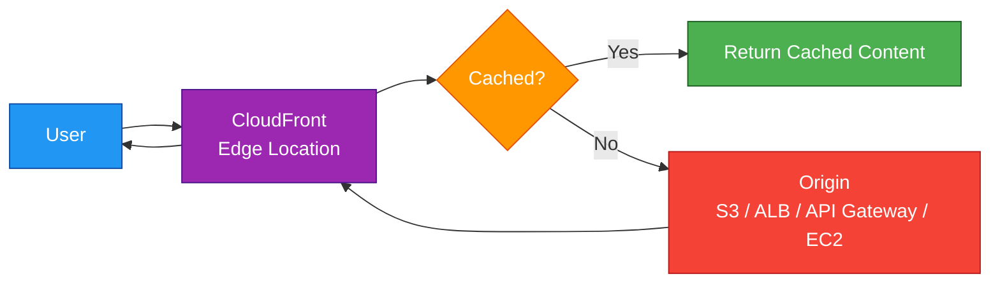
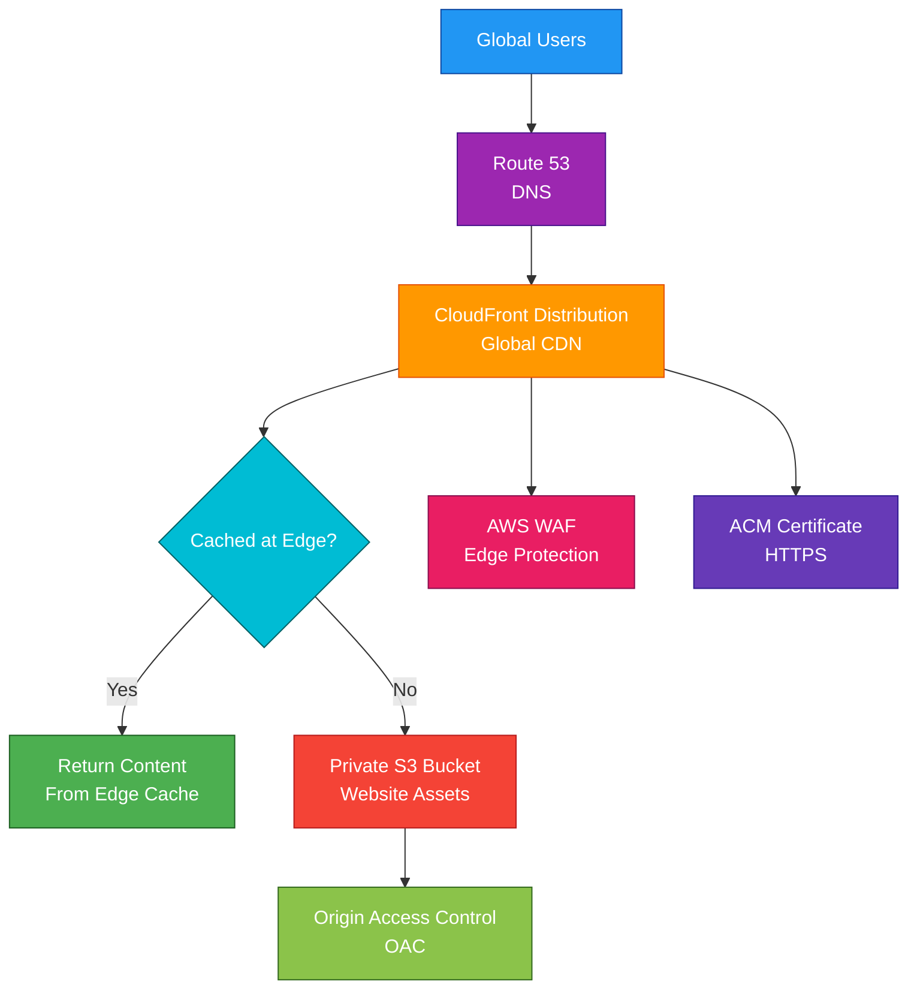

# CloudFront

## 1. Definition

### Simple Definition

Amazon CloudFront is AWS’s Content Delivery Network, or CDN.

It speeds up delivery of websites, APIs, videos, images, and other content by caching content closer to users around the world.

### Memory Hook

CloudFront = Front door at the edge.

### Basic Idea

Instead of every user reaching your application or S3 bucket directly, users connect to nearby CloudFront edge locations.

CloudFront then serves cached content quickly or forwards the request to the origin if needed.

## 2. What Problem Does It Solve?

### Main Problem

CloudFront solves the problem of slow content delivery to users who are far away from your application or storage origin.

It improves performance by serving content from edge locations near users.

### Without CloudFront

Users may experience:

- Higher latency
- Slower website loading
- More traffic hitting the origin directly
- Higher origin load
- Weaker global performance
- More exposure of the origin to the internet

### With CloudFront

CloudFront caches content at edge locations and reduces requests to the origin.

Users get faster responses, and the origin handles less traffic.

### Key Benefit

CloudFront improves speed, scalability, availability, and security for global applications.

## 3. Core Use Cases

### Static Website Acceleration

Use CloudFront to cache and deliver static files.

Examples:

- HTML
- CSS
- JavaScript
- Images
- Videos

### S3 Content Delivery

CloudFront is commonly used in front of S3 buckets.

Example:

- S3 stores images
- CloudFront delivers images globally
- Users do not access the S3 bucket directly

### Dynamic Website Acceleration

CloudFront can also forward dynamic requests to origins like ALB, EC2, or API Gateway.

Even if the content is not cached, CloudFront can improve performance using AWS’s global edge network.

### API Acceleration

CloudFront can sit in front of APIs to improve global access.

Common origins:

- API Gateway
- Application Load Balancer
- EC2 web servers

### Video Streaming

CloudFront can deliver video content globally with low latency.

### Security Front Door

CloudFront can work with AWS WAF and Shield to protect applications from common web attacks and DDoS attacks.

### Private Content Delivery

CloudFront can restrict access to content using signed URLs or signed cookies.

## 4. Important Features for SAA

### Distribution

A CloudFront distribution is the main CloudFront resource.

It defines:

- Origins
- Cache behavior
- Domain names
- TLS certificate
- Security settings
- Logging
- Price class

### Origin

An origin is the backend source where CloudFront gets content.

Common origins:

| Origin Type | Example |
|---|---|
| S3 bucket | Static files, images, downloads |
| Application Load Balancer | Web applications |
| EC2 instance | Custom web server |
| API Gateway | APIs |
| Media services | Video streaming |
| Custom HTTP server | External web origin |

### Edge Locations

Edge locations are global CloudFront locations where content is cached close to users.

Users are routed to nearby edge locations for faster response times.

### Regional Edge Caches

Regional edge caches sit between edge locations and origins.

They help reduce repeated requests to the origin.

### Cache Behavior

Cache behavior controls how CloudFront handles requests.

It can define:

- Path patterns
- Allowed HTTP methods
- Viewer protocol policy
- Cache policy
- Origin request policy
- Response headers policy
- TTL settings

### Path-Based Caching

CloudFront can use different cache behaviors for different paths.

Example:

| Path Pattern | Behavior |
|---|---|
| `/images/*` | Cache for a long time |
| `/api/*` | Forward to API origin |
| `/private/*` | Require signed URLs |

### TTL

TTL means Time To Live.

It controls how long CloudFront caches content before checking the origin again.

| TTL Type | Meaning |
|---|---|
| Minimum TTL | Shortest time content stays cached |
| Default TTL | Normal cache time |
| Maximum TTL | Longest allowed cache time |

### Cache Hit

A cache hit happens when CloudFront already has the requested content cached.

This gives faster responses and reduces origin load.

### Cache Miss

A cache miss happens when CloudFront does not have the content cached.

CloudFront must request it from the origin.

### Invalidation

Invalidation removes cached objects from CloudFront before the TTL expires.

Use it when content changes and users need the new version quickly.

Example:

Invalidate `/index.html` after deploying a new website version.

### Versioned File Names

Instead of frequent invalidations, use versioned file names.

Example:

- `app-v1.js`
- `app-v2.js`
- `logo-2026.png`

This is usually better for cost and caching.

### Allowed HTTP Methods

CloudFront can allow different HTTP methods.

Examples:

| Method Set | Use Case |
|---|---|
| `GET`, `HEAD` | Static content |
| `GET`, `HEAD`, `OPTIONS` | Static content with CORS |
| All methods | Dynamic APIs or applications |

### Viewer Protocol Policy

Viewer protocol policy controls how users connect to CloudFront.

Common options:

| Policy | Meaning |
|---|---|
| HTTP and HTTPS | Allow both |
| Redirect HTTP to HTTPS | Automatically redirect HTTP to HTTPS |
| HTTPS only | Require HTTPS |

### Origin Protocol Policy

Origin protocol policy controls how CloudFront connects to the origin.

For security, prefer HTTPS between CloudFront and the origin when supported.

### Origin Access Control

Origin Access Control, or OAC, is used to let CloudFront securely access private S3 buckets.

This prevents users from bypassing CloudFront and accessing S3 directly.

### Origin Access Identity

Origin Access Identity, or OAI, is the older method for restricting S3 bucket access to CloudFront.

For new designs, prefer OAC.

### Signed URLs

Signed URLs provide temporary access to private content using a special URL.

Use when access is for one specific file.

### Signed Cookies

Signed cookies provide access to multiple private files.

Use when users need access to many protected objects.

### Field-Level Encryption

Field-level encryption protects sensitive data fields before they reach the origin.

Example:

Encrypt credit card data submitted through a web form.

### Compression

CloudFront can compress files before sending them to users.

This reduces transfer size and improves performance.

Common compressed formats:

- Brotli
- Gzip

### Lambda@Edge

Lambda@Edge lets you run Lambda functions at CloudFront edge locations.

Use it to customize requests and responses close to users.

### CloudFront Functions

CloudFront Functions are lightweight JavaScript functions that run at the edge.

They are best for simple request and response manipulation.

Examples:

- Header changes
- URL redirects
- Request normalization
- Lightweight authentication checks

### CloudFront Functions vs Lambda@Edge

| Feature | CloudFront Functions | Lambda@Edge |
|---|---|---|
| Runtime | Lightweight JavaScript | Lambda runtimes |
| Best for | Simple viewer request/response logic | More advanced edge processing |
| Execution location | Edge locations | Regional edge caches and edge locations |
| Cost/latency | Lower | Higher |
| Network access | No | More capable |

### Geo Restriction

Geo restriction can allow or block users based on country.

Use it for content licensing or compliance requirements.

### Custom Error Pages

CloudFront can return custom error pages.

Example:

Return a custom `404.html` page for missing content.

### Access Logs

CloudFront can log viewer requests.

Logs help with:

- Auditing
- Troubleshooting
- Traffic analysis
- Security investigation

## 5. Security Model

### IAM Permissions

IAM controls who can manage CloudFront resources.

Common permissions:

| Permission | Purpose |
|---|---|
| `cloudfront:CreateDistribution` | Create distributions |
| `cloudfront:UpdateDistribution` | Modify distributions |
| `cloudfront:CreateInvalidation` | Invalidate cached objects |
| `cloudfront:GetDistribution` | View distribution details |
| `cloudfront:DeleteDistribution` | Delete distributions |

### HTTPS and TLS

CloudFront supports HTTPS for secure communication with users.

Use ACM certificates for custom domain names.

Important exam point:

For CloudFront custom domain certificates, the ACM certificate must be in `us-east-1`.

### Origin Access Control

Use OAC to keep S3 buckets private while allowing CloudFront access.

This helps ensure users must go through CloudFront.

### AWS WAF Integration

AWS WAF can be attached to CloudFront.

Use WAF to protect against:

- SQL injection
- Cross-site scripting
- Bad IPs
- Bot traffic
- Layer 7 attacks

### AWS Shield

CloudFront integrates with AWS Shield for DDoS protection.

AWS Shield Standard is automatically included.

AWS Shield Advanced provides enhanced DDoS protection features.

### Signed URLs and Signed Cookies

Use signed URLs or signed cookies for private content.

| Feature | Best For |
|---|---|
| Signed URL | Access to one specific file |
| Signed Cookie | Access to multiple protected files |

### Geo Restriction

Geo restriction can block or allow users from specific countries.

This is useful for regional licensing or compliance.

### Field-Level Encryption

Field-level encryption protects sensitive fields by encrypting them at the edge before forwarding them to the origin.

### Origin Security

The origin should be protected so users cannot bypass CloudFront.

Examples:

- S3 bucket private with OAC
- ALB security group allowing only CloudFront origin-facing traffic
- Custom headers from CloudFront to origin
- WAF rules at CloudFront

### Encryption in Transit

Use HTTPS between:

- Viewer and CloudFront
- CloudFront and origin

### Encryption at Rest

CloudFront caches content at edge locations.

For origin storage encryption, configure encryption on the origin service.

Examples:

- S3 server-side encryption
- EBS encryption
- RDS encryption

### Shared Responsibility

AWS is responsible for:

- CloudFront edge infrastructure
- Global CDN availability
- Managed service operations
- Physical security
- DDoS protection through Shield Standard

You are responsible for:

- Distribution configuration
- Origin security
- HTTPS certificates
- Cache behavior settings
- WAF rules
- Signed URL or cookie configuration
- S3 bucket policies
- Logging and monitoring

## 6. High Availability / Durability Behavior

### Availability

CloudFront is a global service that uses a worldwide network of edge locations.

Users are automatically routed to nearby healthy edge locations.

### Fault Tolerance

If content is cached at an edge location, CloudFront can serve it without going back to the origin.

If an edge location is unavailable, requests can be routed to another edge location.

### Origin Failover

CloudFront supports origin failover.

You can configure a primary origin and a secondary origin.

If the primary origin fails, CloudFront can route requests to the secondary origin.

### Multi-AZ Behavior

CloudFront itself is not deployed into your VPC subnets or Availability Zones.

AWS manages the global edge network.

Your origin should still be designed for Multi-AZ availability.

Example:

Use an Application Load Balancer across multiple AZs as the origin.

### Multi-Region Behavior

CloudFront is global.

Origins can be in one Region or multiple Regions.

For high availability, you can use:

- Multiple origins
- Origin failover
- S3 cross-region replication
- Route 53 failover behind the origin
- Multi-Region application design

### Durability

CloudFront is a CDN cache, not durable storage.

Do not treat CloudFront as the source of truth.

The origin, such as S3 or your application, is the durable source.

### Cache Resilience

Cached content can still be served from edge locations even when origin traffic is reduced.

However, CloudFront may need the origin when:

- Content is not cached
- Cached content expires
- Content is invalidated
- Dynamic requests must be forwarded

### Exam Tip

CloudFront improves availability and performance, but the origin must still be highly available.

## 7. Cost Optimization Options

### Improve Cache Hit Ratio

A higher cache hit ratio means CloudFront serves more requests from cache.

This reduces origin load and can reduce backend cost.

Ways to improve cache hit ratio:

- Use longer TTLs for static assets
- Avoid forwarding unnecessary headers
- Avoid forwarding unnecessary cookies
- Avoid forwarding unnecessary query strings
- Use versioned file names

### Use Cache Policies

Cache policies control what values are included in the cache key.

Do not include headers, cookies, or query strings unless needed.

More cache key variation usually means fewer cache hits.

### Use Price Classes

CloudFront price classes let you control which edge locations are used.

| Price Class | Meaning |
|---|---|
| Price Class 100 | Lowest-cost edge locations |
| Price Class 200 | More locations |
| Price Class All | Best global performance |

Use a lower price class if you do not need maximum global coverage.

### Avoid Frequent Invalidations

Invalidations can add cost after the free tier amount.

Use versioned file names instead of frequently invalidating many files.

### Compress Content

Compression reduces data transfer size.

This can improve performance and reduce transfer cost.

### Cache Static Content Longer

Static content like images, CSS, and JavaScript can often be cached longer.

Use shorter TTLs only when content changes often.

### Use Origin Shield

Origin Shield adds an additional caching layer to reduce origin requests.

It is useful when many edge locations request the same content from the origin.

### Monitor Logs Carefully

CloudFront logs are useful but can create storage and analytics costs.

Enable logs when needed and apply lifecycle policies on log storage.

## 8. Common Exam Traps

### CloudFront Is a CDN, Not DNS

CloudFront delivers and caches content globally.

Route 53 handles DNS routing.

They are often used together, but they are not the same service.

### CloudFront Is Global

CloudFront is a global edge service.

You do not deploy CloudFront into a specific VPC subnet.

### CloudFront Does Not Replace the Origin

CloudFront caches content, but the origin is still the source of truth.

Use S3, ALB, API Gateway, EC2, or another origin to store or generate content.

### OAC vs OAI

OAC is the newer recommended way to securely connect CloudFront to private S3 buckets.

OAI is older.

For new S3 origin designs, prefer OAC.

### ACM Certificate Region Trap

For CloudFront custom domains, the ACM certificate must be in `us-east-1`.

This is a common exam detail.

### Caching Dynamic Content

CloudFront can serve dynamic content, but dynamic requests may not be cached.

It can still improve performance through edge networking and TLS optimization.

### Invalidations vs TTL

TTL controls how long content stays cached.

Invalidation forces CloudFront to remove cached content before TTL expires.

### Signed URL vs Signed Cookie

| Use Case | Choose |
|---|---|
| Access to one file | Signed URL |
| Access to many files | Signed Cookie |

### Geo Restriction Is Country-Based

CloudFront geo restriction allows or blocks access based on country.

It is not the same as Route 53 geolocation routing.

### WAF at CloudFront Protects Globally

Attaching AWS WAF to CloudFront protects traffic at the edge before it reaches the origin.

### Security Group Trap

CloudFront does not have a security group.

Security groups apply to VPC resources such as EC2, ALB, and RDS.

### S3 Static Website Endpoint Trap

If using an S3 static website endpoint as the CloudFront origin, OAC/OAI does not work the same way as with S3 REST endpoints.

For private S3 content with CloudFront, use the S3 REST endpoint with OAC.

## 9. Compare With Similar Services

### Service Comparison Table

| Service | Main Purpose | Best For | Choose When |
|---|---|---|---|
| CloudFront | CDN and edge delivery | Caching and accelerating content globally | You need fast global content delivery |
| Route 53 | DNS | Domain name routing | You need DNS records or DNS failover |
| Global Accelerator | Network acceleration | Static anycast IPs and fast failover | You need low-latency TCP/UDP routing with static IPs |
| API Gateway | API management | REST, HTTP, and WebSocket APIs | You need API auth, throttling, stages, or usage plans |
| Elastic Load Balancer | Load balancing | Distributing traffic across backend targets | You need request or connection load balancing |
| S3 Transfer Acceleration | Faster S3 uploads/downloads | Direct S3 transfer acceleration | You need faster long-distance transfers into S3 |

### CloudFront vs Route 53

| Feature | CloudFront | Route 53 |
|---|---|---|
| Main purpose | CDN | DNS |
| Caching | Yes | No |
| Routes users by domain | Uses domain aliases | Yes |
| Improves content delivery | Yes | No direct caching |
| Common use together | Route 53 points domain to CloudFront | CloudFront serves the content |

### CloudFront vs Global Accelerator

| Feature | CloudFront | Global Accelerator |
|---|---|---|
| Main purpose | CDN and HTTP/S acceleration | Network traffic acceleration |
| Best for | Websites, APIs, static content, video | TCP/UDP apps, static IPs, fast failover |
| Caching | Yes | No |
| Static anycast IPs | Not the main feature | Yes |
| Layer | Layer 7 HTTP/S-focused | Layer 4 TCP/UDP |

### CloudFront vs S3 Transfer Acceleration

| Feature | CloudFront | S3 Transfer Acceleration |
|---|---|---|
| Main purpose | Deliver content to users | Speed up transfers to/from S3 |
| Caching | Yes | No CDN caching for website delivery |
| Best for | Public content delivery | Large file uploads/downloads to S3 |
| Common origin | S3, ALB, API Gateway, EC2 | S3 only |

### CloudFront vs API Gateway

| Feature | CloudFront | API Gateway |
|---|---|---|
| Main purpose | Edge delivery and caching | API management |
| Auth features | Signed URLs/cookies, WAF integration | IAM, Cognito, JWT, Lambda authorizers |
| API throttling | Limited compared to API Gateway | Strong API throttling and quotas |
| Best for | Global content delivery | Managed APIs |
| Common use together | CloudFront in front of API | API Gateway as origin |

### When to Choose CloudFront

Choose CloudFront when:

- You need global content delivery
- You need caching close to users
- You need to reduce origin load
- You need HTTPS for a custom domain
- You need private S3 content delivery
- You need WAF protection at the edge
- You need signed URLs or signed cookies
- You need low-latency website or media delivery

## 10. Mini Architecture Example

### Scenario

A company hosts a static website with images, CSS, JavaScript, and videos.

Users are global, and the company wants fast load times and secure access to the S3 origin.

### Architecture

CloudFront sits in front of a private S3 bucket.

Users access CloudFront, not the S3 bucket directly.

OAC allows CloudFront to read private objects from S3.

AWS WAF protects the distribution.

Route 53 points the custom domain to CloudFront.

### Why This Is Good

- Users get content from nearby edge locations
- S3 bucket can remain private
- CloudFront reduces direct traffic to S3
- WAF protects the application at the edge
- HTTPS secures user connections
- Route 53 provides friendly DNS names

### Exam Answer Pattern

If the question says:

“Improve global performance for static content stored in S3 and keep the bucket private.”

Think:

CloudFront distribution with S3 origin and Origin Access Control.

### Final Memory Hook

CloudFront caches content globally.

Route 53 routes domain names.

S3 stores objects.

WAF protects web traffic.

Global Accelerator improves network routing with static anycast IPs.

