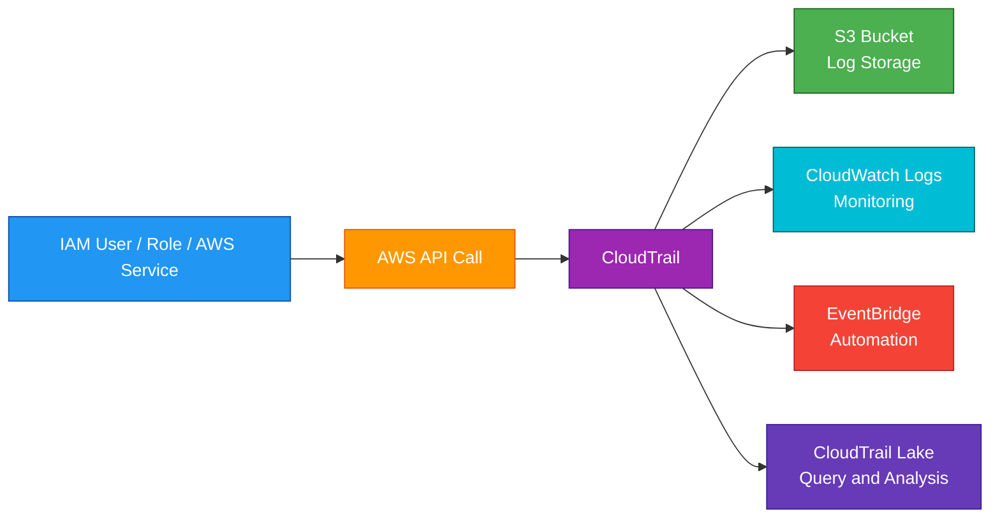
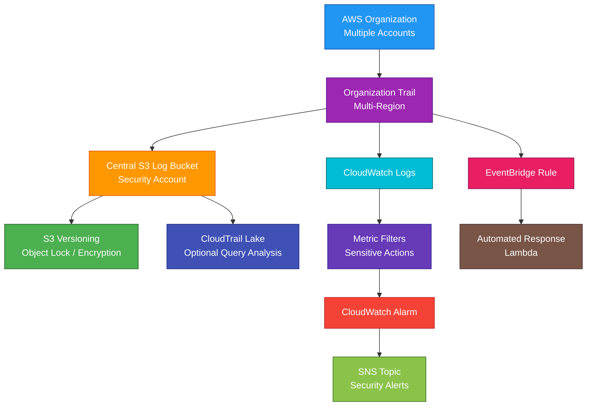

# CloudTrail

## 1. Definition

### Simple Definition

AWS CloudTrail is a service that records AWS account activity and API calls.

It helps you answer:

- Who did something?
- What did they do?
- When did they do it?
- From where did they do it?
- Which AWS resource was affected?

### Memory Hook

CloudTrail = Audit trail for AWS actions.

### Basic Idea

When users, roles, services, or applications make API calls in AWS, CloudTrail records those events.

## 2. What Problem Does It Solve?

### Main Problem

CloudTrail solves the problem of tracking activity inside an AWS account.

Without CloudTrail, it would be difficult to know who changed a security group, deleted a bucket, launched an EC2 instance, or modified an IAM policy.

### Without CloudTrail

You may not know:

- Who made a change
- What API call was made
- When the change happened
- Which IP address made the request
- Whether the request succeeded or failed
- Which resource was affected

### With CloudTrail

AWS records API activity and stores logs for auditing, security investigation, compliance, and troubleshooting.

### Key Benefit

CloudTrail provides visibility, accountability, and audit history for AWS account activity.

## 3. Core Use Cases

### Security Auditing

Use CloudTrail to investigate suspicious activity.

Examples:

- Unexpected IAM user creation
- Security group opened to the internet
- Root account activity
- Failed login attempts
- Unauthorized API calls

### Compliance

CloudTrail helps meet compliance requirements by keeping records of AWS activity.

Examples:

- Who accessed what
- When configuration changes happened
- Which resources were modified

### Troubleshooting

Use CloudTrail to find what changed before an issue started.

Example:

An application stopped working after someone changed an IAM role or security group.

### Operational Monitoring

CloudTrail can send events to CloudWatch Logs or EventBridge for alerts and automation.

Example:

If someone deletes a production S3 bucket, trigger an alert.

### Governance Across Accounts

With AWS Organizations, you can create an organization trail to log activity across multiple AWS accounts.

### Forensics and Incident Response

CloudTrail logs are useful during security investigations.

They help reconstruct the timeline of actions during an incident.

## 4. Important Features for SAA

### Events

An event is a record of activity in AWS.

An event can show:

- Event name
- Event time
- User or role
- Source IP address
- AWS service
- Region
- Request parameters
- Response elements
- Error codes, if any

### Management Events

Management events record control plane operations.

These are actions that manage AWS resources.

Examples:

- Create an EC2 instance
- Delete an S3 bucket
- Modify a security group
- Create an IAM user
- Attach an IAM policy

### Data Events

Data events record data plane operations.

These are actions performed on or inside resources.

Examples:

- S3 object-level activity
- Lambda function invocation activity
- DynamoDB item-level activity

Important exam point:

Data events are high-volume and are not always enabled by default.

### Network Activity Events

Network activity events can provide visibility into certain network-related activity.

For SAA, focus mainly on management events and data events unless the question specifically mentions deeper network activity auditing.

### Event History

CloudTrail Event History shows recent management events in the AWS account.

Important points:

- Useful for quick investigation
- Limited retention period
- Does not replace long-term log storage in S3

### Trail

A trail is a CloudTrail configuration that delivers events to a destination.

Common destination:

- S3 bucket

Optional integrations:

- CloudWatch Logs
- EventBridge
- CloudTrail Lake

### Single-Region Trail

A single-Region trail logs events from one AWS Region.

Use it when you only need logs from a specific Region.

### Multi-Region Trail

A multi-Region trail logs events from all AWS Regions.

Exam tip:

For most security and compliance use cases, choose a multi-Region trail.

### Organization Trail

An organization trail logs events for multiple AWS accounts in AWS Organizations.

Use it for centralized auditing across accounts.

### Global Service Events

Some AWS services are global, such as IAM.

A multi-Region trail can include global service events.

Exam tip:

IAM events are important for security auditing.

### CloudTrail Lake

CloudTrail Lake lets you store, query, and analyze CloudTrail events using SQL-like queries.

Use it when you need searchable audit data without manually managing log analysis pipelines.

### CloudTrail Insights

CloudTrail Insights detects unusual API activity patterns.

Examples:

- Sudden spike in `TerminateInstances`
- Unusual number of failed API calls
- Unexpected increase in write activity

### Log File Validation

Log file validation helps prove CloudTrail log files were not modified after delivery.

This is useful for compliance and forensic integrity.

### CloudWatch Logs Integration

CloudTrail can send logs to CloudWatch Logs.

Use this for:

- Metric filters
- Alarms
- Near real-time monitoring
- Security alerts

### EventBridge Integration

CloudTrail events can be used with EventBridge.

Use this to trigger automated responses.

Example:

If root user activity occurs, send an SNS alert.

### S3 Log Storage

CloudTrail commonly stores logs in S3.

Use S3 features to protect logs:

- Bucket policies
- Versioning
- Encryption
- Lifecycle rules
- Object Lock, if required

## 5. Security Model

### IAM Permissions

IAM controls who can create, view, update, and delete CloudTrail resources.

Common permissions:

| Permission | Purpose |
|---|---|
| `cloudtrail:CreateTrail` | Create a trail |
| `cloudtrail:StartLogging` | Start log delivery |
| `cloudtrail:StopLogging` | Stop log delivery |
| `cloudtrail:DeleteTrail` | Delete a trail |
| `cloudtrail:LookupEvents` | Search event history |
| `cloudtrail:PutEventSelectors` | Configure event logging |
| `cloudtrail:GetTrailStatus` | Check trail status |

### Least Privilege

Only trusted administrators should be able to stop logging, delete trails, or change CloudTrail settings.

Exam tip:

Denying `cloudtrail:StopLogging` and `cloudtrail:DeleteTrail` can help protect audit logs.

### S3 Bucket Policy

CloudTrail needs permission to write logs to the target S3 bucket.

The bucket policy should allow CloudTrail log delivery and restrict unauthorized access.

### Encryption at Rest

CloudTrail logs in S3 can be encrypted.

Common options:

| Option | Description |
|---|---|
| SSE-S3 | S3-managed encryption |
| SSE-KMS | KMS key-based encryption |

### KMS Key Permissions

If using SSE-KMS, the KMS key policy must allow CloudTrail to use the key for log encryption.

Users who need to read logs may also need KMS decrypt permissions.

### Encryption in Transit

CloudTrail delivers logs using encrypted transport.

AWS API access uses HTTPS.

### Log Integrity

Enable log file validation to detect whether log files were changed after CloudTrail delivered them.

### Protecting Logs

Best practices:

- Store logs in a dedicated S3 bucket
- Enable S3 versioning
- Restrict delete permissions
- Use MFA Delete or Object Lock when required
- Encrypt logs
- Send alerts if logging stops
- Use a separate security account for centralized logs

### Root User Monitoring

CloudTrail can help detect root user activity.

A common security pattern:

- CloudTrail records root activity
- EventBridge rule detects root usage
- SNS sends security alert

### Shared Responsibility

AWS is responsible for:

- CloudTrail service infrastructure
- Recording supported AWS API activity
- Log delivery service availability
- Physical security

You are responsible for:

- Enabling trails
- Choosing Regions and event types
- Protecting S3 log buckets
- Configuring KMS keys
- Restricting CloudTrail administration permissions
- Monitoring log delivery
- Reviewing and responding to events

## 6. High Availability / Durability Behavior

### Availability

CloudTrail is a managed AWS service.

AWS manages the infrastructure used to collect and deliver events.

### Regional Behavior

CloudTrail is configured per Region, but you can create a multi-Region trail.

A multi-Region trail is usually best for account-wide visibility.

### Multi-Region Behavior

A multi-Region trail records events from all enabled AWS Regions and delivers them to the configured destination.

Exam tip:

If the question says “capture activity across all Regions,” choose a multi-Region trail.

### Global Service Logging

CloudTrail can log global service events, such as IAM activity.

This is important because IAM is not tied to one Region.

### Durability of Logs

CloudTrail commonly delivers logs to S3.

S3 provides highly durable storage for log files.

### Log Delivery

CloudTrail delivers logs to the configured destination, usually S3.

For monitoring, CloudTrail can also send events to CloudWatch Logs.

### Fault Tolerance

For stronger fault tolerance and security:

- Use a multi-Region trail
- Store logs in S3
- Use cross-Region replication if needed
- Use a separate log archive account
- Enable S3 versioning or Object Lock where required

### Backup and Retention

CloudTrail itself records activity, but long-term retention depends on where you store logs.

For long-term retention, configure:

- S3 lifecycle policies
- S3 Glacier storage classes
- CloudTrail Lake retention
- Centralized log archive account

### High Availability vs Auditability

CloudTrail is not used to make applications highly available.

It is used to audit and monitor activity.

## 7. Cost Optimization Options

### Use Management Events Carefully

Management events are essential for auditing.

A basic level of management event visibility is usually needed in every account.

### Be Careful With Data Events

Data events can be high-volume.

Examples:

- S3 object reads and writes
- Lambda invocations
- DynamoDB item activity

Enable data events only for resources that truly need detailed auditing.

### Use Event Selectors

Event selectors let you choose which events are logged.

Use them to reduce unnecessary event volume.

Examples:

- Log only write events
- Log only specific S3 buckets
- Log only specific Lambda functions

### Use Advanced Event Selectors

Advanced event selectors provide more control over which events are captured.

They can help reduce cost by logging only relevant events.

### Configure S3 Lifecycle Policies

Move older CloudTrail logs to lower-cost S3 storage classes.

Examples:

- S3 Standard for recent logs
- S3 Glacier Instant Retrieval for less frequent access
- S3 Glacier Flexible Retrieval for archival
- S3 Glacier Deep Archive for long-term retention

### Set Proper Retention

Do not keep logs longer than required unless compliance demands it.

Match retention to business and regulatory requirements.

### Use CloudTrail Lake Selectively

CloudTrail Lake is useful for querying audit data, but it has storage and query costs.

Use it when you need searchable event history and analysis.

### Avoid Duplicate Trails

Multiple trails can be useful, but unnecessary duplicate trails can increase cost.

Use organization trails or centralized trails where appropriate.

### Monitor CloudWatch Logs Cost

Sending CloudTrail events to CloudWatch Logs is useful for alerts, but high log volume can increase cost.

Use filters and retention settings.

## 8. Common Exam Traps

### CloudTrail vs CloudWatch

CloudTrail records API activity.

CloudWatch monitors metrics, logs, and alarms.

Memory hook:

- CloudTrail = Who did what?
- CloudWatch = What is happening now?

### CloudTrail Is Not a Performance Monitoring Tool

CloudTrail does not monitor CPU, memory, or application latency.

Use CloudWatch for metrics and alarms.

### Management Events vs Data Events

| Event Type | Records |
|---|---|
| Management Events | Control plane actions, such as creating or deleting resources |
| Data Events | Data plane actions, such as S3 object access or Lambda invocation |

### Data Events Are Not Always Enabled by Default

If the exam asks for S3 object-level access logs, normal management events are not enough.

You need CloudTrail data events for S3 object activity.

### Multi-Region Trail for Full Visibility

A single-Region trail does not capture activity from all Regions.

For account-wide auditing, use a multi-Region trail.

### IAM Is Global

IAM events are global service events.

Make sure global service events are included when auditing IAM activity.

### CloudTrail Logs Need Protection

CloudTrail records are only useful if attackers or users cannot delete or modify them.

Use S3 bucket policies, KMS, versioning, Object Lock, and restricted IAM permissions.

### CloudTrail Does Not Block Actions

CloudTrail records actions after they happen.

It does not prevent actions by itself.

To prevent actions, use IAM policies, SCPs, permission boundaries, or service controls.

### CloudTrail Insights Is for Unusual API Activity

CloudTrail Insights does not replace normal logging.

It detects unusual patterns in API activity.

### Event History Is Limited

CloudTrail Event History is useful for recent activity, but long-term auditing requires trails, S3 storage, or CloudTrail Lake.

### Organization Trail for Multi-Account Logging

If the exam asks for centralized logging across multiple AWS accounts, think AWS Organizations with an organization trail.

### CloudTrail vs AWS Config

| Service | Main Question Answered |
|---|---|
| CloudTrail | Who made the API call? |
| AWS Config | What changed in resource configuration? |

## 9. Compare With Similar Services

### Service Comparison Table

| Service | Main Purpose | Best For | Choose When |
|---|---|---|---|
| CloudTrail | API activity auditing | Tracking user, role, and service actions | You need to know who did what in AWS |
| CloudWatch | Metrics, logs, alarms | Monitoring performance and operational health | You need metrics, dashboards, or alarms |
| AWS Config | Resource configuration tracking | Tracking configuration changes and compliance | You need resource history and compliance rules |
| GuardDuty | Threat detection | Detecting suspicious activity | You need managed security findings |
| Security Hub | Security posture aggregation | Centralizing security findings | You need one place for security alerts |
| EventBridge | Event routing and automation | Reacting to AWS events | You need automated responses to events |

### CloudTrail vs CloudWatch

| Feature | CloudTrail | CloudWatch |
|---|---|---|
| Main purpose | Audit API activity | Monitor metrics and logs |
| Answers | Who did what? | What is happening? |
| Example | User deleted an S3 bucket | EC2 CPU is 90% |
| Common use | Security and compliance | Monitoring and alerting |

### CloudTrail vs AWS Config

| Feature | CloudTrail | AWS Config |
|---|---|---|
| Main purpose | API call history | Resource configuration history |
| Focus | User/API activity | Resource state and compliance |
| Example | Who changed a security group? | What did the security group look like before and after? |
| Best together | Investigate action source | Investigate configuration change |

### CloudTrail vs GuardDuty

| Feature | CloudTrail | GuardDuty |
|---|---|---|
| Main purpose | Records activity | Detects threats |
| Analysis | You analyze logs or query them | AWS generates findings |
| Data source | API activity logs | CloudTrail, VPC Flow Logs, DNS logs, and more |
| Best for | Auditing | Threat detection |

### CloudTrail vs EventBridge

| Feature | CloudTrail | EventBridge |
|---|---|---|
| Main purpose | Record events | Route events |
| Stores audit logs | Yes | No, not primarily |
| Triggers automation | Indirectly through events | Yes |
| Common use together | CloudTrail records API calls | EventBridge reacts to selected events |

### When to Choose CloudTrail

Choose CloudTrail when:

- You need API activity history
- You need security auditing
- You need compliance logs
- You need to know who changed a resource
- You need to investigate account activity
- You need multi-account audit logging
- You need S3 object-level or Lambda invocation auditing with data events

## 10. Mini Architecture Example

### Scenario

A company wants centralized security auditing across multiple AWS accounts.

They need to record all account activity, protect logs from deletion, and send alerts for sensitive actions.

### Architecture

Use an AWS Organizations organization trail.

CloudTrail sends logs from all accounts to a central S3 bucket in a security account.

CloudWatch Logs and EventBridge are used for alerts.

### Why This Is Good

- Organization trail centralizes logs across accounts
- Multi-Region trail captures activity across Regions
- S3 stores logs durably
- Versioning, encryption, and Object Lock help protect logs
- CloudWatch alarms notify security teams
- EventBridge can trigger automated response
- CloudTrail Lake can query audit events

### Exam Answer Pattern

If the question says:

“Track who made changes in AWS and keep an audit log across accounts and Regions.”

Think:

CloudTrail multi-Region organization trail with logs stored in a protected S3 bucket.

### Final Memory Hook

CloudTrail records who did what.

CloudWatch monitors what is happening.

AWS Config tracks what changed.

GuardDuty detects suspicious activity.

Security Hub centralizes security findings.

EventBridge reacts to events.

