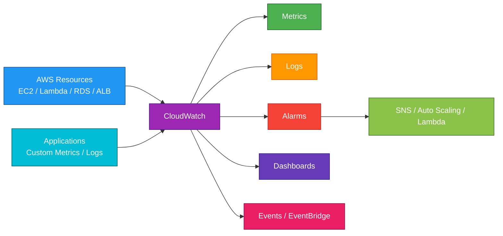
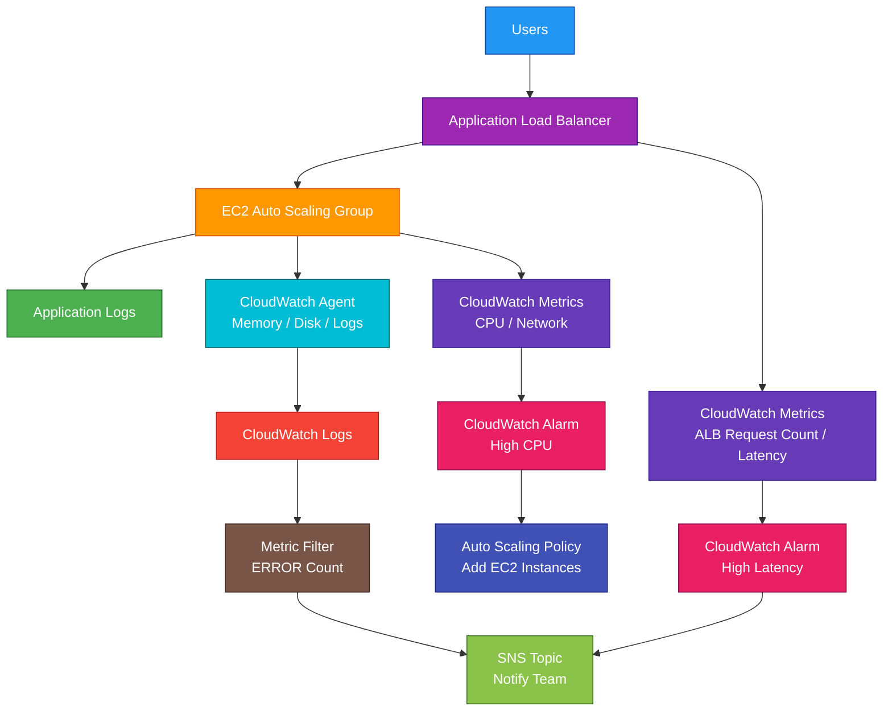

# CloudWatch

## 1. Definition

### Simple Definition

Amazon CloudWatch is AWS’s monitoring and observability service.

It collects metrics, logs, events, and alarms so you can understand what is happening in your AWS environment.

### Memory Hook

CloudWatch = Watch your cloud.

### Basic Idea

CloudWatch helps you monitor AWS resources and applications.

It can show performance data, store logs, trigger alarms, and automate responses.

## 2. What Problem Does It Solve?

### Main Problem

CloudWatch solves the problem of not knowing what is happening inside your AWS resources and applications.

It gives visibility into performance, health, logs, and operational events.

### Without CloudWatch

You may not easily know:

- Whether an EC2 instance has high CPU
- Whether Lambda functions are failing
- Whether an application is producing errors
- Whether an Auto Scaling Group needs more capacity
- Whether an alarm should notify your team
- Whether logs show application problems

### With CloudWatch

You can collect and view monitoring data from AWS services and applications in one place.

### Key Benefit

CloudWatch helps with monitoring, alerting, troubleshooting, automation, and operational visibility.

## 3. Core Use Cases

### Infrastructure Monitoring

Monitor AWS resource metrics.

Examples:

- EC2 CPU utilization
- EBS disk activity
- RDS database connections
- ALB request count
- Lambda errors and duration

### Application Logging

Send application logs to CloudWatch Logs.

Examples:

- Web server logs
- Application error logs
- Lambda logs
- Container logs

### Alerting

Create CloudWatch Alarms to notify you when something crosses a threshold.

Example:

Send an SNS alert when EC2 CPU is above 80%.

### Auto Scaling

CloudWatch metrics and alarms can trigger Auto Scaling actions.

Example:

Scale out EC2 instances when CPU usage is high.

### Dashboards

Create dashboards to visualize important metrics.

Examples:

- API latency
- Error rates
- Database load
- Request volume

### Troubleshooting

Use logs, metrics, and alarms to investigate failures.

Example:

Check Lambda logs after an API Gateway error.

### Event-Driven Automation

CloudWatch Events has largely become part of Amazon EventBridge.

Use EventBridge rules to react to AWS service events.

Example:

Trigger Lambda when an EC2 instance changes state.

## 4. Important Features for SAA

### Metrics

Metrics are numerical data points over time.

Examples:

| Metric | Service |
|---|---|
| CPUUtilization | EC2 |
| Invocations | Lambda |
| Duration | Lambda |
| DatabaseConnections | RDS |
| RequestCount | ALB |
| HealthyHostCount | ELB |

### Namespace

A namespace is a container for CloudWatch metrics.

Examples:

| Namespace | Service |
|---|---|
| `AWS/EC2` | EC2 metrics |
| `AWS/Lambda` | Lambda metrics |
| `AWS/RDS` | RDS metrics |
| `AWS/ApplicationELB` | Application Load Balancer metrics |

### Dimensions

Dimensions are key-value pairs that identify a metric.

Example:

An EC2 CPU metric can have a dimension for a specific instance ID.

### Standard Monitoring

For EC2, standard monitoring sends metrics every 5 minutes.

This is the default.

### Detailed Monitoring

Detailed monitoring sends EC2 metrics every 1 minute.

Use it when you need more granular monitoring data.

### Custom Metrics

Applications can publish custom metrics to CloudWatch.

Examples:

- Number of active users
- Shopping cart checkout failures
- Business transaction count
- Queue processing time

### High-Resolution Metrics

High-resolution custom metrics can be recorded at intervals as short as 1 second.

Use them when near real-time metric detail is required.

### CloudWatch Alarms

CloudWatch Alarms watch a metric and perform an action when a threshold is reached.

Alarm actions can include:

- Send SNS notification
- Trigger Auto Scaling action
- Stop, terminate, reboot, or recover EC2 instance
- Trigger automation through EventBridge or other services

### Alarm States

CloudWatch Alarms have three main states.

| State | Meaning |
|---|---|
| `OK` | Metric is within the defined threshold |
| `ALARM` | Metric breached the threshold |
| `INSUFFICIENT_DATA` | Not enough data to evaluate |

### Composite Alarms

Composite alarms combine multiple alarms into one alarm.

Use them to reduce alarm noise.

Example:

Only alert if CPU is high and application error rate is also high.

### CloudWatch Logs

CloudWatch Logs stores log data from AWS services and applications.

Common sources:

- Lambda
- EC2 applications
- ECS containers
- API Gateway
- Route 53 Resolver query logs
- VPC Flow Logs

### Log Groups

A log group is a collection of related logs.

Example:

A Lambda function usually has a log group like:

`/aws/lambda/my-function`

### Log Streams

A log stream is a sequence of log events from the same source.

Example:

Each Lambda execution environment can create a separate log stream.

### Metric Filters

Metric filters search logs for patterns and turn matching log entries into CloudWatch metrics.

Example:

Count how many times the word `ERROR` appears in application logs.

### Subscription Filters

Subscription filters send log events to another destination.

Common destinations:

- Lambda
- Kinesis Data Streams
- Kinesis Data Firehose
- OpenSearch

### CloudWatch Logs Insights

CloudWatch Logs Insights lets you query and analyze logs.

Use it to search, filter, aggregate, and troubleshoot log data.

### CloudWatch Dashboards

Dashboards show metrics and alarms in a visual format.

Use dashboards for operational visibility.

### CloudWatch Agent

The CloudWatch Agent collects additional system-level metrics and logs from EC2 and on-premises servers.

Important exam point:

By default, EC2 does not send memory usage or disk usage metrics to CloudWatch.

Use the CloudWatch Agent for memory and disk metrics.

### Container Insights

Container Insights collects metrics and logs from containerized workloads.

Common services:

- ECS
- EKS
- Kubernetes

### Lambda Insights

Lambda Insights provides deeper monitoring for Lambda functions.

It helps analyze performance, memory, CPU, and cold start behavior.

### Application Insights

Application Insights helps monitor applications and detect common problems.

It is useful for application-level observability.

### Synthetics Canaries

CloudWatch Synthetics uses canaries to monitor endpoints and user journeys.

Example:

A canary checks every minute that a login page is working.

## 5. Security Model

### IAM Permissions

IAM controls who can view, create, update, and delete CloudWatch resources.

Common permissions:

| Permission | Purpose |
|---|---|
| `cloudwatch:GetMetricData` | Retrieve metric data |
| `cloudwatch:PutMetricData` | Publish custom metrics |
| `cloudwatch:PutMetricAlarm` | Create or update alarms |
| `logs:CreateLogGroup` | Create log groups |
| `logs:PutLogEvents` | Write log events |
| `logs:FilterLogEvents` | Search log events |
| `logs:StartQuery` | Start Logs Insights queries |

### Service Roles

Some AWS services need permissions to send logs or metrics to CloudWatch.

Examples:

- API Gateway logging role
- VPC Flow Logs role
- CloudWatch Agent role on EC2

### CloudWatch Agent Permissions

EC2 instances need an IAM role with permissions to publish metrics and logs.

Common policy:

- `CloudWatchAgentServerPolicy`

### Encryption at Rest

CloudWatch Logs are encrypted at rest.

You can use:

- AWS managed encryption
- Customer managed KMS keys for log groups

### Encryption in Transit

CloudWatch API calls use HTTPS.

Applications and agents send data securely to CloudWatch endpoints.

### Log Data Protection

CloudWatch Logs can contain sensitive data.

Best practices:

- Avoid logging secrets
- Avoid logging passwords
- Restrict log access with IAM
- Use KMS encryption where required
- Set proper retention periods

### Network and Security Controls

CloudWatch is a public regional AWS service endpoint.

For private access from a VPC, use VPC interface endpoints where supported.

### Shared Responsibility

AWS is responsible for:

- CloudWatch service infrastructure
- Service availability
- Physical security
- Managed service operations

You are responsible for:

- IAM permissions
- Alarm configuration
- Log retention
- Log encryption settings
- Protecting sensitive log data
- Installing and configuring agents
- Monitoring and responding to alerts

## 6. High Availability / Durability Behavior

### Availability

CloudWatch is a fully managed AWS service.

AWS manages the infrastructure for collecting and storing metrics and logs.

### Regional Behavior

CloudWatch is regional.

Metrics, logs, and alarms are usually stored and managed in the Region where the resource exists.

### Multi-AZ Behavior

CloudWatch itself is managed by AWS and does not require you to configure Multi-AZ.

However, you can monitor resources across multiple Availability Zones.

### Multi-Region Behavior

CloudWatch data is regional.

For Multi-Region monitoring, you may need dashboards, alarms, or observability tools that view data across Regions.

### Metrics Durability

CloudWatch stores metric data for a limited retention period depending on the metric resolution and age.

For SAA, remember that CloudWatch is used for monitoring data, not long-term data archiving.

### Logs Durability

CloudWatch Logs stores log events until the configured retention period expires.

If no retention period is set, logs may be kept indefinitely, which can increase cost.

### Log Retention

You can configure log retention periods.

Examples:

- 1 day
- 7 days
- 30 days
- 90 days
- 1 year
- Never expire

### Alarm Reliability

CloudWatch Alarms continuously evaluate metrics based on the configured period and threshold.

If the alarm enters `ALARM` state, it can trigger actions such as SNS notifications or Auto Scaling.

### Monitoring Is Not High Availability

CloudWatch helps detect problems.

It does not automatically make an application highly available unless paired with actions like Auto Scaling, alarms, or automation.

## 7. Cost Optimization Options

### Set Log Retention Periods

Do not keep logs forever unless required.

Set retention periods based on business and compliance needs.

This is one of the most important CloudWatch cost controls.

### Reduce Unnecessary Custom Metrics

Custom metrics can add cost.

Only publish metrics that are useful for monitoring, alerting, or troubleshooting.

### Be Careful With High-Resolution Metrics

High-resolution metrics provide more detail but can cost more.

Use them only when you need second-level visibility.

### Control Detailed Monitoring

Detailed EC2 monitoring provides 1-minute metrics but adds cost.

Use it for production or important workloads, not every instance automatically.

### Reduce Verbose Logging

High log volume can increase CloudWatch Logs cost.

Use appropriate log levels.

Examples:

- Use `ERROR` and `WARN` for production alerts
- Avoid excessive `DEBUG` logs in production

### Use Metric Filters Selectively

Metric filters are useful but should focus on important log patterns.

Example:

Track `ERROR`, `Timeout`, or `AccessDenied`.

### Export Logs to S3 for Long-Term Storage

For long-term log retention, export or stream logs to S3 and use lower-cost S3 storage classes.

### Use Dashboards Wisely

CloudWatch dashboards can add cost.

Create dashboards that provide real operational value.

### Monitor Alarm Count

Too many unnecessary alarms can increase cost and create alert fatigue.

Use composite alarms to reduce noise.

### Use Log Subscription Pipelines Carefully

Streaming logs to Lambda, Kinesis, Firehose, or OpenSearch can create additional downstream costs.

## 8. Common Exam Traps

### CloudWatch vs CloudTrail

CloudWatch monitors metrics, logs, alarms, and operational health.

CloudTrail records AWS API activity.

Memory hook:

- CloudWatch = What is happening?
- CloudTrail = Who did what?

### CloudWatch Does Not Track API History Like CloudTrail

If the question asks who deleted an S3 bucket or changed a security group, choose CloudTrail.

If the question asks about CPU usage, logs, alarms, or metrics, choose CloudWatch.

### EC2 Memory Is Not Collected by Default

Default EC2 metrics include CPU, network, and disk activity.

Memory usage requires the CloudWatch Agent.

### EC2 Disk Usage Is Not the Same as EBS Metrics

CloudWatch can show EBS volume metrics, but operating system disk space usage requires the CloudWatch Agent.

### Standard vs Detailed Monitoring

| Monitoring Type | EC2 Metric Frequency |
|---|---|
| Standard Monitoring | 5 minutes |
| Detailed Monitoring | 1 minute |

### Logs Are Not Metrics by Default

CloudWatch Logs store log events.

To create metrics from logs, use metric filters.

### Alarm Actions Need Targets

A CloudWatch Alarm can notify or act only when configured with an action, such as SNS or Auto Scaling.

### `INSUFFICIENT_DATA` Is Not Always a Failure

`INSUFFICIENT_DATA` means CloudWatch does not have enough data to evaluate the alarm.

This can happen when metrics are missing or newly created.

### CloudWatch Events vs EventBridge

CloudWatch Events has evolved into Amazon EventBridge.

For event routing and automation, EventBridge is usually the modern answer.

### CloudWatch Is Regional

CloudWatch metrics and logs are regional.

Check the correct Region when troubleshooting missing data.

### Alarms Watch Metrics, Not Raw Logs

CloudWatch Alarms evaluate metrics.

To alarm on log text, create a metric filter from the logs first.

### CloudWatch Is Not a SIEM by Itself

CloudWatch helps monitor and collect logs, but for advanced security findings and threat detection, use services like GuardDuty, Security Hub, and CloudTrail with analysis tools.

## 9. Compare With Similar Services

### Service Comparison Table

| Service | Main Purpose | Best For | Choose When |
|---|---|---|---|
| CloudWatch | Monitoring and observability | Metrics, logs, alarms, dashboards | You need to monitor AWS resources or applications |
| CloudTrail | API activity auditing | Tracking who did what | You need audit logs of AWS API calls |
| AWS Config | Resource configuration tracking | Compliance and configuration history | You need to know how resources changed |
| EventBridge | Event routing | Event-driven automation | You need to react to AWS or app events |
| X-Ray | Distributed tracing | Tracing requests through services | You need to debug latency across microservices |
| GuardDuty | Threat detection | Security findings | You need managed detection of suspicious activity |

### CloudWatch vs CloudTrail

| Feature | CloudWatch | CloudTrail |
|---|---|---|
| Main purpose | Monitoring | Auditing |
| Answers | What is happening? | Who did what? |
| Example | EC2 CPU is high | User stopped an EC2 instance |
| Data type | Metrics and logs | API activity events |
| Common action | Alarm and notify | Investigate account activity |

### CloudWatch vs AWS Config

| Feature | CloudWatch | AWS Config |
|---|---|---|
| Main purpose | Operational monitoring | Configuration tracking |
| Focus | Metrics, logs, alarms | Resource state and compliance |
| Example | RDS CPU is high | RDS encryption setting changed |
| Best for | Health and performance | Compliance and change history |

### CloudWatch vs X-Ray

| Feature | CloudWatch | X-Ray |
|---|---|---|
| Main purpose | Metrics and logs | Distributed tracing |
| Best for | Monitoring resource health | Finding latency in request flows |
| Example | Lambda errors increased | Which downstream call caused delay |
| Common use together | Logs and alarms | Trace request path |

### CloudWatch vs EventBridge

| Feature | CloudWatch | EventBridge |
|---|---|---|
| Main purpose | Monitoring and alarms | Event routing |
| Data | Metrics and logs | Events |
| Example | CPU alarm sends SNS | EC2 state change triggers Lambda |
| Common use together | Alarm detects problem | EventBridge automates response |

### When to Choose CloudWatch

Choose CloudWatch when:

- You need metrics
- You need logs
- You need alarms
- You need dashboards
- You need EC2, Lambda, RDS, or ALB monitoring
- You need to trigger Auto Scaling from metrics
- You need to troubleshoot application behavior
- You need to monitor operational health

## 10. Mini Architecture Example

### Scenario

A company runs a web application on EC2 behind an Application Load Balancer.

They want to monitor performance, detect errors, and automatically scale when traffic increases.

### Architecture

CloudWatch collects metrics from EC2, ALB, and application logs.

CloudWatch Alarms send notifications and trigger Auto Scaling.

### Why This Is Good

- CloudWatch collects infrastructure metrics
- CloudWatch Agent collects memory, disk, and application logs
- Alarms notify the team when problems occur
- Auto Scaling responds to high demand
- Metric filters turn log errors into metrics
- Dashboards can show overall application health

### Exam Answer Pattern

If the question says:

“Monitor AWS resources, collect logs, create alarms, and trigger notifications or scaling actions.”

Think:

Amazon CloudWatch.

### Final Memory Hook

CloudWatch monitors what is happening.

CloudTrail records who did what.

AWS Config tracks what changed.

X-Ray traces where requests are slow.

EventBridge reacts to events.

SNS sends notifications.

