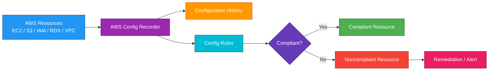
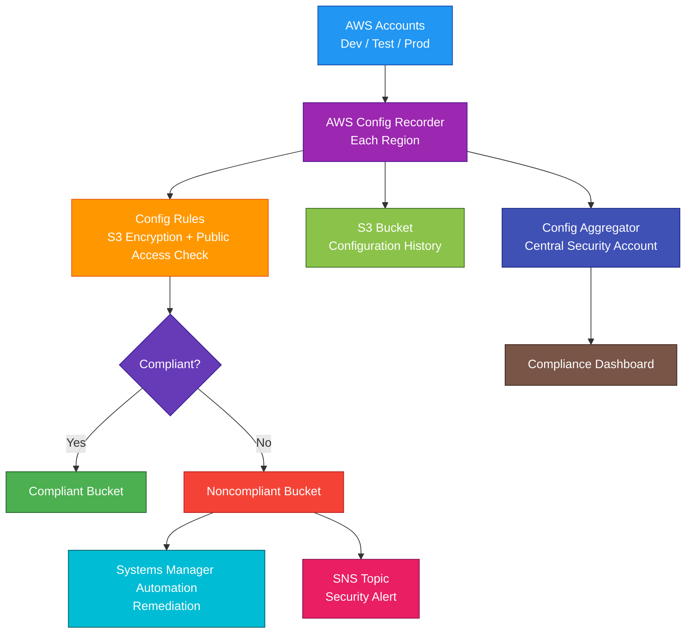

# AWS Config

## 1. Definition

### Simple Definition

AWS Config is a service that records the configuration of your AWS resources and tracks how those configurations change over time.

It helps you answer:

- What resources do I have?
- How are they configured?
- When did the configuration change?
- Is the resource compliant with my rules?

### Memory Hook

AWS Config = Tracks what changed.

### Basic Idea

AWS Config continuously records resource configuration details and evaluates them against rules.

## 2. What Problem Does It Solve?

### Main Problem

AWS Config solves the problem of tracking resource configuration changes and checking whether resources follow compliance rules.

### Without AWS Config

You may not easily know:

- What changed in a resource
- When the configuration changed
- Whether a resource is compliant
- Whether security settings were modified
- What a resource looked like in the past
- Which resources are related to each other

### With AWS Config

AWS Config records resource configuration history and evaluates resources against rules.

### Key Benefit

AWS Config gives you configuration visibility, compliance checking, and change history.

## 3. Core Use Cases

### Compliance Monitoring

Use AWS Config to check whether resources follow required rules.

Examples:

- S3 buckets should not be public
- EBS volumes should be encrypted
- Security groups should not allow SSH from `0.0.0.0/0`
- RDS databases should have backups enabled

### Configuration Change Tracking

AWS Config records changes to resource configurations.

Example:

A security group was changed to allow public SSH access.

AWS Config can show what changed and when.

### Security Auditing

Use AWS Config to detect risky configurations.

Examples:

- Public S3 buckets
- Unencrypted databases
- Open security groups
- Disabled CloudTrail logging

### Troubleshooting

Use AWS Config to investigate what changed before an issue happened.

Example:

An application stopped working after a route table or security group was modified.

### Resource Inventory

AWS Config can help you view resources and their relationships.

Example:

See which EC2 instance uses which security group, subnet, and EBS volume.

### Multi-Account Governance

Use AWS Config Aggregators to collect compliance and configuration data across multiple accounts and Regions.

### Automated Remediation

AWS Config can trigger remediation actions when resources are noncompliant.

Example:

Automatically enable S3 bucket encryption when it is missing.

## 4. Important Features for SAA

### Configuration Recorder

The configuration recorder records supported AWS resource configurations.

It tracks:

- Resource configuration
- Configuration changes
- Resource relationships
- Configuration history

### Configuration Item

A configuration item is a point-in-time record of a resource configuration.

It includes details such as:

- Resource type
- Resource ID
- Configuration data
- Relationships
- Time of change

### Configuration History

Configuration history shows how a resource changed over time.

This is useful for auditing and troubleshooting.

### Configuration Snapshot

A configuration snapshot is a point-in-time collection of recorded resource configurations.

It gives a full view of resources at a specific time.

### Delivery Channel

The delivery channel defines where AWS Config sends configuration data.

Common destinations:

- S3 bucket
- SNS topic for notifications

### AWS Config Rules

Config rules evaluate resources for compliance.

A rule checks whether a resource matches a desired configuration.

Example:

Check whether all EBS volumes are encrypted.

### Managed Rules

Managed rules are prebuilt rules created by AWS.

Examples:

| Managed Rule | Checks |
|---|---|
| `s3-bucket-public-read-prohibited` | S3 bucket should not allow public read |
| `encrypted-volumes` | EBS volumes should be encrypted |
| `restricted-ssh` | Security groups should not allow unrestricted SSH |
| `cloudtrail-enabled` | CloudTrail should be enabled |

### Custom Rules

Custom rules use AWS Lambda to define your own compliance logic.

Use custom rules when AWS managed rules do not meet your requirements.

### Rule Trigger Types

Rules can evaluate resources when:

- A configuration change happens
- A scheduled interval occurs
- Both change-based and periodic checks are needed

### Compliance Status

AWS Config marks resources as:

| Status | Meaning |
|---|---|
| Compliant | Resource follows the rule |
| Noncompliant | Resource violates the rule |
| Not Applicable | Rule does not apply to the resource |
| Insufficient Data | AWS Config cannot evaluate yet |

### Conformance Packs

Conformance packs are collections of Config rules and remediation actions.

Use them to deploy compliance standards across accounts and Regions.

Examples:

- Security best practices pack
- PCI compliance pack
- Operational best practices pack

### Aggregators

Aggregators collect AWS Config data from multiple accounts and Regions.

Use them for centralized compliance dashboards.

### Advanced Queries

AWS Config advanced queries let you search resource configuration using SQL-like queries.

Example:

Find all unencrypted EBS volumes across accounts.

### Remediation

AWS Config can run remediation actions for noncompliant resources.

Common remediation target:

- AWS Systems Manager Automation document

Example:

If an S3 bucket does not have encryption enabled, automatically enable it.

### Resource Relationships

AWS Config records relationships between resources.

Example:

An EC2 instance is related to:

- Security group
- Subnet
- VPC
- EBS volume
- IAM instance profile

### Recording Frequency

AWS Config can record some resources continuously or daily.

Use daily recording where supported to reduce cost for resources that do not need immediate change tracking.

## 5. Security Model

### IAM Permissions

IAM controls who can configure and use AWS Config.

Common permissions:

| Permission | Purpose |
|---|---|
| `config:PutConfigurationRecorder` | Create or update recorder |
| `config:StartConfigurationRecorder` | Start recording |
| `config:StopConfigurationRecorder` | Stop recording |
| `config:PutConfigRule` | Create or update Config rule |
| `config:GetComplianceDetailsByConfigRule` | View compliance details |
| `config:PutRemediationConfigurations` | Configure remediation |

### Service-Linked Role

AWS Config uses a service-linked role to access resource configuration information.

This role allows AWS Config to describe resources and record their configurations.

### S3 Bucket Permissions

If AWS Config delivers data to S3, the S3 bucket policy must allow AWS Config to write objects.

Best practice:

Use a dedicated S3 bucket for configuration history and snapshots.

### SNS Permissions

AWS Config can publish notifications to SNS.

The SNS topic policy must allow AWS Config to publish messages.

### Encryption at Rest

Configuration history stored in S3 can be encrypted.

Common options:

| Option | Description |
|---|---|
| SSE-S3 | S3-managed encryption |
| SSE-KMS | KMS key-based encryption |

### KMS Key Permissions

If using SSE-KMS, make sure AWS Config and authorized users have the required KMS permissions.

Without correct KMS permissions, delivery or reading of configuration data can fail.

### Encryption in Transit

AWS Config API calls use HTTPS.

Data sent to AWS service endpoints is encrypted in transit.

### Remediation Security

Automated remediation actions need IAM permissions.

Use least privilege for remediation roles.

Example:

A remediation role that enables S3 encryption should not have broad administrator access.

### Shared Responsibility

AWS is responsible for:

- AWS Config managed service infrastructure
- Service availability
- Recording supported resource configuration data
- Physical security

You are responsible for:

- Enabling AWS Config
- Choosing resource types to record
- Creating rules
- Protecting S3 delivery buckets
- KMS key permissions
- Remediation permissions
- Monitoring compliance results
- Responding to noncompliant resources

## 6. High Availability / Durability Behavior

### Availability

AWS Config is a managed regional service.

AWS manages the infrastructure used to record and evaluate resource configurations.

### Regional Behavior

AWS Config is regional.

You must enable it in each Region where you want to track resources.

### Multi-Region Behavior

For multi-Region visibility, enable AWS Config in multiple Regions and use an aggregator.

Exam tip:

If the question says “track compliance across multiple Regions,” think AWS Config Aggregator.

### Multi-Account Behavior

For multi-account visibility, use AWS Organizations with AWS Config Aggregators.

This helps centralize compliance data across many accounts.

### Durability

AWS Config can deliver configuration history and snapshots to S3.

S3 provides durable storage for long-term configuration records.

### Global Resources

Some AWS resources are global, such as IAM resources.

For exam purposes, remember:

- AWS Config is regional
- Some global resource types can be recorded
- Multi-account and multi-Region governance usually uses aggregators

### Fault Tolerance

AWS Config is managed by AWS.

You do not manage servers, clusters, or replication for AWS Config itself.

### Compliance Evaluation

AWS Config evaluates compliance based on configured rules.

If a resource becomes noncompliant, AWS Config can show the noncompliant status and optionally trigger remediation.

### AWS Config Is Not Backup

AWS Config records configuration history.

It does not back up application data or restore full resources like AWS Backup.

## 7. Cost Optimization Options

### Record Only Needed Resource Types

AWS Config charges can increase based on the number of configuration items recorded.

To reduce cost, record only the resource types you need.

### Use Daily Recording Where Supported

Some resources can be recorded daily instead of continuously.

Daily recording can reduce cost for resources that do not need immediate change tracking.

### Avoid Unnecessary Rules

Config rules can create evaluation costs.

Use rules that support real compliance or security requirements.

### Use Managed Rules When Possible

Managed rules reduce custom development and maintenance effort.

Use custom Lambda rules only when managed rules do not meet your needs.

### Scope Rules Carefully

Apply rules only to relevant resources.

Example:

Do not evaluate every resource if only production resources need the rule.

### Use Tags for Targeting

Use tags to focus rules and compliance checks.

Example:

Only evaluate resources tagged:

| Tag Key | Tag Value |
|---|---|
| `Environment` | `Production` |

### Be Careful With High-Churn Resources

Resources that change frequently can create many configuration items.

High-churn environments may increase AWS Config cost.

### Manage S3 Storage Costs

Configuration history and snapshots stored in S3 can grow over time.

Use S3 lifecycle policies to move older data to lower-cost storage classes.

### Avoid Duplicate Recording Strategies

If using organization-wide governance, avoid unnecessary duplicate Config setups that record the same data in multiple ways.

### Monitor Rule and Recorder Usage

Review:

- Number of configuration items
- Number of rule evaluations
- Number of Regions enabled
- S3 storage growth
- Aggregator scope

## 8. Common Exam Traps

### AWS Config vs CloudTrail

AWS Config tracks resource configuration and compliance.

CloudTrail records API activity.

Memory hook:

- AWS Config = What changed?
- CloudTrail = Who did it?

### AWS Config Does Not Prevent Changes

AWS Config detects and evaluates changes.

It does not block changes before they happen.

To prevent actions, use:

- IAM policies
- Service Control Policies
- Permission boundaries
- Resource policies

### AWS Config Is Not a Monitoring Metrics Service

AWS Config does not monitor CPU, memory, latency, or request count.

Use CloudWatch for metrics and alarms.

### AWS Config Is Not a Backup Service

AWS Config stores configuration history, not full data backups.

Use AWS Backup for backup and restore.

### Noncompliant Does Not Always Mean Broken

A noncompliant resource violates a rule.

It does not always mean the resource is unavailable or malfunctioning.

### Managed Rules vs Custom Rules

Use managed rules when AWS already provides the compliance check.

Use custom Lambda rules for special business logic.

### Aggregator Does Not Record by Itself

An aggregator collects data from accounts and Regions.

AWS Config still needs to be enabled in the source accounts and Regions.

### Regional Service Trap

AWS Config is regional.

For full coverage, enable it in all required Regions.

### Remediation Needs Permissions

Automated remediation will fail if the remediation role does not have proper permissions.

### Config History vs CloudTrail History

| Question | Service |
|---|---|
| Who changed the security group? | CloudTrail |
| What did the security group look like before and after? | AWS Config |
| Is the security group compliant now? | AWS Config |

### Compliance Packs Are Groups of Rules

Conformance packs are not separate security scanners.

They package rules and remediation actions for easier governance.

## 9. Compare With Similar Services

### Service Comparison Table

| Service | Main Purpose | Best For | Choose When |
|---|---|---|---|
| AWS Config | Configuration tracking and compliance | Resource history and compliance rules | You need to know what changed and whether resources are compliant |
| CloudTrail | API activity auditing | Tracking who made AWS API calls | You need to know who did what |
| CloudWatch | Monitoring and alarms | Metrics, logs, and operational alerts | You need to monitor performance or trigger alarms |
| AWS Backup | Backup and restore | Data protection and recovery | You need recoverable backups |
| Security Hub | Security findings aggregation | Central security posture view | You need to aggregate security findings |
| GuardDuty | Threat detection | Suspicious activity detection | You need managed threat detection |

### AWS Config vs CloudTrail

| Feature | AWS Config | CloudTrail |
|---|---|---|
| Main purpose | Configuration and compliance | API audit history |
| Answers | What changed? | Who did what? |
| Example | Security group allows SSH from anywhere | User modified security group |
| Best for | Compliance checks | Security investigations |
| Stores resource state | Yes | No, records API event |

### AWS Config vs CloudWatch

| Feature | AWS Config | CloudWatch |
|---|---|---|
| Main purpose | Resource configuration tracking | Monitoring and observability |
| Data type | Configuration items | Metrics and logs |
| Example | S3 bucket is public | Lambda error count is high |
| Best for | Compliance | Operational monitoring |

### AWS Config vs AWS Backup

| Feature | AWS Config | AWS Backup |
|---|---|---|
| Main purpose | Track configuration | Back up data/resources |
| Restore data | No | Yes |
| Compliance rules | Yes | Backup compliance available |
| Example | Check EBS encryption setting | Restore EBS volume from backup |

### AWS Config vs Security Hub

| Feature | AWS Config | Security Hub |
|---|---|---|
| Main purpose | Evaluate resource compliance | Aggregate security findings |
| Rules | Config rules | Security standards and findings |
| Best for | Configuration compliance | Security posture management |
| Common together | Provides compliance signals | Centralizes security findings |

### When to Choose AWS Config

Choose AWS Config when:

- You need configuration history
- You need compliance checks
- You need to track resource changes
- You need to evaluate resources against rules
- You need multi-account compliance visibility
- You need automated remediation for noncompliant resources
- You need to understand resource relationships

## 10. Mini Architecture Example

### Scenario

A company wants to make sure all production S3 buckets are encrypted and not publicly accessible.

They also want centralized compliance visibility across multiple AWS accounts.

### Architecture

AWS Config records S3 bucket configurations.

Config rules evaluate whether buckets are encrypted and block public access.

Noncompliant buckets trigger remediation and alerts.

An aggregator collects compliance status from multiple accounts and Regions.

### Why This Is Good

- AWS Config records bucket configuration changes
- Config rules detect noncompliant S3 buckets
- Remediation can fix some problems automatically
- SNS alerts notify the security team
- Configuration history is stored in S3
- Aggregator centralizes compliance across accounts and Regions

### Exam Answer Pattern

If the question says:

“Track resource configuration changes and evaluate resources against compliance rules.”

Think:

AWS Config.

### Final Memory Hook

AWS Config tracks what changed.

CloudTrail tracks who did it.

CloudWatch monitors what is happening.

AWS Backup restores data.

Security Hub centralizes security findings.

GuardDuty detects threats.

