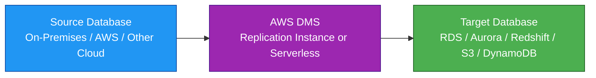
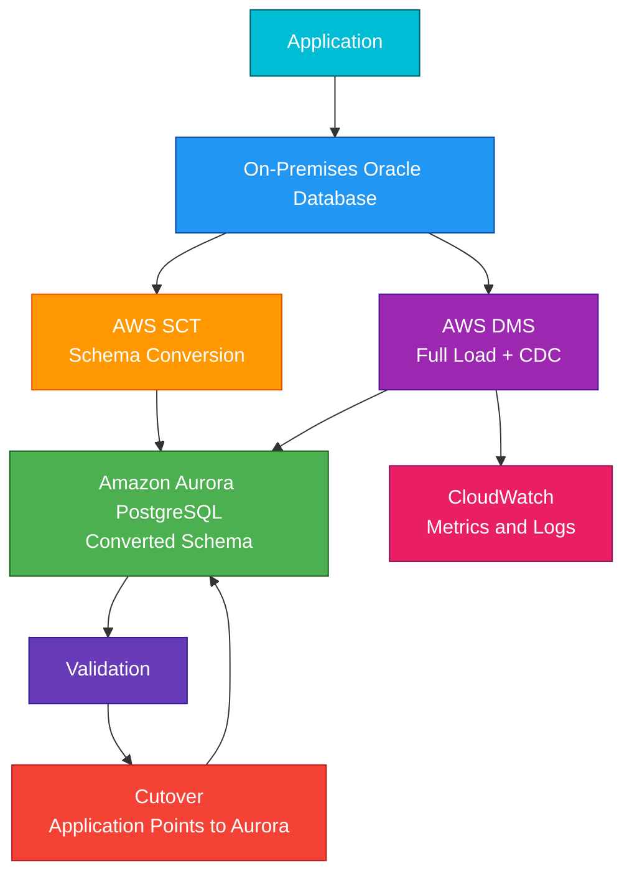

# Database Migration Service

## 1. Definition

### Simple Definition

AWS Database Migration Service, or AWS DMS, is a managed service that helps migrate databases to AWS with minimal downtime.

It can move data between databases that are the same engine or different engines.

### Memory Hook

DMS = Database Moving Service.

### Basic Idea

DMS connects to a source database, reads the data, and loads it into a target database.

It can also keep the target updated by replicating ongoing changes.

## 2. What Problem Does It Solve?

### Main Problem

DMS solves the problem of moving database data to AWS without requiring a long outage.

It is especially useful when a business wants to migrate from an on-premises database to a managed AWS database service.

### Without DMS

You may need to:

- Manually export and import data
- Take the application offline for a long time
- Build custom replication scripts
- Handle retries and failures yourself
- Manage migration servers manually
- Track ongoing source database changes yourself

### With DMS

DMS handles much of the migration and replication process.

It can perform an initial full load and then keep the target database synchronized using change data capture.

### Key Benefit

DMS helps reduce downtime during database migrations.

## 3. Core Use Cases

### On-Premises to AWS Migration

Move databases from a company data center to AWS.

Common targets:

- Amazon RDS
- Amazon Aurora
- Amazon Redshift
- Amazon S3
- Amazon DynamoDB

### Homogeneous Database Migration

Move between the same database engine.

Examples:

- Oracle to Oracle
- MySQL to MySQL
- PostgreSQL to PostgreSQL
- SQL Server to SQL Server

### Heterogeneous Database Migration

Move between different database engines.

Examples:

- Oracle to Aurora PostgreSQL
- SQL Server to Aurora MySQL
- MySQL to DynamoDB

Important exam point:

For heterogeneous migrations, use AWS Schema Conversion Tool, or SCT, to convert schema and code objects.

### Continuous Replication

Use DMS to continuously replicate changes from a source database to a target.

This is useful for:

- Minimal downtime migrations
- Reporting databases
- Data lake ingestion
- Near real-time data replication

### Database Consolidation

Move multiple source databases into a single target system.

Example:

Multiple branch databases replicate into a central AWS database.

### Data Lake Ingestion

Use DMS to replicate database data into Amazon S3.

This can support analytics with services like Athena, Glue, and Redshift Spectrum.

### Analytics Migration

Use DMS to migrate or replicate operational database data into analytics targets like Redshift or S3.

## 4. Important Features for SAA

### Source Endpoint

A source endpoint is the database or data store that DMS reads from.

Examples:

- On-premises Oracle database
- Amazon RDS MySQL
- Amazon Aurora PostgreSQL
- Microsoft SQL Server database

### Target Endpoint

A target endpoint is where DMS writes the migrated data.

Examples:

- Amazon RDS
- Amazon Aurora
- Amazon Redshift
- Amazon S3
- Amazon DynamoDB
- Amazon OpenSearch Service

### Replication Instance

A replication instance is the compute resource that runs DMS migration tasks.

It performs:

- Reading from source
- Transforming or preparing data
- Writing to target
- Running change data capture

### DMS Serverless

DMS Serverless can automatically provision and scale migration resources.

Use it when you want DMS to manage migration capacity more automatically.

### Migration Task

A migration task defines what data to move and how to move it.

It includes:

- Source endpoint
- Target endpoint
- Migration type
- Table mappings
- Transformation rules
- Replication settings

### Migration Types

DMS supports three main migration task types.

| Migration Type | Meaning | Use Case |
|---|---|---|
| Full Load | Copies existing data only | One-time migration |
| CDC Only | Replicates ongoing changes only | Keep target updated after initial load |
| Full Load + CDC | Copies existing data, then replicates changes | Minimal downtime migration |

### Full Load

Full load copies existing data from the source to the target.

This is useful for simple migrations where downtime is acceptable or where the source is not changing much.

### Change Data Capture

Change Data Capture, or CDC, captures ongoing changes from the source database transaction logs.

CDC helps keep the target synchronized while the source database is still being used.

### Full Load Plus CDC

This is a common SAA exam pattern.

DMS first loads existing data, then continues replicating changes until you are ready to cut over.

### Cutover

Cutover is when the application stops using the old source database and starts using the new target database.

A common approach:

1. Run full load.
2. Keep CDC running.
3. Wait until replication lag is low.
4. Stop application writes briefly.
5. Let DMS catch up.
6. Point the application to the new database.

### Table Mapping

Table mapping controls which schemas, tables, and columns are migrated.

You can include, exclude, or transform selected objects.

### Transformation Rules

Transformation rules can make simple changes during migration.

Examples:

- Rename schema
- Rename table
- Rename column
- Change table prefix

### Schema Conversion Tool

AWS Schema Conversion Tool, or SCT, helps convert schema objects for heterogeneous migrations.

Examples:

- Tables
- Views
- Indexes
- Stored procedures
- Functions

Important exam point:

DMS moves data.

SCT converts schema.

### Validation

DMS can validate that data was migrated correctly.

Validation helps compare source and target data after migration.

### Replication Lag

Replication lag means the target database is behind the source database.

For minimal downtime cutover, replication lag should be very low before switching applications to the target.

### Task Monitoring

DMS integrates with CloudWatch for metrics and logs.

Important metrics include:

- Replication lag
- CPU utilization
- Memory usage
- Disk usage
- Task errors

## 5. Security Model

### IAM Permissions

IAM controls who can create and manage DMS resources.

Common permissions:

| Permission | Purpose |
|---|---|
| `dms:CreateReplicationInstance` | Create a replication instance |
| `dms:CreateEndpoint` | Create source or target endpoints |
| `dms:CreateReplicationTask` | Create migration tasks |
| `dms:StartReplicationTask` | Start a migration task |
| `dms:StopReplicationTask` | Stop a migration task |
| `dms:DeleteReplicationTask` | Delete a migration task |

### Database Credentials

DMS needs credentials to connect to source and target databases.

Best practice:

Use secure credential storage such as AWS Secrets Manager where supported.

### Network Security

DMS replication resources run inside a VPC.

They need network access to both the source and target databases.

Common requirements:

- Correct subnet group
- Correct route tables
- Security group rules
- VPN or Direct Connect for on-premises sources
- Database firewall rules allowing DMS access

### Security Groups

Security groups control traffic between DMS and databases.

Example:

Allow the DMS replication instance security group to connect to the database port.

Common ports:

| Database | Default Port |
|---|---:|
| MySQL / Aurora MySQL | 3306 |
| PostgreSQL / Aurora PostgreSQL | 5432 |
| Oracle | 1521 |
| SQL Server | 1433 |

### Encryption at Rest

DMS supports encryption at rest using AWS KMS.

This can protect replication storage and related migration resources.

### Encryption in Transit

Use SSL/TLS for database connections where supported.

This protects data moving between:

- Source database and DMS
- DMS and target database

### Least Privilege Database Users

The database user used by DMS should have only the permissions needed for the migration.

For CDC, the source user may need permissions to read transaction logs or replication changes.

### Shared Responsibility

AWS is responsible for:

- DMS managed service infrastructure
- Replication instance infrastructure
- Service availability
- Physical security
- Managed service patching

You are responsible for:

- Database credentials
- IAM permissions
- Security group rules
- VPC connectivity
- KMS key permissions
- Source and target database permissions
- Data validation
- Cutover planning

## 6. High Availability / Durability Behavior

### Availability

DMS is a managed AWS service.

You can improve migration availability by using a Multi-AZ replication instance.

### Multi-AZ Replication Instance

A Multi-AZ replication instance provides a standby replica in another Availability Zone.

If the primary replication instance fails, DMS can fail over to the standby.

### Fault Tolerance

For production migrations, Multi-AZ replication instances are recommended when migration downtime risk must be reduced.

### Replication Task Recovery

DMS tasks can often resume after interruptions, depending on task type and configuration.

For CDC migrations, DMS tracks replication progress so it can continue from a checkpoint.

### Durability

DMS is a migration and replication service, not a durable database storage service.

Your durable data should live in the source and target databases or storage services.

### Multi-Region Behavior

DMS can migrate across Regions if networking and endpoint access are configured.

However, DMS itself does not automatically create a full Multi-Region disaster recovery architecture.

### Source Database Availability

DMS does not make the source database highly available.

If the source database is down, DMS cannot read data from it.

### Target Database Availability

DMS does not make the target database highly available.

For target availability, use services and features such as:

- RDS Multi-AZ
- Aurora replicas
- DynamoDB global tables
- S3 durability
- Redshift snapshots and recovery options

### Minimal Downtime Behavior

DMS helps reduce downtime by using CDC.

The source database can continue accepting writes while DMS replicates changes to the target.

## 7. Cost Optimization Options

### Right-Size the Replication Instance

Choose a replication instance size based on:

- Source database size
- Number of tables
- Change rate
- Network throughput
- Migration time requirement

Avoid oversizing for small migrations.

### Stop or Delete Resources After Migration

After cutover and validation, stop or delete unused DMS resources.

Examples:

- Replication tasks
- Replication instances
- Test endpoints
- Temporary logs

### Use DMS Serverless for Variable Workloads

DMS Serverless can be useful when you do not want to manually size replication capacity.

It can help for migrations with variable or unpredictable capacity needs.

### Use Full Load Only When CDC Is Not Needed

CDC adds ongoing replication work.

If the source database can be offline or read-only during migration, a full load may be simpler and cheaper.

### Limit Tables and Schemas

Migrate only the data you need.

Use table mapping to exclude unnecessary schemas, tables, or columns.

### Control CloudWatch Logs

DMS logs are useful for troubleshooting but can create CloudWatch Logs cost.

Use appropriate log levels and retention periods.

### Avoid Long-Running Replication Unless Needed

Continuous replication has ongoing cost.

After migration is complete, stop CDC tasks unless they are needed for ongoing replication.

### Optimize Network Path

Poor network performance can make migrations slower and more expensive.

For large on-premises migrations, consider stable connectivity through VPN or Direct Connect.

### Clean Up Test Migrations

Test migrations often leave behind target databases, S3 objects, logs, and DMS resources.

Delete unneeded test resources after validation.

## 8. Common Exam Traps

### DMS vs SCT

DMS migrates data.

SCT converts schema.

Memory hook:

- DMS = Move the data
- SCT = Convert the structure

### DMS Does Not Automatically Convert Complex Schema

For heterogeneous migrations, DMS does not fully convert database schema, stored procedures, or application code.

Use AWS Schema Conversion Tool.

### Full Load vs CDC

| Task Type | Meaning |
|---|---|
| Full Load | Copies existing data |
| CDC | Captures ongoing changes |
| Full Load + CDC | Copies existing data and keeps target updated |

### Minimal Downtime Means Full Load Plus CDC

If the exam asks for database migration with minimal downtime, DMS with full load plus CDC is often the answer.

### DMS Is Not a Backup Service

DMS is for migration and replication.

Use AWS Backup, snapshots, or native backup tools for backup and restore.

### DMS Is Not a Query Optimization Tool

DMS does not fix poor database design or slow queries.

Use database tuning, indexing, Performance Insights, or engine-specific tools.

### Replication Lag Matters

Do not cut over while replication lag is high.

Wait until the target is caught up before switching the application.

### Network Connectivity Is Required

DMS must be able to connect to both source and target databases.

For on-premises sources, this may require:

- VPN
- Direct Connect
- Firewall rules
- Public connectivity with security controls

### Source Database Logs Matter for CDC

CDC usually depends on database transaction logs or replication logs.

If logs are not configured or retained long enough, CDC can fail.

### DMS Does Not Migrate Everything

DMS mainly migrates data.

Depending on engine and migration type, you may need separate handling for:

- Users
- Permissions
- Stored procedures
- Functions
- Triggers
- Jobs
- Application connection strings

### Homogeneous vs Heterogeneous Migration

| Migration Type | Example | Extra Tool Usually Needed |
|---|---|---|
| Homogeneous | MySQL to MySQL | Usually no SCT |
| Heterogeneous | Oracle to Aurora PostgreSQL | SCT usually needed |

### Multi-AZ DMS Helps DMS Availability

Multi-AZ for DMS protects the replication instance.

It does not automatically make the source or target database Multi-AZ.

## 9. Compare With Similar Services

### Service Comparison Table

| Service | Main Purpose | Best For | Choose When |
|---|---|---|---|
| AWS DMS | Database migration and replication | Moving database data with minimal downtime | You need full load, CDC, or database replication |
| AWS SCT | Schema conversion | Heterogeneous database migrations | You need to convert schema between database engines |
| AWS Backup | Backup and restore | Centralized backups | You need backup plans, retention, and restore points |
| RDS Read Replica | Read scaling and replication | Same-engine read scaling | You need read replicas, not migration tooling |
| DataSync | File and object transfer | Moving files to AWS | You need to migrate file systems or object data |
| Snowball | Offline bulk data transfer | Very large data migration | Network transfer is too slow or expensive |

### DMS vs SCT

| Feature | DMS | SCT |
|---|---|---|
| Main purpose | Move data | Convert schema |
| Used for | Data migration and replication | Heterogeneous database conversion |
| Example | Copy Oracle table data to Aurora | Convert Oracle schema to PostgreSQL |
| Common use together | Yes | Yes |

### DMS vs AWS Backup

| Feature | DMS | AWS Backup |
|---|---|---|
| Main purpose | Migration and replication | Backup and restore |
| Downtime reduction | Yes, with CDC | No, restore-based recovery |
| Use case | Move database to AWS | Protect resources with backups |
| Output | Target database/data store | Recovery point |

### DMS vs DataSync

| Feature | DMS | DataSync |
|---|---|---|
| Data type | Database data | Files and objects |
| Common source | Oracle, MySQL, PostgreSQL, SQL Server | NFS, SMB, HDFS, S3-compatible storage |
| Best for | Database migration | File migration |
| CDC support | Yes | No database CDC |

### DMS vs RDS Read Replica

| Feature | DMS | RDS Read Replica |
|---|---|---|
| Main purpose | Migration/replication tool | Database read scaling |
| Engine flexibility | Can support heterogeneous targets | Usually same engine family |
| Common use | Move data to new target | Scale reads or DR |
| Schema conversion | No, use SCT | Not applicable |

### When to Choose DMS

Choose DMS when:

- You need to migrate database data to AWS
- You need minimal downtime migration
- You need full load plus CDC
- You need ongoing replication between databases
- You need to migrate from on-premises to RDS or Aurora
- You need to replicate data into S3 or Redshift for analytics
- You need homogeneous or heterogeneous database migration

## 10. Mini Architecture Example

### Scenario

A company wants to migrate an on-premises Oracle database to Amazon Aurora PostgreSQL with minimal downtime.

Because the source and target engines are different, the schema must be converted first.

### Architecture

Use AWS SCT to convert the schema.

Use AWS DMS full load plus CDC to move data and replicate ongoing changes.

After validation, cut over the application to Aurora.

### Why This Is Good

- SCT converts schema for the new database engine
- DMS performs the data migration
- CDC keeps Aurora updated while Oracle is still in use
- CloudWatch helps monitor migration progress and errors
- Validation confirms data accuracy before cutover
- Downtime is minimized during the final switch

### Exam Answer Pattern

If the question says:

“Move an on-premises database to AWS with minimal downtime and keep changes synchronized until cutover.”

Think:

AWS DMS with full load plus CDC.

If the source and target engines are different, also think:

AWS SCT for schema conversion.

### Final Memory Hook

DMS moves data.

SCT converts schema.

CDC keeps changes synchronized.

Full load copies existing data.

Cutover switches the application to the new database.

