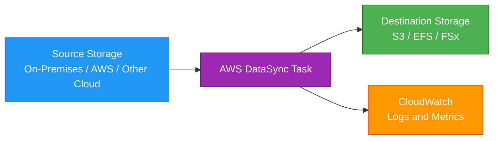
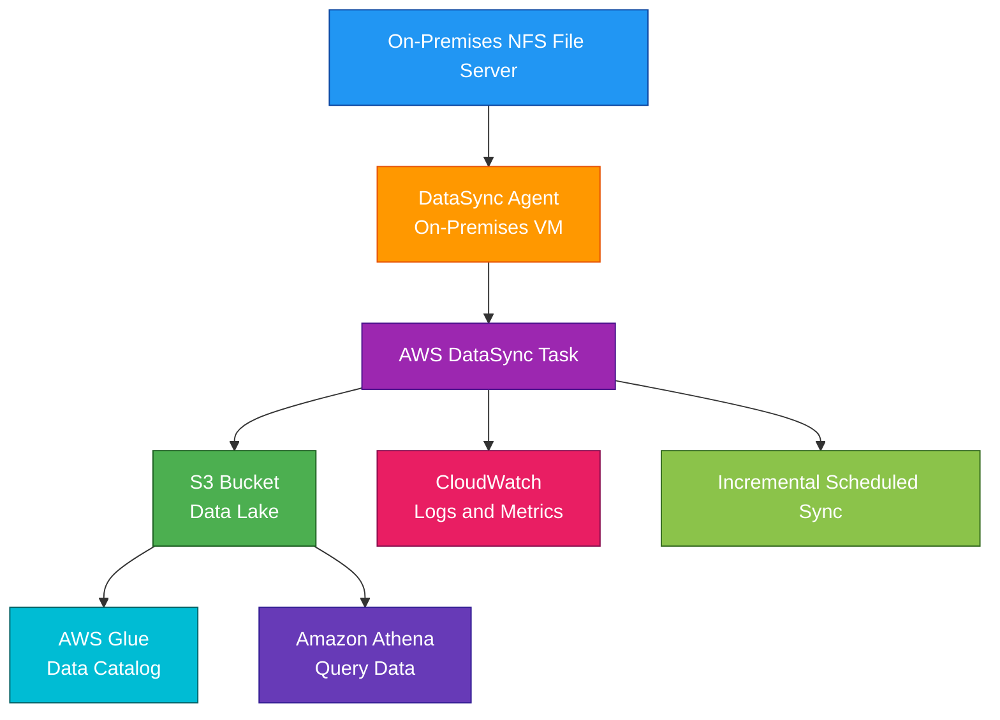

# AWS DataSync

## 1. Definition

### Simple Definition

AWS DataSync is a managed data transfer service that moves files and objects between storage systems.

It is commonly used to move data between on-premises storage and AWS storage services.

### Memory Hook

DataSync = Sync data into, out of, and across AWS.

### Basic Idea

DataSync uses an agent or service-managed connection to copy data from a source location to a destination location.

It handles transfer, encryption, scheduling, verification, and monitoring.

## 2. What Problem Does It Solve?

### Main Problem

DataSync solves the problem of moving large amounts of file or object data reliably without building custom transfer scripts.

### Without DataSync

You may need to manually handle:

- File scanning
- Data copy scripts
- Retry logic
- Encryption
- Transfer scheduling
- Bandwidth control
- Data validation
- Monitoring
- Failure handling

### With DataSync

AWS manages the data transfer workflow.

You configure the source, destination, schedule, and options.

DataSync handles the transfer process.

### Key Benefit

DataSync makes large-scale data movement faster, simpler, secure, and easier to automate.

## 3. Core Use Cases

### On-Premises to AWS Migration

Move files from on-premises storage to AWS.

Common destinations:

- Amazon S3
- Amazon EFS
- Amazon FSx

### AWS to On-Premises Transfer

Move data from AWS storage back to an on-premises environment.

This is useful for hybrid workflows.

### AWS Storage-to-Storage Transfer

Move data between AWS storage services.

Examples:

- S3 to EFS
- EFS to S3
- FSx to S3
- S3 to S3 across Regions or accounts

### Data Lake Ingestion

Move on-premises file data into S3 for analytics.

Example:

- On-premises NFS share
- DataSync transfer to S3
- Athena, Glue, or Redshift Spectrum analyzes the data

### Disaster Recovery Data Copy

Copy important file data to AWS for recovery purposes.

Example:

Replicate on-premises file shares to S3 or EFS on a schedule.

### Hybrid File Workflows

Use DataSync when applications or teams need data available both on-premises and in AWS.

### Archive to AWS

Move old file data into S3 storage classes for lower-cost long-term retention.

## 4. Important Features for SAA

### Source and Destination Locations

A location is a storage endpoint used by DataSync.

A task has:

- One source location
- One destination location

### Common Supported Locations

Common DataSync locations include:

| Location Type | Example Use |
|---|---|
| NFS | On-premises Linux file shares |
| SMB | Windows file shares |
| HDFS | Hadoop data migration |
| Object storage | S3-compatible object storage |
| Amazon S3 | Data lakes and object storage |
| Amazon EFS | Shared Linux file system |
| Amazon FSx for Windows File Server | Windows file workloads |
| Amazon FSx for Lustre | High-performance file workloads |
| Amazon FSx for NetApp ONTAP | Enterprise NAS workloads |
| Amazon FSx for OpenZFS | ZFS-based file workloads |

### DataSync Agent

A DataSync agent is used when transferring data from self-managed or on-premises storage.

The agent can run as a virtual machine in environments such as:

- VMware
- Hyper-V
- KVM
- Amazon EC2

### When an Agent Is Needed

An agent is usually needed when the source or destination is outside AWS-managed storage.

Examples:

- On-premises NFS
- On-premises SMB
- Self-managed object storage
- HDFS cluster

### When an Agent May Not Be Needed

For transfers between supported AWS storage services, DataSync can often operate without an on-premises agent.

Example:

S3 bucket to EFS file system inside AWS.

### Task

A DataSync task defines the transfer job.

It includes:

- Source location
- Destination location
- Transfer options
- Schedule
- Filtering
- Verification settings
- Bandwidth limits
- Logging options

### One-Time and Scheduled Transfers

DataSync can run:

- On demand
- On a schedule

Examples:

- One-time migration
- Hourly sync
- Daily backup copy
- Weekly archive transfer

### Incremental Transfer

After the first transfer, DataSync can copy only changed data.

This reduces transfer time and network usage.

### Data Verification

DataSync can verify that data was transferred correctly.

Verification helps ensure source and destination data match.

### Bandwidth Throttling

DataSync lets you control bandwidth usage.

Use this to avoid overwhelming network links during business hours.

### Filtering

You can include or exclude specific files, folders, or object paths.

Examples:

- Exclude temporary files
- Transfer only `/reports/*`
- Skip log files

### Metadata Preservation

DataSync can preserve metadata depending on source and destination type.

Examples:

- File permissions
- Ownership
- Timestamps
- POSIX metadata
- SMB metadata

### S3 Storage Class Selection

When transferring to S3, DataSync can write objects to a selected S3 storage class.

Examples:

- S3 Standard
- S3 Standard-IA
- S3 One Zone-IA
- S3 Glacier Instant Retrieval

### CloudWatch Integration

DataSync integrates with CloudWatch for:

- Task status
- Metrics
- Logs
- Transfer monitoring
- Troubleshooting

### DataSync Discovery

DataSync Discovery can help assess on-premises storage and plan migrations to AWS storage services.

It is useful before large storage migrations.

## 5. Security Model

### IAM Permissions

IAM controls who can create, manage, and run DataSync resources.

Common permissions:

| Permission | Purpose |
|---|---|
| `datasync:CreateTask` | Create a transfer task |
| `datasync:StartTaskExecution` | Start a transfer |
| `datasync:CreateLocationS3` | Create an S3 location |
| `datasync:CreateLocationEfs` | Create an EFS location |
| `datasync:DescribeTask` | View task details |
| `datasync:DeleteTask` | Delete a task |

### Service Roles

DataSync uses IAM roles to access AWS storage services.

Example:

For S3, DataSync needs permissions to read from or write to the bucket.

### S3 Bucket Permissions

When using S3, configure bucket policies and IAM permissions carefully.

DataSync may need permissions such as:

- `s3:ListBucket`
- `s3:GetObject`
- `s3:PutObject`
- `s3:DeleteObject`

### Network Security

For on-premises transfers, the DataSync agent needs network access to:

- Source storage
- Destination storage
- AWS DataSync service endpoints

### VPC Endpoints

You can use VPC endpoints for private connectivity to supported AWS services.

This helps keep traffic private within the AWS network.

### Encryption in Transit

DataSync encrypts data in transit between the agent and AWS.

For file protocols like NFS or SMB, protect local network access according to your environment requirements.

### Encryption at Rest

DataSync itself is a transfer service.

Encryption at rest is configured on the destination storage service.

Examples:

- S3 server-side encryption
- EFS encryption
- FSx encryption
- KMS keys where supported

### Agent Activation Security

DataSync agents must be activated before use.

Treat agent activation and access carefully because the agent connects your storage environment to AWS.

### Least Privilege

Use least-privilege IAM roles.

Give DataSync access only to the specific buckets, file systems, and paths required.

### Shared Responsibility

AWS is responsible for:

- DataSync managed service infrastructure
- Transfer service availability
- Encryption between DataSync components
- Physical security of AWS infrastructure

You are responsible for:

- IAM roles and permissions
- Source and destination access
- Network connectivity
- Storage encryption settings
- Agent deployment and security
- File permissions and metadata requirements
- Monitoring task success or failure

## 6. High Availability / Durability Behavior

### Availability

DataSync is a managed AWS service.

AWS manages the service infrastructure used to coordinate transfer tasks.

### Agent Availability

For on-premises transfers, the DataSync agent must be running and reachable.

If the agent is unavailable, transfers cannot continue.

### Task Failure Handling

If a transfer fails, DataSync can be rerun.

Because DataSync can detect already transferred data, it can avoid copying everything again.

### Incremental Sync Behavior

DataSync scans the source and destination to identify differences.

It transfers only new or changed data after the first run.

### Durability

DataSync is not durable storage.

It moves data to durable storage services.

Durability depends on the destination.

Examples:

| Destination | Durability Behavior |
|---|---|
| S3 | Highly durable object storage |
| EFS | Regional file system designed for high availability |
| FSx | Managed file systems with service-specific durability options |

### Multi-AZ Behavior

DataSync does not replace Multi-AZ storage design.

Use the destination service’s availability features.

Examples:

- EFS Standard stores data across multiple AZs
- FSx has deployment options depending on the file system type
- S3 stores objects across multiple AZs by default, except One Zone classes

### Multi-Region Behavior

DataSync can copy data between Regions when configured with source and destination locations in different Regions.

Use this for:

- Cross-Region migration
- Disaster recovery copy
- Regional data distribution

### Verification and Reliability

DataSync can verify transferred data.

This helps confirm that the destination matches the source.

### Backup vs Sync

DataSync can support backup-like workflows, but it is not a full backup management service.

For centralized backup plans and retention, use AWS Backup.

## 7. Cost Optimization Options

### Transfer Only Needed Data

Use filters to include or exclude files and paths.

This avoids transferring unnecessary data.

### Use Incremental Transfers

After the first full transfer, use incremental syncs to move only changed data.

This reduces transfer time and cost.

### Choose the Right S3 Storage Class

When sending data to S3, choose a storage class based on access needs.

| Storage Class | Best For |
|---|---|
| S3 Standard | Frequently accessed data |
| S3 Standard-IA | Infrequently accessed data |
| S3 One Zone-IA | Infrequent data that can be recreated |
| S3 Glacier Instant Retrieval | Archive data needing fast retrieval |

### Use Bandwidth Limits

Bandwidth limits help avoid network congestion.

This is especially useful for shared on-premises network links.

### Schedule Transfers During Off-Peak Hours

Run large transfers when network usage is lower.

This reduces business impact and may improve throughput.

### Avoid Repeated Full Copies

Do not manually copy the same full dataset repeatedly.

Use DataSync incremental transfer behavior.

### Clean Up Unused Agents and Tasks

Remove unused:

- DataSync agents
- Tasks
- Locations
- CloudWatch log groups
- Temporary destination data

### Manage CloudWatch Logs

Enable logs when needed, but set log retention periods to avoid long-term log storage cost.

### Use AWS Backup for Retention Policies

If the goal is backup retention and compliance, use AWS Backup rather than repeatedly copying full datasets with DataSync.

### Plan Large Migrations

For very large migrations, test with a smaller dataset first.

This helps estimate transfer time, bandwidth needs, and cost.

## 8. Common Exam Traps

### DataSync vs DMS

DataSync moves files and objects.

DMS moves database data.

Memory hook:

- DataSync = Files and objects
- DMS = Databases

### DataSync vs Storage Gateway

DataSync is for data transfer and migration.

Storage Gateway provides hybrid access to AWS storage from on-premises environments.

### DataSync Is Not a Backup Policy Service

DataSync can copy data, but it does not provide full backup governance by itself.

Use AWS Backup for centralized backup schedules, retention, compliance, and restore management.

### DataSync Is Not Real-Time Replication

DataSync is commonly used for scheduled or on-demand transfers.

If the exam asks for continuous low-latency file access or caching, Storage Gateway or another service may be more appropriate.

### Agent Requirement Trap

An agent is usually required for on-premises or self-managed storage.

AWS-to-AWS transfers may not require an on-premises agent.

### S3 Is Object Storage, Not a File System

When moving files to S3, understand that S3 stores objects.

Some file system metadata may not behave the same way as on EFS or FSx.

### EFS vs FSx Destination

Choose the right destination:

| Destination | Best For |
|---|---|
| EFS | Linux shared file system |
| FSx for Windows File Server | Windows SMB file shares |
| FSx for Lustre | High-performance computing workloads |
| S3 | Object storage, data lakes, archive |

### DataSync Does Not Make the Destination Highly Available

DataSync moves data.

The destination service determines availability and durability.

### Bandwidth Still Matters

DataSync improves and manages transfer, but it cannot ignore physical network limits.

For huge datasets with limited bandwidth, Snowball may be better.

### DataSync vs Snowball

Use DataSync when network transfer is practical.

Use Snowball when the dataset is too large or the network is too slow for online transfer.

### Permissions Can Break Transfers

Wrong IAM, bucket policies, file permissions, security groups, or network rules can cause transfer failures.

### Verification Is Important

For migrations, enable or use verification when correctness matters.

Do not assume every migration is complete without checking task results.

## 9. Compare With Similar Services

### Service Comparison Table

| Service | Main Purpose | Best For | Choose When |
|---|---|---|---|
| AWS DataSync | Online file/object transfer | Moving files between on-premises and AWS or AWS storage services | You need managed file/object migration or scheduled sync |
| AWS DMS | Database migration | Moving database data with minimal downtime | You need full load and CDC for databases |
| AWS Storage Gateway | Hybrid storage access | On-premises apps accessing AWS storage | You need ongoing hybrid storage integration |
| AWS Snowball | Offline data transfer | Very large data migration | Network transfer is too slow or impractical |
| AWS Backup | Backup management | Centralized backup and restore | You need backup plans, retention, vaults, and compliance |
| S3 Replication | S3 object replication | Replicating S3 objects between buckets | You need ongoing S3-to-S3 replication |

### DataSync vs DMS

| Feature | DataSync | DMS |
|---|---|---|
| Data type | Files and objects | Database records |
| Common source | NFS, SMB, HDFS, object storage | Oracle, MySQL, PostgreSQL, SQL Server |
| Common destination | S3, EFS, FSx | RDS, Aurora, S3, Redshift, DynamoDB |
| Change capture | Incremental file/object sync | Database CDC |
| Exam clue | File shares or object storage | Database migration |

### DataSync vs Storage Gateway

| Feature | DataSync | Storage Gateway |
|---|---|---|
| Main purpose | Transfer and migration | Hybrid storage access |
| Usage style | Scheduled or on-demand copy | Ongoing on-premises access to AWS storage |
| Best for | Moving data | Extending storage to AWS |
| Example | Migrate NFS share to S3 | On-prem app writes to file gateway |

### DataSync vs Snowball

| Feature | DataSync | Snowball |
|---|---|---|
| Transfer method | Online network transfer | Physical device transfer |
| Best for | Network-based migrations | Huge datasets or poor network |
| Speed depends on | Network bandwidth | Device shipping and local copy speed |
| Common use | Recurring syncs | Initial bulk migration |

### DataSync vs AWS Backup

| Feature | DataSync | AWS Backup |
|---|---|---|
| Main purpose | Move data | Manage backups |
| Scheduling | Transfer schedules | Backup schedules and retention |
| Restore management | Not the main focus | Yes |
| Compliance controls | Limited compared to Backup | Strong backup governance |

### DataSync vs S3 Replication

| Feature | DataSync | S3 Replication |
|---|---|---|
| Source types | Many file/object sources | S3 buckets |
| Destination types | S3, EFS, FSx, and more | S3 buckets |
| Use case | Migration or sync | Ongoing S3 object replication |
| Best for | Moving data into or across AWS storage | Keeping S3 buckets replicated |

### When to Choose DataSync

Choose DataSync when:

- You need to move file or object data
- You need online transfer to AWS
- You need migration from NFS, SMB, HDFS, or object storage
- You need to move data to S3, EFS, or FSx
- You need scheduled or incremental transfers
- You need transfer verification
- You need bandwidth control
- You need AWS-to-AWS storage transfer

## 10. Mini Architecture Example

### Scenario

A company has an on-premises NFS file server with years of business reports.

They want to move the reports to Amazon S3 so the data can be used for analytics and long-term storage.

### Architecture

Deploy a DataSync agent on-premises.

Create a source location for the NFS file share.

Create a destination location for the S3 bucket.

Run a DataSync task to transfer the files to S3.

### Why This Is Good

- DataSync avoids custom copy scripts
- Agent connects on-premises NFS storage to AWS
- S3 becomes durable storage for analytics
- Incremental sync copies only changed files after the first transfer
- CloudWatch provides transfer monitoring
- Athena can query the data in S3

### Exam Answer Pattern

If the question says:

“Move large amounts of file data from on-premises NFS or SMB storage to AWS over the network.”

Think:

AWS DataSync.

If the dataset is too large for the available network connection, think:

AWS Snowball.

### Final Memory Hook

DataSync moves files and objects.

DMS moves databases.

Storage Gateway provides hybrid storage access.

Snowball moves huge data offline.

AWS Backup manages backup and restore.

S3 Replication keeps S3 buckets copied.

