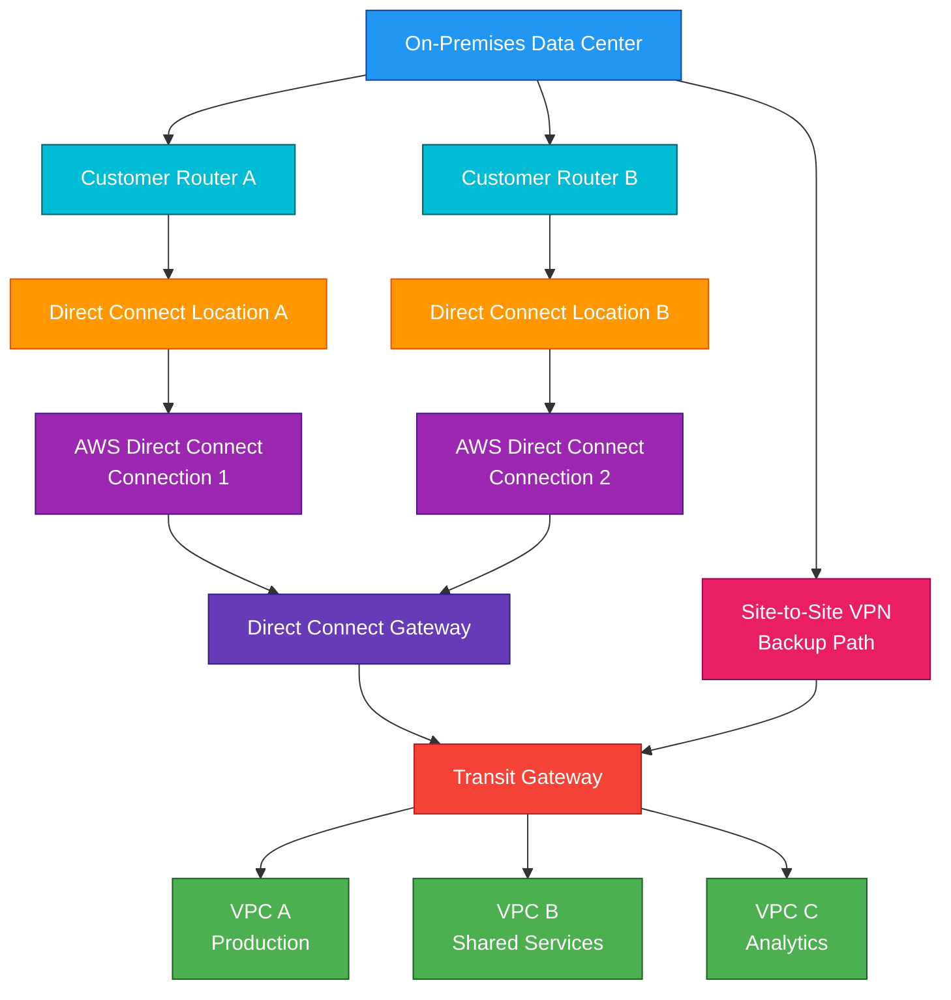

# Direct Connect

## 1. Definition

### Simple Definition

AWS Direct Connect is a dedicated private network connection between your on-premises data center, office, or colocation environment and AWS.

It bypasses the public internet and connects your network directly to AWS through a Direct Connect location.

### Memory Hook

Direct Connect = Dedicated private connection to AWS.

### Basic Idea

Instead of sending traffic from your data center to AWS over the public internet, Direct Connect provides a private, more consistent network path.

### Key Point

Direct Connect is not a VPN by itself.

It is a private physical network connection to AWS.

## 2. What Problem Does It Solve?

### Main Problem

Direct Connect solves the problem of needing reliable, private, high-bandwidth connectivity between on-premises environments and AWS.

### Without Direct Connect

Traffic usually travels over the public internet.

This can cause:

- Less predictable latency
- Less consistent bandwidth
- Internet congestion
- Higher data transfer cost in some cases
- Less control over network path

### With Direct Connect

Traffic uses a private dedicated connection to AWS.

This provides more consistent network performance.

### Key Benefit

Direct Connect is best when hybrid cloud workloads need stable, private, high-throughput connectivity to AWS.

## 3. Core Use Cases

### Hybrid Cloud Connectivity

Connect on-premises systems to AWS VPCs.

Example:

An on-premises application connects privately to databases or services running in AWS.

### Large Data Transfer

Use Direct Connect when regularly transferring large amounts of data to or from AWS.

Examples:

- Backups
- Data lake ingestion
- Media files
- Analytics datasets

### Consistent Network Performance

Use Direct Connect when applications require predictable bandwidth and latency.

Examples:

- Financial systems
- Enterprise applications
- Real-time analytics
- Hybrid workloads

### Private Access to VPCs

Use Direct Connect to connect on-premises networks to private resources in a VPC.

Examples:

- EC2 private IPs
- RDS private endpoints
- Internal load balancers
- Private applications

### Access to Public AWS Services

Direct Connect can access public AWS services using a public virtual interface.

Examples:

- Amazon S3 public endpoints
- DynamoDB public endpoints
- Public AWS APIs

### Multi-VPC Connectivity

Use Direct Connect Gateway with multiple VPCs or Transit Gateway to simplify connectivity across many VPCs.

### Backup for VPN or Primary Hybrid Link

Direct Connect can be used as a primary connection, with Site-to-Site VPN as backup.

## 4. Important Features for SAA

### Dedicated Connection

A dedicated connection is a physical Ethernet connection at an AWS Direct Connect location.

It is commonly used for enterprise-grade hybrid connectivity.

### Hosted Connection

A hosted connection is provided through an AWS Direct Connect Partner.

Use hosted connections when you do not need or cannot manage a full dedicated physical connection directly.

### Direct Connect Location

A Direct Connect location is a physical location where your network connects to AWS.

This is usually a colocation facility or partner location.

### Cross Connect

A cross connect is the physical cable connection between your router and the AWS Direct Connect router at the Direct Connect location.

### Virtual Interface

A virtual interface, or VIF, is a logical network interface over a Direct Connect connection.

There are three major types:

| VIF Type | Purpose |
|---|---|
| Private VIF | Connect to a VPC through a Virtual Private Gateway or Direct Connect Gateway |
| Public VIF | Connect to public AWS service endpoints |
| Transit VIF | Connect to a Transit Gateway through a Direct Connect Gateway |

### Private Virtual Interface

A private VIF is used to access private resources in a VPC.

Common path:

On-premises network → Direct Connect → Private VIF → Virtual Private Gateway → VPC

### Public Virtual Interface

A public VIF is used to access public AWS services over Direct Connect.

Examples:

- S3 public endpoints
- DynamoDB public endpoints
- AWS public APIs

Important exam point:

Public VIF does not mean traffic uses the public internet.

It means you are accessing public AWS IP ranges over the private Direct Connect connection.

### Transit Virtual Interface

A transit VIF connects Direct Connect to a Transit Gateway through a Direct Connect Gateway.

Use this when you need scalable connectivity to many VPCs.

### Virtual Private Gateway

A Virtual Private Gateway, or VGW, attaches to a VPC and can terminate a private VIF.

Use it for simpler Direct Connect connectivity to one or a few VPCs.

### Direct Connect Gateway

A Direct Connect Gateway allows Direct Connect connectivity to multiple VPCs across Regions.

It helps avoid creating separate Direct Connect connections for each VPC or Region.

### Transit Gateway Integration

Transit Gateway can connect many VPCs and on-premises networks through a hub-and-spoke model.

Direct Connect can connect to Transit Gateway using a transit VIF and Direct Connect Gateway.

### BGP

Direct Connect uses Border Gateway Protocol, or BGP, to exchange routes between your network and AWS.

Important BGP concepts:

- Advertise on-premises routes to AWS
- Receive AWS routes on-premises
- Control routing preference
- Support failover between multiple links

### VLANs

Virtual interfaces use VLANs to separate traffic logically over the same physical Direct Connect connection.

### Link Aggregation Group

A Link Aggregation Group, or LAG, combines multiple Direct Connect connections into one logical connection.

Use LAG for:

- More bandwidth
- Higher availability
- Operational simplicity

### MACsec

MACsec can encrypt traffic at Layer 2 on supported Direct Connect connections.

Important exam point:

Direct Connect traffic is private but not automatically encrypted by default.

Use MACsec or VPN over Direct Connect when encryption is required.

### VPN over Direct Connect

You can run an AWS Site-to-Site VPN over Direct Connect.

This provides encryption while still using the private Direct Connect path.

### Direct Connect Resiliency Toolkit

The Direct Connect Resiliency Toolkit helps design highly available Direct Connect architectures.

It provides models for different resiliency requirements.

### Connection Redundancy

For production, use redundant Direct Connect connections.

Best practice:

- Use multiple connections
- Use different Direct Connect locations if possible
- Use redundant customer routers
- Use VPN backup when needed

## 5. Security Model

### IAM Permissions

IAM controls who can create, modify, and delete Direct Connect resources.

Common permissions:

| Permission | Purpose |
|---|---|
| `directconnect:CreateConnection` | Create a Direct Connect connection |
| `directconnect:CreatePrivateVirtualInterface` | Create a private VIF |
| `directconnect:CreatePublicVirtualInterface` | Create a public VIF |
| `directconnect:CreateTransitVirtualInterface` | Create a transit VIF |
| `directconnect:CreateDirectConnectGateway` | Create a Direct Connect Gateway |
| `directconnect:DeleteConnection` | Delete a connection |

### Network Security

Direct Connect provides private connectivity, but it does not automatically provide encryption.

You still need to secure traffic using:

- Security groups
- Network ACLs
- Route tables
- Firewalls
- Encryption protocols
- VPN over Direct Connect if needed

### Encryption in Transit

Direct Connect traffic is private but not encrypted by default.

Options for encryption:

| Option | Use Case |
|---|---|
| VPN over Direct Connect | Encrypt traffic using IPsec |
| MACsec | Encrypt supported Direct Connect links at Layer 2 |
| Application TLS | Encrypt application traffic end-to-end |

### Security Groups

Security groups still control access to AWS resources inside a VPC.

Example:

Allow inbound database traffic only from on-premises CIDR ranges.

### Network ACLs

NACLs can provide subnet-level allow and deny rules.

They are stateless and apply at the subnet boundary.

### Route Control

Routing controls what traffic can pass between on-premises and AWS.

Use route tables and BGP advertisements carefully.

### Public VIF Security

Public VIF allows access to AWS public service endpoints over Direct Connect.

It does not automatically allow access to your private VPC resources.

### Shared Responsibility

AWS is responsible for:

- AWS-side Direct Connect infrastructure
- Direct Connect service availability
- AWS router infrastructure
- Physical security of AWS facilities

You are responsible for:

- Customer router configuration
- BGP configuration
- On-premises network security
- Firewall rules
- Encryption requirements
- Redundant connection design
- VPC route tables
- Security groups and NACLs

## 6. High Availability / Durability Behavior

### Availability

Direct Connect can provide highly available hybrid connectivity when designed with redundancy.

A single Direct Connect connection is not enough for high availability.

### Single Connection Risk

If you use only one Direct Connect connection, it can become a single point of failure.

Production workloads should use redundant connections.

### Redundant Connections

For high availability, use at least two Direct Connect connections.

Better designs use:

- Different physical devices
- Different Direct Connect locations
- Different customer routers
- Separate paths

### VPN Backup

A common exam pattern is Direct Connect plus Site-to-Site VPN backup.

If Direct Connect fails, VPN can carry traffic over the internet until Direct Connect is restored.

### Multi-AZ Behavior

Direct Connect itself is not deployed inside Availability Zones.

However, the AWS resources you connect to should be deployed across multiple AZs for high availability.

### Multi-Region Behavior

Direct Connect is connected through physical locations, but Direct Connect Gateway can help reach VPCs in multiple AWS Regions.

For Multi-Region application resilience, deploy workloads in multiple Regions and design routing carefully.

### Direct Connect Gateway Resilience

Direct Connect Gateway simplifies multi-Region and multi-VPC connectivity, but you still need redundant Direct Connect connections for physical path resilience.

### Transit Gateway Resilience

Transit Gateway can simplify hub-and-spoke routing across many VPCs.

Use it with redundant Direct Connect connectivity for scalable hybrid architectures.

### Durability

Direct Connect is a network connectivity service, not a storage service.

Durability applies to the data stores and applications being accessed through the connection.

### Exam Tip

Direct Connect improves network consistency, but it does not automatically make your application highly available.

You must design redundant network paths and highly available AWS resources.

## 7. Cost Optimization Options

### Use Direct Connect for Heavy Data Transfer

Direct Connect can reduce data transfer costs compared with public internet data transfer for certain high-volume workloads.

It is useful when you move large amounts of data regularly.

### Choose the Right Connection Type

Use the connection type that fits your workload.

| Option | Best For |
|---|---|
| Dedicated Connection | Large enterprise workloads and high bandwidth |
| Hosted Connection | Smaller or partner-managed connectivity needs |

### Right-Size Bandwidth

Do not overprovision connection capacity.

Choose bandwidth based on:

- Current traffic
- Growth expectations
- Peak transfer needs
- Resiliency requirements

### Use Aggregated Connectivity

Use Direct Connect Gateway or Transit Gateway to avoid building many separate connections for many VPCs.

This can simplify operations and reduce unnecessary duplication.

### Avoid Unnecessary Cross-Region Traffic

Cross-Region traffic can add cost.

Place workloads and data close to where they are used.

### Monitor Utilization

Use monitoring to check bandwidth usage.

If the connection is consistently underused, consider resizing or using a different connectivity model.

### Use VPN for Lower-Cost Small Workloads

For small, temporary, or low-bandwidth workloads, Site-to-Site VPN may be cheaper and easier than Direct Connect.

### Use S3 Transfer Options When Appropriate

For one-time large migrations, compare Direct Connect with:

- DataSync
- Snowball
- S3 Transfer Acceleration
- Internet transfer

### Avoid Idle Resources

Remove unused:

- Virtual interfaces
- Unused Direct Connect Gateways
- Unused partner-hosted connections
- Unneeded redundant test links

### Cost Tradeoff

Direct Connect has fixed connection costs, but can provide better performance and lower data transfer cost at scale.

VPN has lower setup cost but less predictable performance over the internet.

## 8. Common Exam Traps

### Direct Connect Is Not Encrypted by Default

Direct Connect uses a private connection, but traffic is not automatically encrypted.

If encryption is required, use:

- VPN over Direct Connect
- MACsec where supported
- Application-level TLS

### Direct Connect Is Not Instant

Direct Connect often takes time to provision because physical connectivity is involved.

If the exam needs immediate connectivity, Site-to-Site VPN may be better.

### Direct Connect Does Not Use the Public Internet

Direct Connect bypasses the public internet.

This is the key difference from Site-to-Site VPN.

### VPN Is Encrypted by Default

Site-to-Site VPN uses IPsec encryption.

Direct Connect does not automatically encrypt traffic.

### Public VIF Does Not Mean Public Internet

Public VIF accesses public AWS service endpoints over Direct Connect.

It does not mean traffic goes over the public internet.

### Private VIF Is for VPC Private Connectivity

Use private VIF when on-premises needs to access private resources in a VPC.

### Transit VIF Is for Transit Gateway

Use transit VIF when connecting Direct Connect to Transit Gateway through Direct Connect Gateway.

### Direct Connect Gateway Does Not Attach Directly to a VPC Resource

Direct Connect Gateway connects Direct Connect to VGWs or Transit Gateways.

It helps with multi-VPC and multi-Region connectivity.

### Direct Connect Is Not a Replacement for Security Groups

Even with Direct Connect, VPC security controls still apply.

You still need:

- Security groups
- NACLs
- Route tables
- Firewall rules

### Single Direct Connect Is a Single Point of Failure

For production workloads, use redundant Direct Connect connections and locations.

### Direct Connect Does Not Automatically Provide Internet Access

Direct Connect connects your network to AWS.

It does not automatically replace your internet connection for general internet browsing.

### Direct Connect vs VPC Peering

Direct Connect connects on-premises to AWS.

VPC Peering connects VPCs to each other.

### Direct Connect vs PrivateLink

Direct Connect provides network connectivity.

PrivateLink provides private access to specific services without exposing full network connectivity.

## 9. Compare With Similar Services

### Service Comparison Table

| Service | Main Purpose | Best For | Choose When |
|---|---|---|---|
| Direct Connect | Dedicated private network link to AWS | Stable, high-bandwidth hybrid connectivity | You need predictable private connectivity to AWS |
| Site-to-Site VPN | Encrypted VPN over internet | Quick, encrypted hybrid connectivity | You need fast setup or backup connectivity |
| Transit Gateway | Network hub | Connecting many VPCs and networks | You need scalable hub-and-spoke routing |
| VPC Peering | Private VPC-to-VPC connection | Simple connection between two VPCs | You need direct VPC connectivity |
| PrivateLink | Private service access | Accessing specific services privately | You do not want full network connectivity |
| DataSync | Data transfer service | Moving files and objects | You need managed file/object transfer |

### Direct Connect vs Site-to-Site VPN

| Feature | Direct Connect | Site-to-Site VPN |
|---|---|---|
| Network path | Private dedicated connection | Public internet |
| Encryption | Not by default | IPsec encrypted |
| Setup speed | Slower, physical setup | Faster |
| Performance | More consistent | Depends on internet path |
| Best for | High bandwidth, predictable hybrid workloads | Quick setup, encrypted backup, smaller workloads |

### Direct Connect vs Transit Gateway

| Feature | Direct Connect | Transit Gateway |
|---|---|---|
| Main purpose | Connect on-premises to AWS | Connect many networks together |
| Scope | Hybrid connectivity | Hub-and-spoke routing |
| Common use together | Yes | Yes |
| Example | Data center to AWS | Many VPCs plus VPN/DX connected centrally |

### Direct Connect vs VPC Peering

| Feature | Direct Connect | VPC Peering |
|---|---|---|
| Main purpose | On-premises to AWS connectivity | VPC-to-VPC connectivity |
| Transitive routing | Not by itself | No |
| Physical connection | Yes | No |
| Best for | Hybrid cloud | Simple VPC connection |

### Direct Connect vs PrivateLink

| Feature | Direct Connect | PrivateLink |
|---|---|---|
| Main purpose | Network connectivity to AWS | Private access to specific services |
| Access scope | Broader network routing | Specific service endpoints |
| Common use | Hybrid network extension | Secure service exposure |
| Best for | Connecting data centers to AWS | Accessing services without full VPC connectivity |

### Direct Connect vs DataSync

| Feature | Direct Connect | DataSync |
|---|---|---|
| Main purpose | Network connection | Data transfer |
| Moves data by itself | No | Yes |
| Best for | Ongoing hybrid connectivity | File/object migration or sync |
| Common use together | DataSync can use DX path | Data moves over available network |

### When to Choose Direct Connect

Choose Direct Connect when:

- You need dedicated private connectivity to AWS
- You need consistent network performance
- You transfer large amounts of data regularly
- You need stable hybrid cloud connectivity
- You want private access to VPC resources from on-premises
- You need predictable bandwidth and latency
- You are building enterprise hybrid networking

## 10. Mini Architecture Example

### Scenario

A company has an on-premises data center and several AWS VPCs.

The company needs reliable private connectivity to AWS for enterprise applications, database access, and large data transfers.

### Architecture

Use redundant Direct Connect connections to two Direct Connect locations.

Connect Direct Connect to a Direct Connect Gateway.

Attach the Direct Connect Gateway to a Transit Gateway.

Transit Gateway routes traffic to multiple VPCs.

Use Site-to-Site VPN as backup.

### Why This Is Good

- Direct Connect provides private connectivity to AWS
- Redundant connections reduce single points of failure
- Separate Direct Connect locations improve resilience
- Direct Connect Gateway simplifies multi-Region and multi-VPC access
- Transit Gateway provides hub-and-spoke VPC routing
- VPN backup provides encrypted failover connectivity
- VPC security groups and route tables still control access

### Exam Answer Pattern

If the question says:

“Connect an on-premises data center to AWS with consistent private network performance and high bandwidth.”

Think:

AWS Direct Connect.

If the question also requires encryption, think:

VPN over Direct Connect or MACsec.

If the question needs quick setup or backup, think:

Site-to-Site VPN.

### Final Memory Hook

Direct Connect is private and predictable.

VPN is encrypted and quick to set up.

Transit Gateway connects many networks.

Direct Connect Gateway extends DX to multiple VPCs and Regions.

Private VIF connects to VPCs.

Public VIF connects to public AWS services.

Transit VIF connects to Transit Gateway.

