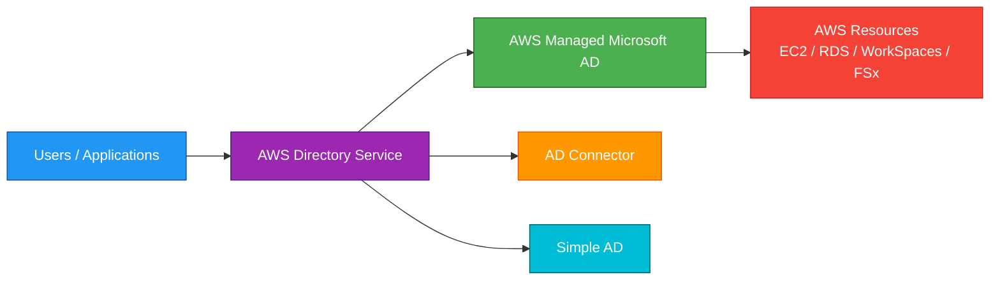
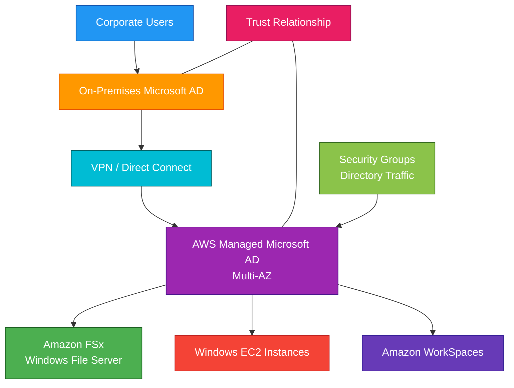

# Directory Service

## 1. Definition

### Simple Definition

AWS Directory Service is a managed service that provides Microsoft Active Directory and directory integration options in AWS.

It helps AWS resources and applications use directory-based identity, authentication, and authorization.

### Memory Hook

Directory Service = Managed Active Directory options in AWS.

### Basic Idea

Instead of building and managing all directory infrastructure yourself, AWS Directory Service can provide or connect to directory services for AWS workloads.

### Main Directory Options

AWS Directory Service includes:

| Option | Main Purpose |
|---|---|
| AWS Managed Microsoft AD | Fully managed Microsoft Active Directory in AWS |
| AD Connector | Proxy connection to existing on-premises Microsoft AD |
| Simple AD | Basic, low-cost Samba-based directory |
| Amazon Cognito | User directory for web/mobile apps, not traditional AD |

## 2. What Problem Does It Solve?

### Main Problem

Directory Service solves the problem of managing user identities, authentication, and directory integration for AWS workloads.

### Without Directory Service

You may need to:

- Deploy domain controllers manually on EC2
- Patch and maintain Active Directory servers
- Configure replication and backups
- Manage high availability yourself
- Connect AWS workloads to on-premises AD manually
- Handle identity integration for managed AWS services

### With Directory Service

AWS can manage or connect directory services for you.

This makes it easier to integrate AWS workloads with Microsoft AD-style authentication.

### Key Benefit

Directory Service helps applications and AWS services use centralized identity without manually managing all directory infrastructure.

## 3. Core Use Cases

### Windows Workloads in AWS

Use Directory Service for Windows-based applications that need domain authentication.

Examples:

- Windows EC2 domain join
- SQL Server authentication
- Group Policy support
- Kerberos authentication

### Managed Microsoft Active Directory

Use AWS Managed Microsoft AD when you need a real Microsoft Active Directory managed by AWS.

Common uses:

- Domain-joined EC2 instances
- Amazon RDS for SQL Server Windows authentication
- Amazon FSx for Windows File Server
- Amazon WorkSpaces
- Enterprise Windows applications

### Connect AWS to On-Premises AD

Use AD Connector when you already have an on-premises Microsoft AD and want AWS services to authenticate against it.

### Lightweight Directory

Use Simple AD for basic directory needs when you do not need full Microsoft AD features.

### Amazon WorkSpaces Authentication

Directory Service is commonly used with Amazon WorkSpaces to authenticate users.

### Amazon FSx for Windows File Server

FSx for Windows File Server needs Active Directory integration.

You can use AWS Managed Microsoft AD or self-managed Microsoft AD.

### Hybrid Identity

Use Directory Service to support hybrid environments where AWS resources need to work with existing enterprise identities.

## 4. Important Features for SAA

### AWS Managed Microsoft AD

AWS Managed Microsoft AD is a fully managed, real Microsoft Active Directory hosted in AWS.

Important points:

- Runs on Windows Server Active Directory
- AWS manages domain controllers
- Deployed across multiple Availability Zones
- Supports trust relationships with existing AD
- Supports Group Policy
- Supports Kerberos and LDAP
- Best option when full Microsoft AD compatibility is required

### AD Connector

AD Connector is a proxy that connects AWS services to your existing on-premises Microsoft AD.

Important points:

- Does not store user credentials in AWS
- Forwards authentication requests to on-premises AD
- Requires network connectivity to on-premises AD
- Useful when you want to keep your existing AD as the source of truth

### Simple AD

Simple AD is a low-cost, Samba-based managed directory.

Important points:

- Basic directory service
- Compatible with some Active Directory features
- Does not support advanced Microsoft AD features
- Does not support trust relationships
- Good for simple workloads and small environments

### Option Comparison

| Feature | AWS Managed Microsoft AD | AD Connector | Simple AD |
|---|---|---|---|
| Real Microsoft AD | Yes | No, proxy only | No |
| Stores users in AWS | Yes | No | Yes |
| Uses existing on-prem AD | With trust | Yes | No |
| Supports trusts | Yes | No | No |
| Best for | Full AD in AWS | Connect to existing AD | Simple low-cost directory |

### Trust Relationships

AWS Managed Microsoft AD can create trust relationships with existing Microsoft AD domains.

Use trusts when users from one domain need access to resources in another domain.

### One-Way Trust

A one-way trust allows users from one domain to access resources in another domain, depending on trust direction.

### Two-Way Trust

A two-way trust allows users from both domains to access resources in each other’s domains.

### Domain Join

Directory Service can help domain-join supported AWS resources.

Examples:

- EC2 Windows instances
- Amazon WorkSpaces
- Amazon FSx for Windows File Server

### Multi-AZ Deployment

AWS Managed Microsoft AD deploys domain controllers across multiple Availability Zones for high availability.

### Directory Size Editions

AWS Managed Microsoft AD has editions based on directory size and scale needs.

Common concept:

| Edition | Best For |
|---|---|
| Standard Edition | Small to medium environments |
| Enterprise Edition | Larger environments with more objects and workloads |

### Integration with AWS Services

Directory Service integrates with services such as:

- Amazon EC2
- Amazon RDS for SQL Server
- Amazon FSx for Windows File Server
- Amazon WorkSpaces
- Amazon QuickSight
- AWS IAM Identity Center in some identity scenarios

### LDAP and Kerberos

Directory Service supports common directory protocols depending on directory type.

Important protocols:

- LDAP
- LDAPS
- Kerberos
- DNS

### Self-Managed AD on EC2

You can also run your own Microsoft AD domain controllers on EC2.

However, this means you manage patching, backups, replication, and high availability yourself.

## 5. Security Model

### IAM Permissions

IAM controls who can create and manage Directory Service resources.

Common permissions:

| Permission | Purpose |
|---|---|
| `ds:CreateMicrosoftAD` | Create AWS Managed Microsoft AD |
| `ds:CreateDirectory` | Create Simple AD |
| `ds:ConnectDirectory` | Create AD Connector |
| `ds:DescribeDirectories` | View directory details |
| `ds:CreateTrust` | Create trust relationship |
| `ds:DeleteDirectory` | Delete directory |

### Directory Authentication

Directory Service provides authentication through directory users and groups.

Depending on the directory type, authentication may use:

- Kerberos
- LDAP
- LDAPS
- NTLM
- Existing on-premises AD credentials

### Network Security

Directory Service runs inside your VPC.

You choose:

- VPC
- Subnets
- Availability Zones
- Security group rules
- DNS settings

### Security Groups

Security groups must allow required directory traffic between clients and domain controllers.

Common directory protocols include:

| Protocol | Common Use |
|---|---|
| DNS | Name resolution |
| Kerberos | Authentication |
| LDAP / LDAPS | Directory queries |
| SMB | Windows file and domain services |
| RPC | Windows AD communication |

### Encryption in Transit

Use LDAPS when applications need encrypted LDAP communication.

For hybrid connections, protect traffic using:

- VPN
- Direct Connect with encryption if required
- Application-level encryption

### Encryption at Rest

AWS manages the underlying infrastructure for managed directories.

For services integrated with Directory Service, configure encryption on those services separately.

Examples:

- EBS encryption for EC2
- RDS encryption
- FSx encryption

### AD Connector Credential Security

AD Connector does not store user credentials in AWS.

It forwards authentication requests to your existing on-premises AD.

### Least Privilege

Use least privilege for:

- IAM permissions
- Directory administrators
- Service accounts
- Domain join permissions
- Trust permissions

### Shared Responsibility

AWS is responsible for:

- Managed directory infrastructure
- Domain controller availability for managed directories
- Physical security
- Service patching for managed directory infrastructure

You are responsible for:

- IAM permissions
- Directory users and groups
- Organizational units
- Group policies
- Security group rules
- VPC connectivity
- Trust configuration
- On-premises AD health when using AD Connector or trusts

## 6. High Availability / Durability Behavior

### Availability

AWS Managed Microsoft AD is deployed across multiple Availability Zones.

This provides high availability for directory services inside a Region.

### Multi-AZ Behavior

AWS creates domain controllers in different Availability Zones.

If one AZ has a problem, the directory can continue serving requests from another AZ.

### AD Connector Availability

AD Connector is deployed across multiple Availability Zones.

However, it depends on connectivity to your on-premises AD.

If on-premises AD or network connectivity fails, authentication can fail.

### Simple AD Availability

Simple AD is also deployed across multiple Availability Zones.

It is managed by AWS but is intended for simpler use cases.

### Multi-Region Behavior

Directory Service directories are regional.

For Multi-Region directory architecture, you must design directory deployment and connectivity across Regions.

### Trust-Based Resilience

For hybrid environments, AWS Managed Microsoft AD can trust an on-premises AD.

This allows AWS resources to use enterprise identities while still keeping AD environments separate.

### Backup and Snapshots

AWS Managed Microsoft AD supports snapshots.

Snapshots can help restore a directory to a previous state.

### Durability

Directory data is managed by AWS for managed directory options.

For exam purposes, focus on Multi-AZ deployment and managed service availability.

### Important Exam Point

Directory Service improves directory availability, but applications still need their own high-availability design.

## 7. Cost Optimization Options

### Choose the Right Directory Type

Do not use AWS Managed Microsoft AD if Simple AD or AD Connector meets the requirement.

| Requirement | Cost-Aware Choice |
|---|---|
| Full Microsoft AD features | AWS Managed Microsoft AD |
| Use existing on-prem AD | AD Connector |
| Basic low-cost directory | Simple AD |

### Use Standard Edition When Enough

For AWS Managed Microsoft AD, choose the edition that matches your size and workload needs.

Use Enterprise Edition only when you need larger scale.

### Avoid Unused Directories

Directory Service resources can create ongoing hourly charges.

Delete unused test or development directories.

### Avoid Unnecessary Trusts

Trust relationships can add operational complexity.

Use them only when cross-domain access is required.

### Use AD Connector for Existing AD

If you already have a strong on-premises AD and only need AWS services to authenticate against it, AD Connector may avoid running a separate managed AD.

### Right-Size WorkSpaces and FSx Dependencies

Directory Service often supports other services like WorkSpaces or FSx.

Optimize the connected services too, not only the directory.

### Clean Up Test Environments

Remove unused:

- Directories
- Trusts
- WorkSpaces
- FSx file systems
- EC2 domain-joined test instances

### Watch Network Costs

Hybrid directory setups can generate network traffic between AWS and on-premises.

Place resources and directories carefully to reduce unnecessary cross-Region or cross-AZ traffic.

## 8. Common Exam Traps

### AD Connector Does Not Store Users

AD Connector is only a proxy to existing Microsoft AD.

It does not create a new AD domain or store user accounts in AWS.

### Simple AD Is Not Full Microsoft AD

Simple AD is Samba-based and supports basic directory features.

If the question requires full Microsoft AD features, choose AWS Managed Microsoft AD.

### AWS Managed Microsoft AD Is Real Microsoft AD

AWS Managed Microsoft AD is the best choice when applications need real Microsoft AD compatibility.

### Trusts Require AWS Managed Microsoft AD

If the exam mentions trust relationships with an on-premises AD, AWS Managed Microsoft AD is usually the answer.

Simple AD and AD Connector do not support trust relationships.

### AD Connector Requires Network Connectivity

AD Connector depends on access to on-premises domain controllers.

If the VPN or Direct Connect link fails, authentication may fail.

### Directory Service Is Not IAM

IAM controls AWS API access.

Directory Service controls directory-based authentication for users, computers, and applications.

### Directory Service Is Not Cognito

Cognito is for application user sign-up and sign-in, especially web and mobile apps.

Directory Service is for Active Directory-style enterprise identity.

### Domain Join Needs DNS

Domain join requires proper DNS resolution.

Directory DNS settings are important for Windows workloads.

### Managed Does Not Mean You Manage Nothing

AWS manages the domain controllers, but you still manage users, groups, policies, permissions, and integrations.

### Multi-AZ Does Not Mean Multi-Region

Directory Service can be Multi-AZ within a Region.

It is not automatically Multi-Region.

### Self-Managed AD Means More Responsibility

Running AD on EC2 gives control, but you must manage patching, backups, replication, monitoring, and failover.

## 9. Compare With Similar Services

### Service Comparison Table

| Service | Main Purpose | Best For | Choose When |
|---|---|---|---|
| AWS Managed Microsoft AD | Managed real Microsoft AD | Enterprise Windows workloads in AWS | You need full AD features and AWS-managed domain controllers |
| AD Connector | Proxy to existing AD | Using on-premises AD with AWS services | You want AWS services to authenticate against existing AD |
| Simple AD | Basic managed directory | Small/simple directory needs | You need low-cost basic directory features |
| IAM | AWS API access control | Managing AWS permissions | You need to control access to AWS services |
| IAM Identity Center | Workforce access to AWS accounts/apps | Centralized workforce SSO | You need SSO across AWS accounts and business apps |
| Cognito | App user identity | Web/mobile app authentication | You need customer/user sign-up and sign-in |

### AWS Managed Microsoft AD vs AD Connector

| Feature | AWS Managed Microsoft AD | AD Connector |
|---|---|---|
| Directory location | Hosted in AWS | Existing on-premises AD |
| Stores users | Yes | No |
| Full Microsoft AD | Yes | No, proxy only |
| Trust support | Yes | No |
| Depends on on-prem AD | Only if using trust | Yes |
| Best for | Full AD in AWS | Use existing AD credentials |

### AWS Managed Microsoft AD vs Simple AD

| Feature | AWS Managed Microsoft AD | Simple AD |
|---|---|---|
| Technology | Microsoft AD | Samba-based directory |
| Advanced AD features | Yes | Limited |
| Trust relationships | Yes | No |
| Best for | Enterprise workloads | Simple small workloads |
| Cost | Higher | Lower |

### Directory Service vs IAM

| Feature | Directory Service | IAM |
|---|---|---|
| Main purpose | Directory authentication | AWS API authorization |
| Users | AD users and groups | IAM users, roles, groups |
| Best for | Windows/domain workloads | AWS service access |
| Example | Domain-join EC2 | Allow S3 access |

### Directory Service vs Cognito

| Feature | Directory Service | Cognito |
|---|---|---|
| Main purpose | Enterprise directory | App user identity |
| Best for | Internal workforce and Windows workloads | Web/mobile customer sign-in |
| Protocol focus | AD, LDAP, Kerberos | OAuth/OIDC/SAML |
| Example | WorkSpaces login | Mobile app login |

### When to Choose Directory Service

Choose Directory Service when:

- You need Microsoft AD compatibility
- You need Windows domain join
- You need AWS services to use AD authentication
- You need Amazon WorkSpaces authentication
- You need FSx for Windows File Server integration
- You need to connect AWS workloads to on-premises AD
- You need managed AD instead of self-managed domain controllers

## 10. Mini Architecture Example

### Scenario

A company runs Microsoft Active Directory on-premises.

They want AWS Windows workloads to authenticate using existing corporate users.

They also want managed Windows file shares in AWS.

### Architecture

Use AWS Managed Microsoft AD in AWS and create a trust relationship with the on-premises AD.

Amazon FSx for Windows File Server joins the AWS Managed Microsoft AD domain.

Windows EC2 instances and users access FSx using AD authentication.

### Why This Is Good

- AWS Managed Microsoft AD provides real AD features in AWS
- Multi-AZ deployment improves directory availability
- Trust lets existing corporate users access AWS resources
- FSx for Windows File Server integrates with AD
- Windows EC2 instances can be domain-joined
- VPN or Direct Connect supports hybrid connectivity

### Exam Answer Pattern

If the question says:

“Run Microsoft AD-compatible workloads in AWS with managed domain controllers.”

Think:

AWS Managed Microsoft AD.

If the question says:

“Use existing on-premises AD credentials without storing users in AWS.”

Think:

AD Connector.

If the question says:

“Need a simple low-cost directory for basic workloads.”

Think:

Simple AD.

### Final Memory Hook

AWS Managed Microsoft AD = Full AD in AWS.

AD Connector = Proxy to existing AD.

Simple AD = Basic low-cost directory.

IAM = AWS API permissions.

Cognito = App user sign-in.

IAM Identity Center = Workforce SSO.

