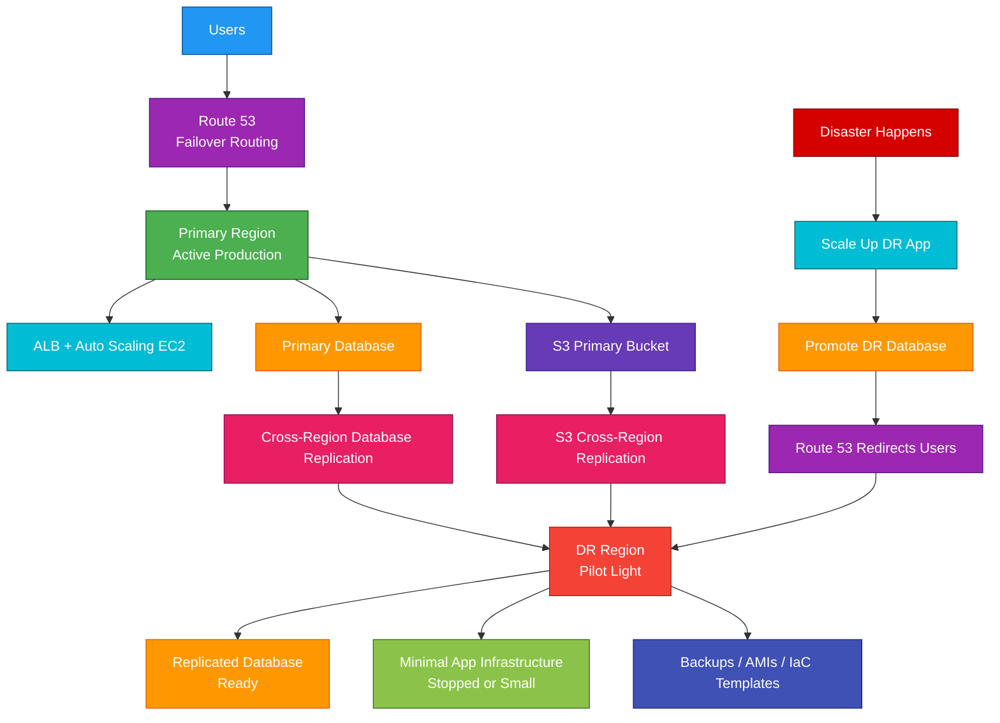

# Disaster Recovery

## 1. Definition

### Simple Definition

Disaster Recovery, or DR, is the process of restoring applications, data, and infrastructure after a major failure.

In AWS, disaster recovery usually means designing systems so they can recover from problems such as:

- Region failure
- Availability Zone failure
- Database corruption
- Accidental deletion
- Ransomware or security incident
- Application deployment failure
- On-premises data center outage

### Memory Hook

DR = Recover when disaster happens.

### Basic Idea

Disaster recovery is about answering two important questions:

| Question | DR Metric |
|---|---|
| How much data can we afford to lose? | RPO |
| How fast must we recover? | RTO |

## 2. What Problem Does It Solve?

### Main Problem

Disaster Recovery solves the problem of keeping a business running when important systems fail.

It helps reduce downtime and data loss.

### Without DR

A disaster could cause:

- Long application outage
- Permanent data loss
- Manual rebuild of infrastructure
- Lost customer trust
- Compliance failure
- Revenue loss
- Confused recovery process

### With DR

You have a planned recovery strategy.

This can include:

- Backups
- Replication
- Multi-AZ design
- Multi-Region failover
- Infrastructure as Code
- Automated recovery steps
- Traffic redirection

### Key Benefit

DR helps you recover applications and data within an acceptable time and data-loss limit.

## 3. Core Use Cases

### Application Recovery

Restore applications after infrastructure or Region failure.

Example:

A web application fails in one Region and is restored in another Region.

### Database Recovery

Recover databases after corruption, accidental deletion, or Regional outage.

Common tools:

- RDS snapshots
- Aurora Global Database
- DynamoDB global tables
- AWS Backup
- Point-in-time recovery

### Data Protection

Protect important data from deletion, corruption, or ransomware.

Common services:

- AWS Backup
- S3 Versioning
- S3 Object Lock
- Cross-Region Replication
- EBS snapshots

### On-Premises Disaster Recovery to AWS

Use AWS as a disaster recovery site for on-premises workloads.

Common service:

- AWS Elastic Disaster Recovery

### Multi-Region Resilience

Deploy workloads across multiple AWS Regions to survive Regional issues.

Common services:

- Route 53
- CloudFront
- Global Accelerator
- Aurora Global Database
- DynamoDB global tables
- S3 Cross-Region Replication

### Compliance and Business Continuity

Some businesses must prove they can recover systems within specific time limits.

DR planning helps meet compliance and business continuity requirements.

## 4. Important Features for SAA

### RTO

Recovery Time Objective, or RTO, means how quickly the system must be restored after a disaster.

Example:

If RTO is 1 hour, the application must be back online within 1 hour.

### RPO

Recovery Point Objective, or RPO, means how much data loss is acceptable.

Example:

If RPO is 15 minutes, the business can tolerate losing at most 15 minutes of data.

### RTO vs RPO

| Metric | Meaning | Simple Question |
|---|---|---|
| RTO | Maximum acceptable downtime | How fast must we recover? |
| RPO | Maximum acceptable data loss | How much data can we lose? |

### Memory Hook

RTO = Time to recover.

RPO = Point of data recovery.

### DR Strategy Levels

AWS commonly describes four major disaster recovery strategies.

| Strategy | Cost | RTO/RPO | Description |
|---|---:|---:|---|
| Backup and Restore | Lowest | Highest | Restore from backups after disaster |
| Pilot Light | Low | Medium | Core components always running |
| Warm Standby | Medium | Low | Smaller full environment always running |
| Multi-Site Active-Active | Highest | Lowest | Full production runs in multiple locations |

### Backup and Restore

Backup and Restore is the simplest and lowest-cost DR strategy.

You regularly back up data and infrastructure configuration.

During disaster, you restore resources from backup.

Best for:

- Non-critical workloads
- Low-cost DR
- Longer acceptable downtime

### Pilot Light

Pilot Light keeps the most critical core components running in the DR environment.

Usually, data is replicated, but application servers may be stopped or minimal.

During disaster, you scale up the environment.

Best for:

- Lower cost than warm standby
- Faster recovery than backup and restore
- Workloads needing core services ready

### Warm Standby

Warm Standby keeps a smaller but fully functional version of the environment running.

During disaster, you scale it up to production size.

Best for:

- Faster recovery
- Important production workloads
- Lower downtime than pilot light

### Multi-Site Active-Active

Multi-Site Active-Active runs production workloads in multiple locations at the same time.

Traffic is served by more than one Region or site.

Best for:

- Mission-critical applications
- Very low RTO and RPO
- Global applications
- Highest availability needs

### AWS Elastic Disaster Recovery

AWS Elastic Disaster Recovery, or AWS DRS, helps replicate servers to AWS for disaster recovery.

It is commonly used for on-premises or cloud-to-AWS server recovery.

### Multi-AZ vs Multi-Region

| Design | Protects Against | Example |
|---|---|---|
| Multi-AZ | Availability Zone failure | RDS Multi-AZ |
| Multi-Region | Regional failure | Route 53 failover to another Region |

### Important Exam Point

Multi-AZ is high availability.

Multi-Region is usually disaster recovery.

### Backups

Backups are point-in-time copies of data.

Common backup options:

- AWS Backup
- EBS snapshots
- RDS snapshots
- Aurora backups
- DynamoDB PITR
- S3 Versioning

### Replication

Replication keeps another copy of data updated.

Common replication options:

- S3 Cross-Region Replication
- Aurora Global Database
- DynamoDB global tables
- RDS read replicas
- EFS replication
- FSx backups and replication options

### Traffic Failover

After recovery, users must be redirected to the healthy environment.

Common services:

- Route 53 failover routing
- Route 53 health checks
- AWS Global Accelerator
- CloudFront origin failover

## 5. Security Model

### IAM Permissions

IAM controls who can create, modify, restore, and delete DR resources.

Important permissions include access to:

- Backups
- Snapshots
- Replication settings
- KMS keys
- Route 53 records
- Infrastructure as Code
- Recovery automation

### Backup Security

Backups must be protected from accidental or malicious deletion.

Important controls:

- AWS Backup Vault Lock
- S3 Object Lock
- S3 Versioning
- Cross-account backup copy
- Restricted delete permissions
- MFA Delete where appropriate

### Encryption at Rest

DR copies should be encrypted at rest.

Common options:

- EBS encryption
- RDS encryption
- S3 server-side encryption
- AWS Backup encryption
- KMS customer managed keys

### Encryption in Transit

Data replication and recovery traffic should be encrypted in transit.

Examples:

- HTTPS/TLS
- VPN
- Direct Connect with encryption options
- Database TLS connections

### KMS Key Permissions

KMS permissions are critical in DR.

A backup is not useful if the recovery account or Region cannot decrypt it.

Important exam point:

When copying encrypted backups across accounts or Regions, make sure KMS key permissions allow restore.

### Cross-Account Isolation

A strong DR design often stores backup copies in a separate AWS account.

This helps protect backups if the production account is compromised.

### Network Security

Recovered environments still need normal network controls.

Use:

- VPC route tables
- Security groups
- Network ACLs
- Private subnets
- VPC endpoints
- WAF where appropriate

### Shared Responsibility

AWS is responsible for:

- Availability of managed AWS services
- Physical infrastructure
- Durability of managed storage services
- Managed service operations

You are responsible for:

- Choosing the DR strategy
- Configuring backups and replication
- Testing recovery
- IAM and KMS permissions
- Application recovery logic
- Data consistency
- Network and security configuration
- Traffic failover design

## 6. High Availability / Durability Behavior

### Availability

Disaster Recovery is not one single AWS service.

It is an architecture strategy that uses many AWS services to improve recovery.

### High Availability vs Disaster Recovery

| Concept | Purpose | Example |
|---|---|---|
| High Availability | Keep running during smaller failures | Multi-AZ RDS |
| Disaster Recovery | Recover from major failure | Multi-Region failover |

### Multi-AZ Behavior

Multi-AZ designs protect against Availability Zone failure.

Examples:

- ALB across multiple AZs
- Auto Scaling Group across AZs
- RDS Multi-AZ
- Aurora storage replicated across AZs
- EFS Standard across AZs

### Multi-Region Behavior

Multi-Region designs protect against Regional failure.

Examples:

- Route 53 failover to another Region
- Aurora Global Database
- DynamoDB global tables
- S3 Cross-Region Replication
- AWS Backup cross-Region copies

### Durability

Durability means data is safely stored and protected from loss.

Common durable storage services:

| Service | Durability Use |
|---|---|
| S3 | Object storage and backups |
| EBS Snapshots | Volume recovery |
| RDS Snapshots | Database recovery |
| AWS Backup | Centralized backup recovery points |
| DynamoDB PITR | Table point-in-time recovery |

### Fault Tolerance

Fault tolerance means the system can continue working even when part of it fails.

Common fault-tolerant designs:

- Load balancers across AZs
- Auto Scaling Groups
- Multi-AZ databases
- Active-active Multi-Region applications
- Decoupling with SQS

### Recovery Testing

A DR plan must be tested.

Testing helps confirm:

- Backups can be restored
- Infrastructure can be rebuilt
- DNS failover works
- KMS permissions are correct
- Application dependencies are available
- RTO and RPO targets can be met

### Important Exam Point

Backups alone do not guarantee recovery.

You must also have restore processes, permissions, infrastructure, and traffic failover.

## 7. Cost Optimization Options

### Match Cost to RTO and RPO

Lower RTO and RPO usually cost more.

| Strategy | Cost | Recovery Speed |
|---|---:|---:|
| Backup and Restore | Low | Slow |
| Pilot Light | Low to Medium | Medium |
| Warm Standby | Medium | Fast |
| Multi-Site Active-Active | High | Very Fast |

### Use Backup and Restore for Non-Critical Workloads

If a workload can tolerate longer downtime, backup and restore is usually the cheapest option.

### Use Pilot Light for Balanced Cost and Recovery

Pilot Light is useful when you need faster recovery than backup and restore but cannot justify a full standby environment.

### Use Warm Standby for Important Workloads

Warm Standby costs more because resources are already running.

Use it when the business needs faster recovery.

### Use Active-Active Only for Critical Systems

Active-active is usually the most expensive DR strategy.

Use it only when very low downtime and data loss are required.

### Right-Size Standby Resources

For warm standby, run smaller resources in the DR Region and scale up during disaster.

Example:

Run fewer EC2 instances normally, then increase Auto Scaling capacity during failover.

### Use Lifecycle Policies

Move older backups to lower-cost storage.

Examples:

- S3 lifecycle rules
- AWS Backup lifecycle rules
- Glacier storage classes for archival data

### Avoid Unnecessary Cross-Region Replication

Cross-Region replication improves DR but increases cost.

Use it for critical data only.

### Delete Old Backups Carefully

Keep backups as long as required for business or compliance.

Delete unnecessary old snapshots and recovery points to reduce cost.

### Automate Infrastructure

Use Infrastructure as Code to rebuild environments quickly without keeping all resources running.

Common tools:

- AWS CloudFormation
- AWS CDK
- Terraform

## 8. Common Exam Traps

### RTO vs RPO Confusion

| Term | Exam Meaning |
|---|---|
| RTO | How fast to recover |
| RPO | How much data loss is acceptable |

### Backup Is Not High Availability

Backups help restore after failure.

They do not keep the application running during the failure.

### Multi-AZ Is Not Full Disaster Recovery

Multi-AZ protects against AZ failure.

For Regional failure, use Multi-Region DR.

### Lowest Cost Usually Means Backup and Restore

If the question asks for lowest-cost DR and allows longer downtime, choose backup and restore.

### Lowest RTO/RPO Usually Means Active-Active

If the question requires near-zero downtime and near-zero data loss, choose multi-site active-active.

### Pilot Light vs Warm Standby

| Strategy | Difference |
|---|---|
| Pilot Light | Only core components run |
| Warm Standby | A smaller full environment runs |

### Route 53 Failover Needs Health Checks

For DNS failover, Route 53 needs health checks or health-based routing configuration.

### DNS Failover Is Affected by TTL

Even if Route 53 changes the DNS answer, cached DNS records can delay failover.

Use lower TTL for faster DNS failover.

### Replication Is Not Backup

Replication copies changes quickly, including bad changes.

Backups provide point-in-time recovery.

Best designs often use both.

### Cross-Region Copy Is Not Automatic

You must configure cross-Region backup copy or replication.

AWS does not automatically copy all backups to another Region.

### KMS Can Break DR

Encrypted backups and replicated data require correct KMS permissions in the recovery Region or account.

### DR Must Be Tested

An untested DR plan may fail during a real disaster.

Exam scenarios may mention testing to validate RTO and RPO.

## 9. Compare With Similar Services

### DR Strategy Comparison Table

| Strategy | Cost | RTO | RPO | Choose When |
|---|---:|---:|---:|---|
| Backup and Restore | Lowest | Hours+ | Hours+ | Lowest cost, downtime acceptable |
| Pilot Light | Low | Minutes to hours | Minutes to hours | Core services ready, scale during disaster |
| Warm Standby | Medium | Minutes | Minutes | Smaller full environment always running |
| Multi-Site Active-Active | Highest | Near zero | Near zero | Mission-critical workloads |

### AWS Services for DR

| Service | DR Role | Choose When |
|---|---|---|
| AWS Backup | Centralized backups | You need backup plans, vaults, retention, and restore |
| S3 CRR | Object replication | You need S3 data copied across Regions |
| Route 53 | DNS failover | You need to route users to healthy endpoints |
| Global Accelerator | Fast global failover | You need static anycast IPs and fast failover |
| Aurora Global Database | Cross-Region database DR | You need low-latency global reads and fast recovery |
| DynamoDB Global Tables | Multi-Region NoSQL | You need active-active DynamoDB across Regions |
| AWS Elastic Disaster Recovery | Server replication | You need to recover on-premises or EC2 servers into AWS |

### Backup and Restore vs Pilot Light

| Feature | Backup and Restore | Pilot Light |
|---|---|---|
| Running DR resources | Minimal or none | Core services running |
| Cost | Lower | Higher |
| Recovery speed | Slower | Faster |
| Example | Restore from snapshot | Database replica exists, app scaled up later |

### Pilot Light vs Warm Standby

| Feature | Pilot Light | Warm Standby |
|---|---|---|
| Environment completeness | Core only | Full but smaller |
| Cost | Lower | Higher |
| Recovery speed | Medium | Faster |
| Scaling needed during failover | More | Less |

### Warm Standby vs Active-Active

| Feature | Warm Standby | Active-Active |
|---|---|---|
| Traffic served during normal operation | Usually primary Region only | Multiple Regions |
| Cost | Medium | High |
| Recovery speed | Fast | Very fast |
| Complexity | Medium | High |

### When to Choose Disaster Recovery Design

Choose a DR design when:

- The workload must survive major failures
- The business has RTO and RPO requirements
- Data must be protected from corruption or deletion
- Compliance requires recoverability
- Applications must recover across AZs, Regions, or accounts
- On-premises systems need recovery into AWS

## 10. Mini Architecture Example

### Scenario

A company runs a production web application in one AWS Region.

They need disaster recovery in a second Region with lower cost than active-active, but faster recovery than restoring everything from backups.

### Architecture

Use a Pilot Light strategy.

The primary Region runs the full production environment.

The DR Region keeps core components ready, such as replicated data and minimal infrastructure.

During disaster, scale up application resources and redirect traffic.

### Why This Is Good

- Primary Region handles normal production traffic
- DR Region keeps critical data ready
- Pilot Light costs less than warm standby or active-active
- Recovery is faster than restoring everything from backup
- Route 53 can redirect users during failover
- Infrastructure as Code helps rebuild or scale the DR environment
- Replication reduces data loss compared with backup-only recovery

### Exam Answer Pattern

If the question says:

“Lowest cost DR and downtime is acceptable.”

Think:

Backup and Restore.

If the question says:

“Core components running and scale up after disaster.”

Think:

Pilot Light.

If the question says:

“Smaller full environment already running.”

Think:

Warm Standby.

If the question says:

“Near-zero downtime and both Regions serve traffic.”

Think:

Multi-Site Active-Active.

### Final Memory Hook

RTO = How fast to recover.

RPO = How much data can be lost.

Backup and Restore = Cheapest, slowest.

Pilot Light = Core on, scale later.

Warm Standby = Small full system running.

Active-Active = Full systems running in multiple places.

Multi-AZ = High availability.

Multi-Region = Disaster recovery.

