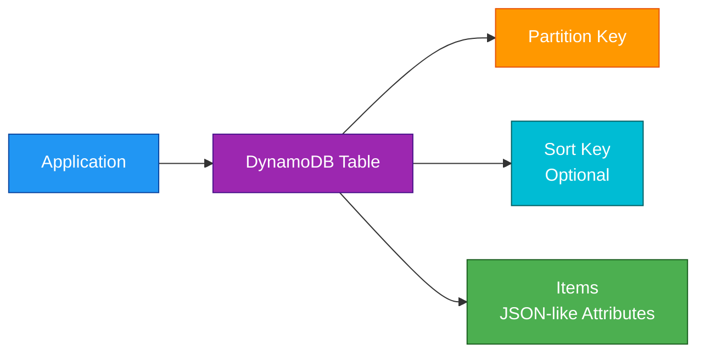
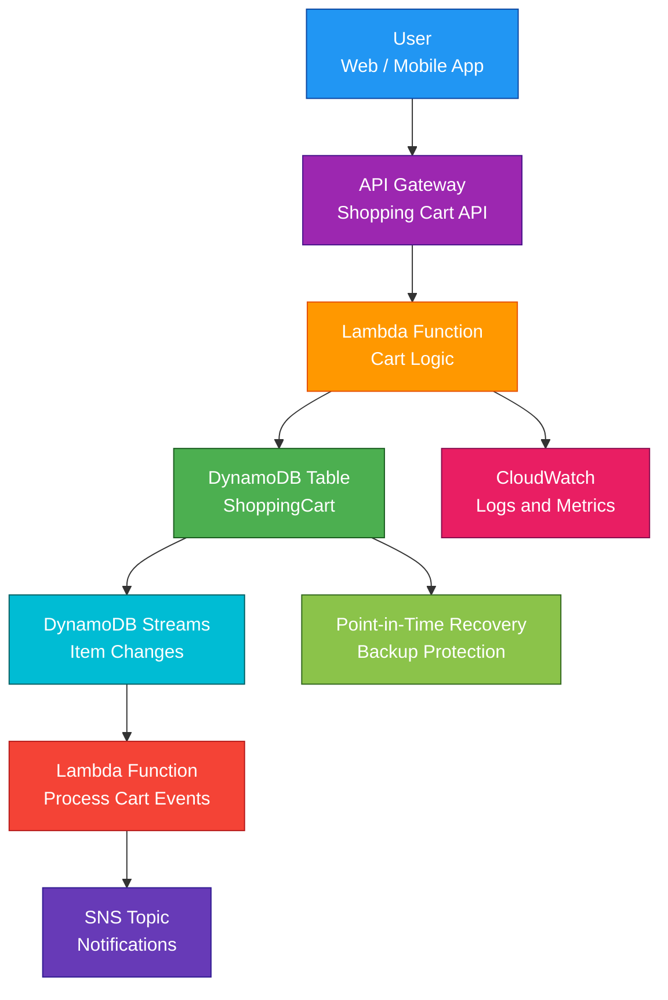

# DynamoDB

<details>
<summary>

## 1. Definition

</summary>

### Simple Definition

Amazon DynamoDB is a fully managed NoSQL database service.

It is designed for fast, scalable, low-latency access to data without managing database servers.

### Memory Hook

DynamoDB = Dynamic NoSQL database at massive scale.

### Basic Idea

You create a table, store items in it, and access data using keys.

DynamoDB automatically handles infrastructure, scaling, replication, patching, and high availability.



### What DynamoDB Is Best At

DynamoDB is best for applications that need:

- Very fast reads and writes
- Massive scale
- Simple key-value access
- Serverless database operations
- High availability
- Low-latency performance

</details>

<details>
<summary>

## 2. What Problem Does It Solve?

</summary>

### Main Problem

DynamoDB solves the problem of needing a highly scalable database without managing servers, storage, replication, or patching.

### Without DynamoDB

You may need to manage:

- Database servers
- Storage capacity
- Replication
- Scaling
- Patching
- Failover
- Sharding
- Backups
- Performance tuning infrastructure

### With DynamoDB

AWS manages the database infrastructure for you.

You focus on:

- Table design
- Access patterns
- Keys and indexes
- Capacity mode
- Security
- Application logic

### Key Benefit

DynamoDB provides serverless NoSQL storage with very low latency and automatic scaling options.

</details>

<details>
<summary>

## 3. Core Use Cases

</summary>

### Serverless Applications

DynamoDB is commonly used with Lambda and API Gateway.

Example:

- API Gateway receives request
- Lambda processes logic
- DynamoDB stores application data

### User Profiles and Sessions

Store fast-access user data.

Examples:

- User profile
- Shopping cart
- Login session
- Preferences

### Gaming Applications

DynamoDB is good for high-scale gaming workloads.

Examples:

- Player profiles
- Leaderboards
- Game state
- Match history

### IoT Data

Store high-volume device data.

Examples:

- Device status
- Sensor readings
- Telemetry events
- Device metadata

### Mobile and Web Apps

DynamoDB is common for apps that need fast, scalable backend storage.

Examples:

- Social apps
- Chat apps
- Shopping apps
- Content apps

### Event-Driven Architectures

DynamoDB Streams can trigger Lambda functions when table data changes.

Examples:

- Send notification after new order
- Update search index
- Replicate data to another system

### Global Applications

DynamoDB Global Tables provide multi-Region replication for globally distributed applications.

</details>

<details>
<summary>

## 4. Important Features for SAA

</summary>

### Table

A table is the main container for data in DynamoDB.

A table stores items.

Example table:

`Users`

### Item

An item is one record in a DynamoDB table.

It is similar to a row in a relational database.

Example item:

```json
{
  "userId": "123",
  "name": "Hasrat",
  "email": "hasrat@example.com"
}
```

### Attribute

An attribute is a field inside an item.

It is similar to a column, but DynamoDB items do not all need the same attributes.

### Primary Key

Every DynamoDB table must have a primary key.

The primary key uniquely identifies each item.

There are two primary key types:

| Key Type | Description |
|---|---|
| Partition key only | One attribute uniquely identifies the item |
| Partition key + sort key | Two attributes together uniquely identify the item |

### Partition Key

The partition key decides how data is distributed across DynamoDB partitions.

Good partition key design is very important for performance.

Example:

`userId`

### Sort Key

The sort key allows multiple related items to share the same partition key.

It also allows sorting and range queries.

Example:

| Partition Key | Sort Key |
|---|---|
| `userId` | `orderDate` |

### Composite Primary Key

A composite primary key uses both a partition key and a sort key.

Example:

| Partition Key | Sort Key |
|---|---|
| `customerId` | `orderId` |

### Query

A Query operation finds items using the partition key.

It can also use the sort key for filtering ranges.

Query is efficient and preferred.

### Scan

A Scan operation reads every item in a table or index.

Scan is usually expensive and slow for large tables.

Exam tip:

Prefer Query over Scan.

### Local Secondary Index

A Local Secondary Index, or LSI, gives an alternate sort key for the same partition key.

Important points:

- Must be created when the table is created
- Uses the same partition key as the base table
- Has a different sort key
- Useful for alternate sorting within the same partition

### Global Secondary Index

A Global Secondary Index, or GSI, gives an alternate partition key and optional sort key.

Important points:

- Can be created after table creation
- Has its own partition key
- Can have its own sort key
- Useful for different access patterns
- Eventually consistent reads only

### LSI vs GSI

| Feature | LSI | GSI |
|---|---|---|
| Created after table? | No | Yes |
| Partition key | Same as base table | Different from base table |
| Sort key | Different | Optional |
| Consistency | Strong or eventual | Eventual only |
| Use case | Alternate sorting | Alternate query pattern |

### Read Consistency

DynamoDB supports two main read consistency models.

| Read Type | Meaning |
|---|---|
| Eventually Consistent Read | May not show the latest write immediately |
| Strongly Consistent Read | Returns the latest committed data |

### Eventually Consistent Reads

Eventually consistent reads are the default.

They are cheaper than strongly consistent reads.

### Strongly Consistent Reads

Strongly consistent reads return the most recent committed data.

Important exam points:

- Available for tables and LSIs
- Not available for GSIs
- Not available across Global Tables in the same way as single-Region reads

### Capacity Modes

DynamoDB has two main capacity modes.

| Capacity Mode | Best For |
|---|---|
| On-Demand | Unknown, spiky, or unpredictable traffic |
| Provisioned | Predictable traffic where you can plan capacity |

### On-Demand Capacity

On-Demand capacity automatically handles read and write traffic.

Use it when traffic is unpredictable or when you want less capacity planning.

### Provisioned Capacity

Provisioned capacity lets you set read and write capacity.

Use it when traffic is predictable and you want more cost control.

### Auto Scaling

With provisioned capacity, DynamoDB Auto Scaling can adjust read and write capacity based on demand.

### Read Capacity Unit

A Read Capacity Unit, or RCU, represents read throughput.

For SAA, remember:

- Strongly consistent reads use more capacity
- Eventually consistent reads are more efficient
- Larger items consume more capacity

### Write Capacity Unit

A Write Capacity Unit, or WCU, represents write throughput.

For SAA, remember:

- Larger items consume more capacity
- More writes require more WCUs

### Item Size Limit

A single DynamoDB item can be up to 400 KB.

Exam tip:

For larger objects, store the object in S3 and store the S3 object key in DynamoDB.

### DynamoDB Streams

DynamoDB Streams capture item-level changes in a table.

They can record:

- New item inserted
- Item updated
- Item deleted

Common use:

DynamoDB Streams trigger Lambda for event-driven processing.

### Time to Live

Time to Live, or TTL, automatically deletes expired items from a table.

Use TTL for:

- Sessions
- Temporary data
- Expiring tokens
- Old cache records

### Transactions

DynamoDB supports ACID transactions across multiple items and tables.

Use transactions when multiple operations must succeed or fail together.

### Conditional Writes

Conditional writes allow updates only when a condition is true.

Example:

Only update an item if its version number matches.

This helps prevent overwriting changes.

### Atomic Counters

DynamoDB can increment or decrement numeric values atomically.

Example:

Increase a page view count by 1.

### DAX

DynamoDB Accelerator, or DAX, is an in-memory cache for DynamoDB.

It improves read performance for read-heavy workloads.

Important points:

- Microsecond read performance
- Useful for repeated reads
- Not needed for all workloads
- Runs in a VPC

### Global Tables

Global Tables replicate DynamoDB tables across multiple AWS Regions.

Use them for:

- Multi-Region applications
- Low-latency global reads and writes
- Disaster recovery

### Backup and Restore

DynamoDB supports:

- On-demand backups
- Point-in-time recovery, or PITR

PITR lets you restore a table to a specific point in time within the recovery window.

### PartiQL

PartiQL allows SQL-like queries for DynamoDB.

Exam tip:

DynamoDB is still NoSQL even if PartiQL provides SQL-like syntax.

</details>

<details>
<summary>

## 5. Security Model

</summary>

### IAM Permissions

IAM controls who can access and manage DynamoDB resources.

Common permissions:

| Permission | Purpose |
|---|---|
| `dynamodb:CreateTable` | Create tables |
| `dynamodb:PutItem` | Add or replace items |
| `dynamodb:GetItem` | Read one item |
| `dynamodb:Query` | Query items by key |
| `dynamodb:Scan` | Scan table or index |
| `dynamodb:UpdateItem` | Modify item |
| `dynamodb:DeleteItem` | Delete item |

### Fine-Grained Access Control

DynamoDB supports fine-grained access control using IAM condition keys.

Example:

Allow users to access only items where the partition key matches their user ID.

### Encryption at Rest

DynamoDB encrypts data at rest.

Encryption options include:

- AWS owned keys
- AWS managed keys
- Customer managed KMS keys

### Encryption in Transit

DynamoDB API calls use HTTPS.

Applications communicate securely with DynamoDB endpoints.

### VPC Endpoints

DynamoDB can be accessed privately from a VPC using a Gateway VPC Endpoint.

This avoids sending traffic over the public internet.

### Resource-Based Policies

DynamoDB can use resource-based policies for access control on supported resources.

This can help with cross-account access scenarios.

### IAM Role Best Practice

Applications should access DynamoDB using IAM roles.

Examples:

- Lambda execution role
- EC2 instance role
- ECS task role

Avoid storing long-term AWS access keys in application code.

### KMS Key Permissions

If using customer managed KMS keys, make sure the application and DynamoDB service have proper KMS permissions.

Wrong KMS permissions can break reads, writes, backups, or restores.

### Shared Responsibility

AWS is responsible for:

- DynamoDB infrastructure
- Replication across Availability Zones
- Managed scaling infrastructure
- Service patching
- Physical security
- Encryption features

You are responsible for:

- IAM permissions
- Table design
- Key design
- KMS key policies
- VPC endpoint policies
- Backup settings
- Application access patterns
- Preventing hot partitions
- Input validation and business logic

</details>

<details>
<summary>

## 6. High Availability / Durability Behavior

</summary>

### Availability

DynamoDB is designed for high availability within an AWS Region.

It automatically stores data across multiple Availability Zones.

### Multi-AZ Behavior

DynamoDB replicates data across multiple Availability Zones in a Region.

You do not configure Multi-AZ manually.

### Fault Tolerance

AWS manages the underlying infrastructure.

If one underlying component fails, DynamoDB is designed to continue operating.

### Regional Service

A DynamoDB table is regional by default.

The table exists in one AWS Region unless you configure Global Tables.

### Multi-Region Behavior

Use DynamoDB Global Tables for multi-Region replication.

Global Tables allow applications in different Regions to read and write locally.

### Durability

DynamoDB stores data durably across multiple Availability Zones.

For additional protection, use:

- Point-in-time recovery
- On-demand backups
- Global Tables
- AWS Backup integration where applicable

### Global Tables Conflict Handling

Global Tables support multi-Region writes.

If the same item is updated in multiple Regions around the same time, DynamoDB uses conflict resolution.

Exam tip:

Design applications carefully to avoid conflicting writes.

### Backup Durability

On-demand backups are retained until deleted.

Point-in-time recovery allows restoring to a previous time within the configured recovery window.

### Streams Durability

DynamoDB Streams store change records for a limited time.

Do not treat Streams as long-term event storage.

For longer event retention, send events to services such as Kinesis, SQS, S3, or EventBridge depending on the use case.

</details>

<details>
<summary>

## 7. Cost Optimization Options

</summary>

### Choose the Right Capacity Mode

Use On-Demand for unpredictable traffic.

Use Provisioned capacity for predictable traffic.

| Workload Pattern | Better Option |
|---|---|
| Unknown or spiky | On-Demand |
| Predictable and steady | Provisioned |
| Development or new app | On-Demand |
| Mature workload with known usage | Provisioned with Auto Scaling |

### Use Auto Scaling with Provisioned Capacity

Auto Scaling helps avoid overprovisioning while still handling demand changes.

### Design Good Partition Keys

Poor partition key design can create hot partitions.

Hot partitions can reduce performance and waste capacity.

Choose partition keys with high cardinality and even traffic distribution.

### Avoid Scans

Scans read large amounts of data and can be expensive.

Use Query with proper keys and indexes instead.

### Use GSIs Carefully

Global Secondary Indexes add cost because they maintain separate indexed data.

Create only the indexes needed for real access patterns.

### Keep Items Small

Larger items consume more read and write capacity.

Store large files in S3 and store only metadata or object keys in DynamoDB.

### Use TTL for Expiring Data

TTL automatically removes expired items.

This helps reduce storage cost for temporary data.

### Use DAX Only When Needed

DAX adds cost.

Use it only when the application is read-heavy and needs extremely low-latency repeated reads.

### Use Standard-IA Table Class for Infrequent Access

DynamoDB Standard-Infrequent Access table class can reduce storage cost for tables where storage is the dominant cost and access is infrequent.

### Monitor with CloudWatch

Monitor metrics such as:

- Consumed read capacity
- Consumed write capacity
- Throttled requests
- User errors
- System errors
- Hot partition patterns

</details>

<details>
<summary>

## 8. Common Exam Traps

</summary>

### DynamoDB Is NoSQL, Not Relational

DynamoDB does not use joins like a relational database.

If the question requires complex SQL joins and relational constraints, Aurora or RDS may be better.

### Query vs Scan

Query uses keys and is efficient.

Scan reads the whole table or index and is usually expensive.

Exam tip:

If performance matters, avoid Scan.

### Partition Key Design Is Critical

Bad partition key design can create hot partitions.

A hot partition happens when too much traffic goes to the same partition key.

### GSI Reads Are Eventually Consistent

Global Secondary Indexes support eventually consistent reads only.

Do not choose GSI if the exam requires strongly consistent reads from that index.

### LSI Must Be Created With the Table

Local Secondary Indexes must be created when the table is created.

You cannot add an LSI later.

### GSI Can Be Added Later

Global Secondary Indexes can be added after table creation.

### Strong Consistency Is Not Always Available

Strongly consistent reads are available for base tables and LSIs.

They are not available for GSIs.

### DynamoDB Item Limit Is 400 KB

If the data is larger than 400 KB, store the object in S3 and keep a reference in DynamoDB.

### On-Demand Is Not Always Cheapest

On-Demand is flexible, but provisioned capacity can be cheaper for predictable workloads.

### DAX Is for Read Caching

DAX improves read-heavy workloads.

It does not help write-heavy workloads in the same way.

### TTL Deletion Is Not Immediate

TTL marks items for expiration, but deletion is not guaranteed to happen at the exact expiration time.

### DynamoDB Streams Are Not SQS

Streams capture table changes.

SQS is a message queue for decoupling producers and consumers.

### Global Tables Are for Multi-Region

Global Tables are used for multi-Region replication and low-latency global access.

They are not needed for normal Multi-AZ durability inside one Region.

### DynamoDB Is Serverless

You do not manage servers, patching, or database instances.

If the exam asks for a fully managed serverless NoSQL database, DynamoDB is usually the answer.

</details>

<details>
<summary>

## 9. Compare With Similar Services

</summary>

### Service Comparison Table

| Service | Main Purpose | Best For | Choose When |
|---|---|---|---|
| DynamoDB | Serverless NoSQL database | Key-value and document workloads at scale | You need low-latency NoSQL access |
| Aurora | Relational database | MySQL/PostgreSQL-compatible applications | You need SQL, joins, and relational transactions |
| RDS | Managed relational database | Traditional relational workloads | You need managed SQL engines |
| ElastiCache | In-memory cache | Ultra-fast cached reads | You need Redis or Memcached caching |
| DocumentDB | Document database | MongoDB-compatible workloads | You need MongoDB-style document storage |
| Redshift | Data warehouse | Analytics and reporting | You need OLAP and large analytical queries |

### DynamoDB vs Aurora

| Feature | DynamoDB | Aurora |
|---|---|---|
| Database type | NoSQL | Relational |
| Query style | Key-value/document access | SQL |
| Joins | No traditional joins | Yes |
| Scaling model | Serverless table scaling | DB instances and Aurora storage |
| Best for | Massive scale, simple access patterns | Relational apps and transactions |
| Exam clue | Single-digit millisecond NoSQL | MySQL/PostgreSQL compatibility |

### DynamoDB vs RDS

| Feature | DynamoDB | RDS |
|---|---|---|
| Server management | Serverless | Managed database instances |
| Data model | Key-value/document | Relational tables |
| Scaling | Automatic/on-demand/provisioned | Instance and storage scaling |
| SQL support | PartiQL-like access, not traditional SQL DB | Full SQL |
| Best for | High-scale NoSQL apps | Traditional relational apps |

### DynamoDB vs ElastiCache

| Feature | DynamoDB | ElastiCache |
|---|---|---|
| Main purpose | Durable NoSQL database | In-memory cache |
| Data durability | Durable storage | Cache-focused |
| Latency | Very low | Extremely low |
| Use as source of truth | Yes | Usually no |
| Common together | Store durable data | Cache frequent reads |

### DynamoDB vs S3

| Feature | DynamoDB | S3 |
|---|---|---|
| Main purpose | NoSQL database | Object storage |
| Access pattern | Query by keys | Retrieve objects by key |
| Item/object size | 400 KB item limit | Very large objects |
| Best for | Structured app data | Files, images, backups, data lakes |
| Common together | Store metadata | Store large objects |

### When to Choose DynamoDB

Choose DynamoDB when:

- You need a serverless NoSQL database
- You need low-latency key-value access
- You need massive scale
- You do not need complex joins
- You want automatic Multi-AZ replication
- You have predictable access patterns
- You need Global Tables for multi-Region access
- You need DynamoDB Streams for event-driven processing

</details>

<details>
<summary>

## 10. Mini Architecture Example

</summary>

### Scenario

A company is building a serverless shopping cart application.

Users need fast access to their cart items, and the system should scale automatically during traffic spikes.

### Architecture

API Gateway exposes the API.

Lambda handles application logic.

DynamoDB stores shopping cart data.

DynamoDB Streams trigger Lambda to send cart update events.



### Why This Is Good

- API Gateway provides a managed API endpoint
- Lambda runs backend logic without servers
- DynamoDB stores cart data with low latency
- On-Demand capacity can handle unpredictable traffic
- DynamoDB Streams enable event-driven processing
- PITR protects against accidental data changes
- CloudWatch provides logs and metrics

### Exam Answer Pattern

If the question says:

“Use a fully managed serverless NoSQL database with low-latency reads and writes at any scale.”

Think:

Amazon DynamoDB.

If the question says:

“Need SQL joins and relational design.”

Think:

Aurora or RDS.

### Final Memory Hook

DynamoDB is for serverless NoSQL.

Aurora is for relational SQL.

ElastiCache is for caching.

S3 is for large objects.

DAX speeds up DynamoDB reads.

Streams capture DynamoDB changes.

Global Tables replicate across Regions.

</details>