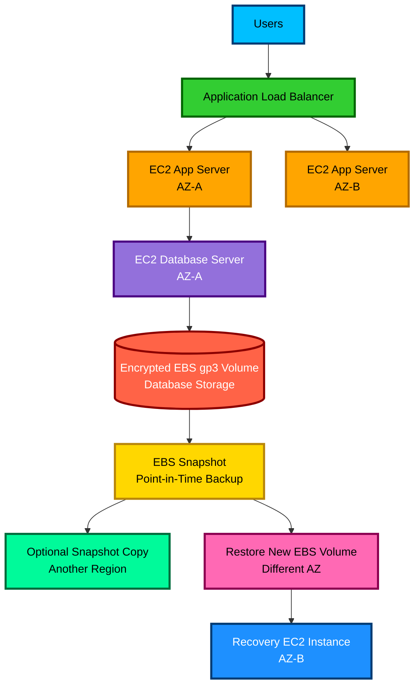

# EBS

1. Definition

## 1. Definition

### Simple Definition

Amazon EBS, or Elastic Block Store, is **block storage for EC2 instances**.

Think of EBS like a **virtual hard drive** that you attach to an EC2 server.

### Key Idea

- EC2 = virtual machine
- EBS = virtual disk attached to EC2
- EBS stores data in blocks
- EBS volumes persist independently from the EC2 instance, unless configured to delete on termination

### Memory Hook

**EBS = EC2’s hard drive**

2. What Problem Does It Solve?

## 2. What Problem Does It Solve?

### Main Problem

EC2 instances need storage for operating systems, applications, databases, logs, and files.

EBS solves this by giving EC2 instances **persistent, attachable, high-performance storage**.

### Why It Matters

Without EBS, data stored only on the EC2 instance might be lost when the instance stops or terminates.

EBS lets you:

- Keep data after stopping an EC2 instance
- Resize storage when needed
- Take backups using snapshots
- Choose performance based on workload
- Encrypt storage using AWS KMS

### Simple Analogy

EBS is like a hard drive you can:

- Attach to a server
- Detach from a server
- Resize
- Back up
- Encrypt

3. Core Use Cases

## 3. Core Use Cases

### Common Real-World Use Cases

| Use Case | Why EBS Fits |
|---|---|
| EC2 boot volume | Stores the operating system |
| Databases | Low-latency block storage for MySQL, PostgreSQL, Oracle, SQL Server |
| Application storage | Stores app files, uploads, logs, and runtime data |
| Development environments | Easy to create, attach, snapshot, and restore |
| High-performance workloads | Provisioned IOPS volumes support demanding databases |
| Backup and recovery | Snapshots provide point-in-time backups |
| Disaster recovery | Snapshots can be copied across Regions |

### Good Fit

Use EBS when you need **persistent block storage attached to EC2**.

### Not a Good Fit

Do not choose EBS when you need:

- Shared file storage across many instances by default
- Object storage for images, videos, or backups
- Serverless storage independent of EC2

For those, consider EFS or S3.

4. Important Features for SAA

## 4. Important Features for SAA

### EBS Volume Types

| Volume Type | Category | Best For | Boot Volume? |
|---|---|---|---|
| `gp3` | General Purpose SSD | Most workloads | Yes |
| `gp2` | General Purpose SSD | Older general workloads | Yes |
| `io2` | Provisioned IOPS SSD | Critical high-performance databases | Yes |
| `io1` | Provisioned IOPS SSD | High-performance databases | Yes |
| `st1` | Throughput Optimized HDD | Big data, logs, data warehouses | No |
| `sc1` | Cold HDD | Infrequently accessed large data | No |

### `gp3`

`gp3` is usually the best default choice for the exam.

Key points:

- General-purpose SSD
- Performance can be provisioned separately from size
- Usually cheaper and more flexible than `gp2`
- Good for boot volumes, applications, and medium databases

### `gp2`

`gp2` is older but still appears in exam questions.

Key points:

- General-purpose SSD
- Performance is tied to volume size
- Larger volume means more baseline IOPS
- Can burst performance using credits

### `io1` and `io2`

Use these when you need **very high and consistent IOPS**.

Best for:

- Large databases
- Mission-critical workloads
- Low-latency workloads

`io2` is generally more durable and preferred over `io1`.

### `st1`

Use `st1` for large sequential workloads.

Best for:

- Big data
- Data warehouses
- Log processing

Important exam point:

- `st1` cannot be a boot volume

### `sc1`

Use `sc1` for the cheapest HDD option.

Best for:

- Cold data
- Infrequently accessed data
- Large data where cost matters more than speed

Important exam point:

- `sc1` cannot be a boot volume

### EBS Snapshots

EBS snapshots are **point-in-time backups** of EBS volumes.

Key points:

- Snapshots are incremental
- Stored in Amazon S3 internally
- You do not access them directly through S3
- Can be used to create new EBS volumes
- Can be copied across Regions
- Can be shared with other AWS accounts
- Can be automated using Data Lifecycle Manager or AWS Backup

### Incremental Snapshot Behavior

The first snapshot copies the used blocks.

Later snapshots copy only changed blocks.

This saves:

- Time
- Storage cost
- Backup space

### Restoring From Snapshot

When you create a new volume from a snapshot:

- The new volume starts as a copy of the snapshot
- Data is lazy-loaded in the background
- First access to blocks may have higher latency
- Fast Snapshot Restore can avoid this initial latency

### Fast Snapshot Restore

Fast Snapshot Restore, or FSR, allows volumes created from snapshots to be fully initialized immediately.

Use it when you need:

- Predictable performance immediately after restore
- Fast recovery
- No first-read latency

Exam warning:

- FSR costs extra
- FSR is enabled per snapshot per Availability Zone

### Elastic Volumes

Elastic Volumes allow you to modify an EBS volume without stopping the instance in many cases.

You can change:

- Volume size
- Volume type
- IOPS
- Throughput

Common exam idea:

- Need more storage or performance?
- Modify the EBS volume.

### EBS Multi-Attach

EBS Multi-Attach lets one EBS volume attach to multiple EC2 instances in the **same Availability Zone**.

Important limitations:

- Only supported for Provisioned IOPS SSD volumes such as `io1` and `io2`
- Instances must be in the same AZ
- Not used as a normal shared file system
- Applications must handle concurrent writes correctly
- Cluster-aware file systems are usually required

### Delete on Termination

For root EBS volumes:

- Usually deleted when the EC2 instance terminates by default

For additional EBS data volumes:

- Usually not deleted by default

Exam trap:

- Stopping an instance does not delete EBS data
- Terminating an instance may delete the root EBS volume depending on the setting

### EBS-Optimized Instances

EBS-optimized EC2 instances provide dedicated bandwidth between EC2 and EBS.

Use when:

- Storage performance matters
- You need predictable throughput
- You are using high-performance EBS volumes

5. Security Model

## 5. Security Model

### IAM Permissions

IAM controls who can manage EBS resources.

Common permissions include:

- Create volumes
- Attach volumes
- Detach volumes
- Delete volumes
- Create snapshots
- Copy snapshots
- Modify volumes
- Enable encryption

Example actions:

- `ec2:CreateVolume`
- `ec2:AttachVolume`
- `ec2:CreateSnapshot`
- `ec2:CopySnapshot`
- `ec2:DeleteVolume`

### Encryption Options

EBS supports encryption using AWS KMS.

Encryption protects:

- Data at rest on the volume
- Data moving between EC2 and EBS
- Snapshots created from encrypted volumes
- Volumes restored from encrypted snapshots

### Encryption by Default

You can enable EBS encryption by default at the account and Region level.

After enabling it:

- New EBS volumes are encrypted automatically
- New snapshots from encrypted volumes remain encrypted

### Snapshot Encryption Rules

| Source | Result |
|---|---|
| Encrypted volume | Snapshot is encrypted |
| Unencrypted volume | Snapshot is unencrypted |
| Encrypted snapshot | Restored volume is encrypted |
| Unencrypted snapshot | Can be copied and encrypted during copy |

### Network and Security Controls

EBS does not use security groups directly.

Security groups apply to EC2 network traffic, not EBS volumes.

EBS security is mainly controlled through:

- IAM permissions
- KMS key permissions
- Snapshot sharing settings
- EC2 instance access
- Operating system permissions inside the instance

### Shared Responsibility

AWS is responsible for:

- Physical infrastructure
- EBS service durability inside the AZ
- Hardware security
- Managed encryption infrastructure

You are responsible for:

- Choosing the right volume type
- Enabling encryption when required
- Managing IAM permissions
- Managing KMS keys and key policies
- Creating snapshots for backup
- Securing the operating system and file system

6. High Availability / Durability Behavior

## 6. High Availability / Durability Behavior

### Availability

An EBS volume exists in **one Availability Zone**.

An EC2 instance must be in the same AZ to attach the EBS volume.

Example:

- EC2 in `us-east-1a`
- EBS volume must also be in `us-east-1a`

### Fault Tolerance

EBS automatically replicates data within its Availability Zone.

This protects against failure of a single hardware component inside that AZ.

Important exam point:

- EBS is not automatically replicated across multiple AZs

### Multi-AZ Behavior

EBS volumes are AZ-scoped.

To move data to another AZ:

1. Create an EBS snapshot
2. Create a new EBS volume from the snapshot in another AZ
3. Attach the new volume to an EC2 instance in that AZ

### Multi-Region Behavior

EBS volumes are not directly Multi-Region.

To move EBS data to another Region:

1. Create a snapshot
2. Copy the snapshot to another Region
3. Create a new volume from the copied snapshot

### Durability

EBS volumes are designed for durability within a single AZ.

Snapshots are more durable because snapshot data is stored across multiple AZs in a Region.

### Snapshot Durability Behavior

EBS snapshots:

- Are incremental
- Are stored internally in Amazon S3
- Are replicated across Availability Zones within the Region
- Can restore volumes into any AZ in that Region

### Memory Hook

**EBS volume = one AZ**

**EBS snapshot = regional backup**

7. Cost Optimization Options

## 7. Cost Optimization Options

### Choose the Right Volume Type

| Requirement | Cost-Effective Choice |
|---|---|
| General workloads | `gp3` |
| Older general workloads | `gp2` |
| High IOPS databases | `io2` only when needed |
| Large sequential data | `st1` |
| Cold large data | `sc1` |
| Object storage | Use S3 instead |
| Shared file storage | Use EFS instead |

### Prefer `gp3` Over `gp2`

For many workloads, `gp3` is more cost-effective because:

- Storage size and performance are separate
- You do not need to overprovision size just to get more IOPS
- It is often cheaper than `gp2`

### Avoid Overprovisioning

Do not provision more than needed:

- Storage size
- IOPS
- Throughput

Monitor usage with CloudWatch and adjust.

### Use Snapshots Wisely

Snapshots cost money.

Cost tips:

- Delete old snapshots you no longer need
- Use Data Lifecycle Manager to automate retention
- Use AWS Backup for centralized backup policies
- Remember snapshots are incremental, but deleting one snapshot may not remove all shared data blocks

### Use Snapshot Archive

Use EBS Snapshot Archive for rarely accessed snapshots kept for long periods.

Good for:

- Compliance backups
- Long-term retention
- End-of-project backups

Exam point:

- Lower cost
- Slower restore
- Best for snapshots retained for 90 days or more

### Delete Unused Volumes

Detached EBS volumes still cost money.

Cost trap:

- If an EBS volume is not attached to EC2, you still pay for it.

### Disable Fast Snapshot Restore When Not Needed

Fast Snapshot Restore costs extra per snapshot per AZ.

Use only when immediate full performance is required after restore.

8. Common Exam Traps

## 8. Common Exam Traps

### Trap 1: EBS Is AZ-Scoped

EBS volumes live in one Availability Zone.

You cannot directly attach an EBS volume in one AZ to an EC2 instance in another AZ.

### Trap 2: Snapshots Are Regional

EBS snapshots are stored regionally and can restore volumes into any AZ in that Region.

### Trap 3: EBS Is Not Shared Storage by Default

A normal EBS volume attaches to one EC2 instance at a time.

For shared file storage, choose EFS.

### Trap 4: Multi-Attach Is Limited

Multi-Attach:

- Only works with specific Provisioned IOPS SSD volumes
- Requires same AZ
- Requires applications to handle concurrent writes
- Is not a replacement for EFS

### Trap 5: `st1` and `sc1` Cannot Be Boot Volumes

Boot volumes must use SSD-backed volumes like:

- `gp3`
- `gp2`
- `io1`
- `io2`

### Trap 6: Instance Store Is Not EBS

Instance store is temporary physical storage attached to the host.

EBS is persistent network-attached block storage.

If the exam says data must survive stop/start, choose EBS, not instance store.

### Trap 7: EBS Data May Be Deleted on Termination

Stopping an EC2 instance keeps EBS data.

Terminating an EC2 instance may delete the root EBS volume if Delete on Termination is enabled.

### Trap 8: Snapshots Are Incremental

Only changed blocks are stored after the first snapshot.

But each snapshot still appears as a complete restore point.

### Trap 9: You Cannot Directly Browse EBS Snapshots in S3

Snapshots are stored internally using S3, but you do not access them through S3 buckets.

### Trap 10: Encryption Inheritance Matters

Encrypted volume creates encrypted snapshot.

Encrypted snapshot creates encrypted volume.

To encrypt an unencrypted volume, common method:

1. Create snapshot
2. Copy snapshot with encryption enabled
3. Create new encrypted volume
4. Attach encrypted volume

### Trap 11: EBS Is Block Storage, Not Object Storage

Choose EBS for EC2 disks.

Choose S3 for objects such as images, backups, videos, static assets, and data lakes.

9. Compare With Similar Services

## 9. Compare With Similar Services

### EBS vs Similar AWS Storage Services

| Service | Storage Type | Attached To | Best For | Key Exam Point |
|---|---|---|---|---|
| EBS | Block storage | EC2 | Persistent EC2 disks, databases, boot volumes | AZ-scoped |
| EFS | File storage | Multiple EC2 instances | Shared Linux file system | Multi-AZ by design |
| S3 | Object storage | Internet/API access | Backups, static files, data lakes | Regional object storage |
| Instance Store | Temporary block storage | EC2 host | High-speed temporary data | Data lost on stop/terminate |
| FSx for Windows | Managed file storage | Windows workloads | SMB file shares | Windows-native shared storage |
| FSx for Lustre | High-performance file storage | Compute workloads | HPC, ML, big data | Integrates with S3 |

### When to Choose EBS

Choose EBS when:

- You need a disk for EC2
- You need low-latency block storage
- You need a boot volume
- You are running a database on EC2
- You need snapshots and restore points

### When to Choose EFS

Choose EFS when:

- Multiple EC2 instances need shared access
- You need a Linux file system
- You need Multi-AZ file storage

### When to Choose S3

Choose S3 when:

- You need object storage
- You need highly durable storage
- You are storing files, backups, images, videos, logs, or static website assets

### When to Choose Instance Store

Choose Instance Store when:

- Data is temporary
- You need very high local disk performance
- You can lose the data without business impact

10. Mini Architecture Example

## 10. Mini Architecture Example

### Scenario

A company runs a web application on EC2 with a self-managed MySQL database.

They need:

- Persistent database storage
- Encryption
- Backups
- Ability to recover in another AZ
- Cost-effective performance

### Simple Architecture

### How It Works

1. The database runs on an EC2 instance.
2. The database data is stored on an encrypted `gp3` EBS volume.
3. EBS snapshots are created on a schedule.
4. If the database volume fails or data is corrupted, a new volume can be restored from a snapshot.
5. If recovery is needed in another AZ, create a new EBS volume from the snapshot in that AZ.
6. If Region-level disaster recovery is needed, copy the snapshot to another Region.

### Exam-Focused Design Choices

| Requirement | Choice |
|---|---|
| Persistent EC2 storage | EBS |
| General database workload | `gp3` |
| High-performance critical database | `io2` |
| Backup | EBS snapshot |
| Cross-AZ recovery | Restore snapshot to new volume in another AZ |
| Cross-Region recovery | Copy snapshot to another Region |
| Shared access across many EC2 instances | Use EFS instead |

### Memory Hook

**EBS is the EC2 hard drive. Snapshots are the backup. AZ matters.**

