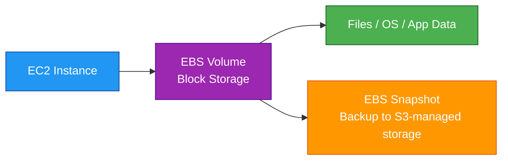
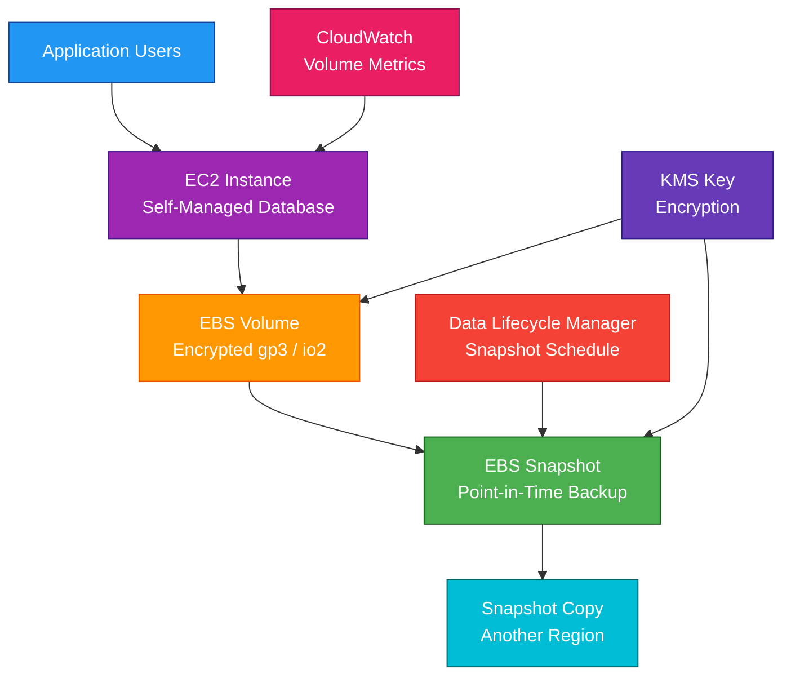

# Amazon EBS

## 1. Definition

### Simple Definition

Amazon EBS, or Elastic Block Store, is a block storage service used with Amazon EC2 instances.

It works like a virtual hard drive that you attach to an EC2 instance.

### Memory Hook

EBS = Elastic Block Storage for EC2.

### Basic Idea

An EC2 instance uses EBS volumes to store operating system files, application files, and data.

### Key Point

EBS is persistent block storage.

This means the data can remain even if the EC2 instance is stopped or terminated, depending on volume settings.

## 2. What Problem Does It Solve?

### Main Problem

EBS solves the problem of giving EC2 instances durable, attachable storage.

Without EBS, data stored only on temporary instance storage could be lost when the instance stops, terminates, or fails.

### Without EBS

You may have problems such as:

- No persistent disk for EC2
- Data lost when instance stops
- Difficult backups
- Harder resizing
- No easy snapshot-based recovery
- No separate storage lifecycle from compute

### With EBS

You can attach persistent volumes to EC2 instances and manage storage separately from compute.

### Key Benefit

EBS lets EC2 instances use reliable, resizable, snapshot-supported block storage.

## 3. Core Use Cases

### EC2 Root Volumes

Most EC2 instances use an EBS volume as the root volume.

This stores:

- Operating system
- Boot files
- Installed packages
- Application runtime

### Application Data

Use EBS for application data that needs block-level storage.

Examples:

- Application files
- Local database files
- Logs
- File system data

### Databases on EC2

Use EBS for databases running directly on EC2.

Examples:

- Self-managed MySQL
- Self-managed PostgreSQL
- Self-managed MongoDB
- Self-managed Oracle or SQL Server

### High-Performance Workloads

Use specific EBS volume types for workloads needing high IOPS or throughput.

Examples:

- Transactional databases
- Big data processing
- Analytics workloads
- Low-latency applications

### Backup and Recovery

Use EBS snapshots to back up volumes.

Snapshots can be used to:

- Restore a volume
- Create a new volume
- Copy data to another Region
- Create AMIs

### EC2 Instance Migration

Use snapshots or AMIs to recreate EC2 storage in another Availability Zone or Region.

## 4. Important Features for SAA

### EBS Volume

An EBS volume is a virtual disk that can be attached to an EC2 instance.

Important points:

- Block storage
- Persistent
- AZ-specific
- Can be resized
- Can be snapshotted
- Can be encrypted

### Availability Zone Scope

EBS volumes exist in one Availability Zone.

Important exam point:

An EBS volume can attach only to EC2 instances in the same Availability Zone.

### Volume Attachment

Most EBS volumes attach to one EC2 instance at a time.

Exception:

Some `io1` and `io2` volumes support Multi-Attach with Nitro-based instances.

### Root Volume

The root volume contains the operating system.

Important points:

- Usually deleted when the instance terminates by default
- Behavior is controlled by the `DeleteOnTermination` setting
- Can be encrypted
- Can be snapshotted

### Data Volume

A data volume is an extra EBS volume attached to an EC2 instance.

Use data volumes to separate application data from the operating system.

### EBS Volume Types

| Volume Type | Category | Best For |
|---|---|---|
| `gp3` | General Purpose SSD | Most workloads |
| `gp2` | General Purpose SSD | Older general-purpose workloads |
| `io2` | Provisioned IOPS SSD | Critical high-performance databases |
| `io1` | Provisioned IOPS SSD | High-performance databases |
| `st1` | Throughput Optimized HDD | Large sequential workloads |
| `sc1` | Cold HDD | Lowest-cost infrequently accessed data |

### gp3

`gp3` is the recommended general-purpose SSD volume type for many workloads.

Important points:

- Good default choice
- Performance can be provisioned separately from size
- Often more cost-effective than `gp2`
- Useful for boot volumes and general apps

### gp2

`gp2` is an older general-purpose SSD type.

Important points:

- Performance scales with volume size
- Still common in existing environments
- `gp3` is usually preferred for new workloads

### io2 and io1

Provisioned IOPS SSD volumes are used for high-performance workloads.

Best for:

- Critical databases
- Low-latency workloads
- High IOPS requirements

Exam tip:

Choose `io2` or `io1` when the question requires very high IOPS and consistent performance.

### st1

Throughput Optimized HDD is used for large sequential workloads.

Best for:

- Big data
- Data warehouses
- Log processing
- Streaming workloads

Important point:

`st1` cannot be used as a boot volume.

### sc1

Cold HDD is the lowest-cost HDD option.

Best for:

- Infrequently accessed data
- Large cold datasets
- Low-cost storage

Important point:

`sc1` cannot be used as a boot volume.

### SSD vs HDD

| Type | Best For |
|---|---|
| SSD | IOPS-heavy workloads |
| HDD | Throughput-heavy sequential workloads |

### IOPS

IOPS means input/output operations per second.

High IOPS is important for transactional workloads like databases.

### Throughput

Throughput means how much data can be read or written per second.

High throughput is important for large sequential data workloads.

### EBS Snapshots

An EBS snapshot is a point-in-time backup of an EBS volume.

Important points:

- Stored in S3-managed infrastructure
- Incremental after the first snapshot
- Can be copied across Regions
- Can create new volumes
- Can create AMIs

### Incremental Snapshots

After the first full snapshot, later snapshots store only changed blocks.

This saves storage and cost.

### Snapshot Restore

You can restore a snapshot into a new EBS volume.

The new volume must be created in an Availability Zone.

### Fast Snapshot Restore

Fast Snapshot Restore, or FSR, allows volumes created from snapshots to be fully initialized immediately.

Use it when you need predictable low-latency performance immediately after restore.

### AMI

An Amazon Machine Image can include EBS snapshots.

Use AMIs to launch EC2 instances with preconfigured operating systems and software.

### Elastic Volumes

Elastic Volumes let you modify volume settings without detaching the volume in many cases.

You can change:

- Size
- Volume type
- IOPS
- Throughput

### EBS Encryption

EBS supports encryption at rest using AWS KMS.

Encryption protects:

- Volumes
- Snapshots
- Volumes created from encrypted snapshots
- Data moving between EC2 and EBS

### EBS Multi-Attach

EBS Multi-Attach allows a supported Provisioned IOPS volume to attach to multiple EC2 instances in the same AZ.

Important exam point:

The application or file system must handle concurrent writes safely.

### Data Lifecycle Manager

Amazon Data Lifecycle Manager, or DLM, automates snapshot and AMI lifecycle management.

Use it to:

- Create scheduled snapshots
- Retain snapshots for a defined period
- Delete old snapshots automatically

## 5. Security Model

### IAM Permissions

IAM controls who can create, attach, modify, snapshot, and delete EBS resources.

Common permissions:

| Permission | Purpose |
|---|---|
| `ec2:CreateVolume` | Create EBS volumes |
| `ec2:AttachVolume` | Attach a volume to EC2 |
| `ec2:DetachVolume` | Detach a volume |
| `ec2:CreateSnapshot` | Create a snapshot |
| `ec2:CopySnapshot` | Copy a snapshot |
| `ec2:DeleteVolume` | Delete a volume |
| `ec2:ModifyVolume` | Change volume size/type/performance |

### Encryption at Rest

EBS supports encryption at rest using KMS keys.

You can use:

- AWS managed keys
- Customer managed keys

### Encryption by Default

You can enable EBS encryption by default in an AWS Region.

This ensures new EBS volumes and snapshots are encrypted automatically.

### Encryption in Transit

EBS encryption also protects data moving between EC2 instances and EBS volumes.

### Snapshot Encryption

Snapshots of encrypted volumes are encrypted.

Volumes created from encrypted snapshots are also encrypted.

### Copying Unencrypted Snapshots

You can copy an unencrypted snapshot and encrypt the copied snapshot during the copy process.

This is a common way to create encrypted copies.

### KMS Key Permissions

If using customer managed KMS keys, make sure users, roles, and services have correct KMS permissions.

Wrong KMS permissions can prevent:

- Attaching volumes
- Creating snapshots
- Restoring volumes
- Copying snapshots

### Snapshot Sharing

EBS snapshots can be shared with other AWS accounts.

Important security point:

Be careful when sharing snapshots because they may contain sensitive data.

### Public Snapshot Risk

Do not make snapshots public unless there is a clear and safe reason.

Public snapshots can expose data.

### Network Security

EBS volumes are attached to EC2 instances inside a VPC, but EBS itself is not controlled by security groups.

Security groups protect network access to the EC2 instance, not direct access to EBS.

### Shared Responsibility

AWS is responsible for:

- EBS managed infrastructure
- Replication within an Availability Zone
- Physical security
- Storage service durability
- Managed encryption features

You are responsible for:

- IAM permissions
- KMS key policies
- Encryption settings
- Snapshot sharing settings
- Backup policies
- File system security
- Operating system access controls
- Deleting unused volumes and snapshots

## 6. High Availability / Durability Behavior

### Availability

EBS volumes are designed to be highly available within a single Availability Zone.

### AZ Scope

EBS volumes are AZ-scoped.

This means:

- Volume exists in one AZ
- Volume can attach only to EC2 in the same AZ
- To use data in another AZ, create a snapshot and restore a volume in that AZ

### Durability

EBS volumes are automatically replicated within their Availability Zone.

This protects against failure of a single hardware component.

### Multi-AZ Behavior

EBS volumes do not automatically span multiple Availability Zones.

For Multi-AZ application design, use:

- Multiple EC2 instances across AZs
- Application-level replication
- Database replication
- EFS for shared multi-AZ file storage
- S3 for regional object storage

### Multi-Region Behavior

EBS volumes are not Multi-Region.

To move EBS data to another Region:

1. Create a snapshot.
2. Copy the snapshot to another Region.
3. Create a new volume from the copied snapshot.

### Snapshots and Durability

EBS snapshots are stored in S3-managed infrastructure and are more suitable for backup and disaster recovery than relying only on the live volume.

### Failure Recovery

If an EC2 instance fails but the EBS volume is intact, you can detach the volume and attach it to another compatible EC2 instance in the same AZ.

### Recycle Bin

Recycle Bin can help recover accidentally deleted EBS snapshots or EBS-backed AMIs if retention rules are configured.

### Important Exam Point

EBS is durable within one AZ, but it is not automatically Multi-AZ.

For shared storage across AZs, think EFS or S3 depending on the workload.

## 7. Cost Optimization Options

### Choose the Right Volume Type

Use the lowest-cost volume type that meets performance needs.

| Need | Good Choice |
|---|---|
| General workloads | `gp3` |
| High IOPS databases | `io2` or `io1` |
| Large sequential throughput | `st1` |
| Cold infrequent data | `sc1` |

### Prefer gp3 for General Workloads

`gp3` often provides better cost control than `gp2` because you can configure performance separately from volume size.

### Avoid Overprovisioning

Do not provision more storage, IOPS, or throughput than needed.

Monitor actual usage with CloudWatch.

### Delete Unused Volumes

Unattached EBS volumes still cost money.

Delete volumes that are no longer needed.

### Delete Old Snapshots

Snapshots cost money.

Use lifecycle policies to delete old snapshots that are no longer required.

### Use Data Lifecycle Manager

Use DLM to automate snapshot creation and deletion.

This prevents manual snapshot buildup.

### Use Snapshots Instead of Keeping Large Idle Volumes

If you do not need an active volume, create a snapshot and delete the volume.

Restore the volume later when needed.

### Use HDD Types for Sequential Workloads

For large sequential workloads that do not need SSD performance, `st1` or `sc1` may reduce cost.

### Monitor Performance

Use CloudWatch metrics to check:

- Volume read/write operations
- Throughput
- Queue length
- Burst balance
- Idle time

### Avoid Fast Snapshot Restore Unless Needed

Fast Snapshot Restore improves restore performance but adds cost.

Use it only when immediate full performance after restore is required.

## 8. Common Exam Traps

### EBS Is AZ-Scoped

This is one of the biggest exam traps.

An EBS volume can attach only to an EC2 instance in the same Availability Zone.

### EBS Is Not Shared Multi-AZ Storage

If the question asks for shared file access across multiple AZs, choose EFS, not EBS.

### EBS vs Instance Store

EBS is persistent.

Instance store is temporary.

| Storage | Data Persistence |
|---|---|
| EBS | Persists independently of instance lifecycle if configured |
| Instance Store | Lost when instance stops, terminates, or hardware fails |

### Root Volume Delete Behavior

EBS root volumes are often deleted when the EC2 instance terminates.

This depends on the `DeleteOnTermination` setting.

### Stop vs Terminate

If an EBS-backed EC2 instance is stopped, the EBS volume persists.

If the instance is terminated, the root volume may be deleted depending on settings.

### Snapshots Are Incremental

After the first snapshot, only changed blocks are stored.

This saves cost and time.

### Snapshot Restore Can Be Lazy Loaded

Volumes restored from snapshots may load data gradually.

Use Fast Snapshot Restore if immediate full performance is required.

### HDD Volumes Cannot Be Boot Volumes

`st1` and `sc1` cannot be used as boot volumes.

Use SSD types like `gp3`, `gp2`, `io1`, or `io2` for boot volumes.

### EBS Multi-Attach Is Limited

Multi-Attach is not for every volume type or every workload.

The application must handle concurrent access safely.

### EBS Is Block Storage

EBS is block storage, not object storage.

If the question asks for object storage, choose S3.

### EBS Does Not Automatically Replicate Across Regions

Use snapshot copy to move EBS data across Regions.

### Security Groups Do Not Attach to EBS

Security groups apply to EC2 network interfaces, not EBS volumes.

## 9. Compare With Similar Services

### Service Comparison Table

| Service | Storage Type | Best For | Choose When |
|---|---|---|---|
| EBS | Block storage | EC2 disks and databases | You need persistent disk attached to EC2 |
| EFS | File storage | Shared Linux file system | Multiple instances need shared file access |
| S3 | Object storage | Files, backups, static assets, data lakes | You need scalable object storage |
| Instance Store | Temporary block storage | High-speed temporary data | Data can be lost safely |
| FSx | Managed file systems | Windows, Lustre, NetApp ONTAP, OpenZFS | You need specialized managed file systems |
| RDS Storage | Managed DB storage | Managed relational databases | You want AWS to manage database storage |

### EBS vs EFS

| Feature | EBS | EFS |
|---|---|---|
| Storage type | Block | File |
| Attached to | Usually one EC2 instance | Many EC2 instances |
| AZ scope | Single AZ | Regional or One Zone options |
| Best for | Boot disks, databases, low-latency block storage | Shared Linux file system |
| Protocol | Block device | NFS |

### EBS vs S3

| Feature | EBS | S3 |
|---|---|---|
| Storage type | Block | Object |
| Used with | EC2 instances | Any app/service via API |
| Access pattern | Mounted disk | Object key access |
| Regional/AZ | AZ-scoped | Regional |
| Best for | Operating systems and databases | Backups, media, static files, data lakes |

### EBS vs Instance Store

| Feature | EBS | Instance Store |
|---|---|---|
| Persistence | Persistent | Temporary |
| Backup | Snapshots | No snapshot feature like EBS |
| Performance | Strong and configurable | Very high local performance |
| Lifecycle | Independent from EC2 if configured | Tied to instance host |
| Best for | Important data | Cache, buffers, temporary files |

### EBS vs FSx

| Feature | EBS | FSx |
|---|---|---|
| Storage type | Block | Managed file systems |
| Best for | EC2-attached disks | Shared file workloads |
| Examples | Root volume, database disk | Windows file shares, Lustre HPC |
| Management | You manage file system on volume | AWS manages file system service |

### EBS vs RDS Storage

| Feature | EBS on EC2 | RDS Storage |
|---|---|---|
| Database management | You manage database | AWS manages database service |
| OS access | Full EC2 access | No OS access |
| Best for | Self-managed databases | Managed relational databases |
| Backups | EBS snapshots/manual tooling | RDS backups/snapshots |

### When to Choose EBS

Choose EBS when:

- You need persistent block storage for EC2
- You need a boot volume
- You need storage for a self-managed database on EC2
- You need snapshots for backup
- You need low-latency disk access
- You need to resize storage over time
- You need encryption with KMS
- You do not need shared multi-AZ file access

## 10. Mini Architecture Example

### Scenario

A company runs a self-managed database on an EC2 instance.

The database needs low-latency persistent storage and regular backups.

### Architecture

Use an EC2 instance with an attached EBS volume.

Enable EBS encryption.

Create regular EBS snapshots using Data Lifecycle Manager.

Copy important snapshots to another Region for disaster recovery.

### Why This Is Good

- EBS provides persistent block storage for EC2
- Encryption protects data at rest
- Snapshots provide backup and recovery
- DLM automates snapshot lifecycle
- Cross-Region snapshot copy supports disaster recovery
- CloudWatch helps monitor volume performance
- `gp3` is cost-effective for general workloads
- `io2` is available for high-performance database workloads

### Exam Answer Pattern

If the question says:

“An EC2 instance needs persistent block storage.”

Think:

Amazon EBS.

If the question says:

“Multiple EC2 instances across AZs need shared file storage.”

Think:

Amazon EFS.

If the question says:

“Store objects, backups, images, or static files.”

Think:

Amazon S3.

### Final Memory Hook

EBS = EC2 block storage.

EFS = shared file storage.

S3 = object storage.

Instance Store = temporary local storage.

Snapshots = EBS backups.

gp3 = general-purpose default.

io2 = high-performance database storage.

st1 = throughput-heavy HDD.

sc1 = cold low-cost HDD.

