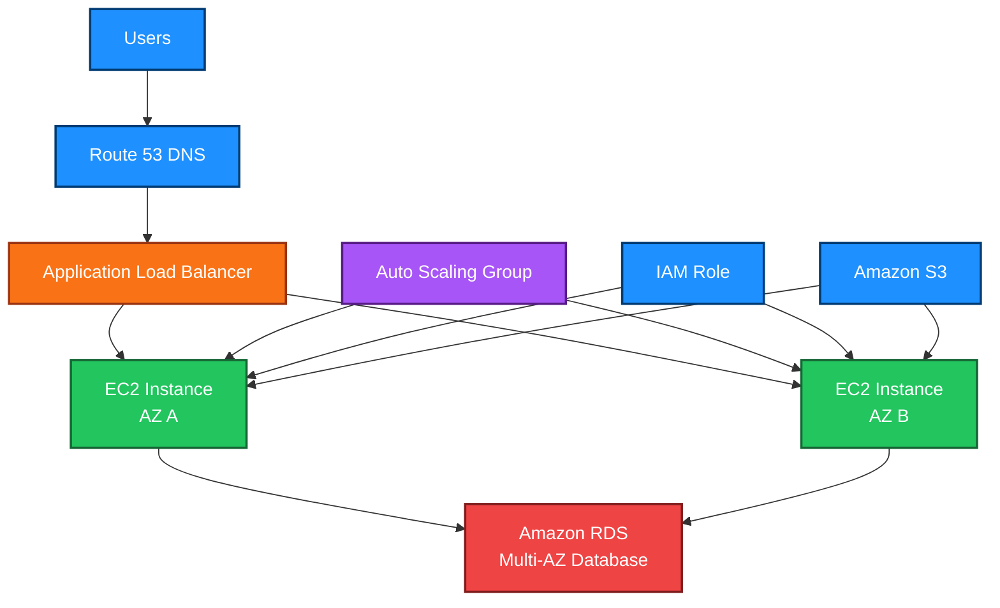

# EC2

<details>
<summary>## 1. Definition</summary>

## 1. Definition

### Simple Definition

Amazon EC2, or Elastic Compute Cloud, is a service that lets you rent virtual servers in AWS.

These virtual servers are called EC2 instances.

Instead of buying physical servers, you choose:
- CPU
- Memory
- Storage
- Network performance
- Operating system
- Pricing model

### Simple Analogy

EC2 is like renting a computer in the cloud.

You can:
- Start it when needed
- Stop it when not needed
- Resize it
- Install software
- Connect it to other AWS services

### Key Exam Idea

EC2 is an Infrastructure as a Service, or IaaS, service.

AWS manages the physical data center and hardware. You manage the operating system, applications, patches, and security configuration inside the instance.

</details>

<details>
<summary>## 2. What Problem Does It Solve?</summary>

## 2. What Problem Does It Solve?

### Main Problem

Before cloud computing, companies had to buy physical servers, wait for delivery, install hardware, and guess future capacity.

EC2 solves this by giving you compute capacity on demand.

### What EC2 Helps With

EC2 helps you:
- Run applications without buying servers
- Scale compute capacity up or down
- Choose different instance types for different workloads
- Pay only for the compute capacity you use
- Deploy servers across multiple Availability Zones

### Memory Hook

EC2 = Elastic Cloud Computers

Elastic means you can grow or shrink capacity when needed.

</details>

<details>
<summary>## 3. Core Use Cases</summary>

## 3. Core Use Cases

### Web Applications

Run web servers such as:
- NGINX
- Apache
- Node.js
- Java applications
- Python applications

### Application Servers

EC2 can host backend services, APIs, and business logic.

### Databases

You can run databases on EC2, but for the SAA exam, managed services like RDS are usually preferred when possible.

### Batch Processing

EC2 can run jobs such as:
- Data processing
- Image processing
- Report generation
- Machine learning workloads

### Development and Testing

EC2 is useful for temporary environments where developers need servers quickly.

### High-Performance Computing

Specialized EC2 instance types support workloads that need:
- High CPU
- Large memory
- GPUs
- Fast networking

</details>

<details>
<summary>## 4. Important Features for SAA</summary>

## 4. Important Features for SAA

### Instance Types

EC2 instance types are optimized for different workloads.

| Instance Family | Best For | Example Use Case |
|---|---|---|
| General Purpose | Balanced CPU, memory, and networking | Web servers, small databases |
| Compute Optimized | High CPU | Batch processing, gaming servers |
| Memory Optimized | High RAM | In-memory databases, caching |
| Storage Optimized | High disk I/O | Data warehouses, log processing |
| Accelerated Computing | GPUs or special hardware | Machine learning, graphics processing |

### AMI

An Amazon Machine Image, or AMI, is a template used to launch EC2 instances.

An AMI includes:
- Operating system
- Software packages
- Configuration
- Root volume settings

### User Data

User Data is a script that runs when an EC2 instance first starts.

Common uses:
- Install software
- Download application code
- Configure services
- Bootstrap web servers

Example:

```bash
#!/bin/bash
yum update -y
yum install -y httpd
systemctl start httpd
systemctl enable httpd
echo "Hello from EC2" > /var/www/html/index.html
```

### Instance Metadata

Instance metadata lets an EC2 instance get information about itself.

Examples:
- Instance ID
- Private IP
- Public IP
- IAM role credentials
- Availability Zone

For security, prefer IMDSv2 over IMDSv1.

### Elastic IP

An Elastic IP is a static public IPv4 address that you can attach to an EC2 instance.

Use it when you need a fixed public IP.

Important exam point:
- Elastic IPs can increase cost if allocated but unused.
- Prefer DNS names or load balancers when possible.

### Security Groups

Security groups act like virtual firewalls for EC2 instances.

They control inbound and outbound traffic.

Key points:
- Stateful
- Allow rules only
- Attached to ENIs or instances
- Return traffic is automatically allowed

### Key Pairs

Key pairs are used to connect securely to EC2 instances.

| Operating System | Common Access Method |
|---|---|
| Linux | SSH using private key |
| Windows | RDP using decrypted administrator password |

### EBS Volumes

Amazon EBS provides block storage for EC2.

Common EBS volume types:

| Volume Type | Use Case |
|---|---|
| gp3 | General-purpose SSD, common default choice |
| io1 / io2 | High-performance workloads needing provisioned IOPS |
| st1 | Throughput-heavy HDD workloads |
| sc1 | Low-cost cold HDD workloads |

### Instance Store

Instance store is temporary storage physically attached to the host.

Important:
- Very fast
- Data is lost if the instance stops, terminates, or the underlying host fails
- Not suitable for durable storage

### Placement Groups

Placement groups control how EC2 instances are placed on AWS hardware.

| Placement Group Type | Purpose |
|---|---|
| Cluster | Low-latency, high-throughput workloads |
| Spread | Separate instances across different hardware |
| Partition | Separate groups of instances across hardware partitions |

### Auto Scaling Group

An Auto Scaling Group automatically adds or removes EC2 instances based on demand.

It helps with:
- Scalability
- Availability
- Cost control
- Self-healing

### Load Balancer Integration

EC2 is often used behind Elastic Load Balancing.

Common pattern:

```text
Users → ALB → EC2 Auto Scaling Group
```

</details>

<details>
<summary>## 5. Security Model</summary>

## 5. Security Model

### IAM Permissions

IAM controls who can create, stop, start, terminate, and manage EC2 resources.

Examples:
- Allow users to start instances
- Deny users from terminating production instances
- Allow EC2 to access S3 using an IAM role

### IAM Roles for EC2

Do not store AWS access keys on EC2 instances.

Instead, attach an IAM role to the instance.

Example:

```text
EC2 instance → IAM Role → Access S3 bucket
```

This is more secure because AWS automatically rotates temporary credentials.

### Encryption Options

EC2 commonly uses EBS encryption for attached volumes.

EBS encryption protects:
- Data at rest
- Snapshots
- Volumes created from encrypted snapshots
- Data moving between the instance and the EBS volume

Encryption uses AWS KMS.

### Network Security Controls

EC2 network security includes:

| Control | Purpose |
|---|---|
| Security Group | Instance-level firewall |
| Network ACL | Subnet-level firewall |
| VPC | Private network boundary |
| Private Subnet | Keeps instances away from direct internet access |
| NAT Gateway | Lets private instances access the internet outbound |
| Bastion Host | Controlled SSH/RDP access to private instances |
| Systems Manager Session Manager | Secure access without opening SSH/RDP ports |

### Shared Responsibility

AWS is responsible for:
- Physical data centers
- Physical servers
- Networking infrastructure
- Hypervisor

You are responsible for:
- Operating system patches
- Application security
- Security group rules
- IAM permissions
- Data encryption choices
- Installed software

### Exam Tip

For secure EC2 access, prefer Systems Manager Session Manager when possible because it avoids opening inbound SSH or RDP ports.

</details>

<details>
<summary>## 6. High Availability / Durability Behavior</summary>

## 6. High Availability / Durability Behavior

### Availability

A single EC2 instance is not highly available by itself.

If the instance fails, the application may go down unless you design for redundancy.

### Multi-AZ Design

For high availability, deploy EC2 instances across multiple Availability Zones.

Common architecture:

```text
Application Load Balancer
        ↓
EC2 instances in multiple AZs
        ↓
Database or backend service
```

### Auto Scaling for Fault Tolerance

Auto Scaling Groups can replace unhealthy instances automatically.

If an instance fails:
1. Health check detects failure
2. Auto Scaling terminates unhealthy instance
3. Auto Scaling launches a replacement instance

### EBS Durability

EBS volumes are replicated within a single Availability Zone.

Important:
- EBS is durable within one AZ
- EBS volumes cannot be directly attached across AZs
- To move data to another AZ, use snapshots

### AMIs and Snapshots

You can create AMIs or EBS snapshots to recover or recreate instances.

Snapshots are stored in Amazon S3 behind the scenes, but you manage them through EBS.

### Multi-Region Behavior

EC2 instances are regional resources but run inside specific Availability Zones.

For multi-region disaster recovery:
- Copy AMIs to another Region
- Copy snapshots to another Region
- Use Route 53 failover
- Use infrastructure as code to recreate environments

### Memory Hook

One EC2 instance = not highly available

Multiple EC2 instances across multiple AZs = highly available

</details>

<details>
<summary>## 7. Cost Optimization Options</summary>

## 7. Cost Optimization Options

### EC2 Pricing Models

| Pricing Model | Best For | Key Idea |
|---|---|---|
| On-Demand | Short-term or unpredictable workloads | Pay per use, no commitment |
| Reserved Instances | Steady workloads | Commit for 1 or 3 years |
| Savings Plans | Flexible long-term compute usage | Commit to hourly spend |
| Spot Instances | Fault-tolerant workloads | Cheapest, but can be interrupted |
| Dedicated Hosts | Compliance or licensing needs | Physical server dedicated to you |
| Dedicated Instances | Instance isolation | Runs on dedicated hardware |

### On-Demand Instances

Use On-Demand when:
- Workload is unpredictable
- You need flexibility
- You are testing or learning
- You do not want long-term commitment

### Reserved Instances

Use Reserved Instances when:
- Usage is steady
- You can commit for 1 or 3 years
- You want lower cost than On-Demand

### Savings Plans

Savings Plans are often more flexible than Reserved Instances.

They are good when you know your compute spend but want flexibility across instance families, sizes, or services depending on the plan type.

### Spot Instances

Spot Instances are the cheapest option but can be interrupted by AWS.

Good for:
- Batch jobs
- Big data processing
- CI/CD workers
- Fault-tolerant workloads

Bad for:
- Critical databases
- Stateful applications
- Workloads that cannot handle interruption

### Right Sizing

Choose the correct instance size.

Avoid:
- Over-provisioning CPU
- Over-provisioning memory
- Running idle instances

### Stop Unused Instances

You can stop instances when they are not needed.

Important:
- Stopped instances do not charge for EC2 compute
- Attached EBS volumes still cost money
- Elastic IPs may cost money if unused or incorrectly attached

### Use Auto Scaling

Auto Scaling helps reduce cost by running only the number of instances needed.

### Use gp3 Instead of gp2 When Appropriate

For many workloads, gp3 can be more cost-effective because performance can be configured independently from storage size.

</details>

<details>
<summary>## 8. Common Exam Traps</summary>

## 8. Common Exam Traps

### Trap 1: EC2 Is Not Automatically Highly Available

A single EC2 instance can fail.

For high availability, use:
- Multiple EC2 instances
- Multiple Availability Zones
- Load balancer
- Auto Scaling Group

### Trap 2: Security Groups Are Stateful

If inbound traffic is allowed, the response traffic is automatically allowed.

You do not need a separate outbound rule for return traffic in normal cases.

### Trap 3: NACLs Are Stateless

Network ACLs require both inbound and outbound rules.

Do not confuse them with security groups.

### Trap 4: Instance Store Is Temporary

Instance store data is not durable.

Do not use it for important data unless the data is replicated or temporary.

### Trap 5: EBS Is AZ-Specific

An EBS volume exists in one Availability Zone.

You cannot directly attach an EBS volume from one AZ to an EC2 instance in another AZ.

### Trap 6: Public IP Changes After Stop and Start

For many EC2 instances, the public IPv4 address changes after stopping and starting.

Use an Elastic IP if you need a fixed public IP.

### Trap 7: IAM Role Is Better Than Access Keys

Never hardcode AWS access keys on EC2.

Use an IAM role attached to the instance.

### Trap 8: Spot Instances Can Be Interrupted

Spot is cheap, but AWS can reclaim capacity.

Use Spot only for workloads that can tolerate interruption.

### Trap 9: Stopping Is Not the Same as Terminating

| Action | Result |
|---|---|
| Stop | Instance shuts down, EBS root volume usually remains |
| Start | Instance boots again |
| Terminate | Instance is deleted |

### Trap 10: User Data Runs at First Boot by Default

User Data normally runs only during the first launch unless configured otherwise.

</details>

<details>
<summary>## 9. Compare With Similar Services</summary>

## 9. Compare With Similar Services

### EC2 vs Similar AWS Compute Services

| Service | What It Is | Choose It When |
|---|---|---|
| EC2 | Virtual servers | You need full control over OS and runtime |
| Lambda | Serverless functions | You want event-driven code without managing servers |
| ECS | Container orchestration | You want to run Docker containers |
| EKS | Managed Kubernetes | You need Kubernetes on AWS |
| Elastic Beanstalk | Platform as a Service | You want AWS to manage deployment infrastructure |
| Lightsail | Simplified VPS service | You need a simple low-cost server |
| Fargate | Serverless container compute | You want containers without managing EC2 instances |

### EC2 vs Lambda

| Feature | EC2 | Lambda |
|---|---|---|
| Server management | You manage server | AWS manages server |
| Runtime duration | Long-running | Short-lived functions |
| Scaling | Manual or Auto Scaling | Automatic |
| Control | High | Lower |
| Best for | Full applications, custom environments | Event-driven tasks |

### EC2 vs ECS

| Feature | EC2 | ECS |
|---|---|---|
| Main purpose | Virtual machines | Containers |
| You manage OS | Yes | Sometimes, if using EC2 launch type |
| Best for | Traditional server workloads | Containerized apps |

### EC2 vs Elastic Beanstalk

| Feature | EC2 | Elastic Beanstalk |
|---|---|---|
| Abstraction level | Lower-level | Higher-level |
| Control | More control | Less manual setup |
| Best for | Custom infrastructure | Simple app deployment |

### Exam Decision Guide

| Requirement | Best Choice |
|---|---|
| Full OS control | EC2 |
| Run code without servers | Lambda |
| Run containers without managing servers | ECS with Fargate |
| Run Kubernetes | EKS |
| Simple web app deployment | Elastic Beanstalk |
| Simple VPS-like hosting | Lightsail |

</details>

<details>
<summary>## 10. Mini Architecture Example</summary>

## 10. Mini Architecture Example

### Scenario

A company wants to host a highly available web application using EC2.

Requirements:
- Users access the app from the internet
- App must survive instance failure
- App must run across multiple Availability Zones
- Instances should scale based on traffic
- EC2 instances should not store AWS access keys

### Architecture



### How It Works

1. Users access the application through Route 53.
2. Route 53 sends traffic to the Application Load Balancer.
3. The load balancer distributes traffic across EC2 instances in multiple AZs.
4. Auto Scaling adds or removes EC2 instances based on demand.
5. EC2 instances connect to RDS for database storage.
6. EC2 instances use IAM roles to access AWS services like S3 securely.

### Why This Is Good for SAA

This architecture demonstrates:
- High availability across multiple AZs
- Fault tolerance with Auto Scaling
- Secure access using IAM roles
- Better traffic distribution using a load balancer
- Separation of compute, database, and storage layers

### Final Memory Hook

EC2 exam pattern:

```text
Need full server control? Choose EC2.
Need high availability? Use multiple AZs + ALB + Auto Scaling.
Need secure AWS access? Use IAM roles, not access keys.
Need cheaper compute? Choose Reserved, Savings Plans, or Spot based on workload.
```

</details>