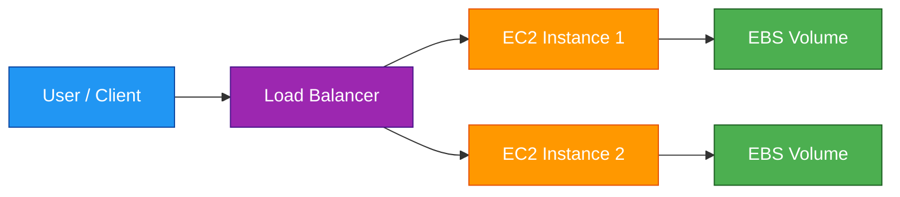
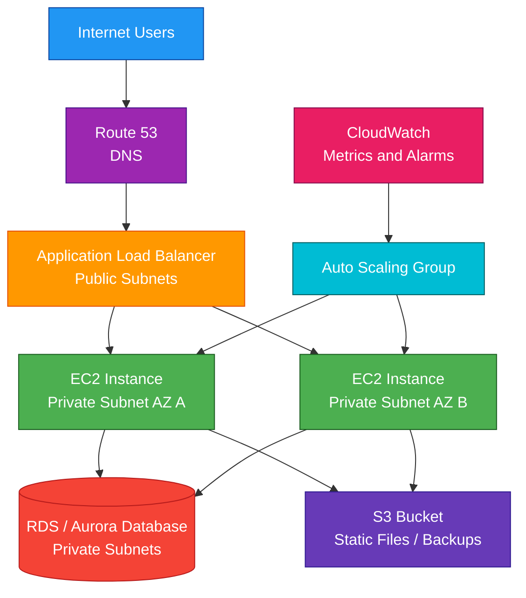

# EC2

## 1. Definition

### Simple Definition

Amazon EC2, or Elastic Compute Cloud, is AWS’s virtual server service.

It lets you rent virtual machines in the cloud to run applications, websites, databases, scripts, containers, and custom workloads.

### Memory Hook

EC2 = Elastic Cloud Computers.

### Basic Idea

Instead of buying physical servers, you launch EC2 instances in AWS.

You choose:

- Instance type
- Operating system
- Storage
- Network settings
- Security rules
- Scaling options

## 2. What Problem Does It Solve?

### Main Problem

EC2 solves the problem of needing flexible compute capacity without buying or managing physical hardware.

You can launch servers quickly, scale them up or down, and pay only for what you use.

### Without EC2

You may need to:

- Buy physical servers
- Wait for hardware delivery
- Manage data center space
- Handle hardware failures
- Overprovision capacity for peak traffic
- Manually scale infrastructure

### With EC2

You can:

- Launch servers in minutes
- Choose different CPU, memory, storage, and network sizes
- Scale capacity based on demand
- Run many operating systems
- Stop, start, terminate, or replace servers easily

### Key Benefit

EC2 gives you flexible, resizable compute power in the AWS cloud.

## 3. Core Use Cases

### Web Applications

Run websites, APIs, and backend services on EC2 instances.

Common design:

- ALB in public subnets
- EC2 instances in private subnets
- Auto Scaling Group across multiple AZs

### Custom Applications

Use EC2 when you need control over the operating system, runtime, installed packages, or server configuration.

### Lift-and-Shift Migration

Move existing applications from on-premises servers to EC2 with minimal changes.

### Batch Processing

Run compute-heavy jobs such as:

- Data processing
- Rendering
- Simulations
- Scheduled scripts

### Development and Testing

Launch temporary EC2 instances for dev/test environments.

Stop or terminate them when not needed to reduce cost.

### Hosting Containers

EC2 can run container platforms such as:

- Docker
- ECS on EC2
- EKS worker nodes
- Self-managed Kubernetes

### High-Performance Computing

Use specialized EC2 instance types for workloads needing high CPU, GPU, memory, or networking performance.

## 4. Important Features for SAA

### Instance

An EC2 instance is a virtual server.

It runs an operating system and applications.

### AMI

An Amazon Machine Image, or AMI, is a template used to launch an EC2 instance.

It includes:

- Operating system
- Software packages
- Configuration
- Root volume template

### Instance Types

Instance types define the compute, memory, storage, and network capacity of the instance.

| Family | Best For | Example |
|---|---|---|
| General Purpose | Balanced workloads | Web servers, small databases |
| Compute Optimized | CPU-heavy workloads | Gaming, batch processing |
| Memory Optimized | Memory-heavy workloads | In-memory databases |
| Storage Optimized | High disk throughput | Big data, data warehouses |
| Accelerated Computing | GPU/ML workloads | Machine learning, graphics |

### User Data

User data is a script that runs when an instance launches.

Common uses:

- Install packages
- Start services
- Configure applications
- Download application code

### Key Pairs

Key pairs are used to securely connect to EC2 instances.

Common use:

- SSH for Linux
- Administrator password decryption for Windows

### Security Groups

Security groups act as virtual firewalls for EC2 instances.

Important points:

- Stateful
- Allow rules only
- Attached to ENIs
- Return traffic is automatically allowed

### Instance Metadata

Instance metadata provides information about the instance from inside the instance.

Examples:

- Instance ID
- Region
- Availability Zone
- IAM role credentials

### IMDSv2

Instance Metadata Service Version 2, or IMDSv2, is more secure than IMDSv1 because it uses session tokens.

Exam tip:

Prefer IMDSv2 for better security.

### IAM Role for EC2

Use an IAM role to give an EC2 instance permissions to access AWS services.

Example:

An EC2 instance needs to read files from S3.

Best practice:

Attach an IAM role to the instance instead of storing access keys on the server.

### Elastic IP

An Elastic IP is a static public IPv4 address.

Use it when an EC2 instance or NAT Gateway needs a fixed public IP.

Exam tip:

Unused Elastic IPs can create cost.

### Public IP vs Private IP

| IP Type | Purpose |
|---|---|
| Private IP | Internal VPC communication |
| Public IP | Internet communication |
| Elastic IP | Static public IPv4 address |

### EBS Volumes

Elastic Block Store, or EBS, provides persistent block storage for EC2.

Important points:

- Network-attached storage
- Persists independently from the instance if configured
- Used for root and data volumes
- Can be snapshotted

### Instance Store

Instance store provides temporary storage physically attached to the host.

Important points:

- Very fast
- Temporary
- Data is lost when the instance stops, terminates, or underlying hardware fails
- Good for cache, buffers, and temporary data

### Placement Groups

Placement groups control how EC2 instances are placed on AWS hardware.

| Type | Best For |
|---|---|
| Cluster | Low-latency, high-throughput workloads |
| Spread | Critical instances separated across hardware |
| Partition | Large distributed systems like Hadoop or Cassandra |

### Auto Scaling Group

An Auto Scaling Group automatically adjusts the number of EC2 instances.

It can:

- Add instances when demand increases
- Remove instances when demand decreases
- Replace unhealthy instances
- Spread instances across Availability Zones

### Load Balancer Integration

EC2 is commonly used with Elastic Load Balancing.

A load balancer distributes traffic across multiple EC2 instances.

### Launch Template

A launch template defines how EC2 instances should be launched.

It can include:

- AMI
- Instance type
- Key pair
- Security groups
- User data
- IAM role
- Storage settings

### Hibernation

EC2 hibernation saves memory state to the root EBS volume.

When started again, the instance resumes faster than a normal boot.

Useful when applications take a long time to initialize.

## 5. Security Model

### IAM Permissions

IAM controls who can create, modify, start, stop, terminate, and manage EC2 resources.

Common permissions:

| Permission | Purpose |
|---|---|
| `ec2:RunInstances` | Launch instances |
| `ec2:StartInstances` | Start instances |
| `ec2:StopInstances` | Stop instances |
| `ec2:TerminateInstances` | Terminate instances |
| `ec2:CreateSecurityGroup` | Create security groups |
| `ec2:AuthorizeSecurityGroupIngress` | Add inbound security group rules |

### EC2 IAM Role

Use IAM roles for applications running on EC2.

Do not store AWS access keys directly on the instance.

### Security Groups

Security groups control inbound and outbound traffic at the instance or ENI level.

Example web server rules:

| Direction | Rule |
|---|---|
| Inbound | Allow HTTPS from internet |
| Inbound | Allow SSH only from trusted IP |
| Outbound | Allow required outbound traffic |

### Network ACLs

Network ACLs provide subnet-level traffic filtering.

They are:

- Stateless
- Allow and deny rules
- Applied at subnet level

### Key Pair Security

Protect private keys carefully.

If a private key is lost, you cannot directly download it again from AWS.

### Systems Manager Session Manager

Session Manager allows secure access to EC2 instances without opening SSH or RDP ports.

This is often better than using a bastion host.

### Encryption at Rest

Use EBS encryption to protect EC2 volume data.

EBS encryption can protect:

- Root volumes
- Data volumes
- Snapshots
- Volumes created from encrypted snapshots

### Encryption in Transit

Use secure protocols for network traffic.

Examples:

- SSH
- HTTPS
- TLS
- VPN
- IPsec

### Patch Management

You are responsible for patching the operating system and applications on EC2.

AWS manages the physical host infrastructure.

### Shared Responsibility

AWS is responsible for:

- Physical servers
- Data center security
- Underlying networking
- Hardware maintenance
- Hypervisor infrastructure

You are responsible for:

- Operating system patches
- Application patches
- Security group rules
- IAM roles and permissions
- Data encryption
- Key pair security
- Installed software
- Firewall and access configuration inside the instance

## 6. High Availability / Durability Behavior

### Availability

An EC2 instance runs in one Availability Zone.

If that AZ has a problem, the instance can be affected.

For high availability, run multiple instances across multiple AZs.

### Multi-AZ Design

A common high-availability design uses:

- Auto Scaling Group across multiple AZs
- Application Load Balancer in multiple public subnets
- EC2 instances in private subnets
- Health checks to replace unhealthy instances

### Fault Tolerance

EC2 itself is not automatically fault tolerant as a single instance.

You design fault tolerance using:

- Multiple instances
- Multiple Availability Zones
- Load balancers
- Auto Scaling Groups
- Backups and AMIs
- Stateless application design

### Auto Recovery

EC2 auto recovery can recover an impaired instance on different underlying hardware.

This helps with some instance-level failures.

### EBS Durability

EBS volumes are replicated within the same Availability Zone.

Important point:

EBS is AZ-scoped, not Region-scoped.

### EBS Snapshots

EBS snapshots are stored in S3-managed infrastructure and can be used to restore volumes.

Snapshots are useful for backup and disaster recovery.

### Instance Store Durability

Instance store is temporary.

Data can be lost when:

- Instance stops
- Instance terminates
- Hardware fails

Do not store critical data only on instance store.

### Multi-Region Behavior

EC2 instances are regional and AZ-specific resources.

For Multi-Region architectures, deploy separate EC2 fleets in each Region and use Route 53 or Global Accelerator for routing.

### Stateless Design

For high availability, keep EC2 application servers stateless when possible.

Store state in durable services such as:

- RDS
- Aurora
- DynamoDB
- S3
- EFS
- ElastiCache

## 7. Cost Optimization Options

### Choose the Right Purchasing Option

EC2 has several pricing models.

| Option | Best For |
|---|---|
| On-Demand | Short-term, unpredictable workloads |
| Reserved Instances | Steady-state workloads |
| Savings Plans | Flexible long-term compute savings |
| Spot Instances | Fault-tolerant, flexible workloads |
| Dedicated Hosts | Compliance or licensing needs |

### On-Demand Instances

On-Demand instances are flexible and require no long-term commitment.

Use them for:

- Testing
- Short-term workloads
- Unpredictable workloads

### Reserved Instances

Reserved Instances provide discounts for steady workloads.

Use them when you know the instance family, Region, and usage pattern.

### Savings Plans

Savings Plans provide discounts in exchange for a committed hourly spend.

They are more flexible than traditional Reserved Instances.

### Spot Instances

Spot Instances use spare AWS capacity at a large discount.

Best for workloads that can handle interruption.

Examples:

- Batch jobs
- Big data processing
- CI/CD workers
- Image rendering
- Stateless workers

### Spot Interruption

Spot Instances can be interrupted when AWS needs the capacity back.

Your application should handle interruption gracefully.

### Auto Scaling for Cost

Use Auto Scaling to match capacity to demand.

This avoids running too many instances during low traffic periods.

### Right-Sizing

Choose instance types based on actual CPU, memory, network, and disk usage.

Use monitoring tools to identify overprovisioned instances.

### Stop Unused Instances

Stop development and test instances when they are not needed.

Terminating removes the instance.

Stopping keeps EBS-backed data but stops compute charges.

### Use Graviton Instances

AWS Graviton-based instances can offer strong price-performance for supported workloads.

Use them when your application can run on ARM architecture.

### Use EBS Efficiently

Reduce storage cost by:

- Deleting unused EBS volumes
- Deleting old snapshots
- Choosing the right EBS volume type
- Avoiding overprovisioned IOPS

## 8. Common Exam Traps

### Stop vs Terminate

| Action | Meaning |
|---|---|
| Stop | Instance shuts down but can be started again |
| Terminate | Instance is deleted |

Exam tip:

EBS root volume deletion depends on the `DeleteOnTermination` setting.

### Reboot vs Stop/Start

| Action | Effect |
|---|---|
| Reboot | Same host usually, instance stays running logically |
| Stop/Start | Instance may move to new underlying host |

### Instance Store Data Is Temporary

Instance store data is not durable.

If the instance stops or fails, the data can be lost.

### EBS Is AZ-Scoped

An EBS volume exists in one Availability Zone.

To move data to another AZ or Region, use snapshots.

### Security Groups Are Stateful

Return traffic is automatically allowed.

You do not need to create separate inbound rules for response traffic.

### NACLs Are Stateless

NACLs require both inbound and outbound rules.

Return traffic must be explicitly allowed.

### Public Subnet Requirement

An EC2 instance needs more than a public IP to access the internet.

It also needs:

- Subnet route to Internet Gateway
- Security group allowing traffic
- NACL allowing traffic

### Private Instance Internet Access

An EC2 instance in a private subnet needs a NAT Gateway or NAT instance for outbound internet access.

### IAM Role Is Better Than Access Keys

For applications on EC2, use IAM roles.

Do not store long-term AWS access keys on the instance.

### Placement Group Types Are Different

| Type | Exam Clue |
|---|---|
| Cluster | Low latency and high throughput |
| Spread | Separate critical instances |
| Partition | Large distributed workloads |

### Spot Is Not for Critical Uninterruptible Workloads

Spot Instances can be interrupted.

Do not choose Spot for workloads that cannot tolerate interruption.

### AMI Is Regional

AMIs are regional.

To use an AMI in another Region, copy it to that Region.

## 9. Compare With Similar Services

### Service Comparison Table

| Service | Main Purpose | Best For | Choose When |
|---|---|---|---|
| EC2 | Virtual servers | Full control over compute | You need OS-level control or custom server setup |
| Lambda | Serverless functions | Event-driven short tasks | You want to run code without managing servers |
| ECS | Container orchestration | Running Docker containers | You want managed container scheduling |
| EKS | Managed Kubernetes | Kubernetes workloads | You need Kubernetes compatibility |
| Fargate | Serverless containers | Containers without managing EC2 | You want containers but no server management |
| Elastic Beanstalk | Managed app platform | Easy app deployment | You want AWS to manage app infrastructure |
| Lightsail | Simple VPS | Simple websites/apps | You want simplified cloud servers |

### EC2 vs Lambda

| Feature | EC2 | Lambda |
|---|---|---|
| Server management | You manage OS and runtime | AWS manages servers |
| Runtime duration | Long-running supported | Max 15 minutes |
| Scaling | You configure | Automatic |
| Best for | Custom servers and long-running apps | Event-driven functions |
| Pricing | Pay for instance runtime | Pay per request and duration |

### EC2 vs ECS/Fargate

| Feature | EC2 | ECS on Fargate |
|---|---|---|
| Workload style | Virtual machines | Containers |
| Server management | You manage instances | AWS manages serverless compute |
| Control | More OS-level control | Less infrastructure control |
| Best for | Traditional apps | Containerized apps without server management |

### EC2 vs Elastic Beanstalk

| Feature | EC2 | Elastic Beanstalk |
|---|---|---|
| Level | Infrastructure | Platform |
| Control | High | Moderate |
| Management | Manual setup | AWS provisions common resources |
| Best for | Custom infrastructure | Quick app deployment |

### EC2 vs Lightsail

| Feature | EC2 | Lightsail |
|---|---|---|
| Flexibility | High | Simplified |
| Networking | Advanced VPC control | Simpler networking |
| Best for | Enterprise/cloud-native workloads | Simple websites or small apps |
| Exam focus | Very important | Less common for SAA |

### When to Choose EC2

Choose EC2 when:

- You need virtual machines
- You need OS-level control
- You need long-running compute
- You need custom software installation
- You are migrating traditional servers
- You need specific instance types such as GPU or high-memory
- Lambda or Fargate does not fit the workload

## 10. Mini Architecture Example

### Scenario

A company wants to run a highly available web application on EC2.

Users should access the application through a load balancer, and EC2 instances should scale automatically based on demand.

### Architecture

Use an Application Load Balancer across public subnets and EC2 instances in private subnets across multiple Availability Zones.

An Auto Scaling Group launches and replaces EC2 instances.

### Why This Is Good

- Load balancer distributes traffic across instances
- EC2 instances run in private subnets
- Auto Scaling adds or removes capacity automatically
- Multi-AZ design improves availability
- CloudWatch alarms can trigger scaling actions
- Database remains private
- S3 stores static files or backups durably

### Exam Answer Pattern

If the question says:

“Run a traditional application with full control over the operating system and scale it across multiple Availability Zones.”

Think:

EC2 with Auto Scaling Group and Elastic Load Balancer.

### Final Memory Hook

EC2 is for virtual servers.

AMI is the server template.

EBS is persistent block storage.

Instance store is temporary storage.

Security groups protect instances.

Auto Scaling adjusts capacity.

ELB distributes traffic.

