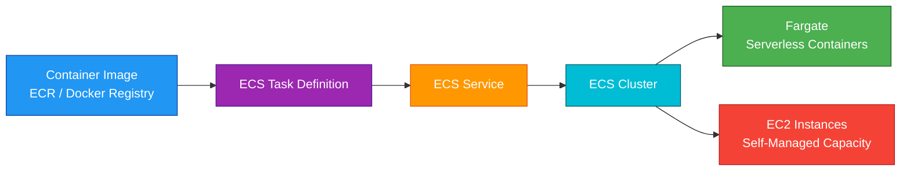
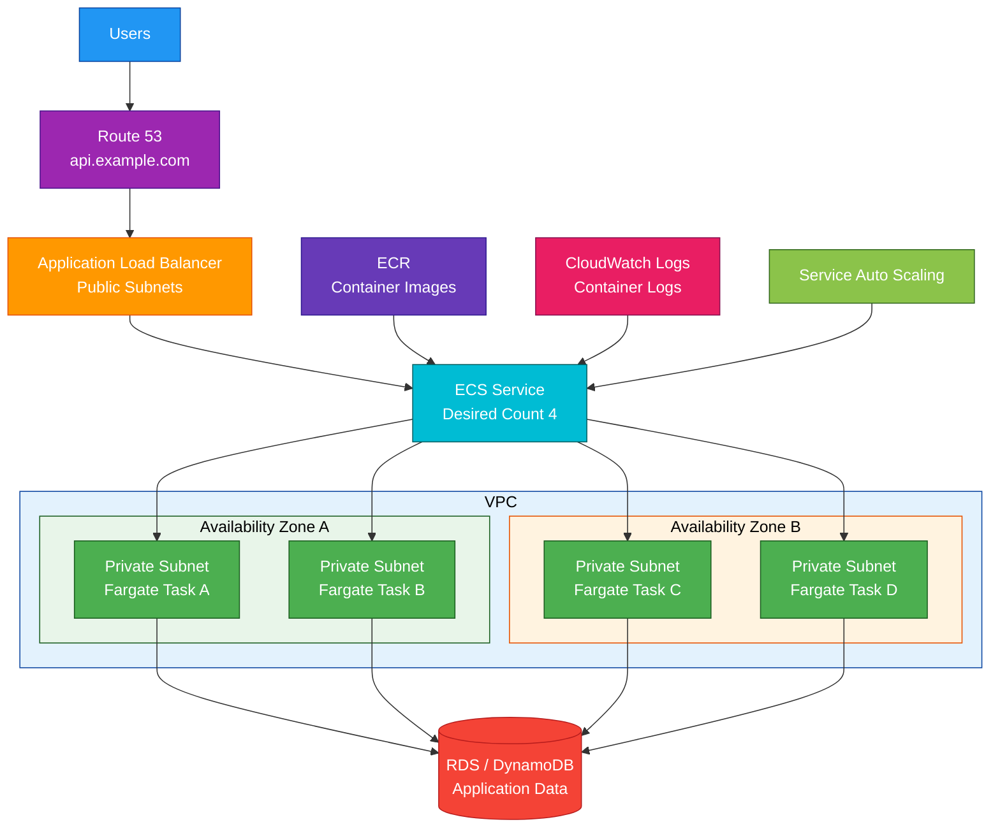

# ECS

## 1. Definition

### Simple Definition

Amazon ECS, or Elastic Container Service, is AWS’s managed container orchestration service.

It helps you run, manage, scale, and deploy Docker containers on AWS.

### Memory Hook

ECS = Elastic Container Service = Run containers on AWS.

### Basic Idea

You package your application as a container image.

ECS runs that container as a task or service using either AWS Fargate or EC2 instances.

### Key Point

ECS is for running containers.

You do not need to manage Kubernetes when using ECS.

## 2. What Problem Does It Solve?

### Main Problem

ECS solves the problem of running and scaling containerized applications without manually managing every container process yourself.

### Without ECS

You may need to manually handle:

- Starting containers
- Stopping containers
- Restarting failed containers
- Scaling containers
- Service discovery
- Load balancer registration
- Rolling deployments
- Container placement
- Cluster capacity management

### With ECS

ECS manages container scheduling and service orchestration.

You define what should run, and ECS keeps it running.

### Key Benefit

ECS gives you a managed way to run containers reliably on AWS.

## 3. Core Use Cases

### Microservices

Use ECS to run microservices as separate containerized services.

Example:

- User service
- Order service
- Payment service
- Notification service

### Web Applications

Use ECS with an Application Load Balancer to run web apps and APIs.

Example:

Users → ALB → ECS service → containers

### Background Workers

Use ECS tasks to process background jobs.

Examples:

- Queue workers
- Report generation
- File processing
- Batch-style tasks

### Scheduled Tasks

Use EventBridge to run ECS tasks on a schedule.

Examples:

- Nightly cleanup job
- Daily report generation
- Periodic sync task

### Container Migration

Use ECS when migrating Docker-based applications to AWS.

### Serverless Containers

Use ECS with Fargate when you want containers without managing EC2 instances.

### Hybrid Container Workloads

Use ECS Anywhere when you need to manage containers outside AWS, such as on-premises servers.

## 4. Important Features for SAA

### Cluster

An ECS cluster is a logical group where ECS tasks and services run.

A cluster can use:

- Fargate capacity
- EC2 capacity
- External capacity with ECS Anywhere

### Task Definition

A task definition is a blueprint for running containers.

It defines:

- Container image
- CPU and memory
- Ports
- Environment variables
- IAM roles
- Logging configuration
- Volumes
- Networking mode

### Task

A task is a running copy of a task definition.

Think of a task as one running container workload.

A task can include one or more containers.

### Container

A container is the actual packaged application process.

Examples:

- Node.js API container
- NGINX container
- Python worker container
- Sidecar logging container

### Service

An ECS service keeps a desired number of tasks running.

Example:

If desired count is 4, ECS tries to keep 4 healthy tasks running.

### Desired Count

Desired count means how many copies of a task should run.

Example:

Desired count = 3 means ECS should keep 3 tasks running.

### Launch Types

ECS supports two major launch types.

| Launch Type | Meaning | Best For |
|---|---|---|
| Fargate | Serverless containers | Less infrastructure management |
| EC2 | Containers on your EC2 instances | More control over instances and cost |

### Fargate

Fargate lets you run containers without managing servers.

Important points:

- No EC2 instance management
- Pay for task CPU and memory
- Good for serverless container workloads
- Easier operations
- Common SAA default when server management should be minimized

### EC2 Launch Type

With EC2 launch type, you run containers on EC2 instances in your ECS cluster.

Important points:

- You manage EC2 capacity
- More control over instance type
- Can use Reserved Instances, Savings Plans, or Spot
- Useful for specialized workloads or cost optimization

### Capacity Providers

Capacity providers help ECS manage infrastructure capacity.

They can work with:

- Fargate
- Fargate Spot
- EC2 Auto Scaling Groups

Use capacity providers to control where tasks run and how capacity scales.

### Fargate Spot

Fargate Spot runs interruptible Fargate tasks at lower cost.

Best for:

- Fault-tolerant workloads
- Background workers
- Batch jobs
- Non-critical tasks

Do not use Fargate Spot for workloads that cannot tolerate interruption.

### Task Role

The task role gives permissions to the application running inside the container.

Example:

A container needs to read from DynamoDB.

Give `dynamodb:GetItem` permission to the task role.

### Task Execution Role

The task execution role gives ECS permissions needed to start the task.

Examples:

- Pull image from ECR
- Send logs to CloudWatch Logs
- Retrieve secrets during startup

### Task Role vs Task Execution Role

| Role | Used By | Purpose |
|---|---|---|
| Task Role | Application container | Access AWS services |
| Task Execution Role | ECS agent / Fargate | Start and manage the task |

### Container Image

ECS runs containers from images.

Common image source:

- Amazon ECR
- Docker Hub
- Private container registries

### Amazon ECR

Amazon Elastic Container Registry stores container images.

Common pattern:

1. Build Docker image.
2. Push image to ECR.
3. ECS pulls image from ECR.
4. ECS runs container.

### Networking Modes

ECS supports several networking modes, but `awsvpc` is very important.

With `awsvpc` mode:

- Each task gets its own Elastic Network Interface
- Each task gets its own private IP
- Security groups can apply to tasks
- Required for Fargate

### Load Balancing

ECS integrates with Elastic Load Balancing.

Common choices:

| Load Balancer | Best For |
|---|---|
| Application Load Balancer | HTTP/HTTPS services |
| Network Load Balancer | TCP/UDP or high-performance workloads |

### Service Discovery

ECS can use AWS Cloud Map for service discovery.

This lets services find each other using DNS names.

Example:

`orders.local` points to the running order service tasks.

### Auto Scaling

ECS services can scale automatically.

Common scaling metrics:

- CPU utilization
- Memory utilization
- ALB request count per target
- Custom CloudWatch metrics
- SQS queue depth for workers

### Deployment Types

ECS supports deployment options such as:

| Deployment Type | Description |
|---|---|
| Rolling update | Gradually replaces old tasks with new tasks |
| Blue/green deployment | Uses CodeDeploy to shift traffic between versions |

### Rolling Deployment

Rolling deployment replaces old tasks with new tasks gradually.

This helps avoid downtime.

### Blue/Green Deployment

Blue/green deployment creates a new version alongside the old one.

Traffic is shifted to the new version after validation.

This is safer but more complex.

### Logs

ECS commonly sends container logs to CloudWatch Logs.

This helps with:

- Debugging
- Monitoring
- Auditing
- Troubleshooting

### Secrets

ECS can inject secrets from:

- AWS Secrets Manager
- Systems Manager Parameter Store

Use this instead of hardcoding secrets in container images.

### Persistent Storage

ECS tasks are often stateless.

For persistent or shared storage, use services such as:

- Amazon EFS
- S3
- RDS
- DynamoDB
- Aurora

### EFS with ECS

ECS can mount Amazon EFS volumes into containers.

Use this when multiple tasks need shared file storage.

## 5. Security Model

### IAM Permissions

IAM controls who can create and manage ECS resources.

Common permissions:

| Permission | Purpose |
|---|---|
| `ecs:CreateCluster` | Create ECS cluster |
| `ecs:RegisterTaskDefinition` | Register task definition |
| `ecs:RunTask` | Run one-off task |
| `ecs:CreateService` | Create ECS service |
| `ecs:UpdateService` | Update ECS service |
| `ecs:StopTask` | Stop running task |

### Task Role Security

Use a task role to give each application only the AWS permissions it needs.

Example:

The payment service should not have access to all S3 buckets if it only needs one DynamoDB table.

### Execution Role Security

Use the execution role for ECS platform actions such as pulling images and sending logs.

Do not confuse it with the application task role.

### Security Groups

With `awsvpc` networking, ECS tasks can have security groups.

Example:

- ALB security group allows inbound HTTPS from internet
- ECS task security group allows inbound traffic only from ALB security group
- Database security group allows inbound traffic only from ECS task security group

### Private Subnets

Best practice for production:

- Put public load balancer in public subnets
- Put ECS tasks in private subnets
- Use NAT Gateway or VPC endpoints for outbound access when needed

### Encryption in Transit

Use TLS/HTTPS for communication:

- User to load balancer
- Load balancer to ECS tasks, if end-to-end encryption is required
- ECS tasks to databases or APIs

### Encryption at Rest

ECS itself runs containers, but data encryption depends on related services.

Examples:

- ECR image encryption
- CloudWatch Logs encryption
- EFS encryption
- EBS encryption for EC2 launch type
- RDS or DynamoDB encryption

### Secrets Management

Do not store secrets in container images or plaintext environment variables.

Use:

- AWS Secrets Manager
- Systems Manager Parameter Store
- KMS encryption

### Image Security

Use secure container image practices:

- Use trusted base images
- Keep images updated
- Scan images in ECR
- Avoid putting secrets in images
- Use least privilege inside containers

### Shared Responsibility

AWS is responsible for:

- ECS control plane
- Fargate infrastructure when using Fargate
- Managed service availability
- Physical security
- Service operations

You are responsible for:

- Container image security
- IAM task roles
- Security groups
- VPC design
- Secrets handling
- Application security
- Logging and monitoring
- EC2 instance patching when using EC2 launch type

## 6. High Availability / Durability Behavior

### Availability

ECS is a regional service.

It can run tasks across multiple Availability Zones when configured with subnets in multiple AZs.

### Multi-AZ Design

For high availability, run ECS services in at least two Availability Zones.

Common design:

- ALB in public subnets across multiple AZs
- ECS tasks in private subnets across multiple AZs
- Service desired count greater than 1

### Fargate High Availability

With Fargate, AWS manages the compute infrastructure.

You still choose subnets across AZs so tasks can be placed across multiple AZs.

### EC2 Launch Type High Availability

With EC2 launch type, you must make the EC2 capacity highly available.

Use:

- Auto Scaling Groups
- Multiple AZs
- ECS capacity providers
- Health checks
- Multiple container instances

### Service Recovery

If a task fails, ECS service scheduler can start a replacement task.

This helps keep the desired count running.

### Load Balancer Health Checks

When ECS is behind an ALB or NLB, unhealthy tasks are removed from traffic.

ECS can replace unhealthy tasks.

### Multi-Region Behavior

ECS clusters are regional.

For Multi-Region applications, deploy separate ECS services in multiple Regions and route traffic using:

- Route 53
- CloudFront
- AWS Global Accelerator

### Durability

ECS is a compute orchestration service, not durable storage.

Do not store important data only inside containers.

Use durable storage such as:

- S3
- EFS
- RDS
- Aurora
- DynamoDB

### Stateless Design

Containers should usually be stateless.

This allows ECS to replace, scale, and redeploy tasks safely.

### Important Exam Point

ECS improves application availability when combined with Multi-AZ subnets, desired count, health checks, and load balancing.

## 7. Cost Optimization Options

### Choose Fargate for Lower Operations

Fargate reduces operational effort because you do not manage EC2 instances.

It can be cost-effective for variable or smaller workloads.

### Choose EC2 for More Cost Control

EC2 launch type can be cheaper for steady, high-utilization workloads if you manage capacity well.

You can use:

- Reserved Instances
- Savings Plans
- Spot Instances
- Custom instance types

### Use Fargate Spot

Use Fargate Spot for interruptible workloads.

Good examples:

- Background jobs
- Batch processing
- Non-critical workers
- Dev/test tasks

### Use EC2 Spot Instances

With EC2 launch type, you can use Spot Instances in the ECS cluster.

This can reduce cost for fault-tolerant services.

### Right-Size CPU and Memory

Avoid giving tasks more CPU or memory than needed.

Monitor actual usage with CloudWatch and Container Insights.

### Use Auto Scaling

Scale ECS services based on demand.

This avoids running too many tasks during low-traffic periods.

### Use Capacity Providers

Capacity providers help optimize task placement across Fargate, Fargate Spot, and EC2 capacity.

### Avoid Over-Scaling

Set sensible minimum and maximum task counts.

Too many always-running tasks can increase cost.

### Use VPC Endpoints

For private ECS tasks that need AWS services, VPC endpoints can reduce NAT Gateway usage.

Common endpoints:

- ECR API
- ECR Docker
- CloudWatch Logs
- S3 Gateway Endpoint
- Secrets Manager

### Manage Logs

Container logs can become expensive.

Use:

- Appropriate log levels
- CloudWatch Logs retention
- Log filtering
- S3 lifecycle policies if exporting logs

## 8. Common Exam Traps

### ECS vs EKS

ECS is AWS-native container orchestration.

EKS is managed Kubernetes.

If the exam requires Kubernetes, choose EKS.

If it just says run containers on AWS with less operational overhead, ECS is often better.

### ECS vs Fargate

ECS is the orchestrator.

Fargate is a serverless compute option for ECS.

Memory hook:

ECS tells containers what to do.

Fargate provides serverless compute to run them.

### Fargate Means No EC2 Management

With Fargate, you do not manage container instances.

AWS manages the underlying compute.

### EC2 Launch Type Means You Manage Instances

With EC2 launch type, you are responsible for EC2 instance capacity, patching, scaling, and AMIs.

### Task Role vs Execution Role

This is a common exam trap.

| Role | Main Purpose |
|---|---|
| Task Role | App permissions to AWS services |
| Execution Role | Pull images and write logs |

### Tasks Are Not Automatically Durable

Containers can stop, restart, or be replaced.

Store persistent data outside the container.

### Use ALB for HTTP Path Routing

If the question mentions routing `/api` and `/web` to different ECS services, choose ALB.

### Use NLB for TCP or UDP

If the question mentions TCP, UDP, static IP, or very high performance, choose NLB.

### Private ECS Tasks Need Outbound Access

Tasks in private subnets may need outbound access to pull images or send logs.

Options:

- NAT Gateway
- VPC endpoints

### Desired Count Keeps Tasks Running

If a task in an ECS service fails, ECS launches a replacement to maintain desired count.

### RunTask Is Not the Same as Service

`RunTask` starts one-off tasks.

A service keeps tasks running continuously.

### ECS Is Regional

ECS clusters are regional.

For Multi-Region resilience, deploy ECS in multiple Regions.

## 9. Compare With Similar Services

### Service Comparison Table

| Service | Main Purpose | Best For | Choose When |
|---|---|---|---|
| ECS | AWS-native container orchestration | Running Docker containers on AWS | You need managed container orchestration without Kubernetes |
| Fargate | Serverless container compute | Containers without EC2 management | You want to run ECS tasks without managing servers |
| EKS | Managed Kubernetes | Kubernetes workloads | You need Kubernetes APIs and ecosystem |
| EC2 | Virtual machines | Full OS control | You need custom servers or non-container workloads |
| Lambda | Serverless functions | Event-driven short tasks | You need function-based compute without containers |
| Elastic Beanstalk | App deployment platform | Easy app deployment | You want a managed platform for traditional apps |
| App Runner | Simple web/container service | Easy containerized web apps | You want simple deployment with minimal configuration |

### ECS vs EKS

| Feature | ECS | EKS |
|---|---|---|
| Orchestrator | AWS-native ECS | Kubernetes |
| Complexity | Lower | Higher |
| Kubernetes support | No | Yes |
| Best for | AWS-focused container workloads | Kubernetes workloads |
| Control | Moderate | High |
| Exam clue | Run containers simply on AWS | Need Kubernetes |

### ECS with Fargate vs ECS with EC2

| Feature | ECS with Fargate | ECS with EC2 |
|---|---|---|
| Server management | AWS manages servers | You manage EC2 instances |
| Operational effort | Lower | Higher |
| Cost control | Less granular | More granular |
| Best for | Simpler operations | Steady workloads needing control |
| Scaling | Task-level | Task and instance-level |

### ECS vs Lambda

| Feature | ECS | Lambda |
|---|---|---|
| Compute style | Containers | Functions |
| Runtime duration | Long-running services supported | Max 15 minutes |
| Packaging | Container image | Function code or image |
| Best for | Web services, workers, containers | Event-driven short tasks |
| Serverless option | Fargate | Native Lambda |

### ECS vs Elastic Beanstalk

| Feature | ECS | Elastic Beanstalk |
|---|---|---|
| Main purpose | Container orchestration | Application deployment platform |
| Container focus | Strong | Supports Docker but less orchestration control |
| Best for | Microservices and container workloads | Traditional app deployment |
| Control | More container-level control | Simpler app-level abstraction |

### ECS vs App Runner

| Feature | ECS | App Runner |
|---|---|---|
| Main purpose | Flexible container orchestration | Simple managed web service |
| Configuration | More flexible | Simpler |
| VPC/network control | More control | Less control |
| Best for | Complex container apps | Simple web APIs and services |

### When to Choose ECS

Choose ECS when:

- You need to run Docker containers on AWS
- You want AWS-native container orchestration
- You do not need Kubernetes
- You need services, tasks, scaling, and deployments
- You want Fargate serverless containers
- You need ALB/NLB integration
- You need microservices or background workers
- You want tighter AWS integration than self-managed container platforms

## 10. Mini Architecture Example

### Scenario

A company wants to run a containerized web API on AWS.

The application should be highly available, run in private subnets, scale automatically, and avoid managing EC2 instances.

### Architecture

Use ECS with Fargate.

Place an Application Load Balancer in public subnets.

Run ECS Fargate tasks in private subnets across multiple Availability Zones.

Use ECR for container images and CloudWatch for logs.

### Why This Is Good

- ECS runs and manages the containerized application
- Fargate removes EC2 instance management
- ALB distributes HTTP/HTTPS traffic
- Tasks run across multiple Availability Zones
- Private subnets keep containers away from direct internet access
- ECR stores container images
- CloudWatch stores logs and metrics
- Service Auto Scaling adjusts task count based on demand
- Data is stored outside containers in durable services

### Exam Answer Pattern

If the question says:

“Run Docker containers on AWS without managing servers.”

Think:

Amazon ECS with Fargate.

If the question says:

“Run Docker containers with full control over EC2 instances and pricing options.”

Think:

Amazon ECS with EC2 launch type.

If the question says:

“Run Kubernetes workloads.”

Think:

Amazon EKS.

### Final Memory Hook

ECS runs containers.

Fargate runs containers without servers.

EC2 launch type gives more control.

Task definition is the blueprint.

Task is the running container workload.

Service keeps tasks running.

Task role gives app permissions.

Execution role helps ECS start the task.

ALB routes HTTP traffic.

ECR stores container images.

